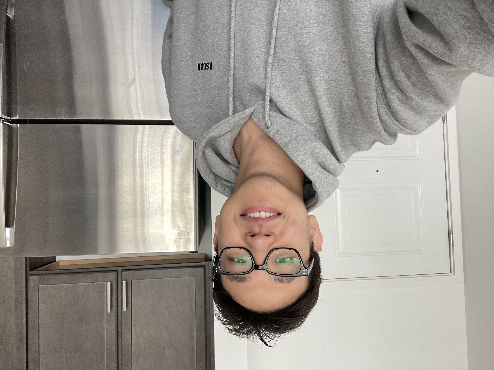

# whoami

Hi, I'm Wook.

I work as a cybersecurity engineer, but offensive security is where my real interest lies.

I write up the boxes and labs I solve: HackTheBox, Proving Grounds, TryHackMe, and Web Security Academy.

- [x] ~~Studying for OSCP~~ OSCP Certified — 3/2/2026
- [ ] Studying for BSCP (Burp Suite Certified Practitioner)

<a href="https://www.linkedin.com/in/leewookb"><svg width="15" height="15" viewBox="0 0 24 24" fill="currentColor" style="vertical-align: -2px;"><path d="M20.447 20.452h-3.554v-5.569c0-1.328-.027-3.037-1.852-3.037-1.853 0-2.136 1.445-2.136 2.939v5.667H9.351V9h3.414v1.561h.046c.477-.9 1.637-1.85 3.37-1.85 3.601 0 4.267 2.37 4.267 5.455v6.286zM5.337 7.433c-1.144 0-2.063-.926-2.063-2.065 0-1.138.92-2.063 2.063-2.063 1.14 0 2.064.925 2.064 2.063 0 1.139-.925 2.065-2.064 2.065zm1.782 13.019H3.555V9h3.564v11.452zM22.225 0H1.771C.792 0 0 .774 0 1.729v20.542C0 23.227.792 24 1.771 24h20.451C23.2 24 24 23.227 24 22.271V1.729C24 .774 23.2 0 22.222 0h.003z"/></svg> linkedin.com/in/leewookb</a> &nbsp;&middot;&nbsp; <a href="mailto:leewookb@gmail.com"><svg width="15" height="15" viewBox="0 0 24 24" fill="none" stroke="currentColor" stroke-width="2" stroke-linecap="round" stroke-linejoin="round" style="vertical-align: -2px;"><path d="M4 4h16a2 2 0 0 1 2 2v12a2 2 0 0 1-2 2H4a2 2 0 0 1-2-2V6a2 2 0 0 1 2-2z"/><path d="m22 6-10 7L2 6"/></svg> leewookb@gmail.com</a>

