# Building a Splunk Detection Lab - Part 1

This is the first post in a series on building a Splunk-based detection lab from scratch. The goal is not just to get Splunk running, but to end up with an environment where I can simulate attacks, collect the resulting telemetry, and write detections against it.

# Lab Architecture

Three virtual machines on an isolated host-only network. Kali attacks the Windows endpoint, Sysmon and the Splunk Universal Forwarder ship the resulting logs to the Splunk server, and analysis happens from there.

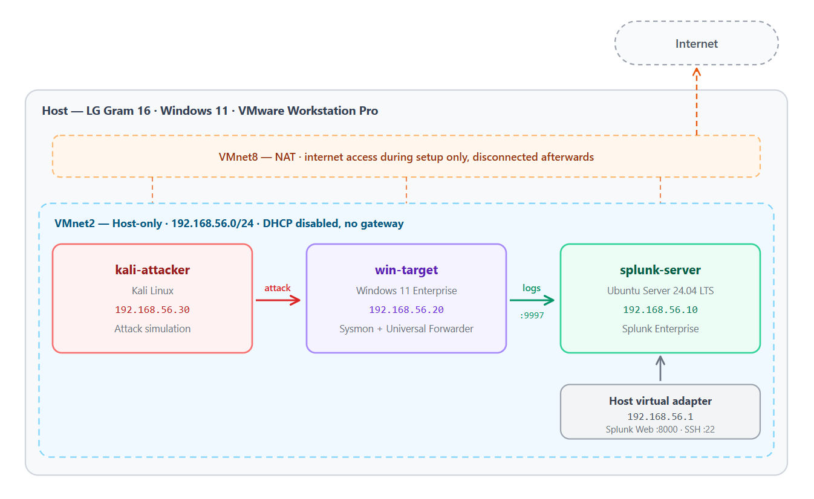

| VM              | Role                                                | Static IP     | vCPU | RAM  | Disk   |
| --------------- | --------------------------------------------------- | ------------- | ---- | ---- | ------ |
| `splunk-server` | Ubuntu Server 24.04 LTS, Splunk Enterprise          | 192.168.56.10 | 4    | 8 GB | 100 GB |
| `win-target`    | Windows 11 Enterprise, Sysmon + Universal Forwarder | 192.168.56.20 | 2    | 4 GB | 60 GB  |
| `kali-attacker` | Kali Linux                                          | 192.168.56.30 | 2    | 3 GB | 40 GB  |

Each VM gets two network adapters: NAT for internet access during setup, and a host-only adapter (`VMnet2`) carrying all lab traffic. Once setup is complete, the NAT adapter is disconnected on the Windows and Kali machines so that attack traffic is genuinely contained.

# Prerequisites

## Downloads

- Kali Linux (VMware image, not the ISO): https://www.kali.org/get-kali/#kali-virtual-machines

- Ubuntu Server 24.04 LTS: https://ubuntu.com/download/server

- Windows 11 Enterprise, 90-day evaluation: https://www.microsoft.com/en-us/evalcenter/download-windows-11-enterprise

## Workspace Folder and Defender Exclusion

I created a dedicated folder named `homelab-splunk` on my Desktop to hold both the installation media and the virtual machine files.

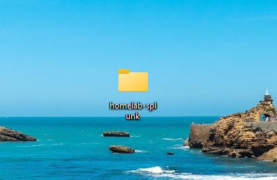

I then went to **Windows Security** - **Virtus & threat protection** - **Manage settings** - **Add or remove exclusions** - **Add an exclusion** - **Folder**, and added only `homelab-splunk`.

This step is important because when I start attack simulation later, Defender will happily reach into the VM's disk files, detect the payloads sitting inside the guest, and quarantine them and break the lab from the outside.

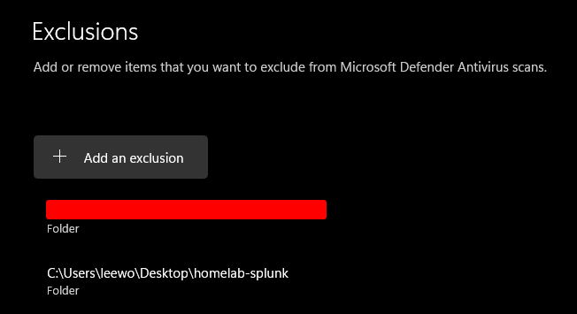

## Create an Isolated Virtual Network

This step creates a dedicated network path where Kali attacks Windows and the resulting logs are sent to Splunk. They key is to make sure that practice traffic stays isolated and does not leak onto my real home network.

1. Run VMware Workstation as Administrator.
2. Select `Edit` - `Virtual Network Editor`
3. Select `Change Settings` on the bottom right in the Virtual Network Editor.

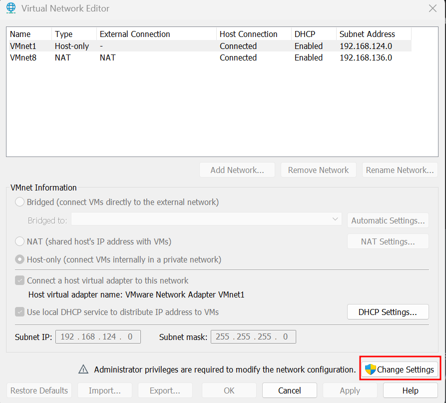

Select **Add a Virtual Network** and **VMnet2**.

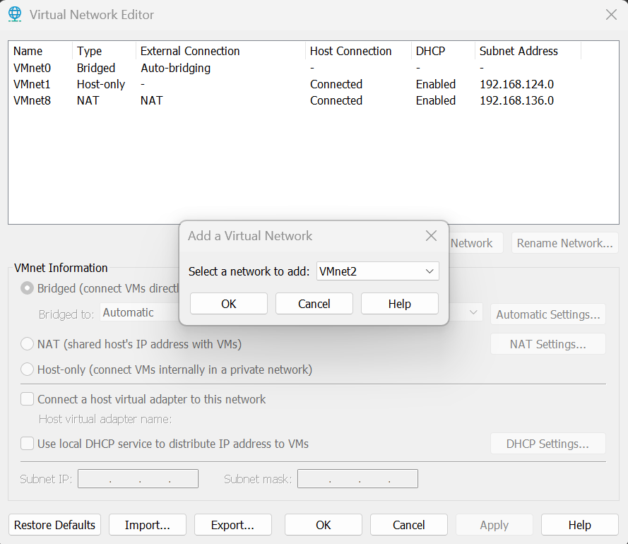

Configure VMnet2 as below:

- Select **Host-only (connect VMs internally in a private network)**
- Check **Connect a host virtual adapter to this network**
- Uncheck **Use local DHCP service to distribute IP addresses to VMs**
- Subnet IP: **192.168.56.0**
- Subnet mask: **255.255.255.0**

We disable DHCP so that all three machines can use static IP addresses. The **Splunk Forwarder** has the Splunk server's IP address hardcoded in its configuration file, so if the IP address changes after every reboot, log forwarding can silently stop working.

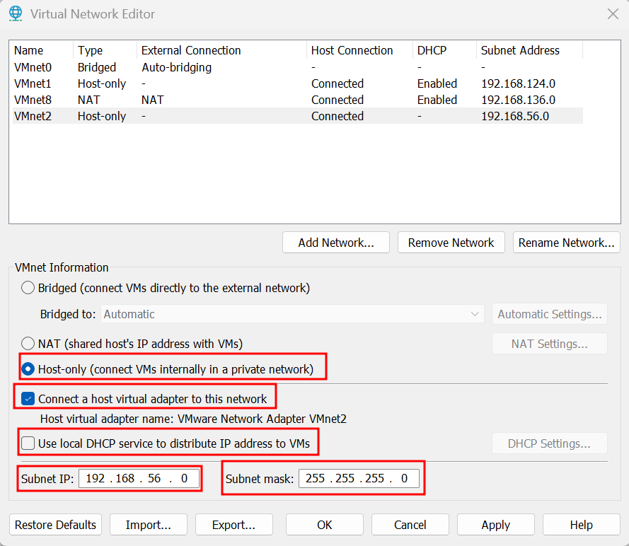

I opened up cmd prompt and entered the `ipconfig` command. I confirmed that VMnet2 was properly configured.

```
Ethernet adapter VMware Network Adapter VMnet2:

   Connection-specific DNS Suffix  . :
   Link-local IPv6 Address . . . . . : fe80::c93e:575b:d619:1647%40
   IPv4 Address. . . . . . . . . . . : 192.168.56.1
   Subnet Mask . . . . . . . . . . . : 255.255.255.0
   Default Gateway . . . . . . . . . :
```

# Ubuntu VM (Splunk Server)

## Creating the VM

I used **File** - **New Virtual Machine** - **Custom (advanced)** rather than Typical, because the network adapters and disk options need to bet set explicitly.

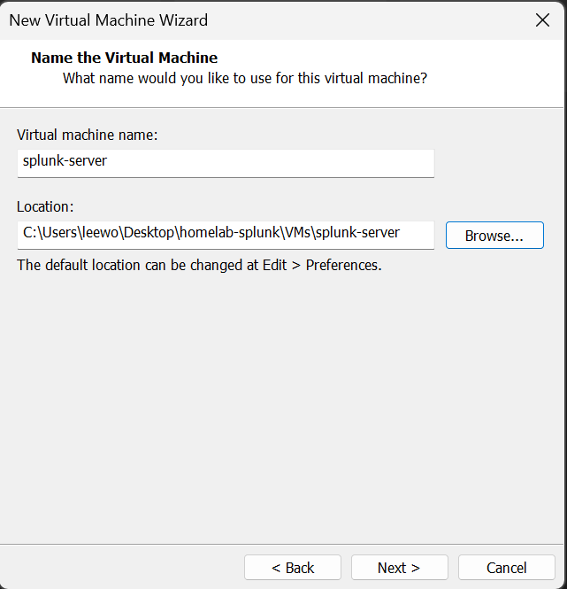

The final virtual machine settings are as below:

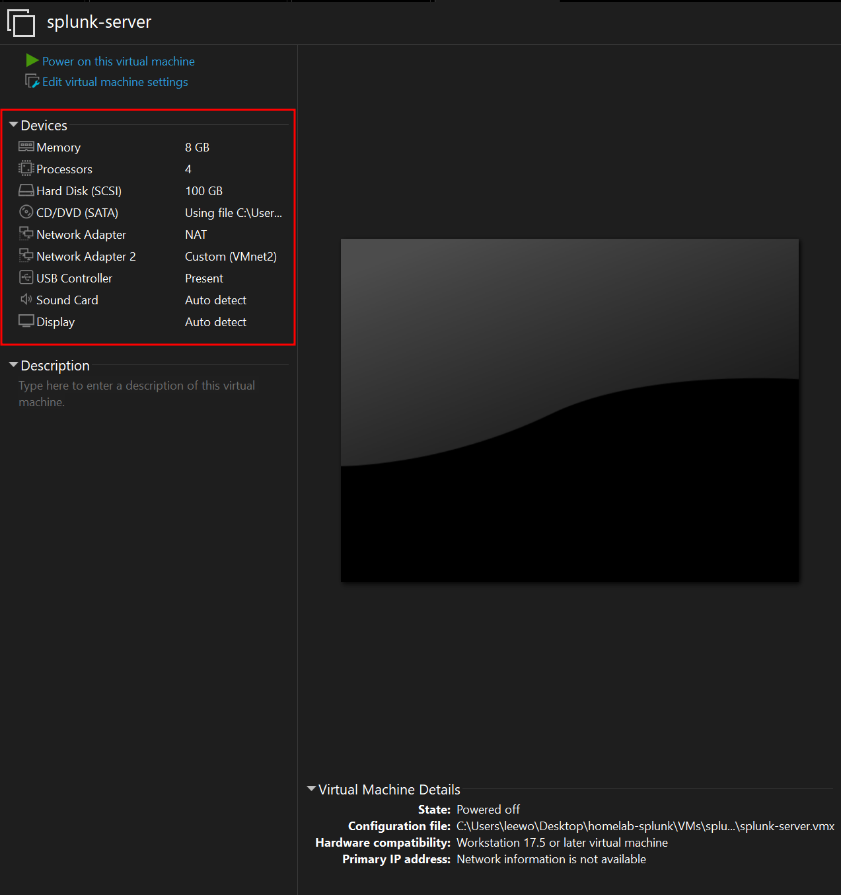

## Post-Install Verification

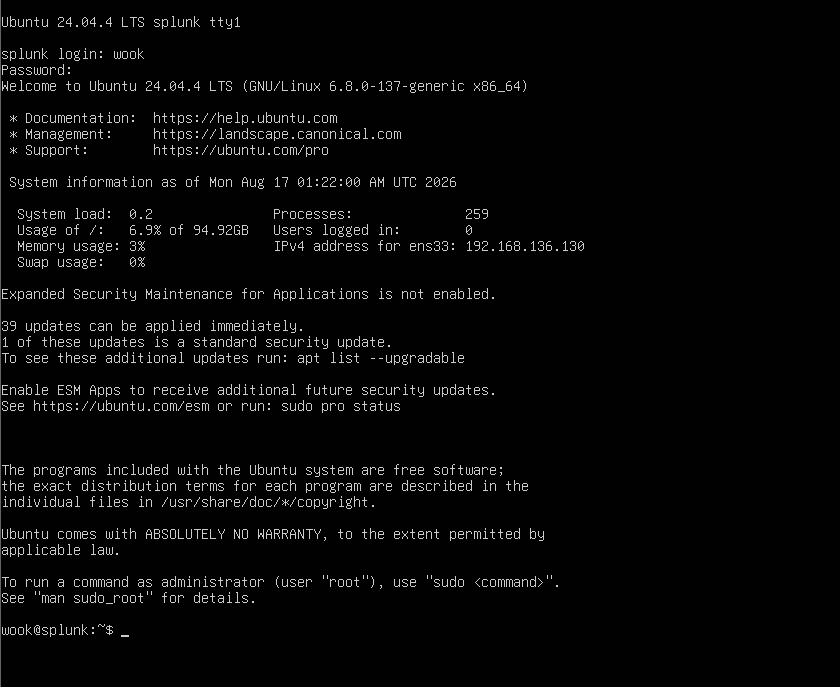

Checking the interfaces with `ip -br a` returned `ens33` and `ens34` as configured:

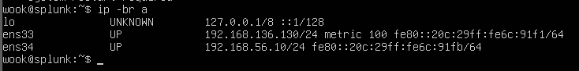

`ping -c 3 google.com` confirmed the VM had internet access through NAT, and I brought the system up to date before installing anything else:

```
sudo apt update && sudo apt upgrade -y
sudo reboot
```

## SSH Access

Working through the VMware console is workable but tedious, there is no copy-past, which matters once Splunk configuration files enter the picture. Enabling SSH lets me drive the server from a terminal on the host instead.

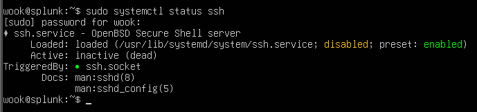

`inactive (dead)` and `disabled` are both correct here. Ubuntu 24.04 uses **socket activation** for SSH: instead of keeping the daemon resident, `ssh.socket` listens on port 22 and starts `ssh.service` on demand when a connection arrives. The line that matters is `TriggeredBy: ssh.socket`; the green dot indicates the socket is active and listening.

From cmd prompt on the host, I entered `ssh wook@192.168.56.10` and the connection succeeded.

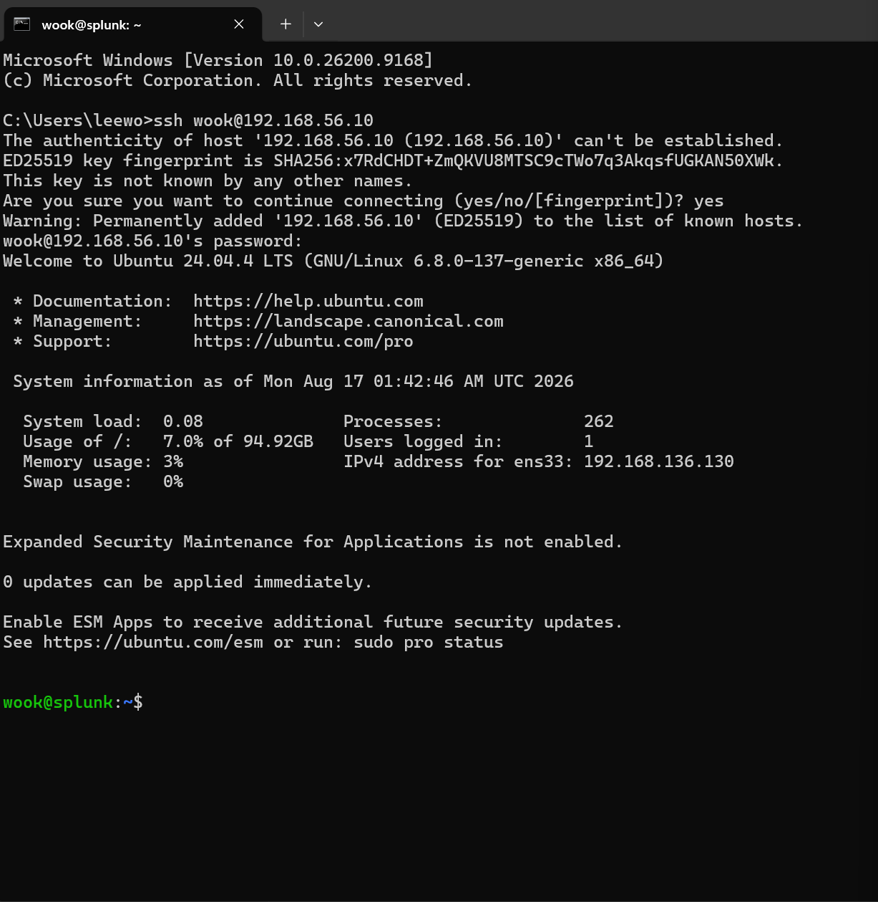

# Next

The server is provisioned, reachable, and correctly sized. Part 2 will cover installing Splunk Enterprise, configuring the receiving port, and standing up the Windows endpoint with Sysmon and the Universal Forwarder so that logs actually start flowing.

