Part 2. Time to install Splunk Enterprise.

# Part 2 Plan

1. Install Splunk Enterprise and confirm access to the Web UI
2. Configure it to start automatically on boot
3. Enable receiving on port 9997 (the channel the Forwarder will send logs through)
4. Install the Windows add-on
5. If there's time left, start building the Windows target VM

---

First, you need a Splunk account.

On the Splunk Enterprise download page, pick the **Linux** tab and choose **.deb**. Since the file needs to land on the VM rather than the host, click **Copy wget link** instead of the **Download Now** button.

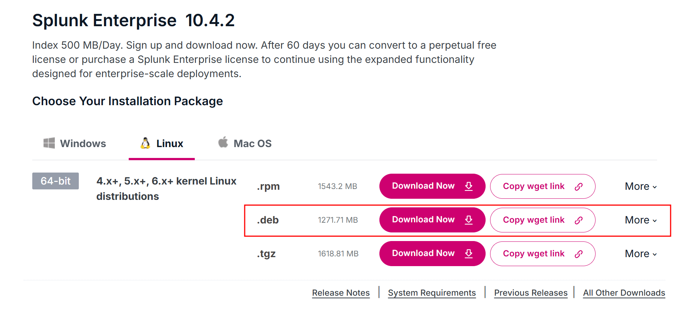

I SSH'd into the Ubuntu VM from Part 1, moved to `/tmp`, and pasted the copied link to download the installer.

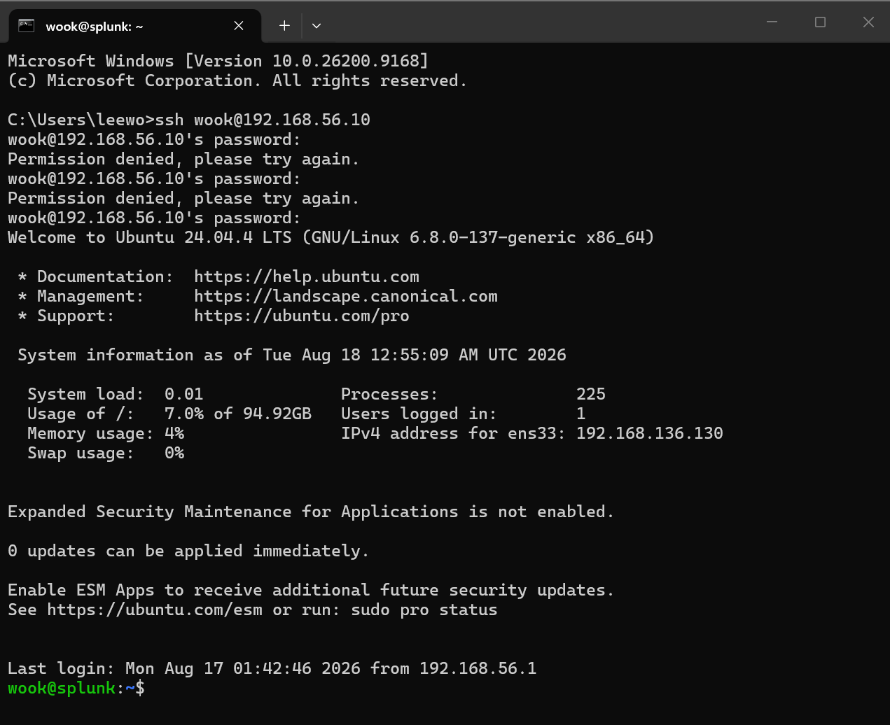

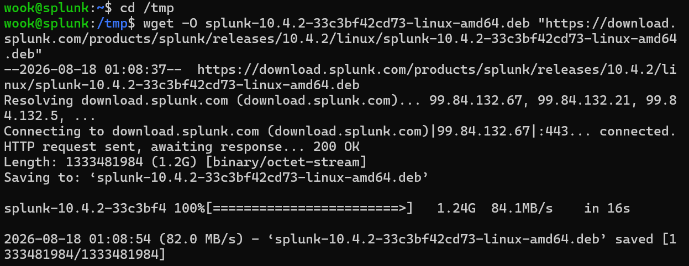

The installer comes in at about 1.3 GB.

```
wook@splunk:/tmp$ ls -lh /tmp/*.deb
-rw-rw-r-- 1 wook wook 1.3G Jul 28 21:03 /tmp/splunk-10.4.2-33c3bf42cd73-linux-amd64.deb
```

`dpkg` is the package manager for Debian-based Linux distributions, used mainly to install or remove `.deb` files. An easy way to remember the `-i` flag is that it stands for `--install`.

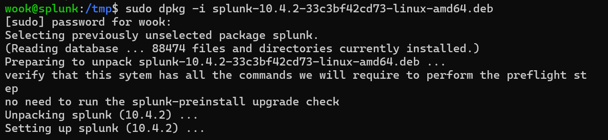

Next, sort out ownership.

- `chown` = change owner
- `splunk:splunk` = `user:group` format
- `-R` = Recursively

So this sets the owner of `/opt/splunk` along with every directory and file underneath it to the `splunk` user and the `splunk` group. The reason this matters: if those files end up writable only by `root`, the `splunk` user won't be able to write logs.

```
wook@splunk:/tmp$ cd /opt/splunk
wook@splunk:/opt/splunk$ sudo chown -R splunk:splunk /opt/splunk
```

Running `ls -la /opt/splunk` confirms that the directory and everything below it now belongs to the splunk user and splunk group.

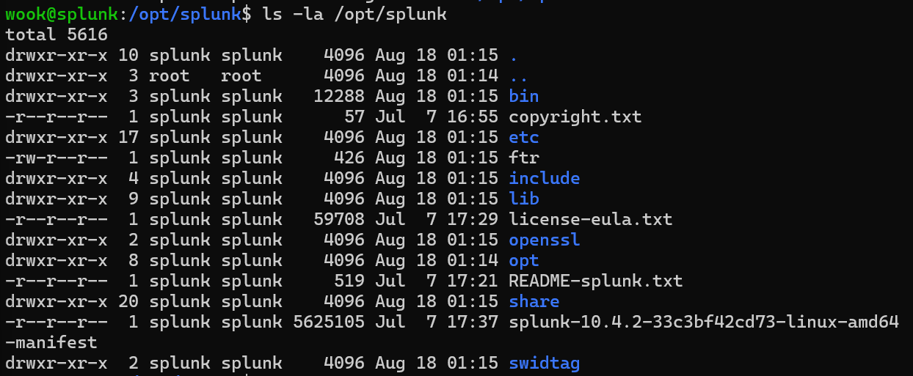

The command below starts Splunk for the first time as the `splunk` user while accepting the license.

```
sudo -u splunk /opt/splunk/bin/splunk start --accept-license
```

It then prompts for an administrator username and password.

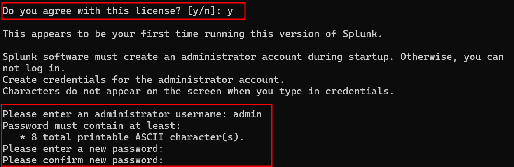

Once that finished, **http://192.168.56.10:8000** should have been reachable from the browser but it wasn't. So I switched to the `splunk` user and ran `/opt/splunk/bin/splunk status`, which came back with `splunkd is not running`.

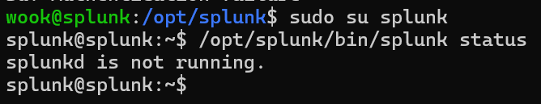

I re-ran the commands below and tried `192.168.56.10:8000` again and this time the Splunk Enterprise login page came up. Success!

```
wook@splunk:~$ sudo chown -R splunk:splunk /opt/splunk/
wook@splunk:~$ sudo -u splunk /opt/splunk/bin/splunk start
```

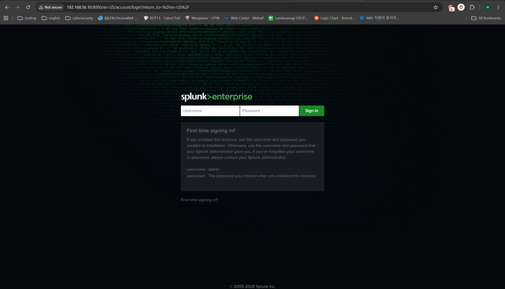

As things stand, Splunk won't come back up if the VM reboots. Starting it by hand every time gets old fast, so let's register it as a service.

First, stop the running instance.

```
wook@splunk:~$ sudo -u splunk /opt/splunk/bin/splunk stop
```

The command below is what makes Splunk start automatically when the server boots.

```
wook@splunk:~$ sudo /opt/splunk/bin/splunk enable boot-start -user splunk -systemd-managed 1
```

- `enable boot-start` = configures Splunk to start automatically at boot.
- Which means no more typing `sudo -u splunk /opt/splunk/bin/splunk start` every time.
- `-systemd-managed 1` hands start-up and service management over to systemd, so Splunk can be controlled through 
  - `systemctl start Splunkd`
  - `systemctl stop Splunkd`
  - `systemctl status Splunkd`, and so on.


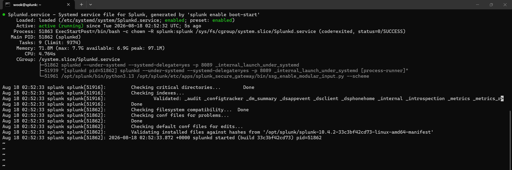

## Enabling Receiving on Port 9997

The Splunk server is ready. Now it needs a channel to receive the logs Windows will be sending. The Universal Forwarder sends to port 9997 by default, and our server isn't listening on it yet, so we have to turn it on.

Here's how to do it from the Web UI:

1. **Settings** - **Forwarding and receiving**
2. Click **Add new** next to**Configure receving** 
3. **Listen on this port: **`9997`
4. Save

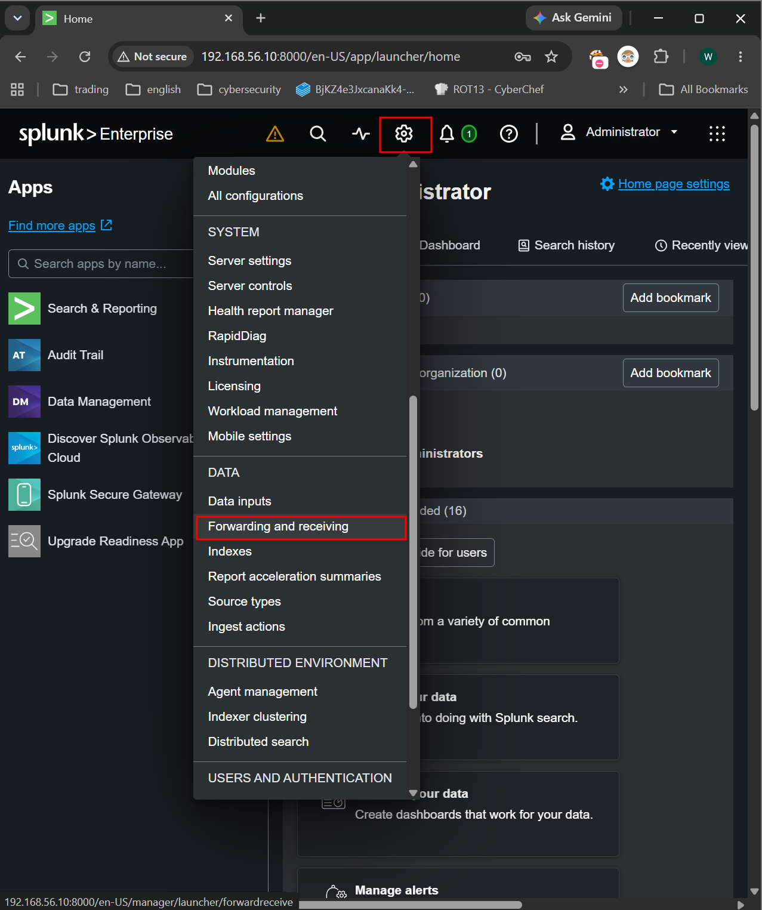

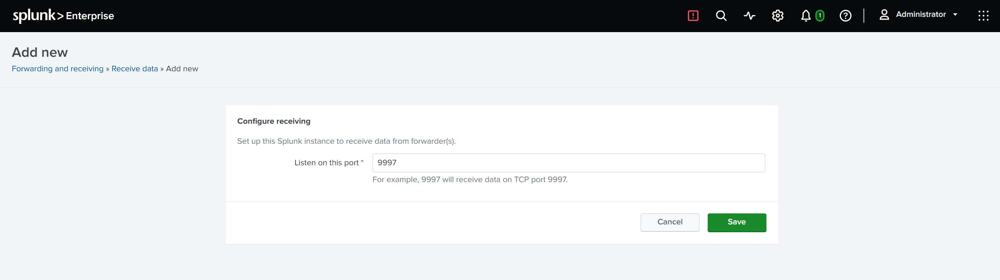

The same thing can be done from the CLI:

```
sudo -u splunk /opt/splunk/bin/splunk enable listen 9997 -auth admin:<password>
```

## Creating Indexes

Rather than dumping logs wherever they land, this step sends them to dedicated indexes. It means searches can be narrowed with `index=windows` later on, which helps with both speed and general housekeeping.

**Settings** - **Indexes** - **New Index**

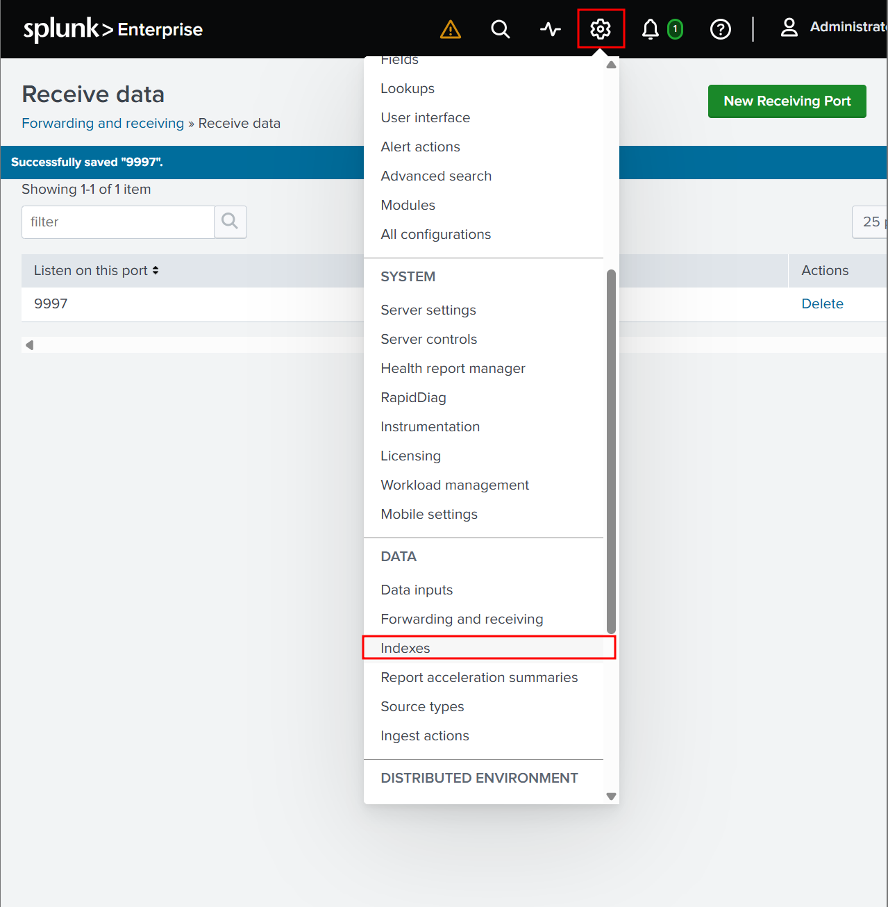

- **Index Name**: `windows`
- Leave everything else at its default
- **Save**

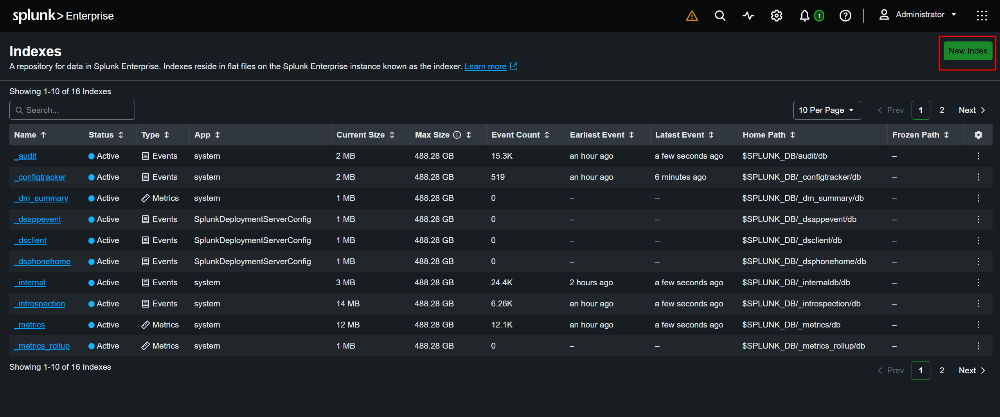

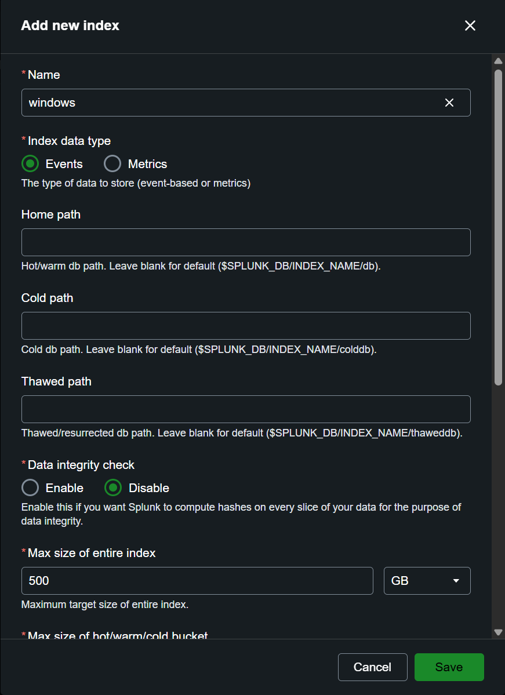

Claude also recommended creating a separate `sysmon` index, for the following reason:

`The reason to keep Sysmon separate from the Windows event logs is volume. Sysmon records every process creation and network connection, so there's far more of it. Splitting the indexes lets you set different retention periods for each, and makes it easier to stay under the 500 MB/day cap on the free license.`

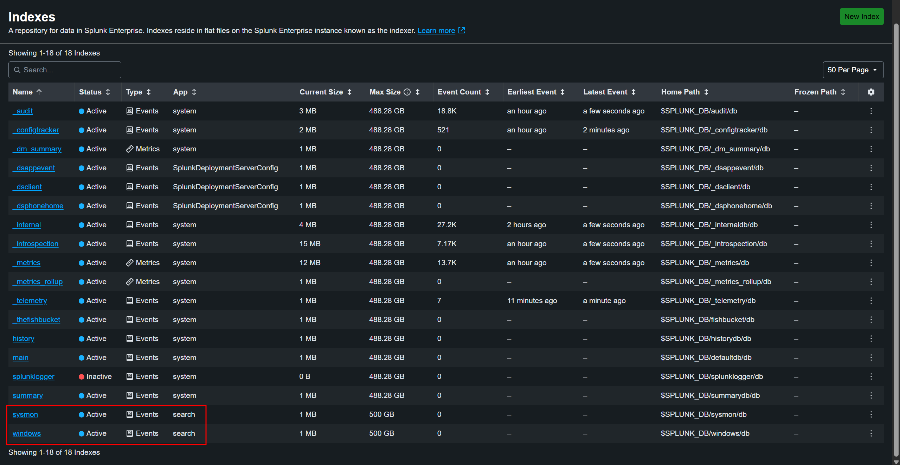

I had hoped to get to the Windows VM as well, but that's not happening in this part of the series. Stopping here. I'm a little paranoid, so I took a snapshot of the Ubuntu VM and named it `01-splunk-installed`.

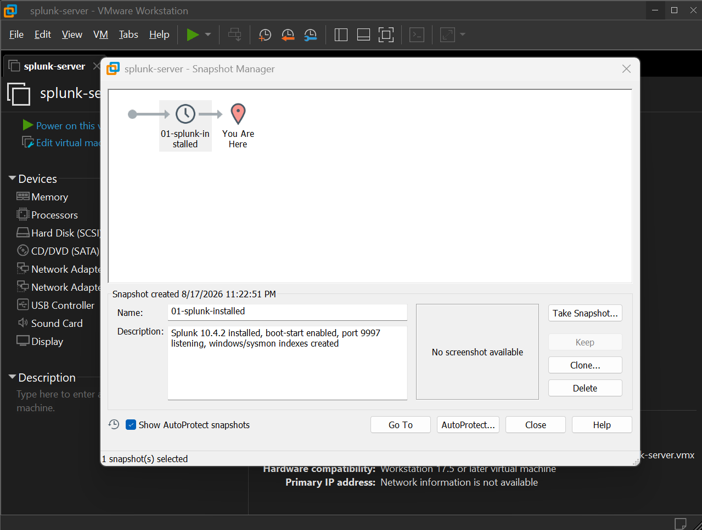