Part 3. Let's Build the Windows Box That Sends the Logs

# 오늘 할 일

1. Create the Windows 11 VM
2. Install Windows + set a static IP of 192.168.56.20
3. Install Sysmon
4. Install the Universal Forwarder and point it at Splunk
5. Confirm logs are actually landing in Splunk

---

## Creating the VM

`File` - `New Virtual Machine` - `Custom (advanced)` - `Next`

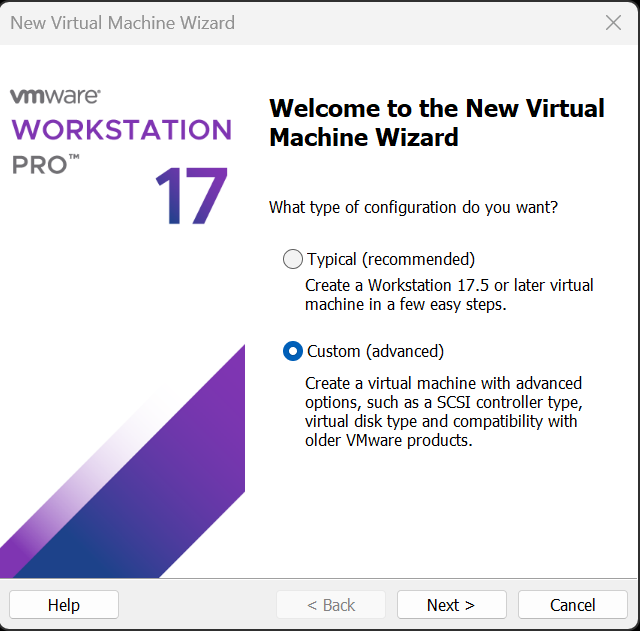

I actually took step-by-step screenshots of the whole setup wizard and then deleted them all, because they didn't feel like they added anything. Here's how my Windows VM ended up configured.

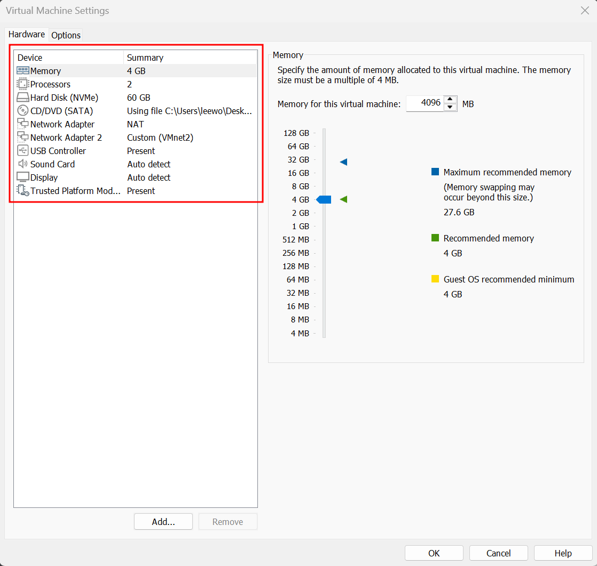

Once Windows finished installing, I installed `VMware Tools`. Why bother:

- The resolution follows along when you resize the VMware window. Right now the screen is tiny.
- Copy-paste works between the host and the VM.
- The mouse moves in and out freely without `Ctrl+Alt`. Right now I have to keep hitting `Ctrl+Alt` every time I want out of the VM.

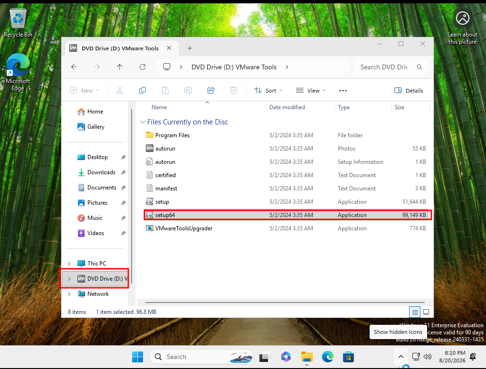

## Setting a static IP on Windows

Time to pin down the IP on this box too. `Win + R` - `ncpa.cpl` - Enter

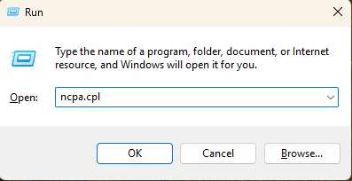

There are two adapters in here.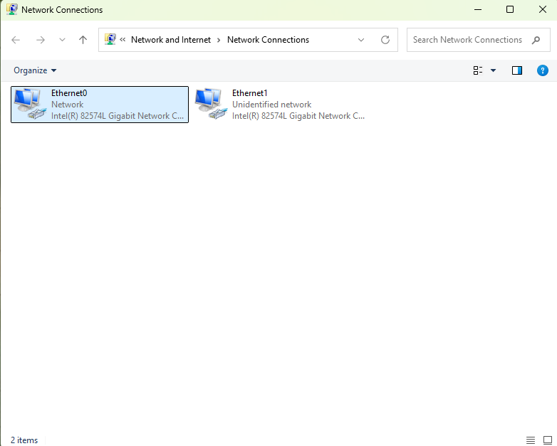

The names don't tell you much, so go by IP instead. The first adapter has `192.168.136.131`, that's the NAT one.

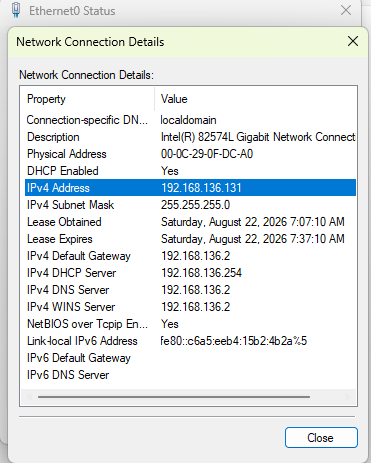

The one we care about isn't NAT, it's `VMnet2`.

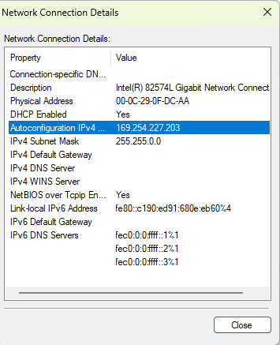

`Properties` - double click `Internet Protocol Version 4 (TCP/IPv4)`, pick `Use the following IP address`, and set the statc IP below.

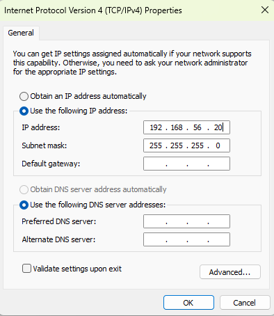

I confirmed the change with `ipconfig` in PowerShell, and pings to the Splunk server go through fine.

```
PS C:\Users\analyst> ipconfig

Windows IP Configuration


Ethernet adapter Ethernet1:

   Connection-specific DNS Suffix  . :
   Link-local IPv6 Address . . . . . : fe80::c190:ed91:680e:eb60%4
   IPv4 Address. . . . . . . . . . . : 192.168.56.20
   Subnet Mask . . . . . . . . . . . : 255.255.255.0
   Default Gateway . . . . . . . . . :

Ethernet adapter Ethernet0:

   Connection-specific DNS Suffix  . : localdomain
   Link-local IPv6 Address . . . . . : fe80::c6a5:eeb4:15b2:4b2a%5
   IPv4 Address. . . . . . . . . . . : 192.168.136.131
   Subnet Mask . . . . . . . . . . . : 255.255.255.0
   Default Gateway . . . . . . . . . : 192.168.136.2
PS C:\Users\analyst> ping 192.168.56.10

Pinging 192.168.56.10 with 32 bytes of data:
Reply from 192.168.56.10: bytes=32 time<1ms TTL=64
Reply from 192.168.56.10: bytes=32 time<1ms TTL=64
Reply from 192.168.56.10: bytes=32 time<1ms TTL=64
Reply from 192.168.56.10: bytes=32 time<1ms TTL=64

Ping statistics for 192.168.56.10:
    Packets: Sent = 4, Received = 4, Lost = 0 (0% loss),
Approximate round trip times in milli-seconds:
    Minimum = 0ms, Maximum = 0ms, Average = 0ms
```

After that, I went into `Windows Security` - `Virus & threat protection` and turned all of these **Off**:

- Tamper Protection
- Real-time protection
- Cloud-delivered protection
- Automatic sample submission

This is so my attack simulation payloads don't get deleted before they even get a chance to run.

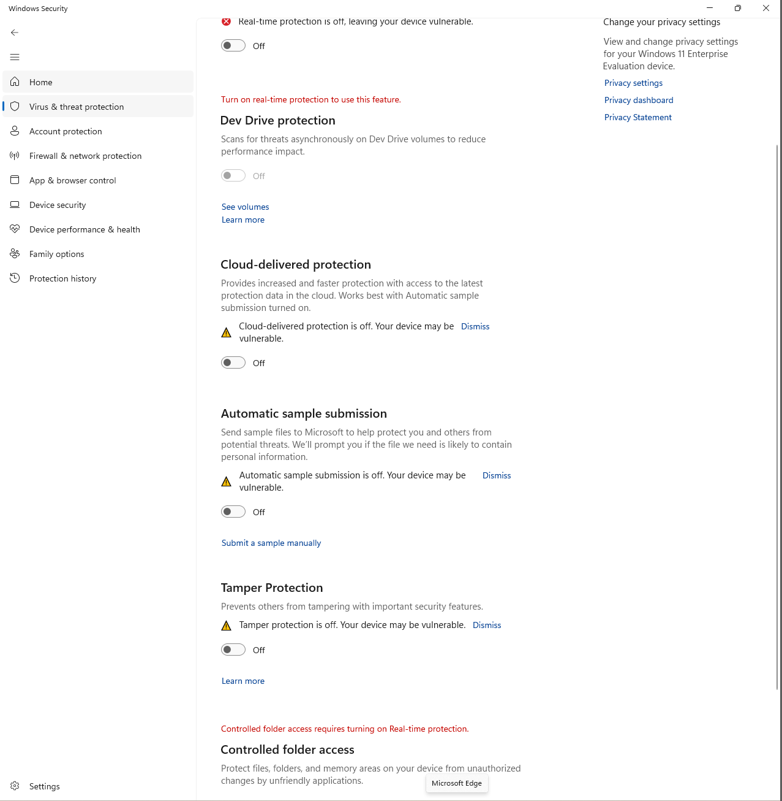

## Downloading Sysmon

Stock Windows event logs only get you so far for detection, so let's grab Sysmon. It's a Sysinternals tool that records things like process creation, network connections, file creation, and registry changes in real detail.

The SwiftOnSecurity file is a Sysmon config. From what I gather, it's a community-vetted starting point that's been around a long time, so a lot of people use it.

*Sysmon download*

```
https://download.sysinternals.com/files/Sysmon.zip
```

*Config file (SwiftOnSecurity)*

```
https://raw.githubusercontent.com/SwiftOnSecurity/sysmon-config/master/sysmonconfig-export.xml
```

I made a `C:\Tools` folder and dropped Sysmon64.exe and the config file in there.

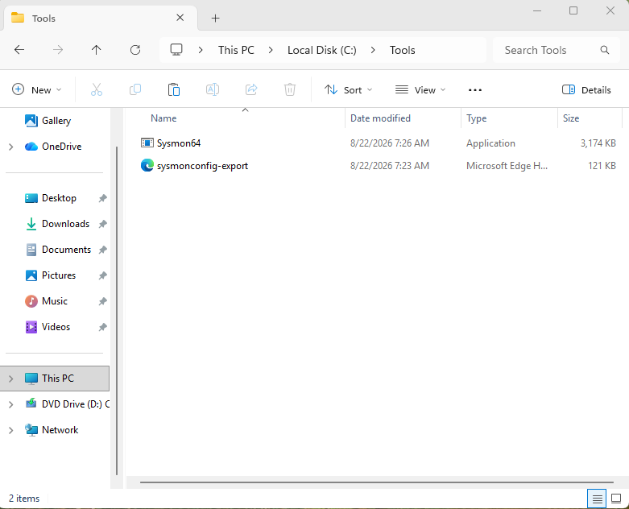

Open PowerShell as administrator and run the command below. Here's what a successful install looks like:

```
PS C:\Tools> .\Sysmon64.exe -accepteula -i sysmonconfig-export.xml


System Monitor v15.21 - System activity monitor
By Mark Russinovich and Thomas Garnier
Copyright (C) 2014-2026 Microsoft Corporation
Using libxml2. libxml2 is Copyright (C) 1998-2012 Daniel Veillard. All Rights Reserved.
Sysinternals - www.sysinternals.com

Loading configuration file with schema version 4.50
Sysmon schema version: 4.91
Configuration file validated.
Sysmon64 installed.
SysmonDrv installed.
Starting SysmonDrv.
SysmonDrv started.
Starting Sysmon64..
Sysmon64 started.
```

Sysmon logs go to a different channel than regular Windows logs.

```
Microsoft-Windows-Sysmon/Operational
```

In Event Viewer that's `Applications and Services Logs` - `Microsoft` - `Windows` - `Sysmon` - `Operational`. This is the exact path I'll be pointing the Forwarder at later.

## Installing the Universal Forwarder

The Splunk Enterprise I installed back in Part 1 is what receives, stores, and searches the logs. The Universal Forwarder I'm installing here on the `win-target` box is what collects logs as they're generated and ships them over to Splunk.

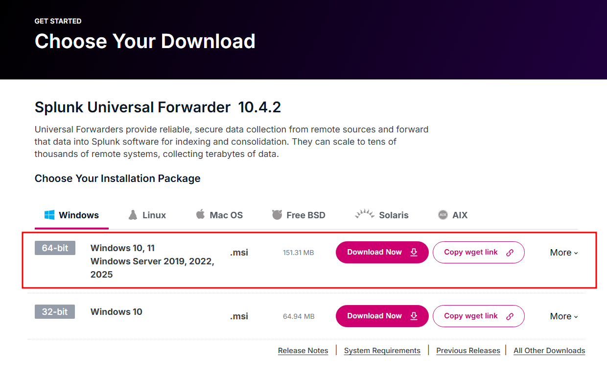

Check `Application Logs`, `Security Log`, and `System Log`, and then leave the rest empty.

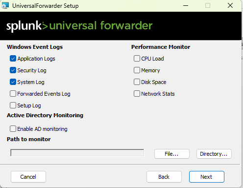

Port 9997 on our Splunk server is the door the logs come in through.

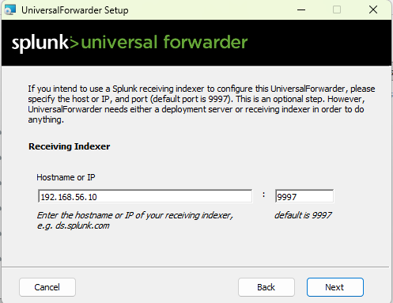


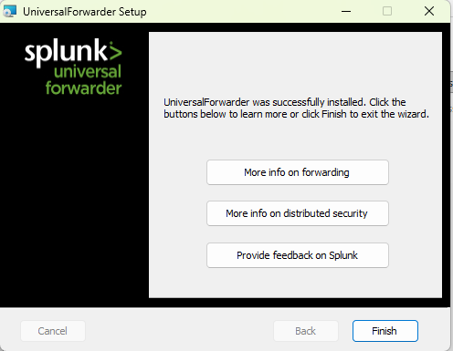


```
Windows PowerShell
Copyright (C) Microsoft Corporation. All rights reserved.

Install the latest PowerShell for new features and improvements! https://aka.ms/PSWindows

PS C:\WINDOWS\system32> get-service splunkforwarder

Status   Name               DisplayName
------   ----               -----------
Running  SplunkForwarder    splunkforwarder
```

Universal Forwarder is up and running! The isolated path from `192.168.56.20` to `192.168.56.10:9997` is alive, and Splunk is receiving and indexing.

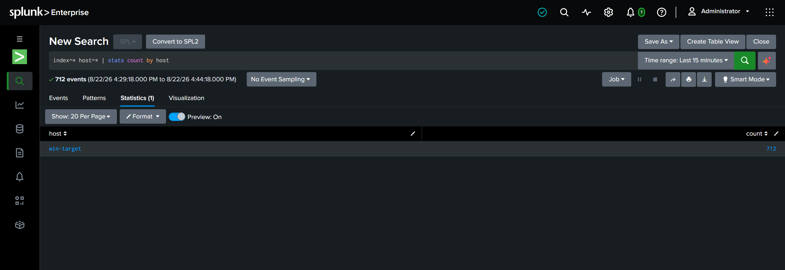

## Editing `inputs.conf`

```powershell
PS C:\WINDOWS\system32> cd "C:\Program Files\SplunkUniversalForwarder\etc\apps\SplunkUniversalForwarder\local\"
PS C:\Program Files\SplunkUniversalForwarder\etc\apps\SplunkUniversalForwarder\local> dir


    Directory: C:\Program Files\SplunkUniversalForwarder\etc\apps\SplunkUniversalForwarder\local


Mode                 LastWriteTime         Length Name
----                 -------------         ------ ----
-a----         8/22/2026   9:41 AM             33 app.conf
-a----         8/22/2026   9:41 AM            319 inputs.conf
```

The three WinEventLog stanzas I checked during install are all there, but none of them specify an index.

```powershell
PS C:\Program Files\SplunkUniversalForwarder\etc\apps\SplunkUniversalForwarder\local> type .\inputs.conf

[WinEventLog://Application]
checkpointInterval = 5
current_only = 0
disabled = 0
start_from = oldest

[WinEventLog://Security]
checkpointInterval = 5
current_only = 0
disabled = 0
start_from = oldest

[WinEventLog://System]
checkpointInterval = 5
current_only = 0
disabled = 0
start_from = oldest
```

So I opened `inputs.conf` in Notepad and edited it like this:

- `index = windows` or `index = sysmon`. This decides which index the data goes to. Without it, everything lands in `main`. The windows and sysmon indexes I created earlier finally get used here.
- `[WinEventLog://Microsoft-Windows-Sysmon/Operational]` adds the Sysmon channel.
- `renderXml = false` sends Sysmon events in a human-readable form instead of raw XML. If you leave it `true`, Splunk shows you a blob of XML and field extraction becomes a pain.
- `start_from = oldest` reads the backlog already sitting in the channel. Sysmon has been recording for a while now, so all of that comes up first.

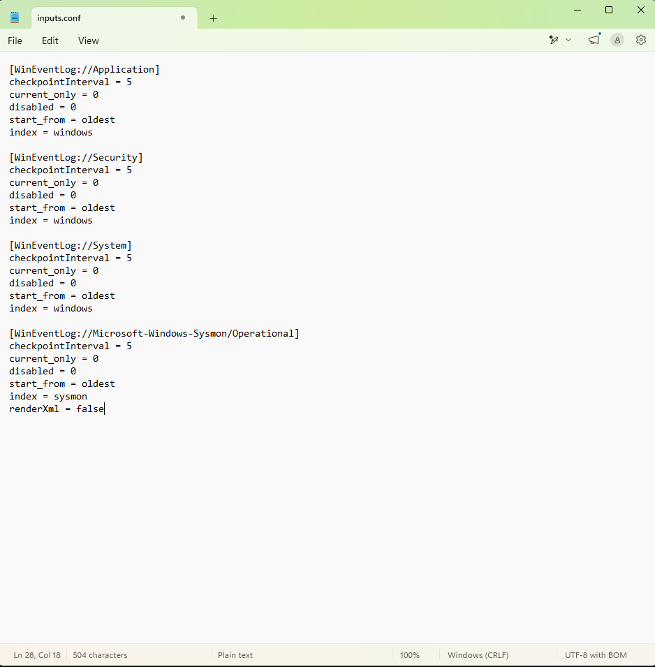

Now restart the Splunk Forwarder and check in Splunk Enterprise that the Sysmon and Windows events are landing in the `sysmon` and `windows` indexes respectively.

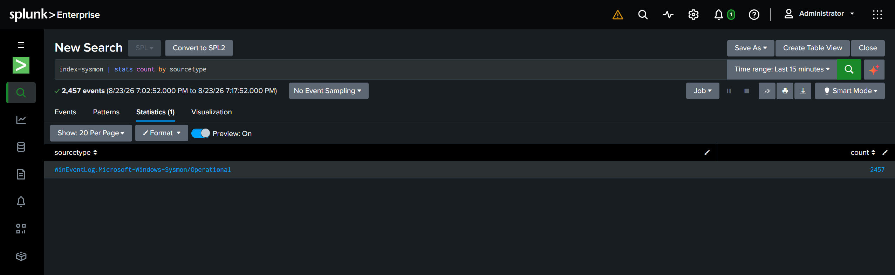

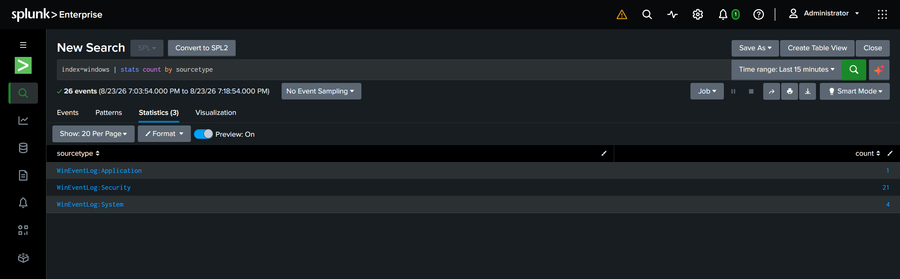

That's it for today. Done!