Write-up by wook413

https://bots.splunk.com/workshop/3JjIyhUc2P7hYfhkBW4OE3

```
This workshop is designed to be hands-on and is using the BOTS 1.0 dataset. The goal of this workshop is to provide a better understanding of how Splunk can be used to better answer security questions that may occur within your environment. During this workshop, we will introduce you to searching with Splunk and walkthrough questions that are similar to those in the BOTS competition and develop searches that will help answer them.
```

# Checkpoint #1

### Question #1

**Based on the stream:http sourcetype, what is the likely IP address scanning imreallynotbatman.com for web aplication vulnerabilities?**

The likely IP address scanning imreallynotbatman.com for web application vulnerabilities is `40.80.148.42`.

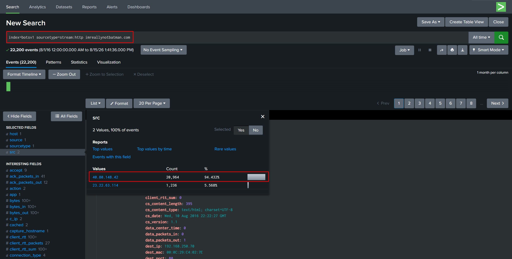

### Question #2

**Based on the suricata sourcetype what is most likely the IP address that is being scanned?**

After searching for `index=botxv1 sourcetype=suricata imreallynotbatman.com`, I selected the `dest_ip` field.

The IP address that is being scanned is `192.168.250.70`.

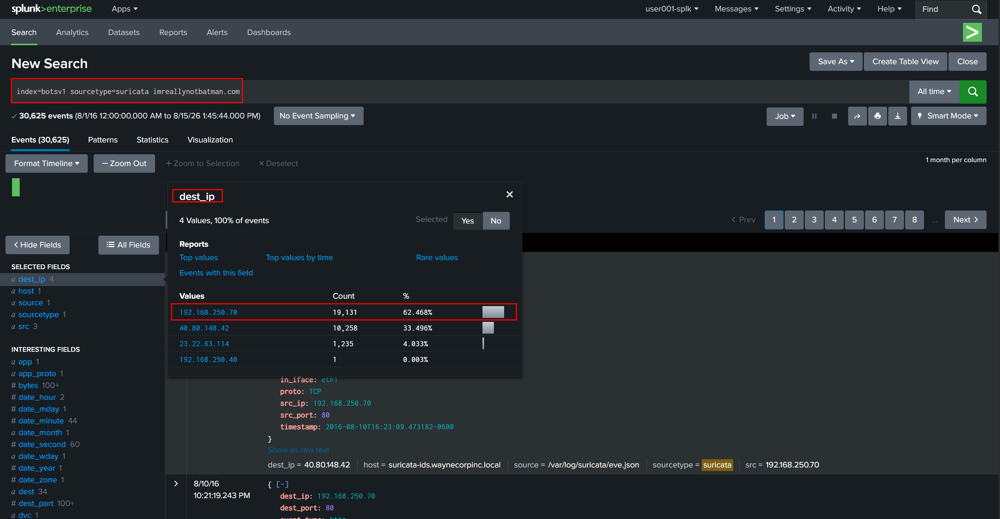

### Question #3

Based on IIS data, what user agent string is most frequently seen during the web scan?

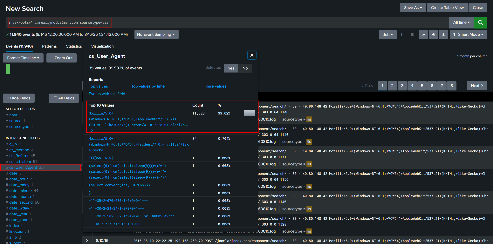

```
Mozilla/5.0+(Windows+NT+6.1;+WOW64)+AppleWebKit/537.21+(KHTML,+like+Gecko)+Chrome/41.0.2228.0+Safari/537.21
```

# Challenge Question #1 - stats and sort commands

If you recall from Checkpoint Question #1, the source address of the scan originated from 40.80.148.42. What are the top 10 URLs being returned during the scan on imreallynotbatman.com? Use August 10, 2016 for the timepicker.

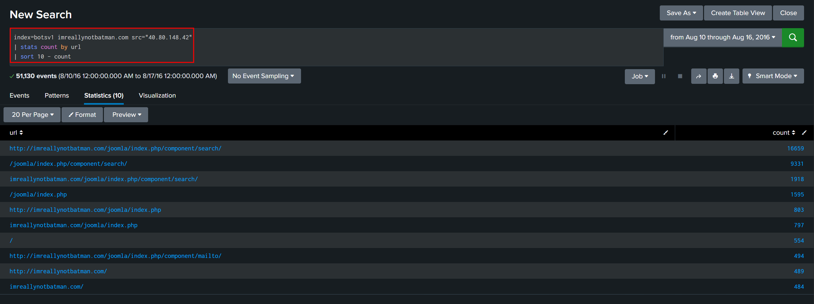

# Challenge Question #2 - wildcards

**What IP address is likely attempting a brute force password attack against imnotreallybatman.com?**

- Focus on the index of interest `botsv1`
- Look at http data specifically for interaction with web browser `stream:http`
- Look for traffic going to our web server `192.168.250.70`
- Look for data that is being sent to web server `post`
- Date Range is same as before `August 10, 2016`

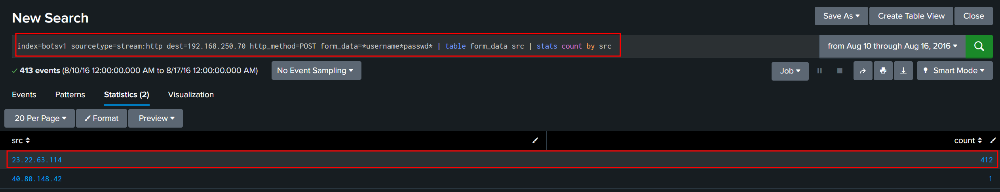

# Checkpoint #2

Interested in Activities on **August 10, 2016 ONLY**

### Question #1

**Based on the stream:http sourcetype, how many events had a http_user_agent that contained both OS X and Chrome? Provide a tabular list with the time, source address and the user agent strings.**

**Hint #1: OS X will not be found if you search for "osx"**

**Hint #2: time is a special field**

`index=botsv1 sourcetype=stream:http http_user_agent="*OS X*" http_user_agent="*chrome*" | table _time, src, http_user_agent`

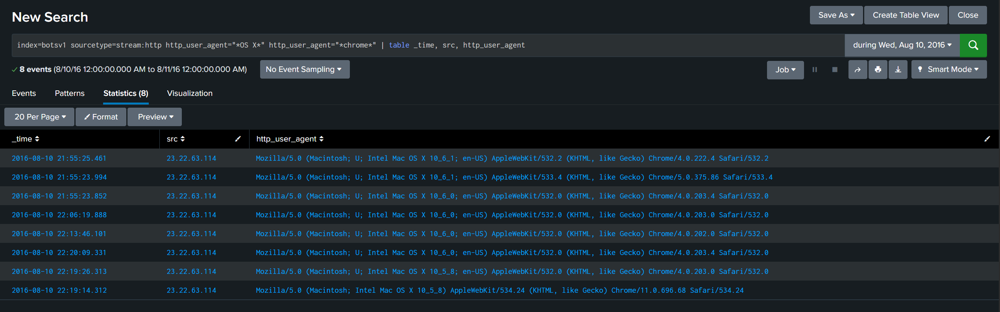

### Question #2

**Based on the stream:http sourcetype, what is most frequently seen URL that does NOT reference joomla? How many times do we see this URL?**

`489`

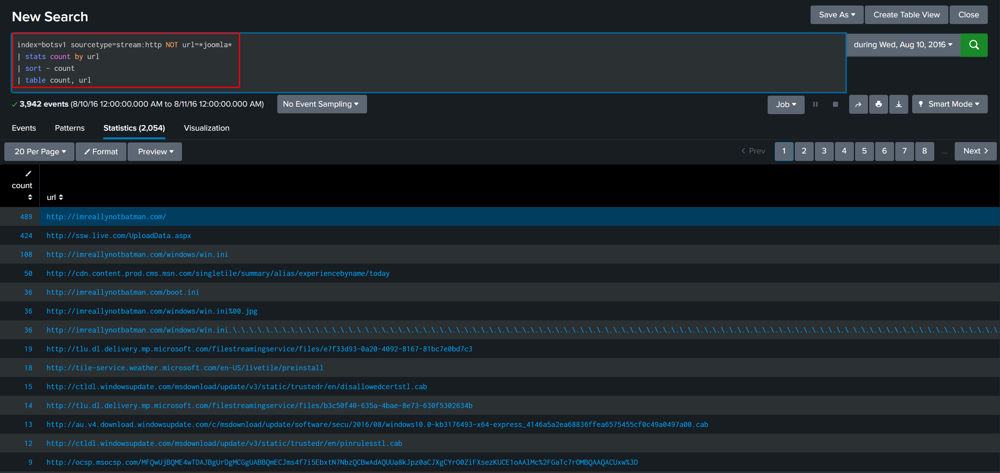

# Challenge Question #3 - Extracting Data at Search

**On August 10, 2016, what was the first brute force password used?**

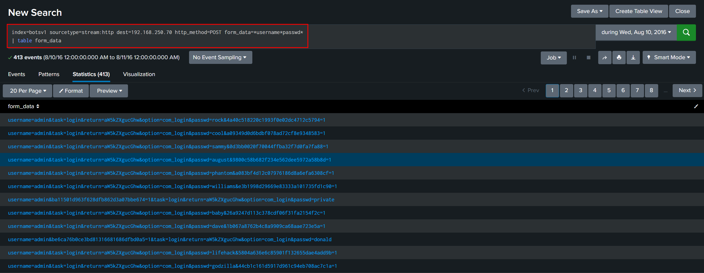

`12345678`

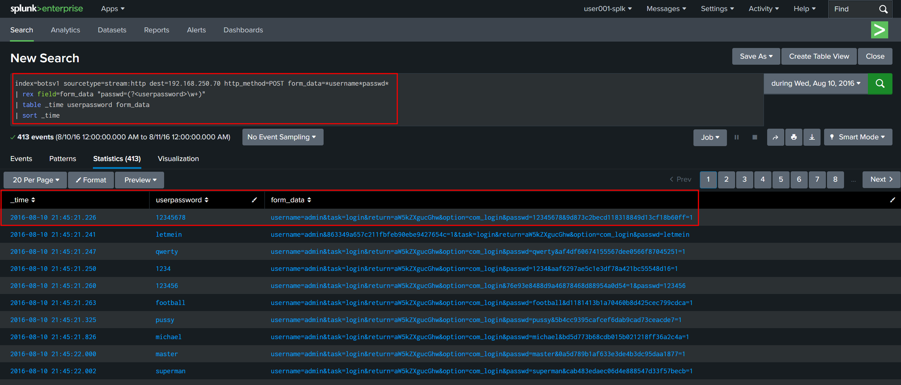

# Challenge Question #4 - Comparing Events Against Lists Using lookup and eval Commands

**Which six-character password in the brute force attack is also a Coldplay song?**

Hint: The lookup of Coldplay songs can be found at coldplay.csv

building on the previous search, I added the lenpassword column using `eval`.

```
index=botsv1 sourcetype=stream:http dest=192.168.250.70 http_method=POST form_data=*username*passwd*
| rex field=form_data "passwd=(?<userpassword>\w+)"
| eval lenpassword=len(userpassword)
| table form_data userpassword lenpassword
```

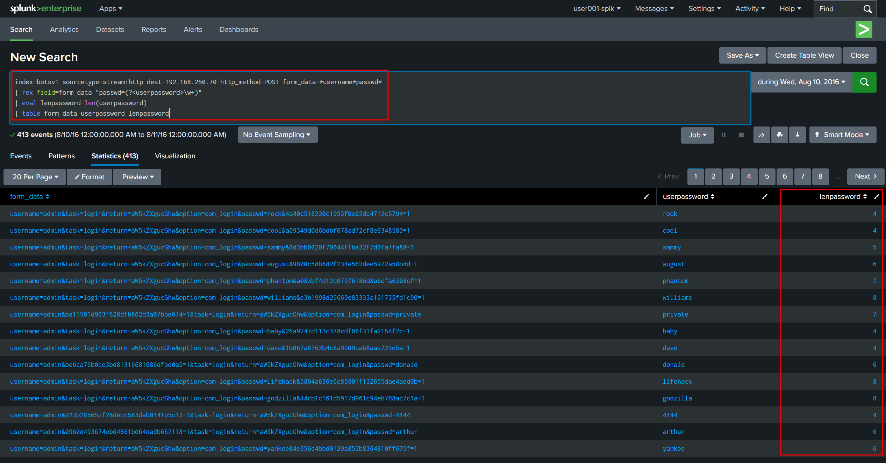

Then I searched for only passwords that have 6 characters long.

```
index=botsv1 sourcetype=stream:http dest=192.168.250.70 http_method=POST form_data=*username*passwd*
| rex field=form_data "passwd=(?<userpassword>\w+)"
| eval lenpassword=len(userpassword)
| search lenpassword=6
| table userpassword form_data
```

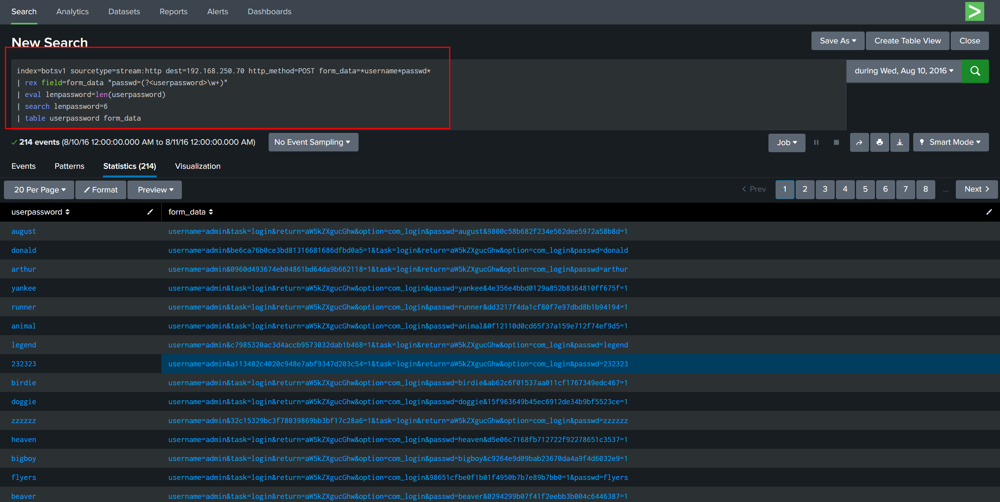

The lab already included `cp.csv` file which contains the Coldplay songs.

```
| inputlookup cp.csv
```

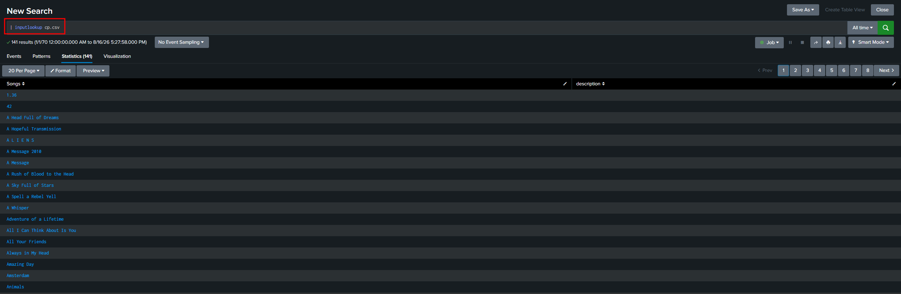

I converted the Songs values to lower case and call the new field `song`.

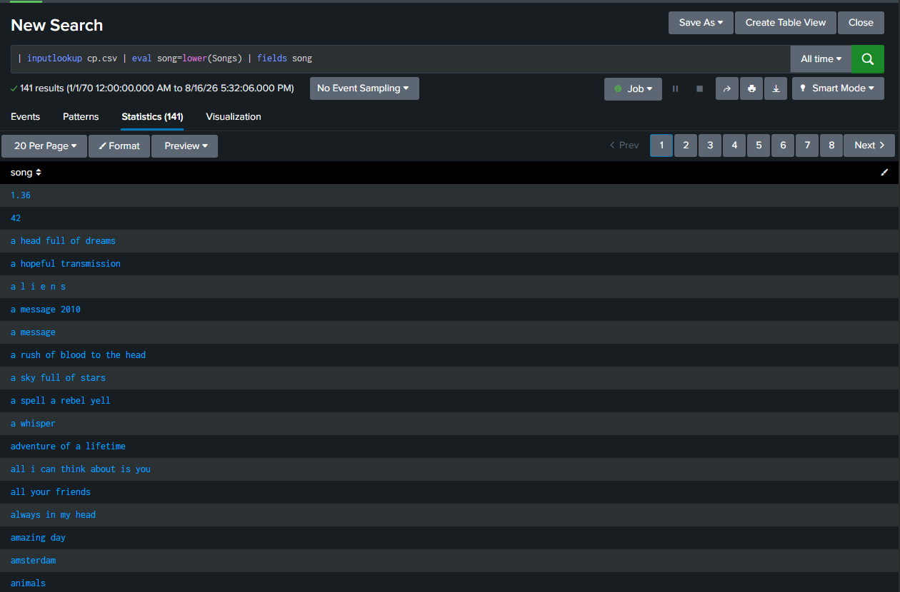

Now it's time to put everything together. The password that matched the coldplay song is `yellow`.

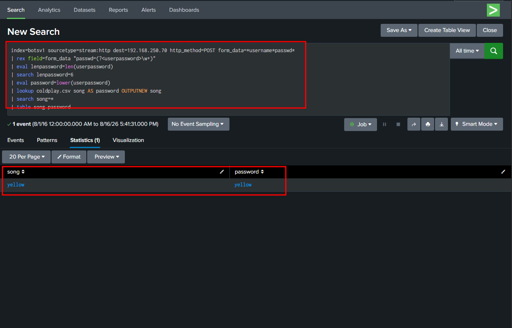

# Challenge Question #5

**Starting with the search below, write a search that shows us if any passwords were used more than once and if so, what IP addresses were they from? Output should include columns named src, count and userpassword**

```
index=botsv1 sourcetype=stream:http dest=192.168.250.70 http_method=POST form_data=*username*passwod*
| rex field=form_data "passwd=(?<userpassword>\w+)"
```

The list below is the passwords that were used more than once. Also the table shows the source IP address which originated each password.

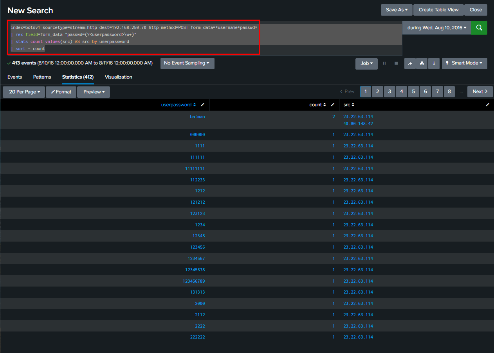

The SPL below finds HTTP POST requests containing a username and password, extracts the password, counts how many times each password was used, shows the source IPs, and sorts by the most-used password.

```
index=botsv1 sourcetype=stream:http dest=192.168.250.70 http_method=POST form_data=*username*passwd*
| rex field=form_data "passwd=(?<userpassword>\w+)"
| stats count values(src) AS src by userpassword
| sort - count
```

# Challenge Question #6

**What was the average password length used in the password brute forcing attempt, rounded to the nearest integer?**

```
index=botsv1 sourcetype=stream:http dest=192.168.250.70 http_method=POST form_data=*username*passwd*
| rex field=form_data "passwd=(?<userpassword>\w+)"
```

Building on the SPL above, I first calculate the length of a string (userpassword) using the eval command

```
| eval lenpassword=len(userpassword)
```

Then calculate the average of all the lengths using stats and rename it to avgpassword
```
| stats avg(lenpassword) AS avgpassword
```

Finally, use the eval command with the round function. Round the avgpassword field to 0 decimal places and put it into the average_password_length field.

```
| eval average_password_length=round(avgpassword,0)
```

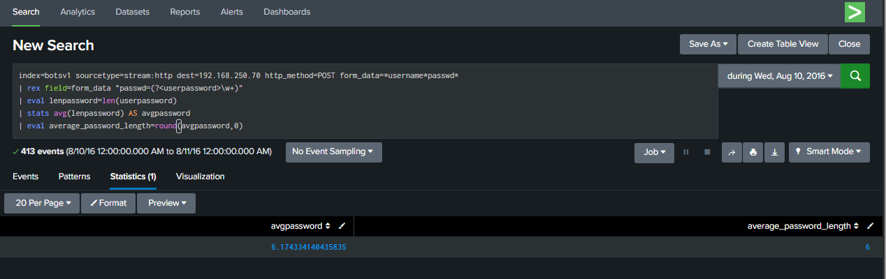

# Challenge Question #7

**Produce a line chart of the frequency of password attempts that were part of the brute force attack**

Hint #1: You many need to adjust the span to get a meaningful line

Hint#2: Check out the options for fixedrange

Hint#3: Use the visualization tab to select a good graphic

```
index=botsv1 sourcetype=stream:http dest=192.168.250.70 http_method=POST form_data=*username*passwd*
| rex field=form_data "passwd=(?<userpassword>\w+)"
```

I need to visualize the frequency of the brute force attack. To achieve this, I can use `timechart` command. This SPL simply means "Show me how many events happened every second, grouped by destination"

```
| timechart span=1s fixedrange=false count by dest
```

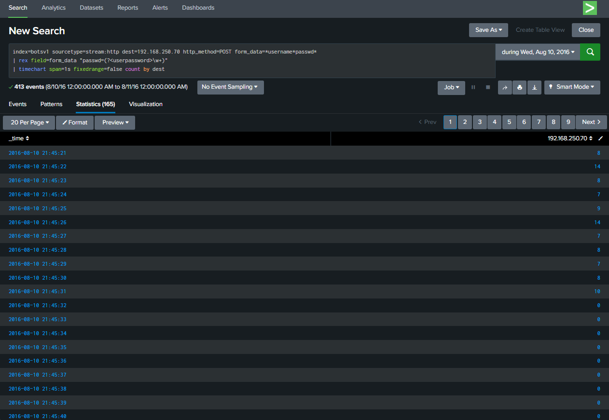

Here's the visualization of the SPL query when the span value is set to 1s.

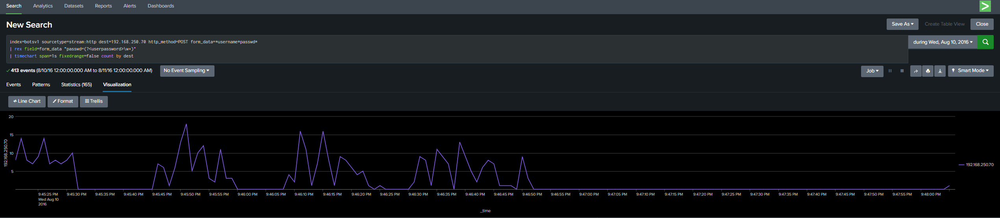

And here's the visualization when the span value is set to 1m instead.

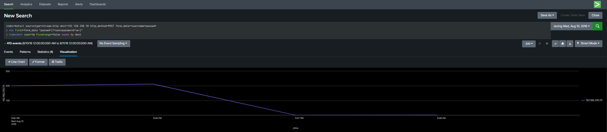

# Challenge Question #8

**How many seconds elapsed between the time we first saw the password batman and the time we saw it again? Round it to 2 decimals.**

Hint: Output the duration value which was created with the transaction command

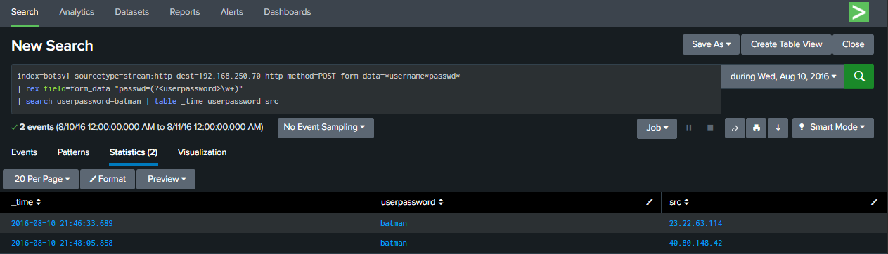

We can use eval command to calculate a difference but we can use transaction command. The transaction command can be used to group events together and it creates additional metafields called duration and eventcount.

```
index=botsv1 sourcetype=stream:http dest=192.168.250.70 http_method=POST form_data=*username*passwd*
| rex field=form_data "passwd=(?<userpassword>\w+)"
| search userpassword=batman
| transaction userpassword
| eval round_duration=round(duration,2)
| table userpassword duration round_duration
```

Duration is a value created with transaction that calculates the difference between the first and last even in seconds.

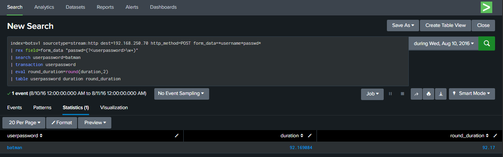

# Challenge Question #9

**Starting with the search below, return a count of the source addresses and their geolocation details, including city, state, country and latitude and longitude and overlay it on a map**

```
index=botsv1 sourcetype=stream:http dest=192.168.250.70
```

First, I added the SPL below to return a count of the source addresses.
```
| stats count by src
```

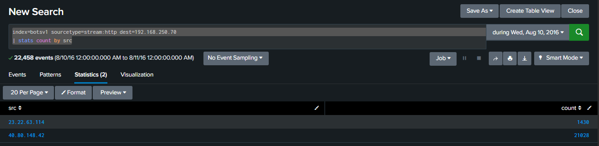

Then I appended `iplocation` command which returned the gelocation details of the source addresses.
```
| iplocation src
```

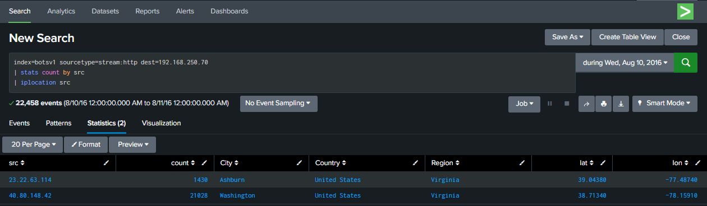

```
| geostats latfield=lat longfield=lon count by src
```

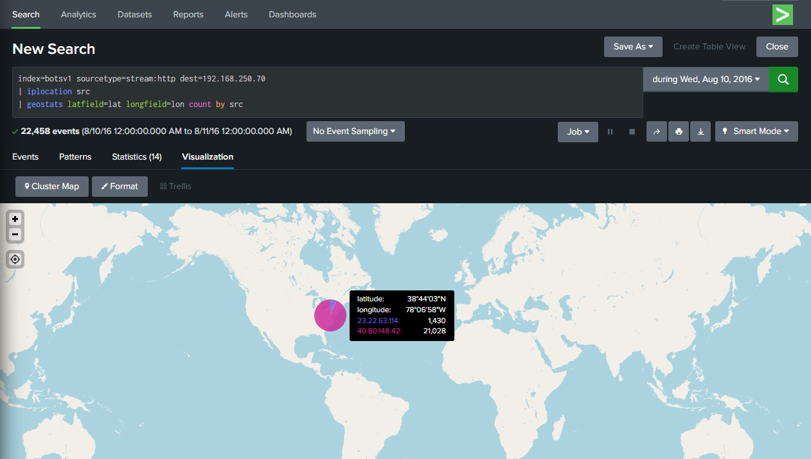

# Checkpoint #3

### Question 1

**On Auguest 24, 2016, how many characters were in the longest command executed? What was the name of the executable that was part of the command?**

Hint: Microsoft Sysmon is the data source

After setting the date as Aug 24, 2016, I first looked for Microsoft Sysmon data source. I was able to find `wineventlog:microsoft-windows-sysmon/operational`. The next step is to find the longest command executed.

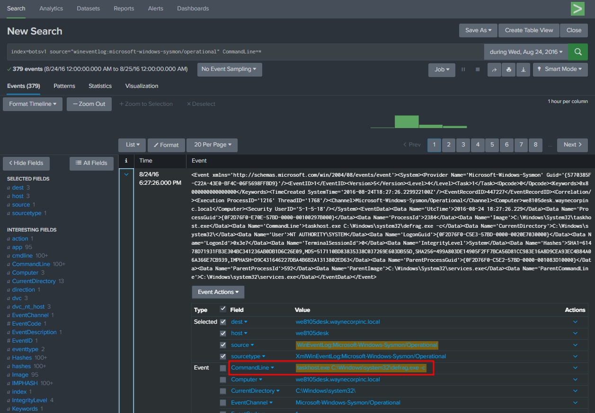

Made a new variable named `cmdLineLength` which contains the length of every CommandLine and I sorted them in descending order and returned the very first output.

```
index=botsv1 source="wineventlog:microsoft-windows-sysmon/operational" CommandLine=*
| eval cmdLineLength=len(CommandLine)
| table CommandLine cmdLineLength
| sort - cmdLineLength
| head 1
```

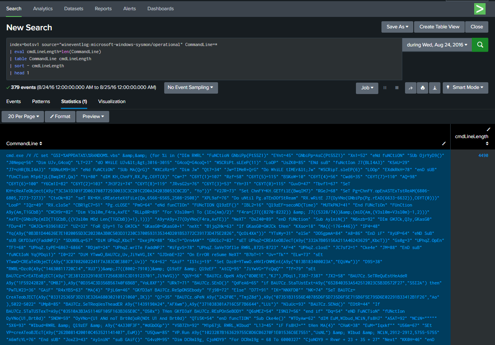

### Question 2

**Show the top 5 Windows Event Codes for the server we8105desk.waynecorpinc.local as a pie chart. The data range should be all day, August 24, 2016.**

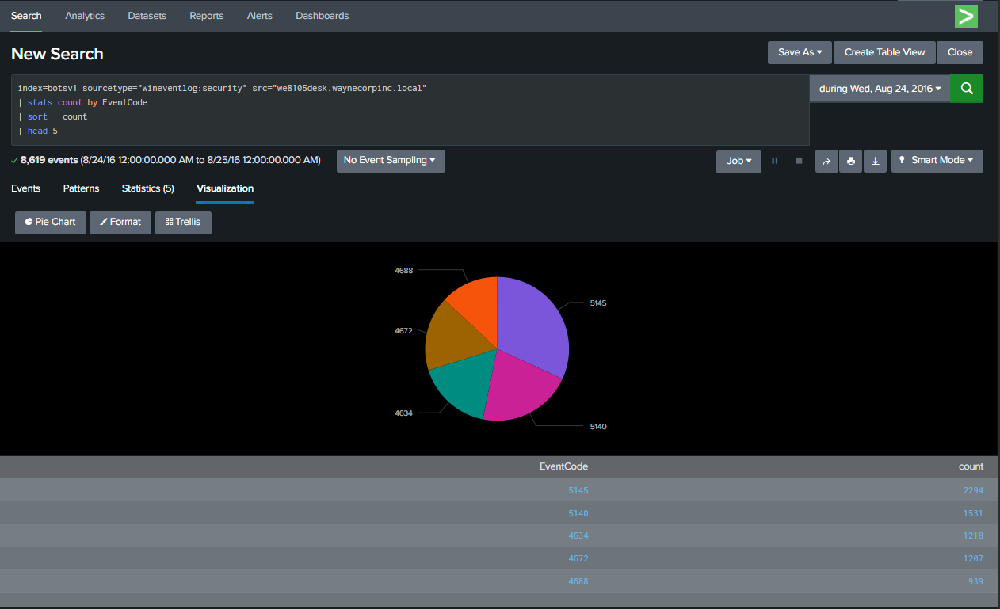

### Question 3

**Generate a list of sites visited on August 24, 2016 and provide the sum of the bytes_in and bytes_out, the destination IP, associated URLs and the source IPs that visited the site. Do not include Microsoft and Google sites. Sort the results by bytes_out, largest to smallest.**

Hint #1: Splunk Stream HTTP is the data source you will want to use

Hint #2: stats command can do many things

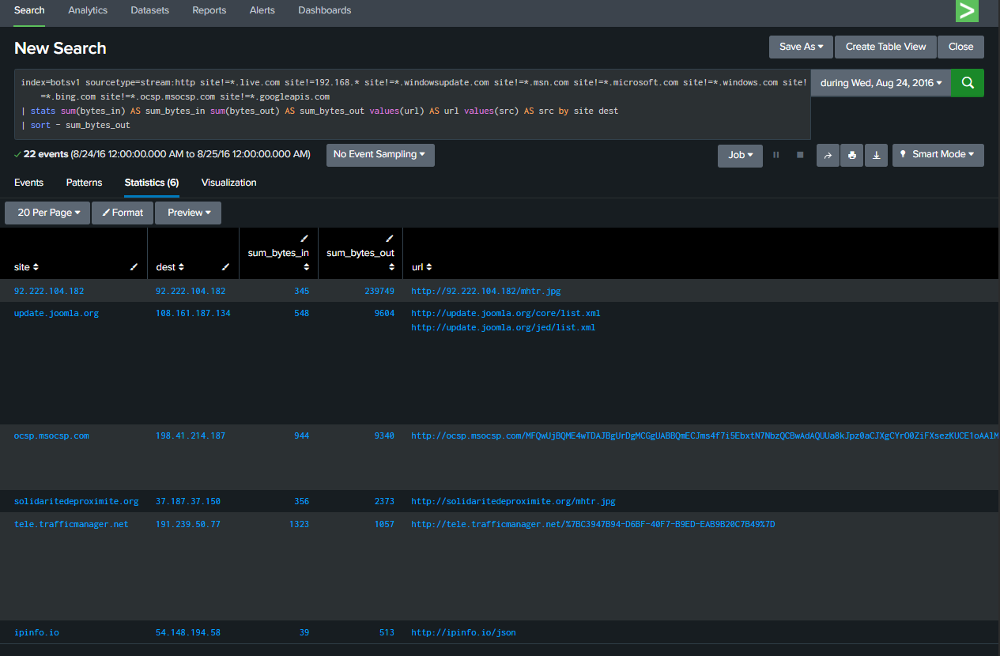


