# AWSRaid

Investigate AWS CloudTrail logs using Splunk to identify unauthorized access, analyze configuration changes, and detect persistence mechanisms.

## Scenario

Your organization utilizes AWS to host critical data and applications. An incident has been reported that involves unauthorized access to data and potential exfiltration. The security team has detected unusual activities and needs to investigate the incident to determine the scope of the attack.

---

### Q1

Knowing which user account was compromised is essential for understanding the attacker's initial entry point into the environment. What is the username of the compromised user?

```

```

First, we need to find what indexes are available for the search in the Splunk server.

`| tstats count where index=* by index` verifies that `aws_cloudtrail` is the only index that has an event.

Let me breakdown the first SPL query:

- `|`: Splunk assumes an invisible `search` command at the very start of every SPL query. `index=main error` actually is `search index=main error`. That's why normal searches don't need a pipe up front, the first part is just search terms. However, `tstats` is a generating command. It doesn't take events from something before it. It pulls data straight out of the tsidx index files and creates the result set. The leading pipe tells Splunk not to wrap this in an implicit `search` command and run the command as-is.
- `tstats` is a fast statistical search command in Splunk. It's commonly used to quickly search or count large amounts of indexed data.
- `count`tells `tstats` what statistics you want.
- `where index=*`is the filter. The `*` means any value. That is, search across all indexes.
- `by index` is the important part here. It means group the results by the `index` field.

Putting it all together, it uses the fast `tstats` command to count events, look across all indexes, and show me the count separately for each index.

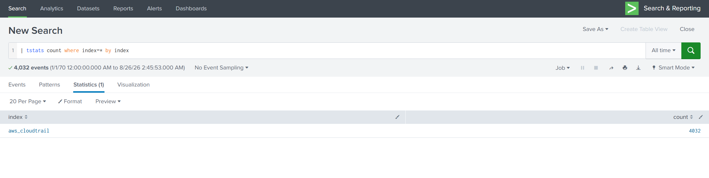

Next I checked what sourcetypes existed inside the `aws_cloudtrail` index, and there was nothing besides `aws:cloudtrail`.

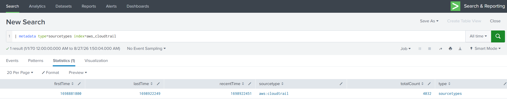

In a real environment I assume you'd normally expect one index to hold several sourcetypes, something the layout below. Here there's only the `aws_cloudtrail` index, and inside it only the `aws:cloudtrail` sourcetype.

```
index=security
├── WinEventLog:Security     ← Windows authentication logs
├── linux_secure             ← Linux SSH logs
├── cisco:asa                ← Firewall
└── stream:http              ← Web traffic
```

So the only way forward was `index=aws_cloudtrail | head 10`. Look at the raw events myself and see what fields are in there.

The field `userIdentity.type` caught my eye, and underneath it I saw `AWSService` and `IAMUser`.

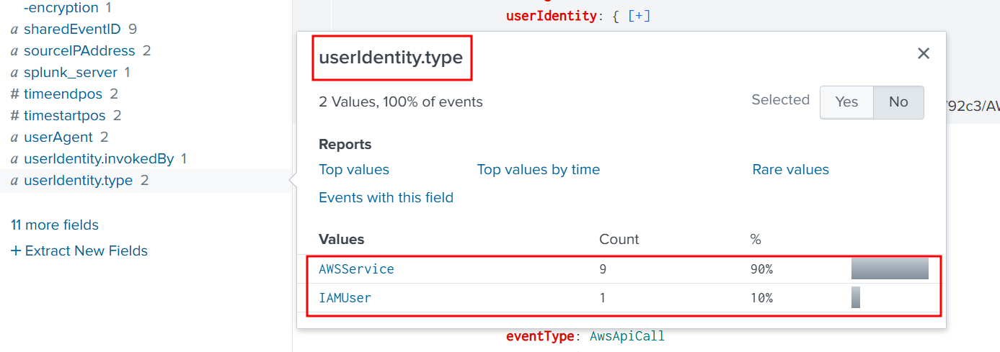

When I looked at the IAMUser-type events, I found another field under it: `userName`.

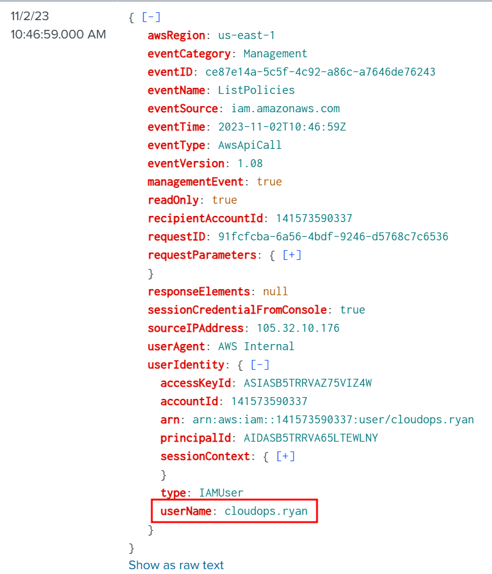

Sorting by `userIdentity.userName` gave me the following usernames.

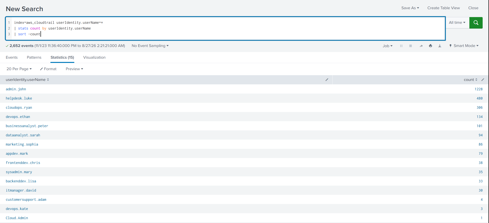

Then I found `signin.amazonaws.com` in the eventSource field and added it, and found `responseElements.ConsoleLogin` and added that too.

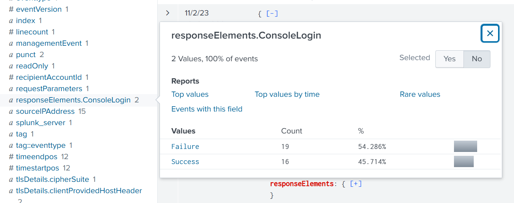

Put simply, I checked who had the most failed logins, and it was `helpdesk.luke`.

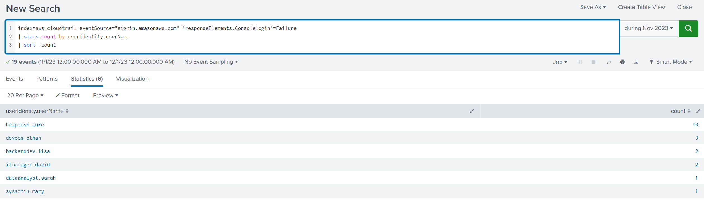

### Q2

We must investigate the events following the initial compromise to understand the attacker's motives. What is the timestamp for the first access to an S3 object by the attacker?

```
2023-11-02 09:55
```

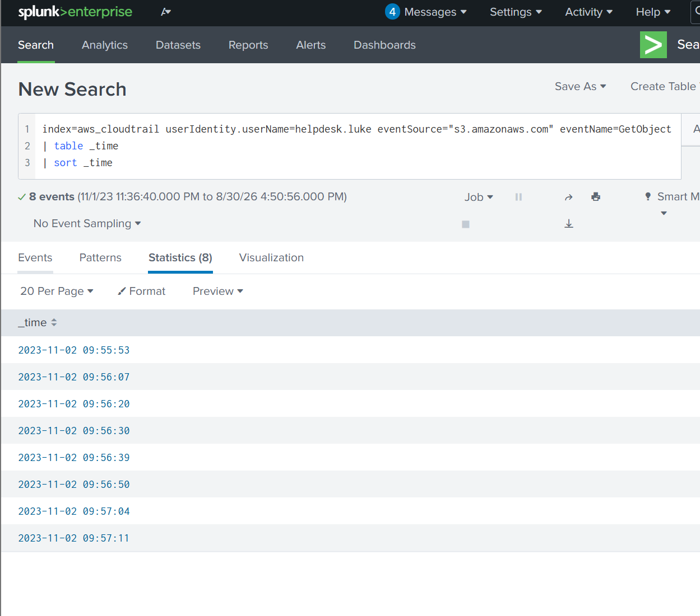

### Q3

Among the S3 buckets accessed by the attacker, one contains a DWG file. What is the name of this bucket?

```
product-designs-repository31183937
```

 I used the following query to find the bucket name and only 1 event was returned.

```
index=aws_cloudtrail userIdentity.userName=helpdesk.luke eventSource="s3.amazonaws.com" requestParameters.bucketName=* 
| search dwg
```

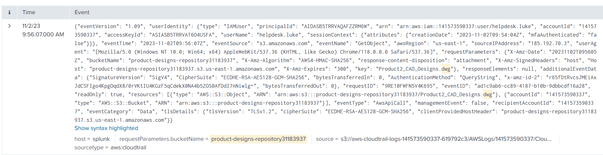

### Q4

We've identified changes to a bucket's configuration that allowed public access, a significant security concern. What is the name of this particular S3 bucket?

```
backup-and-restore98825501
```

Searching All Fields for the word `public` gave me the results below. Looking closely at the `requestParameters.PublicAccessBlockConfiguration.BlockPublicPolicy` field, there was exactly one event with the value `false`. The other fields were the same, only a single `false` value each. This looked like the event we were after.

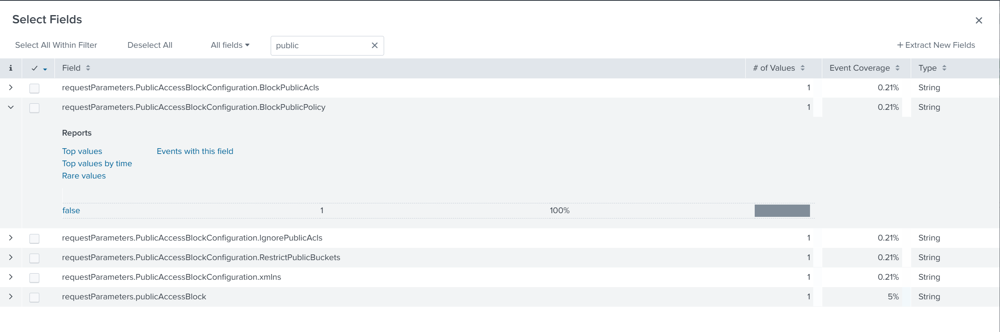

Running the SPL below returned exactly one event.

```
index=aws_cloudtrail userIdentity.userName=helpdesk.luke 	
requestParameters.PublicAccessBlockConfiguration.BlockPublicPolicy=false
```

The bucket name is `backup-and-restore98825501`.

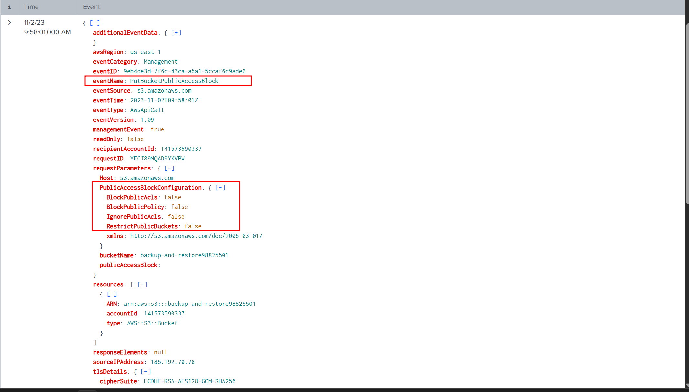

### Q5

Creating a new user account is a common tactic attackers use to establish persistence in a compromised environment. What is the username of the account created by the attacker?

```
marketing.mark
```

I had no idea where to start, so I just took `index=aws_cloudtrail` and started looking through all the events for any field beginning with `create` since the question says the attacker created an account.

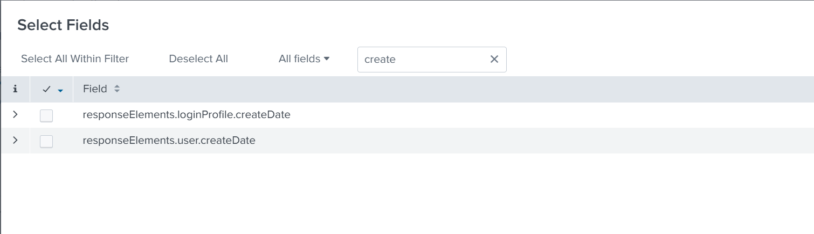

When I saw that the `responseElements.loginProfile.createDate` field was used in exactly one event, I had a hunch this was the event I was looking for. I ran the query below.

```
index=aws_cloudtrail responseElements.loginProfile.createDate=*
```

Just as I expected, a single event came back, and when I expanded it the username was `marketing.mark`.

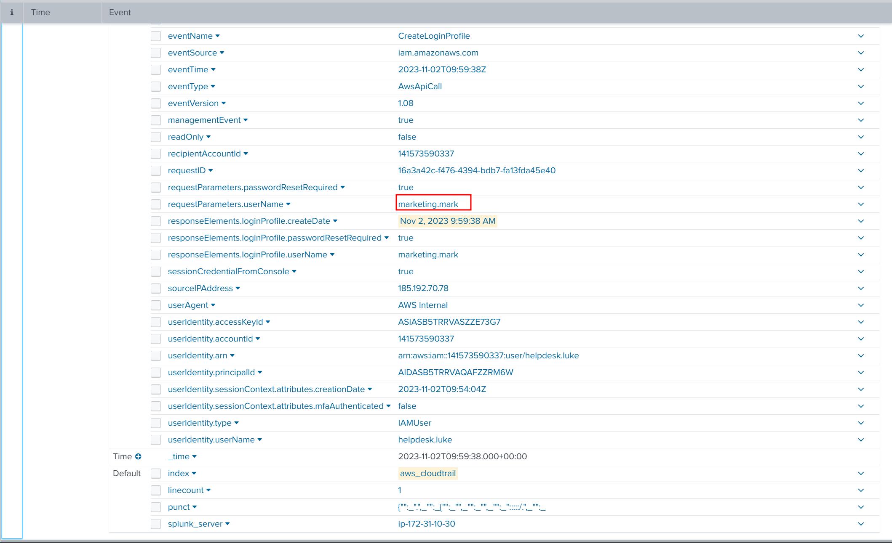

### Q6

Following account creation, the attacker added the account to a specific group. What is the name of the group to which the account was added?

```
Admins
```

Searching on the username `marketing.mark` returned 9 events.

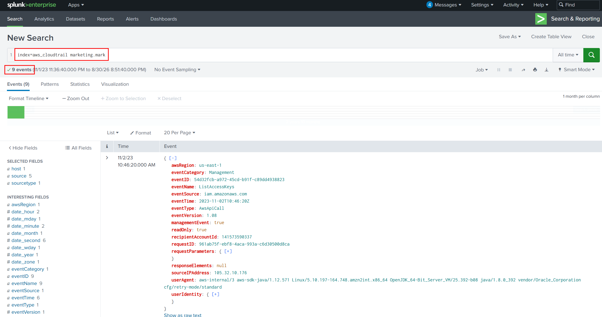

I looked through those events for any `group`-related field and found `requestParameters.groupName` and only 1 of the 9 events used it. That one event was very likely the one I was after.

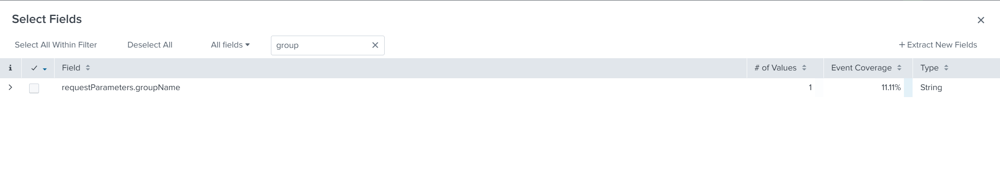

Clicking into the field, the value used was `Admins`. This is the group `marketing.mark` was added to.

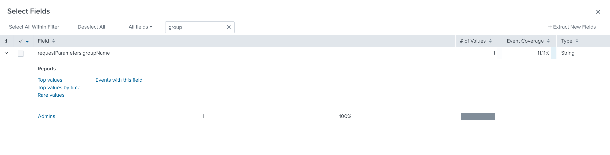

