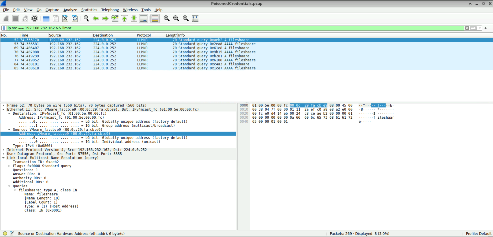
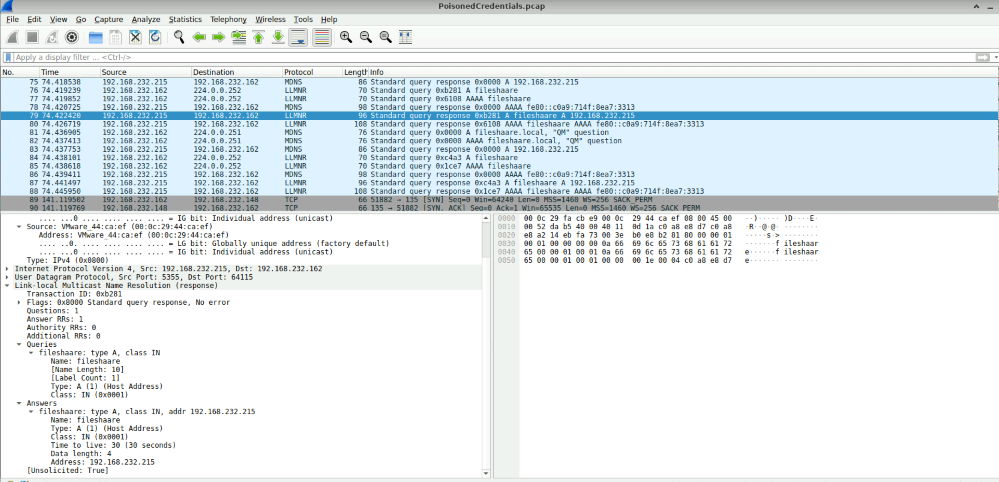
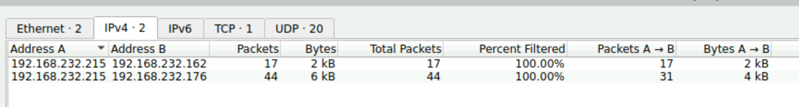
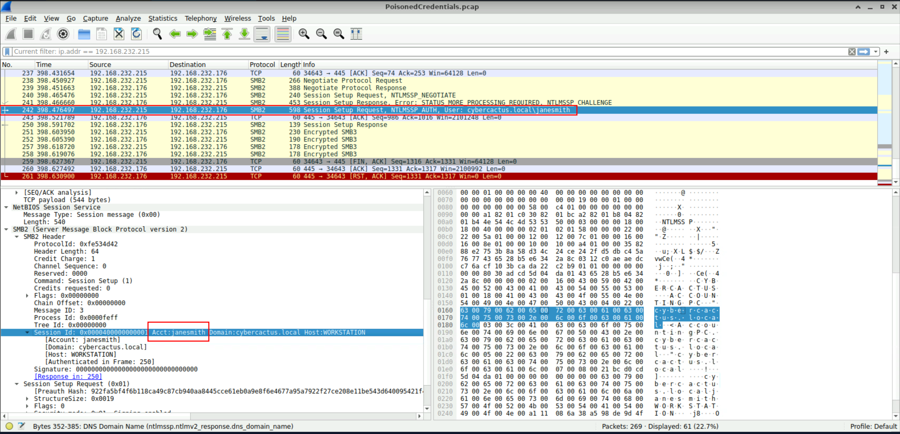
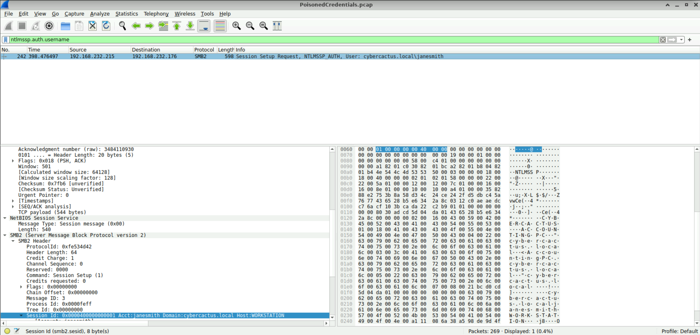
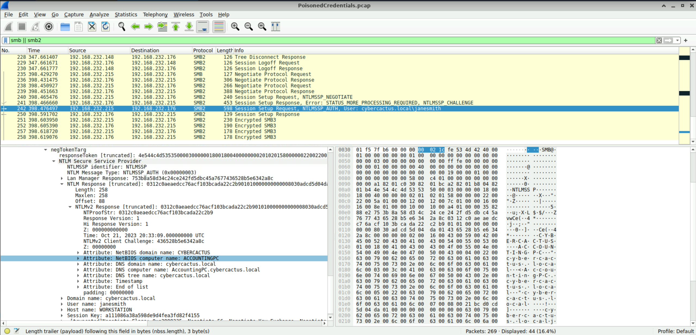

# PoisonedCredentials

Analyze network traffic for LLMNR/NBT-NS poisoning attacks using Wireshark to identify the rogue machine, compromised accounts, and affected systems.

## Scenario

Your organization's security team has detected a surge in suspicious network activity. There are concerns that LLMNR (Link-Local Multicast Name Resolution) and NBT-NS (NetBIOS Name Service) poisoning attacks may be occurring within your network. These attacks are known for exploiting these protocols to intercept network traffic and potentially compromise user credentials. Your task is to investigate the network logs and examine captured network traffic.

---

### Q1

In the context of the incident described in the scenario, the attacker initiated their actions by taking advantage of benign network traffic from legitimate machines. Can you identify the specific mistyped query made by the machine with the IP address 192.168.232.162?

```
fileshaare
```

I easily found the query by filtering the traffic for both the IP address `192.168.232.162` and the protocol `LLMNR`. 

The easiest way to understand LLMNR is to think of it as a backup way for computers to find each other on a local network. For example, imagine your computer wants to connect to a computer called `fileserver`. Normally, your computer asks a DNS server for the IP address of `fileserver` but if DNS doesn't know the name, Windows can use LLMNR as a fallback. Your computer essentially broadcasts to the local network asking for `fileserver`'s IP address. The problem is, an attacker can be sitting on the same network and pretend to be `fileserver`. Then, the victim's computer may send authentication information to the attacker. 

Here, the attacker deliberately created a typo to create a name-resolution failure which falls back to LLMNR and gives the attacker an opportunity to answer the LLMNR request.



### Q2

We are investigating a network security incident. To conduct a thorough investigation, We need to determine the IP address of the rogue machine. What is the IP address of the machine acting as the rouge entity?

```
192.168.232.215
```

Following the LLMNR broadcast from 192.168.232.162, multiple responses were observed from `192.168.232.215` to 192.168.232.162.



### Q3

As part of our investigation, identifying all affected machines is essential. What is the IP address of the second machine that received poisoned responses from the rogue machine?

```
192.168.232.176
```

We already identified the IP address of the rogue machine to be 192.168.232.215 and we've already seen the communication traffic between the rogue machine and 192.168.232.162. If you go to `Statistics` - `Conversations`, there's another IP address `192.168.232.176` which is highly likely to be the second machine that received poisoned responses from the rogue machine.




### Q4

We suspect that user accounts may have been compromised. To assess this, we must determine the username associated with the compromised account. What is the username of the account that the attacker compromised?

```
janesmith
```

I started scrolling down through the traffic from the packet number I had identified earlier, looking for anything that stood out in the Info column. I eventually noticed what appeared to be a username and stopped when I saw `janesmith`. This seemed to be the username I was looking for.



Another way to find the answer is to filter the traffic using `ntlmssp.auth.username`. We already know from the hints that the attack involved LLMNR poisoning and eventually led to an account compromise. Since an NTLM authentication process would likely have occurred during the attack, filtering for `ntlmssp.auth.username` should make it much easier to identify the compromised username.




### Q5

As part of our investigation, we aim to understand the extent of the attacker's activities. What is the hostname of the machine that the attacker accessed via SMB?

```
ACCOUNTINGPC
```

