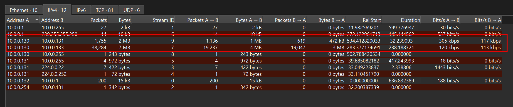
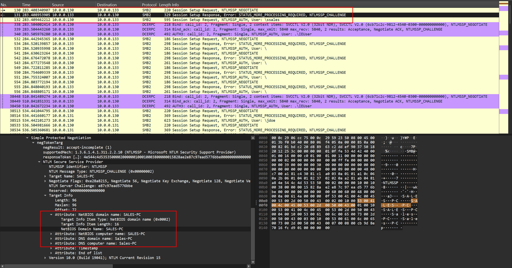
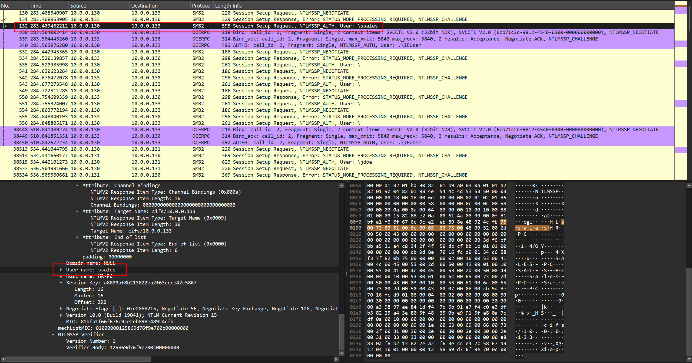
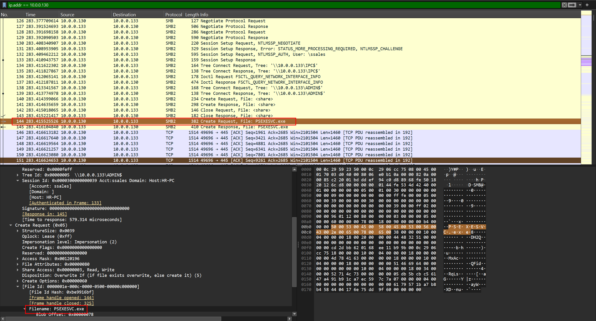
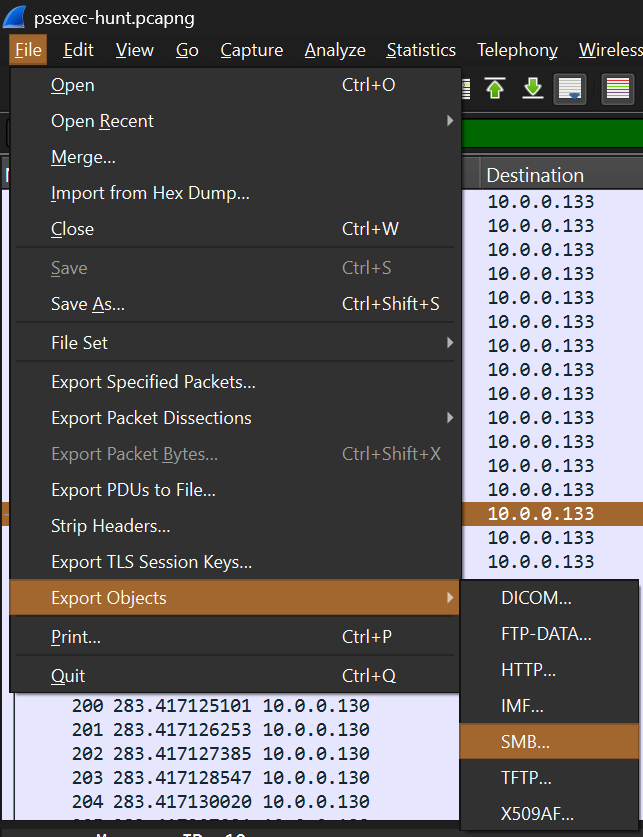
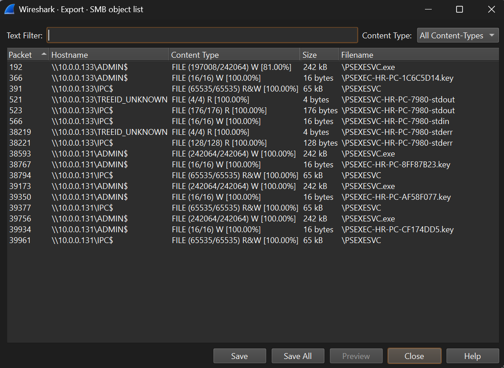
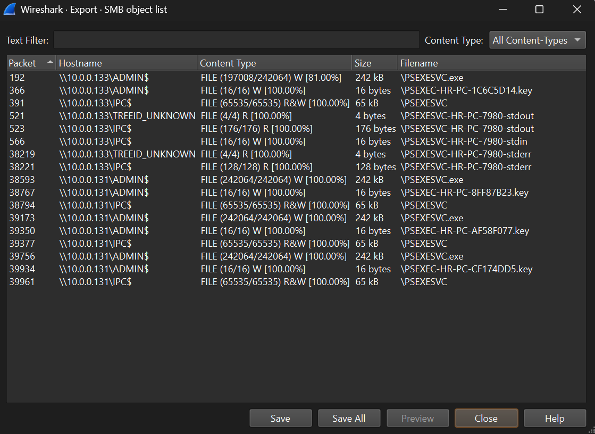
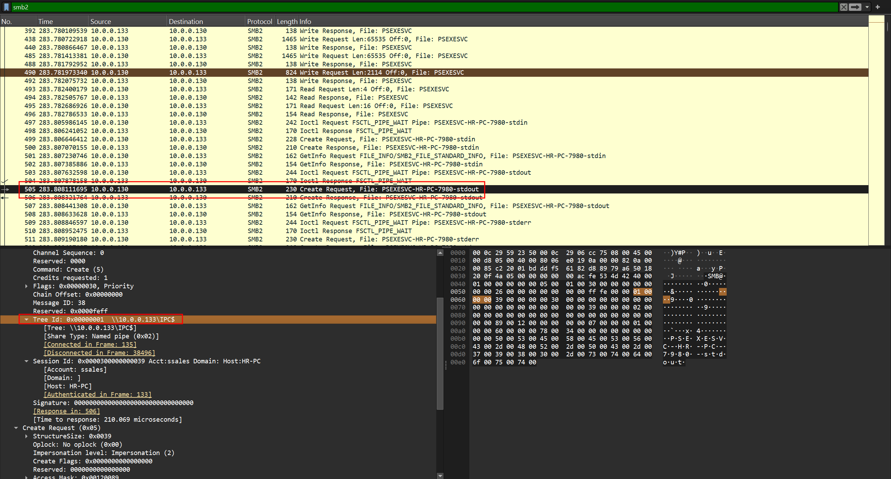
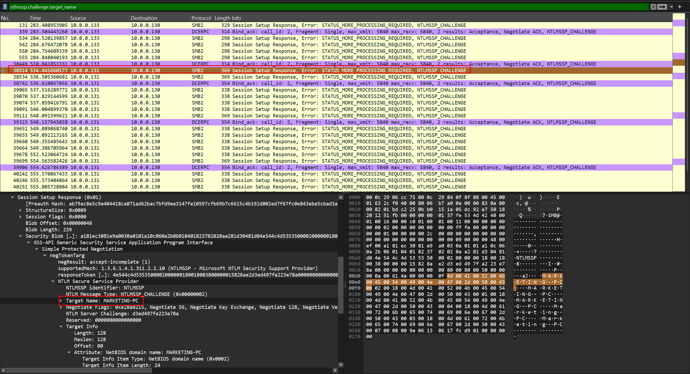

# PsExec Hunt

Analyze SMB traffic in a PCAP file using Wireshark to identify PsExec lateral movement, compromised systems, user credentials, and administrative shares.

## Scenario

An alert from the Intrusion Detection System (IDS) flagged suspicious lateral movement activity involving PsExec. This indicates potential unauthorized access and movement across the network. As a SOC Analyst, your task is to investigate the provided PCAP file to trace the attacker's activities. Identify their entry point, the machines targeted, the extent of the breach, and any critical indicators that reveal their tactics and objectives within the compromised environment.

---

### Q1

To effectively trace the attacker's activities within our network, can you identify the IP address of the machine from which the attacker initially gained access?

```
10.0.0.130
```

If you go to **Statistics** -> **Conversations**, you will see two conversations that have unusually high traffic volume compared to others:

1. `10.0.0.130` <-> `10.0.0.131`
2. `10.0.0.130` <-> `10.0.0.133`



Based on this alone, I assume the attacker first gained access on `10.0.0.130` endpoint and pivoted to either `.131` or `.133`.


### Q2

To fully understand the extent of the breach, can you determine the machine's hostname to which the attacker first pivoted?

```
SALES-PC
```

i used the filter `ntlmssp` to locate the challenge message and identify the target machine's hostname. The target machine sends the `NTLMSSP Challenge` to securely verify the client's identity without exposing sensitive information.




### Q3

Knowing the username of the account the attacker used for authentication will give us insights into the extent of the breach. What is the username utilized by the attacker for authentication?

```
ssales
```

You can easily figure out the username, if you could figure out the answer for Q2.




### Q4

After figuring out how the attacker moved within our network, we need to know what they did on the target machine. What's the name of the service executable the attacker set up on the target?

```
psexesvc.exe
```

You can easily locate the name of the file.



Also, if you go to **File** -> **Export Objects** -> **SMB**, you can see the files that were transferred over SMB and captured in the packet capture.





### Q5

We need to know how the attacker installed the service on the compromised machine to understand the attacker's lateral movement tactics. This can help identify other affected systems. Which network share used by PsExec to install the service on the target machine?

```
ADMIN$
```

`ADMIN$` share is typically accessible with administrative credentials and is a frequent target for tools like `PsExec` to deploy service executables.




### Q6

We must identify the network share used to communicate between the two machines. Which network share did PsExec use for communication?

```
IPC$
```

I found a CREATE Request for `PSEXESVC-HR-PC-7980-stdout`. This is a strong indicator of PsExec activity: PsExec redirects the remote process's standard input, output, and error to named pipes, and the client reads and writes them over SMB. The name follows the pattern `PSEXESVC-<client hostname>-<client PID>-<stream>`, so `HR-PC` here is the attacker's initially gained machine, not the target.

SMB2 treats named pipes exactly like files - same CREATE, READ, and WRITE operations - which is why Wireshark labes it `File:` in the Info column. The name alone therefore doesn't tell us which share was used. Expanding the packet shows `IPC$`.




### Q7

Now that we have a clearer picture of the attacker's activities on the compromised machine, it's important to identify any further lateral movement. What is the hostname of the second machine the attacker targeted to pivot within our network?

```
MARKETING-PC
```

This question is similar to Q2, where I used `ntlm` to filter the results, I used `ntlmssp.challenge.target_name` instead. Then I skipped packets including `SALES-PC`  because we already saw those. Then I found this endpoint `10.0.0.131` 's hostname: `MARKETING-PC`.

