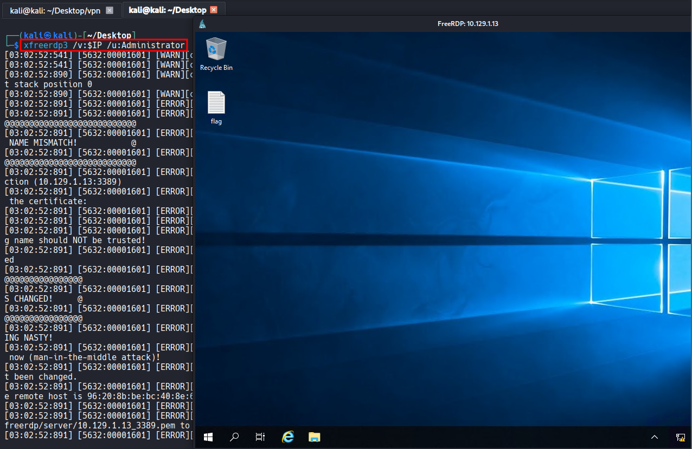
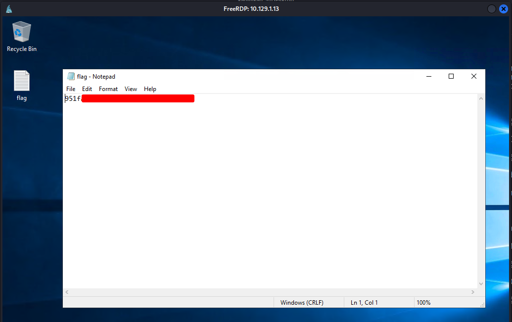

# HTB - Explosion

#very-easy #windows

[TOC]

#### What does the 3-letter acronym RDP stand for?

Remote Desktop Protocol

#### What is a 3-letter acronym that refers to interaction with the host through a command line interface?

CLI

#### What about graphical user interface interactions?

GUI

#### What is the name of an old remote access tool that came without encryption by default and listens on TCP port 23?

telnet

#### What is the name of the service running on port 3389 TCP?

ms-wbt-server

```bash
┌──(kali㉿kali)-[~/Desktop/vpn]
└─$ nmap $IP -Pn -n --open --min-rate 3000 -p-
Starting Nmap 7.95 ( https://nmap.org ) at 2026-03-09 03:00 UTC
Nmap scan report for 10.129.1.13
Host is up (0.048s latency).
Not shown: 64563 closed tcp ports (reset), 958 filtered tcp ports (no-response)
Some closed ports may be reported as filtered due to --defeat-rst-ratelimit
PORT      STATE SERVICE
135/tcp   open  msrpc
139/tcp   open  netbios-ssn
445/tcp   open  microsoft-ds
3389/tcp  open  ms-wbt-server
5985/tcp  open  wsman
47001/tcp open  winrm
49664/tcp open  unknown
49665/tcp open  unknown
49666/tcp open  unknown
49667/tcp open  unknown
49668/tcp open  unknown
49669/tcp open  unknown
49670/tcp open  unknown
49671/tcp open  unknown

Nmap done: 1 IP address (1 host up) scanned in 15.47 seconds
```

#### What is the switch used to specify the target host's IP address when using xfreerdp?

`/v:`

#### What username successfully returns a desktop projection to us with a blank password?

Administrator



#### Submit root flag

951f...

