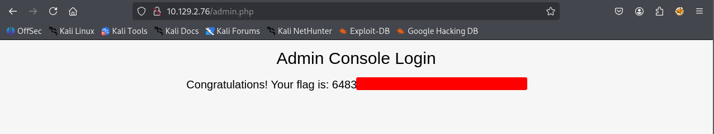

# HTB - Preignition

#very-easy #linux

[TOC]

#### Directory Brute-forcing is a technique used to check a lot of paths on a web server to find hidden pages. Which is another name for this? (i) Local File Inclusion, (ii) dir busting, (iii) hash cracking.

dir busting

#### What switch do we use for nmap's scan to specify that we want to perform version detection

`-sV`

#### What does Nmap report is the service identified as running on port 80/tcp?

http

```bash
┌──(kali㉿kali)-[~/Desktop]
└─$ nmap $IP -Pn -n --open --min-rate 3000 -p-
Starting Nmap 7.95 ( https://nmap.org ) at 2026-03-09 03:23 UTC
Nmap scan report for 10.129.2.76
Host is up (0.051s latency).
Not shown: 65534 closed tcp ports (reset)
PORT   STATE SERVICE
80/tcp open  http

Nmap done: 1 IP address (1 host up) scanned in 14.93 seconds
```

#### What server name and version of service is running on port 80/tcp?

nginx 1.14.2

```bash
┌──(kali㉿kali)-[~/Desktop]
└─$ nmap $IP -sC -sV -p 80                    
Starting Nmap 7.95 ( https://nmap.org ) at 2026-03-09 03:24 UTC
Nmap scan report for 10.129.2.76
Host is up (0.048s latency).

PORT   STATE SERVICE VERSION
80/tcp open  http    nginx 1.14.2
|_http-title: Welcome to nginx!
|_http-server-header: nginx/1.14.2

Service detection performed. Please report any incorrect results at https://nmap.org/submit/ .
Nmap done: 1 IP address (1 host up) scanned in 7.85 seconds
```

#### What switch do we use to specify to Gobuster we want to perform dir busting specifically?

dir

#### When using gobuster to dir bust, what switch do we add to make sure it finds PHP pages?

`-x php`

#### What page is found during our dir busting activities?

admin.php

```bash
┌──(kali㉿kali)-[~/Desktop]
└─$ gobuster dir -u http://$IP -w /usr/share/wordlists/seclists/Discovery/Web-Content/common.txt 
===============================================================
Gobuster v3.6
by OJ Reeves (@TheColonial) & Christian Mehlmauer (@firefart)
===============================================================
[+] Url:                     http://10.129.2.76
[+] Method:                  GET
[+] Threads:                 10
[+] Wordlist:                /usr/share/wordlists/seclists/Discovery/Web-Content/common.txt
[+] Negative Status codes:   404
[+] User Agent:              gobuster/3.6
[+] Timeout:                 10s
===============================================================
Starting gobuster in directory enumeration mode
===============================================================
/admin.php            (Status: 200) [Size: 999]
Progress: 4746 / 4747 (99.98%)
===============================================================
Finished
===============================================================
```

#### What is the HTTP status code reported by Gobuster for the discovered page?

200

#### Submit root flag

6483...



