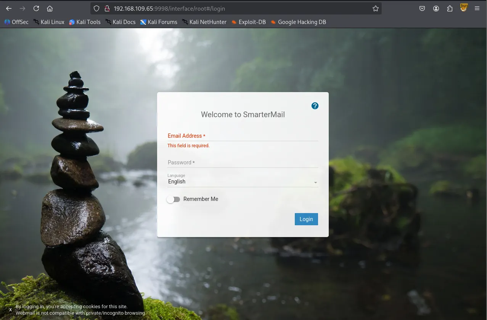
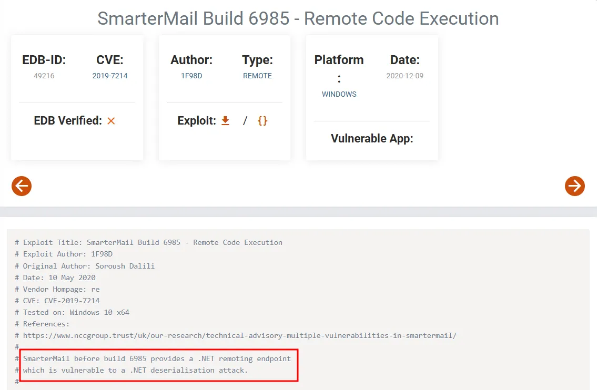
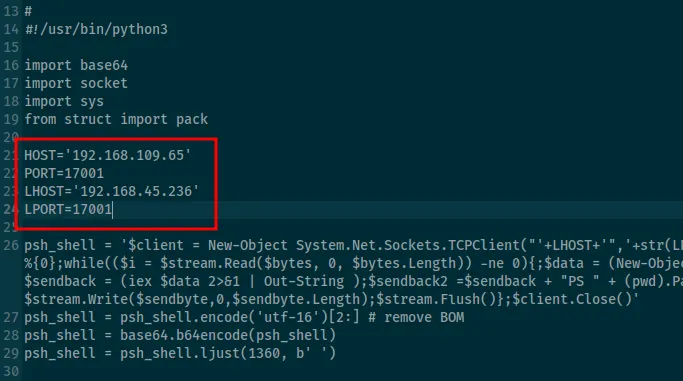
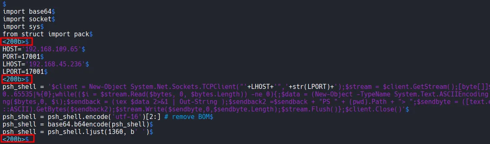

Writeup by wook413

[TOC]

# Recon

## Nmap

As always, I started the engagement with a comprehensive Nmap scan of all 65,535 TCP ports, followed by a targeted service scan and a UDP scan of the top 10 ports.

```bash
┌──(kali㉿kali)-[~/Desktop]
└─$ nmap $IP -Pn -n --open --min-rate 3000 -p-
Starting Nmap 7.95 ( <https://nmap.org> ) at 2026-01-11 15:20 UTC
Nmap scan report for 192.168.109.65
Host is up (0.044s latency).
Not shown: 63679 closed tcp ports (reset), 1842 filtered tcp ports (no-response)
Some closed ports may be reported as filtered due to --defeat-rst-ratelimit
PORT      STATE SERVICE
21/tcp    open  ftp
80/tcp    open  http
135/tcp   open  msrpc
139/tcp   open  netbios-ssn
445/tcp   open  microsoft-ds
5040/tcp  open  unknown
9998/tcp  open  distinct32
17001/tcp open  unknown
49664/tcp open  unknown
49665/tcp open  unknown
49666/tcp open  unknown
49667/tcp open  unknown
49668/tcp open  unknown
49669/tcp open  unknown

Nmap done: 1 IP address (1 host up) scanned in 17.72 seconds
```

```bash
┌──(kali㉿kali)-[~/Desktop]
└─$ nmap $IP -sC -sV -p 21,80,135,139,445,5040,9998,17001,49664,49665,49666,49667,49668,49669
Starting Nmap 7.95 ( <https://nmap.org> ) at 2026-01-11 15:21 UTC
Nmap scan report for 192.168.109.65
Host is up (0.045s latency).

PORT      STATE SERVICE       VERSION
21/tcp    open  ftp           Microsoft ftpd
| ftp-anon: Anonymous FTP login allowed (FTP code 230)
| 04-29-20  09:31PM       <DIR>          ImapRetrieval
| 01-11-26  07:17AM       <DIR>          Logs
| 04-29-20  09:31PM       <DIR>          PopRetrieval
|_04-29-20  09:32PM       <DIR>          Spool
| ftp-syst: 
|_  SYST: Windows_NT
80/tcp    open  http          Microsoft IIS httpd 10.0
|_http-server-header: Microsoft-IIS/10.0
| http-methods: 
|_  Potentially risky methods: TRACE
|_http-title: IIS Windows
135/tcp   open  msrpc         Microsoft Windows RPC
139/tcp   open  netbios-ssn   Microsoft Windows netbios-ssn
445/tcp   open  microsoft-ds?
5040/tcp  open  unknown
9998/tcp  open  http          Microsoft HTTPAPI httpd 2.0 (SSDP/UPnP)
| uptime-agent-info: HTTP/1.1 400 Bad Request\\x0D
| Content-Type: text/html; charset=us-ascii\\x0D
| Server: Microsoft-HTTPAPI/2.0\\x0D
| Date: Sun, 11 Jan 2026 15:24:08 GMT\\x0D
| Connection: close\\x0D
| Content-Length: 326\\x0D
| \\x0D
| <!DOCTYPE HTML PUBLIC "-//W3C//DTD HTML 4.01//EN""<http://www.w3.org/TR/html4/strict.dtd>">\\x0D
| <HTML><HEAD><TITLE>Bad Request</TITLE>\\x0D
| <META HTTP-EQUIV="Content-Type" Content="text/html; charset=us-ascii"></HEAD>\\x0D
| <BODY><h2>Bad Request - Invalid Verb</h2>\\x0D
| <hr><p>HTTP Error 400. The request verb is invalid.</p>\\x0D
|_</BODY></HTML>\\x0D
|_http-server-header: Microsoft-IIS/10.0
| http-title: Site doesn't have a title (text/html; charset=utf-8).
|_Requested resource was /interface/root
17001/tcp open  remoting      MS .NET Remoting services
49664/tcp open  msrpc         Microsoft Windows RPC
49665/tcp open  msrpc         Microsoft Windows RPC
49666/tcp open  msrpc         Microsoft Windows RPC
49667/tcp open  msrpc         Microsoft Windows RPC
49668/tcp open  msrpc         Microsoft Windows RPC
49669/tcp open  msrpc         Microsoft Windows RPC
Service Info: OS: Windows; CPE: cpe:/o:microsoft:windows

Host script results:
| smb2-security-mode: 
|   3:1:1: 
|_    Message signing enabled but not required
| smb2-time: 
|   date: 2026-01-11T15:24:17
|_  start_date: N/A

Service detection performed. Please report any incorrect results at <https://nmap.org/submit/> .
Nmap done: 1 IP address (1 host up) scanned in 177.15 seconds
```

```bash
┌──(kali㉿kali)-[~/Desktop]
└─$ nmap $IP -sU --top-ports 10                                                              
Starting Nmap 7.95 ( <https://nmap.org> ) at 2026-01-11 15:27 UTC
Nmap scan report for 192.168.109.65
Host is up (0.044s latency).

PORT     STATE         SERVICE
53/udp   closed        domain
67/udp   closed        dhcps
123/udp  open|filtered ntp
135/udp  closed        msrpc
137/udp  open|filtered netbios-ns
138/udp  open|filtered netbios-dgm
161/udp  closed        snmp
445/udp  closed        microsoft-ds
631/udp  closed        ipp
1434/udp closed        ms-sql-m

Nmap done: 1 IP address (1 host up) scanned in 8.26 seconds
```

# Initial Access

After reviewing the Nmap results, I analyzed the open ports to identify potential attack vectors.

## remoting (.NET Remoting Services) 17001

I identified `.NET Remoting Services` running on port 17001. A `searchsploit` query revealed a known RCE vulnerability. Since the target was confirmed as a Windows machine, this remained a viable backup option.

```bash
┌──(kali㉿kali)-[~/Desktop/temp/192.168.109.65]
└─$ searchsploit remoting
-------------------------------------------------------------------------------------------------------- ---------------------------------
 Exploit Title                                                                                          |  Path
-------------------------------------------------------------------------------------------------------- ---------------------------------
.NET Remoting Services - Remote Command Execution                                                       | windows/remote/35280.txt
JBoss Remoting 6.14.18 - Denial of Service                                                              | multiple/dos/44099.txt
-------------------------------------------------------------------------------------------------------- ---------------------------------
Shellcodes: No Results
```

## HTTP 9998

Upon further inspection of the HTTP service on port 9998, I discovered it was hosting **SmarterMail**. Searching for “SmarterMail exploit” led me to an exploit script that looked very promising for achieving initial access.





I downloaded the exploit and updated the `LHOST` and `LPORT` settings.



However, when executing the script, I encountered the following error:

```bash
┌──(kali㉿kali)-[~/Desktop]
└─$ python3 49216 
  File "/home/kali/Desktop/49216", line 20
    
    ^
SyntaxError: invalid non-printable character U+200B
```

The error `U+200B` indicated a **Zero Width Space** character, likely introduced during the copy-paste process from the web. To fix this, I opened the script in `vim` and used the **`:set list`** command to reveal hidden characters. After stripping out the non-printable characters, the script was ready for execution.

```bash
vim 49216
:set list
```



# Shell as `system`

I executed the cleaned exploit and successfully received a reverse shell. To my surprise, the exploit provided immediate **SYSTEM** level privileges.

```bash
PS C:\\Windows\\system32> whoami
nt authority\\system
PS C:\\Windows\\system32> pwd

Path               
----               
C:\\Windows\\system32
```

Found `proof.txt`

```bash
PS C:\\Users\\Administrator\\Desktop> dir

    Directory: C:\\Users\\Administrator\\Desktop

Mode                LastWriteTime         Length Name                                                                  
----                -------------         ------ ----                                                                  
-a----        4/29/2020   9:29 PM           1450 Microsoft Edge.lnk                                                    
-a----        1/11/2026   7:17 AM             34 proof.txt                                                             

PS C:\\Users\\Administrator\\Desktop> type proof.txt
9287...
```