Write-up by wook413

# Lab: Username enumeration via different responses

This lab is vulnerable to username enumeration and password brute-force attacks. It has an account with a predictable username and password, which can be found in the following wordlists:

- [Candidate usernames](https://portswigger.net/web-security/authentication/auth-lab-usernames)
- [Candidate passwords](https://portswigger.net/web-security/authentication/auth-lab-passwords)

To solve the lab, enumerate a valid username, brute-force this user's password, then access their account page.

---

From the main page of the lab, I clicked "My account."

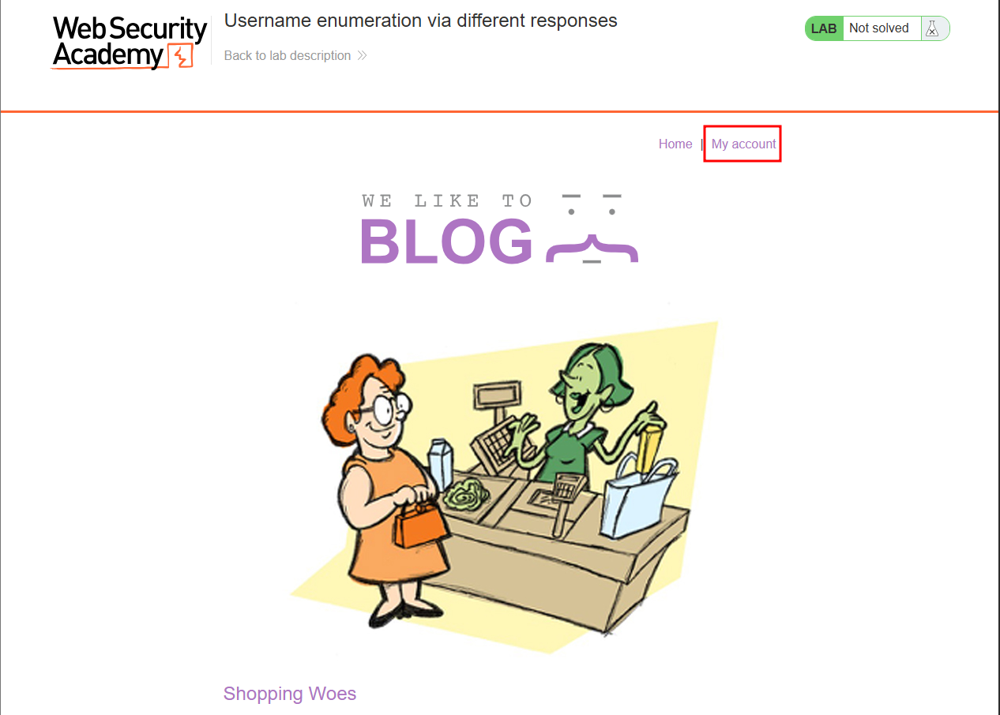

I entered `wook:wook` in the username and password fields and clicked **Log in**.

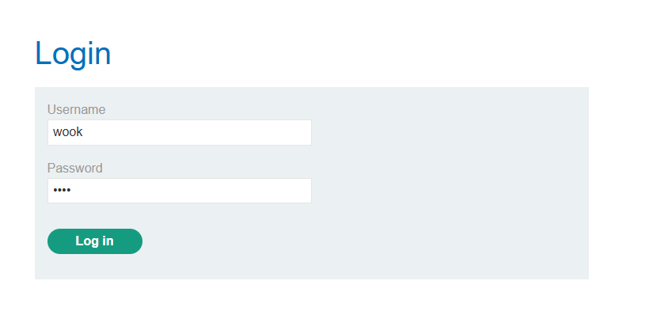

In Burp, I saw the POST request I had just made, and the body clearly showed `username=wook&password=wook`

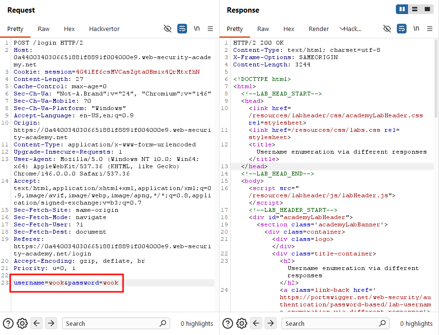

I sent that request to Intruder and marked the username value as the target position.

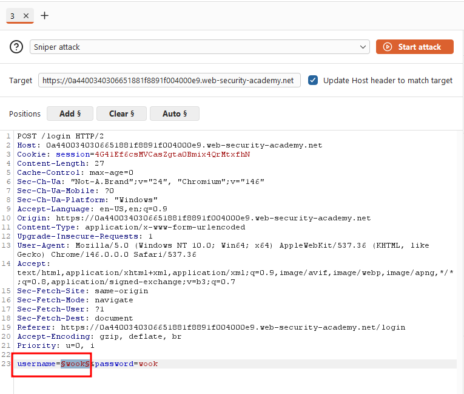

For payloads, I used the provided wordlist of usernames.

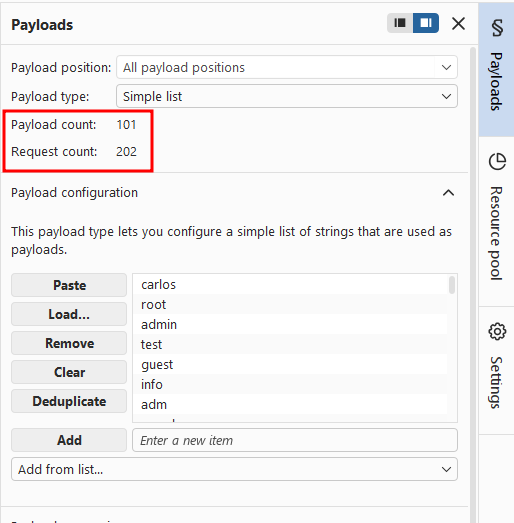

I ran the attack, which finished in a few seconds. Sorting the results by length, I noticed that one payload `archie` produced a response length different from all the others.

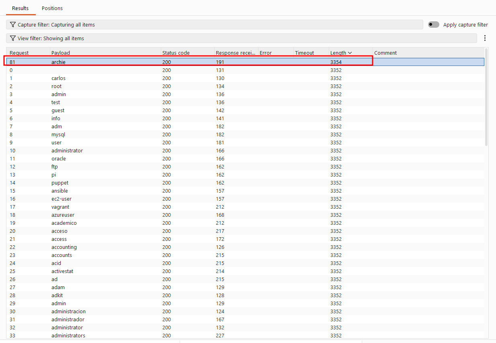

Looking at that response, it said "Incorrect password."

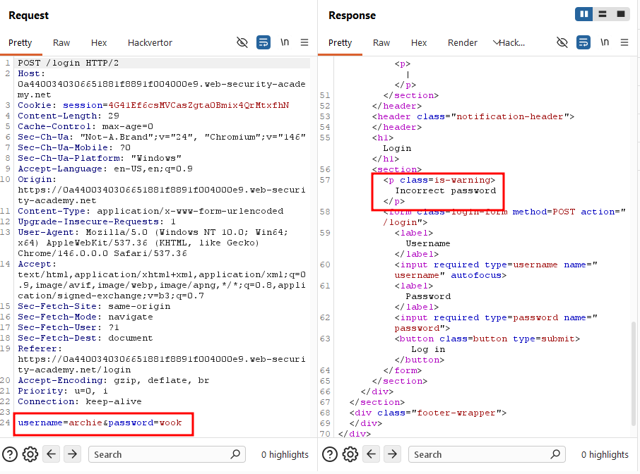

Every other response, by contrast, said "Invalid username." This difference confirms that the user archie exists.

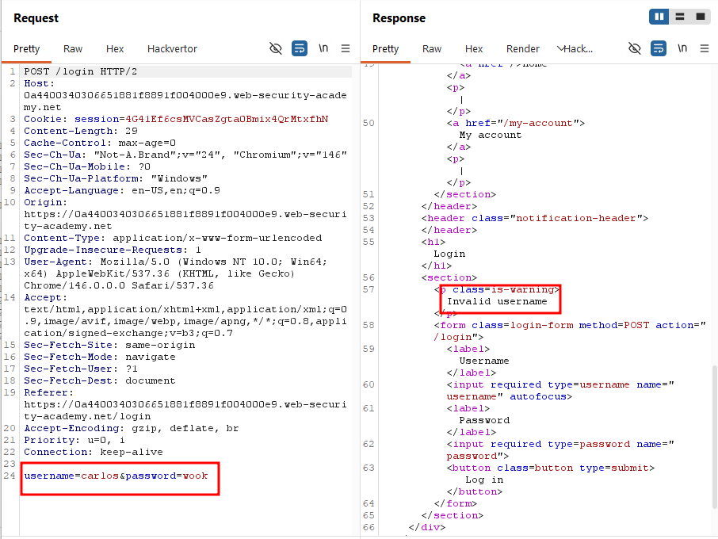

Now that I knew archie was a valid username, I set up a new attack to find his password, this time marking the password field as the target position.

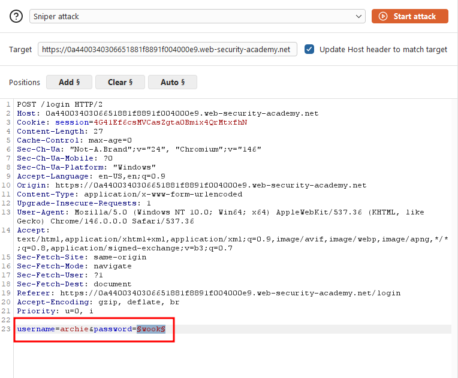

For payloads, I used the provided wordlist of passwords.

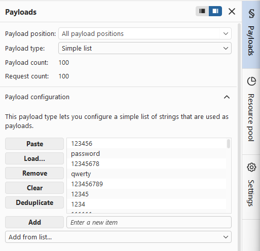

I ran the attack, which again finished quickly. One request stood out: it returned status code 302 with a response length of 188, while every other request returned length 3354.

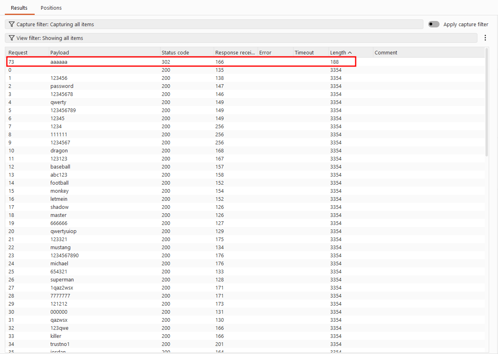

The 302 status code indicated a redirect, meaning the login had succeeded, so the payload used for that request must be archie's correct password.

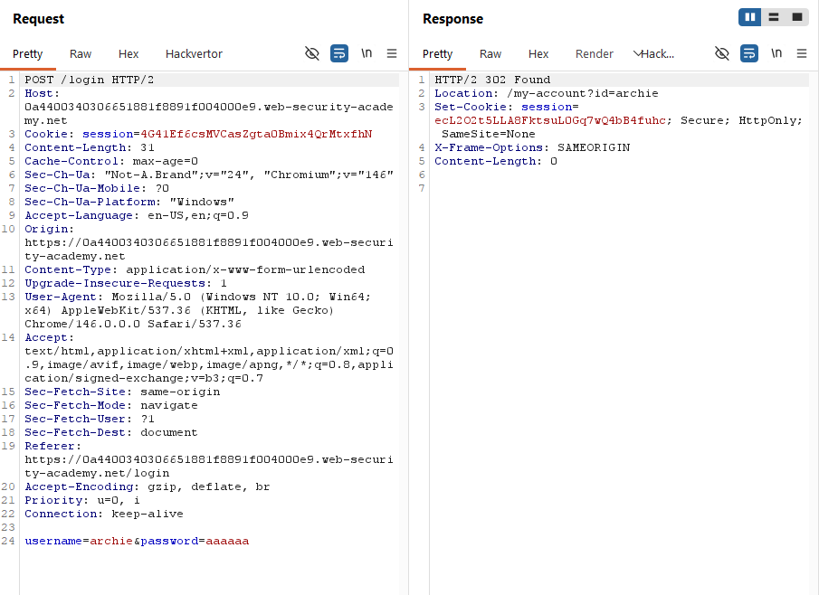

All the other responses simply contained "Incorrect password."

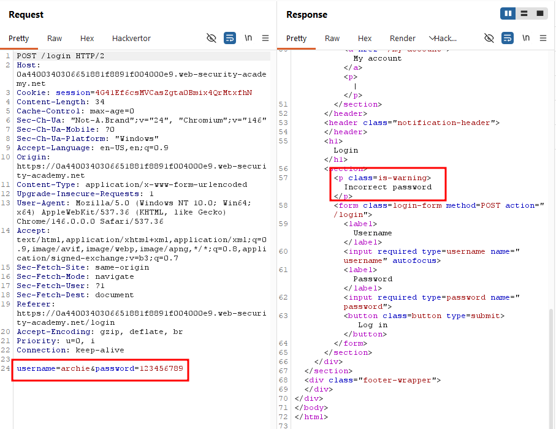

I logged in with archie and the identified password.

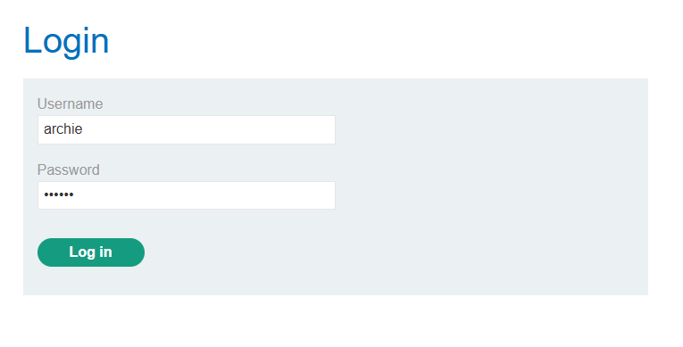

### Solved!

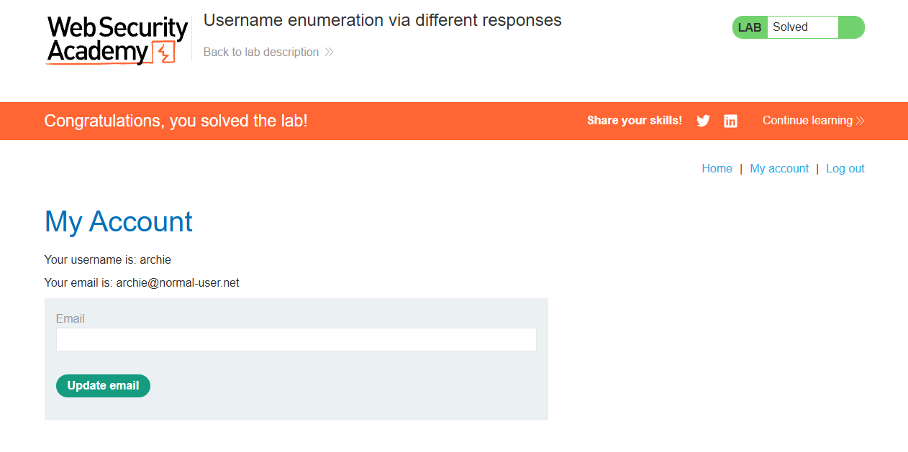

