Write-up by wook413

# Lab: Password reset poisoning via middleware

This lab is vulnerable to password reset poisoning. The user `carlos` will carelessly click on any links in emails that he receives. To solve the lab, log in to Carlos's account. You can log in to your own account using the following credentials: `wiener:peter`. Any emails sent to this account can be read via the email client on the exploit server.

---

I went straight to the login page and clicked the "Forgot password?" button, since the lab specifies it is vulnerable to password reset poisoning.

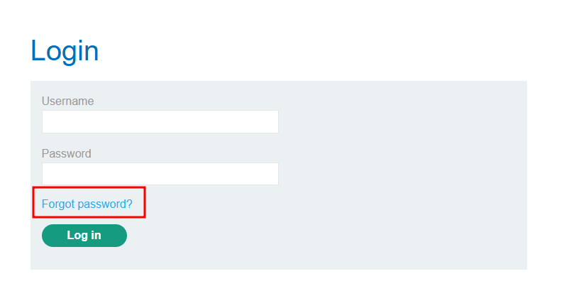

I was prompted to enter a username or email, so I entered `wiener`.

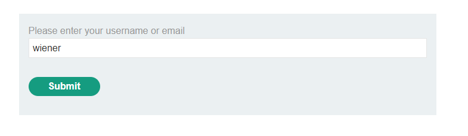

I navigated to the **Email Client** to see if I'd received any email for the password reset.

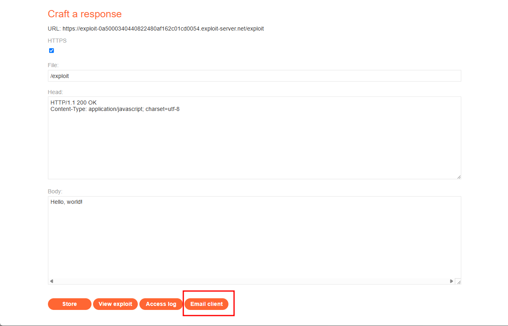

There was an email from the server containing an external link. The URL also contained a `temp-forgot-password-token`.

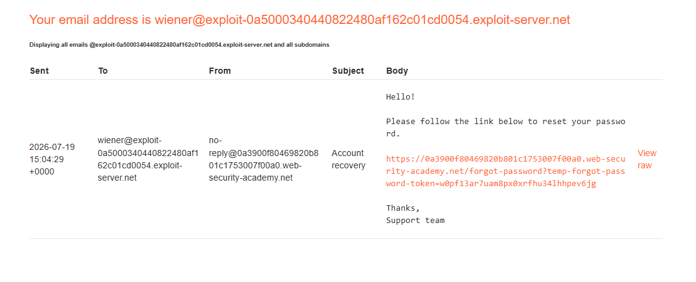

When I clicked the link, I was taken to a page where I could type in a new password.

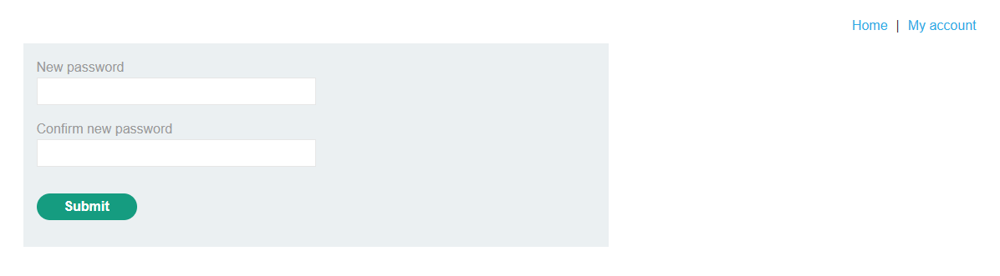

I pulled up the last POST request I made to `/forgot-password` and confirmed that the temporary password token is what verifies the user.

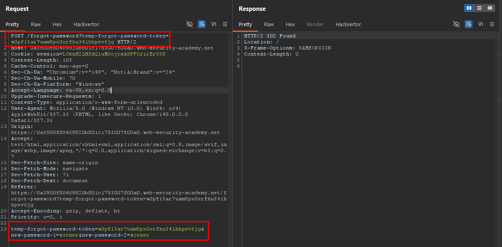

I grabbed the URL from the exploit server.

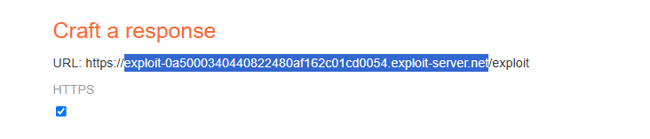

I added an `X-Forwarded-Host` header, and sent the request to see if `X-Forwarded-Host` is supported. If so, I could use it to point the dynamically generated reset link to my own server.

- `X-Forwarded-For` and `X-Forwarded-Host` are both HTTP headers commonly added by proxies or load balancers, but they convey different information.
- `X-Forwarded-For` tells you the original client's IP address. For example: `X-Forwarded-For: 203.0.113.42`
- `X-Forwarded-Host` tells you the original Host header the client requested. For example: `X-Forwarded-Host: example.com`

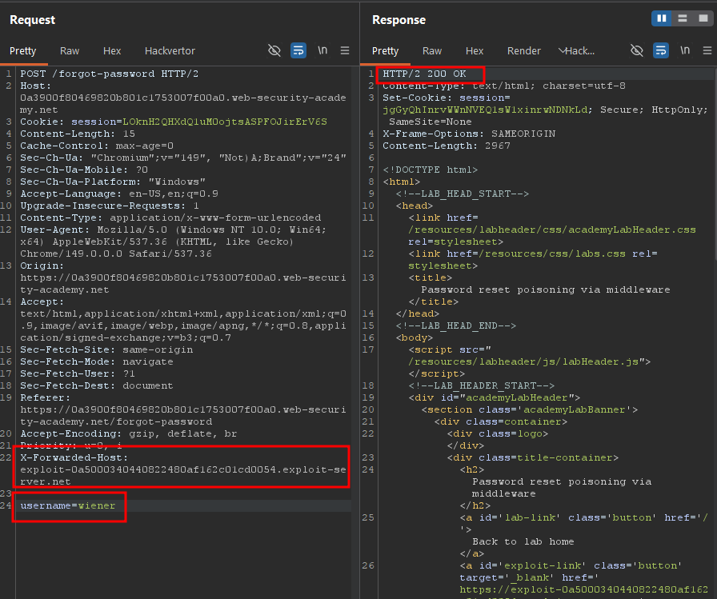

I went  back to my email client and received another email. Notice that the URL of the external link is now different. It reflects the `X-Forwarded-Host` header.

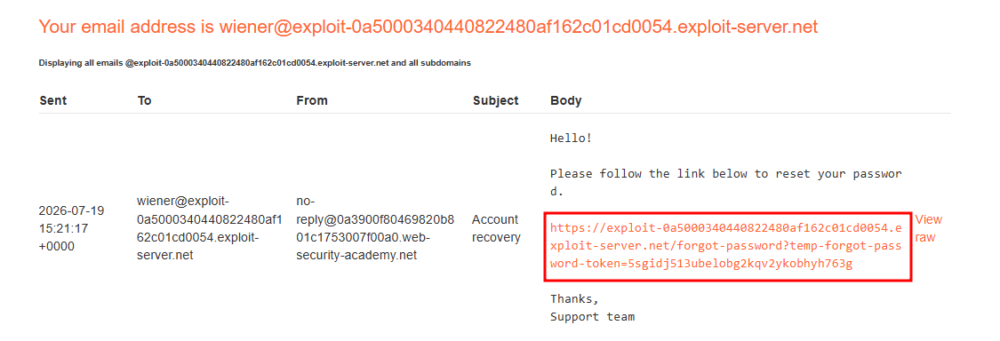

Now I went back to the same POST request, changed the username to `carlos`, and made the request.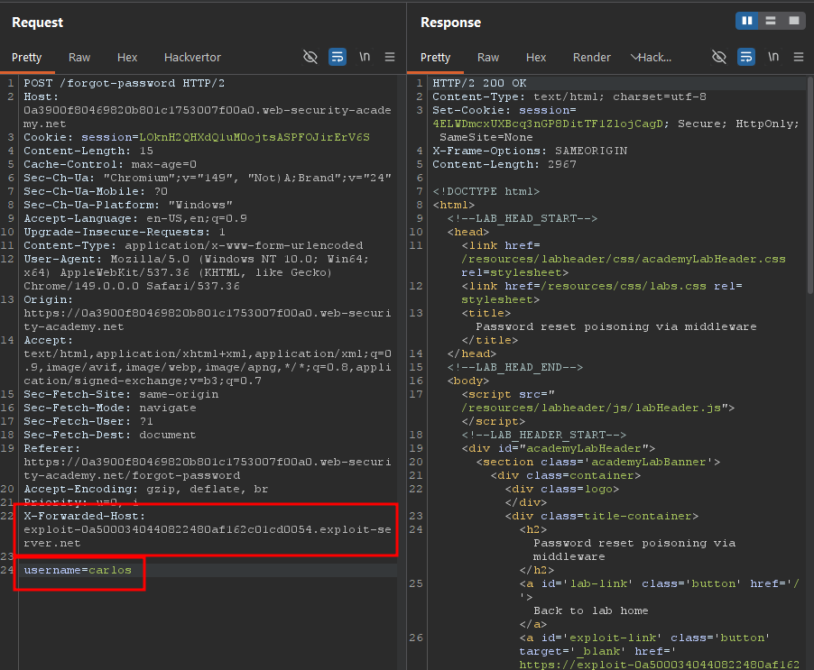

I checked the Access Log to see if there was any request from carlos. I noticed one request originating from a different IP address, a GET request to `/forgot-password`, meaning he must have clicked the password reset link I generated. Notice that this URL also contains the `temp-forgot-password-token` we need to perform the poisoning.

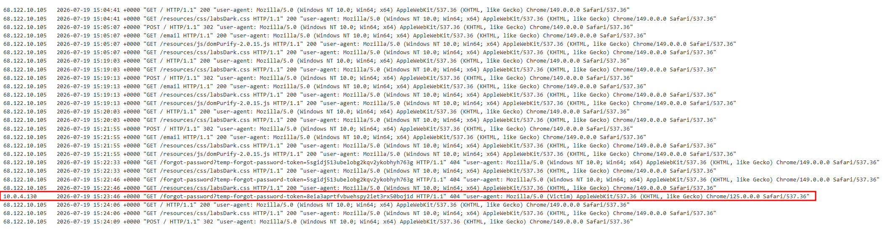

```
/forgot-password?temp-forgot-password-token=8eia3aprtfvbwehspy2iet3rx50boj1d
```

I pulled up the POST request made to `/forgot-password`, replaced the `temp-forgot-password-token` value with carlos's token, and changed his password to `carlos`. The server returned a 302, and following the redirect returned a 200 OK, so there was no error.

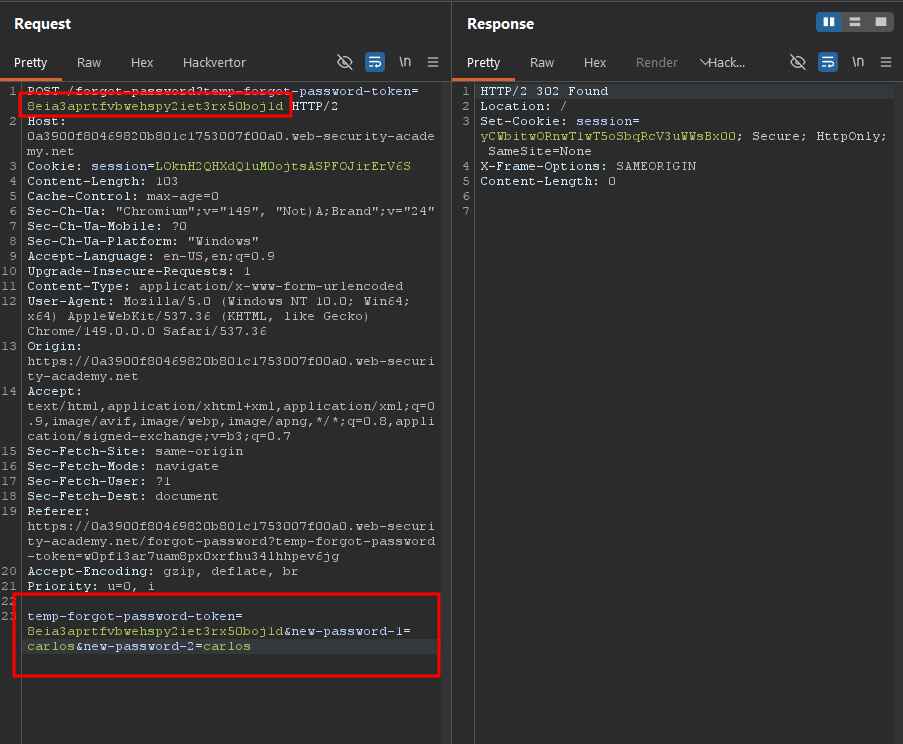

I attempted to authenticate as `carlos:carlos`.

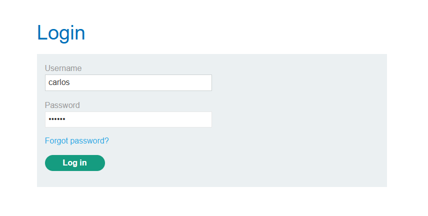

I successfully logged in as `carlos`!

### Solved!

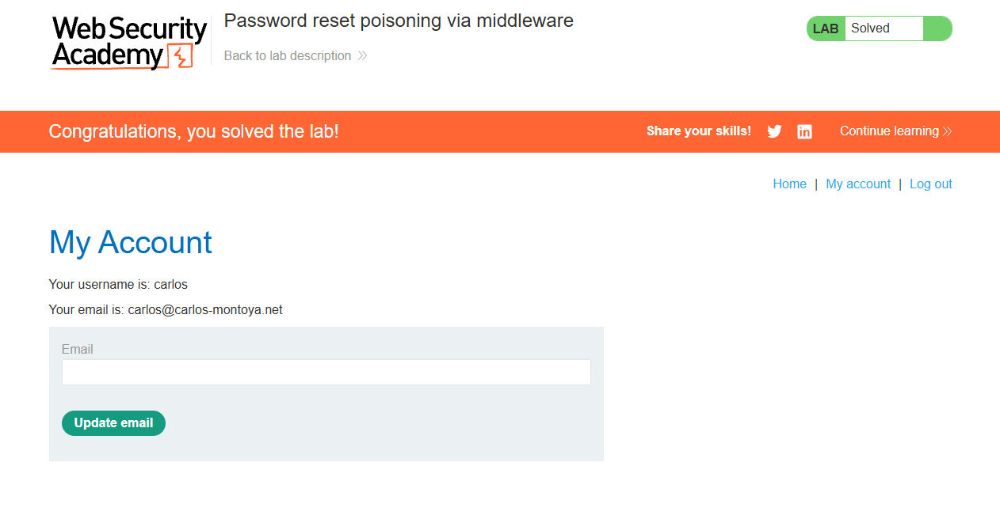