Write-up by wook413

# Lab: Password brute-force via password change

This lab's password change functionality makes it vulnerable to brute-force attacks. To solve the lab, use the list of candidate passwords to brute-force Carlos's account and access his "My account" page.

- Your credentials: `wiener:peter`
- Victim's username: `carlos`
- [Candidate passwords](https://portswigger.net/web-security/authentication/auth-lab-passwords)

---

I went straight to the login page and logged in with the given credentials `wiener:peter`. After logging in as wiener, I noticed the password-change functionality, which is supposedly vulnerable to brute-force attacks.

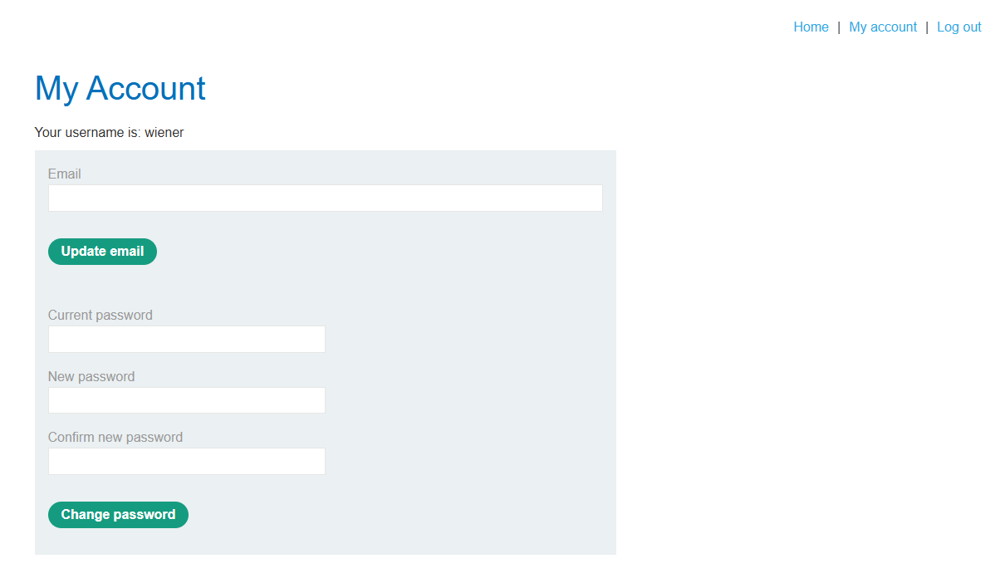

To understand the process, I changed my password.

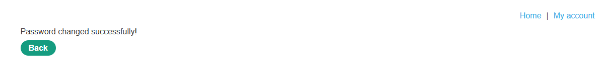

I then tried logging in with the original password, and the app returned "Invalid username or password", confirming the password change had worked.

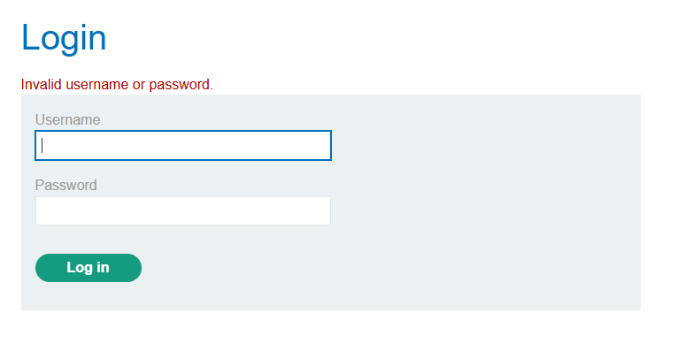

Next, I went to Burp Suite's HTTP History and pulled up the POST request to `/my-account/change-password`. Looking at the body, it has four parameters: `username`, `current-password`, `new-password-1`, and `new-password-2`.

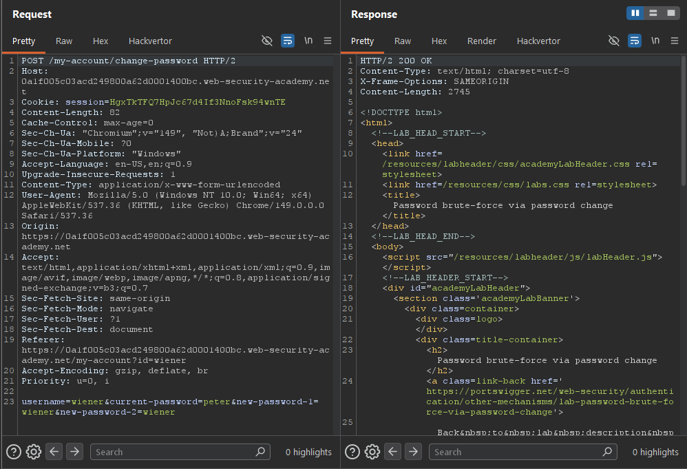

I sent a request with `wook` (an incorrect value) as `current-password`, and `wook2` for both `new-password-1` and `new-password-2`.

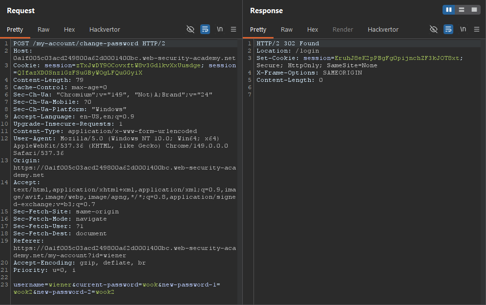

The server responded by locking my account for "too many incorrect login attempts".

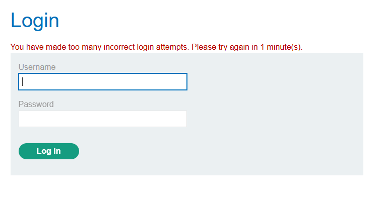

After waiting a minute, I tried again with `wook` as `current-password`, but this time with mismatched new passwords (`wook2` and `wook3`). The account wasn't locked, and the server returned "Current password is incorrect".

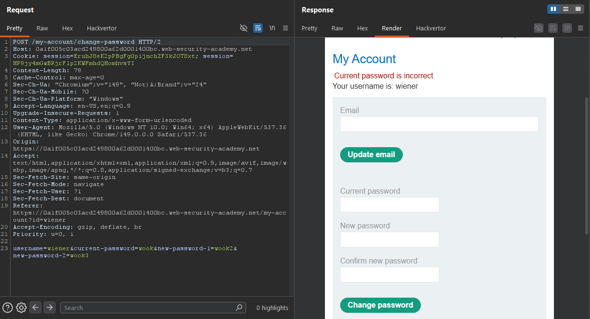

Lastly, I submitted the correct current password (`peter`), but kept the new passwords mismatched (`wook2` and `wook3`). This time the server returned "New passwords do not match".

This confirmed that when `current-password` is correct but the new passwords don't match, the server returns a distinctly different response ("New passwords do not match") than when `current-password` is wrong ("Current password is incorrect"). By deliberately keeping `new-password-1` and `new-password-2` mismatched, I could use this response difference as an oracle to test whether any given `current-password` value was correct.

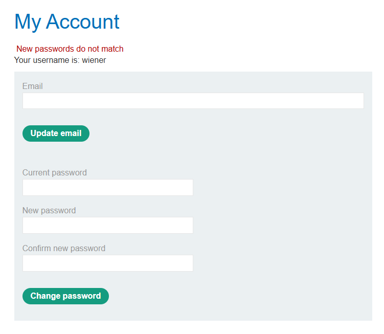

I sent the request to Burp Intruder, changed `username` value to `carlos`, marked `current-password` as the payload position, and kept `new-password-1` and `new-password-2` as `wook2` and `wook3`. I loaded the provided password wordlist as the payload set.

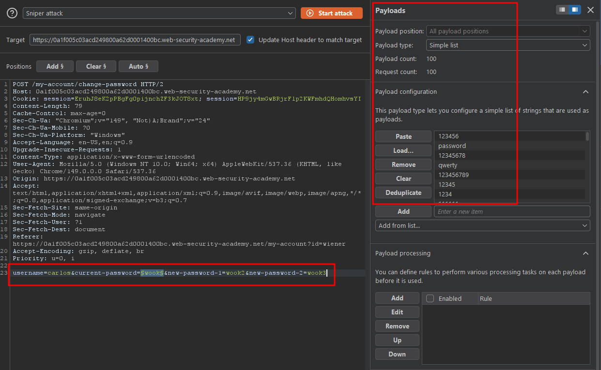

After running the attack, I sorted results by response length. One payload stood out with a length of 4114, while all others were consistently 4117. That request's response was "New passwords do not match", it is the indicator of the correct current password.

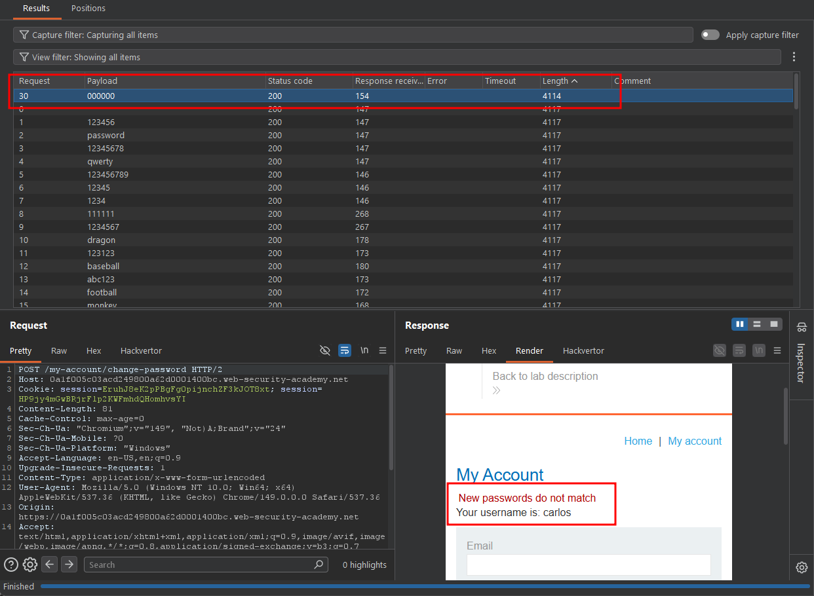

I used that password to log in as carlos.

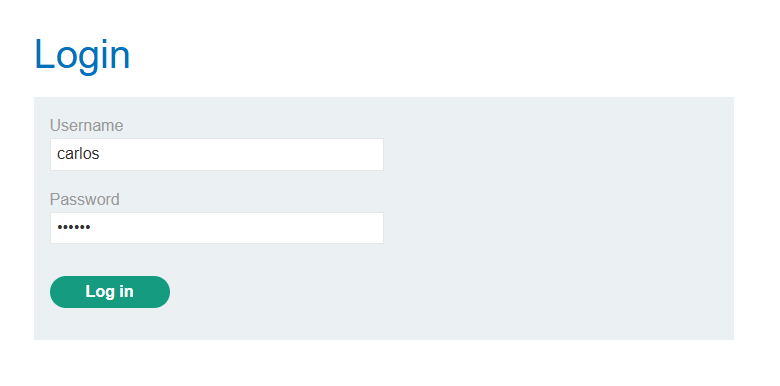

### Solved!

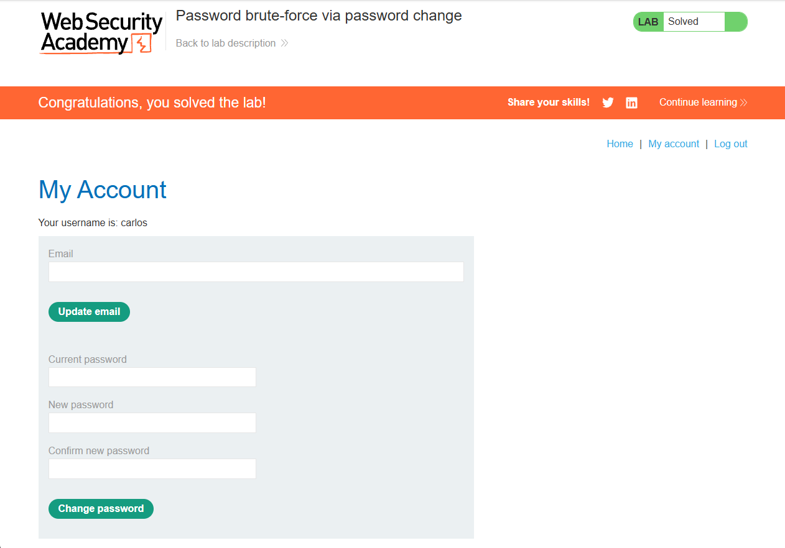

