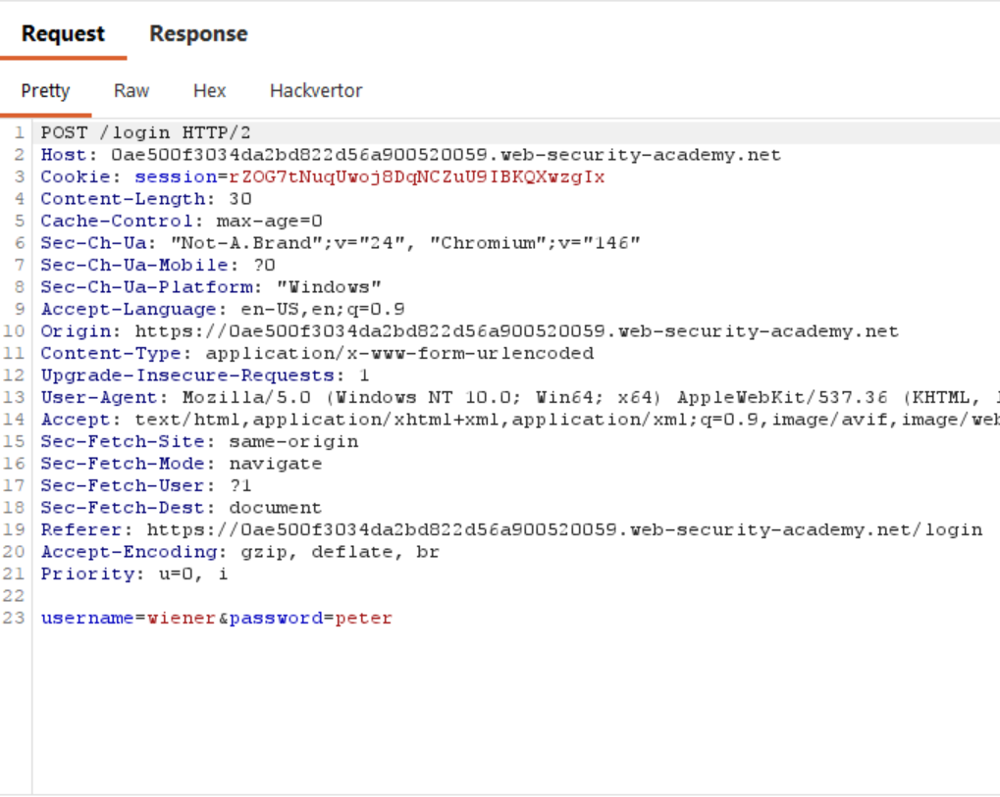
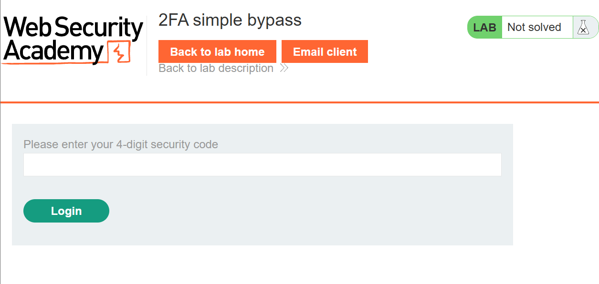
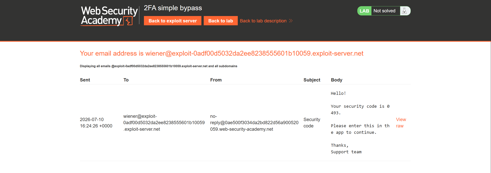
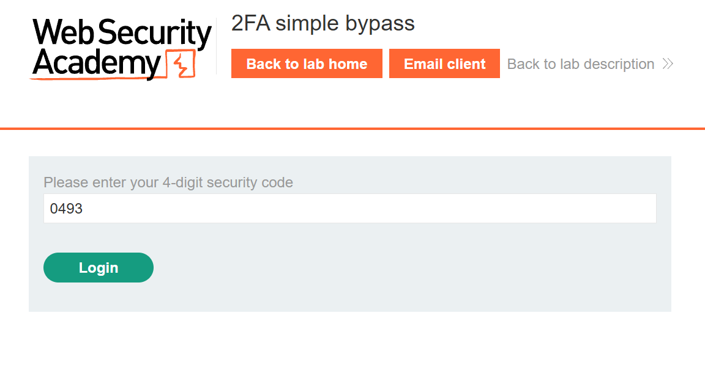
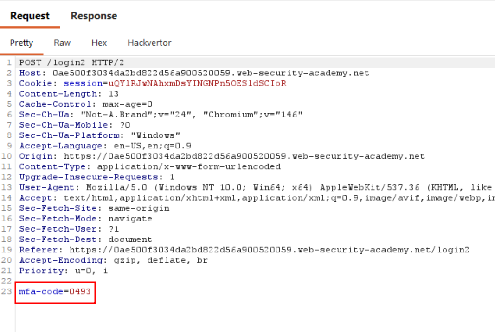
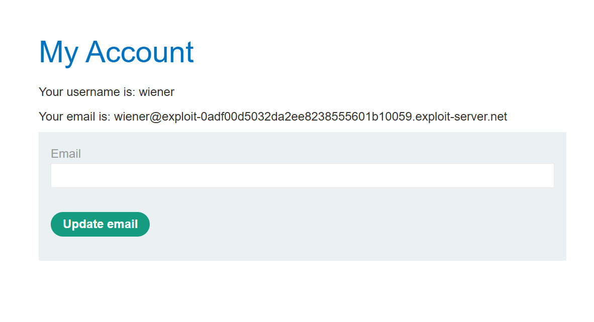
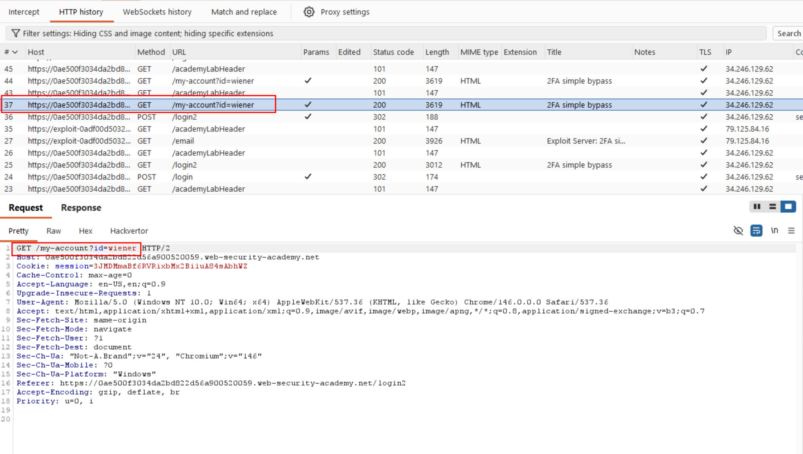
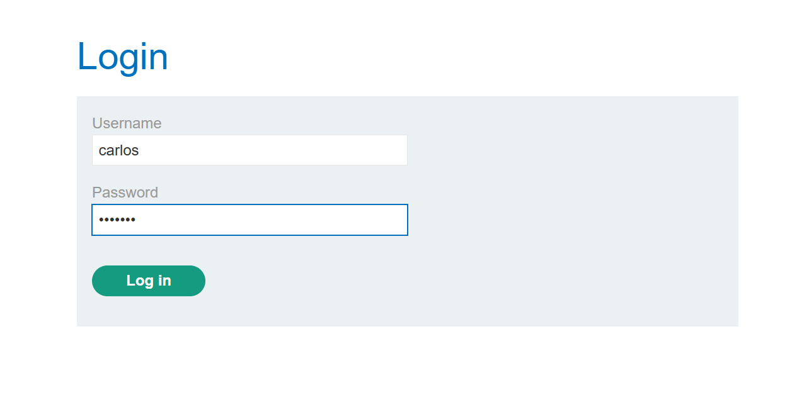
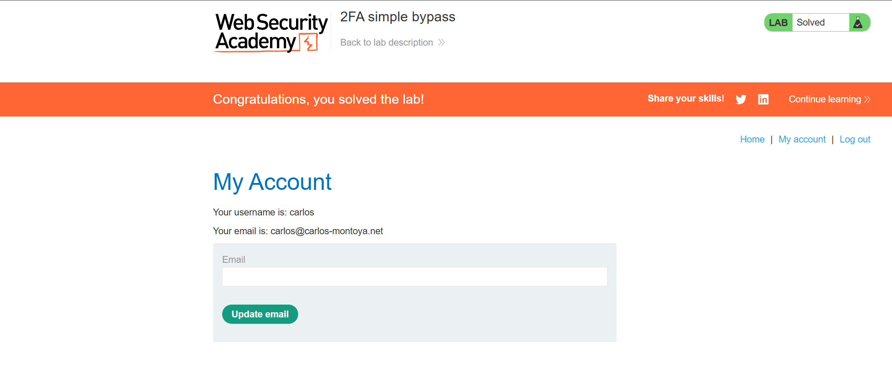

Write-up by wook413

# Lab: 2FA simple bypass

This lab's two-factor authentication can be bypassed. You have already obtained a valid username and password, but do not have access to the user's 2FA verification code. To solve the lab, access Carlo's account page.

- Your credentials `wiener:peter`
- Victim's credentials `carlos:montoya`

---

I opened up the lab and instantly noticed something different from the previous labs: there's a button at the top called **Email client**.

I clicked **My account** and attempted to log in using the provided credentials `wiener:peter`. This sends a POST request to the `/login` endpoint.

After logging in with the credentials, I was prompted to enter a 4-digit security code.

I clicked **Email client** button at the top. Inside the client, I saw an email sent to me containing a 4-digit security code.

I entered the code and clicked **Log in**, which sends a POST request to the `/login2` endpoint with the mfa-code in the body.

I was then finally logged in as wiener.

In Burp, you can see that after logging in, a request was made to the `/my-account` page.

To summarize the authentication flow: submitting credentials via POST to `/login` triggers a 4-digit code sent to the user's email; submitting that code via POST to `/login2` completes login and redirects to `/my-account`.

However, for the **carlos** user, even though we know his password, we can't obtain his 4-digit security code since we don't have access to his inbox. What if we try authenticating with just the username and password, and skip entering the security code step entirely?

I first tried authenticating with the username and password.

As expected, I was prompted to enter the 4-digit security code. This suggested the second factor might only be enforced at the point of navigation rather than validated server-side, so instead of entering the code, I manually navigated to `/my-account` by editing the URL directly and the application let me through without ever validating the 2FA step.

### Solved!

