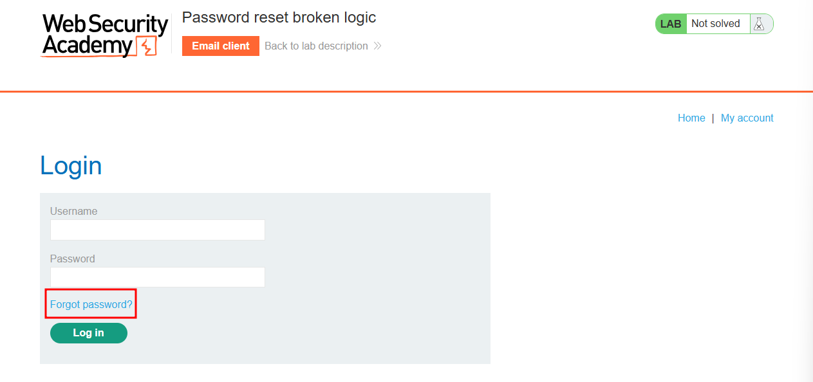
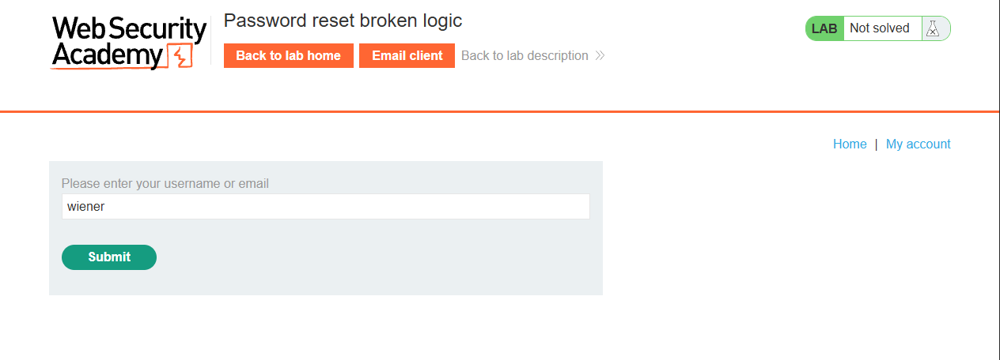
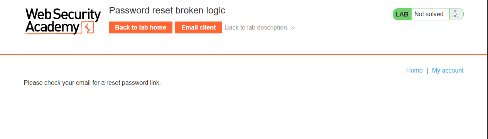
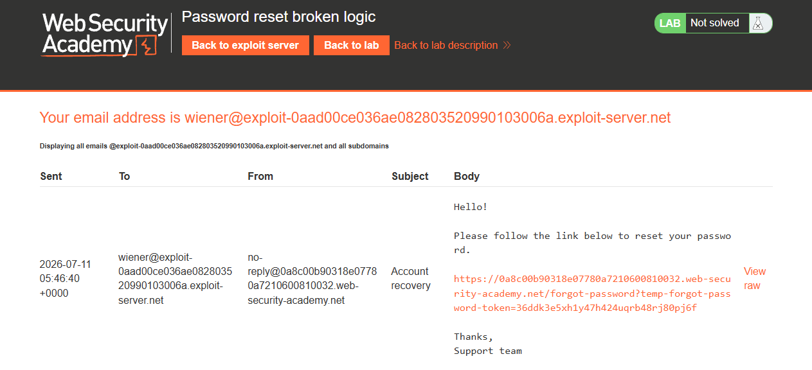
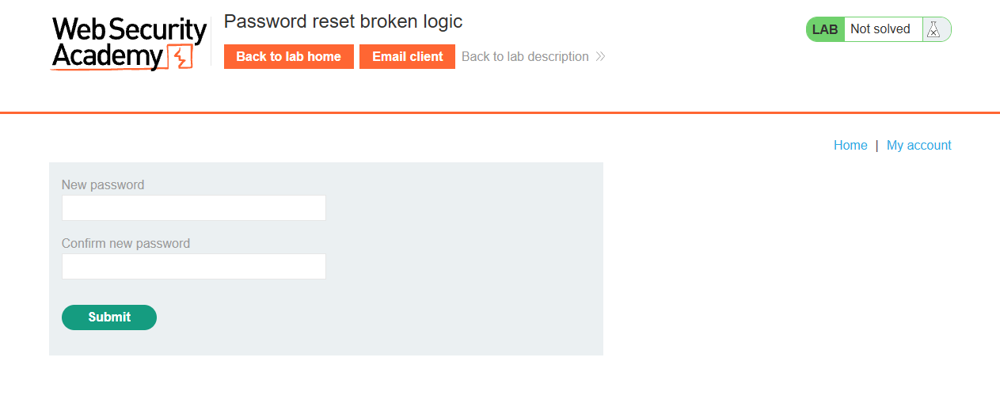
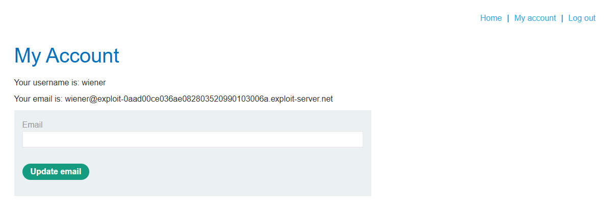
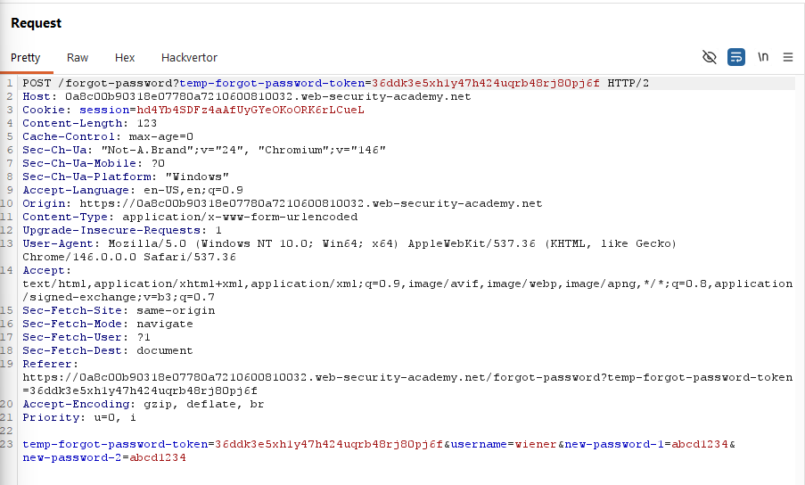
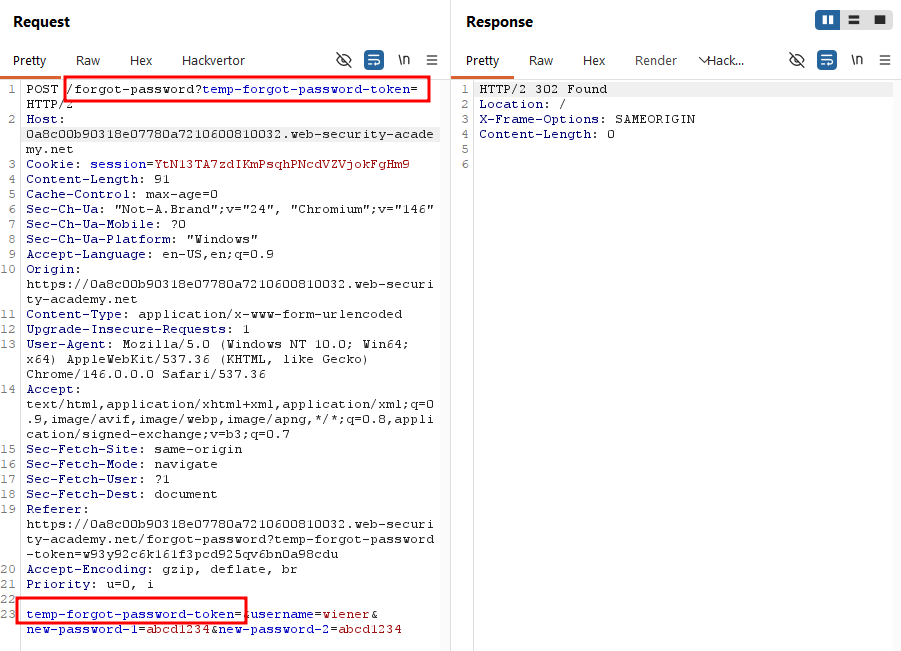
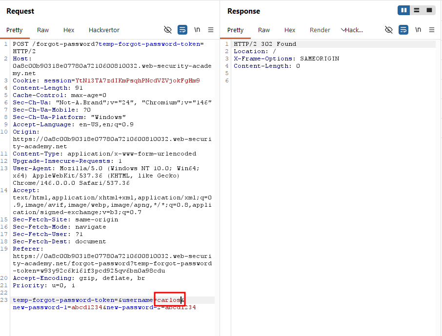
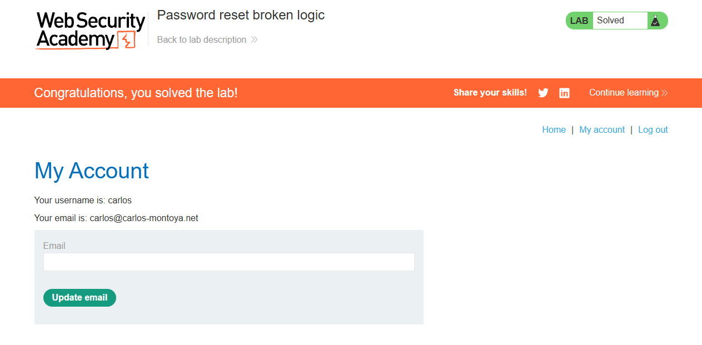

Write-up by wook413

# Lab: Password reset broken logic

This lab's password reset functionality is vulnerable. To solve the lab, reset Carlos' password then log in and access his "My account" page.

- Your credentials `wiener:peter`
- Victim's username: `carlos`

---

Since the lab indicated that the password reset functionality was vulnerable, I went straight to the login page and saw a "**Forgot password?**" button in the login form.

Clicking it prompted me to enter a username or email, so I typed in `wiener`.

It then told me to check my email inbox for a reset password link.

In the email client, I found an email containing the reset password link.

Clicking the link prompted me to enter a new password.

I confirmed I could log in with the new password.

After completing the password reset process, I went back to Burp Suite and reviewed the request and response for each step. I noticed the POST request for resetting the password included a `temp-forgot-password-token` parameter, along with the username and new password.

I tried removing the value of the `temp-forgot-password-token` parameter from both the URL and the request body, and the request still returned a 302 status code, indicating a successful password reset, which I confirmed.

Since the request succeeded even without the token value, I changed the username from `wiener` to `carlos` and sent the exact same request.

I tried logging in as `carlos` with the new password, and I was able to authenticate as `carlos`!

### Solved!

