Write-up by wook413

# Lab: Username enumeration via subtly different responses

This lab is subtly vulnerable to username enumeration and password brute-force attacks. It has an account with a predictable username and password, which can be found in the following wordlists:

- [Candidate usernames](https://portswigger.net/web-security/authentication/auth-lab-usernames)
- [Candidate  passwords](https://portswigger.net/web-security/authentication/auth-lab-passwords)

To solve the lab, enumerate a valid username, brute-force this user's password, then access their account page.

---

Since the lab directly told me what functionality is vulnerable on this application, I went straight to the "My account" page and typed in random credentials `wook:wook`.

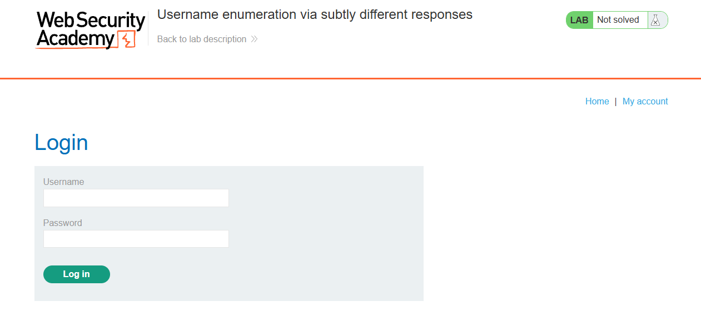

In Burp, I saw that I made a POST request to the `/login` endpoint and got a 200 OK, but the response body said "**Invalid username or password.**"

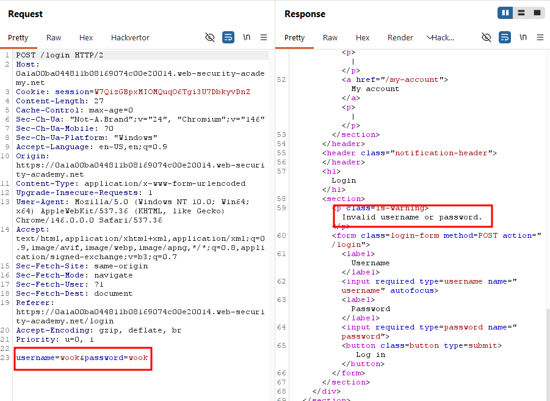

I sent this request to Intruder and marked the username value as the target position, then pasted the provided wordlist of usernames as the payload.

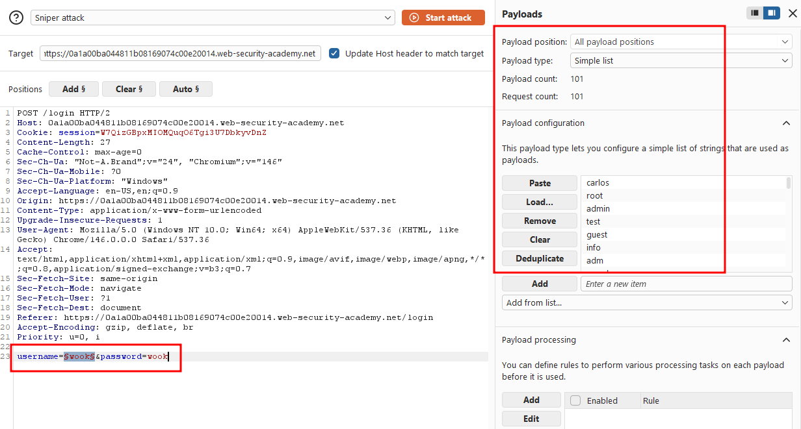

I ran the attack, it finished quickly, but when I sorted the results by length, no single response stood out as different from the rest.

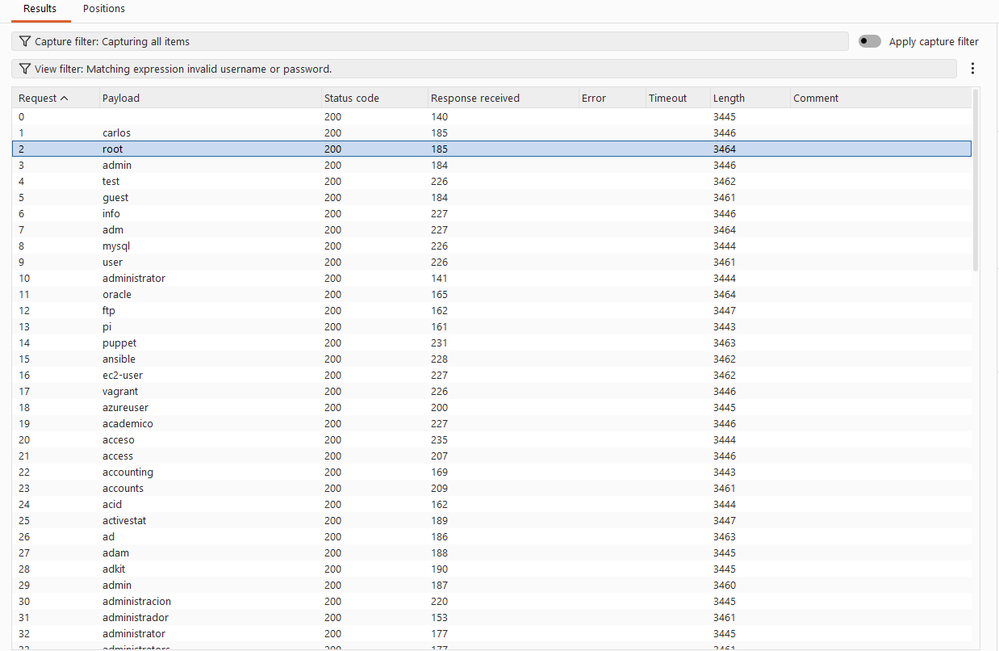

I pulled up one of the responses and saw it contained "**Invalid username or password.**" in the body, just like when I typed in `wook:wook`.

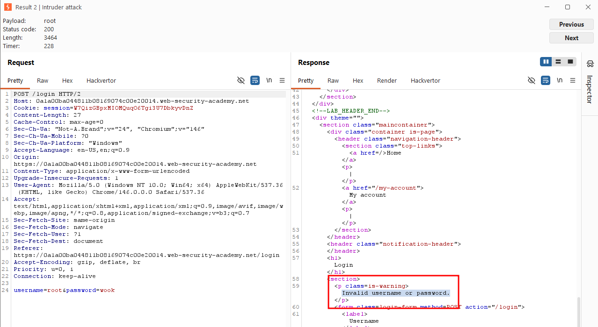

I copy-pasted that exact sentence into the response filter and tried to filter out responses that didn't match it.  I checked "**Case sensitive**" and **"Negative search"** so it would only show me responses that differed.

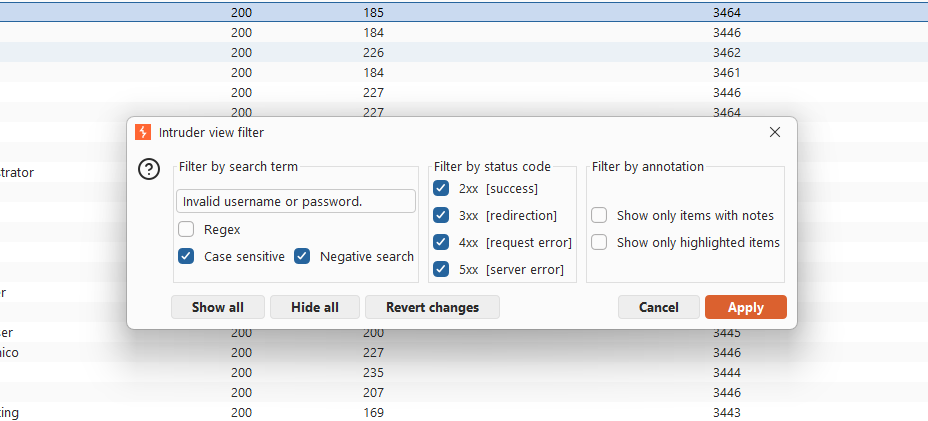

When I clicked **Apply**, it displayed only one result.

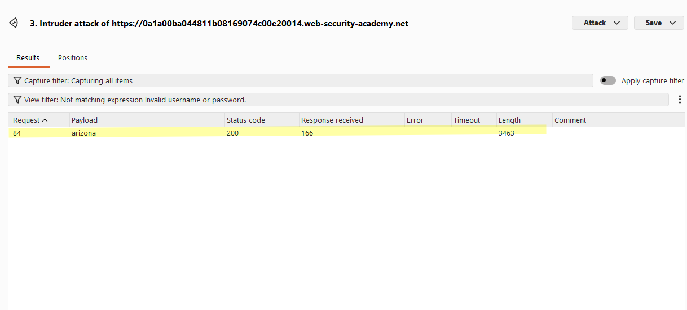

I pulled it up and noticed the response for the username **arizona** returned "**Invalid username or password**" without a period at the end. I was confident this was the valid username, since there was no other reason for this one response to differ.

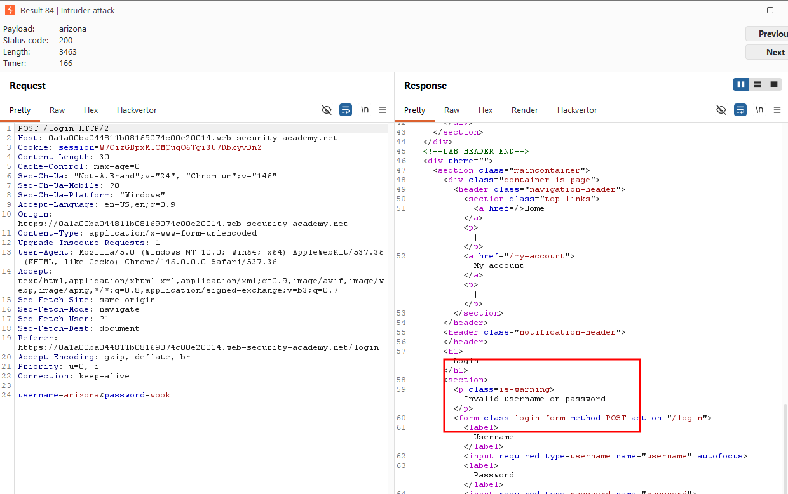

Now that I had the username, I moved on to finding the password. I marked the password value as the target position and used the provided wordlist of passwords as the payload.

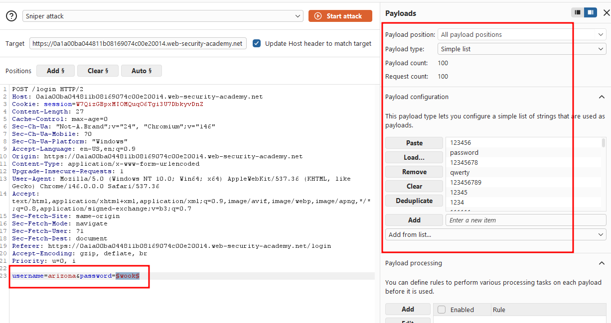

The attack finished quickly, and unlike the username results, the difference was obvious when I sorted by length. One payload had a noticeably smaller response length and a 302 status code, while every other response was a 200 OK.

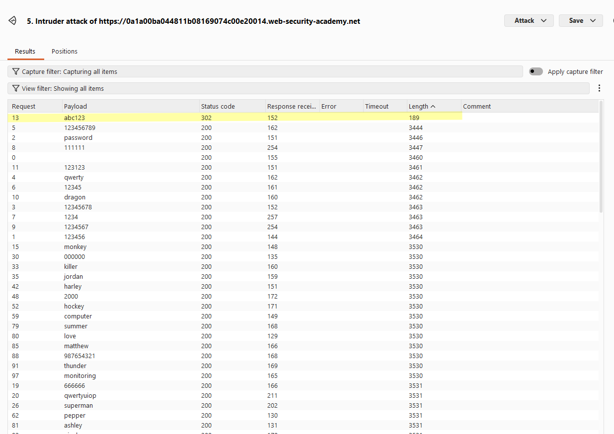

I authenticated as **arizona** using that password.

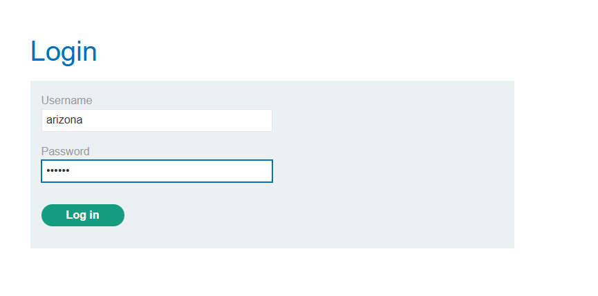

### Solved!

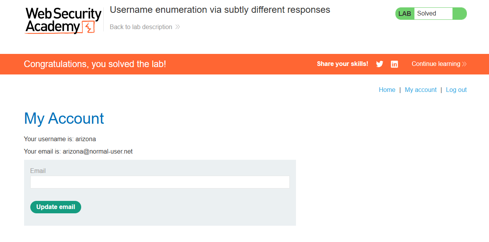