Write-up by wook413

# Lab: Username enumeration via response timing

This lab is vulnerable to username enumeration using its response times. To solve the lab, enumerate a valid username, brute-force this user's password, then access their account page.

- Your credentials `wiener:peter`
- [Candidate usernames](https://portswigger.net/web-security/authentication/auth-lab-usernames)
- [Candidate passwords](https://portswigger.net/web-security/authentication/auth-lab-passwords)

### Hint

To add to the challenge, the lab also implements a form of IP-based brute-force protection. However, this can be easily bypassed by manipulating HTTP request headers.

---

After opening the lab, I went straight to the login page.

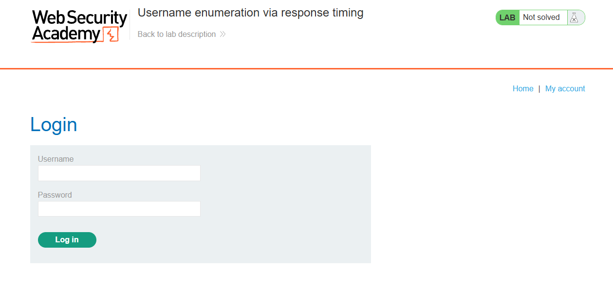

I sent the login request to Intruder.

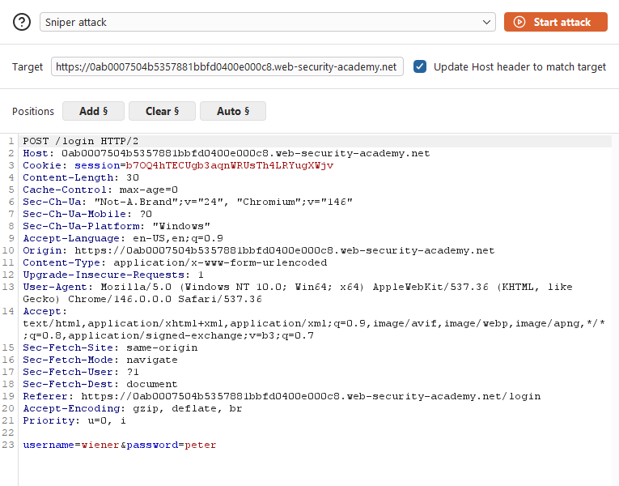

I set the username parameter as the payload position and loaded the provided username wordlist as the payload set.

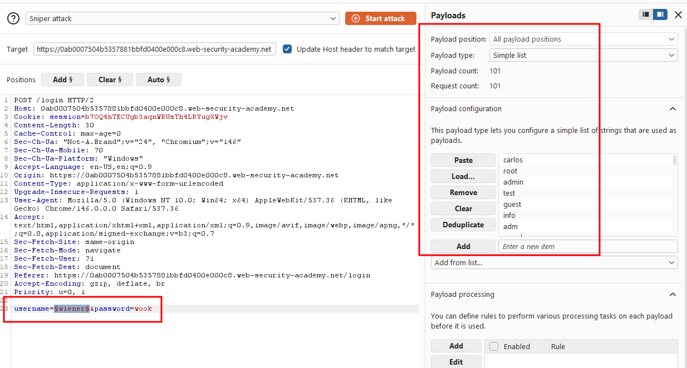

Almost every response came back with "**You have made too many incorrect login attempts. Please try again in 30 minute(s)**".

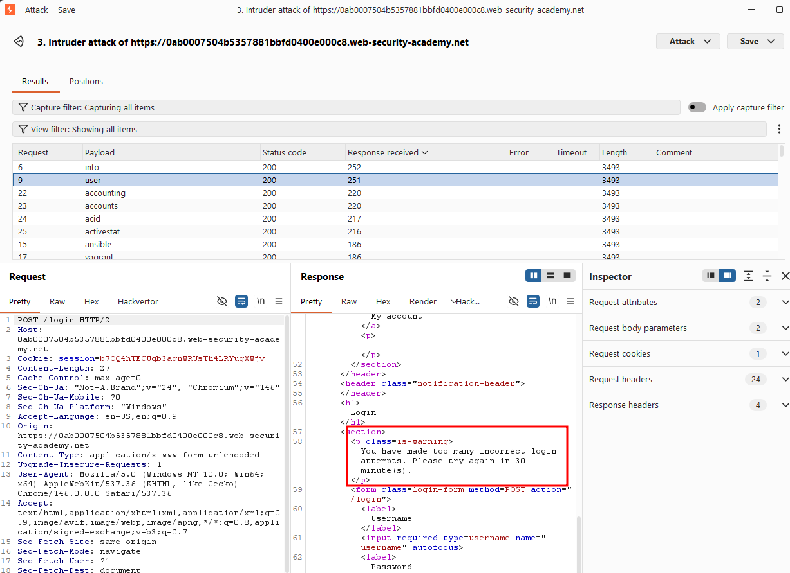

I took the request to Repeater to investigate further. I added an `X-Forwarded-For` header to the request, and the block message disappeared.

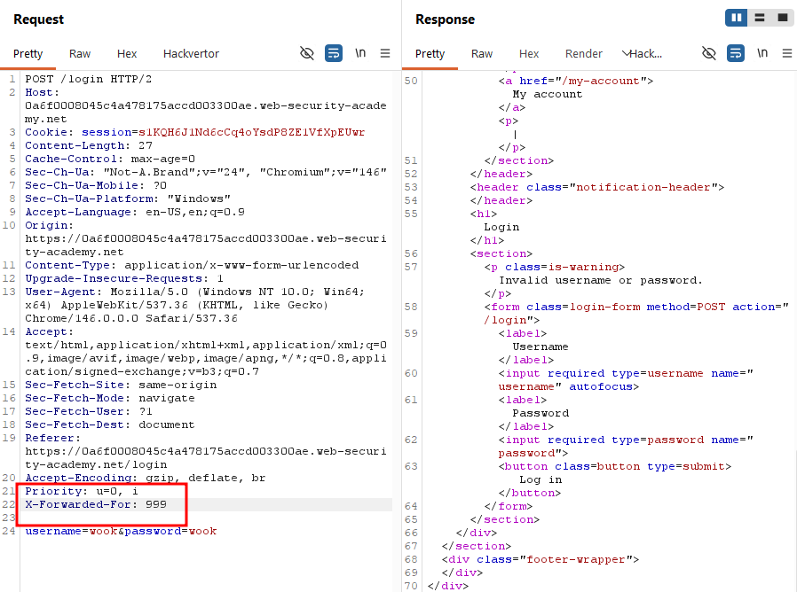

However, I found that after 3 invalid login attempts from the same `X-Forwarded-For` value, that "IP" got blocked again meaning I'd need to rotate the header value to keep bypassing the block.

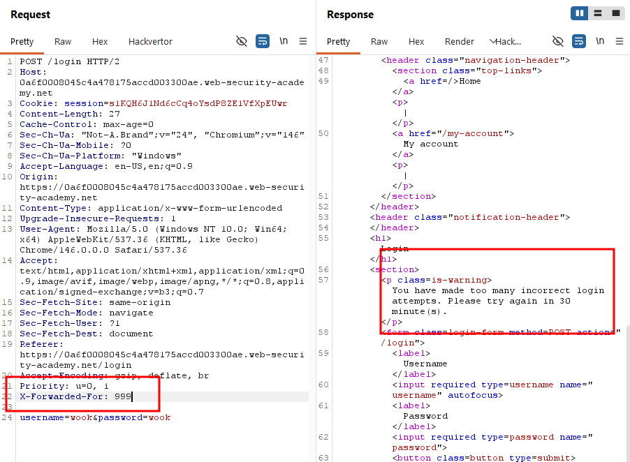

With a way to bypass the block, my next step was finding a valid username. I first tried an invalid username `wook413`, which returned a response time of 203 ms.

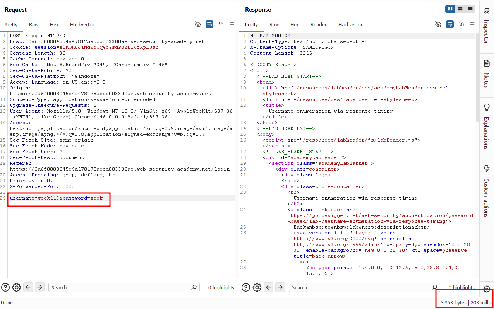

I then tried the known-valid username `wiener`, which returned a response time of 158 ms.

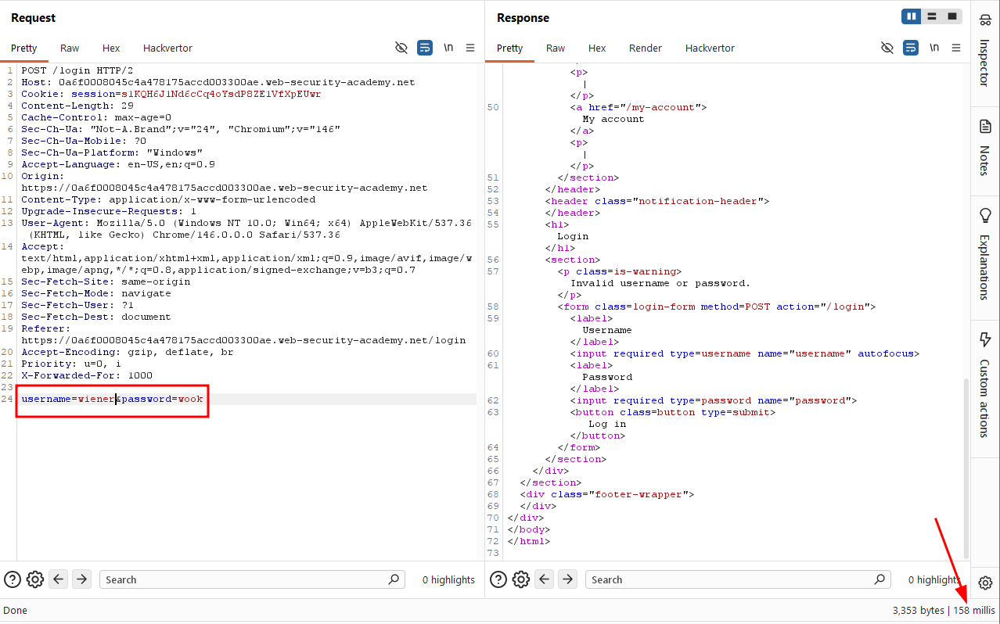

When I significantly increased the length of the password value, the response time for `wiener` rose to 253 ms.

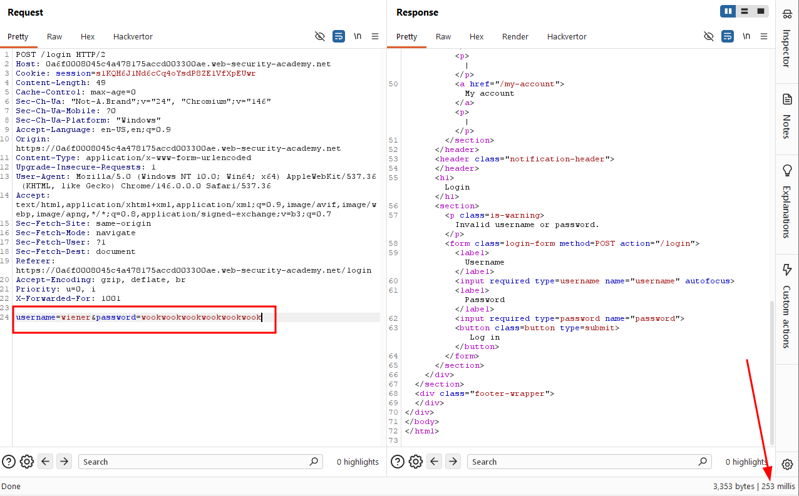

Increasing it further pushed the response time to 667 ms. This confirmed a timing pattern: for a valid username, the server takes measurably longer to process a long password (since it actually runs the password through the hashing function), while for an invalid username, the server short-circuits and skips that steps regardless of password length.

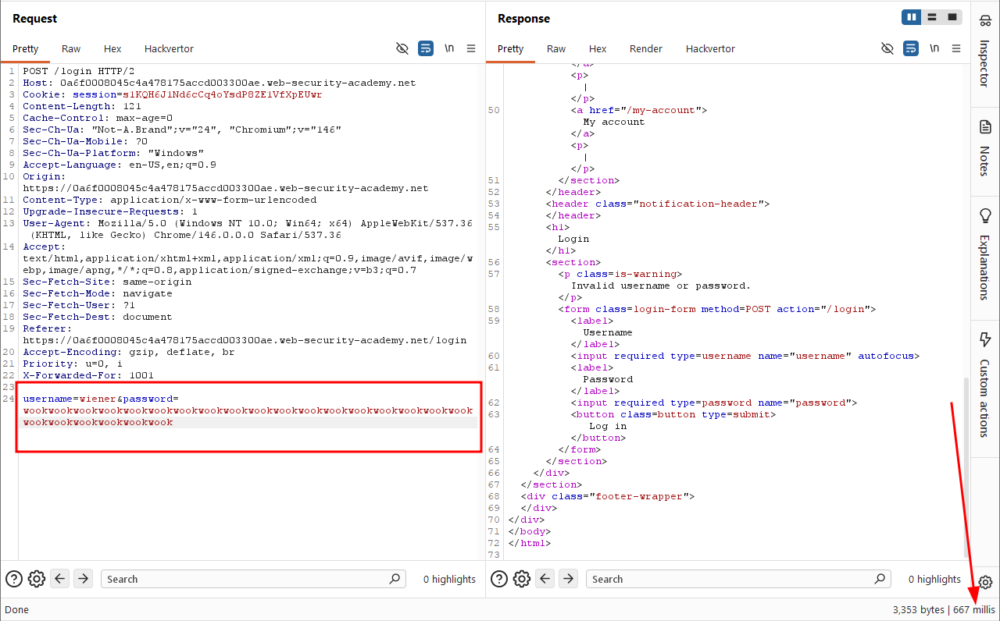

With a way to distinguish valid from invalid usernames, I went back to Intruder and switched the attack type to **Pitchfork**, since I now needed to vary both the username and the `X-Forwarded-For`  value simultaneously. I set the `X-Forwarded-for` payload to numbers 1-101, and used the provided username wordlist for the username field. I also set the password field to single very long value to maximize the timing difference.

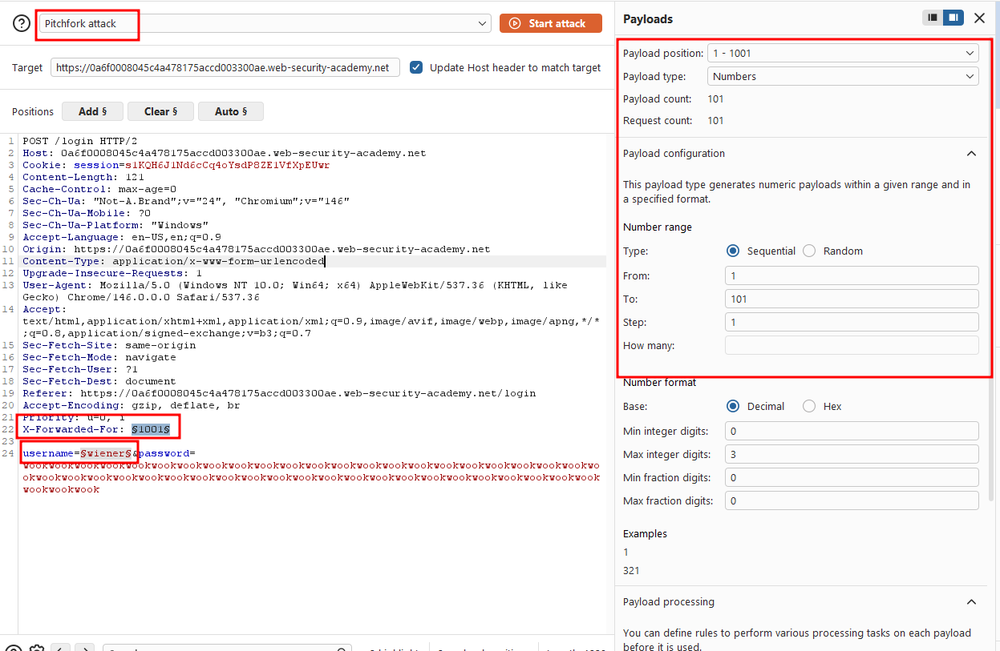

I ran the attack, and it completed quickly. One payload stood out with a noticeably longer response time: `info`. Based on my earlier theory, this had to be the valid username.

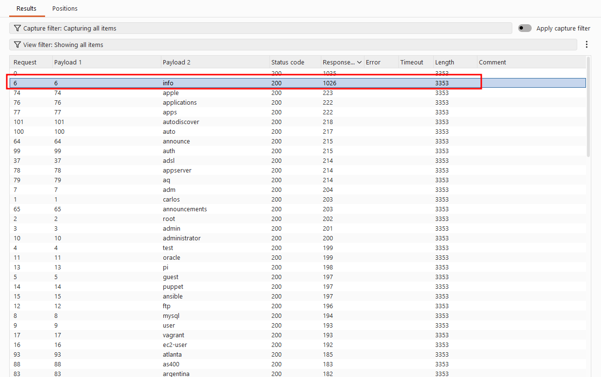

With a candidate valid username, I switched the payload position from username to password and loaded the provided password wordlist. I again varied `X-Forwarded-For` to avoid getting blocked, this time using numbers 102-201.

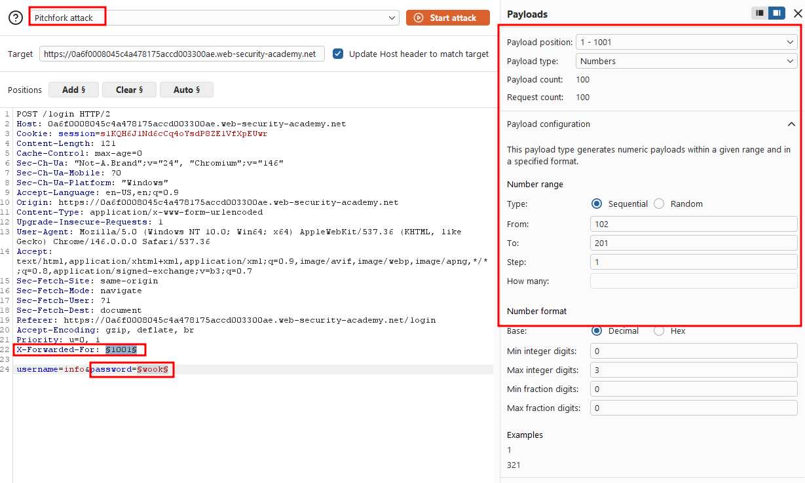

I ran the attack and sorted the results by status code. Only one request returned a `302`, revealing the correct password for `info`.

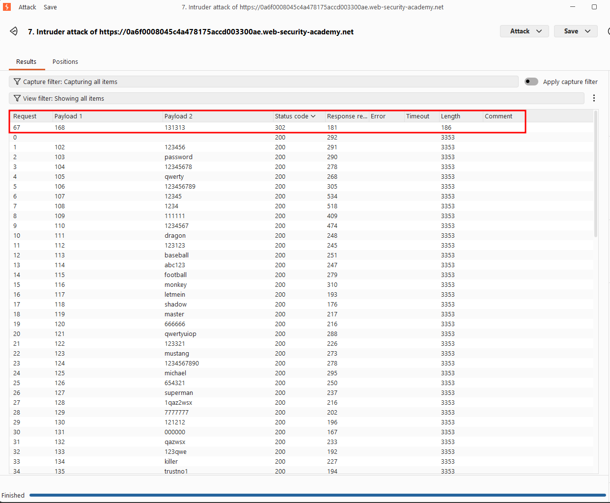

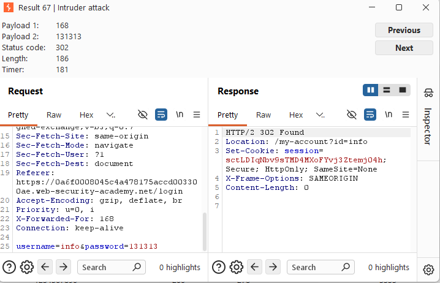

I went back to the login page, entered `info:131313`, and intercepted the request. I added `X-Forwarded-For: 413` (an unused value) since my IP was still blocked from earlier attempts.

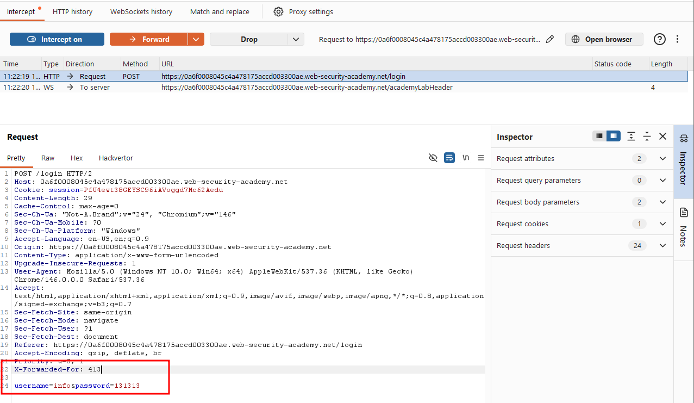

I forwarded the request and successfully authenticated as `info`.

### Solved!

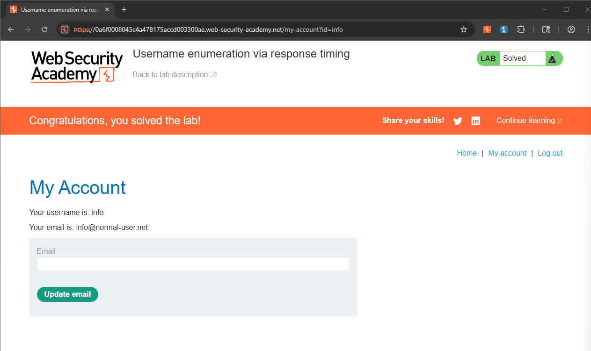

