Write-up by wook413

# Lab: Broken brute-force protection, IP block

This lab is vulnerable due to a logic flaw in its password brute-force protection. To solve the lab, brute-force the victim's password, then log in and access their account page.

- Your credentials `wiener:peter`
- Victim's username `carlos`
- [Candidate passwords](https://portswigger.net/web-security/authentication/auth-lab-passwords)

### Hint

Advanced users may want to solve this lab by using a macro or the Turbo Intruder extension. However, it is possible to solve the lab without using these advanced features.

---

I tried to authenticate using the credentials `wiener:peter`.

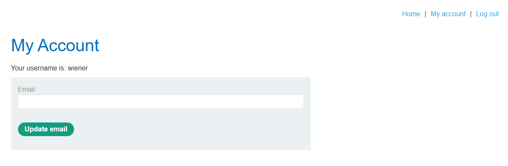

I then tried to authenticate as `wook`, which is an invalid username. The server returned "Invalid username".

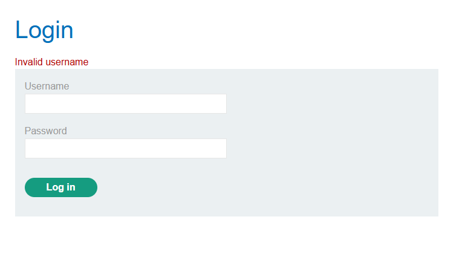

I then tried to authenticate as `carlos`, which is a valid username, but I don't know the password. The server returned "Incorrect password". This is a vulnerability in itself, since it's enough to let us infer whether a username exists.

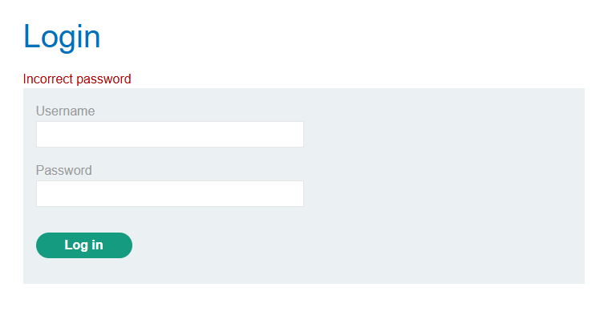

However, when I entered incorrect credentials three times or more, the server returned "You have made too many incorrect login attempts. Please try again in 1 minute(s)."

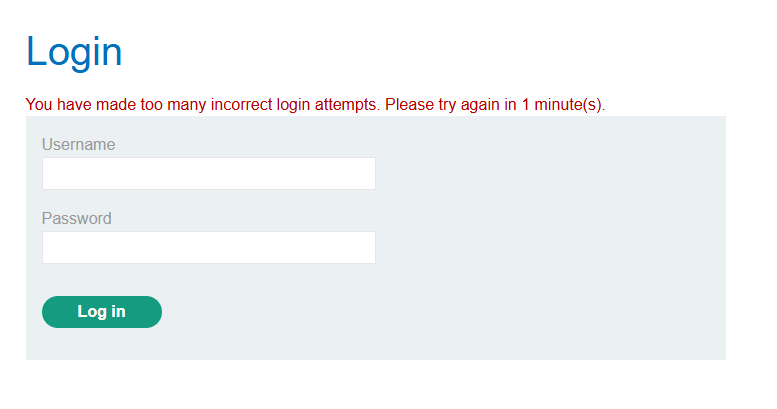

I then logged in with the valid credentials `wiener:peter` again.

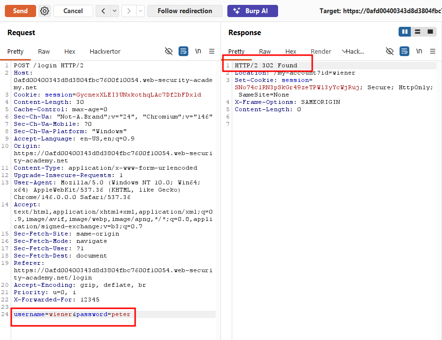

I noticed that once you log in with a valid set of credentials, the counter tracking failed attempts resets. When I then tried to authenticate as `carlos` with a random password, the previous lockout message was gone, and it simply returned "Incorrect password" again.

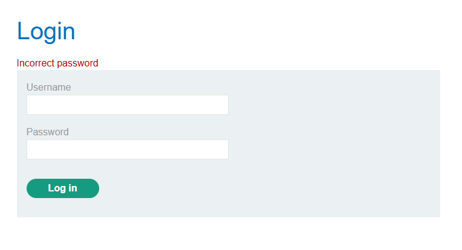

I realized I could take advantage of this logic flaw. I sent the request to Burp Intruder and set the attack type to **Pitchfork**, making both the username and password fields as payload positions.

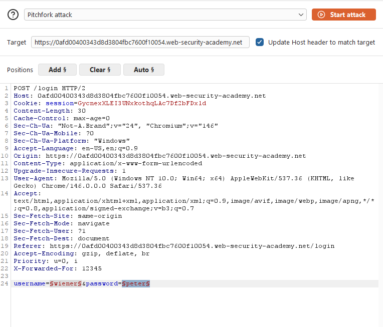

I then went to the **Resource pool** tab and set the maximum concurrent requests to 1, to ensure requests were sent to the server sequentially in the correct order.

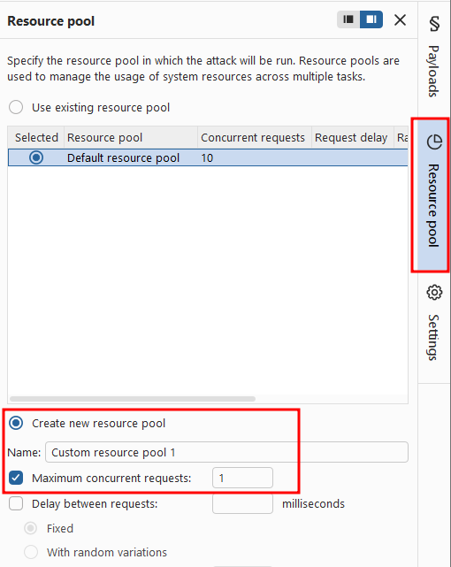

I gave Claude the provided password wordlist and asked it to generate another wordlist with **"peter"** inserted between every word, which it did.

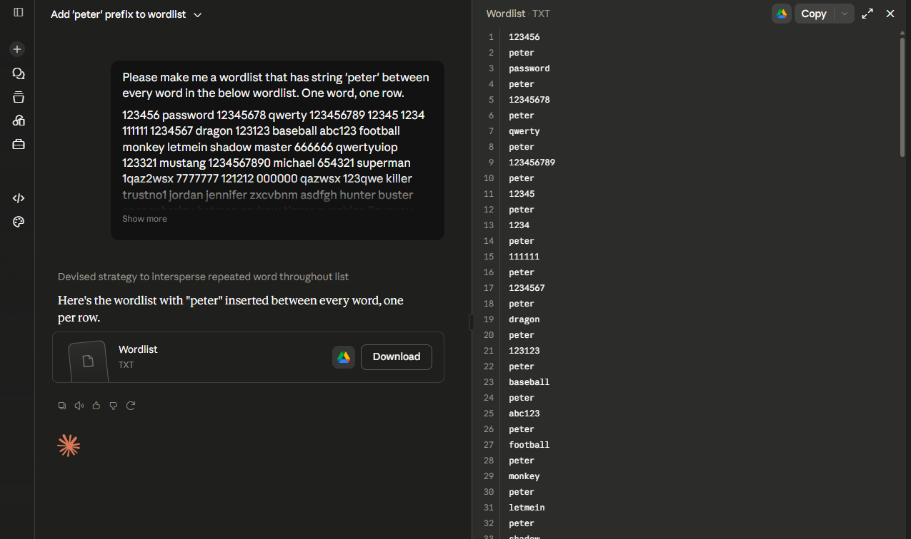

The resulting password wordlist had a final length of 199 entries.

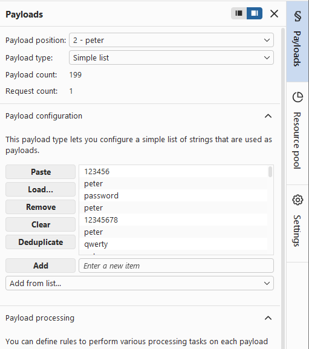

I then asked Claude to generate a wordlist alternating between **"carlos"** and **"wiener"**, repeated 199 times, to align with the password wordlist.

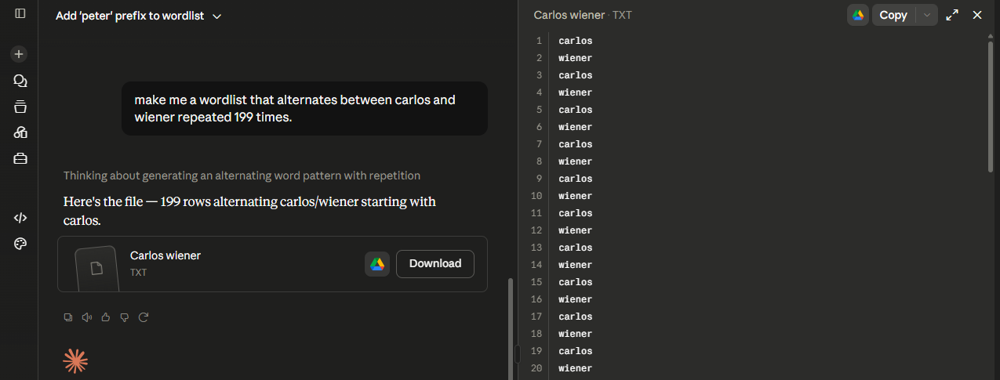

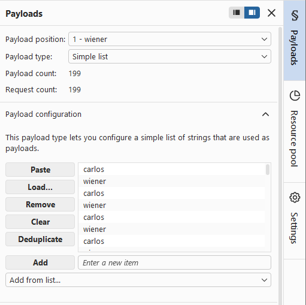

I loaded both wordlists into the corresponding payload sets and ran the attack, alternating valid logins with `wiener:peter` between each guess against carlos to reset the failed-attempt counter before it could trigger a lockout.

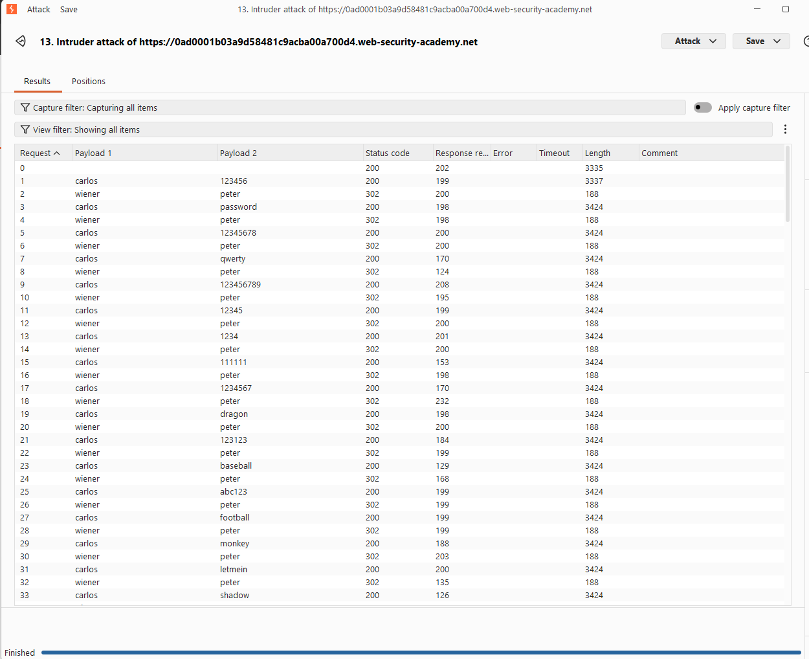

When the attack finished, I sorted the results by status code and found a single response with a 302 status where the username payload was carlos. This revealed carlos's password: `jennifer`.

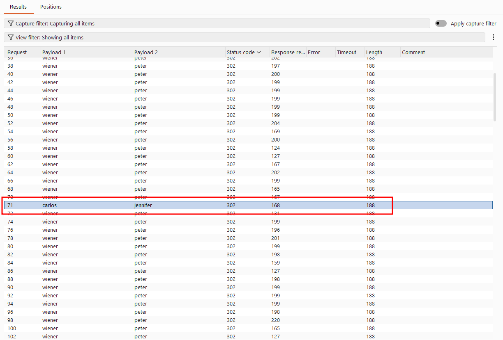

I successfully authenticated as carlos using that password.

### Solved!

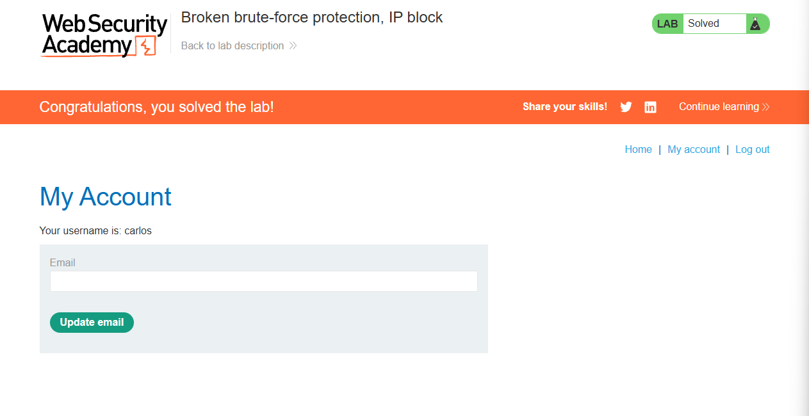